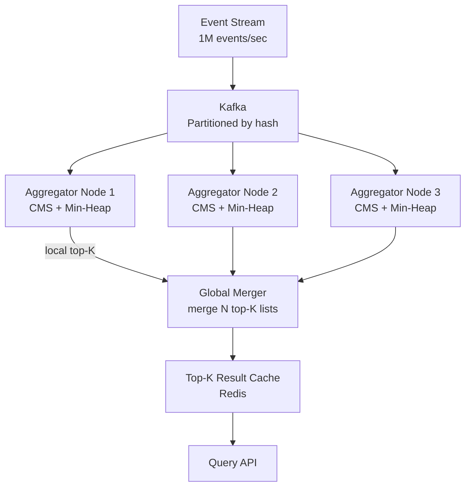

# Design a Top-K Heavy Hitters System

**Difficulty**: 🔴 Advanced
**Reading Time**: Coming Soon
**Interview Frequency**: High

---

> 🚧 **Full article coming soon.** This stub gives you the essentials to start thinking about this problem.

---

## The Core Problem

Finding the top 100 trending hashtags from 1 million tweets per second in real-time is impossible to solve exactly without storing all events — a hash map of all hashtags would require terabytes of memory. The system must use probabilistic data structures to approximate counts within acceptable error margins.

## Functional Requirements

- Return top K (e.g., 100) most frequent items in a sliding time window
- Update results within 30 seconds of trending changes
- Support different time windows: last 1 min, 1 hour, 24 hours
- Items can be hashtags, search queries, URLs, or product IDs

## Non-Functional Requirements

| Requirement | Target |
|-------------|--------|
| Input throughput | 1M events/sec |
| Result freshness | < 30 seconds lag |
| Accuracy | Top-K correct with ±5% count error |
| Memory | < 1GB per aggregation node |

## Back-of-Envelope Estimates

- **Event rate**: 1M events/sec × 50 bytes per event = 50MB/sec ingest
- **Exact count map**: 100M unique hashtags × 16 bytes = 1.6GB just for hash map — too large per node
- **Count-Min Sketch**: width=10,000 × depth=7 × 4 bytes = 280KB achieves ±5% error for 1M items

## Key Design Decisions

1. **Count-Min Sketch + Min-Heap** — use CMS to count all items in O(1) memory regardless of cardinality; maintain a min-heap of size K to track current top-K candidates; periodically flush and re-sort.
2. **Two-Phase Aggregation** — each node counts locally for 1 minute using CMS; local top-K results fan-in to aggregator node which merges and returns global top-K; reduces network traffic from 1M/sec to K results/min.
3. **Time Decay Weighting** — trending ≠ most total mentions; apply exponential decay so recent events count more than old ones; this surfaces "breaking" trends over entrenched ones.

## High-Level Architecture

## Top Interview Questions for This Problem

| Question | Tests |
|----------|-------|
| Why can't you use a simple HashMap to count all items exactly? | Memory constraints, cardinality |
| How does Count-Min Sketch work and what is its error guarantee? | Probabilistic data structures |
| How do you define "trending" vs "most popular"? | Time decay, velocity vs volume |

## Related Concepts

- [Bloom Filters and probabilistic data structures](../../../05-distributed-systems/concepts/bloom-filters)
- [Kafka partitioning for parallel stream processing](../05-infrastructure/distributed-messaging)

---

*📚 Full deep-dive with multiple approaches, trade-off tables, and pseudocode coming soon.*
