# Design a URL Shortener (TinyURL / bit.ly)

> **Difficulty**: 🟢 Beginner — Best first system design problem. Introduces hashing, caching, DB design, and scale trade-offs in a familiar context.

---

## Table of Contents

| # | Section | Core Concept |
|---|---------|-------------|
| 1 | [5-Minute Mental Model](#5-minute-mental-model) | Happy path sequence |
| 2 | [Why This is Harder Than It Looks](#why-this-is-harder-than-it-looks) | Failure modes |
| 3 | [Requirements](#functional--non-functional-requirements) | What we're building |
| 4 | [Capacity Estimation](#capacity-estimation) | The math you need |
| 5 | [ID Generation: 3 Approaches](#the-core-problem-how-do-you-generate-a-short-code) | Hash vs Counter vs Key Service |
| 6 | [System Architecture](#system-architecture-deep-dive) | Full component diagram |
| 7 | [Database Design](#database-design) | Schema decisions |
| 8 | [Caching Strategy](#caching-strategy) | How to serve 115K RPS |
| 9 | [Problems at Scale](#problems-at-scale) | What breaks and how to fix it |
| 10 | [301 vs 302 Redirect](#301-vs-302-redirect--the-hidden-trade-off) | The most-asked interview trap |
| 11 | [Custom Aliases & Expiration](#custom-aliases--url-expiration) | Advanced features |
| 12 | [Interview Questions](#interview-questions-this-problem-maps-to) | How this maps to interviews |
| 13 | [Key Takeaways](#key-takeaways) | Numbers to memorize |

---

## 5-Minute Mental Model

Before diving into failures and edge cases, understand the **two core operations**:

1. **Shorten**: User submits a long URL → system returns a short code (e.g., `bit.ly/xK9mZ2`)
2. **Redirect**: User visits the short URL → browser gets redirected to the original long URL

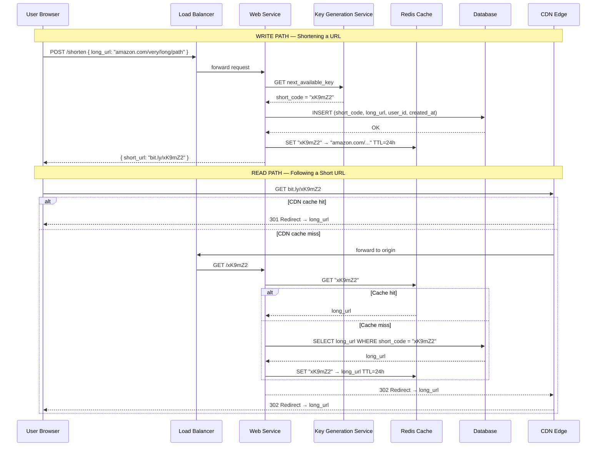

**The key insight**: Every short URL is read orders of magnitude more times than it is written. This is a **read-heavy system** — optimize every layer for reads.

---

## Why This is Harder Than It Looks

A naive implementation breaks in ways that are non-obvious until you think about scale.

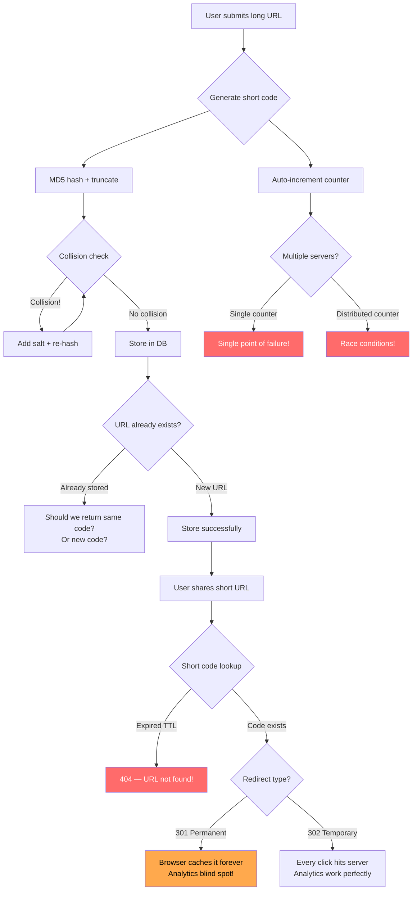

The diagram above shows 5 hidden traps:

| Trap | Why it matters |
|------|---------------|
| **Hash collisions** | Two different URLs producing the same short code silently overwrites one |
| **Counter race conditions** | Two servers generating the same ID in parallel → duplicate short codes |
| **Idempotency question** | Same long URL submitted twice — same short code, or two different ones? |
| **TTL expiry** | User shared the short link, it expires → broken links for everyone |
| **301 vs 302** | 301 breaks analytics; 302 triples server load — no free lunch |

---

## Functional & Non-Functional Requirements

### Functional Requirements

| Feature | Requirement | Notes |
|---------|------------|-------|
| URL Shortening | Given a long URL, return a short URL | Must be idempotent optionally |
| URL Redirect | Short URL → redirect to long URL | Must be fast (<50ms p99) |
| Custom Aliases | User can choose their own short code | e.g., `bit.ly/my-brand` |
| URL Expiration | URLs can have a TTL (default: forever) | Optional expiry date |
| Analytics | Track click counts, referrer, geography | Async — does not block redirect |

### Non-Functional Requirements (with numbers)

| Requirement | Target | Rationale |
|------------|--------|-----------|
| **Write throughput** | 1,160 writes/sec | 100M URLs shortened per day |
| **Read throughput** | 115,700 reads/sec | 10B redirects per day |
| **Read:write ratio** | **100:1** | Heavily skewed toward reads |
| **Availability** | 99.99% uptime | ~52 min/year downtime acceptable |
| **Redirect latency** | < 50ms p99 | URL redirects must be near-instant |
| **Short code length** | 7–8 characters | Covers trillions of URLs (see math below) |
| **Storage horizon** | 5 years | After which unused URLs may expire |
| **Data durability** | 99.9999% | Can't lose stored URLs |

---

## Capacity Estimation

**Always do this math in the interview. It drives every architectural decision.**

### Traffic Estimates

```
WRITE (shortening):
  100,000,000 URLs / day
  = 100,000,000 / 86,400 seconds
  ≈ 1,160 writes/second
  Peak (3× average) ≈ 3,500 writes/second

READ (redirecting):
  10,000,000,000 redirects / day
  = 10,000,000,000 / 86,400 seconds
  ≈ 115,700 reads/second
  Peak (3× average) ≈ 347,100 reads/second

READ:WRITE RATIO = 115,700 / 1,160 ≈ 100:1
```

### Storage Estimates

```
Per URL record:
  short_code:   8   bytes
  long_url:     200 bytes (average)
  user_id:      8   bytes
  created_at:   8   bytes
  expires_at:   8   bytes
  click_count:  8   bytes
  metadata:     50  bytes (IP, user_agent, etc.)
  TOTAL:  ~300 bytes per URL
  (generously round to 500 bytes including indexes)

URLs over 5 years:
  1,160 writes/sec × 86,400 sec/day × 365 days × 5 years
  = 1,160 × 86,400 × 1,825
  ≈ 182,870,400,000 records
  ≈ 183 billion URLs

Storage:
  183,000,000,000 × 500 bytes
  ≈ 91.5 TB of raw data
  × 2 (replication factor)
  ≈ 183 TB total storage
```

### Cache Estimates

```
20% of URLs drive 80% of traffic (Pareto principle)
Daily reads: 10B
20% of URLs: 10B × 0.2 = 2B URL lookups cached

Cache memory per entry:
  key (short_code):  8 bytes
  value (long_url):  200 bytes
  overhead:          ~50 bytes
  TOTAL: ~260 bytes

Cache size for hot 20%:
  2,000,000,000 × 260 bytes
  ≈ 520 GB

Practical approach — cache last 24 hours of hot reads:
  Daily read QPS × 20% × avg_size
  ≈ 115,700 requests/sec × 86,400 sec × 20% × 260 bytes
  ≈ 520 GB theoretical, ~170 GB practical (active working set)
```

**170GB fits comfortably in a Redis cluster** — 4 nodes × 64GB each = 256GB.

### Short Code Length

```
Base62 alphabet: a-z (26) + A-Z (26) + 0-9 (10) = 62 characters

Codes of length 6: 62^6  =    ~56 billion unique codes
Codes of length 7: 62^7  =   ~3.5 trillion unique codes
Codes of length 8: 62^8  = ~218 trillion unique codes

We need: 183 billion over 5 years
→ 7 characters gives 3.5 trillion ≈ 19× safety margin ✓
```

---

## The Core Problem: How Do You Generate a Short Code?

This is the heart of the design. Three fundamentally different approaches, each with serious trade-offs.

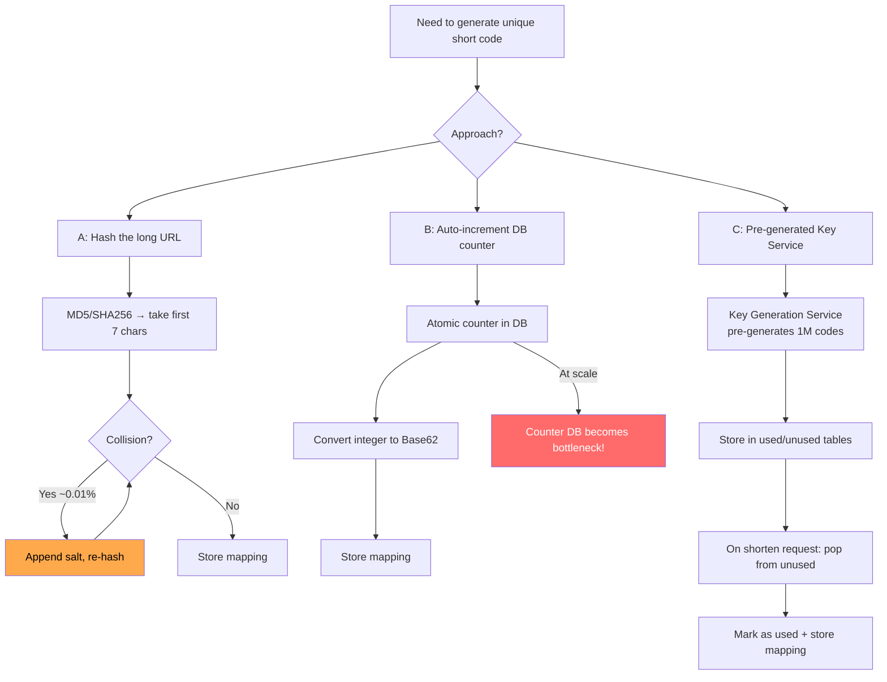

---

### Approach A: MD5/SHA256 Hash + Truncate

**The idea**: Hash the long URL, take the first 7 characters as the short code.

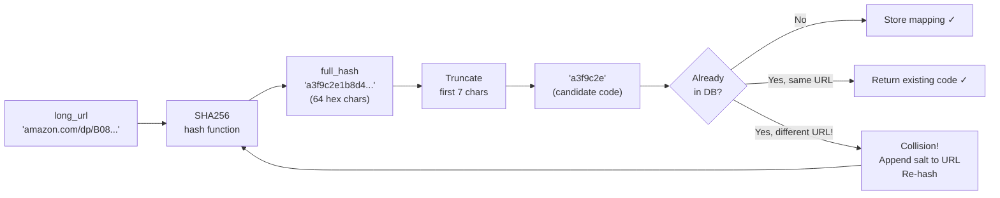

**Pseudo-code:**

```
FUNCTION shorten(long_url):
    FOR attempt = 1 TO max_retries:
        IF attempt == 1:
            input = long_url
        ELSE:
            input = long_url + ":" + random_salt()

        full_hash = SHA256(input)
        short_code = base62_encode(full_hash[0:7])  # first 7 chars

        existing = DB.query("SELECT * FROM url_mappings WHERE short_code = ?", short_code)

        IF existing is null:
            DB.insert(short_code, long_url)
            RETURN short_code
        ELSE IF existing.long_url == long_url:
            RETURN short_code  # Idempotent — same URL, same code
        ELSE:
            CONTINUE  # Collision! Try again with salt

    RAISE "Could not generate unique code after max_retries"
```

**Trade-off Table — Approach A:**

| Dimension | Score | Detail |
|-----------|-------|--------|
| Collision risk | ⚠️ Medium | ~0.01% chance per request; retry adds latency |
| Throughput ceiling | ~5,000/sec | Each retry requires a DB read |
| Complexity | 🟢 Low | No extra services needed |
| DB load | ⚠️ High | Each write needs a collision-check read first |
| Same URL → same code | ✅ Yes | Naturally idempotent (deterministic hash) |
| Predictability | ✅ Yes | Given the URL, you know the short code |
| Suitable for | Small scale | Good up to ~10M URLs total |

---

### Approach B: Auto-Increment ID + Base62 Encode

**The idea**: Use a database auto-increment counter. Encode the integer in Base62 to get a short string.

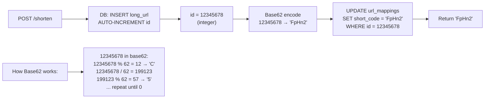

**Base62 encoding pseudo-code:**

```
ALPHABET = "abcdefghijklmnopqrstuvwxyzABCDEFGHIJKLMNOPQRSTUVWXYZ0123456789"
# Index:    0-25 = a-z, 26-51 = A-Z, 52-61 = 0-9

FUNCTION encode_base62(number):
    IF number == 0:
        RETURN ALPHABET[0]

    result = ""
    WHILE number > 0:
        remainder = number % 62
        result = ALPHABET[remainder] + result
        number = number / 62  # integer division

    RETURN result

FUNCTION shorten(long_url):
    new_id = DB.insert_and_get_id(long_url)  # atomic auto-increment
    short_code = encode_base62(new_id)
    DB.update_short_code(new_id, short_code)
    RETURN short_code
```

**Mapping from integer to Base62 short code:**

```
ID 1          → "b"       (1 char — first 62 IDs are single char)
ID 62         → "ba"      (2 chars)
ID 3844       → "baa"     (3 chars)
ID 56,800,235 → "FpHn2"   (5 chars)
ID 3.5T       → "aaaaaaa" (7 chars = 3.5 trillion possible)
```

**Trade-off Table — Approach B:**

| Dimension | Score | Detail |
|-----------|-------|--------|
| Collision risk | ✅ Zero | Sequential IDs are unique by definition |
| Throughput ceiling | ⚠️ ~10K/sec | Single DB counter is bottleneck |
| Complexity | 🟢 Low | No extra services |
| DB load | 🟢 Low | No collision-check reads needed |
| Same URL → same code | ❌ No | Same URL submitted twice gets two different codes |
| Predictability | ⚠️ Risky | Sequential codes are enumerable — security concern |
| Suitable for | Medium scale | Good up to ~50M daily writes with DB sharding |

**The sequential enumeration problem**: If codes go `aaaaaa`, `aaaaab`, `aaaaac`... an attacker can enumerate all URLs in your system. **Fix**: shuffle the Base62 alphabet, or XOR the counter with a secret key before encoding.

---

### Approach C: Pre-Generated Key Service (Recommended for Production)

**The idea**: A dedicated Key Generation Service (KGS) pre-generates billions of short codes in advance, stores them in a database split into `unused_keys` and `used_keys`. On each shorten request, the service atomically pops one unused key.

```mermaid
graph TD
    subgraph KGS["Key Generation Service (KGS)"]
        GEN["Background Worker\nGenerates 1M Base62 codes/batch"]
        UDB[("unused_keys table\n~1 billion pre-generated codes")]
        CACHE["In-memory buffer\n10,000 keys per KGS instance"]
    end

    subgraph WEB["URL Shortening Service"]
        W1["Instance 1"]
        W2["Instance 2"]
        W3["Instance N"]
    end

    subgraph MAIN[("Main DB\nurl_mappings table")]
    end

    GEN -->|batch insert| UDB
    UDB -->|"atomic MOVE\n(mark as used)"| CACHE
    W1 -->|GET /next-key| KGS
    W2 -->|GET /next-key| KGS
    W3 -->|GET /next-key| KGS
    KGS -->|short_code| W1
    KGS -->|short_code| W2
    KGS -->|short_code| W3
    W1 -->|INSERT mapping| MAIN
    W2 -->|INSERT mapping| MAIN
    W3 -->|INSERT mapping| MAIN
```

**KGS pseudo-code:**

```
# Background generator (runs continuously)
FUNCTION generate_keys_batch():
    WHILE unused_key_count < LOW_WATERMARK (e.g., 100 million):
        batch = []
        FOR i in range(1_000_000):
            random_code = generate_random_base62(length=7)
            batch.append(random_code)
        DB.batch_insert_unused_keys(batch, on_conflict="ignore")
        # ON CONFLICT IGNORE handles rare duplicates gracefully

# In-memory cache on each KGS instance (prevents per-request DB calls)
unused_keys_buffer = []  # loaded from DB at startup, 10,000 keys
lock = Mutex()

FUNCTION get_next_key():
    lock.acquire()
    IF unused_keys_buffer is empty:
        # Refill from DB — atomic operation
        keys = DB.execute("""
            DELETE FROM unused_keys
            WHERE key IN (SELECT key FROM unused_keys LIMIT 10000)
            RETURNING key
        """)
        unused_keys_buffer = keys
    key = unused_keys_buffer.pop()
    lock.release()
    RETURN key

# URL shortening handler (in web service)
FUNCTION shorten(long_url, user_id):
    short_code = KGS.get_next_key()
    DB.insert(short_code, long_url, user_id, now())
    Cache.set(short_code, long_url, ttl=24h)
    RETURN "bit.ly/" + short_code
```

**What happens if KGS crashes?** The in-memory buffer of 10,000 keys is lost — those codes are abandoned (small waste). On restart, KGS loads a fresh batch from the DB. No URLs are broken.

**Trade-off Table — Approach C:**

| Dimension | Score | Detail |
|-----------|-------|--------|
| Collision risk | ✅ Near-zero | Pre-generated with uniqueness enforced in DB |
| Throughput ceiling | ✅ Very high | Each web server has 10K keys in memory; no per-request DB call for ID |
| Complexity | ⚠️ High | New service to build, deploy, and maintain |
| DB load | 🟢 Very low | Keys fetched in batches, not per-request |
| Same URL → same code | ❌ No | Different codes for same URL (fixable with cache check) |
| Single point of failure | ⚠️ Yes | KGS must be replicated (active-active with partitioned key ranges) |
| Suitable for | Large scale | Best for >100M writes/day |

---

### Approach Comparison Table

| Criteria | A: Hash + Truncate | B: Counter + Base62 | C: Key Generation Service |
|----------|-------------------|---------------------|--------------------------|
| Collision risk | ~0.01% (retry needed) | Zero (sequential) | ~0 (pre-verified) |
| Write throughput | ~5K/sec | ~10K/sec | **>100K/sec** |
| Read throughput | Unlimited (cache) | Unlimited (cache) | Unlimited (cache) |
| Code predictability | Unpredictable | Sequential (risky) | Random (safe) |
| Idempotency | Yes (same URL → same code) | No | No (fixable) |
| Extra services | None | None | KGS service needed |
| DB write amplification | 2× (check + insert) | 1× | 1× |
| Suitable up to | 10M total URLs | 50M URLs/day | **Billions/day** |
| **Best for** | Startups/MVPs | Mid-scale products | Production at scale |

---

## System Architecture Deep Dive

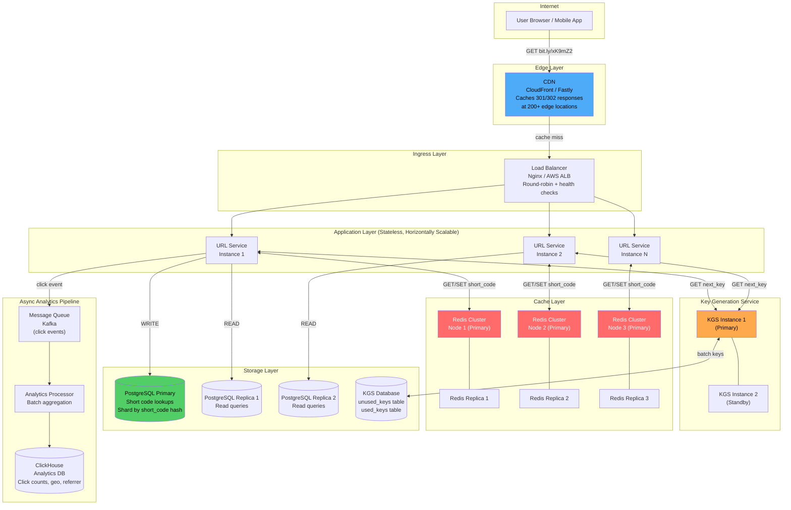

### Read Path (Redirect Flow)

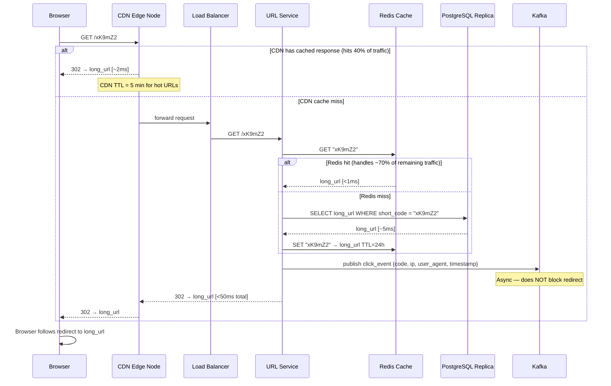

### Write Path (URL Shortening)

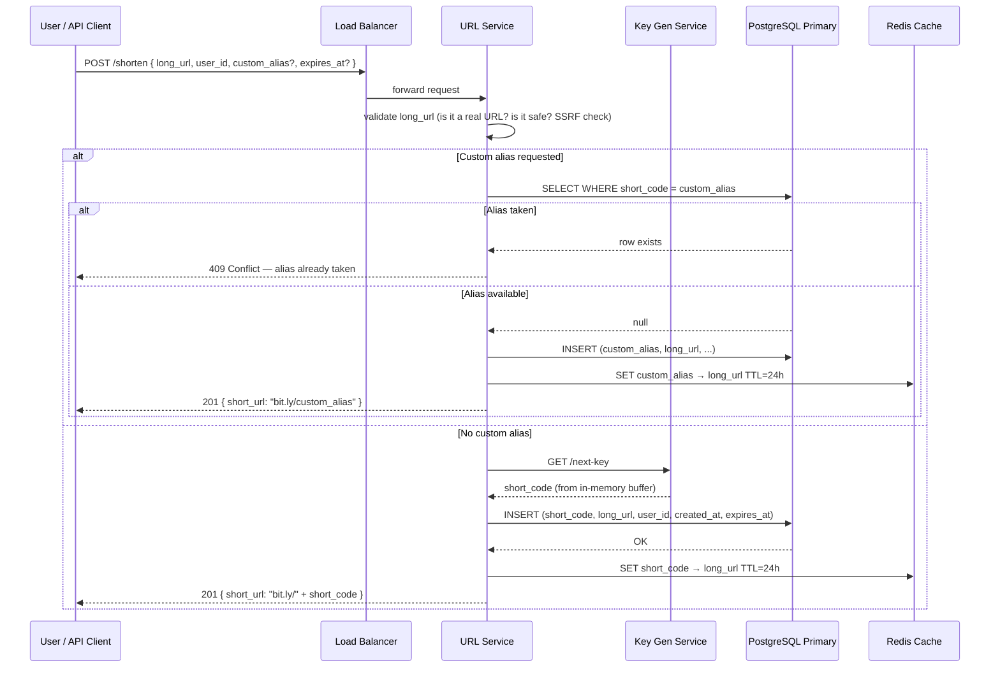

---

## Database Design

### Schema (Pseudo-code format)

```
TABLE: url_mappings
┌──────────────┬──────────────┬─────────────────────────────────────────────┐
│ Column       │ Type         │ Notes                                       │
├──────────────┼──────────────┼─────────────────────────────────────────────┤
│ short_code   │ VARCHAR(8)   │ PRIMARY KEY. 7-char Base62, e.g. "xK9mZ2a" │
│ long_url     │ TEXT         │ NOT NULL. Up to 2048 chars                  │
│ user_id      │ BIGINT       │ NULL for anonymous; FK to users table       │
│ created_at   │ TIMESTAMP    │ NOT NULL. When this mapping was created     │
│ expires_at   │ TIMESTAMP    │ NULL = never expires                        │
│ is_active    │ BOOLEAN      │ Default TRUE. Soft-delete flag              │
│ click_count  │ BIGINT       │ Denormalized. Updated asynchronously        │
│ custom_alias │ BOOLEAN      │ Was this a user-chosen alias?               │
└──────────────┴──────────────┴─────────────────────────────────────────────┘

INDEXES:
  PRIMARY KEY on (short_code)    — O(1) redirect lookup
  INDEX on (user_id, created_at) — "show all my URLs" query
  INDEX on (expires_at)          — background expiry worker
  INDEX on (long_url)            — deduplication check (optional, for idempotency)

TABLE: kgs_unused_keys
┌──────────────┬──────────────┬─────────────────────────────────────────────┐
│ Column       │ Type         │ Notes                                       │
├──────────────┼──────────────┼─────────────────────────────────────────────┤
│ key          │ VARCHAR(8)   │ PRIMARY KEY. Pre-generated Base62 code      │
│ created_at   │ TIMESTAMP    │ When this key batch was generated           │
└──────────────┴──────────────┴─────────────────────────────────────────────┘
```

### Why NOT Use Auto-Increment ID as the Short Code Directly

This is a common beginner mistake. If IDs are sequential:

- URL ID 1 → `bit.ly/b`
- URL ID 2 → `bit.ly/c`
- URL ID 1000 → `bit.ly/pO`

An attacker can **enumerate every URL** in your system by just incrementing the code. This leaks:
- Private documents shared via URL
- Internal analytics dashboards
- Confidential file download links

**Fix**: Shuffle the Base62 alphabet (use a secret permutation), XOR the integer with a secret salt, or use random pre-generated codes (Approach C).

### Why Base62 Over Base64

Base64 uses `+` and `/` characters. In a URL: `bit.ly/xK9+mZ/2` — the `+` means "space" and `/` is a path separator. **URL encoding nightmare**.

```
Base64 alphabet: A-Z a-z 0-9 + /   ← + and / are URL-unsafe
Base62 alphabet: A-Z a-z 0-9       ← Fully URL-safe
URL-safe Base64: A-Z a-z 0-9 - _   ← Also acceptable alternative
```

Base62 is slightly less space-efficient (62 vs 64 values per char) but far less headache.

### Database Sharding Strategy

At 180TB of data, one PostgreSQL instance cannot hold everything. **Shard by `short_code`**:

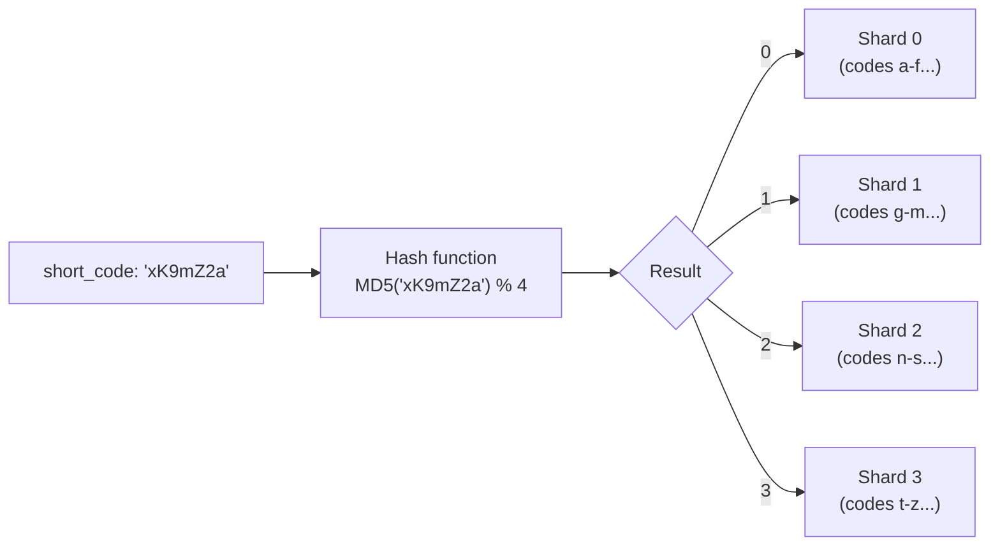

**Why shard by short_code (not user_id)?** Because the hot path is redirect lookup (`WHERE short_code = ?`). Sharding by the lookup key means each redirect hits exactly one shard. Sharding by `user_id` would make redirect lookups cross-shard (slow).

---

## Caching Strategy

The read:write ratio is 100:1, and **80% of traffic hits 20% of URLs** (Pareto/hot URLs). Caching is not optional — it is the entire read architecture.

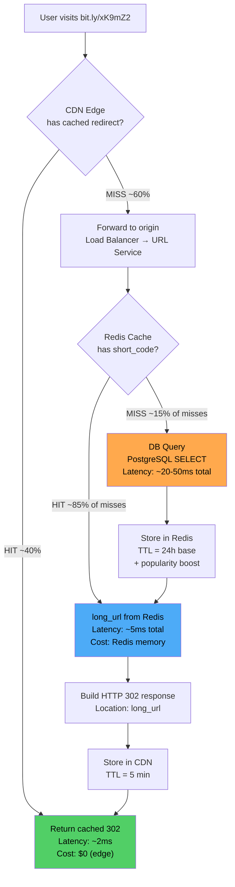

### Cache Design Decisions

**Cache Key**: `short_code` → `long_url`

Simple string-to-string mapping. No complex serialization needed.

**TTL Strategy:**

```
Default TTL:      24 hours
Hot URL (>1K hits/hour):  72 hours (popularity boost)
Custom alias:     7 days (user-created = intended to be permanent)
Expiring URL:     TTL = min(24h, time_until_expiry)
Deleted URL:      SET short_code → "DELETED" TTL=1h (negative cache)
```

**Why negative cache?** Without it, if someone shares a deleted URL, every click triggers a DB read that returns nothing. 1B dead clicks × 5ms each = 5 billion ms = expensive. Cache `"DELETED"` so the service returns 404 from memory.

**Eviction Policy**: Redis `allkeys-lru` — evict the least-recently-used key when memory is full.

**Cache Warming**: On service startup, pre-load the top 10,000 most-accessed URLs from DB into Redis. Avoids cold-start surge.

### What Happens on Cache Miss Storm (Thundering Herd)

If Redis goes down and comes back up, 100% of traffic suddenly hits the database simultaneously.

**Fix — Cache stampede protection:**

```
FUNCTION get_with_lock(short_code):
    value = Cache.get(short_code)
    IF value is not null:
        RETURN value

    # Use a distributed lock so only ONE request populates the cache
    lock_acquired = Cache.set_if_not_exists("lock:" + short_code, "1", ttl=1s)

    IF lock_acquired:
        value = DB.query(short_code)
        Cache.set(short_code, value, ttl=24h)
        RETURN value
    ELSE:
        # Another request is populating — wait briefly and retry
        sleep(50ms)
        RETURN Cache.get(short_code)  # Usually populated by now
```

---

## Problems at Scale

### Problem 1: Hot URLs (Celebrity Effect)

**Scenario**: Taylor Swift tweets `bit.ly/xK9mZ2`. Within 30 seconds, 2 million people click it simultaneously.

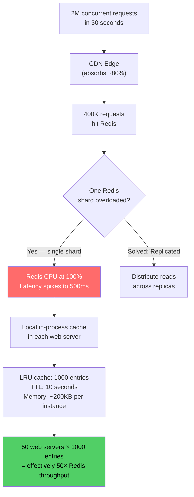

**Solution: Layered caching**

```
Layer 1: CDN edge                  ← absorbs 40-80% of traffic globally
Layer 2: Local in-process LRU      ← each web server holds top 1,000 URLs
Layer 3: Redis distributed cache   ← shared cache across all instances
Layer 4: Database (last resort)    ← <1% of requests should reach here
```

### Problem 2: Database Write Bottleneck

**Scenario**: Black Friday — 50,000 new URLs/second (40× normal load).

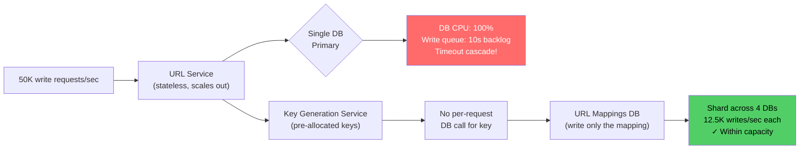

**Solution: Pre-allocated keys + DB sharding**

The KGS approach means the only DB write at shorten-time is `INSERT (short_code, long_url)` — no read, no collision check. Sharding across 4 nodes: 50K / 4 = 12.5K writes/sec per shard. Comfortably within PostgreSQL's 20-30K write/sec limit per node.

### Problem 3: URL Collisions in Hash Approach

**The math**: With 7-char Base62 codes and 183 billion URLs, what's the collision probability?

```
Birthday paradox approximation:
  P(collision) ≈ n² / (2 × code_space)

  n = 183 billion URLs
  code_space = 62^7 = 3.5 trillion

  P ≈ (183B)² / (2 × 3.5T)
    = 33.5 × 10^21 / 7 × 10^12
    = 4.8 × 10^9    ← very high!

Conclusion: With 183B URLs and 7-char codes, collisions are near-certain.
```

**Fix 1 — Increase code length to 8 chars:**

```
62^8 = 218 trillion codes
P(collision) ≈ (183B)² / (2 × 218T) = 77 million collisions expected over 5 years
= 77M / 183B = 0.042% collision rate — manageable with retry
```

**Fix 2 — Bloom filter for fast collision detection:**

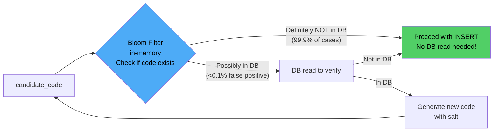

Bloom filter stores 183B entries in ~25GB RAM (using ~1 bit per entry). This eliminates 99.9% of collision-check DB reads.

### Problem 4: Analytics at Scale

**The problem**: 115,700 clicks/second. You cannot do `UPDATE click_count = click_count + 1` in the URL mappings table at this rate.

```
115,700 UPDATE statements/second on a single table
= ~10 billion lock contentions per day
= Database dies immediately
```

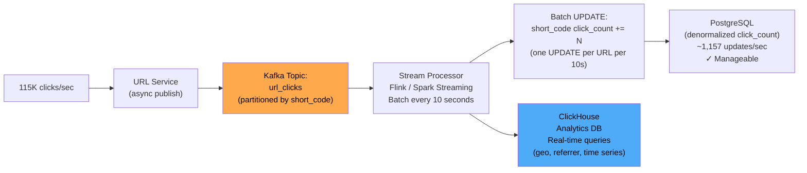

**The math**: 115,700 clicks/sec → batch in 10s windows → 1 UPDATE per URL per 10 seconds.

If 100,000 unique URLs receive clicks in a 10s window: 100K updates / 10s = 10K updates/sec. Still high, but:
- Use ClickHouse for analytics queries (not PostgreSQL)
- Update `click_count` in PostgreSQL only for display purposes, asynchronously

### Problem 5: Global Latency

**Problem**: User in Singapore, database in US-East → 200ms round-trip just for the TCP connection.

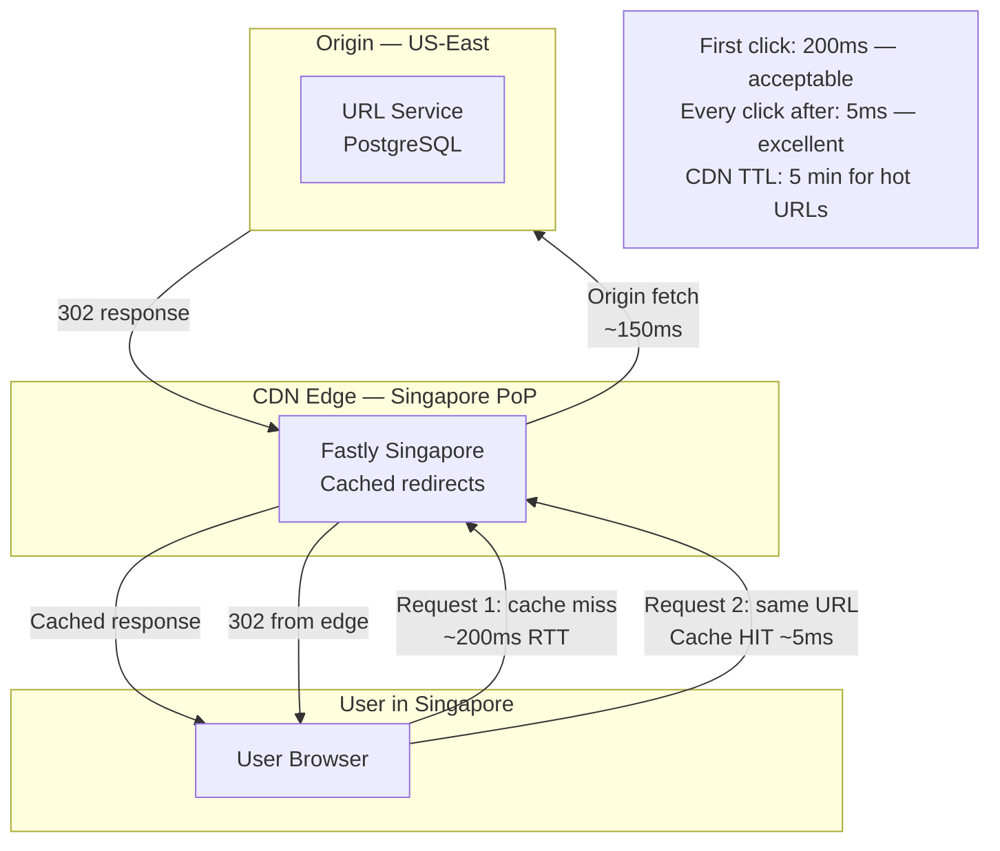

**CDN as the primary read optimization for global users**: Most popular URLs get cached at 200+ edge locations worldwide. After the first request from a region, subsequent requests never leave that continent.

---

## 301 vs 302 Redirect — The Hidden Trade-off

**This is the #1 most-asked follow-up question in URL shortener interviews.** Get this wrong and you look like you've never built something real.

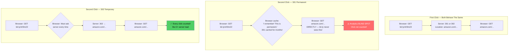

### The Decision Table

| Factor | 301 Permanent | 302 Temporary |
|--------|--------------|---------------|
| Browser caches redirect | ✅ Yes — after first visit | ❌ No — server hit every time |
| Server load | ✅ Low — subsequent clicks bypass | ⚠️ High — every click hits server |
| Analytics accuracy | ❌ Poor — clicks not counted after caching | ✅ Perfect — every click counted |
| CDN behavior | CDN caches aggressively | CDN respects no-cache hints |
| Can change destination | ❌ Hard — browsers won't re-check | ✅ Easy — next click gets new destination |
| Good for | Maximum performance, static links | Analytics, A/B testing, mutable links |
| **bit.ly uses** | 301 for old links | **302 for all new links** |

**The correct answer for most URL shorteners**: Use **302** — you want analytics, and you want the ability to update/delete links. The server load is acceptable with caching at the CDN and Redis layer.

**Use 301 only if**: You're running a personal redirect service, don't need analytics, and want maximum performance.

---

## Custom Aliases & URL Expiration

### Custom Aliases

Custom aliases add a reservation/availability-check step to the write path.

```
FUNCTION shorten_with_custom_alias(long_url, alias, user_id):
    # Validate alias format
    IF NOT is_valid_alias(alias):
        RETURN Error("Alias must be 1-20 alphanumeric chars/hyphens")

    # Check for reserved words (prevents bit.ly/admin, bit.ly/api, etc.)
    IF alias IN RESERVED_WORDS:
        RETURN Error("This alias is reserved")

    # Check availability — must be atomic to prevent race conditions
    # Use DB transaction or Redis SET NX (set if not exists)
    lock_key = "alias_lock:" + alias
    acquired = Cache.set_if_not_exists(lock_key, user_id, ttl=5s)

    IF NOT acquired:
        RETURN Error("Alias taken or being claimed — try again")

    existing = DB.query("SELECT user_id FROM url_mappings WHERE short_code = ?", alias)

    IF existing:
        Cache.delete(lock_key)
        RETURN Error("Alias already taken")

    DB.insert(alias, long_url, user_id, is_custom=TRUE)
    Cache.set(alias, long_url, ttl=7d)
    Cache.delete(lock_key)
    RETURN "bit.ly/" + alias

RESERVED_WORDS = ["admin", "api", "login", "logout", "signup", "help",
                  "terms", "privacy", "about", "contact", "404", "500", ...]
```

**The race condition risk**: Two users simultaneously try to claim `bit.ly/apple`. Without locking, both check "is it taken?" simultaneously, both get "no", both INSERT — the second INSERT fails with a unique constraint violation. Gracefully handle this:

```
TRY:
    DB.insert(alias, ...)
CATCH UniqueConstraintViolation:
    RETURN Error("Alias just taken by another user — sorry!")
```

### URL Expiration

Two approaches — TTL-based and background cleanup:

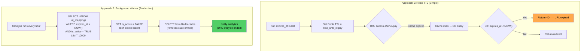

**Why soft delete (is_active = FALSE) instead of hard delete?**

- Keep click history for analytics after expiration
- Allow URL owner to "renew" an expired URL (set new expiry, re-activate)
- Audit trail (when was it created, when did it expire)
- Hard deletes make the short code available for reuse → risk of dead links pointing to wrong content

**The tricky case**: User shares a URL that expires. Later, another user creates a URL with the same short code (if you reuse codes). Original users now get redirected to the wrong place. **Solution**: Never reuse short codes. With 62^7 = 3.5 trillion codes, this is not a problem in practice.

---

## Interview Questions This Problem Maps To

URL shortener covers a surprising breadth of system design fundamentals. These questions all appear in real FAANG interviews:

| Interview Question | Concept Tested | Depth Level |
|-------------------|---------------|-------------|
| "Design TinyURL" | Full system design end-to-end | 45-min design |
| "How would you handle 100M daily shortenings?" | Write-path scaling, KGS, DB sharding | Scale |
| "How do you prevent hash collisions?" | Hashing, birthday paradox, bloom filters | Algorithms |
| "301 vs 302 — which would you use and why?" | HTTP, caching, analytics trade-offs | Networking |
| "How would you design the analytics system?" | Stream processing, Kafka, ClickHouse | Data systems |
| "How would you shard the database?" | Horizontal scaling, shard key selection | Databases |
| "What happens if Redis goes down?" | Fault tolerance, cache fallback | Reliability |
| "How do you prevent custom alias race conditions?" | Distributed locking, atomic operations | Concurrency |
| "How do you serve users in Asia with low latency?" | CDN, geographic distribution | Networking |
| "Design URL expiration and cleanup" | Background workers, soft delete | Data modeling |

**Related concepts in this knowledge base:**
- Caching strategies → [02-caching](/02-caching/concepts/caching-strategies)
- Database replication → [01-databases](/01-databases/concepts/replication-basics)
- Consistent hashing → [05-distributed-systems](/05-distributed-systems/concepts/consistent-hashing)
- Hot partition problem → [problems-at-scale/scalability/hot-partition](/problems-at-scale/scalability/hot-partition)

---

## System Design Evolution: Startup to Global Scale

How would this system look at different stages of growth?

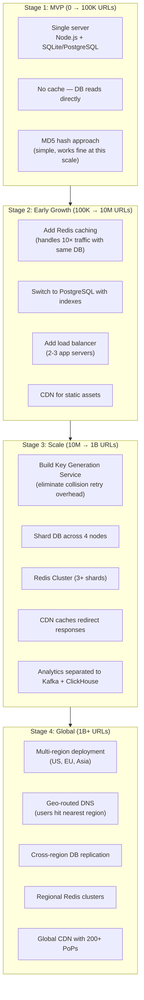

**The key lesson**: Don't design Stage 4 on day 1. Each stage transition is triggered by specific bottlenecks, not theoretical concerns. Build Stage 1 until it hurts, then add complexity to solve the actual pain point.

---

## Load Test Simulation

What does a real traffic pattern look like? URL shorteners have strong diurnal patterns:

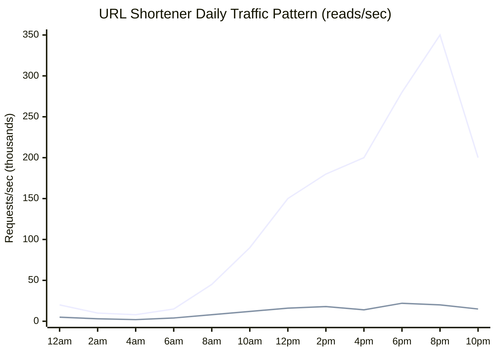

The spike at 6pm–10pm reflects social media sharing (people click links in the evening). Your infrastructure must handle **3× the average load** as peak capacity, or use auto-scaling to provision on demand.

---

## Key Takeaways

5 numbers you must memorize to answer this interview question confidently:

- **100:1 read-to-write ratio** → cache aggressively at every layer (CDN, Redis, local); the write path matters far less than the read path
- **62^7 = 3.5 trillion unique codes** → 7-character Base62 gives 19× safety margin over 183B URLs across 5 years; never use less than 7 chars
- **Pre-generate keys to eliminate write-time collision checks** at 1,160 writes/sec — hash retry adds ~10ms per collision; at scale this compounds into 1-2s p99 latency spikes
- **Cache 20% of URLs to serve 80% of traffic** — the working set is ~170GB, fits in a 4-node Redis cluster; cache miss rate should be <5% in steady state
- **Use 302 (not 301)** for new links when analytics matter — 301 is cached by browsers permanently, making click counting impossible after first visit; 302 hits your server every time but gives accurate data

---

## References

- 📖 [System Design Interview – Alex Xu, Chapter 8](https://www.amazon.com/System-Design-Interview-insiders-Second/dp/B08CMF2CQF) — The canonical interview prep treatment of this problem
- 📖 [How bit.ly Works – Engineering Blog](https://word.bitly.com/post/28021978745/an-introduction-to-shortening-urls) — Real production architecture from the pioneers of URL shortening
- 📖 [Designing a URL Shortening Service – High Scalability](http://highscalability.com/blog/2011/2/7/url-shortener-service.html) — Older but still relevant architectural deep-dive
- 📺 [Gaurav Sen – Designing a URL Shortening Service](https://www.youtube.com/watch?v=fMZMm_0ZhK4) — 15-min video walkthrough, excellent for visual learners
- 📖 [Birthday Problem and Hash Collisions](https://en.wikipedia.org/wiki/Birthday_problem) — The math behind why collision probability is higher than intuition suggests
- 📚 [HTTP 301 vs 302 – MDN Web Docs](https://developer.mozilla.org/en-US/docs/Web/HTTP/Status/302) — Authoritative reference on redirect semantics
- 📖 [Redis Cluster Specification](https://redis.io/docs/reference/cluster-spec/) — How Redis sharding works under the hood
