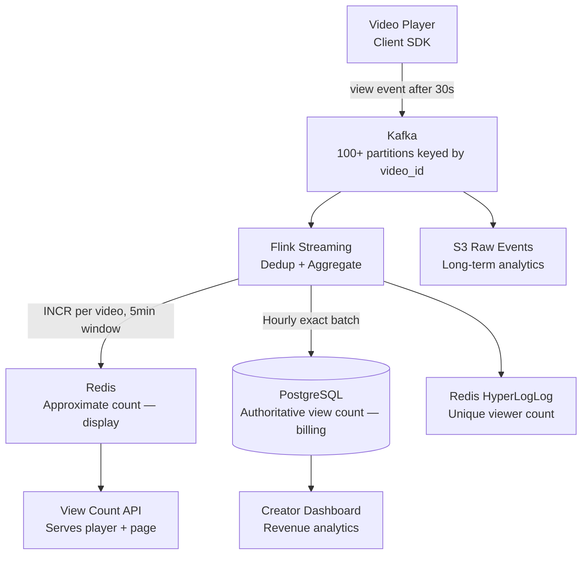

# Design a Video View Count System

**Difficulty**: 🟢 Easy | **Codemania #117**
**Reading Time**: ~8 min
**Interview Frequency**: High

---

## The Core Problem

Counting 5 billion video views per day on a platform like YouTube — accurately, within 5 minutes of the view occurring, without counting the same user twice, and without the counting system becoming a bottleneck for video playback. The tricky parts: deduplication (one user refreshing counts as 1 view, not 100), scale (5B events/day), and display latency (viewers expect counts to update within minutes).

---

## Functional Requirements

- Count a "view" when a user watches ≥ 30 seconds of a video
- Deduplicate: same user watching same video within 24 hours = 1 view
- Display count to viewers within 5 minutes of view occurring
- Provide exact view count to creators for revenue sharing (billing-grade accuracy)
- Support "trending" queries: top 100 most-viewed videos in last 24 hours

## Non-Functional Requirements

| Requirement | Target |
|-------------|--------|
| Throughput | 5B views/day = ~57,870 view events/sec |
| Display latency | View count visible within 5 minutes |
| Dedup window | 24-hour session window per (user, video) pair |
| Accuracy | Display: approximate (±0.1%); Billing: exact |
| Storage for dedup | 5B unique (user, video) pairs/day × 16 bytes = 80 GB/day |

---

## Back-of-Envelope Estimates

- **Event rate**: 5B views/day ÷ 86,400 = ~57,870 events/sec
- **Kafka throughput**: 57,870 events × 100 bytes = 5.8 MB/sec (trivial, well within Kafka capacity)
- **Dedup store (Redis)**: 5B dedup keys × 16 bytes = 80 GB/day. Use a rolling 24h TTL; memory footprint = 1 day = 80 GB Redis.
- **HyperLogLog for approximate counts**: 12 KB per video regardless of cardinality. 1M videos × 12 KB = 12 GB total for all HLL sketches.
- **PostgreSQL exact counts**: 5B increments/day, batch via Flink → aggregate per video per hour → ~100M rows/hour

---

## High-Level Architecture



---

## Key Design Decisions

### 1. Exact vs Approximate Counting

| Approach | Exact Counting | Approximate (HyperLogLog) |
|----------|---------------|--------------------------|
| Accuracy | 100% exact | ±0.81% error |
| Memory | O(N) — must store all seen IDs | O(1) — 12 KB regardless of N |
| Use case | Billing, revenue sharing | Display count, "trending" |
| Merge | Cannot merge across shards easily | HLL sketches are mergeable |

**Decision**: Dual-track approach:
- **Display**: HyperLogLog in Redis for approximate unique viewer count. Updated in real-time.
- **Billing**: Flink writes hourly exact counts to PostgreSQL via Kafka → batch aggregation. Creators see authoritative counts on their dashboard (15–60 min delay acceptable).

### 2. Client-Side vs Server-Side Dedup

| Approach | Client-Side Dedup | Server-Side Dedup |
|----------|------------------|------------------|
| Attack surface | Easy to bypass (modify client) | Authoritative |
| Latency | Prevents events before sending | Event sent, dedup at ingest |
| Reliability | Client offline → misses view | Server always records |

**Decision**: Server-side dedup. Client sends every qualifying view event (≥30 seconds watched). Flink dedup step checks Redis: `SET user:{uid}:viewed:{vid} 1 NX EX 86400` — if key already exists, discard the event.

### 3. Session Dedup Window

24-hour window per (user, video) pair:
- Anonymous users: dedup by browser fingerprint + IP (less accurate, acceptable)
- Logged-in users: dedup by user_id (exact)
- After 24 hours: same user watching again counts as a new view (rewatching is valid)

Redis TTL of 86400 seconds (24h) automatically expires dedup keys.

---

## Flink Windowed Aggregation

```
Input: view events keyed by (video_id, user_id)
Step 1: Dedup filter — discard if user saw video in last 24h
Step 2: Count per video in 5-minute tumbling window
Step 3: INCRBY view_count:{video_id} in Redis for display
Step 4: Write to Kafka sink for downstream exact counting
```

For exact billing counts, Flink uses hourly session windows and writes aggregated counts to PostgreSQL in a single batch update (not one row per view).

---

## Trending Videos

"Top 100 videos in last 24 hours":
- Redis Sorted Set: `ZADD trending:daily <view_count> <video_id>`
- Updated every 5 minutes by Flink (ZINCRBY for new views in window)
- `ZREVRANGE trending:daily 0 99` returns top 100 in O(log N + 100)

---

## Top Interview Questions for This Problem

| Question | Tests |
|----------|-------|
| Why not just INCR a Redis counter directly per view event? | Race conditions, no dedup, Redis as bottleneck, no durability |
| What is HyperLogLog and why use it for view counts? | Probabilistic counting, memory efficiency, acceptable error rate |
| How do you handle a video that goes viral and gets 10M views in 1 minute? | Kafka partitioning by video_id, Flink parallelism, Redis INCR atomicity |
| Why does YouTube sometimes show stale view counts? | Approximate display count, batch exact count, eventual consistency is acceptable |

---

## Common Mistakes

1. **Writing to PostgreSQL directly per view event**: 57,870 TPS on PostgreSQL = dead database. Always buffer in Kafka and batch-write.
2. **No deduplication**: Without dedup, refreshing a page inflates counts. Bot traffic inflates further. Dedup is non-negotiable.
3. **Using exact counting for display**: Storing 5B unique (user, video) pairs in memory for real-time exact dedup costs terabytes. HyperLogLog gives 99.19% accuracy at 12 KB per video.

---

## Related Concepts

- [Message Queue Basics](../../04-messaging/concepts/message-queue-basics) — Kafka buffering view events
- [Caching Fundamentals](../../02-caching/concepts/caching-fundamentals) — Redis for real-time approximate counts

---

## 📚 Resources & References

| Resource | Type | What You'll Learn |
|----------|------|------------------|
| [ByteByteGo — Design a View Counter](https://www.youtube.com/@ByteByteGo) | 📺 YouTube | View dedup, Kafka pipeline, Redis patterns |
| [Facebook — HyperLogLog at Scale](https://engineering.fb.com/2018/12/13/data-infrastructure/hyperloglog/) | 📖 Blog | How Facebook uses HLL for unique count estimation |
| [Hussein Nasser — Streaming Data Systems](https://www.youtube.com/@hnasr) | 📺 YouTube | Kafka + Flink streaming aggregation patterns |
| [High Scalability — Counting at Scale](https://highscalability.com) | 📖 Blog | Approximate data structures in production systems |
