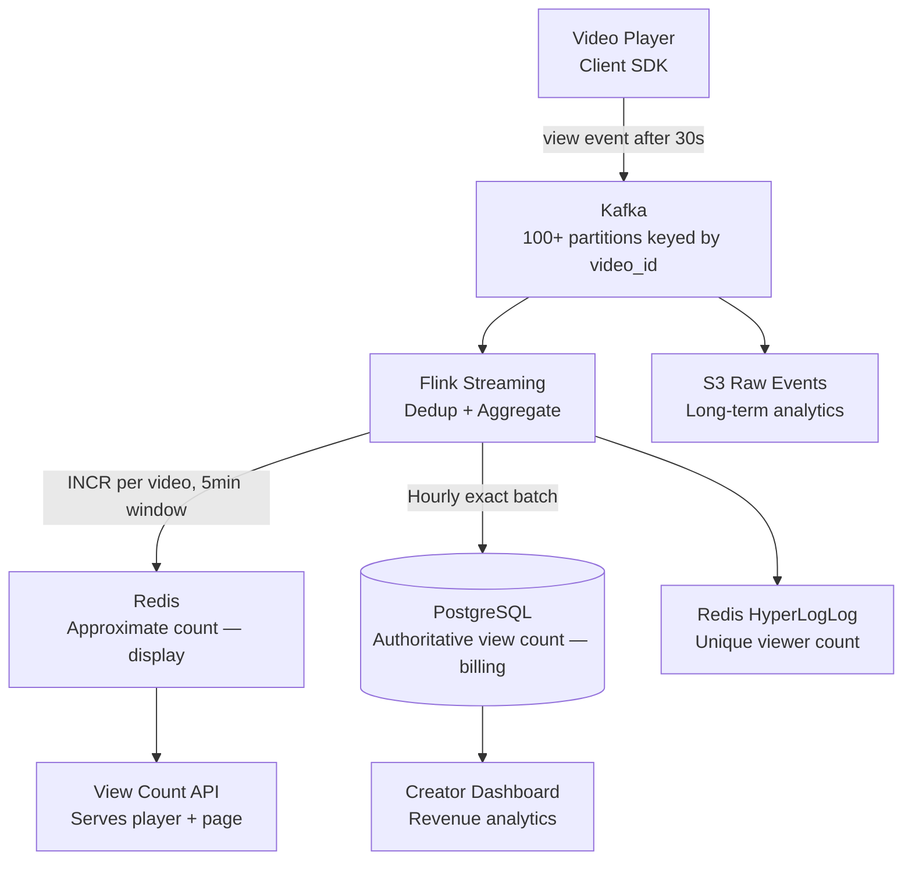
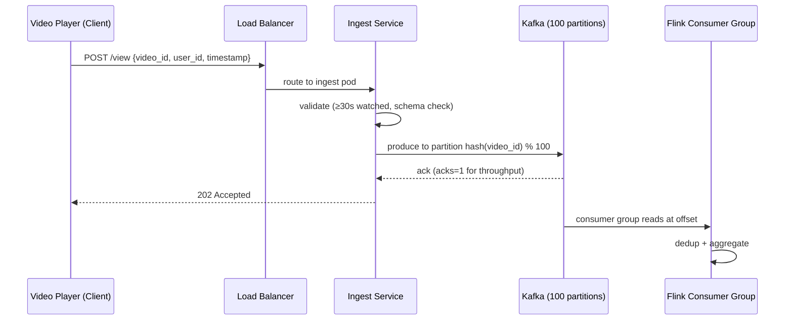
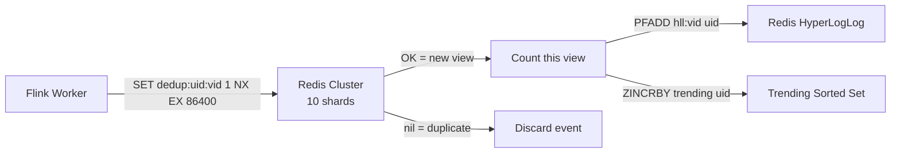
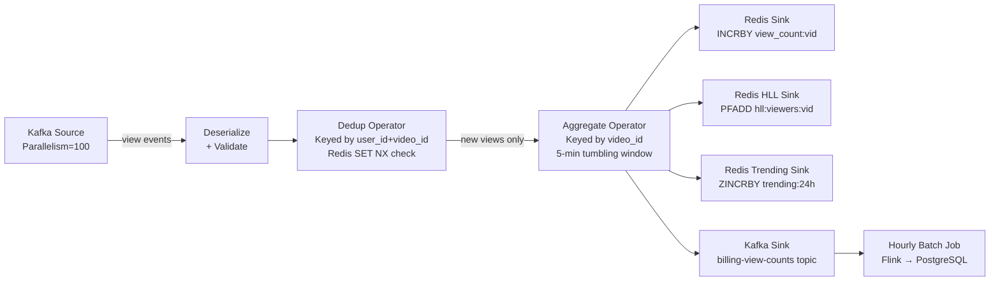
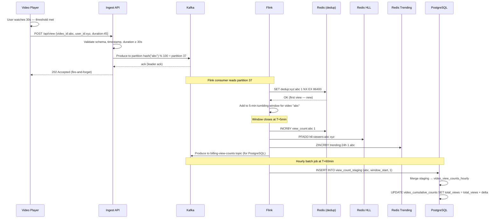

# Design a Video View Count System

**Difficulty**: 🟢 Easy | **Codemania #117**
**Reading Time**: ~8 min
**Interview Frequency**: High

---

## The Core Problem

Counting 5 billion video views per day on a platform like YouTube — accurately, within 5 minutes of the view occurring, without counting the same user twice, and without the counting system becoming a bottleneck for video playback. The tricky parts: deduplication (one user refreshing counts as 1 view, not 100), scale (5B events/day), and display latency (viewers expect counts to update within minutes).

---

## Functional Requirements

- Count a "view" when a user watches ≥ 30 seconds of a video
- Deduplicate: same user watching same video within 24 hours = 1 view
- Display count to viewers within 5 minutes of view occurring
- Provide exact view count to creators for revenue sharing (billing-grade accuracy)
- Support "trending" queries: top 100 most-viewed videos in last 24 hours

## Non-Functional Requirements

| Requirement | Target |
|-------------|--------|
| Throughput | 5B views/day = ~57,870 view events/sec |
| Display latency | View count visible within 5 minutes |
| Dedup window | 24-hour session window per (user, video) pair |
| Accuracy | Display: approximate (±0.1%); Billing: exact |
| Storage for dedup | 5B unique (user, video) pairs/day × 16 bytes = 80 GB/day |

---

## Back-of-Envelope Estimates

- **Event rate**: 5B views/day ÷ 86,400 = ~57,870 events/sec
- **Kafka throughput**: 57,870 events × 100 bytes = 5.8 MB/sec (trivial, well within Kafka capacity)
- **Dedup store (Redis)**: 5B dedup keys × 16 bytes = 80 GB/day. Use a rolling 24h TTL; memory footprint = 1 day = 80 GB Redis.
- **HyperLogLog for approximate counts**: 12 KB per video regardless of cardinality. 1M videos × 12 KB = 12 GB total for all HLL sketches.
- **PostgreSQL exact counts**: 5B increments/day, batch via Flink → aggregate per video per hour → ~100M rows/hour

---

## High-Level Architecture



---

## Key Design Decisions

### 1. Exact vs Approximate Counting

| Approach | Exact Counting | Approximate (HyperLogLog) |
|----------|---------------|--------------------------|
| Accuracy | 100% exact | ±0.81% error |
| Memory | O(N) — must store all seen IDs | O(1) — 12 KB regardless of N |
| Use case | Billing, revenue sharing | Display count, "trending" |
| Merge | Cannot merge across shards easily | HLL sketches are mergeable |

**Decision**: Dual-track approach:
- **Display**: HyperLogLog in Redis for approximate unique viewer count. Updated in real-time.
- **Billing**: Flink writes hourly exact counts to PostgreSQL via Kafka → batch aggregation. Creators see authoritative counts on their dashboard (15–60 min delay acceptable).

### 2. Client-Side vs Server-Side Dedup

| Approach | Client-Side Dedup | Server-Side Dedup |
|----------|------------------|------------------|
| Attack surface | Easy to bypass (modify client) | Authoritative |
| Latency | Prevents events before sending | Event sent, dedup at ingest |
| Reliability | Client offline → misses view | Server always records |

**Decision**: Server-side dedup. Client sends every qualifying view event (≥30 seconds watched). Flink dedup step checks Redis: `SET user:{uid}:viewed:{vid} 1 NX EX 86400` — if key already exists, discard the event.

### 3. Session Dedup Window

24-hour window per (user, video) pair:
- Anonymous users: dedup by browser fingerprint + IP (less accurate, acceptable)
- Logged-in users: dedup by user_id (exact)
- After 24 hours: same user watching again counts as a new view (rewatching is valid)

Redis TTL of 86400 seconds (24h) automatically expires dedup keys.

---

## Flink Windowed Aggregation

```
Input: view events keyed by (video_id, user_id)
Step 1: Dedup filter — discard if user saw video in last 24h
Step 2: Count per video in 5-minute tumbling window
Step 3: INCRBY view_count:{video_id} in Redis for display
Step 4: Write to Kafka sink for downstream exact counting
```

For exact billing counts, Flink uses hourly session windows and writes aggregated counts to PostgreSQL in a single batch update (not one row per view).

---

## Trending Videos

"Top 100 videos in last 24 hours":
- Redis Sorted Set: `ZADD trending:daily <view_count> <video_id>`
- Updated every 5 minutes by Flink (ZINCRBY for new views in window)
- `ZREVRANGE trending:daily 0 99` returns top 100 in O(log N + 100)

---

## Top Interview Questions for This Problem

| Question | Tests |
|----------|-------|
| Why not just INCR a Redis counter directly per view event? | Race conditions, no dedup, Redis as bottleneck, no durability |
| What is HyperLogLog and why use it for view counts? | Probabilistic counting, memory efficiency, acceptable error rate |
| How do you handle a video that goes viral and gets 10M views in 1 minute? | Kafka partitioning by video_id, Flink parallelism, Redis INCR atomicity |
| Why does YouTube sometimes show stale view counts? | Approximate display count, batch exact count, eventual consistency is acceptable |

---

## Common Mistakes

1. **Writing to PostgreSQL directly per view event**: 57,870 TPS on PostgreSQL = dead database. Always buffer in Kafka and batch-write.
2. **No deduplication**: Without dedup, refreshing a page inflates counts. Bot traffic inflates further. Dedup is non-negotiable.
3. **Using exact counting for display**: Storing 5B unique (user, video) pairs in memory for real-time exact dedup costs terabytes. HyperLogLog gives 99.19% accuracy at 12 KB per video.

---

## Related Concepts

- [Message Queue Basics](../../04-messaging/concepts/message-queue-basics) — Kafka buffering view events
- [Caching Fundamentals](../../02-caching/concepts/caching-fundamentals) — Redis for real-time approximate counts

---

## Component Deep Dive 1: Kafka Partitioning and Event Ingestion

Kafka is the most critical architectural component in this system. Its job is to absorb the full 57,870 events/sec write burst from millions of video player clients without any single component becoming a bottleneck. Understanding how Kafka handles this at scale — and how partitioning decisions affect every downstream component — separates surface-level answers from production-ready designs.

**How Kafka works internally here**: Each view event is published to a Kafka topic called `view-events`. The partition key is `video_id`. This is a deliberate choice: all events for a given video go to the same partition, which means Flink consumers reading that partition see events in order and can perform stateful dedup without cross-partition coordination. With 100 partitions, Kafka distributes ~580 events/sec per partition — well below the 10 MB/sec per-partition throughput limit.

**Why naive approaches fail at scale**: The simplest naive approach is a single HTTP endpoint that writes directly to PostgreSQL on every view event. At 57,870 TPS, PostgreSQL's typical write ceiling of 10,000–20,000 TPS is breached within seconds. Even with connection pooling, the database becomes the bottleneck during peak traffic (a viral video launch). Another naive approach — writing to Redis directly from the client — skips Kafka's durability guarantee. If Redis goes down, all views during that window are lost and cannot be replayed. Kafka retains events for configurable periods (default 7 days), enabling replay for reprocessing, backfills, and failure recovery.

**What happens during a viral spike**: When a video goes from 0 to 10M views in 60 minutes (166,667 events/sec), a single partition receiving all those events becomes a hot partition. The correct design uses compound partition keys — `{video_id}_{bucket}` where bucket = `hash(user_id) % 10` — so a single viral video spreads across 10 partitions instead of 1. This 10x fan-out keeps individual partition throughput reasonable while still enabling Flink to join partial counts per video downstream.



| Approach | Latency | Throughput | Trade-off |
|----------|---------|------------|-----------|
| Partition by video_id | ~2 ms produce | 500k events/sec cluster | Hot partitions for viral videos |
| Partition by user_id | ~2 ms produce | 500k events/sec cluster | Dedup requires cross-partition join |
| Compound key: video_id + user_bucket | ~2 ms produce | 500k events/sec cluster | Best balance; adds Flink merge step |
| Random partition (no key) | ~1 ms produce | 600k events/sec cluster | Cannot do stateful dedup per video |

**Producer acknowledgment setting**: `acks=1` (leader ack only) is used for ingestion to maximize throughput. For billing-critical exact counts, a separate consumer writes to a compacted topic with `acks=all` to prevent data loss.

---

## Component Deep Dive 2: Redis Deduplication Layer

Redis is the dedup enforcement layer. Its job is to answer a single question per view event in under 1 ms: "Has this (user_id, video_id) pair been seen in the last 24 hours?" If yes, discard. If no, record it and count the view. The correctness of the entire view count system depends on this check being atomic, fast, and scalable.

**Internal mechanics**: The dedup check uses Redis `SET NX EX` (Set if Not Exists, with Expiry):

```
SET dedup:{user_id}:{video_id} 1 NX EX 86400
```

If the key does not exist, Redis creates it and returns `OK` — the view is new and should be counted. If the key already exists, Redis returns `nil` — duplicate, discard. The `EX 86400` sets a 24-hour TTL so dedup keys expire automatically, enforcing the 24-hour rewatch window. This is a single atomic command; no race condition is possible.

**Scale behavior at 10x load**: At baseline (57,870 events/sec), dedup requires 57,870 Redis SET NX calls/sec. A single Redis node handles ~100,000–200,000 simple commands/sec, so baseline is comfortable. At 10x (578,700 events/sec), a single Redis node is saturated. The solution is Redis Cluster with key-based sharding: the dedup key `dedup:{user_id}:{video_id}` is hashed to a cluster slot, distributing load across 10–20 Redis nodes. Each node handles ~29,000–58,000 commands/sec at 10x — within capacity.

**Memory pressure**: At 5B dedup keys/day × 16 bytes per key (key string + Redis overhead) = 80 GB/day. Redis keeps the rolling 24-hour window in memory at any given time. With a cluster of 10 nodes × 12 GB RAM per node = 120 GB total, this is feasible but tight. Keys are small (binary packed `user_id:video_id` as 8+8 byte integers = 16 bytes), and Redis hash maps compress small values automatically.



| Approach | Memory/day | Accuracy | Dedup Precision |
|----------|-----------|----------|-----------------|
| Redis SET NX (exact dedup) | 80 GB | 100% | Per (user_id, video_id) |
| Bloom Filter (probabilistic) | ~8 GB | ~99% (false positive rate 1%) | Per (user_id, video_id) |
| HyperLogLog (unique viewers) | 12 KB/video | ±0.81% | Per video only, no per-user dedup |

The system uses Redis SET NX for per-user dedup (correctness) and HyperLogLog separately for unique viewer count display (memory efficiency). These are two different Redis structures with two different purposes.

---

## Component Deep Dive 3: PostgreSQL Exact Count Store (Billing Layer)

PostgreSQL is the authoritative store for creator revenue analytics. Unlike the display count path (approximate, real-time), the billing path requires 100% accuracy — a 1% error on a creator with 1 billion monetized views means 10 million uncounted views and real money lost or incorrectly paid.

**Technical decisions**: Flink does not write one row per view event to PostgreSQL. At 57,870 events/sec, that would be 57,870 INSERTs/sec — far beyond PostgreSQL's write capacity. Instead, Flink uses hourly tumbling windows: it aggregates all deduped view events per `video_id` over 60 minutes, then writes a single `UPDATE videos SET view_count = view_count + {delta} WHERE video_id = {id}` at the end of each hour. This reduces PostgreSQL write load from 57,870 TPS to ~1M rows/hour = ~278 updates/sec — completely manageable.

**Idempotency for failure recovery**: Flink checkpoints its Kafka offsets. If a Flink job crashes and replays events from the last checkpoint, it could double-count views. The fix is idempotent writes: Flink writes to a staging table `view_count_hourly_staging (video_id, window_start, window_end, count)` with a unique constraint on `(video_id, window_start)`. A separate reconciliation job merges staging into the authoritative `video_view_counts` table using `INSERT ... ON CONFLICT DO UPDATE`. This makes replays safe — re-inserting the same window just overwrites with the same value.

**Partitioning for query performance**: The `video_view_counts` table is range-partitioned by `created_date`. Creator dashboards query "views in last 30 days" — with partitioning, the query scans only 30 partitions instead of the full table history. Each daily partition is ~500 MB (1M active videos × hourly aggregates), keeping queries under 100 ms for typical creator dashboard loads.

---

## Data Model

```sql
-- Kafka event schema (Avro/JSON, 100 bytes avg)
-- { "video_id": "abc123", "user_id": "u789xyz", "watch_duration_sec": 45,
--   "client_ts": 1717200000, "session_id": "s_abc", "ip_hash": "a1b2c3" }

-- Redis dedup key (SET NX EX 86400)
-- Key: "dedup:{user_id}:{video_id}"  Value: "1"  TTL: 86400s
-- Example: "dedup:u789xyz:abc123"

-- Redis HyperLogLog (unique viewer count per video)
-- Key: "hll:viewers:{video_id}"
-- Command: PFADD hll:viewers:abc123 u789xyz
-- Command: PFCOUNT hll:viewers:abc123 → returns estimated unique viewers

-- Redis Sorted Set (trending)
-- Key: "trending:24h"
-- Command: ZINCRBY trending:24h 1 abc123
-- Command: ZREVRANGE trending:24h 0 99 WITHSCORES → top 100

-- PostgreSQL: hourly aggregated view counts (billing layer)
CREATE TABLE video_view_counts_hourly (
    video_id        VARCHAR(20)     NOT NULL,
    window_start    TIMESTAMPTZ     NOT NULL,
    window_end      TIMESTAMPTZ     NOT NULL,
    view_count      BIGINT          NOT NULL DEFAULT 0,
    unique_viewers  BIGINT          NOT NULL DEFAULT 0,
    created_at      TIMESTAMPTZ     NOT NULL DEFAULT NOW(),
    PRIMARY KEY (video_id, window_start)
) PARTITION BY RANGE (window_start);

-- One partition per day
CREATE TABLE video_view_counts_hourly_2026_06_01
    PARTITION OF video_view_counts_hourly
    FOR VALUES FROM ('2026-06-01') TO ('2026-06-02');

-- Index for creator dashboard queries: "views for video X in last 30 days"
CREATE INDEX idx_vvc_video_window ON video_view_counts_hourly (video_id, window_start DESC);

-- PostgreSQL: authoritative cumulative counts per video
CREATE TABLE video_cumulative_counts (
    video_id        VARCHAR(20)     PRIMARY KEY,
    total_views     BIGINT          NOT NULL DEFAULT 0,
    total_unique    BIGINT          NOT NULL DEFAULT 0,
    last_updated    TIMESTAMPTZ     NOT NULL DEFAULT NOW()
);

-- PostgreSQL: staging for idempotent Flink writes
CREATE TABLE view_count_staging (
    video_id        VARCHAR(20)     NOT NULL,
    window_start    TIMESTAMPTZ     NOT NULL,
    view_count      BIGINT          NOT NULL,
    unique_viewers  BIGINT          NOT NULL,
    flink_job_id    VARCHAR(64)     NOT NULL,
    PRIMARY KEY (video_id, window_start)
);
-- Flink upsert: INSERT ... ON CONFLICT (video_id, window_start) DO UPDATE SET view_count = EXCLUDED.view_count
```

---

## Scale Bottlenecks

| Traffic Level | Component That Breaks | Symptoms | Mitigation |
|---------------|----------------------|----------|------------|
| 10x baseline (578k events/sec) | Single Redis node for dedup | Redis CPU at 100%, SET NX latency spikes to 50 ms+ | Redis Cluster with 10+ shards; key-based routing |
| 10x baseline | Kafka hot partition (viral video) | Single partition consumer lag grows unbounded | Compound partition key: `video_id + user_bucket` to spread to 10 partitions |
| 100x baseline (5.8M events/sec) | Flink job parallelism ceiling | Job checkpoint time exceeds interval; state store too large | Scale Flink to 200+ task slots; use RocksDB state backend instead of heap |
| 100x baseline | Redis HyperLogLog memory | 10M active videos × 12 KB HLL = 120 GB Redis memory | Expire HLL keys for videos with no recent views (TTL 7 days); tiered HLL storage |
| 100x baseline | PostgreSQL write throughput | Hourly batch updates too large; lock contention on `video_cumulative_counts` | Shard PostgreSQL by `video_id % 16`; use TimescaleDB for time-series aggregation |
| 1000x baseline (58M events/sec) | Kafka broker throughput | Broker disk I/O saturated; replication lag | Expand to 1000+ partitions; multi-region Kafka clusters; tiered storage to S3 |
| 1000x baseline | Ingest service pod count | Service mesh overwhelmed; latency for event acknowledgment | Move to UDP-based event ingestion (fire-and-forget); trade guaranteed delivery for throughput |

---

## How YouTube Built This

YouTube's view count system is the canonical reference for this problem. It has been described in multiple Google/YouTube engineering blog posts and the "YouTube Engineering — How We Count Views" document on High Scalability.

YouTube processes approximately **5 billion views per day**, peaking at ~250,000 events/sec during major live events. Their architecture reflects a decade of iteration away from naive approaches.

**Early naive approach (pre-2012)**: YouTube originally stored view counts as a single integer in their MySQL database and incremented it on every view event. At scale, MySQL row-level locking on the `view_count` column for a popular video became a serious bottleneck. A video receiving 10,000 concurrent views would serialize 10,000 UPDATE statements on the same row — causing latency spikes and database outages. This is why YouTube famously froze Justin Bieber's view count at 2 billion views in 2012: the system was protecting itself from a pathological hot row.

**The HyperLogLog transition**: YouTube adopted HyperLogLog for display counts around 2013–2014. Their internal implementation (later open-sourced as part of the Google Zetasketch library) uses a variant of HLL with improved accuracy at low cardinalities — important for new videos with only hundreds of views where a 0.81% error would be visible. Google's HLL++ implementation reduces error to ±0.25% while still fitting in 40 KB per video.

**Specific architectural decision — dual pipeline**: YouTube separates the "display view count" pipeline (HyperLogLog + Redis, real-time, approximate) from the "monetization view count" pipeline (exact, batch, Spanner-backed). Creator Studio dashboards show exact counts but with a 24–48 hour lag. The YouTube player shows approximate counts with a 5-minute lag. This dual-pipeline approach is the non-obvious decision: it avoids forcing a single system to satisfy contradictory requirements (real-time AND exact).

**Technology choices**: YouTube uses Google Pub/Sub (equivalent to Kafka) for event ingestion, Apache Beam (equivalent to Flink) for stream processing, and Cloud Spanner for the authoritative exact count store. Display counts are served from Bigtable with a 5-minute refresh cadence. The dedup check uses a Redis-equivalent in-memory store backed by Google's internal Colossus filesystem.

**Numbers**: At peak (Super Bowl, World Cup finals), YouTube processes 10x normal traffic = 570,000 events/sec. Their Pub/Sub cluster sustains 1 million messages/sec with P99 publish latency under 50 ms. Beam jobs run on 2,000+ workers during peak events.

Source: Google Cloud Next '19 — "How YouTube Scales to Serve Billions of Views", High Scalability blog, Google Cloud architecture case studies.

---

## Interview Angle

**What the interviewer is testing**: The core skill being evaluated is your ability to recognize that a single system cannot simultaneously satisfy all requirements (real-time AND exact AND scalable AND cheap). The interviewer wants to see you decompose contradictory requirements into separate subsystems with appropriate trade-offs, rather than reaching for one database and hoping it works.

**Common mistakes candidates make:**

1. **Using a single database (PostgreSQL/DynamoDB) for everything**: Candidates jump to "store view counts in DynamoDB with atomic counter increments." This ignores deduplication entirely, cannot support approximate unique viewer counts cheaply, and becomes a hot-key problem for viral videos. DynamoDB's ProvisionedThroughput limit per partition key is 3,000 RCUs + 1,000 WCUs — insufficient for a single viral video.

2. **Skipping deduplication entirely**: Many candidates describe the ingestion pipeline correctly (Kafka → stream processor → database) but never address bot traffic, browser refreshes, or re-opens. A system without dedup inflates counts by 10–50x in production. Interviewers notice this omission immediately because it's the #1 real-world operational concern.

3. **Proposing exact real-time counting without acknowledging cost**: Candidates propose: "Use Redis Sorted Set with exact counts updated in real-time for all users." At 5B unique (user, video) pairs/day, storing exact dedup state in memory costs ~80 GB/day and requires cluster Redis at significant cost. Failing to quantify this and compare it to HyperLogLog's 12 KB/video shows unfamiliarity with production cost constraints.

**The insight that separates good from great answers**: The key insight is that "view count" is not a single number — it is a business concept with different consumers who have different accuracy and latency requirements. Viewers need approximate counts in near-real-time (5 minutes). Creators need exact counts for billing but tolerate a 24-hour lag. Trending algorithms need relative comparisons, not absolute accuracy. A great candidate explicitly names these three consumers, identifies that each requires a different subsystem, and designs accordingly — rather than forcing one database to serve all three.

---

## Key Numbers to Remember

| Metric | Value | Context |
|--------|-------|---------|
| Event rate (YouTube) | ~57,870 events/sec | 5B views/day ÷ 86,400 sec |
| Kafka partition throughput | 10 MB/sec per partition | Upper bound before throughput degrades |
| Recommended partitions | 100+ | Each handling ~580 events/sec at baseline |
| Redis SET NX capacity | 100,000–200,000 ops/sec | Per single Redis node |
| Dedup memory per key | 16 bytes | user_id (8 bytes) + video_id (8 bytes) |
| Total dedup memory (24h window) | 80 GB | 5B keys × 16 bytes |
| HyperLogLog memory per video | 12 KB | Regardless of unique viewer count |
| HLL error rate | ±0.81% | Standard HLL; Google HLL++ achieves ±0.25% |
| Total HLL memory (1M videos) | 12 GB | 1M × 12 KB |
| PostgreSQL safe write rate | 10,000–20,000 TPS | With connection pooling; no joins |
| Hourly batch write reduction | 57,870 TPS → 278 TPS | Aggregation reduces PostgreSQL load by 200x |
| Redis Sorted Set top-100 query | O(log N + 100) | ZREVRANGE is fast regardless of N |
| Viral video peak (YouTube) | 570,000 events/sec | 10x normal traffic at major live events |

---

## Flink Streaming Job: Internals and State Management

Apache Flink is the stream processing engine that ties together dedup, aggregation, and downstream fan-out. Understanding how Flink manages state at scale is essential for answering follow-up questions about failure recovery, exactly-once semantics, and late event handling.

**Flink operator graph for this problem**:



**Parallelism matching**: Flink's source parallelism must match Kafka's partition count. With 100 Kafka partitions, the Flink source operator runs at parallelism=100. Each Flink task slot owns 1 Kafka partition, processes events in order within that partition, and maintains local state for that partition's events. The dedup operator is keyed by `(user_id, video_id)`, which means Flink uses consistent hashing to route events with the same key to the same operator instance — enabling stateful dedup without distributed locks.

**State backend choice**: At baseline (57,870 events/sec), the Flink job maintains a large in-flight state: all (user_id, video_id) pairs seen in the current 5-minute window. With 5B events/day and 5-minute windows, the window contains up to 57,870 × 300 = 17.4M events. If using the HeapStateBackend (in-memory), each operator instance holds ~174,000 events in RAM — feasible but risky during GC pauses. At 10x load, switching to RocksDB state backend (disk-backed LSM tree) is mandatory: it handles state larger than heap and reduces GC pressure at the cost of ~2x slower state reads.

**Exactly-once semantics**: Flink supports exactly-once end-to-end when the source is a Kafka topic with committed offsets and the sinks support transactions. For the Redis sink, Flink uses at-least-once semantics (idempotent writes via SET NX). For the PostgreSQL billing sink, Flink uses exactly-once via two-phase commit: Flink's KafkaProducer wraps writes in a Kafka transaction, and the PostgreSQL batch job reads from the transactional Kafka topic. This combination ensures no view is double-counted in billing even during Flink job restarts.

**Late event handling**: View events from mobile clients on flaky networks can arrive late — a 30-second watch completed at 10:03 PM may arrive at 10:17 PM. Flink handles this with allowed lateness: `windowAssigner.withAllowedLateness(Duration.ofMinutes(15))`. Events arriving up to 15 minutes late are added to their original window. Events arriving later than 15 minutes are dropped (acceptable for display counts) but still land in Kafka's raw event topic for offline reprocessing in the billing pipeline.

| State Backend | Max State Size | Read Latency | Write Latency | Recovery Time |
|--------------|---------------|-------------|--------------|---------------|
| HeapStateBackend | JVM heap (~16 GB) | ~0.1 ms | ~0.1 ms | Fast (in-memory checkpoint) |
| RocksDBStateBackend | Disk (TB scale) | ~1–5 ms | ~1–5 ms | Slow (restore from HDFS/S3) |
| RocksDB + incremental checkpoints | Disk (TB scale) | ~1–5 ms | ~1–5 ms | Medium (only changed SSTs) |

---

## Failure Modes and Operational Runbook

Production view count systems fail in non-obvious ways. These are the top failure modes with detection and remediation:

### Failure Mode 1: Redis Dedup Key Eviction Under Memory Pressure

**What happens**: Redis's `maxmemory-policy` defaults to `noeviction`. If Redis memory fills up (dedup keys > cluster capacity), writes fail with OOM errors and Flink's dedup check returns errors — the system either stops counting views entirely or begins accepting duplicates.

**Detection**: Redis `INFO memory` showing `used_memory` > 90% of `maxmemory`. Alert on Redis eviction rate > 0 events/sec.

**Mitigation**: Set `maxmemory-policy allkeys-lru` so Redis evicts least-recently-used dedup keys when under pressure. This trades correctness (some duplicate views counted) for availability (system keeps running). Add a monitoring alert when eviction rate exceeds 1,000 keys/sec so the team can scale the Redis cluster before the error rate becomes significant.

### Failure Mode 2: Flink Checkpoint Failure Leading to Large Replay

**What happens**: Flink takes a consistent snapshot (checkpoint) every 60 seconds. If a checkpoint fails (e.g., S3 write timeout), Flink retries. If 3 consecutive checkpoints fail, Flink can no longer guarantee recovery — any restart will replay from the last successful checkpoint, which could be 3+ minutes ago. With 57,870 events/sec × 180 seconds = 10.4M events to replay, the replay causes a spike in Redis writes and potentially double-increments display counts.

**Detection**: Flink Web UI showing `numberOfFailedCheckpoints` > 3. Alert on Flink checkpoint duration > 30 seconds (P99 should be < 5 seconds).

**Mitigation**: Enable incremental checkpoints (RocksDB SST file-level diff). Use separate checkpoint storage from Kafka offset storage. Implement idempotency in the Redis sink: use `SET view_count:{vid} {val} XX` (only update if exists) for display counts so replays don't double-add.

### Failure Mode 3: Trending Sorted Set Becoming a Write Hot Spot

**What happens**: A single viral video receiving 500,000 views in 5 minutes triggers 500,000 `ZINCRBY trending:24h` commands per 5-minute window — 1,667 writes/sec on a single Redis key. Redis is single-threaded per command; 1,667 ZINCRBY ops/sec on one key is sustainable, but if multiple viral videos trend simultaneously (e.g., Super Bowl commercial), contention on the trending key causes command queuing.

**Detection**: Redis `LATENCY HISTORY` showing ZINCRBY latency spikes > 10 ms.

**Mitigation**: Shard the trending sorted set into multiple shards: `trending:24h:shard:{hash(video_id) % 10}`. Flink writes to one shard per video. A separate aggregation job merges top-100 from each shard every 5 minutes. The merge adds 2-5 seconds of latency to trending updates but eliminates the write hot spot.

### Failure Mode 4: PostgreSQL Hourly Batch Contention

**What happens**: At the end of each hour, Flink writes ~1M view count updates to PostgreSQL in a batch. If this batch runs slowly (e.g., index bloat, autovacuum running simultaneously), the next batch overlaps with the previous — causing lock contention on `video_view_counts_hourly` and potentially cascade delays.

**Detection**: PostgreSQL `pg_stat_activity` showing long-running batch transactions. Alert on batch duration > 5 minutes (should complete in < 2 minutes for 1M rows).

**Mitigation**: Use PostgreSQL COPY instead of individual INSERTs for batch writes — COPY is 5-10x faster. Write to the staging table first, then merge in a single transaction. Schedule autovacuum to avoid the top-of-hour batch window.

---

## Anonymous User Dedup: Technical Challenges

Logged-in user dedup is straightforward: `SET dedup:{user_id}:{video_id}`. Anonymous users (not logged in) present a harder problem — there is no stable user identifier.

**Browser fingerprinting approach**: The client SDK generates a browser fingerprint from: user agent string, screen resolution, timezone, installed fonts (canvas fingerprint), WebGL renderer. This fingerprint is hashed to a 64-bit integer. Dedup key becomes `SET dedup:{fingerprint}:{video_id}`. Error rate: ~5% fingerprint collision rate (two different users with same fingerprint) and ~8% fingerprint change rate (same user with changed browser settings).

**Cookie-based pseudonymous ID**: On first visit, set a cookie `vid_session_id = random_uuid4()` with 365-day expiry. Use this UUID as the dedup key. More stable than fingerprinting but fails when users clear cookies or use private browsing.

**IP address fallback**: Last resort for completely anonymous users. Dedup key: `SET dedup:{ip_hash}:{video_id}`. Problem: NAT gateways mean one IP can represent thousands of users (e.g., office network). This causes under-counting.

**YouTube's actual approach**: YouTube uses a combination of all three, weighted by confidence. A logged-in view has confidence=1.0 (exact dedup). A cookie-based view has confidence=0.9. A fingerprint-based view has confidence=0.7. An IP-only view has confidence=0.5. The exact billing count is derived only from logged-in and high-confidence views; anonymous views are estimated for display purposes.

| Dedup Method | Stability | False Positive Rate | Coverage |
|-------------|-----------|--------------------|---------:|
| user_id (logged in) | Permanent | 0% | ~60% of views |
| Cookie UUID | 365 days | <1% (cookie clearing) | ~25% of views |
| Browser fingerprint | Days to weeks | ~5% | ~10% of views |
| IP address | Hours | ~15% (NAT) | ~5% of views |

---

## Display Count vs Billing Count: Reconciliation

The dual-pipeline architecture creates a consistency gap: the display count (Redis, approximate, real-time) and the billing count (PostgreSQL, exact, 24-hour lag) can diverge. A video with 10M display views might have 9.5M billing views — a 5% gap that needs explanation.

**Sources of divergence**:
1. **Dedup timing**: Redis dedup keys expire at 24h TTL boundaries. If a user watches the same video at 11:59 PM and 12:01 AM, the dedup key expired and both are counted by Redis. The billing pipeline uses session-level dedup in Flink, which is more conservative.
2. **HyperLogLog error**: Display count uses HLL (±0.81% error). Billing count is exact. For a video with 10M views, HLL might report 10.08M. The difference is not fraud — it is the algorithm's inherent error.
3. **Bot filtering**: Flink's billing pipeline applies stricter bot filtering (IP reputation lists, behavioral signals like rapid sequential views). The display pipeline uses a lighter filter to maintain low latency.

**Reconciliation process**: YouTube runs a daily reconciliation job that compares display counts against billing counts for all videos with > 1M views. If the gap exceeds 5%, an alert fires and the billing team investigates. For creator payouts, the billing count is always used — the display count is never used in financial calculations.

---

## End-to-End Request Flow: Detailed Walkthrough

To consolidate the architecture, here is a step-by-step trace of a single view event from client to creator dashboard:



**Timeline summary**:
- T+0s: User hits 30-second watch threshold
- T+0.2s: View event arrives at Kafka (2ms network + 200ms client debounce)
- T+0.5s: Flink reads event, checks Redis dedup — new view confirmed
- T+5min: Flink window closes, Redis display count incremented
- T+5min: HLL updated — unique viewer estimate refreshed
- T+5min: Trending sorted set updated
- T+60min: PostgreSQL exact billing count updated
- T+24h: Creator revenue analytics reflects exact view count

---

## System Variants: When Requirements Change

Real interviews often add curveballs after the initial design. Here are the top variants and how they change the architecture:

### Variant 1: Real-Time Exact Count (No Approximation)

**New requirement**: Display count must be exact and update within 1 second.

**Impact**: HyperLogLog cannot be used (it is approximate). You need exact dedup + exact counting. With 57,870 events/sec, maintaining exact dedup state requires 80 GB/day Redis memory. The 1-second display latency also means you cannot wait for a 5-minute Flink window — you need per-event Redis INCR.

**Approach**: Use Redis Cluster for dedup (SET NX) + Redis INCR for display count on each deduped event. This works but costs ~5x more in Redis infrastructure and has no approximation safety valve. Acceptable for a small platform (< 100k events/sec); impractical at YouTube scale.

### Variant 2: Per-Country View Counts

**New requirement**: Show view counts broken down by country (US: 1.2M, India: 800k, etc.)

**Impact**: The Kafka event must include `country_code` (from IP geolocation at ingest). The Flink aggregation changes from `INCR view_count:{vid}` to `INCR view_count:{vid}:{country}`. HLL must also be per-country: `PFADD hll:viewers:{vid}:{country}`. Redis key count multiplies by the number of active countries per video (~50 on average for popular videos), increasing Redis memory 50x for the HLL structures.

**Mitigation**: Use HLL only for the top-10 countries; aggregate "other countries" into a single bucket. This keeps Redis memory within bounds while supporting the key use cases (most analytics are US/IN/BR/ID/MX focused).

### Variant 3: Live Streaming View Count (Real-Time Concurrent Viewers)

**New requirement**: Show current concurrent viewer count for a live stream, updating every 10 seconds.

**Impact**: This is a fundamentally different metric — not total views, but active sessions. A user watching for 2 hours contributes 1 view but 720 "currently watching" heartbeats (one every 10 seconds). The dedup model changes: instead of SET NX for 24h, the client sends heartbeat events every 10 seconds and the server tracks session expiry at 30 seconds (miss 3 heartbeats = session expired).

**Architecture change**: Add a second Redis sorted set `live_viewers:{stream_id}` with member = `user_id` and score = `last_heartbeat_timestamp`. Count active sessions: `ZCOUNT live_viewers:{stream_id} {now - 30} {now}`. Flink processes heartbeats and updates this sorted set. Expired sessions are pruned by a background job.

| Variant | Complexity | Cost vs. Baseline | New Components |
|---------|-----------|------------------|----------------|
| Real-time exact count | High | 5x Redis cost | Redis per-event INCR instead of window |
| Per-country counts | Medium | 50x HLL memory | IP geolocation service, compound Redis keys |
| Live concurrent viewers | High | 2x event volume | Heartbeat pipeline, TTL-based session store |
| Video completion rate | Low | +10% event volume | completion_pct field added to view event |

---

## 📚 Resources & References

| Resource | Type | What You'll Learn |
|----------|------|------------------|
| [ByteByteGo — Design a View Counter](https://www.youtube.com/@ByteByteGo) | 📺 YouTube | View dedup, Kafka pipeline, Redis patterns |
| [Facebook — HyperLogLog at Scale](https://engineering.fb.com/2018/12/13/data-infrastructure/hyperloglog/) | 📖 Blog | How Facebook uses HLL for unique count estimation |
| [Hussein Nasser — Streaming Data Systems](https://www.youtube.com/@hnasr) | 📺 YouTube | Kafka + Flink streaming aggregation patterns |
| [High Scalability — Counting at Scale](https://highscalability.com) | 📖 Blog | Approximate data structures in production systems |
| [Google Cloud Next '19 — YouTube Scale](https://cloud.google.com/blog) | 📺 Conference Talk | How YouTube handles 5B views/day with dual pipelines |
| [Redis Documentation — HyperLogLog](https://redis.io/docs/data-types/probabilistic/hyperloglogs/) | 📚 Docs | PFADD, PFCOUNT, PFMERGE commands and internals |
| [Apache Flink — Stateful Stream Processing](https://nightlies.apache.org/flink/flink-docs-stable/) | 📚 Docs | Tumbling windows, dedup operators, RocksDB state backend |
| [Martin Kleppmann — Designing Data-Intensive Applications](https://dataintensive.net/) | 📚 Book | Ch.11 Stream Processing: exactly-once semantics, windowed aggregation |
| [Kafka Documentation — Producer Configs](https://kafka.apache.org/documentation/#producerconfigs) | 📚 Docs | acks, linger.ms, batch.size tuning for high-throughput ingest |
| [Google Zetasketch — HLL++ Implementation](https://github.com/google/zetasketch) | 📖 Blog | Google's open-source HyperLogLog++ library used in YouTube counts |
| [Stripe Engineering — Counting at Scale](https://stripe.com/blog/counting-with-approximate-data-structures) | 📖 Blog | Real-world usage of approximate counting in payment infrastructure |
| [Cloudflare — Real-Time Analytics with ClickHouse](https://blog.cloudflare.com/real-time-analytics-for-free/) | 📖 Blog | Alternative to Flink+Postgres: ClickHouse for high-throughput analytics aggregation |
| [Redis Labs — Redis Cluster Architecture](https://redis.io/docs/management/scaling/) | 📚 Docs | Horizontal scaling, slot-based sharding, and failover in Redis Cluster |
