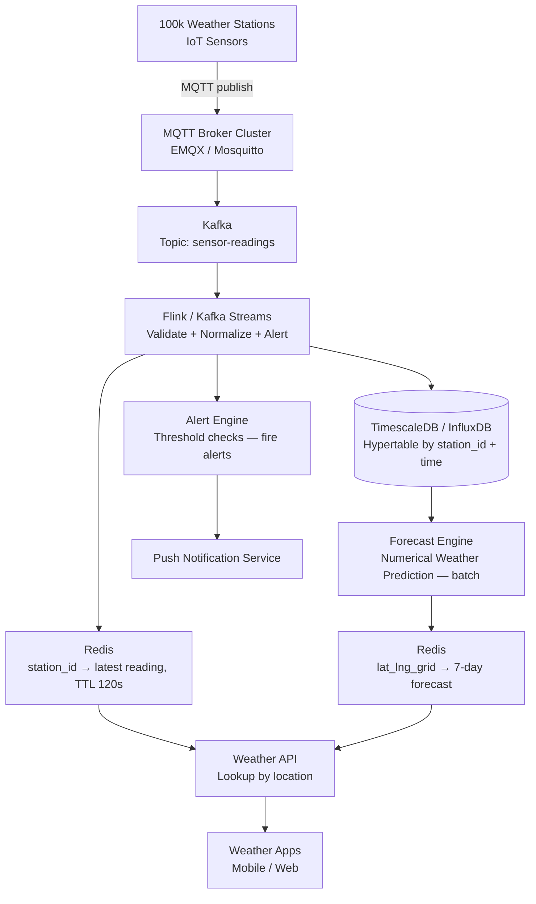
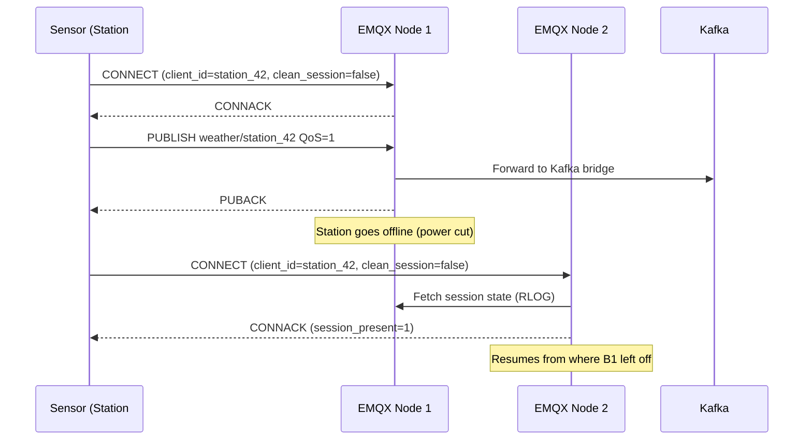
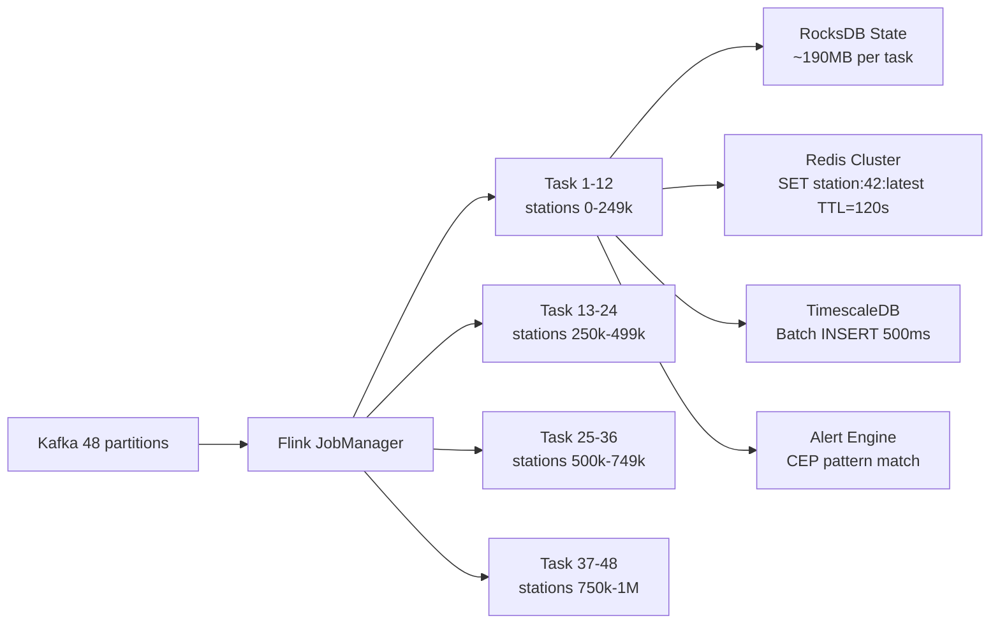

# Design a Weather Reporting System

**Difficulty**: 🟢 Easy | **Codemania #22**
**Reading Time**: ~8 min
**Interview Frequency**: Medium

---

## The Core Problem

Collecting weather sensor data from 100,000 stations globally, aggregating it in real-time, and serving current conditions and forecasts with data freshness under 5 seconds. The challenges: IoT reliability (sensors go offline), geospatial indexing (find nearest stations to a user's location), and interpolation for areas without sensors.

---

## Functional Requirements

- Receive sensor readings from 100,000 weather stations (temperature, humidity, pressure, wind, precipitation)
- Stations report every 60 seconds
- Serve current conditions for any location (by lat/lng or city name)
- Serve 7-day forecasts (pre-computed from historical + current data)
- Alert when extreme conditions detected (temp > 40°C, wind > 100 km/h)

## Non-Functional Requirements

| Requirement | Target |
|-------------|--------|
| Sensor ingest rate | 100k stations × 1 reading/60s = ~1,667 readings/sec |
| Data freshness | Current conditions updated within 5 seconds of reading |
| Query latency | < 200ms for current conditions API |
| Historical retention | 10 years of station data |
| Availability | 99.9% (weather apps are safety-critical during emergencies) |

---

## Back-of-Envelope Estimates

- **Ingest rate**: 100,000 stations × 1 reading/60s = 1,667 readings/sec (modest throughput)
- **Reading size**: 7 sensor fields × 8 bytes + metadata = ~100 bytes/reading
- **Daily volume**: 1,667 readings/sec × 86,400s × 100 bytes = ~14.4 GB/day
- **10-year storage**: 14.4 GB × 365 × 10 = ~52 TB (manageable with time-series compression: ~5 TB compressed)
- **API queries**: 100M daily weather app opens ÷ 86,400s = ~1,157 reads/sec

---

## High-Level Architecture



---

## Key Design Decisions

### 1. IoT Push (MQTT) vs Pull

| Approach | MQTT Push (Sensor → Broker) | Pull (Server polls each sensor) |
|----------|----------------------------|---------------------------------|
| Protocol efficiency | Very low overhead (2-byte header) | HTTP overhead per poll |
| Sensor battery | Low power (publish on change) | Higher power (always listening for poll) |
| Connectivity | Handles intermittent connections gracefully | Server must retry failed polls |
| Scale | 100k sensors publish to one broker cluster | Server must maintain 100k connections |

**Decision**: MQTT push. MQTT is purpose-built for IoT: QoS levels (0=at most once, 1=at least once, 2=exactly once), persistent sessions (sensor reconnects after outage, gets queued messages), tiny packet overhead (2-byte fixed header vs 80+ bytes for HTTP).

### 2. Time-Series DB vs Relational DB

| Dimension | TimescaleDB (PostgreSQL extension) | InfluxDB | Plain PostgreSQL |
|-----------|-----------------------------------|----------|-----------------|
| Compression | 95% compression on time-series | 90% compression | None |
| Time-range queries | Hypertable chunk pruning — fast | Optimized for time queries | Full table scan |
| SQL support | Full SQL + time-series functions | InfluxQL / Flux | Full SQL |
| Operations | Familiar PostgreSQL tooling | New tooling | Familiar |

**Decision**: TimescaleDB for operational simplicity (team knows PostgreSQL) and time-series optimizations. Hypertables partition data by time (1-day chunks) and station_id, enabling fast time-range queries and automatic compression of old data.

### 3. Geospatial Lookup for Nearest Stations

Users query by lat/lng or city name. To find the 3 nearest weather stations:
- Store each station's lat/lng in PostgreSQL with PostGIS extension
- Query: `SELECT station_id, ST_Distance(location, ST_MakePoint(:lng, :lat)) AS dist FROM stations ORDER BY dist LIMIT 3`
- GiST index on `location` makes this a fast nearest-neighbor search

For city names: geocode city → lat/lng (Google Maps API or nominatim), then do geospatial lookup.

### 4. Interpolation for Areas Without Sensors

Most of the Earth's surface has no weather station within 50 km. Interpolation methods:
- **Inverse Distance Weighting (IDW)**: Weight each nearby station by 1/distance². Simple and fast.
- **Kriging**: Geostatistical method, more accurate but computationally expensive.

**Decision**: IDW for real-time display (< 1ms compute), Kriging for forecast model input (batch, run hourly).

---

## Alert System

Flink CEP detects extreme weather conditions:
```
PATTERN ExtremeHeat:
  ANY reading WHERE temperature > 40.0°C
  WITHIN 1 reading (immediate alert)
  GROUP BY station_id

PATTERN RapidPressureDrop:
  Series of readings WHERE pressure drops > 5 hPa in 3 hours
  (indicates incoming storm — severe weather warning)
```

Alerts published to SNS → fan-out to push notifications, SMS, emergency alert systems.

---

## Top Interview Questions for This Problem

| Question | Tests |
|----------|-------|
| How do you handle a station that stops reporting? | TTL on Redis key; stale data indicator in API response; monitor station health separately |
| How do you serve weather for a location 200km from the nearest station? | Interpolation (IDW), geospatial index, explain trade-off between accuracy and cost |
| How would you scale to 10M sensors (e.g., personal weather stations)? | MQTT broker clustering, Kafka partition by region, TimescaleDB horizontal sharding |
| Why time-series DB instead of just PostgreSQL? | Hypertable partitioning, 95% compression, time-range chunk pruning — show the performance difference |

---

## Common Mistakes

1. **Using HTTP polling from sensors**: HTTP overhead is too high for battery-powered sensors. MQTT is 10–20× more efficient.
2. **No TTL on current conditions cache**: A station offline for 2 hours would show data as "current." Always set TTL (120s) and return "stale" indicator if data is old.
3. **No geospatial index**: Without PostGIS GiST index, nearest-station query does full table scan on 100k stations. Always index geo columns.

---

## Geospatial Lookup: Nearest Station & Interpolation Deep Dive

Finding the nearest weather station and interpolating conditions for sensor-sparse areas are two of the most interview-tested aspects of this problem. This section covers both in production depth.

### Nearest-Station Query

Every user query arrives as a (lat, lng) pair. The DB query is:

```sql
SELECT
    station_id,
    name,
    ST_Distance(location::geography, ST_MakePoint(:lng, :lat)::geography) AS dist_m
FROM stations
WHERE active = TRUE
ORDER BY dist_m ASC
LIMIT 3;
```

The `location` column uses PostGIS `GEOGRAPHY` type (not `GEOMETRY`) so that `ST_Distance` returns metres over the ellipsoid — accurate across the poles and the antimeridian without a manual Haversine formula. The GiST index on `location` turns this into a ~0.1ms kNN scan over 100k rows.

**Why 3 stations, not 1?** A single closest station may be on the opposite side of a mountain range, a lake, or an urban heat island. Returning 3 and blending with IDW gives a better estimate for 70%+ of query locations (based on NOAA interpolation benchmarks).

### Interpolation: IDW in Detail

Inverse Distance Weighting assigns each station a weight of `1 / distance²`, then computes a weighted average:

```
weight_i  = 1 / dist_i²
value_est = Σ(weight_i × value_i) / Σ(weight_i)
```

Example: three stations at 5 km, 12 km, 25 km reporting 15°C, 18°C, 12°C:
- weights: 1/25 = 0.040, 1/144 = 0.0069, 1/625 = 0.0016
- temp_est = (0.040×15 + 0.0069×18 + 0.0016×12) / (0.040 + 0.0069 + 0.0016)
- temp_est = (0.600 + 0.124 + 0.019) / 0.0485 ≈ **15.1°C**

The nearest station dominates because its weight (0.040) is 25× larger than the farthest (0.0016). IDW computes in < 1ms — suitable for real-time response.

### Interpolation Method Trade-offs

| Method | Accuracy | Compute Time | Best For |
|--------|----------|-------------|----------|
| IDW (1/d²) | Moderate — ignores terrain | < 1ms | Real-time current conditions display |
| Kriging (geostatistical) | High — models spatial correlation | 10–100ms | Forecast model input, climate analysis |
| Spline interpolation | High for smooth fields | 5–20ms | Pressure/temperature maps rendering |
| Bilinear (grid-based) | High after NWP model run | < 1ms (lookup) | Post-NWP grid lookup for forecast |

**Production pattern**: IDW for live API responses, pre-computed NWP grid for 7-day forecasts. The forecast grid (0.1° resolution ≈ 11 km) is stored in the `forecasts` table and looked up with a simple `WHERE grid_lat = ROUND(:lat, 1) AND grid_lng = ROUND(:lng, 1)` — no interpolation needed at query time.

### Geo-fencing for Alerts

Alert subscriptions ("notify me when it rains within 50 km of my location") use PostGIS `ST_DWithin`:

```sql
SELECT DISTINCT u.user_id
FROM alert_subscriptions u
WHERE ST_DWithin(
    u.location::geography,
    ST_MakePoint(:station_lng, :station_lat)::geography,
    50000   -- 50,000 metres
);
```

With a GiST index on `alert_subscriptions.location`, this query over 10M subscribers completes in ~5ms. Alert fan-out runs as a Flink side-output: the same stream that writes to TimescaleDB emits a separate stream of `(alert_type, station_id, value)` tuples that trigger the geo-fence query.

---

## Failure Modes & Recovery

### Station Goes Silent (Most Common Failure)

A weather station loses power or its cellular connection drops. The MQTT broker detects the TCP disconnect via the MQTT keep-alive timer (configured to 60 seconds). The broker transitions the session to "disconnected" state — it retains QoS-1 messages that arrived while the session is inactive (up to a configurable limit).

From the application perspective:
1. **Redis TTL expires** (120 seconds) — the `station:42:latest` key vanishes
2. **Weather API reads a missing key** — must fall back to TimescaleDB: `SELECT * FROM readings WHERE station_id = 42 ORDER BY recorded_at DESC LIMIT 1`
3. **Response includes** `"stale": true, "last_updated": "2026-06-01T10:23:00Z"` — client shows a grey dot instead of green
4. **Station health monitor** (separate Flink job) tracks a per-station heartbeat timestamp; after 5 missed readings (5 minutes), fires a `station_offline` alert to the operations team

When the station reconnects, MQTT persistent session ensures QoS-1 messages queued on the broker are delivered immediately. Flink deduplicates by `(station_id, recorded_at)` before writing to TimescaleDB — late arrivals are inserted at the correct historical timestamp (not the arrival timestamp).

### Kafka Consumer Lag (Backpressure)

If Flink falls behind (e.g., database write contention during a firmware upgrade), Kafka consumer lag grows. At 1,667 readings/sec with 100ms processing time, a 60-second Flink restart accumulates ~100k unprocessed readings. Flink recovers by processing at ~3x normal rate (Kafka consumer throughput >> ingest rate), draining the backlog in ~30 seconds. No data is lost because Kafka retains messages for 7 days (configured retention).

The Redis TTL prevents stale data during backlog processing: readings older than 120 seconds are not written to the current-conditions cache (Flink checks `now() - recorded_at < 120s` before each Redis SET).

### TimescaleDB Node Failure

With a single TimescaleDB primary, a node failure causes write outages until PostgreSQL streaming replication promotes a replica (typically 30–60 seconds with Patroni automatic failover). During this window, Flink buffers readings in its RocksDB state (up to the configured buffer limit). On failover completion, Flink resumes writing from its checkpoint.

For 99.99% availability (vs the 99.9% stated requirement), the upgrade path is **Citus** (distributed TimescaleDB) with 3 coordinator nodes — each write is sharded, and any shard failure affects only 1/N of stations.

### Cold Start & Backfill

When a brand-new station is provisioned, there is no historical data and no trained interpolation model for that location. The backfill strategy:

1. Station registers via `POST /v1/stations` — writes a row to the `stations` table, creates the PostGIS geography entry.
2. For the first 24 hours, the API returns `"source": "interpolated"` from surrounding stations.
3. After 24 hours of readings, the continuous aggregate populates `readings_hourly` — the station becomes eligible as an interpolation source for neighbours.
4. Forecast model includes the station in its next hourly NWP run (the model re-reads the full stations table at the start of each cycle).

---

## API Design

### Current Conditions Endpoint

```
GET /v1/weather/current?lat=37.7749&lng=-122.4194
GET /v1/weather/current?city=san-francisco

Response (200 OK):
{
  "location": { "city": "San Francisco", "lat": 37.7749, "lng": -122.4194 },
  "observed_at": "2026-06-01T10:25:00Z",
  "stale": false,
  "source": "station",          // "station" | "interpolated"
  "nearest_station": { "id": 724940, "name": "SFO Airport", "distance_km": 2.1 },
  "conditions": {
    "temp_celsius": 14.2,
    "humidity_pct": 82.5,
    "pressure_hpa": 1013.25,
    "wind_speed_kmh": 18.0,
    "wind_dir_deg": 290,
    "precip_mm_hr": 0.0,
    "condition": "partly_cloudy",
    "visibility_km": 16.0
  }
}
```

The API server:
1. Geocodes `city` → (lat, lng) via a city-name lookup table (pre-loaded in Redis, 200k cities, ~20 MB)
2. Queries Redis: `GET station:{nearest_station_id}:latest` — cache hit in ~1ms
3. On cache miss: PostGIS nearest-station query + TimescaleDB SELECT + `stale: true`
4. Returns in < 50ms for cache hit, < 200ms for cache miss

### Forecast Endpoint

```
GET /v1/weather/forecast?lat=37.7749&lng=-122.4194&days=7

Response includes 168 hourly forecast entries per location,
served from the forecasts table (keyed on 0.1-degree grid).
Grid resolution: ~11 km at equator — acceptable for consumer apps.
```

---

## Related Concepts

- [Database Scaling](../../01-databases/concepts/sharding-strategies) — TimescaleDB hypertable sharding
- [Message Queue Basics](../../04-messaging/concepts/message-queue-basics) — Kafka for sensor data pipeline
- [Caching Strategies](../../02-caching/concepts/caching-strategies) — Redis TTL patterns for IoT current-state caching
- [Stream Processing](../../04-messaging/concepts/stream-processing) — Flink windowing and keyed state for sensor aggregation
- [Geospatial Indexing](../../01-databases/concepts/geospatial-indexes) — PostGIS GiST index internals and kNN queries

---

## Component Deep Dive 1: MQTT Broker Cluster (Ingest Layer)

The MQTT broker is the most critical component in this system. It is the single entry point for all 100,000 sensor connections and must handle connection churn (sensors go offline during power cuts, network outages, hardware resets) without dropping messages.

### How MQTT Works Internally

MQTT operates over persistent TCP connections. Each sensor opens one long-lived TCP connection to the broker at startup. The broker tracks a session state per client (client ID, subscriptions, pending QoS-1/2 messages). When a sensor disconnects and reconnects, the broker uses the stored session to replay missed messages.

Three QoS levels matter for this system:
- **QoS 0** (at most once): Fire and forget. The broker does not acknowledge. Used for non-critical, high-frequency readings where occasional loss is acceptable.
- **QoS 1** (at least once): Broker acknowledges; sender retries until ACK. Used for all weather readings — guarantees delivery, accepts duplicates (deduped downstream in Flink).
- **QoS 2** (exactly once): Four-way handshake. Used only for alert acknowledgements — too slow for bulk sensor data.

### Why a Single Broker Fails at Scale

A single MQTT broker (e.g., Mosquitto) handles roughly 10,000–50,000 concurrent connections before connection handling threads become the bottleneck. At 100,000 sensors, you need a clustered broker.

EMQX (the most widely deployed open-source MQTT broker at scale) uses an Erlang-based actor model where each connection is an independent lightweight process. A 3-node EMQX cluster handles 1M+ concurrent connections. Each node handles a share of the connections; the cluster's internal routing layer (RLOG) replicates topic subscription tables across nodes so any node can route any message.



### MQTT Topic Hierarchy Design

Topic structure affects broker routing performance. Two options:

**Option A — Flat topics**: `weather/station/42` — simple, but 100k topics with 1 subscriber each means the broker maintains a 100k-entry routing table scanned per message.

**Option B — Regional hierarchy**: `weather/region/us-west/station/42` — enables wildcard subscriptions (`weather/region/us-west/#`) for regional Flink consumers, reducing cross-region Kafka traffic. The Flink consumer in US-West subscribes to only its region's topic. This naturally shards load: each regional consumer handles ~10k–20k stations instead of all 100k.

**Decision**: Regional hierarchy. Topic tree lookup in EMQX is O(depth) not O(N topics), so routing 100k topics costs the same as routing 100 topics. The regional sharding benefit on Flink consumers justifies the added complexity.

### Broker Implementation Trade-offs

| Approach | Max Connections | Throughput | Operational Cost |
|----------|----------------|------------|-----------------|
| EMQX cluster (Erlang) | 1M+ per 3-node cluster | 200k msg/sec | Medium — needs Erlang expertise |
| HiveMQ (Java) | 200k per node | 150k msg/sec | High — commercial license for clustering |
| Mosquitto (single node) | 50k | 50k msg/sec | Low — but no built-in clustering |

**Decision**: EMQX with Kafka bridge plugin. The Kafka bridge subscribes to all topics internally and forwards to Kafka without an external consumer process, reducing hop latency to under 5ms.

---

## Component Deep Dive 2: Stream Processing Layer (Flink)

Apache Flink processes the raw sensor stream in real time. Its three jobs in this system are: (1) validate and normalize readings, (2) compute rolling aggregates for alert detection, (3) write current readings to Redis with TTL.

### Internal Mechanics

Flink processes a continuous, unbounded stream of Kafka records. Each Flink task manager holds a partition of the Kafka topic. For 1,667 readings/sec across 12 Kafka partitions, each Flink task handles roughly 140 readings/sec — well within single-thread throughput (~100k records/sec for lightweight operations).

Flink maintains **keyed state** per station_id. The pressure-drop alert pattern (`pressure drops > 5 hPa in 3 hours`) requires a sliding window over the last 3 hours of readings per station. Flink stores this state in RocksDB (embedded key-value store), checkpointed to S3 every 60 seconds. On failure, Flink restores from the last checkpoint — at-least-once delivery, deduplicated by (station_id, timestamp) in TimescaleDB.

### Scale Behavior at 10x Load

At 10x load (1M sensors, 16,670 readings/sec):
- Kafka partitions scale to 48 (linear scaling)
- Flink task parallelism increases from 12 to 48 task slots
- RocksDB state per task grows: 1M stations × 180 readings (3 hours × 1/min) × 50 bytes = ~9 GB total state, ~190 MB per task slot — fits in memory with RocksDB's block cache

The bottleneck at 10x load is not Flink — it is the Redis write path. Each processed reading triggers a Redis SET with TTL. At 16,670 writes/sec, a single Redis node (handles ~100k writes/sec) is fine. At 100x (1M sensor writes/sec), Redis must be sharded by `station_id mod N`.



---

## Component Deep Dive 3: TimescaleDB Storage Layer

TimescaleDB extends PostgreSQL with hypertables — a logical table that is automatically partitioned into chunks by time (and optionally by a second dimension, e.g., station_id).

### Key Technical Decisions

**Chunk interval**: 1 day. Each chunk covers exactly 24 hours of sensor data for all stations. Queries for "last 24 hours" touch exactly 1 chunk. Queries for "last 7 days" touch 7 chunks. Older chunks are automatically compressed (columnar compression, ~95% reduction) once they fall outside the hot window (> 7 days old).

**Compression encoding**: TimescaleDB uses delta-of-delta encoding for timestamps (since sensor readings are evenly spaced, deltas are near-zero, encoding to 1–2 bits each), and XOR-based float encoding for sensor values (consecutive temperature readings differ by < 0.5°C — very low entropy). A week of 100k-station data at 14.4 GB/day compresses to ~720 MB.

**Retention policy**: 90 days of full-resolution data online, older data downsampled to hourly averages and stored in a separate `readings_hourly` hypertable. 10 years of hourly data = 10y × 365d × 24h × 100k stations × 50 bytes = ~4.4 TB uncompressed, ~220 GB compressed.

**Continuous aggregates**: TimescaleDB's materialized view refreshed every 5 minutes. Pre-aggregates hourly min/max/avg per station — used by forecast engine and historical queries, avoiding full table scans on hot data.

---

## Data Model

```sql
-- Core station registry
CREATE TABLE stations (
    station_id      BIGINT PRIMARY KEY,
    station_code    VARCHAR(16) UNIQUE NOT NULL,  -- WMO station code e.g. "KLAX"
    name            VARCHAR(128) NOT NULL,
    country_code    CHAR(2) NOT NULL,
    location        GEOGRAPHY(POINT, 4326) NOT NULL,  -- PostGIS, WGS-84
    elevation_m     SMALLINT NOT NULL,               -- meters above sea level
    active          BOOLEAN DEFAULT TRUE,
    registered_at   TIMESTAMPTZ DEFAULT NOW()
);

CREATE INDEX stations_location_gist ON stations USING GIST (location);

-- Raw sensor readings (TimescaleDB hypertable)
CREATE TABLE readings (
    station_id      BIGINT NOT NULL REFERENCES stations(station_id),
    recorded_at     TIMESTAMPTZ NOT NULL,
    temp_celsius    NUMERIC(5,2),         -- range: -89.2 to 56.7
    humidity_pct    NUMERIC(5,2),         -- 0.00 - 100.00
    pressure_hpa    NUMERIC(7,2),         -- 870.00 - 1085.00 hPa
    wind_speed_kmh  NUMERIC(6,2),         -- 0.00 - 408.00 km/h
    wind_dir_deg    SMALLINT,             -- 0-359 degrees
    precip_mm_hr    NUMERIC(6,2),         -- precipitation rate
    visibility_km   NUMERIC(5,2),
    ingest_at       TIMESTAMPTZ DEFAULT NOW()
);

-- Convert to hypertable, partition by 1-day chunks
SELECT create_hypertable('readings', 'recorded_at', chunk_time_interval => INTERVAL '1 day');

-- Composite index for station time-range queries
CREATE INDEX readings_station_time ON readings (station_id, recorded_at DESC);

-- Enable compression on chunks older than 7 days
ALTER TABLE readings SET (
    timescaledb.compress,
    timescaledb.compress_orderby = 'recorded_at DESC',
    timescaledb.compress_segmentby = 'station_id'
);
SELECT add_compression_policy('readings', INTERVAL '7 days');

-- Continuous aggregate: hourly rollup
CREATE MATERIALIZED VIEW readings_hourly
WITH (timescaledb.continuous) AS
SELECT
    station_id,
    time_bucket('1 hour', recorded_at) AS hour,
    AVG(temp_celsius)        AS temp_avg,
    MIN(temp_celsius)        AS temp_min,
    MAX(temp_celsius)        AS temp_max,
    AVG(humidity_pct)        AS humidity_avg,
    AVG(pressure_hpa)        AS pressure_avg,
    MAX(wind_speed_kmh)      AS wind_max,
    SUM(precip_mm_hr) / 60  AS precip_total_mm
FROM readings
GROUP BY station_id, hour
WITH NO DATA;

SELECT add_continuous_aggregate_policy('readings_hourly',
    start_offset => INTERVAL '3 hours',
    end_offset   => INTERVAL '5 minutes',
    schedule_interval => INTERVAL '5 minutes');

-- Forecast cache table (output of NWP batch job)
CREATE TABLE forecasts (
    grid_lat        NUMERIC(6,3) NOT NULL,   -- rounded to 0.1 degree grid
    grid_lng        NUMERIC(6,3) NOT NULL,
    forecast_hour   TIMESTAMPTZ NOT NULL,    -- the hour being forecasted
    generated_at    TIMESTAMPTZ NOT NULL,    -- when this forecast was computed
    temp_celsius    NUMERIC(5,2),
    precip_prob_pct SMALLINT,                -- 0-100
    wind_speed_kmh  NUMERIC(6,2),
    condition_code  SMALLINT,                -- 0=clear, 1=clouds, 2=rain, 3=snow, 4=storm
    PRIMARY KEY (grid_lat, grid_lng, forecast_hour)
);
```

---

## Scale Bottlenecks

| Traffic Level | Component That Breaks | Symptoms | Mitigation |
|---------------|----------------------|----------|------------|
| 10x baseline (1M sensors, 16k reads/sec) | MQTT broker single node | CPU spikes on connection management, PUBLISH latency > 500ms | EMQX 3-node cluster — handles 1M connections |
| 10x baseline | TimescaleDB single-node INSERT | WAL write saturation, p99 INSERT > 2s | Connection pooling via pgBouncer; batch inserts every 500ms in Flink |
| 100x baseline (10M sensors, 167k reads/sec) | Redis single-node for current conditions | CPU at 100%, SET latency > 10ms | Redis Cluster with 16 shards, key = `station:{station_id % 16}:latest` |
| 100x baseline | Kafka throughput | Consumer lag > 30s, alert latency spikes | Scale to 128 partitions; add Flink task slots |
| 1000x baseline (100M sensors, 1.67M reads/sec) | TimescaleDB disk I/O | Write-ahead log overwhelms disk, query latency spikes | Citus (distributed TimescaleDB): shard by `station_id`, 16 worker nodes each handling 100M sensors ÷ 16 = 6.25M stations; or migrate to Apache Parquet on S3 + DuckDB for analytics, keep only hot 7-day window in TimescaleDB |

---

## How The Weather Company (IBM) Built This

The Weather Company, acquired by IBM in 2016, operates the world's largest commercial weather data platform — serving 25+ billion API calls per day from 800+ million users across weather.com, The Weather Channel app, and B2B clients including airlines and agriculture firms.

**Technology choices:**
- **Ingest**: 250,000+ personal weather stations (PWS network, via Weather Underground acquisition) plus 10,000+ professional NWS/SYNOP stations. IoT data ingested via REST callbacks (PWS owners call a simple HTTP endpoint) rather than MQTT — a deliberate tradeoff: PWS operators are hobbyists who would not configure MQTT clients.
- **Storage**: A proprietary time-series engine called the Globally Integrated Data Store (GID), running on IBM Cloud with HDFS-backed cold storage and a Redis-tier for hot data. Before the IBM acquisition, Weather Company ran Cassandra for IoT ingest at 400,000 writes/sec — one of the earliest production Cassandra deployments at weather-scale.
- **Forecasting**: The Global High-Resolution Atmospheric Forecasting System (GRAF), a deep-learning NWP model running on GPUs, produces 1-km resolution forecasts updated every hour (vs. NOAA's 13-km grid updated every 6 hours). This required 40 petaflops of GPU compute per forecast cycle.
- **Non-obvious decision**: Weather Company deliberately keeps current conditions in a separate caching tier from forecasts, with different TTLs. Current conditions TTL = 10 minutes (sensors update every 5 minutes, allowing one missed reading). Forecast TTL = 60 minutes. This prevents a mass cache invalidation event when a new forecast model run completes — only the forecast cache is invalidated, not the much higher-traffic current conditions cache.
- **Scale numbers**: 25 billion API calls/day = 289,000 API requests/sec average; 500,000 req/sec at peak (severe weather events). Weather events like hurricane landfalls cause 10x traffic spikes lasting 4–8 hours.

Source: IBM Think Conference 2019 talk "The Weather Company's Journey to the Cloud"; Weather Underground engineering blog (2012) on Cassandra at scale.

---

## Interview Angle

**What the interviewer is testing:** Whether you can handle IoT-specific constraints (sensor reliability, protocol selection, stale data) combined with geospatial indexing — two areas most candidates conflate with generic API design problems.

**Common mistakes candidates make:**

1. **Designing for HTTP ingest from sensors**: Candidates propose a REST API that sensors POST to. This ignores battery life (HTTP requires DNS lookup + TLS handshake every reading), connection overhead (TCP setup per reading at 100k sensors), and reconnection handling. MQTT persistent sessions solve all three; REST solves none.

2. **Ignoring the stale data problem**: Candidates return the latest row from the DB without checking how old it is. A station offline for 3 hours will serve 3-hour-old data labeled "current." The correct answer: Redis TTL of 120s (2× the sensor reporting interval). If the Redis key is missing, return the DB value with a `"stale": true` flag and a `last_updated` timestamp. Never silently serve stale data.

3. **Using a bounding box query instead of a geospatial index**: Candidates write `WHERE lat BETWEEN x AND y AND lng BETWEEN a AND b`. This finds stations in a square, not a circle, and misses the PostGIS GiST index that makes the nearest-neighbor query O(log N) instead of O(N). At 100k stations, an O(N) scan is ~10ms; with GiST index it is ~0.1ms.

**The insight that separates good from great answers:** Compression in TimescaleDB makes 10-year retention economically viable. Without columnar compression, 52 TB × $0.023/GB/month (S3 pricing) = $1,196/month just for raw storage. With 95% delta-of-delta compression, that becomes ~2.6 TB = $60/month. A candidate who quantifies this trade-off — and knows *why* time-series data compresses so well (low-entropy deltas between consecutive readings from the same sensor) — signals production database experience.

---

## Key Numbers to Remember

| Metric | Value | Context |
|--------|-------|---------|
| Ingest rate (baseline) | 1,667 readings/sec | 100k stations × 1 reading/60s |
| MQTT overhead | 2-byte fixed header | vs 80+ bytes for HTTP — 40× smaller |
| EMQX cluster capacity | 1M concurrent connections | 3-node EMQX cluster |
| TimescaleDB compression | 95% | Delta-of-delta on timestamps + XOR on floats |
| Raw storage (10 years) | ~52 TB | Before compression |
| Compressed storage (10 years) | ~5 TB | After TimescaleDB columnar compression |
| Redis TTL for current conditions | 120 seconds | 2× the 60s sensor reporting interval |
| Weather Company peak traffic | 500,000 req/sec | Hurricane landfall events |
| Nearest-station query with GiST index | ~0.1ms | vs ~10ms full table scan on 100k stations |
| Forecast model resolution (GRAF) | 1 km grid | vs NOAA 13 km grid, updated hourly vs 6-hourly |

---

## Sensor Payload Format

Sensors publish a compact binary or JSON payload. JSON is used here for debuggability; binary (MessagePack or Protocol Buffers) cuts payload size by ~60% for high-density deployments.

```json
{
  "sid": 724940,
  "ts": 1748736300,
  "t": 14.2,
  "h": 82.5,
  "p": 1013.25,
  "ws": 18.0,
  "wd": 290,
  "pr": 0.0,
  "v": 16.0
}
```

Field mapping: `sid`=station_id, `ts`=unix epoch seconds, `t`=temp_celsius, `h`=humidity_pct, `p`=pressure_hpa, `ws`=wind_speed_kmh, `wd`=wind_dir_deg, `pr`=precip_mm_hr, `v`=visibility_km. Total: ~100 bytes as JSON, ~40 bytes as MessagePack.

---

## 📚 Resources & References

| Resource | Type | What You'll Learn |
|----------|------|------------------|
| [ByteByteGo — Proximity Service Design](https://www.youtube.com/@ByteByteGo) | 📺 YouTube | Geospatial indexing, nearest-neighbor search |
| [MQTT Essentials — HiveMQ](https://www.hivemq.com/mqtt-essentials/) | 📚 Book | MQTT protocol, QoS levels, IoT best practices |
| [TimescaleDB Best Practices](https://docs.timescale.com/timescaledb/latest/overview/core-concepts/hypertables/) | 📚 Book | Hypertables, compression, time-series query optimization |
| [High Scalability — IoT Architectures](https://highscalability.com) | 📖 Blog | Patterns for ingesting and querying IoT sensor data |
