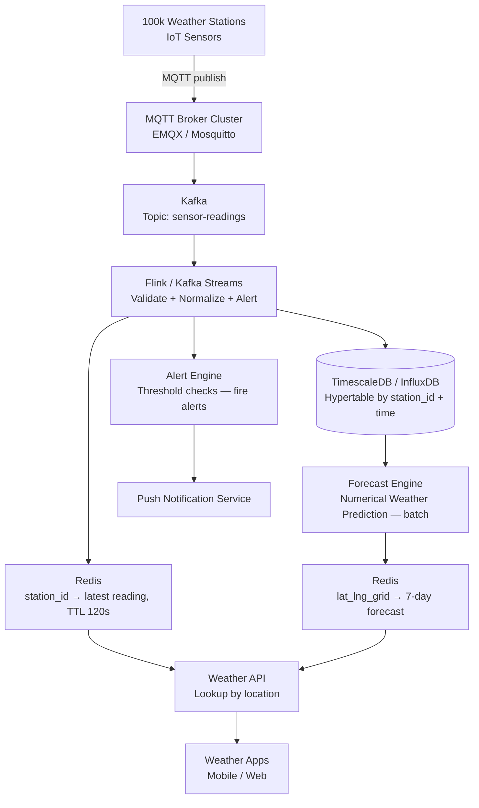

# Design a Weather Reporting System

**Difficulty**: 🟢 Easy | **Codemania #22**
**Reading Time**: ~8 min
**Interview Frequency**: Medium

---

## The Core Problem

Collecting weather sensor data from 100,000 stations globally, aggregating it in real-time, and serving current conditions and forecasts with data freshness under 5 seconds. The challenges: IoT reliability (sensors go offline), geospatial indexing (find nearest stations to a user's location), and interpolation for areas without sensors.

---

## Functional Requirements

- Receive sensor readings from 100,000 weather stations (temperature, humidity, pressure, wind, precipitation)
- Stations report every 60 seconds
- Serve current conditions for any location (by lat/lng or city name)
- Serve 7-day forecasts (pre-computed from historical + current data)
- Alert when extreme conditions detected (temp > 40°C, wind > 100 km/h)

## Non-Functional Requirements

| Requirement | Target |
|-------------|--------|
| Sensor ingest rate | 100k stations × 1 reading/60s = ~1,667 readings/sec |
| Data freshness | Current conditions updated within 5 seconds of reading |
| Query latency | < 200ms for current conditions API |
| Historical retention | 10 years of station data |
| Availability | 99.9% (weather apps are safety-critical during emergencies) |

---

## Back-of-Envelope Estimates

- **Ingest rate**: 100,000 stations × 1 reading/60s = 1,667 readings/sec (modest throughput)
- **Reading size**: 7 sensor fields × 8 bytes + metadata = ~100 bytes/reading
- **Daily volume**: 1,667 readings/sec × 86,400s × 100 bytes = ~14.4 GB/day
- **10-year storage**: 14.4 GB × 365 × 10 = ~52 TB (manageable with time-series compression: ~5 TB compressed)
- **API queries**: 100M daily weather app opens ÷ 86,400s = ~1,157 reads/sec

---

## High-Level Architecture



---

## Key Design Decisions

### 1. IoT Push (MQTT) vs Pull

| Approach | MQTT Push (Sensor → Broker) | Pull (Server polls each sensor) |
|----------|----------------------------|---------------------------------|
| Protocol efficiency | Very low overhead (2-byte header) | HTTP overhead per poll |
| Sensor battery | Low power (publish on change) | Higher power (always listening for poll) |
| Connectivity | Handles intermittent connections gracefully | Server must retry failed polls |
| Scale | 100k sensors publish to one broker cluster | Server must maintain 100k connections |

**Decision**: MQTT push. MQTT is purpose-built for IoT: QoS levels (0=at most once, 1=at least once, 2=exactly once), persistent sessions (sensor reconnects after outage, gets queued messages), tiny packet overhead (2-byte fixed header vs 80+ bytes for HTTP).

### 2. Time-Series DB vs Relational DB

| Dimension | TimescaleDB (PostgreSQL extension) | InfluxDB | Plain PostgreSQL |
|-----------|-----------------------------------|----------|-----------------|
| Compression | 95% compression on time-series | 90% compression | None |
| Time-range queries | Hypertable chunk pruning — fast | Optimized for time queries | Full table scan |
| SQL support | Full SQL + time-series functions | InfluxQL / Flux | Full SQL |
| Operations | Familiar PostgreSQL tooling | New tooling | Familiar |

**Decision**: TimescaleDB for operational simplicity (team knows PostgreSQL) and time-series optimizations. Hypertables partition data by time (1-day chunks) and station_id, enabling fast time-range queries and automatic compression of old data.

### 3. Geospatial Lookup for Nearest Stations

Users query by lat/lng or city name. To find the 3 nearest weather stations:
- Store each station's lat/lng in PostgreSQL with PostGIS extension
- Query: `SELECT station_id, ST_Distance(location, ST_MakePoint(:lng, :lat)) AS dist FROM stations ORDER BY dist LIMIT 3`
- GiST index on `location` makes this a fast nearest-neighbor search

For city names: geocode city → lat/lng (Google Maps API or nominatim), then do geospatial lookup.

### 4. Interpolation for Areas Without Sensors

Most of the Earth's surface has no weather station within 50 km. Interpolation methods:
- **Inverse Distance Weighting (IDW)**: Weight each nearby station by 1/distance². Simple and fast.
- **Kriging**: Geostatistical method, more accurate but computationally expensive.

**Decision**: IDW for real-time display (< 1ms compute), Kriging for forecast model input (batch, run hourly).

---

## Alert System

Flink CEP detects extreme weather conditions:
```
PATTERN ExtremeHeat:
  ANY reading WHERE temperature > 40.0°C
  WITHIN 1 reading (immediate alert)
  GROUP BY station_id

PATTERN RapidPressureDrop:
  Series of readings WHERE pressure drops > 5 hPa in 3 hours
  (indicates incoming storm — severe weather warning)
```

Alerts published to SNS → fan-out to push notifications, SMS, emergency alert systems.

---

## Top Interview Questions for This Problem

| Question | Tests |
|----------|-------|
| How do you handle a station that stops reporting? | TTL on Redis key; stale data indicator in API response; monitor station health separately |
| How do you serve weather for a location 200km from the nearest station? | Interpolation (IDW), geospatial index, explain trade-off between accuracy and cost |
| How would you scale to 10M sensors (e.g., personal weather stations)? | MQTT broker clustering, Kafka partition by region, TimescaleDB horizontal sharding |
| Why time-series DB instead of just PostgreSQL? | Hypertable partitioning, 95% compression, time-range chunk pruning — show the performance difference |

---

## Common Mistakes

1. **Using HTTP polling from sensors**: HTTP overhead is too high for battery-powered sensors. MQTT is 10–20× more efficient.
2. **No TTL on current conditions cache**: A station offline for 2 hours would show data as "current." Always set TTL (120s) and return "stale" indicator if data is old.
3. **No geospatial index**: Without PostGIS GiST index, nearest-station query does full table scan on 100k stations. Always index geo columns.

---

## Related Concepts

- [Database Scaling](../../01-databases/concepts/database-scaling) — TimescaleDB hypertable sharding
- [Message Queue Basics](../../04-messaging/concepts/message-queue-basics) — Kafka for sensor data pipeline

---

## 📚 Resources & References

| Resource | Type | What You'll Learn |
|----------|------|------------------|
| [ByteByteGo — Proximity Service Design](https://www.youtube.com/@ByteByteGo) | 📺 YouTube | Geospatial indexing, nearest-neighbor search |
| [MQTT Essentials — HiveMQ](https://www.hivemq.com/mqtt-essentials/) | 📚 Book | MQTT protocol, QoS levels, IoT best practices |
| [TimescaleDB Best Practices](https://docs.timescale.com/timescaledb/latest/overview/core-concepts/hypertables/) | 📚 Book | Hypertables, compression, time-series query optimization |
| [High Scalability — IoT Architectures](https://highscalability.com) | 📖 Blog | Patterns for ingesting and querying IoT sensor data |
