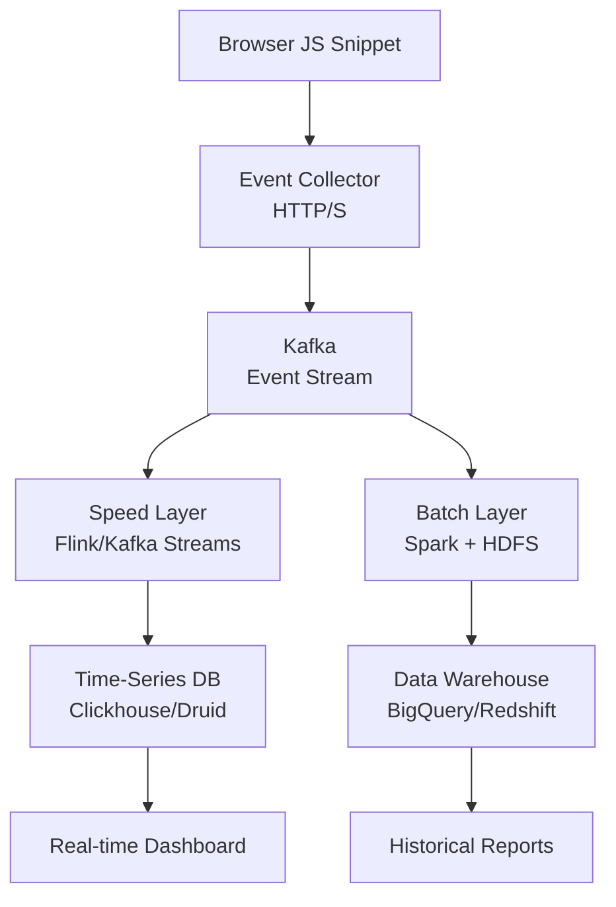
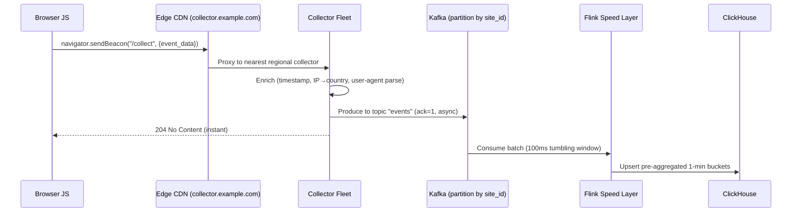

# Design a Web Analytics Platform (Google Analytics)

**Difficulty**: 🟡 Intermediate
**Reading Time**: Coming Soon
**Interview Frequency**: Medium

---

> 🚧 **Full article coming soon.** This stub gives you the essentials to start thinking about this problem.

---

## The Core Problem

Collecting 100 billion events per day from millions of websites, computing real-time dashboards (active users in last 5 min), and generating historical reports (monthly uniques by country) requires fundamentally different processing paths — the same data pipeline cannot efficiently serve both sub-second real-time queries and multi-year historical aggregations.

## Functional Requirements

- Collect pageviews, clicks, and custom events from embedded JS snippet
- Show real-time dashboard: active users, top pages (last 5 min)
- Historical reports: DAU, sessions, bounce rate, funnels (up to 2 years)
- Support filtering/segmentation by country, device, campaign

## Non-Functional Requirements

| Requirement | Target |
|-------------|--------|
| Ingest throughput | 1M events/sec (100B/day) |
| Real-time latency | < 30 seconds to dashboard |
| Historical query time | < 5 seconds for complex aggregations |
| Data retention | 2 years raw, indefinite aggregates |

## Back-of-Envelope Estimates

- **Event ingestion**: 100B events/day ÷ 86,400 = ~1.16M events/sec peak
- **Raw storage**: 1.16M events/sec × 200 bytes per event = 232MB/sec → ~20TB/day raw
- **Unique visitor counting**: HyperLogLog uses 12KB per cardinality estimate vs 8MB exact set for 1M users

## Key Design Decisions

1. **Lambda Architecture** — batch layer (Spark/Hadoop) for accurate historical aggregates recomputed nightly; speed layer (Flink/Kafka Streams) for approximate real-time counts; serving layer merges both results.
2. **Pre-aggregation at Ingestion** — don't store every raw event for dashboard queries; aggregate into 1-minute buckets by (site_id, page, country, device) at ingest time to enable fast time-series queries.
3. **Approximate Counting with HyperLogLog** — exact unique visitor counts require storing all user IDs (8MB per day per site); HyperLogLog gives ±2% accuracy at 12KB memory — 99.94% space savings.

## High-Level Architecture



## Top Interview Questions for This Problem

| Question | Tests |
|----------|-------|
| How do you count daily unique visitors without storing all user IDs? | HyperLogLog, approximate counting |
| How would you handle late-arriving events (user was offline for 2 hours)? | Watermarking, late data handling |
| How do you ensure the JS tracking pixel doesn't slow down customer websites? | Async loading, beacon API |

## Related Concepts

- [Time-Series Databases for metrics storage](../05-infrastructure/metrics-alerting)
- [Kafka for high-throughput event streaming](../05-infrastructure/distributed-messaging)

---

## Component Deep Dive 1: Event Ingestion Pipeline

The event ingestion pipeline is the most critical component in a web analytics system. It must accept 1M+ events/sec from millions of browser sessions without becoming a bottleneck, while also being resilient to spike traffic during viral campaigns or flash sales.

### How It Works Internally

Every tracked page sends a 1x1 pixel request or a `navigator.sendBeacon()` call to the collector endpoint. The collector does minimal work — it validates the payload, attaches server-side metadata (timestamp, IP, user-agent), and immediately writes to Kafka. No synchronous DB writes happen in the hot path.

The JS snippet loads asynchronously (using `async` or `defer`) so it never blocks page render. The snippet queues events locally in memory, then flushes them in batches using the Beacon API (`navigator.sendBeacon`) which fires even when the user navigates away.

### Why Naive Approaches Fail at Scale

A direct write to a relational database at 1M events/sec would require 1000+ DB servers even with connection pooling. Write amplification from indexes makes it worse. A naive HTTP server writing to PostgreSQL will saturate at roughly 5k–20k writes/sec per instance — requiring 50–200 instances just for peak load, with zero burst tolerance.

### Ingestion Sequence Diagram



### Implementation Options

| Approach | Latency | Throughput | Trade-off |
|----------|---------|------------|-----------|
| Collector → Kafka (async produce) | < 5ms p99 | 1M+ events/sec per cluster | Message loss risk if Kafka is unavailable (use acks=1 not acks=all for throughput) |
| Collector → Kinesis Data Streams | < 10ms p99 | 1MB/sec per shard (need 200+ shards at peak) | Managed service; shard splitting adds operational overhead |
| Collector → direct ClickHouse insert | 20–50ms p99 | ~500k rows/sec with async inserts | Eliminates Kafka dependency; less resilient to ClickHouse downtime |

The Kafka approach is preferred because it decouples ingestion durability from processing throughput. Producers only wait for the broker leader to acknowledge (acks=1), not all replicas, trading minimal durability risk for 3–5x throughput gain. At 1M events/sec with 200-byte average payload, Kafka needs ~200MB/sec network throughput — achievable with 3–5 broker nodes on 10GbE networking.

---

## Component Deep Dive 2: Approximate Counting with HyperLogLog

Counting unique visitors (DAU, MAU) is the core challenge in analytics. The naive approach — storing a set of all seen user IDs per day per site — blows up memory and storage at scale.

### Internal Mechanics

HyperLogLog (HLL) works by hashing each user ID and observing the position of the leftmost 1-bit in the hash. The intuition: if you've seen a hash with 15 leading zeros, you've likely seen roughly 2^15 = 32,768 distinct items. HLL maintains 2^b buckets (typically b=14, giving 16,384 buckets), each tracking the maximum leading-zero position seen. The final cardinality estimate uses harmonic mean across all buckets.

**Error rate**: ±1.04/√m where m = bucket count. With 16,384 buckets: ±0.81% error. This is well within acceptable bounds for analytics.

**Memory per HLL register**: 12KB for 2^14 buckets at 6 bits each. Vs. a raw set: 8 bytes per user ID × 1M DAU = 8MB. **Space savings: 99.85%**.

### Mergeability — The Key Property

HLL registers can be merged with bitwise OR — computing weekly uniques from seven daily HLLs costs O(m) time regardless of how many users were seen. This makes hierarchical rollups (hourly → daily → monthly → yearly) trivially cheap.

### Scale Behavior at 10x Load

At 10x load (10M events/sec), the HLL itself doesn't break — it's computed in-memory in Flink with constant time per event. What breaks is the cardinality of distinct (site_id, date) HLL registers needing to be maintained in memory. At 10M active sites × 365 days = 3.65B HLL objects. Solution: evict registers to ClickHouse after the day closes, and only keep the current-day HLL in Flink state.

```mermaid
graph LR
    subgraph Flink State [Flink Keyed State - Current Day]
        HLL_S1[site_1 HLL\n12KB]
        HLL_S2[site_2 HLL\n12KB]
        HLL_SN[site_N HLL\n12KB]
    end
    subgraph ClickHouse [ClickHouse - Historical]
        AGG[Aggregated HLL\nper site per day]
    end
    Flink State -- "Day rollover\nserialize + flush" --> ClickHouse
    ClickHouse -- "Weekly/monthly query\nmergeState()" --> Result[Cardinality Estimate]
```

---

## Component Deep Dive 3: Pre-Aggregation and the Serving Layer

Raw event storage at 20TB/day for 2 years = ~14.6PB. Querying raw events for a "top pages last 7 days" report would require scanning terabytes of data per query — unacceptable for a sub-5-second SLA.

### Strategy: Write-Time Pre-Aggregation

The Flink speed layer aggregates events into 1-minute tumbling windows keyed by `(site_id, page_url, country, device_type, event_type)`. Each window emits a row containing `count`, `hll_sketch` (for uniques), `session_count`, and `bounce_count`.

ClickHouse stores these minute-level aggregates in a columnar format with a primary key on `(site_id, timestamp, page_url)`. Queries for "top 10 pages last 24 hours" scan only the minute-aggregate table (1440 rows per page per day), not raw events.

For historical reports (>7 days), a nightly Spark job reads minute-aggregates from ClickHouse and computes daily rollups into BigQuery. BigQuery's column-oriented storage handles arbitrary GROUP BY queries across 2 years of daily aggregates in under 5 seconds thanks to partitioning by `date` and clustering by `site_id`.

### Technical Decision: ClickHouse vs. Druid vs. Pinot

| Feature | ClickHouse | Apache Druid | Apache Pinot |
|---------|-----------|--------------|--------------|
| Ingestion model | Async inserts + MergeTree | Lambda (batch + real-time) | Real-time via UPSERT |
| Query language | Full SQL | SQL-like (limited JOINs) | Full SQL |
| Unique counts | AggregatingMergeTree + HLL | approx_count_distinct | HLL via Theta Sketches |
| Operational complexity | Low (single binary) | High (multiple services) | Medium |
| Used by | Cloudflare, Yandex, ByteDance | Lyft, Netflix | LinkedIn, Uber |

ClickHouse is preferred for new analytics systems because its MergeTree engine automatically merges partial aggregates during background compaction, eliminating the need for a separate batch rollup job for the first 7-day window.

---

## Data Model

### Raw Events (Kafka Schema — Avro)

```json
{
  "event_id": "01HJ9V2K3N4P5Q6R7S8T9U0V1W",
  "site_id": "GA-1234567-8",
  "session_id": "sess_7f3a8b2c",
  "user_id_hashed": "sha256_truncated_32chars",
  "event_type": "pageview",
  "page_url": "https://example.com/pricing",
  "referrer_url": "https://google.com/search?q=example",
  "country_code": "US",
  "device_type": "desktop",
  "browser": "Chrome",
  "os": "macOS",
  "viewport_width": 1440,
  "timestamp_ms": 1748736000000,
  "server_received_ms": 1748736000023,
  "custom_props": {"plan": "pro", "ab_variant": "B"}
}
```

### Minute-Level Aggregates (ClickHouse)

```sql
CREATE TABLE analytics.pageview_minutes
(
    site_id        String,
    minute_bucket  DateTime,  -- truncated to minute
    page_url       String,
    country_code   LowCardinality(String),
    device_type    LowCardinality(String),
    event_count    UInt64,
    session_count  UInt64,
    bounce_count   UInt64,
    hll_users      AggregateFunction(uniqHLL12, String)  -- 12-bit HLL for unique users
)
ENGINE = AggregatingMergeTree()
PARTITION BY toYYYYMM(minute_bucket)
ORDER BY (site_id, minute_bucket, page_url, country_code, device_type)
TTL minute_bucket + INTERVAL 90 DAY;
```

### Daily Aggregates (BigQuery — for historical reports)

```sql
CREATE TABLE `analytics.daily_rollup`
(
    site_id         STRING,
    report_date     DATE,
    page_url        STRING,
    country_code    STRING,
    device_type     STRING,
    pageviews       INT64,
    sessions        INT64,
    bounce_rate     FLOAT64,       -- pre-computed: bounces / sessions
    unique_visitors INT64,         -- materialized from HLL merge
    avg_session_sec FLOAT64
)
PARTITION BY report_date
CLUSTER BY site_id, country_code;
```

**Key indexes**: ClickHouse primary key `(site_id, minute_bucket)` ensures all per-site queries skip all other sites' data via sparse indexing. BigQuery partition pruning on `report_date` limits scans to relevant date ranges.

---

## Scale Bottlenecks

| Traffic Level | Component That Breaks | Symptoms | Mitigation |
|---------------|----------------------|----------|------------|
| 10x baseline (10M events/sec) | Kafka broker I/O | Consumer lag grows, end-to-end latency spikes to minutes | Add brokers; increase partition count from 100 → 1000; use tiered storage (S3) |
| 100x baseline (100M events/sec) | Collector fleet DNS/load balancer | Single LB saturates at ~10Gbps; collectors can't establish connections fast enough | Anycast routing; per-region collector clusters; edge Kafka; GeoDNS to regional clusters |
| 1000x baseline (1B events/sec) | Kafka partition leader election latency | Any broker restart triggers 10-second gaps in consumer lag; SLA violated | Pre-partition by site_id to isolate blast radius; Kafka with KRaft (no ZooKeeper); multi-region active-active |
| Any level | ClickHouse merge backlog | Write amplification causes read latency to degrade; "too many parts" error | Tune `max_insert_blocks` and `merge_tree_min_rows_for_concurrent_read`; use Buffer table engine to batch inserts |
| Historical query spike | BigQuery slot exhaustion | Queries queue for 30+ seconds | Purchase reserved slots; use BI Engine for dashboard caching; pre-compute common report templates nightly |

---

## How Cloudflare Built Their Web Analytics

Cloudflare launched their privacy-focused web analytics in November 2020 as a Google Analytics alternative that collects no personal data. Their engineering blog documents several non-obvious architectural decisions.

**Technology stack**: ClickHouse as the sole analytics database, deployed on bare metal (not cloud VMs). No Kafka — they ingest directly into ClickHouse using async inserts and rely on ClickHouse's internal merge queue for write batching.

**Scale**: Cloudflare processes roughly 25 million HTTP requests per second across their network. Their analytics product handles a subset — approximately 5–10 billion page views per day — across 1M+ active websites using their free plan.

**The non-obvious decision**: They chose to store **only aggregated data** — no raw events at all. Each page view is aggregated client-side into 30-minute buckets before being flushed to the collector. This reduces storage by 99%+ and makes GDPR compliance trivially easy (no PII stored anywhere in the pipeline). The tradeoff is losing the ability to do retroactive arbitrary-dimension queries on raw event streams.

**Counting uniques without cookies**: They hash IP + User-Agent + site_id + date into a daily salt using SHA-256. The hash is never stored — only the HyperLogLog register receives it. This means they cannot track users across sessions, which is the privacy guarantee they advertise.

**ClickHouse-specific optimization**: They use `AggregatingMergeTree` with pre-computed `uniqHLL12State` columns. Merging seven days of daily HLLs for a weekly unique count takes < 1ms per site since ClickHouse executes the `finalizeAggregation(merge(hll_state))` operation natively in the storage engine.

Source: [Cloudflare Blog — Privacy-first Web Analytics](https://blog.cloudflare.com/free-privacy-first-web-analytics/)

---

## Interview Angle

**What the interviewer is testing:** Whether you understand that analytics is fundamentally a write-heavy, read-at-scale problem where approximate algorithms and pre-aggregation matter more than perfect data models, and whether you can justify tradeoffs between accuracy vs. storage/compute.

**Common mistakes candidates make:**

1. **Designing a real-time OLTP database for event storage** — suggesting PostgreSQL or DynamoDB for the write path. At 1M events/sec, no OLTP database handles that ingestion rate without massive sharding complexity. The correct answer is a buffer (Kafka) + OLAP store (ClickHouse/Druid).

2. **Ignoring the dual SLA** — designing only a real-time path (Flink → ClickHouse) without addressing the historical report requirement. A single real-time store cannot serve both sub-30-second latency AND 2-year aggregations efficiently. Lambda/Kappa architecture exists specifically for this split.

3. **Proposing exact unique counts** — saying "store all user IDs in a Redis set." At 1M DAU per site × 10,000 sites × 365 days, that's 3.65 trillion entries. The correct answer is HyperLogLog with explicit acknowledgment of the ±1–2% error tradeoff.

**The insight that separates good from great answers:** The JS tracking snippet should use `navigator.sendBeacon()` rather than `XMLHttpRequest` or `fetch()`. Beacon requests are fire-and-forget, don't block page unload, and are sent even when navigating away. Standard XHR/fetch calls are cancelled on navigation — meaning you lose 15–30% of your pageview events, especially single-page-app route changes. Great candidates know this detail without prompting.

---

## Key Numbers to Remember

| Metric | Value | Context |
|--------|-------|---------|
| Peak ingestion rate | 1.16M events/sec | At 100B events/day (Google Analytics scale) |
| Raw event size | 200 bytes avg | After Avro serialization with schema registry |
| Raw storage per day | ~20TB | Before compression (ClickHouse compresses ~5x → 4TB/day) |
| HyperLogLog memory | 12KB per register | For 2^14 buckets, ±0.81% error |
| HLL vs exact set savings | 99.85% less memory | 12KB HLL vs 8MB raw ID set for 1M users |
| Real-time dashboard latency | < 30 seconds | Collector → Kafka → Flink → ClickHouse → API |
| ClickHouse ingest rate | ~500k rows/sec | Single server, async inserts, AggregatingMergeTree |
| Kafka throughput per broker | ~100MB/sec sustained | On commodity hardware (10GbE NIC) |
| Pre-aggregation compression | 1000:1 reduction | 1M raw events → 1 minute-bucket row per dimension combo |
| BigQuery historical query | < 5 seconds | 2 years of daily aggregates, partitioned + clustered |

---


| Resource | Type | What You'll Learn |
|----------|------|------------------|
| [ByteByteGo — Design a Web Analytics System](https://www.youtube.com/@ByteByteGo) | 📺 YouTube | Search "web analytics design" — event tracking, aggregation, and reporting pipeline |
| [Mixpanel Engineering: Analytics at Scale](https://engineering.mixpanel.com/) | 📖 Blog | How Mixpanel handles petabytes of behavioral event data |
| [Segment Architecture: Customer Data Platform](https://segment.com/blog/rebuilding-our-infrastructure/) | 📖 Blog | How Segment rebuilt their data collection infrastructure at scale |
| [Clickhouse for Real-Time Analytics](https://clickhouse.com/blog/real-time-analytics-at-scale) | 📚 Docs | Column-store analytics DB used by Cloudflare, ByteDance for analytics at scale |
| [High Scalability: Analytics Platform Case Studies](http://highscalability.com) | 📖 Blog | Real-world analytics infrastructure at major companies |
