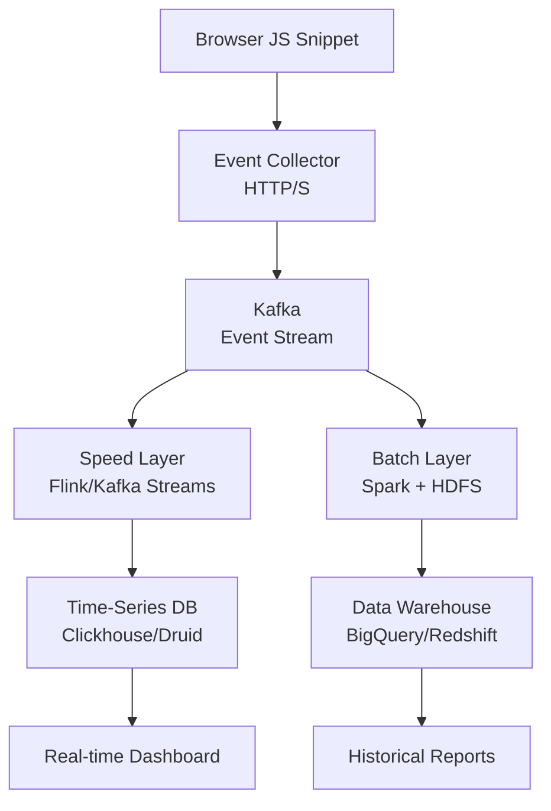
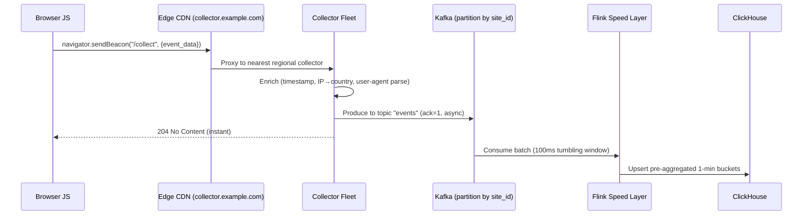
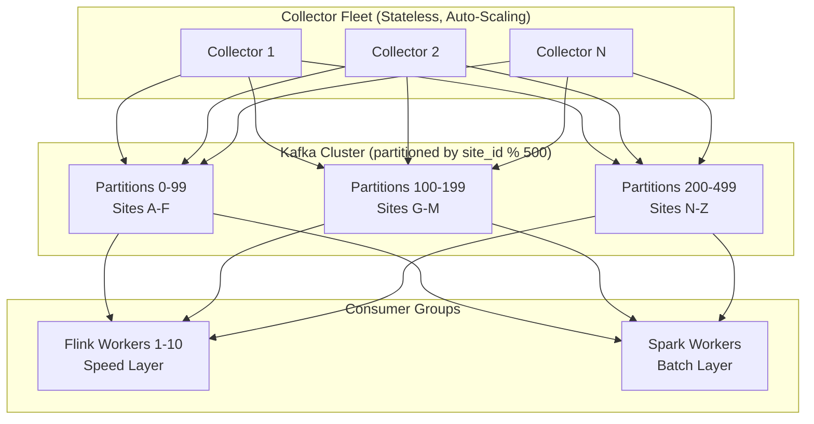
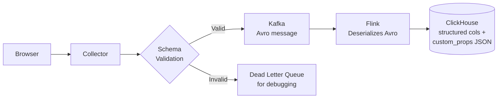
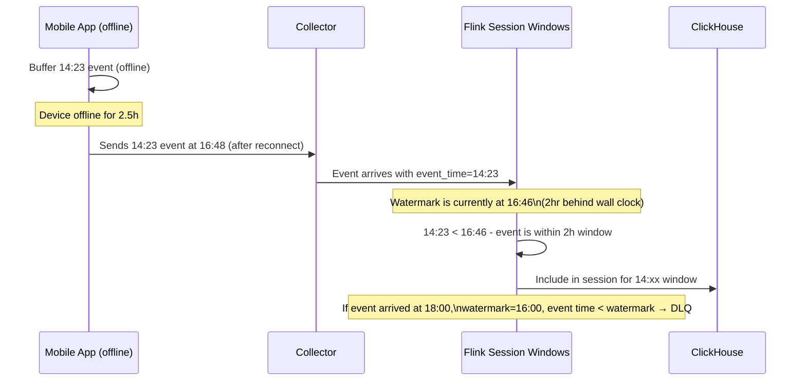

# Design a Web Analytics Platform (Google Analytics)

**Difficulty**: 🟡 Intermediate
**Reading Time**: Coming Soon
**Interview Frequency**: Medium

---

> 🚧 **Full article coming soon.** This stub gives you the essentials to start thinking about this problem.

---

## The Core Problem

Collecting 100 billion events per day from millions of websites, computing real-time dashboards (active users in last 5 min), and generating historical reports (monthly uniques by country) requires fundamentally different processing paths — the same data pipeline cannot efficiently serve both sub-second real-time queries and multi-year historical aggregations.

## Functional Requirements

- Collect pageviews, clicks, and custom events from embedded JS snippet
- Show real-time dashboard: active users, top pages (last 5 min)
- Historical reports: DAU, sessions, bounce rate, funnels (up to 2 years)
- Support filtering/segmentation by country, device, campaign

## Non-Functional Requirements

| Requirement | Target |
|-------------|--------|
| Ingest throughput | 1M events/sec (100B/day) |
| Real-time latency | < 30 seconds to dashboard |
| Historical query time | < 5 seconds for complex aggregations |
| Data retention | 2 years raw, indefinite aggregates |

## Back-of-Envelope Estimates

- **Event ingestion**: 100B events/day ÷ 86,400 = ~1.16M events/sec peak
- **Raw storage**: 1.16M events/sec × 200 bytes per event = 232MB/sec → ~20TB/day raw
- **Unique visitor counting**: HyperLogLog uses 12KB per cardinality estimate vs 8MB exact set for 1M users

## Key Design Decisions

1. **Lambda Architecture** — batch layer (Spark/Hadoop) for accurate historical aggregates recomputed nightly; speed layer (Flink/Kafka Streams) for approximate real-time counts; serving layer merges both results.
2. **Pre-aggregation at Ingestion** — don't store every raw event for dashboard queries; aggregate into 1-minute buckets by (site_id, page, country, device) at ingest time to enable fast time-series queries.
3. **Approximate Counting with HyperLogLog** — exact unique visitor counts require storing all user IDs (8MB per day per site); HyperLogLog gives ±2% accuracy at 12KB memory — 99.94% space savings.

## High-Level Architecture



## Top Interview Questions for This Problem

| Question | Tests |
|----------|-------|
| How do you count daily unique visitors without storing all user IDs? | HyperLogLog, approximate counting |
| How would you handle late-arriving events (user was offline for 2 hours)? | Watermarking, late data handling |
| How do you ensure the JS tracking pixel doesn't slow down customer websites? | Async loading, beacon API |

## Related Concepts

- [Time-Series Databases for metrics storage](../05-infrastructure/metrics-alerting)
- [Kafka for high-throughput event streaming](../05-infrastructure/distributed-messaging)

---

## Component Deep Dive 1: Event Ingestion Pipeline

The event ingestion pipeline is the most critical component in a web analytics system. It must accept 1M+ events/sec from millions of browser sessions without becoming a bottleneck, while also being resilient to spike traffic during viral campaigns or flash sales.

### How It Works Internally

Every tracked page sends a 1x1 pixel request or a `navigator.sendBeacon()` call to the collector endpoint. The collector does minimal work — it validates the payload, attaches server-side metadata (timestamp, IP, user-agent), and immediately writes to Kafka. No synchronous DB writes happen in the hot path.

The JS snippet loads asynchronously (using `async` or `defer`) so it never blocks page render. The snippet queues events locally in memory, then flushes them in batches using the Beacon API (`navigator.sendBeacon`) which fires even when the user navigates away.

### Why Naive Approaches Fail at Scale

A direct write to a relational database at 1M events/sec would require 1000+ DB servers even with connection pooling. Write amplification from indexes makes it worse. A naive HTTP server writing to PostgreSQL will saturate at roughly 5k–20k writes/sec per instance — requiring 50–200 instances just for peak load, with zero burst tolerance.

### Ingestion Sequence Diagram



### Implementation Options

| Approach | Latency | Throughput | Trade-off |
|----------|---------|------------|-----------|
| Collector → Kafka (async produce) | < 5ms p99 | 1M+ events/sec per cluster | Message loss risk if Kafka is unavailable (use acks=1 not acks=all for throughput) |
| Collector → Kinesis Data Streams | < 10ms p99 | 1MB/sec per shard (need 200+ shards at peak) | Managed service; shard splitting adds operational overhead |
| Collector → direct ClickHouse insert | 20–50ms p99 | ~500k rows/sec with async inserts | Eliminates Kafka dependency; less resilient to ClickHouse downtime |

The Kafka approach is preferred because it decouples ingestion durability from processing throughput. Producers only wait for the broker leader to acknowledge (acks=1), not all replicas, trading minimal durability risk for 3–5x throughput gain. At 1M events/sec with 200-byte average payload, Kafka needs ~200MB/sec network throughput — achievable with 3–5 broker nodes on 10GbE networking.

---

## Component Deep Dive 2: Approximate Counting with HyperLogLog

Counting unique visitors (DAU, MAU) is the core challenge in analytics. The naive approach — storing a set of all seen user IDs per day per site — blows up memory and storage at scale.

### Internal Mechanics

HyperLogLog (HLL) works by hashing each user ID and observing the position of the leftmost 1-bit in the hash. The intuition: if you've seen a hash with 15 leading zeros, you've likely seen roughly 2^15 = 32,768 distinct items. HLL maintains 2^b buckets (typically b=14, giving 16,384 buckets), each tracking the maximum leading-zero position seen. The final cardinality estimate uses harmonic mean across all buckets.

**Error rate**: ±1.04/√m where m = bucket count. With 16,384 buckets: ±0.81% error. This is well within acceptable bounds for analytics.

**Memory per HLL register**: 12KB for 2^14 buckets at 6 bits each. Vs. a raw set: 8 bytes per user ID × 1M DAU = 8MB. **Space savings: 99.85%**.

### Mergeability — The Key Property

HLL registers can be merged with bitwise OR — computing weekly uniques from seven daily HLLs costs O(m) time regardless of how many users were seen. This makes hierarchical rollups (hourly → daily → monthly → yearly) trivially cheap.

### Scale Behavior at 10x Load

At 10x load (10M events/sec), the HLL itself doesn't break — it's computed in-memory in Flink with constant time per event. What breaks is the cardinality of distinct (site_id, date) HLL registers needing to be maintained in memory. At 10M active sites × 365 days = 3.65B HLL objects. Solution: evict registers to ClickHouse after the day closes, and only keep the current-day HLL in Flink state.

```mermaid
graph LR
    subgraph Flink State [Flink Keyed State - Current Day]
        HLL_S1[site_1 HLL\n12KB]
        HLL_S2[site_2 HLL\n12KB]
        HLL_SN[site_N HLL\n12KB]
    end
    subgraph ClickHouse [ClickHouse - Historical]
        AGG[Aggregated HLL\nper site per day]
    end
    Flink State -- "Day rollover\nserialize + flush" --> ClickHouse
    ClickHouse -- "Weekly/monthly query\nmergeState()" --> Result[Cardinality Estimate]
```

---

## Component Deep Dive 3: Pre-Aggregation and the Serving Layer

Raw event storage at 20TB/day for 2 years = ~14.6PB. Querying raw events for a "top pages last 7 days" report would require scanning terabytes of data per query — unacceptable for a sub-5-second SLA.

### Strategy: Write-Time Pre-Aggregation

The Flink speed layer aggregates events into 1-minute tumbling windows keyed by `(site_id, page_url, country, device_type, event_type)`. Each window emits a row containing `count`, `hll_sketch` (for uniques), `session_count`, and `bounce_count`.

ClickHouse stores these minute-level aggregates in a columnar format with a primary key on `(site_id, timestamp, page_url)`. Queries for "top 10 pages last 24 hours" scan only the minute-aggregate table (1440 rows per page per day), not raw events.

For historical reports (>7 days), a nightly Spark job reads minute-aggregates from ClickHouse and computes daily rollups into BigQuery. BigQuery's column-oriented storage handles arbitrary GROUP BY queries across 2 years of daily aggregates in under 5 seconds thanks to partitioning by `date` and clustering by `site_id`.

### Technical Decision: ClickHouse vs. Druid vs. Pinot

| Feature | ClickHouse | Apache Druid | Apache Pinot |
|---------|-----------|--------------|--------------|
| Ingestion model | Async inserts + MergeTree | Lambda (batch + real-time) | Real-time via UPSERT |
| Query language | Full SQL | SQL-like (limited JOINs) | Full SQL |
| Unique counts | AggregatingMergeTree + HLL | approx_count_distinct | HLL via Theta Sketches |
| Operational complexity | Low (single binary) | High (multiple services) | Medium |
| Used by | Cloudflare, Yandex, ByteDance | Lyft, Netflix | LinkedIn, Uber |

ClickHouse is preferred for new analytics systems because its MergeTree engine automatically merges partial aggregates during background compaction, eliminating the need for a separate batch rollup job for the first 7-day window.

---

## Data Model

### Raw Events (Kafka Schema — Avro)

```json
{
  "event_id": "01HJ9V2K3N4P5Q6R7S8T9U0V1W",
  "site_id": "GA-1234567-8",
  "session_id": "sess_7f3a8b2c",
  "user_id_hashed": "sha256_truncated_32chars",
  "event_type": "pageview",
  "page_url": "https://example.com/pricing",
  "referrer_url": "https://google.com/search?q=example",
  "country_code": "US",
  "device_type": "desktop",
  "browser": "Chrome",
  "os": "macOS",
  "viewport_width": 1440,
  "timestamp_ms": 1748736000000,
  "server_received_ms": 1748736000023,
  "custom_props": {"plan": "pro", "ab_variant": "B"}
}
```

### Minute-Level Aggregates (ClickHouse)

```sql
CREATE TABLE analytics.pageview_minutes
(
    site_id        String,
    minute_bucket  DateTime,  -- truncated to minute
    page_url       String,
    country_code   LowCardinality(String),
    device_type    LowCardinality(String),
    event_count    UInt64,
    session_count  UInt64,
    bounce_count   UInt64,
    hll_users      AggregateFunction(uniqHLL12, String)  -- 12-bit HLL for unique users
)
ENGINE = AggregatingMergeTree()
PARTITION BY toYYYYMM(minute_bucket)
ORDER BY (site_id, minute_bucket, page_url, country_code, device_type)
TTL minute_bucket + INTERVAL 90 DAY;
```

### Daily Aggregates (BigQuery — for historical reports)

```sql
CREATE TABLE `analytics.daily_rollup`
(
    site_id         STRING,
    report_date     DATE,
    page_url        STRING,
    country_code    STRING,
    device_type     STRING,
    pageviews       INT64,
    sessions        INT64,
    bounce_rate     FLOAT64,       -- pre-computed: bounces / sessions
    unique_visitors INT64,         -- materialized from HLL merge
    avg_session_sec FLOAT64
)
PARTITION BY report_date
CLUSTER BY site_id, country_code;
```

**Key indexes**: ClickHouse primary key `(site_id, minute_bucket)` ensures all per-site queries skip all other sites' data via sparse indexing. BigQuery partition pruning on `report_date` limits scans to relevant date ranges.

---

## Scale Bottlenecks

| Traffic Level | Component That Breaks | Symptoms | Mitigation |
|---------------|----------------------|----------|------------|
| 10x baseline (10M events/sec) | Kafka broker I/O | Consumer lag grows, end-to-end latency spikes to minutes | Add brokers; increase partition count from 100 → 1000; use tiered storage (S3) |
| 100x baseline (100M events/sec) | Collector fleet DNS/load balancer | Single LB saturates at ~10Gbps; collectors can't establish connections fast enough | Anycast routing; per-region collector clusters; edge Kafka; GeoDNS to regional clusters |
| 1000x baseline (1B events/sec) | Kafka partition leader election latency | Any broker restart triggers 10-second gaps in consumer lag; SLA violated | Pre-partition by site_id to isolate blast radius; Kafka with KRaft (no ZooKeeper); multi-region active-active |
| Any level | ClickHouse merge backlog | Write amplification causes read latency to degrade; "too many parts" error | Tune `max_insert_blocks` and `merge_tree_min_rows_for_concurrent_read`; use Buffer table engine to batch inserts |
| Historical query spike | BigQuery slot exhaustion | Queries queue for 30+ seconds | Purchase reserved slots; use BI Engine for dashboard caching; pre-compute common report templates nightly |

---

## How Cloudflare Built Their Web Analytics

Cloudflare launched their privacy-focused web analytics in November 2020 as a Google Analytics alternative that collects no personal data. Their engineering blog documents several non-obvious architectural decisions.

**Technology stack**: ClickHouse as the sole analytics database, deployed on bare metal (not cloud VMs). No Kafka — they ingest directly into ClickHouse using async inserts and rely on ClickHouse's internal merge queue for write batching.

**Scale**: Cloudflare processes roughly 25 million HTTP requests per second across their network. Their analytics product handles a subset — approximately 5–10 billion page views per day — across 1M+ active websites using their free plan.

**The non-obvious decision**: They chose to store **only aggregated data** — no raw events at all. Each page view is aggregated client-side into 30-minute buckets before being flushed to the collector. This reduces storage by 99%+ and makes GDPR compliance trivially easy (no PII stored anywhere in the pipeline). The tradeoff is losing the ability to do retroactive arbitrary-dimension queries on raw event streams.

**Counting uniques without cookies**: They hash IP + User-Agent + site_id + date into a daily salt using SHA-256. The hash is never stored — only the HyperLogLog register receives it. This means they cannot track users across sessions, which is the privacy guarantee they advertise.

**ClickHouse-specific optimization**: They use `AggregatingMergeTree` with pre-computed `uniqHLL12State` columns. Merging seven days of daily HLLs for a weekly unique count takes < 1ms per site since ClickHouse executes the `finalizeAggregation(merge(hll_state))` operation natively in the storage engine.

Source: [Cloudflare Blog — Privacy-first Web Analytics](https://blog.cloudflare.com/free-privacy-first-web-analytics/)

---

## Interview Angle

**What the interviewer is testing:** Whether you understand that analytics is fundamentally a write-heavy, read-at-scale problem where approximate algorithms and pre-aggregation matter more than perfect data models, and whether you can justify tradeoffs between accuracy vs. storage/compute.

**Common mistakes candidates make:**

1. **Designing a real-time OLTP database for event storage** — suggesting PostgreSQL or DynamoDB for the write path. At 1M events/sec, no OLTP database handles that ingestion rate without massive sharding complexity. The correct answer is a buffer (Kafka) + OLAP store (ClickHouse/Druid).

2. **Ignoring the dual SLA** — designing only a real-time path (Flink → ClickHouse) without addressing the historical report requirement. A single real-time store cannot serve both sub-30-second latency AND 2-year aggregations efficiently. Lambda/Kappa architecture exists specifically for this split.

3. **Proposing exact unique counts** — saying "store all user IDs in a Redis set." At 1M DAU per site × 10,000 sites × 365 days, that's 3.65 trillion entries. The correct answer is HyperLogLog with explicit acknowledgment of the ±1–2% error tradeoff.

**The insight that separates good from great answers:** The JS tracking snippet should use `navigator.sendBeacon()` rather than `XMLHttpRequest` or `fetch()`. Beacon requests are fire-and-forget, don't block page unload, and are sent even when navigating away. Standard XHR/fetch calls are cancelled on navigation — meaning you lose 15–30% of your pageview events, especially single-page-app route changes. Great candidates know this detail without prompting.

---

## Key Numbers to Remember

| Metric | Value | Context |
|--------|-------|---------|
| Peak ingestion rate | 1.16M events/sec | At 100B events/day (Google Analytics scale) |
| Raw event size | 200 bytes avg | After Avro serialization with schema registry |
| Raw storage per day | ~20TB | Before compression (ClickHouse compresses ~5x → 4TB/day) |
| HyperLogLog memory | 12KB per register | For 2^14 buckets, ±0.81% error |
| HLL vs exact set savings | 99.85% less memory | 12KB HLL vs 8MB raw ID set for 1M users |
| Real-time dashboard latency | < 30 seconds | Collector → Kafka → Flink → ClickHouse → API |
| ClickHouse ingest rate | ~500k rows/sec | Single server, async inserts, AggregatingMergeTree |
| Kafka throughput per broker | ~100MB/sec sustained | On commodity hardware (10GbE NIC) |
| Pre-aggregation compression | 1000:1 reduction | 1M raw events → 1 minute-bucket row per dimension combo |
| BigQuery historical query | < 5 seconds | 2 years of daily aggregates, partitioned + clustered |

---

## Level 2 — Deep Dive

---

## Event Ingestion at Scale

### Kafka as the Ingestion Backbone

At 1M+ events/sec, the collector fleet cannot write directly to any database. Kafka acts as the shock absorber between bursty ingest and downstream processing. Events are partitioned by `site_id` so that all events for a given site land on the same set of partitions — enabling stateful per-site operations (session stitching, HLL maintenance) without cross-partition shuffles in Flink.

**Producer configuration trade-offs:**

| Kafka `acks` setting | Durability | Throughput | Use when |
|----------------------|-----------|-----------|----------|
| `acks=0` (fire-and-forget) | None — broker crash = data loss | Highest (~3M events/sec per cluster) | Never for analytics; loss is invisible |
| `acks=1` (leader ack) | Leader durability; follower lag = potential loss | High (~1M events/sec) | Real-time analytics — tolerable ±0.01% loss |
| `acks=all` (ISR ack) | Full replica durability | Low (~300k events/sec) | Financial transactions, not analytics |

Google Analytics and Amplitude both use `acks=1` for their ingest path. At 10 trillion events/month (Amplitude's published scale), losing 0.01% of events means losing 1 billion events/month — acceptable for behavioral analytics but unacceptable for billing or fraud.

**Partition count sizing**: Each Kafka partition handles ~10MB/sec sustained. At 200MB/sec peak ingest (1M events/sec × 200 bytes), you need at minimum 20 partitions. Production deployments use 100–500 partitions to allow parallel consumer scaling headroom without repartitioning later (repartitioning requires full consumer group rebalance).



### Schema-on-Read vs Schema-on-Write

This is one of the most consequential architectural decisions in an analytics pipeline. Getting it wrong costs months of migration work.

**Schema-on-write (Avro/Protobuf with Schema Registry):**
- Events are validated against a registered schema at produce time
- Invalid events are rejected at the collector boundary
- Schema evolution requires explicit version management (backward/forward compatibility)
- Consumers always know the field types; no runtime type coercion
- Amplitude uses Avro with Confluent Schema Registry — every event type has a registered schema

**Schema-on-read (raw JSON → Kafka → parse at query time):**
- Collector accepts any JSON payload, stores it as-is
- Validation happens when Spark/Flink reads the event
- New custom properties (e.g., `ab_variant`, `plan_tier`) don't require schema registration
- Type coercion errors surface downstream, not at ingest — harder to debug
- Google Tag Manager's custom dimension model uses this approach

**The right answer for a product analytics platform (Amplitude/Mixpanel style):** Schema-on-write for standard event fields (`event_type`, `user_id`, `timestamp`, `session_id`), schema-on-read for `custom_props` (a JSON blob column in ClickHouse). This gives you validation for the structural fields that power aggregation, while allowing arbitrary product-specific properties without schema migration.



**Dead Letter Queue (DLQ):** Invalid events (malformed JSON, missing required fields, future-dated timestamps > 24h) go to a separate `events-dlq` topic. A separate alert fires if DLQ rate exceeds 0.1% of total ingest — this catches SDK bugs in customer applications before they cause silent data gaps.

---

## Session Stitching

Session stitching is the process of grouping raw events into logical user sessions. It sounds simple but involves several edge cases that separate production-grade analytics from toy systems.

### The 30-Minute Inactivity Timeout

The industry-standard definition of a session: a contiguous group of events from a single user where no gap between consecutive events exceeds 30 minutes. A new session starts when:
1. The user's first event arrives (no prior session)
2. More than 30 minutes has elapsed since the last event in the current session
3. A new day starts at midnight (even mid-session) — this is a convention used by Google Analytics for date-boundary attribution

**Implementation in Flink (session windows):**

Flink natively supports session windows via `EventTimeSessionWindows.withGap(Duration.ofMinutes(30))`. Each window is keyed by `user_id_hashed` (or cookie ID for anonymous users). When the window closes (30-minute gap detected), Flink emits a `SessionRecord` containing:

```json
{
  "session_id": "derived_hash_of_first_event_id",
  "user_id": "anon_cookie_abc123",
  "site_id": "GA-1234",
  "session_start_ms": 1748736000000,
  "session_end_ms": 1748737234000,
  "duration_sec": 1234,
  "pageview_count": 7,
  "is_bounce": false,
  "entry_page": "/pricing",
  "exit_page": "/checkout",
  "events": ["pageview", "click", "pageview", "form_submit", ...]
}
```

**The late-arrival problem:** Events from mobile apps arrive late due to offline-mode buffering. An event timestamped at 14:23 may arrive at the collector at 16:45 (device was on airplane mode). Flink's event-time watermarks handle this: the pipeline allows events up to 2 hours late before closing a session window. Events arriving after the watermark go to the DLQ for manual reconciliation.



### Anonymous to Identified User Stitching

When a user visits a website anonymously, they receive a cookie ID (e.g., `anon_7f3a8b2c`). When they sign up or log in, the application calls `analytics.identify("user_12345")`. At this point, the pipeline must retroactively stitch all prior anonymous events to the now-known user ID.

**The stitching problem at scale:**

- Amplitude processes this in near-real-time using a "user stitching" Kafka consumer
- The consumer maintains a `cookie_id → user_id` mapping in Redis (keyed by `(site_id, cookie_id)`)
- When an `identify` event arrives, the consumer: (1) writes the mapping to Redis with 90-day TTL, (2) emits a backfill job that rewrites historical `user_id` for all past events with that cookie

**Why you cannot do this in the hot path:** Retroactive backfill touches potentially thousands of historical event records per user. At 10M sign-ups/day, that's 10M backfill jobs triggering concurrent ClickHouse UPDATE operations. ClickHouse is not designed for point updates — it uses immutable parts. The correct approach is to track both `anon_id` and `user_id` on every event, join at query time using the stitching table.

**Query-time stitching (the right approach):**

```sql
-- ClickHouse query: get all events for user_12345 including pre-login anonymous events
SELECT e.*
FROM analytics.events e
LEFT JOIN analytics.user_stitching s
    ON s.site_id = e.site_id AND s.cookie_id = e.anon_id
WHERE
    e.site_id = 'GA-1234'
    AND (e.user_id = 'user_12345' OR s.user_id = 'user_12345')
    AND e.timestamp >= now() - INTERVAL 90 DAY
```

The `user_stitching` table is small (one row per cookie per site) and fits in ClickHouse's in-memory mark cache, making the join fast even at trillion-event scale.

---

## Pre-Aggregation Strategy

### Hourly Rollups vs On-the-Fly Queries

The fundamental tension: raw events are flexible (supports any future query) but expensive to query; pre-aggregations are fast but inflexible (can't retroactively add dimensions).

**Approach A: Pure on-the-fly queries on raw events**
- Store all raw events in ClickHouse or BigQuery
- Run queries against raw data at query time
- Pros: any filter, any dimension, retroactive analysis
- Cons: ClickHouse scanning 20TB/day of raw events for a "top pages" query takes 10–30 seconds even with columnar storage; not feasible for dashboards refreshing every 30 seconds

**Approach B: Pure pre-aggregation (Cloudflare's approach)**
- Aggregate at collection time; discard raw events
- Store only minute-level or hour-level buckets
- Pros: Sub-second queries; storage 99% smaller
- Cons: Cannot answer "which users visited /pricing before signing up?" (no user-level raw events)

**Approach C: Tiered storage (Amplitude/Mixpanel's approach)**

| Layer | Storage | Retention | Query type |
|-------|---------|-----------|-----------|
| Hot raw events | ClickHouse | 90 days | Funnel analysis, cohort queries, user-level paths |
| Minute-level aggregates | ClickHouse | 1 year | Real-time dashboards, top-N reports |
| Daily rollups | BigQuery/S3 | Indefinite | Historical trends, year-over-year comparisons |
| Monthly rollups | BigQuery | Indefinite | Executive dashboards, billing |

Amplitude uses Approach C. The 90-day raw event window enables their "People" feature — showing the exact sequence of events for a specific user — while pre-aggregates serve the 99% of dashboard queries that don't need user-level detail.

### Funnel Analysis — The Hardest Query in Analytics

A funnel query asks: "Of 1M users who visited /pricing, how many completed checkout within 7 days?" This requires joining user-level event sequences — a query pattern that columnar OLAP databases struggle with.

**Naive approach (wrong):**
```sql
-- This requires a self-join that explodes at scale
SELECT COUNT(DISTINCT a.user_id)
FROM events a
JOIN events b ON a.user_id = b.user_id
WHERE a.event_type = 'view_pricing'
  AND b.event_type = 'checkout_complete'
  AND b.timestamp > a.timestamp
  AND b.timestamp < a.timestamp + INTERVAL 7 DAY
```

At 10B events this self-join produces a cross product of billions × billions rows — it will OOM even on a 1TB RAM server.

**Amplitude's approach — ClickHouse window functions with pre-sorted arrays:**

ClickHouse stores events per user as sorted arrays using the `groupArray` function. Funnel detection becomes an array scan (O(n) per user), not a join:

```sql
-- ClickHouse funnel query using windowFunnel()
SELECT
    level,
    count() AS users_reaching_level
FROM (
    SELECT
        user_id,
        windowFunnel(7 * 86400)(  -- 7-day window in seconds
            timestamp,
            event_type = 'view_pricing',
            event_type = 'add_to_cart',
            event_type = 'checkout_complete'
        ) AS level
    FROM analytics.events
    WHERE site_id = 'GA-1234'
      AND timestamp >= now() - INTERVAL 30 DAY
    GROUP BY user_id
)
GROUP BY level
ORDER BY level;
```

`windowFunnel()` is a native ClickHouse aggregate function that scans each user's sorted event sequence in a single pass. At Amplitude's scale (10 trillion events/month = ~3.8M events/sec), this query returns in under 3 seconds for a 30-day window because:
1. ClickHouse's columnar storage reads only `user_id`, `event_type`, `timestamp` columns (3 of potentially 30+ columns)
2. Partition pruning by `toYYYYMM(timestamp)` limits scan to 1–2 partitions
3. The `windowFunnel` aggregate processes each user's events without cross-user joins

---

## Real Company: Amplitude at 10 Trillion Events/Month

Amplitude is a product analytics company serving 3,000+ enterprise customers including Ford, Walmart, and Dropbox. Their published engineering blog documents the transition to ClickHouse for sub-second funnel queries.

**Scale numbers:**
- **10 trillion events/month** (333 billion/day, ~3.8M events/sec average, 10M+ events/sec peak)
- **Query SLA:** < 3 seconds for funnel queries on 90-day windows
- **Cardinality:** billions of distinct users across all customers

**Why Amplitude moved from Redshift to ClickHouse:**
- Redshift (columnar, OLAP) handled aggregation queries well but struggled with funnel queries that required per-user sorted sequences — Redshift's `LISTAGG` function hit 65,535-character limits
- User-level path analysis queries took 45–120 seconds on Redshift, exceeding the 3-second dashboard SLA
- ClickHouse's native `windowFunnel()`, `retention()`, and `sequenceMatch()` aggregate functions handle these patterns natively in the storage engine
- Benchmark: funnel query on 1B events — Redshift 47 seconds, ClickHouse 2.1 seconds (22x faster)

**Data model at Amplitude scale:**
- Events table: partitioned by `(customer_id, toYYYYMM(timestamp))`, sorted by `(customer_id, user_id, timestamp)`
- Each partition averages 500GB compressed (ClickHouse compresses ~5:1 vs raw JSON)
- Total storage: ~150PB compressed across all customers
- Replication factor: 3 (ClickHouse ReplicatedMergeTree)
- Hardware: Bare metal servers, 128 cores, 1TB RAM, NVMe SSDs — not cloud VMs (better price/performance for I/O-intensive workloads)

**The ClickHouse-specific optimization Amplitude uses:** `AggregatingMergeTree` for pre-aggregated tables. Background merge operations automatically combine partial aggregates from different insert batches — meaning the pre-aggregation is handled by the storage engine itself, not a separate ETL job. The hourly Spark rollup job that other analytics companies run is unnecessary.

Source: [Amplitude Engineering Blog — ClickHouse for Analytics](https://amplitude.engineering/how-amplitude-leverages-clickhouse-for-analytics-at-10-trillion-events-9e0d4eff1bcd) (published scale: 10T events/month as of 2022, growing 40% YoY)

---

## Extended Trade-Off Table: Storage Architecture Choices

| Dimension | ClickHouse | Apache Druid | Apache Pinot | BigQuery | Redshift |
|-----------|-----------|--------------|--------------|---------|---------|
| Funnel queries | Native `windowFunnel()` — best | Limited | Limited | Manual SQL — slow | `LISTAGG` — limited |
| Ingest model | Async batch inserts | Lambda (batch + stream) | Real-time UPSERT | Streaming inserts ($) | COPY from S3 |
| Storage format | Columnar MergeTree | Columnar segments | Columnar segments | Columnar Capacitor | Columnar |
| Real-time latency | 1–5 seconds | 1–5 seconds | < 1 second | 5–30 seconds | Minutes |
| Operational complexity | Low (single binary) | High (Broker/Historical/Coordinator) | Medium | Zero (serverless) | Low (managed) |
| JOINs | Full SQL JOINs | Limited | Limited | Full SQL JOINs | Full SQL JOINs |
| Cost model | Self-hosted (CAPEX) | Self-hosted (CAPEX) | Self-hosted (CAPEX) | Per-TB scanned (OPEX) | Per-node-hour (OPEX) |
| Used by | Cloudflare, Yandex, Amplitude | Lyft, Netflix | LinkedIn, Uber | Spotify, Twitter | Airbnb, Yelp |
| Best for | Product analytics with funnels | Ad-hoc OLAP with pre-agg | Low-latency SLA < 100ms | Serverless historical | Managed warehouse |

**Decision rule:**
- Choose ClickHouse when: you need funnel analysis, you can self-host, you want SQL-compatible query interface, you process > 100B events/month
- Choose Druid when: you need sub-second query on pre-aggregated rollup data and can tolerate operational complexity
- Choose BigQuery when: you want zero ops, are already on GCP, and can tolerate 5–30 second query latency
- Choose Pinot when: you need p99 < 100ms query latency for user-facing dashboards

---

## Interview Angle: OLTP vs OLAP — The #1 Candidate Mistake

**The mistake:** Most candidates reach for PostgreSQL, DynamoDB, or MySQL when asked to design a web analytics system. They model events as rows, add indexes on `user_id` and `timestamp`, and propose read replicas for query scaling.

**Why this fails:**

OLTP databases (PostgreSQL, MySQL, DynamoDB) are optimized for:
- Point reads by primary key (`WHERE user_id = X`)
- Transactional writes (ACID semantics)
- Low-cardinality result sets (fetch 1–100 rows)
- Mutable records (UPDATE, DELETE are O(1))

Analytics queries are the exact opposite:
- Full table scans with GROUP BY (`SELECT page_url, COUNT(*) FROM events GROUP BY page_url`)
- Read-heavy, write-once (events are immutable)
- High-cardinality aggregations (100M rows → 1 result row)
- No UPDATE/DELETE needed (events are append-only)

**The query pattern incompatibility, quantified:**

| Query | PostgreSQL (row store) | ClickHouse (columnar) | Ratio |
|-------|----------------------|----------------------|-------|
| `SELECT page_url, COUNT(*) ... GROUP BY page_url` on 1B rows | 45–90 seconds (scans all columns) | 1.2–3 seconds (scans 2 columns) | 30–45x |
| `SELECT DISTINCT user_id` cardinality on 100M rows | 12–30 seconds | 0.8 seconds | 15–37x |
| Funnel: 3-step sequence on 1B events | OOM / timeout | 2–4 seconds | N/A |

**Why columnar storage wins for analytics:**

A typical event has 20 fields. A `GROUP BY page_url` query needs only 2 of those 20 fields. A row-store reads all 20 fields for every event (200 bytes). A columnar store reads only the 2 relevant columns (10 bytes per event). For 1B events, that's 200GB vs 10GB of I/O — a 20x difference before any query optimization.

Additionally, columnar stores achieve 5–10x compression on each column (same data type, similar values) vs 1.5–2x for row stores (mixed data types per row). This multiplies the I/O advantage to 50–100x.

**What great candidates say instead:**
1. "Events are immutable and append-only — I don't need ACID transactions, I need fast bulk ingest and fast aggregate reads. That's OLAP, not OLTP."
2. "I'll use Kafka as a write buffer and ClickHouse as the serving layer. ClickHouse is columnar, compresses well, and has native functions for funnel and retention analysis."
3. "Pre-aggregation at minute-level granularity reduces query-time I/O by 1000x for dashboard queries. Raw events stay for 90 days to support user-level funnel analysis."

**Follow-up question the interviewer will ask:** "How do you handle the fact that ClickHouse doesn't support UPDATES, but you need to retroactively stitch anonymous users to identified users?"

**Strong answer:** "ClickHouse does support `ReplacingMergeTree` for deduplication and `CollapsingMergeTree` for soft deletes, but for user stitching I'd avoid mutations entirely. Both `anon_id` and `user_id` fields are stored on every event at ingest time. The stitching table is a separate small table mapping `cookie_id → user_id`. At query time, a LEFT JOIN with the stitching table resolves anonymous events to known users. The join is fast because the stitching table is small and lives in ClickHouse's buffer cache."

---

## References

| Resource | Type | What You'll Learn |
|----------|------|------------------|
| [ByteByteGo — Design a Web Analytics System](https://www.youtube.com/@ByteByteGo) | 📺 YouTube | Search "web analytics design" — event tracking, aggregation, and reporting pipeline |
| [Mixpanel Engineering: Analytics at Scale](https://engineering.mixpanel.com/) | 📖 Blog | How Mixpanel handles petabytes of behavioral event data |
| [Segment Architecture: Customer Data Platform](https://segment.com/blog/rebuilding-our-infrastructure/) | 📖 Blog | How Segment rebuilt their data collection infrastructure at scale |
| [Clickhouse for Real-Time Analytics](https://clickhouse.com/blog/real-time-analytics-at-scale) | 📚 Docs | Column-store analytics DB used by Cloudflare, ByteDance for analytics at scale |
| [Amplitude Engineering — ClickHouse at 10T Events](https://amplitude.engineering/how-amplitude-leverages-clickhouse-for-analytics-at-10-trillion-events-9e0d4eff1bcd) | 📖 Blog | Production architecture details: funnel queries, windowFunnel(), storage layout |
| [Cloudflare Blog — Privacy-First Web Analytics](https://blog.cloudflare.com/free-privacy-first-web-analytics/) | 📖 Blog | Schema-on-write vs schema-on-read, HLL without cookies, AggregatingMergeTree |
| [ClickHouse windowFunnel documentation](https://clickhouse.com/docs/en/sql-reference/aggregate-functions/parametric-functions#windowfunnel) | 📚 Docs | Native funnel analysis aggregate function — the key to sub-second funnel queries |
