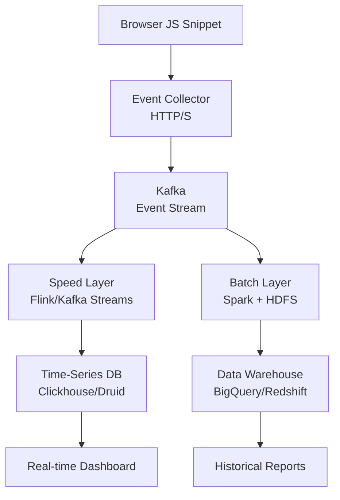

# Design a Web Analytics Platform (Google Analytics)

**Difficulty**: 🟡 Intermediate
**Reading Time**: Coming Soon
**Interview Frequency**: Medium

---

> 🚧 **Full article coming soon.** This stub gives you the essentials to start thinking about this problem.

---

## The Core Problem

Collecting 100 billion events per day from millions of websites, computing real-time dashboards (active users in last 5 min), and generating historical reports (monthly uniques by country) requires fundamentally different processing paths — the same data pipeline cannot efficiently serve both sub-second real-time queries and multi-year historical aggregations.

## Functional Requirements

- Collect pageviews, clicks, and custom events from embedded JS snippet
- Show real-time dashboard: active users, top pages (last 5 min)
- Historical reports: DAU, sessions, bounce rate, funnels (up to 2 years)
- Support filtering/segmentation by country, device, campaign

## Non-Functional Requirements

| Requirement | Target |
|-------------|--------|
| Ingest throughput | 1M events/sec (100B/day) |
| Real-time latency | < 30 seconds to dashboard |
| Historical query time | < 5 seconds for complex aggregations |
| Data retention | 2 years raw, indefinite aggregates |

## Back-of-Envelope Estimates

- **Event ingestion**: 100B events/day ÷ 86,400 = ~1.16M events/sec peak
- **Raw storage**: 1.16M events/sec × 200 bytes per event = 232MB/sec → ~20TB/day raw
- **Unique visitor counting**: HyperLogLog uses 12KB per cardinality estimate vs 8MB exact set for 1M users

## Key Design Decisions

1. **Lambda Architecture** — batch layer (Spark/Hadoop) for accurate historical aggregates recomputed nightly; speed layer (Flink/Kafka Streams) for approximate real-time counts; serving layer merges both results.
2. **Pre-aggregation at Ingestion** — don't store every raw event for dashboard queries; aggregate into 1-minute buckets by (site_id, page, country, device) at ingest time to enable fast time-series queries.
3. **Approximate Counting with HyperLogLog** — exact unique visitor counts require storing all user IDs (8MB per day per site); HyperLogLog gives ±2% accuracy at 12KB memory — 99.94% space savings.

## High-Level Architecture

## Top Interview Questions for This Problem

| Question | Tests |
|----------|-------|
| How do you count daily unique visitors without storing all user IDs? | HyperLogLog, approximate counting |
| How would you handle late-arriving events (user was offline for 2 hours)? | Watermarking, late data handling |
| How do you ensure the JS tracking pixel doesn't slow down customer websites? | Async loading, beacon API |

## Related Concepts

- [Time-Series Databases for metrics storage](../05-infrastructure/metrics-alerting)
- [Kafka for high-throughput event streaming](../05-infrastructure/distributed-messaging)

---

*📚 Full deep-dive with multiple approaches, trade-off tables, and pseudocode coming soon.*
