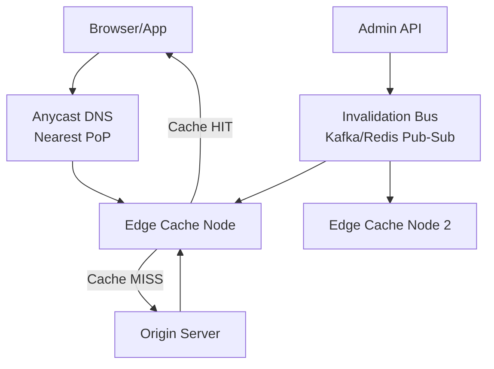

# Design a Web Cache (CDN Edge Cache)

**Difficulty**: 🟡 Intermediate
**Reading Time**: Coming Soon
**Interview Frequency**: Medium

---

> 🚧 **Full article coming soon.** This stub gives you the essentials to start thinking about this problem.

---

## The Core Problem

Serving static and dynamic content from edge locations with >95% cache hit rate reduces origin load by 20x, but keeping cached content fresh while handling TTL vs on-demand invalidation requires careful trade-off between consistency and performance. Staleness of even 60 seconds on product pages can show wrong prices.

## Functional Requirements

- Cache HTTP responses at edge nodes close to users
- Support TTL-based expiration and on-demand invalidation
- Handle both static assets (images, JS) and semi-dynamic content
- Return stale-while-revalidate to avoid cache stampedes

## Non-Functional Requirements

| Requirement | Target |
|-------------|--------|
| Cache hit ratio | >95% for static, >70% for dynamic |
| Read latency | p99 < 5ms at edge (vs 200ms to origin) |
| Invalidation propagation | < 30 seconds to all PoPs |
| Scale | 10PB/day served across 200 PoPs |

## Back-of-Envelope Estimates

- **Cache memory per PoP**: 1TB SSD cache per PoP × 200 PoPs = 200TB total edge cache
- **Hit rate impact**: 95% hit rate on 1M req/sec means only 50,000 req/sec reach origin
- **Invalidation fan-out**: 100 invalidation requests × 200 PoPs = 20,000 messages per invalidation burst

## Key Design Decisions

1. **Eviction Policy (LRU vs LFU)** — LRU is simple but evicts viral content after a cold period; LFU retains frequently accessed items but is slow to adapt to trending content; use LRU-K (track last K accesses) for a balanced approach.
2. **TTL Strategy** — short TTL (60s) ensures freshness but increases origin load; long TTL (24h) for content-addressed assets (fingerprinted URLs) with instant invalidation for mutable URLs.
3. **Cache Invalidation** — tag-based invalidation (purge all assets tagged "product-123") is more flexible than URL-by-URL invalidation; fan-out invalidation to all PoPs via message bus.

## High-Level Architecture

## Top Interview Questions for This Problem

| Question | Tests |
|----------|-------|
| How do you prevent a cache stampede when a popular item expires? | Thundering herd, locking |
| How do you handle cache invalidation across 200 PoPs? | Consistency, propagation latency |
| How would you cache personalized content without serving User A's data to User B? | Vary headers, private caching |

## Related Concepts

- [CDN Architecture and PoP placement](../05-infrastructure/cdn)
- [Cache eviction policies and trade-offs](../../../03-redis/concepts/redis-eviction-policies)

---

*📚 Full deep-dive with multiple approaches, trade-off tables, and pseudocode coming soon.*

## 📚 Resources & References

| Resource | Type | What You'll Learn |
|----------|------|------------------|
| [System Design Interview — Alex Xu](https://www.amazon.com/System-Design-Interview-insiders-Second/dp/B08CMF2CQF) | 📚 Book | Chapter on designing a key-value store / cache |
| [ByteByteGo — Design a Cache System](https://www.youtube.com/@ByteByteGo) | 📺 YouTube | Search "cache design" — eviction policies, consistency, and distributed caching |
| [Facebook Engineering: Memcached at Scale](https://research.facebook.com/publications/scaling-memcache-at-facebook/) | 📖 Blog | How Facebook scaled Memcached to handle billions of requests/sec |
| [Redis Documentation: Caching Patterns](https://redis.io/docs/manual/patterns/) | 📚 Docs | Cache-aside, write-through, and write-behind patterns with code examples |
| [Netflix Tech Blog: EVCache](https://netflixtechblog.com/caching-for-a-global-netflix-7bcc457012f1) | 📖 Blog | Netflix's global distributed caching infrastructure |
