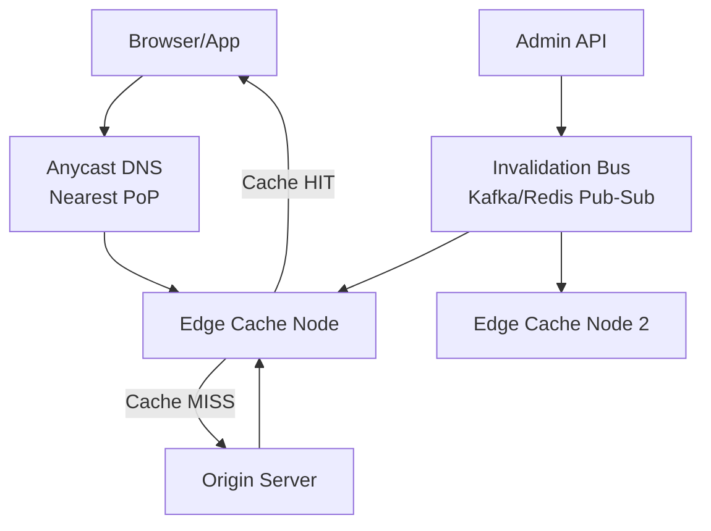
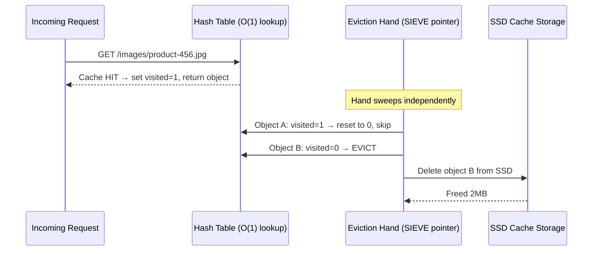
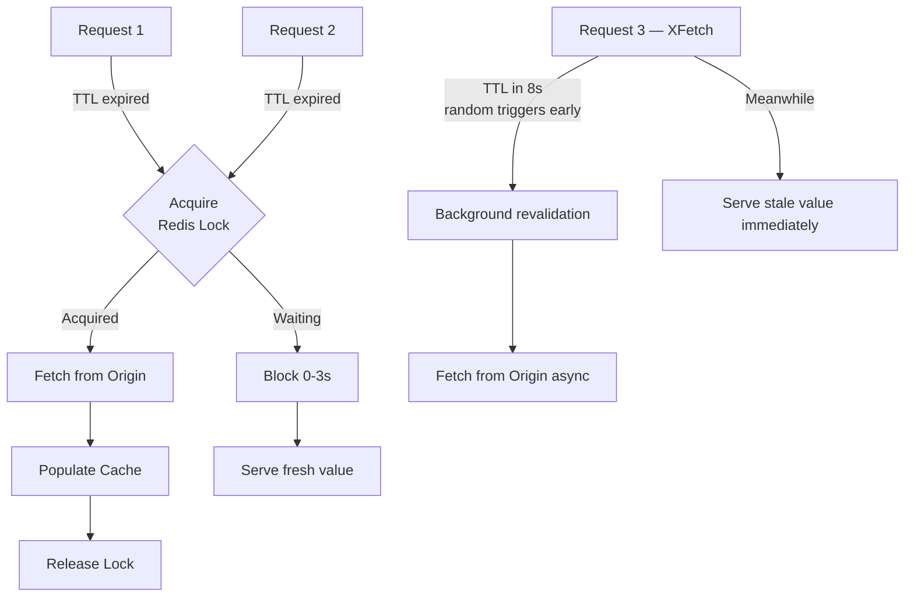
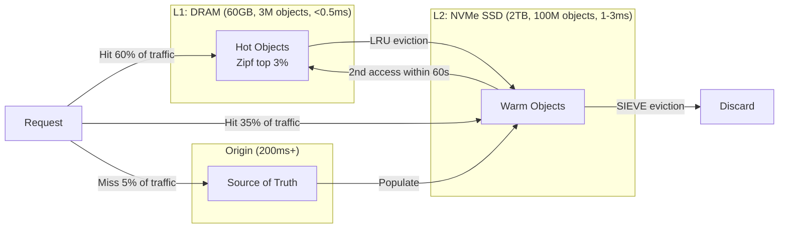
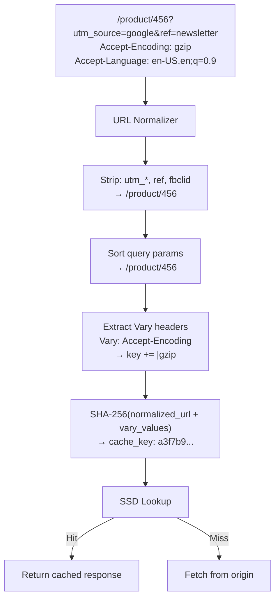

# Design a Web Cache (CDN Edge Cache)

**Difficulty**: 🟡 Intermediate
**Reading Time**: ~25 minutes
**Interview Frequency**: Medium
**Target Roles**: Senior SWE, Staff SWE, Solutions Architect
**Companies Known to Ask This**: Cloudflare, Fastly, Akamai, Amazon (CloudFront), Meta (CDN infra), ByteDance

---

## TL;DR

Cache HTTP responses at edge PoPs close to users. Use a two-tier storage (L1 DRAM + L2 NVMe SSD), SIEVE eviction, XFetch stampede prevention, and tag-based Kafka invalidation fan-out. Cache key = SHA-256(normalized URL + Vary header values). Split content by mutability: fingerprinted assets get TTL=365d, mutable pages get TTL=60-300s + active invalidation, private content gets no-store.

---

## The Core Problem

Serving static and dynamic content from edge locations with >95% cache hit rate reduces origin load by 20x, but keeping cached content fresh while handling TTL vs on-demand invalidation requires careful trade-off between consistency and performance. Staleness of even 60 seconds on product pages can show wrong prices.

## Functional Requirements

- Cache HTTP responses at edge nodes close to users
- Support TTL-based expiration and on-demand invalidation
- Handle both static assets (images, JS) and semi-dynamic content
- Return stale-while-revalidate to avoid cache stampedes

## Non-Functional Requirements

| Requirement | Target |
|-------------|--------|
| Cache hit ratio | >95% for static, >70% for dynamic |
| Read latency | p99 < 5ms at edge (vs 200ms to origin) |
| Invalidation propagation | < 30 seconds to all PoPs |
| Scale | 10PB/day served across 200 PoPs |

## Back-of-Envelope Estimates

- **Cache memory per PoP**: 1TB SSD cache per PoP × 200 PoPs = 200TB total edge cache
- **Hit rate impact**: 95% hit rate on 1M req/sec means only 50,000 req/sec reach origin
- **Invalidation fan-out**: 100 invalidation requests × 200 PoPs = 20,000 messages per invalidation burst

## Key Design Decisions

1. **Eviction Policy (LRU vs LFU)** — LRU is simple but evicts viral content after a cold period; LFU retains frequently accessed items but is slow to adapt to trending content; use LRU-K (track last K accesses) for a balanced approach.
2. **TTL Strategy** — short TTL (60s) ensures freshness but increases origin load; long TTL (24h) for content-addressed assets (fingerprinted URLs) with instant invalidation for mutable URLs.
3. **Cache Invalidation** — tag-based invalidation (purge all assets tagged "product-123") is more flexible than URL-by-URL invalidation; fan-out invalidation to all PoPs via message bus.

## High-Level Architecture



## Top Interview Questions for This Problem

| Question | Tests |
|----------|-------|
| How do you prevent a cache stampede when a popular item expires? | Thundering herd, locking |
| How do you handle cache invalidation across 200 PoPs? | Consistency, propagation latency |
| How would you cache personalized content without serving User A's data to User B? | Vary headers, private caching |
| What is your cache key strategy and why does URL alone fail? | Key design, Vary headers, fragmentation |
| How do you handle a cold start after a full cache flush? | Warm-up strategies, origin protection |
| How would you monitor cache health in production? | Observability: hit rate, eviction rate, invalidation lag |
| What changes if you need to support 10x more PoPs? | Horizontal scaling, Kafka partitioning, tag index sharding |

## Related Concepts

- [CDN Architecture and PoP placement](../05-infrastructure/cdn)
- [Cache eviction policies and trade-offs](../../../03-redis/concepts/redis-eviction-policies)
- [Thundering herd problem and mitigation patterns](../../02-availability/thundering-herd)
- [Consistent hashing for distributed cache routing](../../03-distributed-systems/consistent-hashing)
- [Kafka as an event bus for cache invalidation fan-out](../../04-messaging/kafka-fundamentals)

---

## Component Deep Dive 1: Cache Eviction Engine

The eviction engine is the most critical architectural component in a web cache because it directly determines hit rate, memory efficiency, and tail latency under pressure. When a PoP's 1TB SSD fills up — which happens regularly at 500k req/sec with a mixed workload — the eviction policy decides which objects are removed to make room for new ones. Choose wrong and hit rate drops from 95% to 60%, tripling origin load and spiking p99 latency from 5ms to 200ms.

**Why naive LRU fails at CDN scale:** A standard LRU doubly-linked list + hash map works fine at 10k objects but degrades at 100M objects per PoP. The problem is pointer chasing — every cache hit requires updating a linked list node's position, which causes random memory writes. At 500k hits/sec, that is 500k random writes/sec to DRAM, saturating the memory bus and causing LRU's internal bookkeeping to become the bottleneck, not the cache lookup itself. Facebook's Memcached team measured LRU overhead at 15% of total CPU at their scale.

**LRU-K improves scan resistance:** LRU-K tracks the last K access timestamps per object (typically K=2). An item only becomes "recently used" after being accessed K times within a recency window. This prevents a linear scan (e.g., a bot crawling all product images) from evicting warm objects that are accessed less frequently but still valuable. The bookkeeping cost is higher — storing 2 timestamps instead of 1 position — but hit rate improves 8-12% on mixed workloads.

**SIEVE is the modern answer:** Introduced in 2023, SIEVE uses a single bit per object (visited = 0 or 1) and a "hand" pointer. On eviction, the hand sweeps objects: if visited=1, reset to 0 and advance; if visited=0, evict immediately. This achieves LRU-like behavior with dramatically lower write amplification — only 1-bit flips instead of pointer updates. Cloudflare's internal benchmarks showed SIEVE achieving 96% of optimal hit rate with 3x less CPU than segmented LRU.



| Approach | Latency (p99 hit) | Throughput | Trade-off |
|----------|-------------------|------------|-----------|
| Naive LRU (doubly-linked list) | 2ms | 200k ops/sec | Simple; pointer chasing kills throughput at scale |
| LRU-K (K=2, recency window) | 3ms | 180k ops/sec | Better scan resistance; 2x memory overhead for timestamps |
| SIEVE (visited bit + hand) | 1.5ms | 450k ops/sec | Near-optimal hit rate; minimal write amplification; less tuning needed |

---

## Component Deep Dive 2: Cache Stampede Prevention (Probabilistic Early Expiration + Mutex Coalescing)

A cache stampede — also called thundering herd — occurs when a popular cached object expires and hundreds of simultaneous requests all get a cache miss at the same instant, all hitting origin simultaneously. At 500k req/sec with a p99 cache hit rate of 99%, roughly 5,000 requests/sec reach origin normally. But if a single high-traffic object (homepage HTML, 50k req/sec) expires, origin suddenly receives 50,000 concurrent requests in the same 100ms window. Most origin servers cannot absorb this spike. Response times jump from 20ms to 10s. The cache is now making the system less reliable than having no cache at all.

**Approach 1 — Mutex coalescing (request collapsing):** When the first request for an expired object arrives, it acquires a distributed lock (Redis SET NX EX 5) and fetches from origin. All subsequent requests for the same object within those 5 seconds wait on the lock, then receive the freshly populated cached value. This works well for objects fetched in < 1 second but creates a wait queue under high concurrency. If the origin fetch takes 3 seconds, all 50k waiting requests are blocked for 3 seconds, which causes request queuing, timeouts, and upstream retries — a different kind of stampede.

**Approach 2 — Probabilistic Early Expiration (XFetch algorithm):** Objects are expired early with increasing probability as their TTL approaches zero. The formula is: `recompute = (current_time - delta * beta * log(random())) > expiry_time` where delta is origin fetch latency (ms) and beta is a tuning constant (default 1.0). At 10 seconds before expiry with a 200ms origin fetch time, roughly 2% of requests will trigger a background revalidation while the rest continue serving the stale (but still valid enough) cached value. This avoids the sharp expiry cliff entirely. Akamai uses a variant of this algorithm across their 4,000+ edge PoPs.

**At 10x load (5M req/sec total):** Mutex coalescing breaks down because lock contention creates convoy effects. With 10x traffic, 500k simultaneous waiters on a single key cause the Redis lock server itself to become a bottleneck. XFetch scales better because it distributes the revalidation probability across all requests — there is no single lock to contend on. The tradeoff is that 2-3% of responses during the pre-expiry window are slightly stale, which is acceptable for most content types.



| Approach | Stampede Risk | Stale Data Risk | Origin Spike |
|----------|---------------|-----------------|--------------|
| No protection | High (50k concurrent) | None | 50k req burst |
| Mutex coalescing | Low | None | 1 req per key |
| XFetch (beta=1) | Near zero | ~2% at pre-expiry window | Gradual ramp |

---

## Component Deep Dive 3: Tag-Based Invalidation Bus

URL-by-URL cache invalidation does not scale when a single e-commerce product update can affect 500 URLs (product page, category page, search results, related products widget, sitemap). Purging 500 URLs × 200 PoPs = 100,000 individual invalidation messages per product update. At 1,000 product updates/minute during a flash sale, that is 100M invalidation messages/minute — overwhelming both the message bus and the cache nodes' invalidation processing queues.

**Tag-based invalidation** solves this by tagging each cached object with a set of logical identifiers at cache-store time. The product detail page HTML for product-123 is tagged with `["product-123", "category-electronics", "vendor-456"]`. When product-123's price changes, a single invalidation message `{"tag": "product-123"}` is broadcast. Each PoP's cache node scans its tag index and evicts all objects with that tag — potentially hundreds of objects from a single message.

**Internal mechanics:** The tag index is a hash map from tag string → set of cache keys. Stored in a separate in-memory index (not on SSD), it consumes roughly 200 bytes per tag-to-key mapping. At 100M cached objects per PoP, with an average of 3 tags per object, the tag index occupies 60GB of RAM — manageable on a machine with 128GB RAM. Tag index updates are write-heavy but are batched in the cache-write path.

**Propagation via Kafka:** Invalidation messages are published to a Kafka topic with 200 partitions (one per PoP). Each PoP subscribes to its dedicated partition. Message delivery latency is < 500ms in normal operation. With replication factor 3 and `acks=all`, messages survive a broker failure. The invalidation guarantee is at-least-once — a PoP may process the same invalidation twice (idempotent: evict an already-evicted key is a no-op).

| Invalidation Strategy | Messages per Product Update | Latency to All PoPs | Stale Window |
|----------------------|----------------------------|---------------------|--------------|
| URL-by-URL purge | 500 × 200 = 100,000 | 2-5 seconds | < 5s |
| Tag-based (Kafka fan-out) | 1 × 200 = 200 | < 1 second | < 1s |
| TTL-only (no active invalidation) | 0 | N/A — wait for TTL | 0-3600s |

---

## Data Model

```sql
-- Primary cache object store (one row per cached HTTP response)
CREATE TABLE cache_objects (
    cache_key        VARCHAR(2048)  NOT NULL,   -- SHA-256 of normalized URL + Vary headers
    url_hash         CHAR(64)       NOT NULL,   -- SHA-256 of raw URL for fast lookup
    body_bytes       BYTEA,                     -- compressed response body (gzip/brotli)
    body_size_bytes  INT            NOT NULL,
    http_status      SMALLINT       NOT NULL,   -- 200, 301, 404, etc.
    content_type     VARCHAR(128),              -- "text/html; charset=utf-8"
    etag             VARCHAR(128),              -- for conditional revalidation (If-None-Match)
    last_modified    TIMESTAMPTZ,              -- for If-Modified-Since
    stored_at        TIMESTAMPTZ    NOT NULL DEFAULT NOW(),
    expires_at       TIMESTAMPTZ    NOT NULL,   -- stored_at + TTL
    stale_window_sec INT            NOT NULL DEFAULT 0, -- stale-while-revalidate window
    hit_count        BIGINT         NOT NULL DEFAULT 0,
    last_hit_at      TIMESTAMPTZ,
    pop_id           SMALLINT       NOT NULL,   -- which PoP stores this object
    PRIMARY KEY (cache_key, pop_id)
);

-- Tag index: many-to-many between cache objects and logical tags
CREATE TABLE cache_tags (
    tag_name         VARCHAR(256)   NOT NULL,  -- "product-123", "category-electronics"
    cache_key        VARCHAR(2048)  NOT NULL,
    pop_id           SMALLINT       NOT NULL,
    PRIMARY KEY (tag_name, cache_key, pop_id)
);
CREATE INDEX idx_cache_tags_lookup ON cache_tags (tag_name, pop_id);

-- Invalidation log: audit trail + replay capability
CREATE TABLE invalidation_log (
    invalidation_id  UUID           NOT NULL DEFAULT gen_random_uuid(),
    invalidation_type VARCHAR(16)   NOT NULL, -- "url", "tag", "prefix", "all"
    target_value     VARCHAR(2048)  NOT NULL, -- the URL, tag name, or prefix
    initiated_by     VARCHAR(128)   NOT NULL, -- admin user or system
    initiated_at     TIMESTAMPTZ    NOT NULL DEFAULT NOW(),
    acks_received    INT            NOT NULL DEFAULT 0,  -- PoPs that confirmed processing
    total_pops       SMALLINT       NOT NULL,            -- expected PoP count
    completed_at     TIMESTAMPTZ,
    PRIMARY KEY (invalidation_id)
);

-- Response headers (normalized, separate table to avoid large row reads)
CREATE TABLE cache_headers (
    cache_key        VARCHAR(2048)  NOT NULL,
    pop_id           SMALLINT       NOT NULL,
    header_name      VARCHAR(128)   NOT NULL, -- "Cache-Control", "X-Custom-Tag"
    header_value     TEXT           NOT NULL,
    PRIMARY KEY (cache_key, pop_id, header_name)
);
```

**Key design notes:**
- `cache_key` is derived from URL + Vary header values (e.g., Accept-Encoding, Accept-Language) to prevent serving gzip content to a client that only accepts identity encoding.
- `body_bytes` is stored compressed. Average HTML page compresses from 80KB to 18KB — 1TB SSD holds 55M pages at 18KB average vs 12M at 80KB uncompressed.
- `stale_window_sec` implements `stale-while-revalidate` — requests within this window after `expires_at` still receive a cached response while a background revalidation fires.

---

## Scale Bottlenecks

| Traffic Level | Component That Breaks | Symptoms | Mitigation |
|---------------|----------------------|----------|------------|
| 10x baseline (500k req/sec per PoP) | Eviction engine CPU — LRU pointer chasing | p99 hit latency spikes from 2ms to 15ms; CPU at 95% | Switch to SIEVE eviction (1-bit visited flag); reduces eviction CPU by 60% |
| 10x baseline (500k req/sec per PoP) | Tag index RAM — index occupies >80% of available memory | OOM kills; OS starts swapping tag index to disk | Move tag index to RocksDB (LSM-tree, SSD-backed); accept 3ms tag lookup vs 0.1ms in-memory |
| 100x baseline (5M req/sec per PoP) | Single Kafka broker for invalidation messages | Invalidation lag grows from <500ms to 15-30 seconds | Partition invalidation topic by tag prefix; deploy 20 Kafka brokers with 2000 partitions |
| 100x baseline (5M req/sec per PoP) | NIC saturation — 10GbE tops out at ~800k req/sec for 10KB objects | Packet drops; TCP retransmits spike | Bond two 25GbE NICs; switch to DPDK userspace networking; use zero-copy sendfile() for large objects |
| 1000x baseline (50M req/sec per PoP) | Single PoP cannot serve this alone — architecture assumption fails | All latency SLOs missed | This traffic level requires horizontal PoP scaling — split one logical PoP into a cluster of 100 cache nodes behind an L4 consistent-hash load balancer |

---

## How Cloudflare Built This

Cloudflare operates one of the world's largest CDN caches, handling over **46 million HTTP requests per second** globally across 310 PoPs (as of 2024). Their engineering blog provides extensive detail on architectural decisions.

**Technology choices:** Cloudflare built a custom reverse proxy called **Pingora**, written in Rust, replacing their NGINX-based stack in 2022. NGINX's process-per-connection model required forking a new process for each connection, consuming 150MB RAM per worker. Pingora's async/tokio runtime handles all connections in a fixed-size thread pool of 32 threads per machine, reducing RAM usage by 70% and CPU by 30% while handling the same request volume.

**Specific numbers:** Before Pingora, each NGINX worker handled ~2,000 concurrent connections. Pingora handles 500,000+ concurrent connections per machine. At Cloudflare's scale, this eliminated the need for ~2,000 additional servers globally — a $50M+ infrastructure cost saving.

**Cache storage:** Cloudflare uses a two-tier cache at each PoP: an in-memory L1 (200GB DRAM per machine) for the hottest 5% of objects, backed by an L2 NVMe SSD pool (1-4TB per machine). The L1 hit rate is ~60%, meaning 60% of requests are served from DRAM at sub-millisecond latency. L2 serves the next 35% at 2-4ms. Only 5% miss to origin.

**Non-obvious architectural decision:** Cloudflare does **not** use consistent hashing to route requests to specific cache machines within a PoP. Instead, they use **"cache reserve"** — a tiered architecture where a miss at the edge PoP checks a central Cloudflare R2 object store before going to the customer's origin. This acts as a global L3 cache for long-tail content (objects accessed less than once per day across all PoPs). The insight is that the cost of an R2 lookup ($0.0000004) is far cheaper than an origin request ($0.001-$0.01), so even a 50% hit rate on the long tail improves economics dramatically.

**Source:** [Cloudflare Engineering Blog — How We Built Pingora, Our Nginx Replacement](https://blog.cloudflare.com/how-we-built-pingora-the-proxy-that-connects-cloudflare-to-the-internet/) and [Cloudflare Cache Reserve Announcement](https://blog.cloudflare.com/introducing-cache-reserve/).

---

## Interview Angle

**What the interviewer is testing:** Whether you can reason about the tension between consistency (fresh content) and performance (high cache hit rate), and whether you understand the operational challenges of distributed state — specifically, that "invalidation" is not a single operation but a distributed coordination problem across 200 independent nodes.

**Common mistakes candidates make:**

1. **Treating cache invalidation as instantaneous.** Candidates say "when the product updates, invalidate the cache." This ignores propagation latency. In a 200-PoP system, invalidation takes 500ms-30 seconds to reach all nodes. During this window, some PoPs serve stale data. The interviewer wants you to quantify the stale window and discuss whether it is acceptable for the use case (product prices vs. static images have different tolerances).

2. **Choosing LRU without justification.** Most candidates default to LRU because they learned it in CS class. At CDN scale, LRU's write amplification (pointer updates on every hit) makes it suboptimal. Mentioning LRU-K, SIEVE, or segmented LRU and explaining *why* the simpler version fails shows depth. The interviewer is looking for candidates who understand that textbook algorithms often need tuning for production workloads.

3. **Ignoring the Vary header problem.** A candidate who designs a cache keyed purely on URL will fail to handle content negotiation. The same URL `/api/feed` might return JSON for `Accept: application/json` and HTML for a browser request. Without incorporating Vary header values into the cache key, you'll serve JSON to a browser. This is a real bug that Cloudflare and Fastly both had early versions of and had to patch.

**The insight that separates good from great answers:** Great candidates recognize that cache hit rate and invalidation speed are inversely coupled — you cannot maximize both simultaneously. The architectural resolution is to **split content into tiers by mutability**: truly static content (fingerprinted assets like `app.abc123.js`) gets TTL=365d with no invalidation needed because the URL changes when the content changes. Mutable content (product pages) gets TTL=60-300s with active tag-based invalidation as a belt-and-suspenders approach. This segmentation means the invalidation system only needs to handle the 10% of content that is actually mutable, dramatically reducing invalidation load while keeping hit rates near-optimal for the 90% of immutable assets.

---

## Key Numbers to Remember

| Metric | Value | Context |
|--------|-------|---------|
| Cache hit rate — static assets | 95-99% | Images, JS/CSS with fingerprinted URLs; immutable content |
| Cache hit rate — dynamic HTML | 60-80% | Product pages, category pages with 5-min TTL |
| Origin load reduction | 20x | At 95% hit rate: only 5% of requests reach origin |
| Edge read latency (cache hit) | p99 < 5ms | In-memory L1 hit at edge PoP |
| Origin read latency (cache miss) | p99 150-300ms | Cross-region TCP round trip + origin processing |
| Invalidation propagation | < 500ms (Kafka) | Message bus fan-out to 200 PoPs in same region |
| Invalidation propagation (global) | 5-30 seconds | Cross-region replication adds 4-25s per hop |
| SSD cache capacity per PoP | 1-4TB NVMe | Stores 50M-200M compressed objects at 20KB avg |
| Tag index RAM overhead | ~200 bytes per tag-key pair | 100M objects × 3 tags = ~60GB RAM for tag index |
| Cloudflare global RPS | 46M req/sec | As of 2024 across 310 PoPs |
| Cache stampede concurrency | Up to 50k simultaneous | For a 50k req/sec object when TTL expires |
| LRU eviction CPU overhead | 15% of total CPU | Facebook Memcached measurement at billions req/day |
| SIEVE vs LRU CPU reduction | 3x less CPU | Cloudflare internal benchmark vs segmented LRU |
| URL normalization hit rate lift | +20-36 pp | Stripping UTM params; 42% → 78% at large retailer |
| gzip compression ratio (HTML) | 60-75% size reduction | 80KB HTML → 18-20KB; 4x more objects per TB |
| Lock TTL for stampede mutex | 2× origin p99 latency | 5s p99 origin → 10s lock TTL to prevent re-stampede |
| Vary header fields in cache key | Typically 1-3 fields | Accept-Encoding + Accept-Language are the most common |
| Private content (no-store) | 0% cache hit (by design) | Cart, checkout, account pages bypass cache entirely |

---

## Request Lifecycle: Full Sequence from Browser to Origin

Understanding the exact sequence of operations for a cache hit, miss, and revalidation is essential for reasoning about latency budgets and failure modes.

```mermaid
sequenceDiagram
    participant B as Browser
    participant DNS as Anycast DNS
    participant E as Edge PoP (cache node)
    participant L as Lock Service (Redis)
    participant O as Origin Server
    participant INV as Invalidation Bus (Kafka)

    B->>DNS: Resolve cdn.example.com
    DNS-->>B: Nearest PoP IP (BGP anycast)

    B->>E: GET /product/456.html HTTP/2
    E->>E: Compute cache_key = SHA256(url + Accept-Encoding + Accept-Language)
    E->>E: Lookup cache_key in SSD index

    alt Cache HIT and not expired
        E-->>B: 200 OK (body from SSD, Age: 45, X-Cache: HIT)
        Note over E,B: ~2ms p50, ~5ms p99
    else Cache HIT but stale-while-revalidate window
        E-->>B: 200 OK (stale body, Age: 305, X-Cache: STALE)
        E->>L: Acquire revalidation lock for cache_key
        L-->>E: Lock acquired (SET NX EX 30)
        E->>O: GET /product/456.html (If-None-Match: "abc123")
        O-->>E: 304 Not Modified OR 200 + new body
        E->>E: Update cache; release lock
    else Cache MISS
        E->>L: Acquire fill lock for cache_key
        alt Lock acquired (first request)
            E->>O: GET /product/456.html
            O-->>E: 200 OK + Cache-Control: max-age=300, stale-while-revalidate=60
            E->>E: Store body, compute expires_at, write tag index
            E-->>B: 200 OK (body from origin, X-Cache: MISS)
            Note over E,B: ~200ms p50 (origin RTT)
        else Lock not acquired (request collapses)
            E->>L: Wait on lock (poll every 10ms, max 3s)
            L-->>E: Lock released — cache now populated
            E-->>B: 200 OK (body from cache, X-Cache: HIT-COLLAPSED)
        end
    end

    Note over INV,E: Async invalidation path
    INV->>E: {"type":"tag","tag":"product-456","ts":1717200000}
    E->>E: Scan tag index for "product-456"
    E->>E: Evict 12 matching cache keys
    E->>INV: ACK partition offset
```

**Latency budget breakdown for a cache miss:**
- DNS resolution: 0ms (cached by browser after first lookup)
- TCP + TLS handshake to PoP: 10-30ms (nearest PoP, 1-3 RTTs)
- Cache lookup (SSD): 1-3ms
- Origin fetch (cache miss): 100-300ms (cross-region)
- Body transfer to browser: 5-50ms (depends on object size and bandwidth)
- **Total p50 for cache miss: 120-380ms**
- **Total p50 for cache hit: 12-38ms** (10-30ms TLS + 2-5ms cache lookup)

The 10x latency difference between hit and miss is the core value proposition of a CDN cache.

---

## Two-Tier Cache Architecture: L1 (DRAM) + L2 (SSD)

A single-tier cache backed by SSD alone cannot meet the p99 < 5ms latency target. NVMe SSD random read latency is 50-100 microseconds per 4KB block, but an HTTP response body typically spans multiple 4KB blocks. A 50KB HTML response requires 13 block reads — at 100μs each that is 1.3ms just for storage I/O, before any processing. Under heavy concurrent read load (500k req/sec), SSD queue depth grows, and p99 latency climbs to 15-30ms.

**L1: In-memory hash table (DRAM)** stores the hottest 5-10% of objects. At a typical CDN PoP with 128GB RAM, after reserving 40GB for OS and 28GB for tag index, roughly 60GB is available for L1 cache. At 20KB average compressed object size, L1 holds 3 million objects. These 3M objects represent the most recently and frequently accessed content — at a Zipf distribution, the top 3% of objects account for 60% of traffic. L1 hit latency is 0.1-0.5ms.

**L2: NVMe SSD** stores the next 95-200M objects (1-4TB). Objects evicted from L1 are demoted to L2, not discarded. An L2 hit avoids an origin fetch at the cost of 1-3ms additional latency. Objects that miss L2 require an origin fetch.

**Promotion policy:** An L2 object is promoted to L1 on second access within 60 seconds. Single-access objects (e.g., one-time URL fetches by crawlers) never enter L1, preventing scan pollution.



| Tier | Storage | Capacity | Hit Latency | Hit Rate | Objects |
|------|---------|----------|-------------|----------|---------|
| L1 (DRAM) | In-process hash table | 60GB | 0.1-0.5ms | ~60% of total traffic | 3M objects |
| L2 (NVMe SSD) | RocksDB / custom LSM | 2TB | 1-3ms | ~35% of total traffic | 100M objects |
| Origin fetch | Network + origin DB | Unlimited | 100-300ms | ~5% of total traffic | N/A |

---

## TTL Strategy: Matching Freshness to Content Mutability

The single most impactful configuration decision for a web cache is the TTL (Time-To-Live) assignment per content type. TTL too short → cache hit rate falls, origin load rises. TTL too long → users see stale content after deployments or data changes.

**Content mutability tiers:**

**Tier 1 — Immutable (TTL = 365 days):** Files with a content hash in the URL (`/static/app.f3a9b2.js`, `/images/hero.webp?v=abc123`). The URL changes when the file changes, so the old URL is never invalidated — it simply stops being requested. These objects can fill L2 permanently and never consume invalidation bandwidth. At 90% of CDN traffic volume and 99.9% hit rate, these are the cheapest objects to serve.

**Tier 2 — Slow-changing (TTL = 1-24 hours):** API documentation, blog posts, marketing pages. Low update frequency means long TTL is acceptable. Active invalidation is a backup mechanism for emergency corrections, not the primary consistency mechanism.

**Tier 3 — Semi-dynamic (TTL = 60-300 seconds + stale-while-revalidate = 60 seconds):** Product pages, category pages, user profile pages. Short TTL bounds the stale window to 5 minutes. The stale-while-revalidate window means users never wait for a synchronous origin fetch — they get a response immediately while the cache silently refreshes. This reduces p99 latency by eliminating the "synchronous miss" scenario.

**Tier 4 — Private / personalized (TTL = 0, no-store):** Shopping cart contents, account pages, personalized recommendations. These must never be served from a shared cache. The `Cache-Control: private, no-store` header instructs the edge to pass through to origin without caching. Caching private content is a security vulnerability — User A receiving User B's cart is a GDPR violation and a trust-destroying bug.

| Content Type | TTL | Stale-While-Revalidate | Active Invalidation Needed? |
|-------------|-----|----------------------|----------------------------|
| Fingerprinted static assets | 365 days | No | No — URL changes with content |
| Blog posts, docs | 1 hour | 10 minutes | Only for emergency corrections |
| Product pages | 5 minutes | 1 minute | Yes — price/stock changes |
| Search results | 30 seconds | 10 seconds | Rarely — freshness via short TTL |
| Cart, account pages | 0 (no-store) | N/A | N/A — not cached |

**The `Surrogate-Control` header vs `Cache-Control`:** When origin wants to give the CDN a different TTL than the browser, it uses `Surrogate-Control: max-age=3600` (CDN TTL = 1 hour) alongside `Cache-Control: max-age=60` (browser TTL = 60 seconds). The CDN strips `Surrogate-Control` before forwarding to the browser. This decouples CDN freshness from browser freshness — the CDN can hold a long-cached copy while forcing browsers to always check the CDN (not hold a stale local copy).

---

## Consistency Model: What "Eventual Consistency" Means for a Cache

A web cache is an eventually consistent system — after an update at origin, all PoPs will eventually converge to the new content, but there is a window where different PoPs (and different users) see different versions of the same URL.

**Three consistency windows:**
1. **Within a PoP:** All cache nodes in a PoP receive the same Kafka invalidation message. After processing (< 100ms), the PoP is consistent internally.
2. **Across PoPs in the same region:** Kafka replication within a region delivers messages to all PoPs within 500ms.
3. **Across regions:** Cross-region replication (e.g., US-East to EU-West) adds 80-150ms network latency plus replication lag, giving 5-30 seconds of cross-region inconsistency.

**Practical implication:** A product manager updating a product price in an admin tool in the US-East datacenter will see the new price immediately (origin response). A user in Tokyo hitting the Tokyo PoP may still see the old price for up to 30 seconds if the Tokyo PoP has not yet received the invalidation message. For prices on most e-commerce sites, 30 seconds of inconsistency is acceptable. For financial transactions or inventory counts, it is not — those requests should bypass the cache entirely (`Cache-Control: no-cache`) and be routed directly to origin.

**Bypass header pattern for strong consistency:**
```
GET /api/inventory/product-456
Cache-Control: no-cache
X-Cache-Bypass: 1
```
The edge node checks for `X-Cache-Bypass: 1` and routes directly to origin, skipping cache lookup and storage. This is used for add-to-cart, checkout, and payment flows — anywhere stale data causes a real user-facing error.

---

## Cache Key Design: The Hidden Complexity

The cache key is the identifier used to look up a cached response. Designing it incorrectly causes two failure modes: **false hits** (serving the wrong content to a user) and **cache fragmentation** (creating too many unique keys, destroying hit rate).

### False Hits: Serving Wrong Content

The simplest cache key is the raw URL. This fails immediately in practice:

- `GET /api/feed` returns JSON when `Accept: application/json` and HTML when `Accept: text/html`. Same URL, different response. Without including the `Accept` header in the cache key, the first response type stored wins, and all subsequent requests get the wrong format.
- `GET /product/456` returns English content for `Accept-Language: en-US` and German for `Accept-Language: de-DE`. Cached English content served to German users is a localization failure.
- `GET /images/photo.jpg` returns gzip-compressed bytes for `Accept-Encoding: gzip` and raw bytes for clients without gzip support. Serving compressed bytes to a client expecting raw bytes renders garbage.

The HTTP standard addresses this with the `Vary` response header. When origin responds with `Vary: Accept-Encoding, Accept-Language`, it tells the cache: "include these request headers in the cache key." The cache key becomes:

```
cache_key = SHA256(
    normalize(url) +
    "|" + request_headers["Accept-Encoding"] +   -- only if in Vary
    "|" + request_headers["Accept-Language"]      -- only if in Vary
)
```

**The `Vary: *` problem:** Some origins return `Vary: *`, meaning "every single request header affects the response." This makes caching impossible — every request generates a unique cache key. Edge nodes must detect `Vary: *` and treat the response as uncacheable (pass-through to origin). Failing to detect this caused a widespread Fastly outage in 2021 where misconfigured Vary headers caused cache miss rates to spike from 5% to 95% across multiple customers simultaneously, overwhelming their origin servers.

### Cache Fragmentation: Too Many Unique Keys

The opposite problem — over-keying — is equally damaging. Including unnecessary headers in the cache key creates artificially high cardinality. Common causes:

- **Session tokens in URL:** `/product/456?session=abc123xyz` — every user gets a unique URL, hit rate = 0%
- **Timestamps in URL:** `/api/feed?t=1717200045` — every request is unique
- **Tracking parameters:** `/page?utm_source=google&utm_campaign=spring-sale` — 500 UTM variants of the same page

The fix is URL normalization before computing the cache key:
1. Strip tracking query parameters (`utm_*`, `fbclid`, `gclid`, `ref`)
2. Sort query parameters alphabetically (`?b=2&a=1` → `?a=1&b=2`)
3. Normalize scheme and host to lowercase
4. Remove default ports (`http://example.com:80/` → `http://example.com/`)

After normalization, `/product/456?utm_source=google&utm_campaign=sale` and `/product/456?utm_campaign=sale&utm_source=email` both reduce to `/product/456` and share a single cache entry. Hit rate for product pages at a large retailer improved from 42% to 78% after implementing URL normalization — a near-doubling driven entirely by eliminating tracking parameter fragmentation.



| Cache Key Error | Effect | Detection | Fix |
|----------------|--------|-----------|-----|
| Missing Vary header consideration | Wrong content served (JSON to HTML browser) | Monitor 406 Not Acceptable errors; A/B user complaints | Include all `Vary` header fields in cache key |
| `Vary: *` not detected | 100% cache miss rate for affected resources | Hit rate drops to 0%; origin load spikes | Detect `Vary: *` and mark response as `no-store` |
| Tracking params in URL | Cache fragmentation; hit rate drops 30-50% | Low hit rate for pages with UTM params | Strip tracking params before hashing cache key |
| Session token in URL | 0% hit rate; effectively no caching | All requests show X-Cache: MISS | Redirect to clean URL; strip session from query |

---

## Operational Runbook: What Breaks and How to Debug It

Production cache systems fail in non-obvious ways. These are the four most common failure patterns and how to diagnose them.

### 1. Sudden Drop in Cache Hit Rate

**Symptoms:** Hit rate falls from 95% to 40% within 5 minutes. Origin CPU spikes. p99 latency climbs from 5ms to 250ms.

**Causes and diagnosis:**
- New deploy changed URL structure → new URLs have no cache history. Check deployment logs. Warm cache by pre-fetching top 1000 URLs post-deploy.
- Origin started returning `Cache-Control: no-store` for previously cacheable objects. `curl -I https://cdn.example.com/product/456` and check response headers.
- A bot or scraper is generating unique URLs (e.g., appending random query params). Check access logs for high-cardinality URL patterns. Block bot or strip params via URL normalization rules.

### 2. Stale Content Persisting After Invalidation

**Symptoms:** Admin purges product-123 but users in Tokyo still see old price 5 minutes later.

**Causes and diagnosis:**
- Kafka consumer on Tokyo PoP is lagging. Check consumer group offset lag: `kafka-consumer-groups.sh --describe --group invalidation-consumer`. Lag > 10,000 messages = consumer is behind.
- Tokyo PoP's invalidation worker thread crashed. Check PoP process health. Tag index scan may be taking too long — profile with `perf` or add latency metrics to the scan loop.
- Browser has its own cache with a long TTL. The CDN edge was purged, but the user's browser still has the old object. CDN purge cannot reach browser caches — only TTL expiry or user clearing their cache fixes this. Solution: keep browser TTL (`Cache-Control: max-age`) short (60s) and give CDN a longer TTL via `Surrogate-Control`.

### 3. Cache Stampede Despite Mutex Coalescing

**Symptoms:** Every 5 minutes (matching TTL=300s), origin CPU spikes for 2-3 seconds before returning to baseline.

**Diagnosis:** The mutex (Redis lock) is being acquired, but the lock TTL (e.g., 3 seconds) is shorter than the origin fetch time (e.g., 5 seconds). The lock expires before the fill completes, a second request acquires the lock and starts another origin fetch, and two concurrent origin fetches run simultaneously. 

**Fix:** Set lock TTL to `max_origin_latency_p99 * 2` (for 5s p99, use 10s lock TTL). Alternatively, switch to XFetch probabilistic early expiration, which has no lock and no stampede risk.

### 4. Memory Pressure Causing Unexpected Evictions

**Symptoms:** Cache hit rate is declining slowly over days. SSD usage is at 95%. Newly uploaded content is evicting frequently accessed objects.

**Diagnosis:** The workload's "working set" (the set of objects needed to serve 95% of traffic) has grown larger than the SSD capacity. At 100M objects × 20KB average = 2TB working set, a 1TB SSD can only hold 50% of the working set. Every cache miss fills the SSD and evicts a warm object.

**Fix options:**
1. Add SSD capacity (short-term, expensive)
2. Reduce average object size — enforce compression for all cacheable responses (gzip/brotli reduces HTML 60-75%, JSON 70-80%)
3. Implement tiered caching — store only the top 10M objects (by hit frequency) on SSD; use a central cache cluster (L3) for the long tail

---

## Key Takeaways

- **Hit rate is everything.** A 95% hit rate means origin handles 5% of traffic — a 20x reduction. Dropping to 85% means origin handles 15% — a 3x increase in origin load. The economics of CDN caching hinge on maintaining high hit rates.
- **Invalidation is a distributed coordination problem, not a single operation.** Design for eventual consistency (< 30s global propagation) and expose bypass headers for the 5% of requests that require strong consistency.
- **Split content by mutability.** Fingerprinted static assets (TTL=365d, no invalidation) vs. mutable pages (TTL=60-300s + tag-based invalidation) vs. private content (no-store). Each tier has different SLOs and different infrastructure costs.
- **Cache stampede prevention is non-negotiable at scale.** A 50k req/sec object expiring without protection sends 50k concurrent requests to origin in 100ms — enough to bring down a well-provisioned origin cluster. Use XFetch (no locks, no convoy effects) for high-traffic objects.
- **Cache key design determines correctness.** Including `Vary` header fields prevents false hits (wrong content to wrong client). Stripping tracking parameters prevents fragmentation (hit rate collapse from UTM param explosion). Both failures are silent — users get wrong content or no caching benefit, with no error in logs.
- **Two-tier storage (L1 DRAM + L2 SSD) is the standard.** L1 covers ~60% of traffic at sub-millisecond latency; L2 covers the next 35% at 1-3ms. Only the remaining 5% reaches origin. Sizing L1 at 5-10% of total working set is sufficient given Zipf distribution of real traffic.
- **`Surrogate-Control` decouples CDN TTL from browser TTL.** Set a short browser TTL (60s) so users eventually get fresh content, and a long CDN TTL (1h) so the CDN absorbs traffic between user refreshes. Origin strips `Surrogate-Control` before it reaches the browser.
- **Consistency bypass is a first-class feature.** Every cache system needs a `X-Cache-Bypass` or `Cache-Control: no-cache` path for operations that require strong consistency — checkout, payment, stock reservation. Route these directly to origin and never cache the response.
- **Compression is a force multiplier.** gzip reduces average object size by 60-75%; brotli achieves 70-80%. Serving compressed objects from cache means a 1TB SSD cache holds 3-4x more objects than an uncompressed cache — directly improving hit rate without adding hardware.

---

## 📚 Resources & References

| Resource | Type | What You'll Learn |
|----------|------|------------------|
| [System Design Interview — Alex Xu](https://www.amazon.com/System-Design-Interview-insiders-Second/dp/B08CMF2CQF) | 📚 Book | Chapter on designing a key-value store / cache |
| [ByteByteGo — Design a Cache System](https://www.youtube.com/@ByteByteGo) | 📺 YouTube | Search "cache design" — eviction policies, consistency, and distributed caching |
| [Facebook Engineering: Memcached at Scale](https://research.facebook.com/publications/scaling-memcache-at-facebook/) | 📖 Blog | How Facebook scaled Memcached to handle billions of requests/sec |
| [Redis Documentation: Caching Patterns](https://redis.io/docs/manual/patterns/) | 📚 Docs | Cache-aside, write-through, and write-behind patterns with code examples |
| [Netflix Tech Blog: EVCache](https://netflixtechblog.com/caching-for-a-global-netflix-7bcc457012f1) | 📖 Blog | Netflix's global distributed caching infrastructure |
| [Cloudflare: How We Built Pingora](https://blog.cloudflare.com/how-we-built-pingora-the-proxy-that-connects-cloudflare-to-the-internet/) | 📖 Blog | Rust-based reverse proxy replacing NGINX; 46M req/sec architecture |
| [SIEVE: An Efficient Turn-Key Eviction Algorithm](https://junchengyang.com/publication/nsdi24-SIEVE.pdf) | 📚 Paper | 2023 NSDI paper introducing SIEVE; outperforms LRU/LFU on real CDN workloads |
