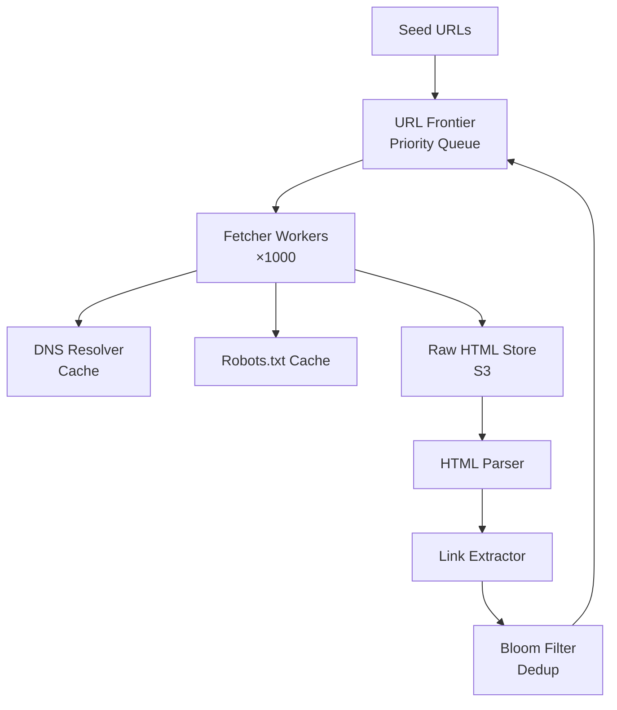

# Design a Web Crawler

**Difficulty**: 🟡 Intermediate
**Reading Time**: Coming Soon
**Interview Frequency**: High

---

> 🚧 **Full article coming soon.** This stub gives you the essentials to start thinking about this problem.

---

## The Core Problem

Crawling 1 billion URLs per day without overwhelming target servers or revisiting the same content requires solving three hard problems simultaneously: URL deduplication at massive scale, politeness (respecting per-domain rate limits), and prioritizing crawl order so important pages are discovered first.

## Functional Requirements

- Crawl 1B URLs per day across the entire web
- Respect robots.txt and per-domain crawl rate limits
- Detect and skip duplicate content
- Support incremental recrawling for freshness

## Non-Functional Requirements

| Requirement | Target |
|-------------|--------|
| Throughput | 1B URLs/day (~11,600 URLs/sec) |
| Storage | 500TB for raw HTML |
| Politeness | Max 1 request/sec per domain |
| Dedup accuracy | >99.9% duplicate detection |

## Back-of-Envelope Estimates

- **Crawl rate**: 1B URLs/day ÷ 86,400s ≈ 12,000 pages/sec
- **HTML storage**: 12,000 pages/sec × 100KB avg = 1.2GB/sec raw HTML → ~500TB over 5 days
- **URL frontier size**: 1B URLs × 64 bytes per URL = ~64GB in-memory (requires external queue)

## Key Design Decisions

1. **Bloom Filter for URL Deduplication** — exact dedup requires 64GB hash set; a Bloom filter achieves <0.1% false positive rate with 10 bits/element (~1.25GB for 1B URLs).
2. **Per-Domain Rate Limiting** — maintain a per-domain priority queue with crawl delay; route all requests for a domain through a single worker to enforce politeness.
3. **URL Frontier Prioritization** — use two-tier queue: priority queue (based on PageRank/freshness) feeds into per-domain FIFO queues to balance importance with politeness.

## High-Level Architecture

## Top Interview Questions for This Problem

| Question | Tests |
|----------|-------|
| How do you detect and avoid crawl traps (infinite URL spaces)? | Adversarial thinking |
| How would you prioritize which pages to crawl first? | Ranking, BFS vs priority queue |
| How do you handle dynamic content rendered by JavaScript? | Headless browser, SPA challenges |

## Related Concepts

- [Bloom Filters for approximate deduplication](../../../05-distributed-systems/concepts/bloom-filters)
- [Consistent Hashing for distributing URL frontier across workers](../../../05-distributed-systems/concepts/consistent-hashing)

---

*📚 Full deep-dive with multiple approaches, trade-off tables, and pseudocode coming soon.*

## 📚 Resources & References

| Resource | Type | What You'll Learn |
|----------|------|------------------|
| [System Design Interview — Alex Xu](https://www.amazon.com/System-Design-Interview-insiders-Second/dp/B08CMF2CQF) | 📚 Book | Chapter on designing a web crawler — politeness, deduplication, storage |
| [ByteByteGo — Design a Web Crawler](https://www.youtube.com/@ByteByteGo) | 📺 YouTube | Comprehensive walkthrough of crawler architecture and URL frontier design |
| [Google: The Anatomy of a Large-Scale Web Search Engine](https://research.google/pubs/pub334/) | 📖 Blog | Brin & Page's original Google architecture paper — foundational crawler design |
| [CommonCrawl: Petabyte-Scale Web Crawling](https://commoncrawl.org/blog) | 📖 Blog | How CommonCrawl operates an open web crawl at petabyte scale |
| [Scrapy Documentation: Crawling Architecture](https://docs.scrapy.org/en/latest/topics/architecture.html) | 📚 Docs | Production-grade web crawler architecture patterns |
