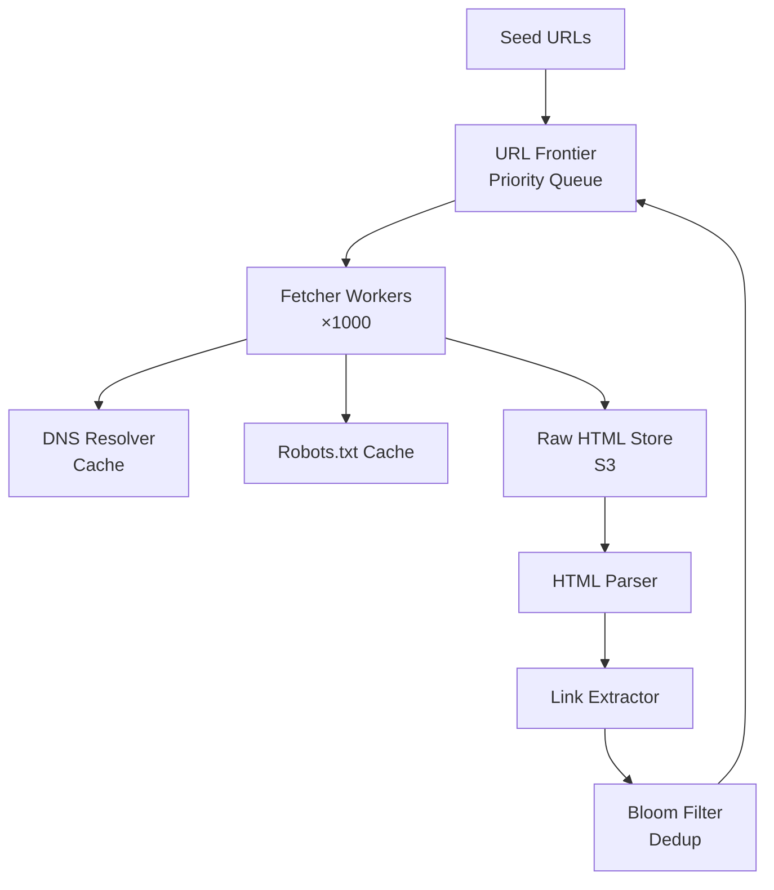
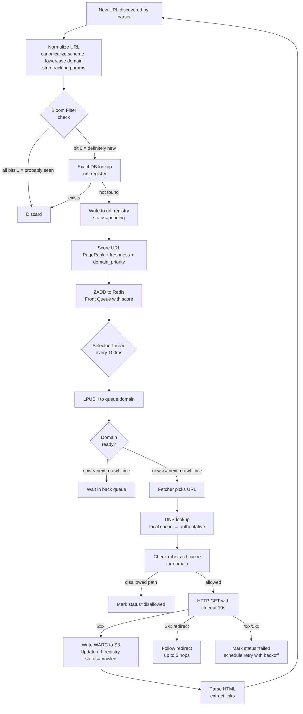
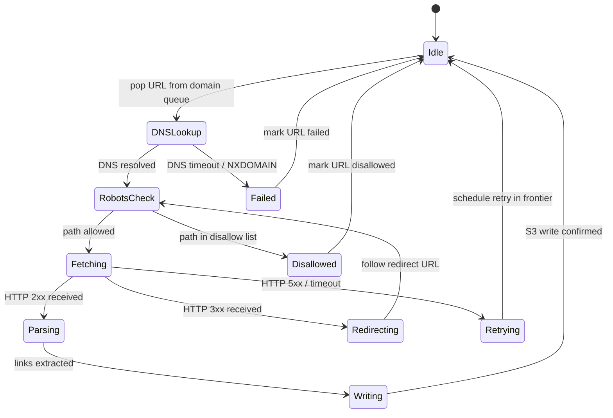
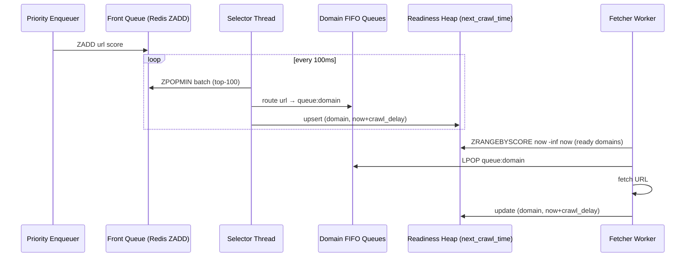
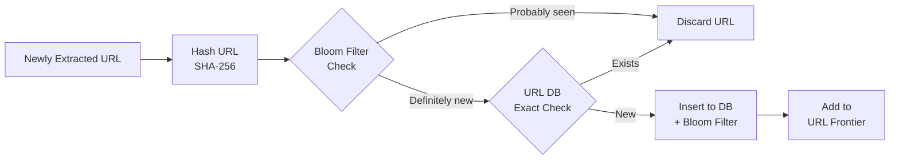
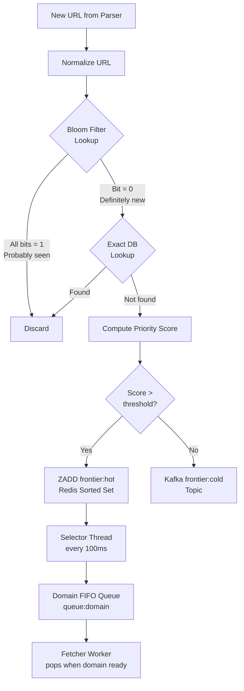
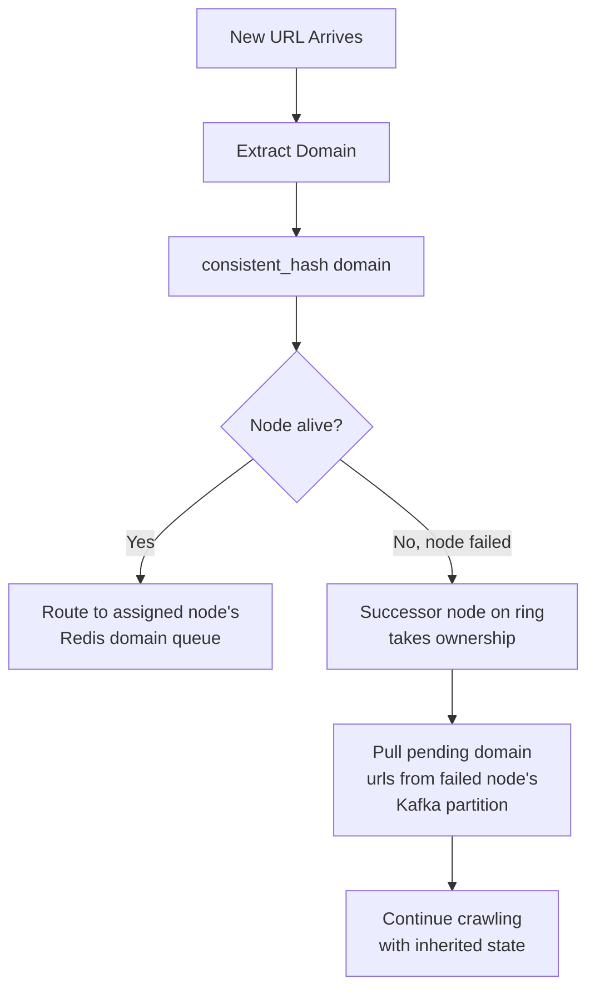
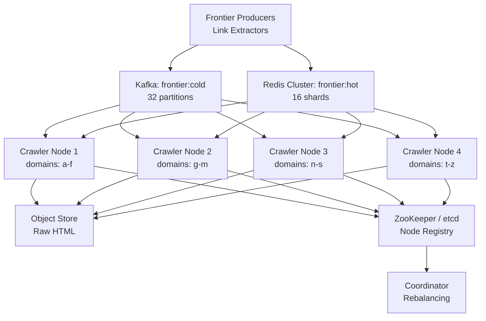
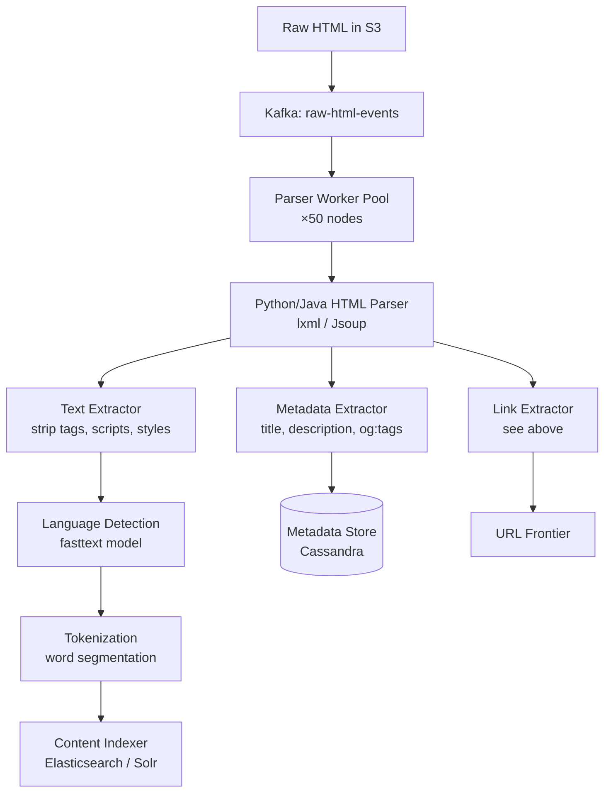

# Design a Web Crawler

**Difficulty**: 🟡 Intermediate
**Reading Time**: Coming Soon
**Interview Frequency**: High

---

> 🚧 **Full article coming soon.** This stub gives you the essentials to start thinking about this problem.

---

## The Core Problem

Crawling 1 billion URLs per day without overwhelming target servers or revisiting the same content requires solving three hard problems simultaneously: URL deduplication at massive scale, politeness (respecting per-domain rate limits), and prioritizing crawl order so important pages are discovered first.

## Functional Requirements

- Crawl 1B URLs per day across the entire web
- Respect robots.txt and per-domain crawl rate limits
- Detect and skip duplicate content
- Support incremental recrawling for freshness

## Non-Functional Requirements

| Requirement | Target |
|-------------|--------|
| Throughput | 1B URLs/day (~11,600 URLs/sec) |
| Storage | 500TB for raw HTML |
| Politeness | Max 1 request/sec per domain |
| Dedup accuracy | >99.9% duplicate detection |

## Back-of-Envelope Estimates

- **Crawl rate**: 1B URLs/day ÷ 86,400s ≈ 12,000 pages/sec
- **HTML storage**: 12,000 pages/sec × 100KB avg = 1.2GB/sec raw HTML → ~500TB over 5 days
- **URL frontier size**: 1B URLs × 64 bytes per URL = ~64GB in-memory (requires external queue)

## Key Design Decisions

1. **Bloom Filter for URL Deduplication** — exact dedup requires 64GB hash set; a Bloom filter achieves <0.1% false positive rate with 10 bits/element (~1.25GB for 1B URLs).
2. **Per-Domain Rate Limiting** — maintain a per-domain priority queue with crawl delay; route all requests for a domain through a single worker to enforce politeness.
3. **URL Frontier Prioritization** — use two-tier queue: priority queue (based on PageRank/freshness) feeds into per-domain FIFO queues to balance importance with politeness.

## High-Level Architecture



## Top Interview Questions for This Problem

| Question | Tests |
|----------|-------|
| How do you detect and avoid crawl traps (infinite URL spaces)? | Adversarial thinking |
| How would you prioritize which pages to crawl first? | Ranking, BFS vs priority queue |
| How do you handle dynamic content rendered by JavaScript? | Headless browser, SPA challenges |

## Related Concepts

- [Bloom Filters for approximate deduplication](../../../14-algorithms/concepts/bloom-filter)
- [Consistent Hashing for distributing URL frontier across workers](../../../14-algorithms/concepts/consistent-hashing-deep-dive)

---

## End-to-End Request Flow

Understanding the full lifecycle of a single URL through the crawler clarifies where each component fits and what can fail at each stage.



This flow shows four feedback loops that make the crawler self-sustaining: (1) new links loop back as new URLs, (2) redirect chains are followed inline, (3) failures are retried with exponential backoff, and (4) crawled pages are scheduled for recrawl based on content change frequency.

---

## Fetcher Worker Design

The fetcher is the innermost loop of the crawler — it runs 1,000+ concurrent workers, each responsible for issuing HTTP requests, handling redirects, enforcing timeouts, and writing results. Throughput at 12,000 URLs/sec means each worker handles ~12 fetches/sec on average, but real workloads are bursty: slow domains stall workers, fast CDN-backed domains process 50+ fetches/sec.

### Worker Concurrency Model

**Async I/O over thread-per-request**: 1,000 threads blocking on HTTP would consume ~8GB RAM (8MB stack each) and saturate the OS thread scheduler. Instead, use async I/O: Python's `asyncio` + `aiohttp`, or Java's `Netty` NIO, or Go's goroutines (cheap at ~4KB each). Each worker node runs 10,000 concurrent in-flight requests on 4 CPU cores.

**Timeout policy**: Two-level timeout — TCP connect timeout 3s, full response timeout 10s. Pages stalling beyond 10s (common for poorly configured servers) are abandoned and marked for retry. At scale, 1% of fetches stalling for 10s apiece would consume 120 workers permanently at 12,000 fetches/sec.

**Redirect handling**: Follow up to 5 hops. On each hop, re-check robots.txt for the new domain (a redirect from `example.com` to `cdn.example.net` crosses domain boundaries). Record the final URL as the canonical URL and discard the chain intermediaries.

### Worker State Machine



### Content Change Detection

On recrawl, compute SHA-256 of response body and compare to `content_hash` stored in `url_registry`. If unchanged, skip re-parsing and re-indexing (saves ~80% of CPU on recrawl passes, since most pages do not change daily). Update `last_crawled_at` and `next_crawl_at` regardless. Adaptive recrawl interval: if a page changed in the last 3 recrawls, set `next_crawl_at = now + 6h`; if unchanged for 10 recrawls, set `next_crawl_at = now + 30d`.

---

## Component Deep Dive 1: URL Frontier

The URL Frontier is the most critical architectural component in a web crawler. It is the scheduler, rate limiter, and priority manager all in one. At 12,000 pages/sec, a naive in-memory queue will exhaust memory in minutes, fail to enforce per-domain politeness, and produce no useful crawl ordering.

### How It Works Internally

The frontier is a two-tier queue system:

**Tier 1 — Priority Queue (Front Queue)**
URLs are scored by crawl priority: PageRank estimate, freshness decay (age since last crawl), content type (HTML > images > JS), and domain authority. A min-heap or sorted set (Redis `ZADD`) maps URL to priority score. Workers pop the highest-priority URLs.

**Tier 2 — Per-Domain FIFO Queues (Back Queue)**
A selector thread reads from the front queue and routes each URL into a domain-specific FIFO queue (e.g., `queue:nytimes.com`, `queue:bbc.co.uk`). Each domain queue enforces a crawl delay — typically 1 request/sec per robots.txt `Crawl-delay`. A heap of `(next_allowed_crawl_time, domain)` lets the scheduler know which domain queue is ready to dispatch next. Fetcher workers pull from the domain queue only when `now >= next_allowed_time`.

### Why Naive Approaches Fail at Scale

1. **Single global FIFO**: Fetchers burst requests to the same domain (hundreds of URLs for amazon.com queued up), causing bans and violating robots.txt.
2. **In-memory only**: At 1B URLs × 64 bytes = 64GB, you cannot hold the frontier in RAM on a single node. Redis Cluster or a disk-backed queue (RocksDB) is required.
3. **No priority**: BFS treats a Wikipedia page the same as a deep spam link. Without priority, you spend crawl budget on low-value content.

### Frontier Internals Diagram



### Frontier Implementation Trade-offs

| Approach | Latency | Throughput | Trade-off |
|----------|---------|------------|-----------|
| Redis Sorted Set (ZADD/ZPOPMIN) | <1ms | ~100k ops/sec per node | Must shard across Redis Cluster; memory-bound |
| Kafka per-domain partitions | 5–20ms | Millions/sec aggregate | Natural backpressure; hard to reprioritize mid-queue |
| RocksDB disk-backed queue | 1–5ms | ~50k ops/sec | Survives restarts; good for >100GB frontier; more ops complexity |

**Recommendation**: Use Redis Cluster for the hot priority queue (top 10M URLs) and Kafka for the cold overflow queue (remaining 990M URLs). Promote from Kafka to Redis as URLs age.

---

## Component Deep Dive 2: Bloom Filter for URL Deduplication

At 1B URLs/day and potentially 100B total crawled URLs over the lifetime of a crawler, exact URL deduplication using a hash set requires ~6.4TB of memory (100B × 64 bytes per SHA-256 hash). The Bloom filter reduces this by 99.8%: a 10-bit-per-element filter for 100B elements requires only ~125GB, and can be sharded across nodes.

### How It Works Internally

A Bloom filter uses `k` independent hash functions. To insert URL `u`, compute `h1(u), h2(u), ..., hk(u)` and set those bit positions to 1 in a bit array of size `m`. To query, compute the same positions — if any bit is 0, the URL is definitively new (not seen). If all bits are 1, it is probably seen (with false positive probability `p`).

Optimal parameters: for `n = 1B` URLs and target `p = 0.1%` false positive rate, `m = 14.4n bits ≈ 1.8GB` and `k = 10 hash functions`.

### Scale Behavior at 10x Load

At 10B URLs (10x), the filter needs 18GB for the same false positive rate. Bit arrays of this size can be partitioned: consistent hash the URL to a shard (e.g., 16 shards of 1.125GB each), each running on a separate Redis Bitfield or in-process. Bloom filter lookups and inserts remain O(k) — constant time regardless of size — so throughput scales linearly with shard count.

A key operational risk: **Bloom filters cannot delete entries**. When URLs are re-crawled for freshness after 30 days, the filter will report them as seen and skip them. The solution is a **counting Bloom filter** (4 bits/cell instead of 1 bit, allowing decrements) or a time-segmented approach: rotate to a new filter monthly and keep the last 2 generations.

### Deduplication Pipeline Diagram



Note the two-stage check: Bloom filter as cheap fast gate, exact DB lookup as correctness backstop for the small fraction (~0.1%) that pass the filter. This reduces DB lookups by ~99.9%.

| Approach | Memory (1B URLs) | False Positive Rate | Delete Support |
|----------|-----------------|--------------------|-|
| Standard Bloom Filter | 1.8GB | 0.1% | No |
| Counting Bloom Filter | 7.2GB | 0.1% | Yes |
| Cuckoo Filter | 1.2GB | 0.1% | Yes |
| Redis Set (exact) | 64GB | 0% | Yes |

**Recommendation**: Use Cuckoo Filter (better space than Counting Bloom, supports deletes) for the active crawl window, backed by an exact URL table in Cassandra for permanent deduplication history.

---

## Component Deep Dive 3: Robots.txt Cache and Politeness Layer

The politeness layer enforces two rules: (1) respect `robots.txt` disallow rules, and (2) do not hammer a single domain faster than its declared `Crawl-delay` (default 1 req/sec if unspecified).

### Internal Mechanics

On first visit to any domain, a fetcher makes a dedicated HTTP GET to `https://domain.com/robots.txt` before crawling any other page. The parsed rules are stored in a Redis hash: `robots:domain.com → { disallow: [...], crawl_delay: 2, sitemap: [...] }`. TTL is 24 hours — robots.txt changes infrequently but must be refreshed to pick up new disallow rules.

**URL path matching** against disallow rules requires prefix matching and wildcard support (`*` and `$` suffixes per RFC 9309). A trie data structure over disallow prefixes enables O(path_length) matching per URL check.

The `Crawl-delay` is fed directly into the per-domain readiness heap in the URL frontier (Tier 2 queue). If `Crawl-delay: 10` is declared, the domain's next allowed time is set to `now + 10s` after each fetch, effectively throttling that domain to 6 requests/minute.

### Specific Technical Decisions

- **Cache size**: 10M active domains × ~1KB per parsed robots = 10GB. Use LRU eviction in Redis; cold domains evicted after 7 days.
- **Failure handling**: If `robots.txt` fetch returns 5xx, treat as "allow all" and retry in 1 hour. If 4xx (not found), treat as "allow all" permanently for that domain.
- **Crawl trap detection**: URL path depth limit (max 10 levels), query parameter normalization (canonicalize `?a=1&b=2` same as `?b=2&a=1`), and cycle detection using a per-domain visited URL count cap (skip domain if >1M pages already seen).

---

## Data Model

The crawler needs three core storage structures: a URL frontier, a crawled URL registry, and a raw content store.

```sql
-- URL Registry: tracks all known URLs, crawl status, and metadata
CREATE TABLE url_registry (
    url_hash        BYTEA PRIMARY KEY,         -- SHA-256 of normalized URL (32 bytes)
    url             TEXT NOT NULL,             -- full URL string
    domain          VARCHAR(255) NOT NULL,     -- extracted domain for sharding
    status          VARCHAR(20) DEFAULT 'pending', -- pending | crawling | crawled | failed | disallowed
    priority_score  FLOAT DEFAULT 0.0,         -- PageRank estimate + freshness score
    discovered_at   TIMESTAMPTZ NOT NULL,
    last_crawled_at TIMESTAMPTZ,
    crawl_count     INT DEFAULT 0,
    http_status     SMALLINT,                  -- last HTTP response code
    content_hash    BYTEA,                     -- SHA-256 of response body (for change detection)
    next_crawl_at   TIMESTAMPTZ               -- for scheduled recrawls
);

CREATE INDEX idx_url_registry_domain ON url_registry(domain);
CREATE INDEX idx_url_registry_status_priority ON url_registry(status, priority_score DESC)
    WHERE status = 'pending';
CREATE INDEX idx_url_registry_next_crawl ON url_registry(next_crawl_at)
    WHERE status = 'crawled';

-- Domain Metadata: politeness rules per domain
CREATE TABLE domain_metadata (
    domain          VARCHAR(255) PRIMARY KEY,
    robots_txt      TEXT,                      -- raw robots.txt content
    crawl_delay_sec INT DEFAULT 1,             -- from robots.txt Crawl-delay
    disallow_paths  JSONB,                     -- parsed disallow rules
    sitemap_urls    JSONB,                     -- sitemap.xml URLs
    last_robots_fetch TIMESTAMPTZ,
    is_blocked      BOOLEAN DEFAULT FALSE,     -- manual block list
    domain_priority FLOAT DEFAULT 1.0         -- boost factor (news > spam)
);

-- Crawl Jobs: in-flight crawl state (ephemeral, Redis in practice)
CREATE TABLE crawl_job (
    job_id          UUID PRIMARY KEY,
    url_hash        BYTEA NOT NULL REFERENCES url_registry(url_hash),
    worker_id       VARCHAR(64) NOT NULL,
    started_at      TIMESTAMPTZ NOT NULL,
    deadline_at     TIMESTAMPTZ NOT NULL,      -- started_at + 30s timeout
    retry_count     SMALLINT DEFAULT 0
);
```

Raw HTML is stored in object storage (S3/GCS), not in the database:

```
S3 path pattern:
  s3://crawl-bucket/{year}/{month}/{day}/{url_hash_prefix_2}/{url_hash}.html.gz

Example:
  s3://crawl-bucket/2026/06/01/3f/3fa7b2c8...sha256.html.gz
```

Extracted links, parsed text, and structured metadata are written to a separate analytics store (BigQuery or ClickHouse) for downstream indexing pipelines.

---

## Scale Bottlenecks

| Traffic Level | Component That Breaks | Symptoms | Mitigation |
|---------------|----------------------|----------|------------|
| 10x baseline (120k URLs/sec) | Redis URL Frontier | ZADD latency spikes >50ms; OOM on single Redis node | Shard frontier across 16 Redis Cluster nodes by domain hash |
| 10x baseline | DNS Resolver | Cache miss storm; 50% of fetches blocked waiting for DNS | Run local unbound DNS cache per fetcher node; pre-warm with Alexa top 10M domains |
| 100x baseline (1.2M URLs/sec) | URL Registry DB (Postgres) | Write throughput ceiling ~100k rows/sec; replication lag | Migrate to Cassandra (write-optimized, linear scale); partition by domain |
| 100x baseline | Bloom Filter | 18GB bit array needs cross-shard consistency | Switch to Cuckoo Filter partitioned across 32 shards; accept eventual consistency |
| 100x baseline | S3 PUT throughput | S3 prefix hot spots cause throttling (3,500 PUTs/sec/prefix) | Use content-hash-based prefix (first 2 hex chars), giving 256 prefixes × 3,500 = 896k PUTs/sec |
| 1000x baseline (12M URLs/sec) | Fetcher network bandwidth | 12M × 100KB = 1.2TB/sec egress per region | Geo-distribute crawler regions (US, EU, APAC); crawl local domains from nearest region |
| 1000x baseline | robots.txt cache | 10M domains × cache misses at startup = thundering herd | Pre-seed robots cache from prior run dump; stagger cold-start with domain hash modulo |

---

## How CommonCrawl Built This

CommonCrawl is a non-profit that crawls the open web monthly and makes the data freely available. As of 2024, their crawl archive exceeds 3 petabytes, and each monthly crawl fetches approximately 3–4 billion web pages.

**Technology choices:**
- **Apache Nutch** (initially), then a custom Java-based crawler at scale. Nutch provides the URL frontier, fetcher, and parser pipeline out of the box.
- **AWS infrastructure**: Crawl jobs run on EC2 spot instances (hundreds of c5.4xlarge nodes) to minimize cost. Raw WARC (Web ARChive) files are stored directly in S3.
- **WARC format**: Rather than storing raw HTML, CommonCrawl uses the WARC format — a streaming record format that includes the HTTP request, HTTP response headers, and body in a single file. Each monthly crawl produces ~70,000 WARC files averaging ~1GB each.
- **URL deduplication**: Uses an in-memory Bloom filter (stored on the coordinator node) seeded from the prior crawl's URL list. With ~3B URLs/crawl at 10 bits/element, this is ~3.75GB — manageable on a single high-memory instance.
- **Politeness**: Nutch enforces per-host crawl delay using a per-host queue. Default delay is 5 seconds (more conservative than most commercial crawlers).

**Non-obvious architectural decision**: CommonCrawl crawls from a single AWS region (us-east-1) rather than geo-distributing. This simplifies coordination (single URL frontier) at the cost of higher latency for non-US domains. The monthly cycle provides enough slack that latency to APAC endpoints (200–400ms RTT) is acceptable — they are throughput-bound, not latency-bound.

**Numbers**: Each monthly crawl processes ~40TB of robots.txt files across ~200M distinct domains. The WARC output is compressed to ~80TB per crawl. Downstream Apache Spark jobs on EMR process the WARC files to produce the WET (plain text), WAT (metadata JSON), and cdx-index files used by search engines.

Source: [CommonCrawl blog](https://commoncrawl.org/blog) and [AWS Big Data blog: CommonCrawl infrastructure](https://aws.amazon.com/blogs/big-data/building-a-large-scale-web-crawl-with-apache-nutch-on-aws/).

---

## Interview Angle

**What the interviewer is testing:** The interviewer is evaluating your ability to reason about distributed coordination problems — specifically how to schedule work across many workers while enforcing global constraints (politeness) and maintaining data correctness (deduplication) at a scale where naive solutions break.

**Common mistakes candidates make:**

1. **Treating URL deduplication as trivial**: Saying "use a hash set" without considering that 1B URLs × 64 bytes = 64GB is too large for a single in-memory set. The correct answer names Bloom filters or Cuckoo filters with specific false positive rates and memory calculations.

2. **Ignoring politeness enforcement mechanics**: Saying "respect robots.txt" without explaining how to actually enforce per-domain rate limits across 1,000 parallel workers. The key is routing all URLs for a given domain through a dedicated queue and tracking per-domain next-allowed-crawl timestamps.

3. **Not handling duplicate content (vs. duplicate URLs)**: Two different URLs can serve identical content (e.g., `http://` vs `https://`, with and without trailing slash, URL parameters in different orders). Naive URL deduplication misses this. Content deduplication requires hashing the response body and checking against a seen-hash store.

4. **Missing the recrawl scheduling problem**: A crawler is not a one-time job — popular pages need recrawling every hour, stable pages every 30 days. Candidates often design only for initial crawl and omit the freshness scheduling layer.

**The insight that separates good from great answers:** The URL frontier is not a simple queue — it is the intersection of a priority scheduler, a rate limiter, and a work distribution system. The two-tier design (global priority front queue feeding per-domain back queues) elegantly solves all three: priority is managed in the front queue, politeness is enforced in the back queue, and work is distributed by routing different domains to different worker groups. Recognizing that these three concerns must be decoupled — and explaining how the two-tier architecture decouples them — signals deep understanding.

---

## Key Numbers to Remember

| Metric | Value | Context |
|--------|-------|---------|
| Crawl throughput target | 12,000 URLs/sec | 1B URLs/day ÷ 86,400 sec |
| Raw HTML storage rate | 1.2 GB/sec | 12,000 pages/sec × 100KB avg page size |
| URL frontier memory (naive) | 64 GB | 1B URLs × 64 bytes per URL (SHA-256) |
| Bloom filter memory (1B URLs) | 1.8 GB | 10 bits/element, 0.1% false positive rate |
| robots.txt cache size | 10 GB | 10M active domains × ~1KB parsed rules |
| DNS cache TTL recommendation | 5 minutes | Balance freshness vs DNS resolver load |
| CommonCrawl monthly output | ~80 TB compressed | ~3–4B pages per monthly crawl (2024) |
| Per-domain crawl delay (default) | 1 req/sec | robots.txt standard; CommonCrawl uses 5s |
| S3 PUT throughput per prefix | 3,500 req/sec | AWS limit; requires prefix sharding strategy |
| Content hash check (change detect) | SHA-256 of body | Skip re-indexing if hash unchanged vs prior crawl |

---

## URL Frontier Implementation: BFS + Priority Queue + Bloom Filter

Most interview answers describe the URL frontier as "a priority queue" — the real implementation layers three distinct data structures that serve different goals.

### Why BFS Alone Fails

Pure Breadth-First Search (BFS) would work on a small, well-behaved graph. At web scale, it fails for three reasons:

1. **No priority**: BFS treats a spam farm URL identically to a Wikipedia article. You exhaust crawl budget on junk before reaching high-value pages.
2. **No politeness**: BFS pops URLs in discovery order. If you discovered 500 URLs on `reddit.com`, they queue back-to-back and your crawler hammers Reddit at full network speed — violating `robots.txt` and triggering an IP ban.
3. **Memory blowup**: BFS queues the entire frontier in memory. At 1B URLs × 64 bytes = 64GB, you cannot hold this on a single node.

The solution is a **three-layer architecture** that separates priority scoring, politeness enforcement, and deduplication.

### Layer 1: Priority Scoring (Front Queue)

Before a URL enters the frontier, it is assigned a numeric priority score:

```
priority = (pagerank_estimate × 0.4)
         + (domain_authority    × 0.3)
         + (freshness_bonus     × 0.2)
         + (content_type_bonus  × 0.1)

where:
  freshness_bonus   = 1.0 if page is new, decays to 0.1 after 30 days without change
  content_type_bonus = 1.0 for HTML, 0.5 for sitemaps, 0.2 for media
```

URLs are inserted into a Redis Sorted Set (`ZADD frontier:hot <score> <url>`). The selector thread runs every 100ms, pops the top 500 URLs via `ZPOPMIN`, and routes them to per-domain queues.

**Hot vs Cold tiers**: Only the top 10M highest-priority URLs live in Redis (hot tier). The remaining 990M URLs are stored in Kafka topics (cold tier). When the Redis frontier drops below 5M entries, a background process promotes URLs from Kafka by recalculating priority scores.

### Layer 2: Per-Domain FIFO Queues (Back Queue)

The selector thread reads the hot tier and routes each URL to `queue:<domain>` (e.g., `queue:nytimes.com`). Each domain queue is a Redis List (FIFO). A separate min-heap tracks the next allowed crawl time per domain:

```
domain_heap entry: (next_allowed_time_unix, domain_name)

After each fetch from domain X:
  next_allowed_time = now + max(robots_crawl_delay, 1.0)
  HEAPPUSH(domain_heap, (next_allowed_time, domain_name))
```

Fetcher workers query `ZRANGEBYSCORE domain_heap 0 now` to find domains ready for crawling, then `LPOP queue:<domain>` to get the next URL. This two-tier design decouples global priority management from per-domain rate limiting.

### Layer 3: Bloom Filter Deduplication Gate

Before any URL enters the priority queue, it passes through a Bloom filter check. The filter sits in front of the entire frontier pipeline:



**Combined parameter tuning for 1B URL frontier**:

| Parameter | Value | Calculation |
|-----------|-------|-------------|
| Bloom filter size | 1.8 GB | 10 bits/element × 1B URLs ÷ 8 |
| Hash functions (k) | 7 | Optimal: k = (m/n) × ln(2) |
| False positive rate | 0.1% | At k=7, m=10×n |
| Redis hot tier size | ~640 MB | 10M URLs × 64 bytes |
| Domain heap size | ~80 MB | 10M active domains × 8 bytes |
| Kafka cold tier | ~64 GB | 1B URLs × 64 bytes on disk |

**BFS still matters at the micro level**: Within each domain's FIFO queue, URLs are ordered by discovery time (BFS order). This ensures you explore a site's top-level pages before drilling into deep subdirectories — which is how BFS finds high-value pages without needing PageRank for intra-site ordering.

---

## Distributed Crawler Coordination: Consistent Hashing

A single-machine crawler cannot sustain 12,000 pages/sec (network bottleneck alone requires 10Gbps sustained). You need 50–200 crawler nodes working in parallel. The coordination challenge: how do you distribute 1B URLs across N nodes without routing the same URL to multiple nodes (duplicate work) or losing URLs?

### The Assignment Problem

Naive approaches fail:
- **Random assignment**: URL `reddit.com/r/news/post-123` is assigned to node 7. URL `reddit.com/r/news/post-124` goes to node 3. Now two nodes are both trying to enforce politeness for `reddit.com` — they cannot coordinate their crawl delays without a shared lock (which becomes a bottleneck).
- **Central coordinator**: One master node assigns URLs to workers. At 12,000 URLs/sec, the master processes 12,000 assignments/sec — manageable, but it becomes a single point of failure and a hot bottleneck at higher scales.

### Consistent Hashing by Domain

The solution: use consistent hashing of the **domain name** (not the full URL) to assign ownership of all URLs for a domain to a specific crawler node.

```
node = consistent_hash(domain) % num_crawler_nodes

Example:
  "nytimes.com"  → hash → node 7
  "reddit.com"   → hash → node 2
  "bbc.co.uk"    → hash → node 15

All URLs for nytimes.com are fetched by node 7.
Node 7 enforces crawl-delay for nytimes.com locally, no coordination needed.
```

This eliminates the need for distributed locks on per-domain rate limiting. Each node is the single authority for its assigned domains.

### Rebalancing When Nodes Join or Leave

Consistent hashing with a virtual node ring (150 virtual nodes per physical node) minimizes data movement during rebalancing:



**Partition strategy**: Each crawler node owns a partition of the Kafka `frontier:cold` topic. Domain-to-partition assignment matches the consistent hash ring. When a node joins, it steals partitions from neighbors; when it leaves, the successor node absorbs its partitions. This is exactly how Kafka consumer groups work — the crawler reuses Kafka's rebalancing protocol.

### Distributed Coordination Architecture



**Node discovery**: Each crawler node registers with ZooKeeper/etcd at startup, publishing its assigned domain hash range. When a node fails (heartbeat timeout after 30s), the coordinator redistributes its hash range to neighbors. Recovery time: ~90 seconds (30s detection + 60s partition transfer).

### Googlebot Scale Reference

Googlebot crawls approximately **20 billion pages per day** (source: Google Search Central documentation, 2023). That is:
- 231,000 pages/sec sustained
- ~20x higher than the 12,000 pages/sec target in this article
- Requires ~1,000+ crawler nodes running in parallel across multiple data centers
- DNS query rate: estimated 500k–1M DNS lookups/sec (many URLs share domains but CDN IPs rotate)
- robots.txt fetches: ~200M distinct domains/day, with 24-hour cache TTL meaning ~2,300 robots.txt refreshes/sec

At Googlebot scale, the consistent hashing ring has tens of thousands of nodes across US, EU, and APAC regions. Google geo-distributes crawling so that European domains are crawled from European data centers (lower RTT, compliance with data sovereignty rules).

---

## Politeness Implementation: robots.txt + Crawl-Delay

Politeness is the most frequently skipped component in interview answers — and the most legally and operationally critical. A crawler without politeness will be IP-blocked within hours and may violate the Computer Fraud and Abuse Act (CFAA) in the US and similar laws elsewhere.

### robots.txt: The Contract Between Crawler and Server

The `robots.txt` protocol (formalized as RFC 9309 in 2022) defines which paths a crawler may fetch:

```
# Example robots.txt for a news site
User-agent: Googlebot
Allow: /news/
Disallow: /private/
Disallow: /user/*/settings
Crawl-delay: 2
Sitemap: https://news.example.com/sitemap.xml

User-agent: *
Disallow: /admin/
Crawl-delay: 5
```

Your crawler must parse:
1. `User-agent` blocks — match your crawler's name or use the `*` wildcard block
2. `Allow` rules (take precedence over `Disallow` for matching paths)
3. `Disallow` rules — prefix matching with `*` wildcard and `$` end-of-string anchors
4. `Crawl-delay` — seconds to wait between requests to this domain
5. `Sitemap` — URLs of XML sitemaps (seed these into your frontier directly for faster discovery)

### robots.txt Cache Implementation

Fetching robots.txt for every URL would double your request volume. Cache it:

```sql
-- robots_cache table
CREATE TABLE robots_cache (
    domain          VARCHAR(255) PRIMARY KEY,
    raw_txt         TEXT,                       -- raw robots.txt body
    crawl_delay_sec INT DEFAULT 1,              -- parsed Crawl-delay
    disallow_rules  JSONB,                      -- [{user_agent, paths: [...]}]
    allow_rules     JSONB,
    sitemap_urls    JSONB,
    fetched_at      TIMESTAMPTZ NOT NULL,
    expires_at      TIMESTAMPTZ NOT NULL,       -- fetched_at + 24h
    fetch_status    SMALLINT,                   -- HTTP status when fetched
    is_all_allowed  BOOLEAN DEFAULT FALSE       -- robots.txt returned 4xx (allow all)
);

-- domain_crawl_state table (per-domain rate limiting)
CREATE TABLE domain_crawl_state (
    domain              VARCHAR(255) PRIMARY KEY,
    last_fetch_at       TIMESTAMPTZ,            -- timestamp of most recent fetch
    next_allowed_at     TIMESTAMPTZ,            -- last_fetch_at + crawl_delay
    consecutive_errors  INT DEFAULT 0,          -- for exponential backoff
    is_blocked          BOOLEAN DEFAULT FALSE,  -- manually blocked (spam, legal)
    total_pages_crawled BIGINT DEFAULT 0,
    crawl_delay_sec     INT DEFAULT 1           -- cached from robots_cache
);
```

**Cache TTL**: 24 hours is the standard. Google uses 24 hours. Bing uses 24 hours. Some crawlers use 1 hour for high-churn news domains, but 24 hours is the safe default that respects server operators' intent without generating excessive robots.txt traffic.

**Cache size calculation**: 10M active domains × 1KB average robots.txt = 10GB. Fits in Redis with LRU eviction. Cold domains (not crawled in 7 days) are evicted; on re-visit, robots.txt is re-fetched.

### Crawl-Delay Enforcement Mechanics

The `Crawl-delay` directive specifies the minimum number of seconds between consecutive requests to a domain. Implementation:

```python
# Pseudocode: Domain-aware fetch scheduling
class DomainScheduler:
    def __init__(self):
        self.domain_heap = []  # min-heap: (next_allowed_time, domain)
        self.domain_queues = {}  # domain -> deque of URLs

    def add_url(self, url):
        domain = extract_domain(url)
        if domain not in self.domain_queues:
            self.domain_queues[domain] = deque()
            heappush(self.domain_heap, (time.time(), domain))
        self.domain_queues[domain].append(url)

    def next_ready_url(self):
        while self.domain_heap:
            next_time, domain = self.domain_heap[0]
            if next_time > time.time():
                return None  # no domain ready yet
            heappop(self.domain_heap)
            if self.domain_queues[domain]:
                url = self.domain_queues[domain].popleft()
                crawl_delay = robots_cache.get_delay(domain)
                heappush(self.domain_heap, (time.time() + crawl_delay, domain))
                return url
        return None
```

**Key invariant**: A domain's `next_allowed_at` is updated *after* each successful fetch, not before. This means the crawl delay is measured from the end of the previous response, not the start. This is the correct interpretation of RFC 9309.

### What Happens Without Politeness

| Consequence | Mechanism | Timeline |
|-------------|-----------|----------|
| IP ban | Target server detects >N req/sec from single IP, adds to firewall | Minutes to hours |
| User-Agent ban | Server blocks your crawler's User-Agent string | Days |
| Legal risk | CFAA (US), Computer Misuse Act (UK) prohibit "unauthorized access" | Ongoing liability |
| Data quality degradation | Server returns 503/429 or garbage responses under load | Immediate |
| Reputation damage | IP listed in spam blacklists, affects all services on your IP range | Weeks to resolve |

**The legal angle**: In *hiQ Labs v. LinkedIn* (9th Circuit, 2022), the court ruled that scraping publicly accessible data does not automatically violate CFAA. However, ignoring `robots.txt` and overwhelming servers crosses into unauthorized access territory. Respecting `robots.txt` is both the ethical and legally safer choice.

---

## Content Extraction Pipeline

After a page is fetched, raw HTML must be parsed to extract two things: outbound links (for the URL frontier) and structured content (for the search index). These are two separate pipelines with different latency and accuracy requirements.

### Link Extraction Pipeline

Link extraction must be fast (inline with fetching) and complete (missing links = missing pages). The pipeline:

```
Raw HTML (gzipped, avg 100KB)
    ↓
HTML Parser (BeautifulSoup4 / Jsoup / html5lib)
    ↓
Link Normalization:
  - Resolve relative URLs against base URL
  - Canonicalize: lowercase scheme+domain, strip default ports
  - Normalize path: collapse ../ and ./
  - Strip fragment identifiers (#section)
  - Sort query parameters alphabetically
  - Remove tracking parameters (utm_*, fbclid, etc.)
    ↓
URL Filtering:
  - Reject non-HTTP(S) schemes (mailto:, ftp:, javascript:)
  - Reject file extensions irrelevant to text crawl (.exe, .zip, .mp4)
  - Check URL length limit (max 2048 chars)
  - Apply domain allowlist/blocklist
    ↓
Bloom Filter + DB Deduplication Check
    ↓
Priority Scoring
    ↓
URL Frontier (Redis hot tier or Kafka cold tier)
```

**Performance target**: Link extraction must complete in <50ms per page to avoid becoming the pipeline bottleneck. At 12,000 pages/sec, you have 1 billion extractions/day — use a compiled HTML parser (lxml in Python, Jsoup in Java) not an interpreted one.

### Text Extraction Pipeline

Text extraction is for downstream indexing, not URL discovery. It runs asynchronously from fetching (decoupled via a message queue):



**JavaScript-rendered content**: ~30% of modern web pages require JavaScript execution to render meaningful content. Static HTML parsers miss this content entirely. Solutions:
- **Headless browser pool**: Run 50–100 Chromium instances (via Playwright or Puppeteer). Throughput: ~50 pages/sec per instance (10x slower than static fetching). Reserve for high-priority pages (top 1M domains only).
- **Rendered content cache**: After headless rendering, cache the rendered HTML in S3 for 1 hour. Re-fetch requests within 1 hour get the cached render.
- **Content detection**: Classify pages as JS-heavy using lightweight heuristics (low raw text/HTML ratio, presence of `<script>` tags with known SPA frameworks) before committing to headless rendering.

### Content Deduplication (Near-Duplicate Detection)

URL deduplication catches exact URL matches. Content deduplication catches near-duplicates: pages with identical or near-identical text but different URLs (printer-friendly versions, paginated views, syndicated articles).

**SimHash algorithm**:
1. Extract text tokens from the page
2. For each token, compute a 64-bit hash
3. For each bit position: sum +1 for each token hash where that bit is 1, -1 where bit is 0
4. The final SimHash is 1 where the sum is positive, 0 where negative
5. Two pages are near-duplicates if their SimHash vectors differ by ≤ 3 bits (Hamming distance ≤ 3)

```
SimHash storage: 64 bits per page
1B pages × 8 bytes = 8GB — fits in memory on a single high-memory node

Lookup: For each new page's SimHash, check all pages within Hamming distance 3.
Naive: O(n) per lookup — too slow.
Optimized: Partition the 64-bit SimHash into 4 × 16-bit blocks.
  Two hashes within distance 3 must share at least 1 identical 16-bit block.
  Build 4 hash tables (one per block). Lookup = 4 hash table lookups.
  Reduces 1B comparisons to ~1M per lookup.
```

---

## Common Mistakes and How to Avoid Them

| Mistake | Root Cause | Impact | Fix |
|---------|-----------|--------|-----|
| Forgetting robots.txt | Treating crawling as a pure engineering problem | IP ban, legal liability, data gaps | Fetch and cache robots.txt before first request to any domain; enforce per robots.txt Crawl-delay |
| Single-tier URL queue | Thinking of the frontier as a simple FIFO | Politeness violations; low-quality crawl order | Two-tier queue: global priority front queue + per-domain FIFO back queues |
| URL dedup only (not content dedup) | Missing that different URLs can serve identical content | Duplicate content in index; wasted storage | SimHash near-duplicate detection on extracted text |
| No recrawl scheduling | Designing only for initial crawl | Stale index within days | Adaptive recrawl intervals: 6h for frequently-changing pages, 30d for stable pages |
| Ignoring DNS caching | Each fetch triggers a DNS lookup | 50ms added to every fetch; DNS resolver overload | Local unbound DNS cache per crawler node; pre-warm with top 10M domains |
| Not handling robots.txt failures | 5xx on robots.txt fetch | Either block domain (missed coverage) or allow all (risk) | On 5xx: treat as allow-all and retry in 1h. On 4xx: treat as allow-all permanently |
| Fixed crawl-delay for all domains | robots.txt Crawl-delay varies (1s–60s per domain) | Violating fast-crawl-allowed domains; hammering slow-crawl domains | Read Crawl-delay from robots.txt cache; default to 1s if not specified |

---

## 📚 Resources & References

| Resource | Type | What You'll Learn |
|----------|------|------------------|
| [System Design Interview — Alex Xu](https://www.amazon.com/System-Design-Interview-insiders-Second/dp/B08CMF2CQF) | 📚 Book | Chapter on designing a web crawler — politeness, deduplication, storage |
| [ByteByteGo — Design a Web Crawler](https://www.youtube.com/@ByteByteGo) | 📺 YouTube | Comprehensive walkthrough of crawler architecture and URL frontier design |
| [Google: The Anatomy of a Large-Scale Web Search Engine](https://research.google/pubs/pub334/) | 📖 Blog | Brin & Page's original Google architecture paper — foundational crawler design |
| [CommonCrawl: Petabyte-Scale Web Crawling](https://commoncrawl.org/blog) | 📖 Blog | How CommonCrawl operates an open web crawl at petabyte scale |
| [Scrapy Documentation: Crawling Architecture](https://docs.scrapy.org/en/latest/topics/architecture.html) | 📚 Docs | Production-grade web crawler architecture patterns |
