# Design YouTube / Netflix — Video Streaming at Planetary Scale

> **Difficulty**: 🟡 Intermediate — One of the most common senior-level system design questions. Requires understanding of distributed transcoding, adaptive bitrate streaming, CDN architecture, and large-scale storage.

---

## Table of Contents

| # | Section | Core Concept |
|---|---------|--------------|
| 1 | [Mental Model: Two Very Different Problems](#the-mental-model--two-very-different-problems) | Upload path vs Playback path |
| 2 | [Why Video is Hard](#the-core-problem-video-is-massive-and-diverse) | Scale and diversity of formats |
| 3 | [Requirements & Numbers](#requirements-with-real-numbers) | YouTube vs Netflix at scale |
| 4 | [Capacity Estimation](#capacity-estimation) | Storage, bandwidth, compute math |
| 5 | [Upload & Transcoding Pipeline](#the-video-upload--transcoding-pipeline--deep-dive) | Chunked parallel encoding |
| 6 | [Adaptive Bitrate Streaming](#adaptive-bitrate-streaming-abr--the-key-to-smooth-playback) | HLS, DASH, bandwidth probing |
| 7 | [CDN Architecture](#cdn-architecture--serving-231tbsec) | Edge nodes, cache hierarchy, Open Connect |
| 8 | [Video Storage Architecture](#video-storage-architecture) | Metadata, segments, schema |
| 9 | [The View Count Problem](#the-view-count-problem) | Redis sharding, Kafka aggregation |
| 10 | [Search & Discovery](#search--finding-videos) | Elasticsearch + ML ranking |
| 11 | [Problems at Scale](#problems-at-scale) | 5 failure modes with fixes |
| 12 | [Live vs VOD](#live-streaming-vs-vod--different-architectures) | Where the architectures diverge |
| 13 | [YouTube vs Netflix Comparison](#youtube-vs-netflix--architectural-differences) | Side-by-side design differences |
| 14 | [Interview Questions Mapped](#interview-questions-mapped) | Common interview angles |
| 15 | [Key Takeaways](#key-takeaways) | Numbers to memorize |

---

## The Mental Model — Two Very Different Problems

**This is not one problem. It is two separate systems glued together.** Getting this distinction right in an interview immediately signals seniority.

```mermaid
graph TD
    subgraph UPLOAD["✏️ UPLOAD PATH — Write Heavy, Latency Tolerant"]
        A[Creator] --> B[Upload Service]
        B --> C[Raw Video in S3]
        C --> D[Transcoding Pipeline]
        D --> E[8+ Encoded Variants]
        E --> F[CDN Origin Store]
        F --> G[Metadata DB + Search Index]
        G --> H[Notify Creator: Ready]
    end

    subgraph PLAYBACK["▶️ PLAYBACK PATH — Read Heavy, Latency Critical"]
        I[Viewer] --> J[API Server]
        J --> K{CDN Edge Node\nnearby?}
        K -->|Cache HIT ~90%| L[Return Video Segment]
        K -->|Cache MISS ~10%| M[CDN Regional]
        M -->|Still miss ~2%| N[CDN Origin / S3]
        L --> O[ABR Player adjusts quality\nevery 10 seconds]
        N --> O
    end

    style UPLOAD fill:#fff3cd,stroke:#856404
    style PLAYBACK fill:#d1ecf1,stroke:#0c5460
```

**Upload path characteristics:**
- Infrequent writes (500 hours/min vs 1B hours/day watch time — **1:2000 read/write ratio**)
- Latency tolerant: creators can wait minutes/hours for transcoding to complete
- CPU-intensive: transcoding a 1-hour video into 8 resolutions takes 60+ CPU-hours
- Idempotent: safe to retry if a worker crashes

**Playback path characteristics:**
- Extremely read-heavy: **1B hours watched every day**
- Latency critical: first frame must appear within **2 seconds** or users abandon
- Bandwidth-intensive: 2Mbps avg per stream × 10M concurrent viewers = **20 Tbps**
- Geographically distributed: viewers everywhere, content must be close to them

> **Interview tip**: When asked "Design YouTube", spend the first 2 minutes clarifying: "I'll treat this as two systems — the upload pipeline and the playback pipeline. Which should I focus on first?"

---

## The Core Problem: Video is Massive and Diverse

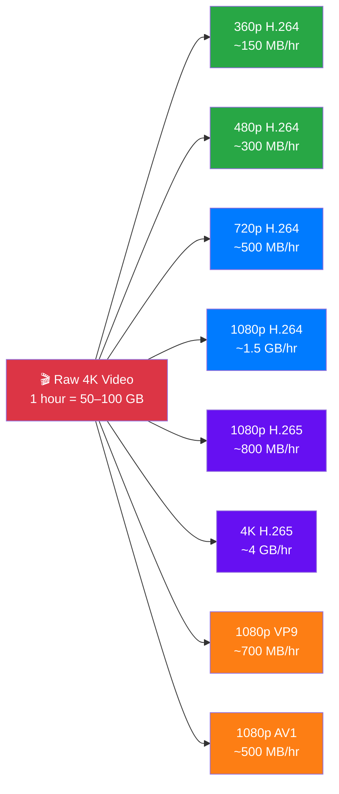

**The core challenge: 1 input becomes 8+ outputs, and must reach 2 billion users on wildly different devices.**

| Device | Typical Connection | Target Resolution | Codec |
|--------|-------------------|-------------------|-------|
| 4K Smart TV | 50+ Mbps | 4K | H.265 or AV1 |
| Laptop on WiFi | 20–50 Mbps | 1080p | H.264 or VP9 |
| iPhone on LTE | 5–15 Mbps | 720p | H.264 |
| Android on 3G | 1–3 Mbps | 480p | H.264 |
| Feature phone on 2G | < 1 Mbps | 360p | H.264 Baseline |

**You cannot serve one file to all devices.** A 4K AV1 file:
- Too large for 3G connections (would buffer constantly)
- Unsupported codec on old devices
- Wastes bandwidth for standard TVs that can't display 4K

**YouTube serves 500 hours of video uploaded every minute.** That means:
- 500 hrs × 60 min × 8 variants × ~500 MB average = **~144 TB of new encoded video per hour**
- Every minute of delay in the transcoding pipeline means creators wait longer
- Processing must scale horizontally — no single server can keep up

---

## Requirements with Real Numbers

### Functional Requirements

**YouTube:**
- Upload video (any length, any format)
- Watch video from any device at appropriate quality
- Search for videos by title, description, tags, transcript
- View count, likes, comments
- Subscriptions and feed

**Netflix:**
- Browse catalog (15,000+ titles)
- Watch video with smooth adaptive quality
- Continue watching across devices
- Download for offline viewing (premium feature)
- Parental controls, profiles per account

### Non-Functional Requirements with Numbers

| Requirement | YouTube Target | Netflix Target |
|-------------|---------------|----------------|
| **Playback start latency** | < 2 seconds | < 2 seconds |
| **Buffering ratio** | < 0.1% of watch time | < 0.05% of watch time |
| **Availability** | 99.99% (52 min/year downtime) | 99.99% |
| **Upload → available** | < 5 min for 360p, < 1 hr for all | Hours (pre-encoded catalog) |
| **Concurrent viewers** | 10M+ simultaneous | 5M+ simultaneous |
| **Live stream delay** | < 30 seconds | < 30 seconds (rare) |

### Scale Numbers

**YouTube (Google, 2024):**
- **2 billion** logged-in users per month
- **500 hours** of video uploaded **every minute**
- **1 billion hours** watched per day = ~11.5 million hours per second
- **37%** of all mobile internet traffic globally
- **95%** of videos served from CDN cache

**Netflix (2024):**
- **238 million** paying subscribers
- **36%** of US internet downstream traffic at peak hours
- **15,000+** titles in catalog, each in **1,000+ encoding variants**
- **3 AWS regions** as primary infrastructure (us-east-1, eu-west-1, ap-southeast-1)
- Spends **~$1 billion/year** on CDN bandwidth

---

## Capacity Estimation

### Storage Estimation (YouTube)

```
Upload rate: 500 hours/min = 30,000 hours/hour

Per 1 hour of content, storage needed:
  360p H.264:    150 MB
  480p H.264:    300 MB
  720p H.264:    500 MB
  1080p H.264:  1,500 MB
  1080p VP9:     700 MB
  1080p AV1:     500 MB
  4K H.265:    4,000 MB
  4K AV1:      2,500 MB
  ─────────────────────
  Total per hour: ~10,150 MB ≈ 10 GB

New storage per hour:
  30,000 hours × 10 GB = 300,000 GB = 300 TB/hour

New storage per day:
  300 TB × 24 = 7,200 TB = 7.2 PB/day

10-year cumulative storage:
  7.2 PB/day × 3,650 days ≈ 26 Exabytes
```

> YouTube uses Google's own distributed object storage (Colossus), not S3. At this scale, even S3 costs would be prohibitive — Google estimates storing all YouTube video would cost **$5–10B in S3 storage fees alone**.

### Bandwidth Estimation (CDN)

```
Daily watch time: 1 billion hours
Average bitrate: 2 Mbps (mix of resolutions)

Total daily data delivered:
  1B hours × 3,600 seconds × 2 Mbps / 8 = 900 PB/day

Peak bandwidth (assuming 3x peak/average):
  900 PB/day / 86,400 seconds × 3 = ~31 Tbps peak

For comparison:
  Netflix at 36% of US internet traffic with ~500 Gbps US capacity:
  Netflix peak = 0.36 × 500 Gbps × 10 (global multiplier) ≈ 1.8 Tbps
```

### Compute Estimation (Transcoding)

```
500 hours uploaded/min = 30,000 hours/hour of raw video

Transcoding ratio: ~1 hour of raw → 4 CPU-hours per variant
8 variants per video: 32 CPU-hours per hour of raw video

Total CPU-hours needed per real-time hour:
  30,000 × 32 = 960,000 CPU-hours per hour

That's 960,000 / 3,600 seconds = 267 CPU-cores continuously just to keep up

In practice (burst processing, not smooth):
  YouTube uses 10,000s of transcoding workers globally
```

---

## The Video Upload & Transcoding Pipeline — Deep Dive

### The Full Upload Sequence

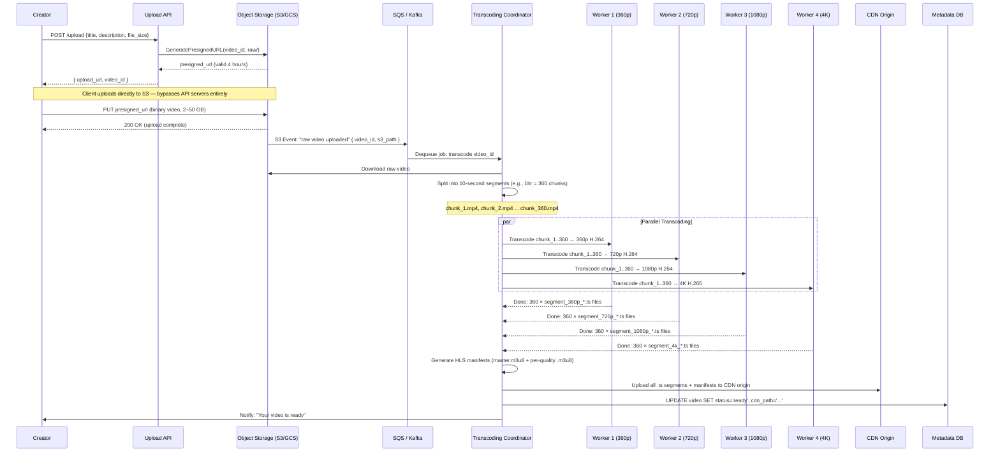

### Why Chunking is the Key Innovation

**The naive approach:** Transcode the entire 2-hour movie as one job.
- Problem: 1 worker takes 16+ hours to produce all variants
- If worker crashes at hour 15: start over from zero
- No parallelism possible

**The chunking approach:**

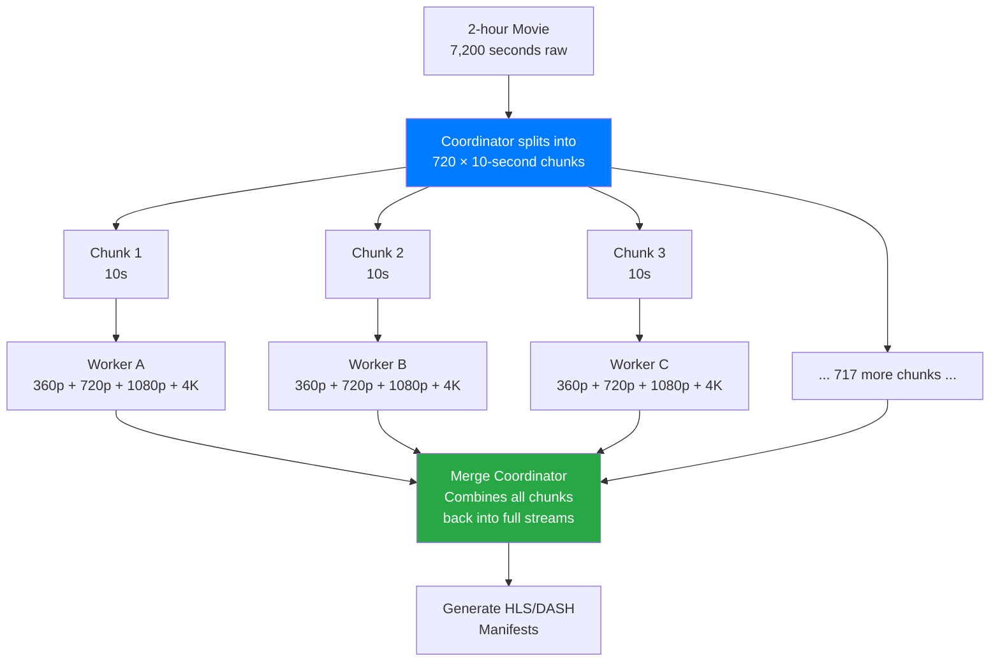

**The math:**
- 2-hour movie without chunking: 720 segments × 4 quality levels × ~10s per segment = 1 worker × 8 hours
- With 100 workers, each doing ~7 chunks: **8 hours → ~5 minutes**
- With 720 workers (1 per chunk): **theoretical minimum is the encoding time for a single 10-second segment**

**Fault tolerance bonus:** If a worker crashes mid-job, only that 10-second chunk needs to be re-queued, not the entire movie.

### Approach A: Sequential Single-Server Transcoding

```
Upload → single FFmpeg process → transcode all resolutions sequentially → done
```

| Dimension | Value |
|-----------|-------|
| Complexity | Very low |
| Time for 1-hour video | 8–16 hours |
| Fault tolerance | Zero (crash = restart) |
| Cost | Low (1 server) |
| Scale ceiling | ~10 videos/day |
| Used by | Indie projects, personal archives |

**Why it fails at YouTube scale:** 500 hours uploaded per minute = this approach can never keep up. You'd need to finish each video in under 0.002 seconds.

### Approach B: Distributed Chunked Transcoding (YouTube/Netflix)

```
Upload →
  Coordinator decomposes into N chunks →
    Worker pool encodes chunks in parallel →
      Reassembly service merges outputs →
        Manifest generator creates HLS/DASH playlists →
          CDN origin receives final files
```

**Coordinator pseudo-code:**

```
function processVideo(video_id, s3_raw_path):
  raw_video = downloadFromS3(s3_raw_path)
  duration = getVideoDuration(raw_video)

  chunks = splitIntoChunks(raw_video, chunk_size=10s)
  // For a 2-hour movie: chunks = [0:00-0:10, 0:10-0:20, ... 1:59:50-2:00:00]
  // chunk count = duration / 10 = 7200 / 10 = 720 chunks

  jobs = []
  for each chunk in chunks:
    for each resolution in [360p, 720p, 1080p, 4K]:
      job = {
        video_id: video_id,
        chunk_index: chunk.index,
        chunk_s3_path: uploadChunkToS3(chunk),
        target_resolution: resolution,
        target_codec: selectCodec(resolution)  // H.264 for ≤1080p, H.265/AV1 for 4K
      }
      jobs.push(job)

  // Push all jobs to SQS — workers auto-scale to consume them
  for job in jobs:
    SQS.enqueue("transcoding-jobs", job)

  // Monitor completion
  waitForAllJobsComplete(video_id, expected_count=720 × 4)
  runMergeAndManifestGeneration(video_id)
  updateVideoStatus(video_id, "ready")
```

**Worker pseudo-code:**

```
function transcodeWorker():
  while true:
    job = SQS.dequeue("transcoding-jobs", timeout=30s)
    if job is null: continue

    chunk = downloadFromS3(job.chunk_s3_path)

    transcoded = FFmpeg.encode(
      input: chunk,
      resolution: job.target_resolution,
      codec: job.target_codec,
      bitrate: getBitrate(job.target_resolution),
      output_format: "hls_segment"  // .ts file
    )

    outputPath = s3://segments/{job.video_id}/{job.target_resolution}/chunk_{job.chunk_index}.ts
    uploadToS3(transcoded, outputPath)

    markJobComplete(job.video_id, job.chunk_index, job.target_resolution)
```

| Dimension | Value |
|-----------|-------|
| Complexity | High |
| Time for 1-hour video (100 workers) | 5–10 minutes |
| Fault tolerance | Per-chunk retry |
| Cost | Medium (auto-scaled spot instances) |
| Scale ceiling | Virtually unlimited |
| Used by | YouTube, Netflix, TikTok, Twitch |

### Approach C: Managed Cloud Transcoding (AWS MediaConvert)

```
Upload → S3 event → Lambda triggers MediaConvert job → MediaConvert → output to S3 → done
```

| Dimension | Value |
|-----------|-------|
| Complexity | Very low |
| Time for 1-hour video | 15–30 minutes |
| Fault tolerance | Managed by AWS |
| Cost | **High at scale** ($0.0075/min of transcoded video) |
| Scale ceiling | AWS limits (soft) |
| Used by | Startups, media companies < 10K videos/day |

**Cost example:** YouTube's 500 hrs/min = 500 × 60 = 30,000 min/min of upload.
At $0.0075/min → **$225/minute = $324,000/day** just in transcoding fees.
YouTube builds its own pipeline to avoid this.

### Comparison Table: Transcoding Approaches

| Approach | Dev Time | Latency | Fault Tolerance | Cost at Scale | Best For |
|----------|----------|---------|-----------------|---------------|----------|
| Sequential single-server | 1 day | Hours | None | Minimal | POC / prototype |
| Distributed chunked | Weeks | Minutes | Per-chunk retry | Low (spot) | Production UGC |
| Managed (MediaConvert) | Hours | 15–30 min | Excellent | Very high | < 10K videos/day |

---

## Adaptive Bitrate Streaming (ABR) — The Key to Smooth Playback

**This is the single most important concept in video streaming.** Without it, any network fluctuation causes buffering. With it, the player silently degrades quality to keep playing.

### The Problem ABR Solves

```
WITHOUT ABR:
  User on WiFi watching 1080p → enters elevator → 3G only → video FREEZES
  User must wait for buffer to refill at 3G speed → terrible experience

WITH ABR:
  User on WiFi watching 1080p → enters elevator → 3G only →
  Player detects bandwidth drop →
  Downloads next segment at 480p instead of 1080p →
  Video continues playing (slightly lower quality) →
  User exits elevator → WiFi resumes →
  Player gradually upgrades back to 1080p
  User barely notices the quality change
```

### HLS (HTTP Live Streaming) — Apple's Standard

HLS is the dominant protocol on iOS, Safari, and most Smart TVs. It works by breaking video into small `.ts` (MPEG Transport Stream) segments and using plain `.m3u8` (M3U8) text files as playlists.

**File structure on CDN:**

```
video_id_abc123/
├── master.m3u8          ← Master playlist — lists all quality levels
├── 360p/
│   ├── playlist.m3u8   ← Quality-specific playlist — lists segment URLs
│   ├── seg_001.ts      ← 10-second video chunk
│   ├── seg_002.ts
│   └── seg_NNN.ts
├── 720p/
│   ├── playlist.m3u8
│   ├── seg_001.ts
│   └── ...
├── 1080p/
│   ├── playlist.m3u8
│   └── ...
└── 4k/
    ├── playlist.m3u8
    └── ...
```

**master.m3u8 contents:**

```
#EXTM3U
#EXT-X-STREAM-INF:BANDWIDTH=400000,RESOLUTION=640x360,CODECS="avc1.42e00a,mp4a.40.2"
360p/playlist.m3u8
#EXT-X-STREAM-INF:BANDWIDTH=1500000,RESOLUTION=1280x720,CODECS="avc1.4d4015,mp4a.40.2"
720p/playlist.m3u8
#EXT-X-STREAM-INF:BANDWIDTH=4000000,RESOLUTION=1920x1080,CODECS="avc1.640028,mp4a.40.2"
1080p/playlist.m3u8
#EXT-X-STREAM-INF:BANDWIDTH=15000000,RESOLUTION=3840x2160,CODECS="hev1.1.6.L150.B0,mp4a.40.2"
4k/playlist.m3u8
```

**360p/playlist.m3u8 contents:**

```
#EXTM3U
#EXT-X-TARGETDURATION:10
#EXT-X-VERSION:3
#EXT-X-MEDIA-SEQUENCE:0
#EXTINF:10.0,
seg_001.ts
#EXTINF:10.0,
seg_002.ts
#EXTINF:9.8,   ← last segment may be shorter
seg_360.ts
#EXT-X-ENDLIST
```

**The player fetches this sequence:**
1. `master.m3u8` → gets list of quality levels
2. Picks initial quality based on estimated bandwidth
3. `720p/playlist.m3u8` → gets list of segment URLs
4. Downloads and plays segments sequentially
5. After each segment, re-evaluates bandwidth and adjusts

### ABR Player Logic

```
INITIALIZATION:
  fetch master.m3u8
  measure initial bandwidth via first segment download time
  select starting quality = quality with bandwidth ≤ (measured_bandwidth × 0.8)
    // 0.8 safety margin — don't use full bandwidth

PLAYBACK LOOP (runs every 10 seconds, after each segment):
  download_time = time to download last segment
  segment_bitrate = segment_size_bytes × 8 / target_segment_duration_sec
  measured_bandwidth = segment_size_bytes × 8 / actual_download_time_sec

  buffer_level = current_buffer_seconds  // how many seconds of video are buffered ahead

  QUALITY SELECTION LOGIC:
    if buffer_level < 5s AND trending_down:
      // Panic downgrade — buffer about to empty
      next_quality = lowest_available_quality

    elif buffer_level < 10s OR measured_bandwidth < current_bitrate × 1.1:
      // Buffer is low or bandwidth barely keeping up — stay conservative
      next_quality = current_quality or one level down

    elif buffer_level > 30s AND measured_bandwidth > next_higher_bitrate × 1.2:
      // Buffer is healthy, bandwidth can support upgrade
      next_quality = current_quality or one level up
      // Upgrade conservatively — don't jump 3 levels at once

    else:
      next_quality = current_quality  // steady state

  fetch next segment at next_quality
  update buffer

BANDWIDTH ESTIMATION (more sophisticated):
  Use EWMA (Exponentially Weighted Moving Average):
  bandwidth_estimate = alpha × new_measurement + (1 - alpha) × old_estimate
  // alpha = 0.7 weights recent measurements more heavily
```

**Key insight:** The player **never** seeks backward in the segment list. Each 10-second segment is independent. The quality switch only affects future segments.

### DASH (Dynamic Adaptive Streaming over HTTP) — YouTube/Netflix

DASH is essentially the same concept as HLS but:
- Uses an **MPD** (Media Presentation Description) XML manifest instead of M3U8
- Codec-agnostic: natively supports VP9, AV1, H.265 (HLS only recently added non-H.264)
- Favored by YouTube (uses VP9/AV1 for 40% better compression vs H.264)
- Favored by Netflix (uses custom per-title encoding tuned to content)

**Compression efficiency at 1080p 60fps:**

| Codec | Avg Bitrate | Relative File Size | CPU Encoding Cost |
|-------|-------------|-------------------|-------------------|
| H.264 | 8 Mbps | 100% (baseline) | Low |
| H.265 | 4 Mbps | 50% | 4× H.264 |
| VP9 | 4.5 Mbps | 56% | 3× H.264 |
| AV1 | 3 Mbps | 37% | 10–20× H.264 |

Netflix uses AV1 for new content: **37% smaller files = 37% less CDN bandwidth cost = ~$370M/year saved** at their scale.

### ABR in Numbers

- **10 seconds** — standard HLS/DASH segment size (balance between seek time and adaptation speed)
- **3 seconds** — low-latency HLS segment size (for live sports, adds 3s latency vs 30s for 10s segments)
- **80ms** — time to probe bandwidth with a segment download (used for real-time adaptation)
- **2 seconds** — target initial buffering (player needs 2 segments before starting playback)
- **30 seconds** — typical buffer target (player tries to keep 30s ahead)

---

## CDN Architecture — Serving 231 TB/sec

A CDN (Content Delivery Network) is not optional for video streaming. It is the core infrastructure. Without a CDN, **100% of requests would hit your origin servers** — which would require 231 TB/sec of origin bandwidth, impossible to provision.

### CDN Layers

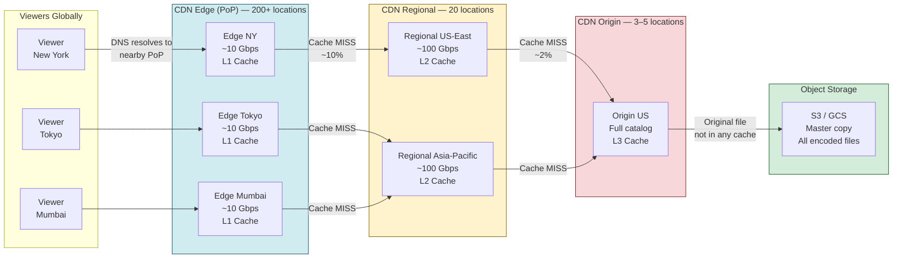

**Cache hit rates in production:**
- Edge (L1): ~90% hit rate — most popular videos always cached
- Regional (L2): ~80% hit rate of remaining 10% → 8% overall
- Origin (L3): ~80% hit rate of remaining 2% → 1.6% overall
- S3 fetch: only ~0.4% of requests touch object storage

**Why this matters:** YouTube serves 1B hours/day. If CDN didn't exist and 100% hit origin:
- Origin would need 231 TB/sec of bandwidth
- Each origin server handles ~10 Gbps → need **23,100 origin servers** active at all times
- With 90% CDN cache hit rate: need only 2,310 origin servers for the 10% miss traffic
- With 99.6% effective CDN hit rate: need only **924 origin servers**

### How CDN Routes Requests

**Step 1: DNS-based routing**
- User queries DNS for `r5---sn-4g5lznl7.googlevideo.com`
- Google's Anycast DNS returns the IP of the nearest CDN PoP
- "Nearest" is determined by BGP routing metrics + load balancing

**Step 2: Edge node selection**
- Each CDN PoP has 100s of servers
- Consistent hashing maps `video_id + segment_number + resolution` → specific server
- Ensures the same segment always goes to the same server (improves cache hit rate)

**Step 3: Cache lookup**
```
Edge receives request for: /abc123/720p/seg_047.ts

if cache.get("abc123/720p/seg_047.ts") exists:
  return cached_segment  // Cache HIT
else:
  response = fetch_from_regional_cache("abc123/720p/seg_047.ts")
  cache.set("abc123/720p/seg_047.ts", response, TTL=24h)
  return response
```

**Step 4: Cache eviction**
- LRU (Least Recently Used) — most common
- Popular videos (top 0.1% of content) = 90% of traffic → always stay cached
- Long-tail content (99.9% of videos) = 10% of traffic → frequently evicted

### YouTube Open Connect — The World's Largest Private CDN

YouTube doesn't rely on third-party CDNs like Akamai or Cloudflare. It built its own:

**Open Connect facts:**
- **100,000+** servers deployed globally (2024 estimate)
- Servers are placed **inside ISP buildings** (co-located)
- ISPs get **free bandwidth** in exchange for hosting YouTube servers
- Benefit: traffic stays within ISP network, never travels the open internet
- YouTube serves **35% of global internet traffic** through Open Connect

**Why build your own CDN instead of using Akamai?**
- Akamai charges ~$0.01/GB of delivery
- YouTube delivers ~900 PB/day = 900,000 TB/day
- At $0.01/GB: **$9 million/day = $3.3 billion/year**
- Building Open Connect cost ~$500M over 10 years but saves billions annually

---

## Video Storage Architecture

### What Goes Where

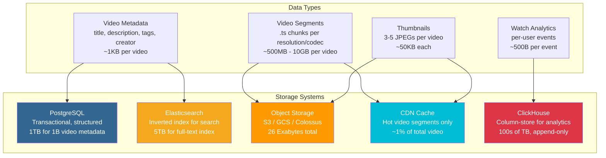

### Database Schema

**Core tables (PostgreSQL):**

```sql
-- Main video record
CREATE TABLE videos (
    video_id        UUID            PRIMARY KEY DEFAULT gen_random_uuid(),
    creator_id      BIGINT          NOT NULL REFERENCES users(user_id),
    title           TEXT            NOT NULL,
    description     TEXT,
    duration_sec    INT             NOT NULL,
    status          VARCHAR(20)     NOT NULL DEFAULT 'uploading',
    -- ENUM: uploading | processing | ready | failed | deleted

    s3_raw_path     TEXT,           -- raw upload before transcoding
    cdn_base_path   TEXT,           -- e.g., "https://cdn.youtube.com/videos/abc123/"

    view_count      BIGINT          NOT NULL DEFAULT 0,
    like_count      BIGINT          NOT NULL DEFAULT 0,
    comment_count   BIGINT          NOT NULL DEFAULT 0,

    is_public       BOOLEAN         NOT NULL DEFAULT true,
    is_age_gated    BOOLEAN         NOT NULL DEFAULT false,

    created_at      TIMESTAMPTZ     NOT NULL DEFAULT NOW(),
    published_at    TIMESTAMPTZ,    -- NULL until processing complete
    deleted_at      TIMESTAMPTZ     -- soft delete

    -- Indexes:
    -- INDEX ON creator_id (creator's video list)
    -- INDEX ON published_at DESC (chronological feed)
    -- INDEX ON (is_public, published_at DESC) (public feed)
);

-- Track which encoded variants are ready
CREATE TABLE video_variants (
    video_id        UUID            NOT NULL REFERENCES videos(video_id),
    resolution      VARCHAR(10)     NOT NULL,  -- '360p', '720p', '1080p', '4k'
    codec           VARCHAR(10)     NOT NULL,  -- 'h264', 'h265', 'vp9', 'av1'
    bitrate_kbps    INT             NOT NULL,
    s3_manifest_url TEXT            NOT NULL,  -- .m3u8 or .mpd path
    file_size_bytes BIGINT          NOT NULL,
    is_ready        BOOLEAN         NOT NULL DEFAULT false,
    created_at      TIMESTAMPTZ     NOT NULL DEFAULT NOW(),

    PRIMARY KEY (video_id, resolution, codec)
);

-- Individual segment records (optional — usually just inferred from manifest)
CREATE TABLE video_segments (
    video_id        UUID            NOT NULL,
    resolution      VARCHAR(10)     NOT NULL,
    codec           VARCHAR(10)     NOT NULL,
    segment_number  INT             NOT NULL,
    s3_url          TEXT            NOT NULL,
    duration_ms     INT             NOT NULL,  -- actual duration (last segment may differ)
    file_size_bytes INT             NOT NULL,

    PRIMARY KEY (video_id, resolution, codec, segment_number)
);

-- Creator/user table
CREATE TABLE users (
    user_id         BIGSERIAL       PRIMARY KEY,
    handle          VARCHAR(50)     UNIQUE NOT NULL,
    display_name    TEXT,
    subscriber_count BIGINT         NOT NULL DEFAULT 0,
    created_at      TIMESTAMPTZ     NOT NULL DEFAULT NOW()
);
```

**Why object storage (S3/GCS) and not a database for video files?**

| Factor | Database (PostgreSQL) | Object Storage (S3) |
|--------|----------------------|---------------------|
| Storage cost per TB | $200–$500 | $20–$25 |
| Streaming support | No (BLOB) | Yes (byte-range requests) |
| CDN integration | None | Native |
| Max object size | ~1 GB (BYTEA) | 5 TB |
| Horizontal scaling | Complex sharding | Infinite (pay per byte) |
| Latency | Low (ms) | Medium (50–200ms) |

**The winner is obvious:** Video = object storage. Metadata = relational database.

---

## The View Count Problem

YouTube publicly shows view counts updated in near-real time. At 1B views/day = **11,574 view events per second** average, with viral videos seeing **100,000 view/second** spikes.

**Why you can't just do `UPDATE videos SET view_count = view_count + 1`:**

```
Problem: 100,000 concurrent viewers all updating the same row
→ Row-level lock contention
→ Transaction serialization
→ 100,000 writes/sec on one row = database thrashing
→ Write throughput drops to ~1,000/sec (PostgreSQL single-row update limit)
```

### Solution 1: Redis INCR + Batch Flush (YouTube's approach)

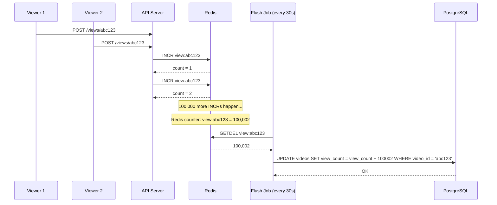

**Redis INCR performance:**
- Redis handles **1,000,000 INCR operations/second** on a single instance
- Far exceeds the 100,000 view/sec of even the most viral content
- Batch flush every 30 seconds: reduces DB writes from 100K/sec → 1 write per 30 seconds
- Trade-off: count may be slightly stale (up to 30 seconds behind)

**Note:** YouTube famously freezes view counts at 301 views while it verifies view authenticity (bots vs real users). Only after verification does the count catch up.

### Solution 2: Sharded Counters (for extreme scale)

```
Instead of 1 counter: "view:abc123"
Use 100 sharded counters: "view:abc123:shard:0" through "view:abc123:shard:99"

On view event:
  shard_id = random(0, 99)
  INCR view:abc123:shard:{shard_id}

On read:
  total = SUM(GET view:abc123:shard:0 ... GET view:abc123:shard:99)
```

**Benefit:** 100 shards = 100M INCR/sec capacity (overkill for most cases but used for extreme virality).

### Solution 3: Kafka → Flink → ClickHouse (Netflix/Analytics approach)

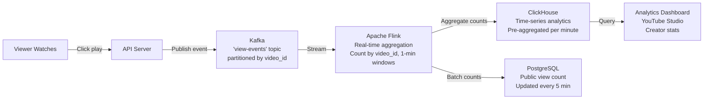

**This approach gives:**
- Real-time analytics for creators (views per minute, watch duration, geography)
- Decoupled from video serving — analytics failure doesn't affect playback
- Historical analysis: "views over last 30 days" from ClickHouse in milliseconds
- Used by Netflix for their content performance dashboard

---

## Search — Finding Videos

YouTube indexes **800 million+ videos**. Search must return personalized, relevant results in **< 200ms**.

### The Indexing Pipeline

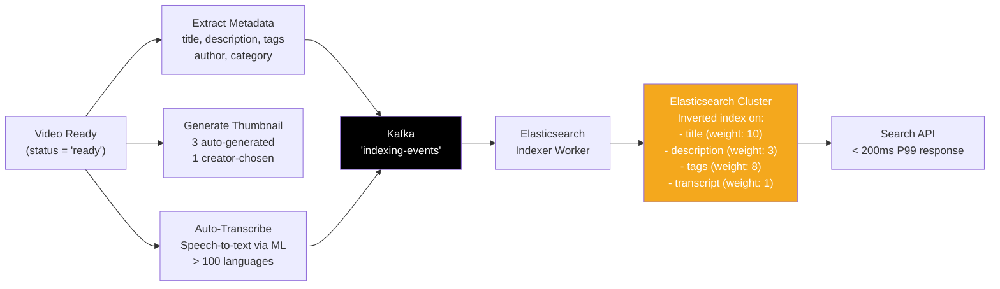

**Why Elasticsearch for video search:**
- Inverted index: "dogs" → [video_123, video_456, video_789] in O(1)
- Full-text relevance scoring (BM25 algorithm)
- Typo tolerance (fuzzy matching)
- Faceted filtering (by upload date, length, resolution)

**Personalized ranking (YouTube's secret sauce):**

Standard search returns results ranked by relevance score. YouTube's ranking is personalized:

```
Ranking score = relevance_score × personalization_multiplier

personalization_multiplier based on:
  - User's watch history (watched 50 cooking videos → cooking content ranked higher)
  - User's engagement patterns (tends to watch full videos → prioritize high completion rate)
  - User's device/time context (mobile at 8pm → shorter videos ranked up)
  - Collaborative filtering (similar users who searched "python tutorial" also watched X)
```

This is why the same search query returns different results for different users — a junior developer and a senior developer search "async python" and get completely different videos.

**Scale:**
- Elasticsearch cluster: 100s of nodes
- Index size: 800M videos × avg 5KB metadata + transcripts = ~4 TB raw data → ~20 TB with Elasticsearch overhead
- Indexing lag: new video appears in search within **60–120 seconds** of transcoding completing

---

## Problems at Scale

### Problem 1: Upload Spike — Viral Creator Announces Drop

**Scenario:** A creator with 10M subscribers announces at 2pm: "Dropping something at 3pm." 500,000 fans try to upload reactions and commentary in the 30 minutes after.

**Impact without mitigation:**
- Upload service: 500,000 concurrent HTTP connections → server memory exhaustion
- Load balancer: connection pool saturates → new connections timeout
- Network: upload service becomes bottleneck even if S3 has capacity

**Solution: Pre-signed S3 URLs — bypass the upload service entirely**

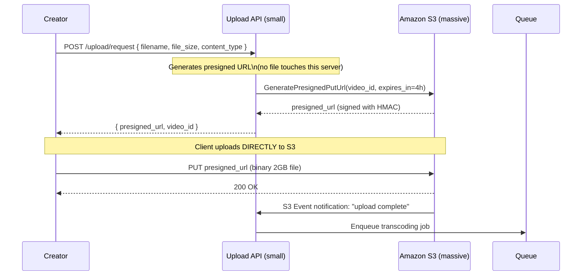

**Result:**
- Upload API only handles tiny JSON requests (< 1KB) → handles 500K req/sec trivially
- S3 handles the actual binary uploads → S3 scales to millions of concurrent uploads
- Transcoding queue absorbs spikes asynchronously

### Problem 2: Transcoding Queue Backup — New Uploads Delayed

**Scenario:** A major event (World Cup, Award Show) ends → 50,000 creators simultaneously upload highlight videos → transcoding queue depth goes from 1,000 jobs to 500,000 jobs in 5 minutes.

**Impact:**
- Normal video processing time: 5–10 minutes
- During queue backup: creators wait **hours** for their video to go live
- Creator frustration, social media complaints, reputation damage

**Solutions:**

```
1. PRIORITY QUEUE — not all uploads are equal:
   - Partner/verified creators (top 0.1%): HIGH priority → front of queue
   - Regular creators: NORMAL priority
   - New accounts (< 10 videos): LOW priority → back of queue
   - Rationale: partner creators drive most traffic, their delays are most costly

2. AUTO-SCALING WORKERS — elastic compute:
   - CloudWatch alarm: queue_depth > 10,000 → scale up workers to 10,000
   - Use EC2 Spot Instances (60–70% cheaper than on-demand)
   - Spot interruption risk: if worker dies mid-job, only that chunk is re-queued
   - Scale down when queue_depth < 100 for 10 minutes

3. FIRST-VARIANT PRIORITY — serve 360p first:
   - Transcode 360p variant first (fastest, lowest quality)
   - Mark video as "viewable" once 360p is ready
   - Continue transcoding higher qualities in background
   - Creator can share link within minutes, even if 4K takes an hour
```

### Problem 3: CDN Cache Miss Storm — Viral Video Goes Cold

**Scenario:** A 30-second clip becomes viral via Twitter. Within 60 seconds, 2M people click the link. The video was uploaded 6 months ago and has been evicted from all CDN edge caches (LRU eviction).

**Impact:**
- Edge cache: MISS → all 2M requests escalate to regional
- Regional cache: MISS (also evicted) → all 2M requests escalate to CDN origin
- CDN origin: suddenly receives 2M requests it normally handles in a week
- Origin S3: 2M concurrent GETs to same objects → S3 rate limiting, timeouts
- Viewers: see buffering, slow start, eventually errors

**Solutions:**

```
1. ORIGIN SHIELD — one L3 cache between regional and S3:
   Without: Edge miss → Regional miss → S3 (100,000 concurrent S3 GETs)
   With:    Edge miss → Regional miss → Origin Shield (only 1 S3 GET, 99,999 cache hits)

   Origin Shield collapses all simultaneous misses for the same object into
   one upstream request — called "request coalescing" or "thundering herd protection"

2. REQUEST COALESCING at edge:
   If 1,000 requests arrive for the same uncached segment simultaneously:
   - Edge holds all 1,000 requests
   - Makes exactly 1 upstream fetch
   - Returns the response to all 1,000 simultaneously
   - Implemented in Nginx, Varnish, and all major CDN software

3. CACHE WARMING for predictable virality:
   - YouTube's trending detection: "this video has 100K views in 5 minutes"
   - Proactively push popular segments to all CDN edges before they're needed
   - Similar to pre-caching a video right after upload completes
```

### Problem 4: Hot Video — Super Bowl Simultaneous Start

**Scenario:** Super Bowl halftime show ends → 50M viewers simultaneously hit play on the same 5-minute clip. All want the first segment (`seg_001.ts` at 1080p) at the same time.

**Impact:**
- Even cached segments have limits: one CDN edge PoP handles ~100 Gbps
- 50M viewers × 2 Mbps = 100 Tbps → needs 1,000 edge PoPs serving simultaneously
- Most geographic areas have only 5–10 nearby PoPs → overload

**Solutions:**

```
1. PRE-WARM CDN before event:
   - At 20:00 (kickoff), YouTube knows the game will end around 22:00
   - Auto-warm all CDN PoPs with halftime show segments 10 minutes before halftime
   - By the time users click play, all segments already cached everywhere

2. MULTI-CDN FAILOVER:
   - YouTube uses Open Connect + Akamai + Fastly simultaneously
   - DNS-based traffic splitting: 50% Open Connect, 30% Akamai, 20% Fastly
   - If one CDN is overloaded (RTT > 500ms), DNS switches users to next CDN
   - No single CDN failure can take down playback

3. ADAPTIVE LOAD SHEDDING:
   - Monitor CDN PoP utilization in real-time
   - If PoP > 80% capacity: redirect new viewers to next-closest PoP
   - Slight increase in latency (10–50ms) but prevents cache thrash
```

### Problem 5: DRM — Netflix's Encryption Challenge

**Netflix's requirement:** Studio contracts require that no device can capture or redistribute Netflix content. Every video frame must be encrypted end-to-end.

**The challenge:**
- DRM must be enforced at the device hardware level (not just software)
- Different platforms use different DRM systems
- Must decrypt in real-time during playback (no buffering entire encrypted file)

**How Netflix solves this:**

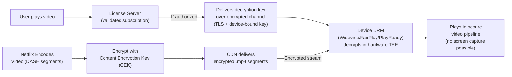

**DRM systems by platform:**

| Platform | DRM System | Notes |
|----------|-----------|-------|
| Chrome, Android | Widevine (Google) | Most common globally |
| Safari, iOS, macOS | FairPlay (Apple) | Required for App Store |
| Edge, Xbox | PlayReady (Microsoft) | Handles 4K HDR |
| Firefox | Widevine (via CDM) | Limited to 1080p |

Netflix must encrypt content for all 3 and deliver the correct key to the correct device. This is why Netflix streaming requires specific browser versions — older browsers lack Widevine support.

---

## Live Streaming vs VOD — Different Architectures

**The fundamental difference:** VOD can trade latency for quality. Live cannot.

```mermaid
graph TD
    subgraph VOD["📼 VOD (Video On Demand)"]
        V1["Upload raw video\n(can be days old)"] --> V2["Transcode offline\n(hours to complete)"]
        V2 --> V3["Store all variants\n(permanent storage)"]
        V3 --> V4["CDN cache warm\n(days to build up)"]
        V4 --> V5["Viewer plays\n(from cache, zero origin load)"]
    end

    subgraph LIVE["📡 LIVE Streaming"]
        L1["Broadcaster\n(OBS, phone, encoder)"] --> L2["RTMP Ingest Server\n(receives raw stream)"]
        L2 --> L3["Real-time Segmenter\n(creates 2-10 second .ts chunks)"]
        L3 --> L4["Real-time Transcoder\n(encode on-the-fly: GPU required)"]
        L4 --> L5["CDN Origin\n(new segments every few seconds)"]
        L5 --> L6["CDN Edge\n(CANNOT cache: segments expire instantly)"]
        L6 --> L7["Viewer\n(3–30 seconds behind live)"]
    end

    style VOD fill:#d4edda,stroke:#155724
    style LIVE fill:#f8d7da,stroke:#721c24
```

### Live Streaming Architecture Details

**RTMP Ingest:**
- Broadcaster's software (OBS, Twitch app) sends raw H.264 video via RTMP protocol to YouTube/Twitch ingest servers
- YouTube operates **100+ RTMP ingest nodes** globally to minimize upload latency
- Broadcaster connects to nearest ingest node (like CDN PoP, but for uploads)

**Real-time transcoding requirements:**
- Must keep up with real-time: 1 second of video must transcode in < 1 second
- Uses GPU acceleration (NVENC on NVIDIA GPUs): 10–50x faster than CPU
- Only encodes 2–3 quality variants (vs 8 for VOD) — tradeoff: less flexibility

**Latency modes:**

| Mode | Segment Size | End-to-End Delay | Use Case |
|------|-------------|-----------------|----------|
| Normal | 10 seconds | 30–60 seconds | Concerts, let's plays |
| Low Latency | 2 seconds | 5–15 seconds | Sports, news |
| Ultra Low Latency (WebRTC) | < 0.5 seconds | 1–3 seconds | Auctions, interactive |

**The CDN problem for live:**
- VOD: CDN caches a segment for 24+ hours (thousands of viewers hit cache)
- Live: segment is valid for 2–10 seconds, then the next segment appears
- Every segment is essentially "new content" — CDN cache provides **much lower value**
- Live streams require more origin bandwidth (higher cache miss rate)
- Solution: CDN "live segment push" — origin proactively sends segments to edges without waiting for miss

---

## YouTube vs Netflix — Architectural Differences

| Dimension | YouTube | Netflix |
|-----------|---------|---------|
| **Content type** | UGC — anyone can upload | Curated — licensed + original only |
| **Content volume** | 800M+ videos, growing | ~15,000 titles, stable |
| **Encoding approach** | Standard profiles per resolution | Per-title encoding (tuned to content) |
| **Encoding timing** | After upload (async) | Months before release |
| **CDN** | Open Connect (private, ~100K servers) | Open Connect + Akamai + Fastly |
| **Discovery** | Search + algorithm | Recommendation-first (ML thumbnails) |
| **DRM** | Minimal (Copyright ID for revenue) | Full DRM (Widevine/FairPlay/PlayReady) |
| **Live streaming** | Yes (YouTube Live) | Very limited |
| **Comments/Community** | Core feature | Limited |
| **Infrastructure** | Google Cloud + private | AWS (Netflix was AWS reference customer) |
| **Transcoding cost** | ~$0 (build own infra) | ~$0 (own ECS-based pipeline) |

### Netflix's Per-Title Encoding — A Technical Innovation

Netflix doesn't use fixed bitrates per resolution. Instead, they analyze each title's content:

```
"Dark Knight" (lots of action, complex scenes):
  720p → needs 3.5 Mbps to look good (complex motion)

"The Crown" (slow drama, simple backgrounds):
  720p → only 1.5 Mbps needed (less motion, easier to compress)

Standard approach: both get 2 Mbps at 720p → Dark Knight looks bad, Crown wastes bandwidth
Netflix per-title: Dark Knight gets 3.5 Mbps, Crown gets 1.5 Mbps → both look perfect at correct bitrate
```

Result: **40% bandwidth savings** on average across the catalog.
At Netflix's scale (500 PB/month): saves ~200 PB/month in CDN bandwidth = ~$2M/month in costs.

### YouTube's Codec Strategy

YouTube aggressively pushes VP9 and AV1:
- **VP9 adoption**: 90%+ of YouTube traffic on supported devices (Chrome, Android)
- **AV1 adoption**: growing, currently ~15% of traffic
- Average bandwidth savings vs H.264: 30–50%
- Result: YouTube saves ~**$500M/year in CDN bandwidth** through codec optimization

---

## Interview Questions Mapped

| Interview Question | Key Answer Points |
|-------------------|------------------|
| **"How do you store and serve videos at scale?"** | S3/GCS for segments, not databases. CDN in front. HLS/DASH manifests. CDN serves 90%+ of traffic. |
| **"How does adaptive bitrate streaming work?"** | Segment video into 10s chunks. Master playlist lists quality levels. Player measures bandwidth per segment. Switches quality each segment based on buffer + bandwidth. |
| **"How do you transcode 500 hours/min of uploads?"** | Chunk into 10-second segments. Parallel workers per chunk per resolution. SQS queue. Auto-scaling spot instances. 360p ready in 2 min, 4K in 1 hour. |
| **"How would you design YouTube's recommendation system?"** | User events to Kafka. Feature engineering (watch%, clicks, shares). Embedding model (two-tower: user embedding + video embedding). Candidate generation (nearest neighbor). Ranking model. A/B test results. |
| **"How do you handle a video going viral instantly?"** | CDN origin shield (request coalescing). Pre-warm popular content. Multi-CDN failover. Redis for view count with batch flush. |
| **"How do you scale the view count?"** | Redis INCR (1M ops/sec). Batch flush to DB every 30s. Sharded counters for extreme virality. Kafka → Flink for real-time analytics. |
| **"How does Netflix implement DRM?"** | DASH encryption with CEK. License server validates subscription, returns decryption key. Device DRM (Widevine/FairPlay) decrypts in hardware TEE. |
| **"What's the difference between HLS and DASH?"** | HLS uses .m3u8 playlists + .ts segments, Apple standard, wide device support. DASH uses MPD XML + fragmented MP4, codec-agnostic, supports VP9/AV1, YouTube/Netflix standard. |

---

## Key Takeaways

- **500 hours uploaded per minute** requires chunked parallel transcoding: split each video into 10-second segments, encode all chunks simultaneously across 100s of workers, achieving 100× speedup over sequential encoding
- **Adaptive bitrate (HLS/DASH) switches quality every 10 seconds** — the player monitors bandwidth after each segment download and silently upgrades/downgrades quality; users on 3G get 360p, users on 4K TVs get 4K, same video file, same manifest
- **CDN absorbs 90%+ of video traffic** — without CDN, YouTube would need 23,000+ origin servers running 24/7; with 99.6% effective CDN hit rate, only ~900 origin servers handle all cache misses globally
- **Redis INCR + 30-second batch flush** handles 100,000 view events/second on viral content without database contention; full analytics (watch time, geography, completion rate) go through Kafka → Flink → ClickHouse
- **YouTube Open Connect operates 100,000+ servers inside ISP buildings worldwide** — serving 35% of all global internet traffic and saving an estimated $3+ billion/year compared to third-party CDN pricing

---

## Related Concepts

- [Hot Partition Problem](/system-design-problems/01-data-processing/url-shortener) — View count sharding uses the same technique as avoiding hot partitions in databases
- [CDN & Caching Strategies](/02-caching) — Deep dive on CDN cache eviction, TTL tuning, and cache invalidation
- [Message Queues (Kafka)](/04-messaging) — How the view count analytics pipeline and transcoding job queue work
- [Distributed Systems at Scale](/05-distributed-systems) — CAP theorem and consistency trade-offs relevant to view count accuracy
- [Object Storage Architecture](/06-scalability) — Why S3/GCS beats file systems for unstructured binary data at petabyte scale

---

## References

- 📖 [Netflix Tech Blog — Adaptive Streaming](https://netflixtechblog.com/html5-and-video-streaming-at-netflix-e2b1ac0fba43) — Netflix's journey from Silverlight to HTML5 adaptive streaming
- 📖 [YouTube Architecture – High Scalability](http://highscalability.com/youtube-architecture) — Original deep dive into YouTube's distributed video architecture
- 📖 [How Netflix Works: The Simplified Complex Stuff](https://medium.com/refraction-tech-everything/how-netflix-works-the-hugely-simplified-complex-stuff-that-happens-every-time-you-hit-play-3a40c9be254b) — End-to-end walkthrough of a Netflix play request
- 📺 [Netflix: What Happens When You Press Play](https://www.youtube.com/watch?v=x9Awp5cKZsQ) — Engineering talk on Netflix's infrastructure
- 📖 [Netflix Per-Title Encode Optimization](https://netflixtechblog.com/per-title-encode-optimization-7e99442b62a2) — How per-title encoding saves 40% bandwidth
- 📖 [YouTube Open Connect — Google Engineering Blog](https://peering.google.com/#/infrastructure) — Overview of YouTube's private CDN infrastructure
- 📖 [Understanding HLS (Apple Developer Docs)](https://developer.apple.com/documentation/http_live_streaming) — Official HLS specification and implementation guide
- 📚 [MPEG-DASH Standard](https://www.iso.org/standard/65274.html) — The DASH specification used by YouTube and Netflix
