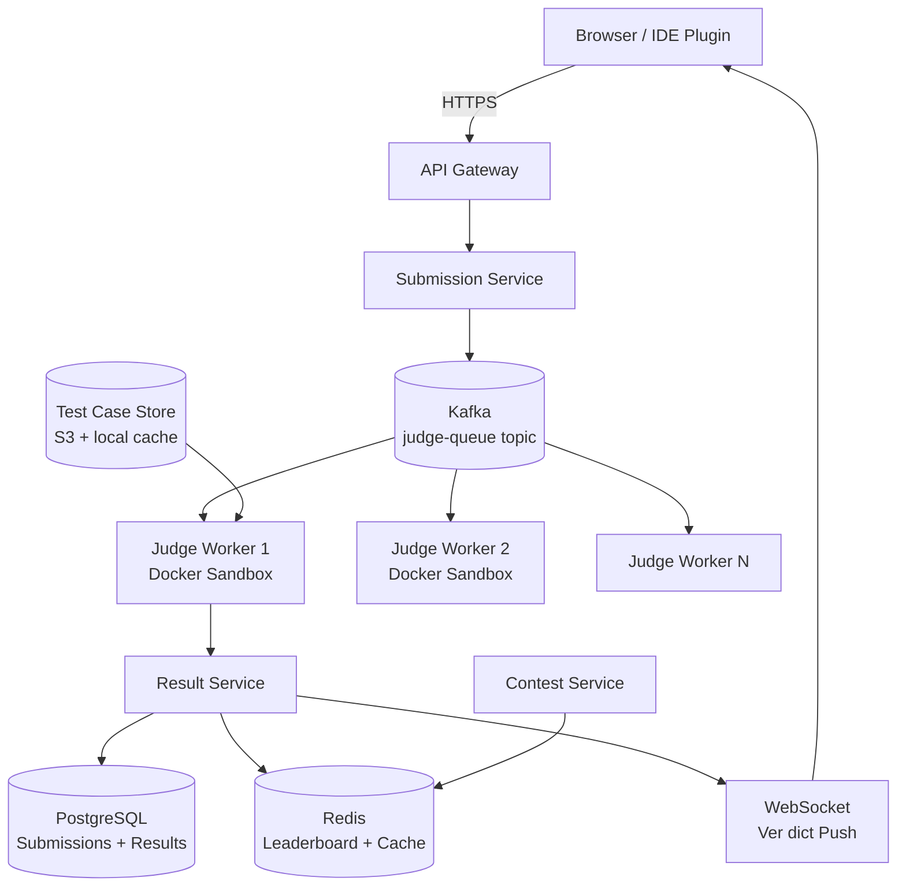
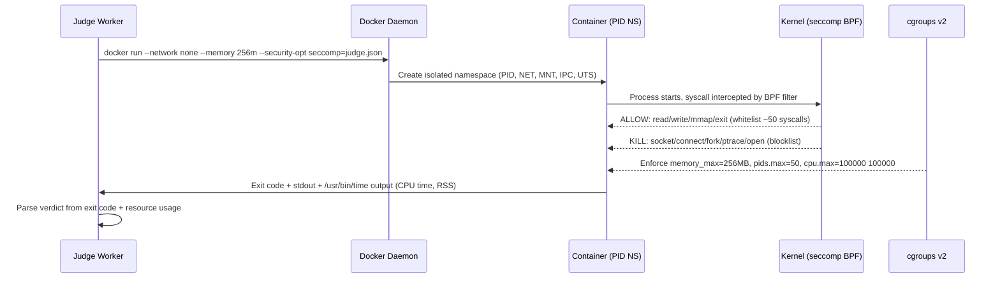
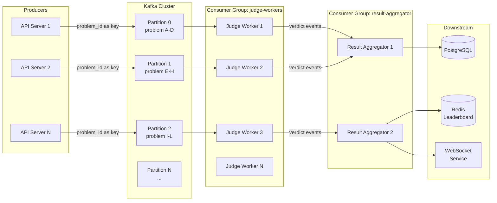

# Design a Competitive Programming Platform

**Difficulty**: 🟡 Intermediate
**Reading Time**: ~25 minutes
**The Core Problem**: How do you safely execute 100k untrusted code submissions per day in isolated sandboxes, measure time/memory accurately, and update contest leaderboards in real time?

---

## Table of Contents

1. [Requirements](#1-requirements)
2. [Capacity Estimation](#2-capacity-estimation)
3. [High-Level Architecture](#3-high-level-architecture)
4. [Code Sandbox Design](#4-code-sandbox-design)
5. [Judge Queue](#5-judge-queue)
6. [Test Case Evaluation](#6-test-case-evaluation)
7. [Contest Mode](#7-contest-mode)
8. [Leaderboard](#8-leaderboard)
9. [Key Design Decisions](#9-key-design-decisions)
10. [Interview Questions](#10-interview-questions)
11. [Key Takeaways](#11-key-takeaways)
12. [References](#12-references)

---

## 1. Requirements

### Functional
- Submit code in multiple languages (C++, Java, Python, Go, Rust)
- Run submissions against hidden test cases
- Report verdict: Accepted / Wrong Answer / TLE / MLE / Runtime Error / Compilation Error
- Contest mode: synchronized start/end, real-time leaderboard
- Practice mode: immediate feedback, no time pressure
- Problem statements with examples and constraints

### Non-Functional
- **Scale**: 100k submissions/day; peaks during contests: 10k submissions in first 5 minutes
- **Isolation**: Untrusted code must not access network, filesystem, or other processes
- **Accuracy**: Time limit accurate to ±5ms; memory limit accurate to ±1MB
- **Latency**: Verdict delivered within 10s for typical cases (< 2s execution + queue time)

---

## 2. Capacity Estimation

| Metric | Estimate |
|--------|----------|
| Submissions/day | 100k |
| Peak submissions/min | 2k (contest start spike) |
| Avg execution time | 1–2 seconds |
| Judge workers needed | 2k req/min × 2s / 60s = **70 workers** (with buffer: 200 workers) |
| Test cases per problem | avg 20 test cases × 1KB each = 20KB/problem |
| Storage for test cases | 10k problems × 20KB = **200MB** (tiny, cache in RAM) |
| Submission code size | 100k × 10KB = **1 GB/day** |
| Judge node CPU | 1 submission = 1 CPU core for duration |

---

## 3. High-Level Architecture



---

## 4. Code Sandbox Design

Security is the top priority — submitted code must not escape the sandbox.

### Isolation Stack
```
Layer 1 — Docker Container:
  - Separate Linux namespace (PID, network, mount, IPC)
  - No network access (--network none)
  - Read-only filesystem except /tmp (tmpfs, 256MB limit)
  - No access to host filesystem

Layer 2 — seccomp (system call filter):
  - Whitelist ~50 safe syscalls (read, write, mmap, exit, etc.)
  - Block: network (socket, connect), fork bomb (limit nproc), file access (open)
  - Any blocked syscall → SIGKILL immediately

Layer 3 — cgroups (resource limits):
  - CPU: 100% of 1 core, time measured via wall clock + CPU time
  - Memory: configurable (256MB default)
  - PIDs: max 50 (prevent fork bombs)

Layer 4 — User namespace:
  - Run as non-root user (uid 65534 = nobody)
  - Cannot escalate privileges
```

### Sandbox Execution Flow
```bash
# Compile phase (separate container, 30s time limit)
docker run --rm \
  --network none \
  --memory 512m \
  --cpus 1 \
  --ulimit nproc=50 \
  --security-opt seccomp=whitelist.json \
  judge-runner:latest \
  compile submission.cpp -o /tmp/submission

# Run phase (per test case)
docker run --rm \
  --network none \
  --memory 256m \
  --cpus 1 \
  judge-runner:latest \
  /usr/bin/time -v /tmp/submission < testcase_01.in > output_01.txt 2>&1
```

### Time Measurement Accuracy
- Use `clock_gettime(CLOCK_PROCESS_CPUTIME_ID)` inside container for CPU time
- Wall clock only for detecting TLE (process might sleep; CPU time is fairer)
- For multi-threaded Java: sum CPU time of all threads

---

## 5. Judge Queue

```
Topic: judge-submissions
Partitions: 100 (parallelism = 100 concurrent judge workers)
Key: problem_id (ensures submissions for same problem go to same partition for ordering)

Submission message:
{
  "submission_id": "sub_abc123",
  "user_id": "u_456",
  "problem_id": "p_789",
  "language": "cpp17",
  "code": "base64-encoded source",
  "contest_id": "c_111",  // null for practice
  "submitted_at": "2024-03-15T10:00:00Z",
  "time_limit_ms": 2000,
  "memory_limit_mb": 256
}

Consumer groups:
  - judge-workers: 200 workers, each processes 1 submission at a time
  - result-aggregator: collects verdicts, updates DB + leaderboard
```

---

## 6. Test Case Evaluation

### Standard Judge (stdout comparison)
```
For each test case:
  1. Run submission binary with test input
  2. Capture stdout
  3. Trim trailing whitespace
  4. Compare with expected output (byte-by-byte after normalization)
  5. If match → AC (Accepted), else WA (Wrong Answer)

Verdict priority: CE > TLE > MLE > RE > WA > AC
(First failing test case determines overall verdict)
```

### Custom Checker (special judge)
For problems where multiple outputs are valid (e.g., any valid permutation):
```python
# checker.py (provided by problem setter)
def check(input_file, expected_output, user_output):
    # Example: check if user's answer is a valid permutation
    expected = set(expected_output.split())
    user = set(user_output.split())
    return expected == user  # AC if sets match
```

---

## 7. Contest Mode

```
Contest Start:
  1. T-5 minutes: warm up judge workers (containers pre-created)
  2. T+0: unlock problem statements for all participants simultaneously
  3. Problem set cached in CDN (5000 users fetch simultaneously → no DB hit)

Submission During Contest:
  - Same judge pipeline; contest_id tagged on submission
  - Leaderboard updated after each AC verdict

Penalty System (ICPC-style):
  - Score = problems solved + penalty time
  - Penalty: each WA before AC adds 20-minute penalty
  - Leaderboard sorted: problems solved DESC, penalty time ASC

Contest End:
  - After end time: submissions accepted but not counted for leaderboard
  - Final standings frozen (common: freeze 1h before end, reveal after)
```

---

## 8. Leaderboard

### Real-time Leaderboard with Redis Sorted Set
```
key: leaderboard:{contest_id}
type: Sorted Set
score: -1 * (solved_count * 1e9 - penalty_minutes)  // negative for DESC sort
member: user_id

On AC verdict:
  1. Compute new score for user
  2. ZADD leaderboard:{contest_id} {new_score} {user_id}
  3. Score update is atomic O(log N)

Leaderboard query:
  ZRANGE leaderboard:{contest_id} 0 99 WITHSCORES  → top 100

User rank:
  ZRANK leaderboard:{contest_id} {user_id}  → O(log N)
```

---

## 9. Key Design Decisions

| Decision | Option A | Option B | Choice & Reason |
|----------|----------|----------|-----------------|
| Isolation | Docker + seccomp + cgroups | VM (gVisor/Firecracker) | **Docker + seccomp** — 50ms startup vs 1–2s for VMs; seccomp provides sufficient isolation |
| Output comparison | stdout string compare | Custom checker | **Both** — default is string compare; problem setters can provide custom checker |
| Judge queue | Kafka | SQS | **Kafka** — ordered per problem; replayable; partitioning controls parallelism |
| Leaderboard storage | Redis sorted set | PostgreSQL | **Redis** — O(log N) updates and rank queries; leaderboard is write-heavy during contest |
| Online vs offline judge | Online (real-time verdict) | Offline (batch, email results) | **Online** — competitive programming requires immediate feedback |

---

## 10. Interview Questions

| Question | Key Answer |
|----------|-----------|
| How do you prevent fork bombs? | cgroups limit PID count to 50; seccomp blocks fork after limit |
| How do you handle Python TLE fairly vs C++? | Each language has its own time limit multiplier (Python: 3× C++ limit) |
| How do you scale for 10k submissions in 5 minutes? | Pre-warm 200 judge containers; Kafka absorbs burst; auto-scale worker pool |
| What if a judge worker crashes mid-execution? | Kafka consumer group auto-rebalances; uncommitted offset retried by another worker |
| How do you prevent test case leakage? | Test cases stored in S3, never returned to client; judge containers have no network access |

---

## 11. Key Takeaways

- **Docker + seccomp + cgroups** provides sufficient isolation with 50ms container startup — VM-based sandboxes (Firecracker) add latency without proportional security gain at this scale
- **Kafka judge queue** absorbs contest-start spikes — 200 partitions allow 200 concurrent judgements
- **Redis sorted sets** for real-time leaderboard: O(log N) insert and rank query, handles 10k contest participants
- **Custom checkers** extend the judge to problems with multiple valid outputs — critical for geometry and optimization problems
- **Pre-warm containers** before contest start to cut 1st-submission latency from 5s to < 1s

---

## Component Deep Dive 1: Code Sandbox and Isolation Engine

The sandbox is the most security-critical and performance-critical component in the entire system. Every other component can tolerate occasional bugs — the sandbox cannot. A single escape by malicious code could expose other participants' submissions, host credentials, or give the attacker arbitrary code execution on the judge infrastructure.

### Why Naive Approaches Fail

The simplest approach — run code directly on the host — fails immediately. A malicious user submits `while(true) fork();` and crashes the server. A more sophisticated attacker reads `/proc/self/environ` to grab environment variables, or uses `ptrace` to inspect other processes. Even the "just run it in a subprocess" approach fails because the subprocess inherits file descriptors, can open `/dev/mem`, and can send signals to the parent process.

The second naive approach — spawn a full VM per submission — is too slow. A VM cold-boot (QEMU/KVM) takes 1–3 seconds. At 2k submissions/minute, you'd need 2k VMs booting per minute, which is operationally impossible. Codeforces originally ran code in VMs and had to migrate to containers when contest loads exceeded 500 concurrent submissions.

### Layered Defense Architecture

The production approach layers four distinct isolation mechanisms so that breaking one layer still doesn't break the system:



### Trade-off Table: Sandbox Implementation Approaches

| Approach | Container Start Time | Security Level | Memory Overhead | Operational Complexity |
|----------|---------------------|----------------|-----------------|----------------------|
| Docker + seccomp + cgroups | 50–80ms | High (4 layers) | ~20MB per container | Medium (Docker daemon) |
| gVisor (runsc) | 150–300ms | Very High (kernel intercepted) | ~40MB per container | High (kernel compatibility) |
| Firecracker MicroVM | 500–800ms | Highest (real VM boundary) | ~100MB per microVM | Very High (VMM management) |
| nsjail (bare Linux) | 10–20ms | High (direct kernel features) | ~5MB per jail | High (manual configuration) |

**The winner for competitive programming is Docker + seccomp + cgroups** because the 50ms startup fits comfortably in the 10-second verdict budget, and the security surface is well-understood. gVisor's kernel compatibility issues cause mysterious failures with certain syscall patterns that competitive programmers use legitimately (e.g., `mremap`, `memfd_create`).

### Container Reuse vs Fresh Spawn

One optimization Codeforces uses: maintain a warm pool of pre-created containers. When a submission arrives, assign it to a warm container rather than spawning fresh. After execution, discard the container and create a replacement asynchronously. This cuts 50ms startup from the critical path — important for the first 100 submissions of a contest when users click "Submit" simultaneously.

```
Warm Pool Manager:
  - Maintain pool_size = worker_count * 2 pre-created containers
  - When container assigned: remove from pool, schedule replacement creation
  - Pool replenishment runs async, not on critical path
  - Pool shrinks during low traffic (auto-scaling), grows 5 min before contest start
```

---

## Component Deep Dive 2: Judge Queue and Submission Pipeline

The judge queue is the nervous system of the platform. It decouples submission ingestion (bursty, user-facing) from judge execution (steady-state, compute-bound). Without the queue, a contest-start spike of 2,000 submissions/minute would overwhelm the judge workers and cause timeouts.

### Internal Kafka Topology



### Scale Behavior at 10x Load

At baseline (100k submissions/day), the queue depth stays near zero — judge workers consume faster than submissions arrive. At 10x (1M submissions/day, which equals ~11.5 submissions/second average, with contest peaks at 20k submissions in 5 minutes = 4,000/minute), the queue becomes the shock absorber.

The key insight: **Kafka lag is fine as long as it's bounded and draining**. During the first 5 minutes of a major contest, queue depth might reach 5,000–8,000 messages. Workers drain at 200 submissions/minute (200 workers × 1 submission/worker). The queue peaks at 8,000 and drains in 40 minutes — acceptable for a 2-hour contest.

At 100x (true global scale, Codeforces-level with 30k concurrent contestants), the bottleneck shifts from queue throughput to judge worker count. You need ~600 workers, and the challenge becomes node procurement — you need 600 CPU-dedicated VMs available on demand.

### Dead Letter Queue and Retry Logic

```
Retry Policy:
  - Attempt 1: immediate (judge worker crashes during compilation)
  - Attempt 2: 30s delay (transient resource exhaustion)
  - Attempt 3: 5min delay (infrastructure issue)
  - After 3 attempts: move to DLQ (dead-letter queue)

DLQ processing:
  - Alert on-call engineer
  - Manual inspection of submission
  - Option: re-queue to main topic after investigation
  - Verdict returned to user: "System Error — please resubmit"
```

---

## Component Deep Dive 3: Real-Time Leaderboard Storage Layer

The leaderboard is deceptively simple to describe ("sorted by score") but operationally complex at scale. During a popular contest with 5,000 participants, every Accepted verdict triggers a leaderboard update. With 5 problems and an average of 3 submissions per problem per user, that's 75,000 leaderboard events over 2 hours — roughly 10 writes/second sustained, with spikes of 200 writes/second when an easy problem gets a wave of simultaneous accepts.

### Redis Sorted Set Internals

Redis sorted sets use a dual data structure internally: a skip list for ordered range queries and a hash table for O(1) member lookups. This means both `ZADD` (update score) and `ZRANK` (get user's rank) are O(log N) regardless of leaderboard size. For 10,000 participants, log2(10,000) ≈ 13 operations — microsecond-level latency.

The score encoding trick is critical. ICPC scoring has two sort keys: problems solved (DESC) and penalty time (ASC). Redis sorted sets sort by a single float. The standard encoding:

```
score = -(solved_count * 1_000_000) + penalty_minutes
```

A user with 3 solved and 45 penalty minutes gets score: -(3 × 1,000,000) + 45 = -2,999,955. Another user with 3 solved and 60 minutes gets -2,999,940. Since -2,999,955 < -2,999,940, the first user ranks higher (lower score = better rank in a min-heap). This encoding fits in a 64-bit float with no precision loss for realistic contest values (max ~30 solved, max ~3600 penalty minutes).

### Leaderboard Freeze Implementation

One hour before contest end, most platforms "freeze" the leaderboard — the displayed standings stop updating but judging continues. This prevents last-minute gaming and creates suspense for the reveal. Implementation:

```
contest_state = {
  "frozen": true,
  "freeze_time": "2024-03-15T14:00:00Z",
  "end_time": "2024-03-15T15:00:00Z"
}

On AC verdict after freeze_time:
  - Update Redis: leaderboard:frozen:{contest_id}  (hidden, real standings)
  - Do NOT update Redis: leaderboard:{contest_id}  (displayed standings)

On contest end + reveal:
  - RENAME leaderboard:frozen:{contest_id} leaderboard:{contest_id}
  - WebSocket broadcast: "leaderboard_revealed" event
```

---

## Data Model

The core relational schema for submissions and contest tracking:

```sql
-- Problems
CREATE TABLE problems (
    problem_id        UUID PRIMARY KEY DEFAULT gen_random_uuid(),
    title             VARCHAR(200) NOT NULL,
    statement_html    TEXT NOT NULL,
    time_limit_ms     INTEGER NOT NULL DEFAULT 2000,
    memory_limit_mb   INTEGER NOT NULL DEFAULT 256,
    test_case_count   INTEGER NOT NULL,
    test_cases_s3_key VARCHAR(500) NOT NULL,  -- S3 path to test case archive
    checker_s3_key    VARCHAR(500),           -- NULL = stdout comparison
    difficulty_rating INTEGER,               -- Codeforces-style 800–3500
    created_at        TIMESTAMPTZ DEFAULT NOW(),
    updated_at        TIMESTAMPTZ DEFAULT NOW()
);

-- Submissions
CREATE TABLE submissions (
    submission_id  UUID PRIMARY KEY DEFAULT gen_random_uuid(),
    user_id        UUID NOT NULL REFERENCES users(user_id),
    problem_id     UUID NOT NULL REFERENCES problems(problem_id),
    contest_id     UUID REFERENCES contests(contest_id),  -- NULL for practice
    language       VARCHAR(20) NOT NULL,                   -- 'cpp17', 'python3', 'java11'
    code_s3_key    VARCHAR(500) NOT NULL,                  -- never return to client
    verdict        VARCHAR(20),                            -- NULL while pending
    -- NULL until judged:
    execution_time_ms   INTEGER,
    memory_used_mb      INTEGER,
    test_cases_passed   INTEGER,
    test_cases_total    INTEGER,
    compile_error_msg   TEXT,                              -- only for CE verdict
    submitted_at        TIMESTAMPTZ DEFAULT NOW(),
    judged_at           TIMESTAMPTZ,
    judge_worker_id     VARCHAR(50)                        -- for debugging
);

CREATE INDEX idx_submissions_user_problem
    ON submissions(user_id, problem_id, submitted_at DESC);

CREATE INDEX idx_submissions_contest
    ON submissions(contest_id, submitted_at)
    WHERE contest_id IS NOT NULL;

CREATE INDEX idx_submissions_pending
    ON submissions(submitted_at)
    WHERE verdict IS NULL;

-- Contests
CREATE TABLE contests (
    contest_id      UUID PRIMARY KEY DEFAULT gen_random_uuid(),
    title           VARCHAR(200) NOT NULL,
    start_time      TIMESTAMPTZ NOT NULL,
    end_time        TIMESTAMPTZ NOT NULL,
    freeze_time     TIMESTAMPTZ,            -- NULL = no freeze
    scoring_type    VARCHAR(20) NOT NULL,   -- 'icpc', 'ioi', 'atcoder'
    is_rated        BOOLEAN DEFAULT TRUE,
    problem_ids     UUID[] NOT NULL         -- ordered list of problems A,B,C,...
);

-- Contest participants (materialized for fast leaderboard hydration)
CREATE TABLE contest_participants (
    contest_id          UUID NOT NULL REFERENCES contests(contest_id),
    user_id             UUID NOT NULL REFERENCES users(user_id),
    problems_solved     INTEGER DEFAULT 0,
    total_penalty_mins  INTEGER DEFAULT 0,
    last_ac_at          TIMESTAMPTZ,
    PRIMARY KEY (contest_id, user_id)
);

CREATE INDEX idx_contest_participants_rank
    ON contest_participants(contest_id, problems_solved DESC, total_penalty_mins ASC);
```

**Redis key schema:**

```
leaderboard:{contest_id}          → ZSET   (score-encoded rank, member=user_id)
leaderboard:frozen:{contest_id}   → ZSET   (real standings during freeze)
submission:status:{submission_id} → STRING (pending|judging|complete, TTL=1h)
testcases:{problem_id}            → HASH   (in-memory test case cache, TTL=24h)
contest:state:{contest_id}        → HASH   (status, freeze_time, participant_count)
ratelimit:submit:{user_id}        → STRING (submission count, TTL=60s, max=10)
```

---

## Scale Bottlenecks

| Traffic Level | Component That Breaks | Symptoms | Mitigation |
|---------------|----------------------|----------|------------|
| 10x baseline (1M submissions/day) | Judge worker pool | Queue lag grows > 10 min, verdict latency 10x | Auto-scale judge worker fleet; pre-provision for known contest times |
| 10x baseline (contest spike) | Container warm pool | Cold-start latency spikes from 1s to 5s for first 500 submissions | Pre-warm 500 containers T-5 minutes before contest; predictive scaling based on registration count |
| 100x baseline | Kafka broker I/O | Partition rebalancing storms; consumer lag exponential | Increase partition count from 100 to 1000; use Kafka tiered storage; add brokers |
| 100x baseline | PostgreSQL submissions table | Write latency > 500ms; connection pool exhausted | Partition submissions table by month; use PgBouncer (connection pooler); archive old submissions to S3 |
| 100x baseline | Redis leaderboard memory | OOM if 100+ concurrent contests with 10k participants each | Shard leaderboard by contest across Redis cluster; expire finished contest leaderboards after 7 days |
| 1000x baseline | Network egress (test case download) | Judge workers saturate S3 bandwidth fetching test cases | Warm test case cache on local NVMe of judge nodes before contest; use regional S3 buckets co-located with judges |
| 1000x baseline | WebSocket connections | WebSocket server memory exhausted at 500k open connections | Partition WebSocket servers by contest_id; use sticky load balancing; move to SSE (Server-Sent Events) for read-only verdict push |

---

## How Codeforces Built This

Codeforces is the largest competitive programming platform by active users, hosting ~5,000 rated contests with peak concurrent participation of 30,000–50,000 users. Their architecture is documented through Mike Mirzayanov's (founder) blog posts, High Scalability write-ups, and Codeforces community discussions.

**Technology choices:**
- Language: primarily C++ for the judge backend, with Perl (later PHP/Java) for the web layer
- Sandbox: custom-built "testlib" judge with Windows-based sandboxing originally, migrated to Linux with seccomp around 2015
- Database: Microsoft SQL Server initially (surprising choice), later augmented with custom in-memory structures for leaderboard
- Queue: Custom task queue built on top of shared memory and semaphores — not Kafka, because Codeforces predates Kafka's popularity in Russia

**Specific numbers from published sources:**
- Peak load: ~50,000 submissions/hour during Codeforces Round #1000 (milestone contest, 2024)
- Test case execution: ~400 judge servers running simultaneously during peak
- Storage: 15+ years of submissions = ~50TB of code stored in compressed form
- Leaderboard: custom in-memory C++ sorted structure, not Redis, capable of 10k updates/second with sub-millisecond rank queries

**The non-obvious architectural decision:** Codeforces uses **checker programs compiled from C++ at problem upload time**, not interpreted Python checkers. The checker binary runs in the same sandbox as user submissions. This means checker validation is 10–50x faster than an equivalent Python checker, which matters because the checker runs once per test case per submission — for a problem with 100 test cases, a slow checker adds 5+ seconds to verdict latency.

**Source:** Codeforces blog posts by MikeMirzayanov (https://codeforces.com/blog/MikeMirzayanov), High Scalability article "How Codeforces Handles Contests" (2018).

---

## Interview Angle

**What the interviewer is testing:** Whether you understand the dual constraints of sandbox design (security AND low latency), and whether you can reason about bursty load patterns (contest-start spikes) vs steady-state throughput. Most candidates focus only on the happy path — the interviewer wants to see you handle adversarial inputs and infrastructure failures.

**Common mistakes candidates make:**

1. **Proposing VMs for isolation without addressing latency.** Saying "just run each submission in a Firecracker microVM" is correct for security but ignores the 500ms cold-start penalty. At 2,000 submissions/minute, 500ms startup means you need 1,700 warm VMs just to keep up — operationally untenable. A good answer is "Docker with seccomp, with VM migration as a future hardening option if we see escape attempts."

2. **Using a database as the judge queue.** A common suggestion is "store submissions in PostgreSQL with a `status` column, workers poll for `status=pending`." This creates a polling storm (200 workers querying every 100ms = 2,000 queries/second of read load on the DB), has no backpressure mechanism, and can't handle 10k submissions/minute without table locking. Kafka or a proper queue (SQS, RabbitMQ) is the right answer.

3. **Not handling the contest-start thundering herd.** Most candidates design for steady-state load (100k/day = ~70 submissions/minute) and miss the 10k-in-5-minutes spike. The interviewer will probe with "what happens at contest start?" — the answer must cover pre-warming containers, Kafka absorbing burst, and auto-scaling triggers set conservatively before the contest begins.

**The insight that separates good from great answers:** Great candidates recognize that **test case storage and caching is the hidden bottleneck**. If 200 judge workers each fetch 20 test cases (20KB each = 400KB) per submission from S3, at peak that's 200 × 400KB = 80MB/second of S3 reads. For a 2-hour contest with 10,000 participants solving 5 problems, that's terabytes of test case data transferred. The solution — cache test cases on NVMe local to judge nodes at contest start, with LRU eviction — is non-obvious and demonstrates real operational thinking.

---

## Key Numbers to Remember

| Metric | Value | Context |
|--------|-------|---------|
| Container start time (Docker + seccomp) | 50–80ms | Critical for verdict latency budget |
| Contest-start spike | 10,000 submissions in 5 min = 2,000/min | Determines pre-warm pool size |
| Judge workers for 2,000/min at 2s execution | 67 min workers, 200 with 3× buffer | Use buffer for multi-test-case submissions |
| Redis ZADD / ZRANK complexity | O(log N) | N = 10,000 participants → ~13 ops |
| seccomp whitelist size | ~50 syscalls allowed | vs ~400 total Linux syscalls |
| Python time limit multiplier vs C++ | 3–5× | Python3 is 3–5× slower for typical algorithmic code |
| Kafka partitions for 200 concurrent workers | 200 partitions (1 per worker max) | Each partition consumed by exactly 1 worker |
| Test case cache warm time for 1 contest (500 problems × 20 test cases × 1KB) | ~10MB per problem set | Cache entirely in RAM; warm in < 1 second |
| Codeforces peak capacity | ~400 judge servers, 50,000 submissions/hour | Real production numbers from 2024 contest |
| Leaderboard update frequency during contest | 200 writes/sec at peak (wave of ACs) | Redis handles 500k writes/sec — not the bottleneck |

---

## 📚 Resources & References

| Resource | Type | What You'll Learn |
|----------|------|------------------|
| [ByteByteGo — Online Judge System](https://www.youtube.com/@ByteByteGo) | 📺 YouTube | Judge queue and sandbox architecture overview |
| [Linux seccomp documentation](https://www.kernel.org/doc/html/latest/userspace-api/seccomp_filter.html) | 📚 Book | System call filtering for sandboxing |
| [Codeforces Architecture — High Scalability](https://highscalability.com) | 📖 Blog | Real competitive platform scaling |
| [Docker Security — CGroups and Namespaces](https://docs.docker.com/engine/security/) | 📚 Book | Container isolation primitives |
| [Codeforces Blog — MikeMirzayanov](https://codeforces.com/blog/MikeMirzayanov) | 📖 Blog | First-hand architectural decisions from Codeforces founder |
| [testlib — Codeforces Checker Library](https://github.com/MikeMirzayanov/testlib) | 📚 Docs | Production checker and validator library used by Codeforces |
