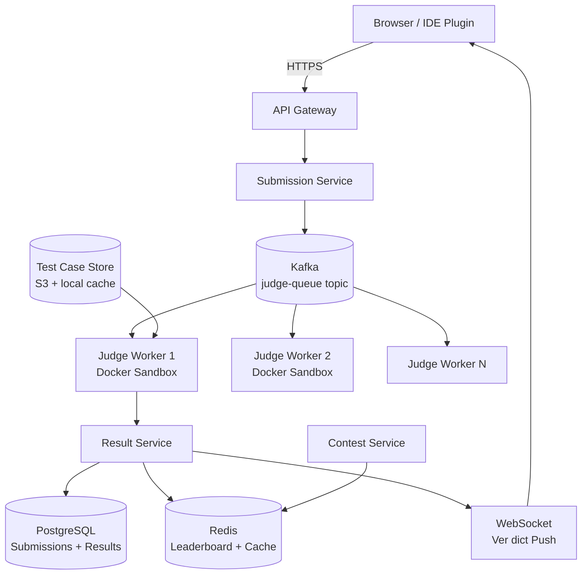

# Design a Competitive Programming Platform

**Difficulty**: 🟡 Intermediate
**Reading Time**: ~25 minutes
**The Core Problem**: How do you safely execute 100k untrusted code submissions per day in isolated sandboxes, measure time/memory accurately, and update contest leaderboards in real time?

---

## Table of Contents

1. [Requirements](#1-requirements)
2. [Capacity Estimation](#2-capacity-estimation)
3. [High-Level Architecture](#3-high-level-architecture)
4. [Code Sandbox Design](#4-code-sandbox-design)
5. [Judge Queue](#5-judge-queue)
6. [Test Case Evaluation](#6-test-case-evaluation)
7. [Contest Mode](#7-contest-mode)
8. [Leaderboard](#8-leaderboard)
9. [Key Design Decisions](#9-key-design-decisions)
10. [Interview Questions](#10-interview-questions)
11. [Key Takeaways](#11-key-takeaways)
12. [References](#12-references)

---

## 1. Requirements

### Functional
- Submit code in multiple languages (C++, Java, Python, Go, Rust)
- Run submissions against hidden test cases
- Report verdict: Accepted / Wrong Answer / TLE / MLE / Runtime Error / Compilation Error
- Contest mode: synchronized start/end, real-time leaderboard
- Practice mode: immediate feedback, no time pressure
- Problem statements with examples and constraints

### Non-Functional
- **Scale**: 100k submissions/day; peaks during contests: 10k submissions in first 5 minutes
- **Isolation**: Untrusted code must not access network, filesystem, or other processes
- **Accuracy**: Time limit accurate to ±5ms; memory limit accurate to ±1MB
- **Latency**: Verdict delivered within 10s for typical cases (< 2s execution + queue time)

---

## 2. Capacity Estimation

| Metric | Estimate |
|--------|----------|
| Submissions/day | 100k |
| Peak submissions/min | 2k (contest start spike) |
| Avg execution time | 1–2 seconds |
| Judge workers needed | 2k req/min × 2s / 60s = **70 workers** (with buffer: 200 workers) |
| Test cases per problem | avg 20 test cases × 1KB each = 20KB/problem |
| Storage for test cases | 10k problems × 20KB = **200MB** (tiny, cache in RAM) |
| Submission code size | 100k × 10KB = **1 GB/day** |
| Judge node CPU | 1 submission = 1 CPU core for duration |

---

## 3. High-Level Architecture



---

## 4. Code Sandbox Design

Security is the top priority — submitted code must not escape the sandbox.

### Isolation Stack
```
Layer 1 — Docker Container:
  - Separate Linux namespace (PID, network, mount, IPC)
  - No network access (--network none)
  - Read-only filesystem except /tmp (tmpfs, 256MB limit)
  - No access to host filesystem

Layer 2 — seccomp (system call filter):
  - Whitelist ~50 safe syscalls (read, write, mmap, exit, etc.)
  - Block: network (socket, connect), fork bomb (limit nproc), file access (open)
  - Any blocked syscall → SIGKILL immediately

Layer 3 — cgroups (resource limits):
  - CPU: 100% of 1 core, time measured via wall clock + CPU time
  - Memory: configurable (256MB default)
  - PIDs: max 50 (prevent fork bombs)

Layer 4 — User namespace:
  - Run as non-root user (uid 65534 = nobody)
  - Cannot escalate privileges
```

### Sandbox Execution Flow
```bash
# Compile phase (separate container, 30s time limit)
docker run --rm \
  --network none \
  --memory 512m \
  --cpus 1 \
  --ulimit nproc=50 \
  --security-opt seccomp=whitelist.json \
  judge-runner:latest \
  compile submission.cpp -o /tmp/submission

# Run phase (per test case)
docker run --rm \
  --network none \
  --memory 256m \
  --cpus 1 \
  judge-runner:latest \
  /usr/bin/time -v /tmp/submission < testcase_01.in > output_01.txt 2>&1
```

### Time Measurement Accuracy
- Use `clock_gettime(CLOCK_PROCESS_CPUTIME_ID)` inside container for CPU time
- Wall clock only for detecting TLE (process might sleep; CPU time is fairer)
- For multi-threaded Java: sum CPU time of all threads

---

## 5. Judge Queue

```
Topic: judge-submissions
Partitions: 100 (parallelism = 100 concurrent judge workers)
Key: problem_id (ensures submissions for same problem go to same partition for ordering)

Submission message:
{
  "submission_id": "sub_abc123",
  "user_id": "u_456",
  "problem_id": "p_789",
  "language": "cpp17",
  "code": "base64-encoded source",
  "contest_id": "c_111",  // null for practice
  "submitted_at": "2024-03-15T10:00:00Z",
  "time_limit_ms": 2000,
  "memory_limit_mb": 256
}

Consumer groups:
  - judge-workers: 200 workers, each processes 1 submission at a time
  - result-aggregator: collects verdicts, updates DB + leaderboard
```

---

## 6. Test Case Evaluation

### Standard Judge (stdout comparison)
```
For each test case:
  1. Run submission binary with test input
  2. Capture stdout
  3. Trim trailing whitespace
  4. Compare with expected output (byte-by-byte after normalization)
  5. If match → AC (Accepted), else WA (Wrong Answer)

Verdict priority: CE > TLE > MLE > RE > WA > AC
(First failing test case determines overall verdict)
```

### Custom Checker (special judge)
For problems where multiple outputs are valid (e.g., any valid permutation):
```python
# checker.py (provided by problem setter)
def check(input_file, expected_output, user_output):
    # Example: check if user's answer is a valid permutation
    expected = set(expected_output.split())
    user = set(user_output.split())
    return expected == user  # AC if sets match
```

---

## 7. Contest Mode

```
Contest Start:
  1. T-5 minutes: warm up judge workers (containers pre-created)
  2. T+0: unlock problem statements for all participants simultaneously
  3. Problem set cached in CDN (5000 users fetch simultaneously → no DB hit)

Submission During Contest:
  - Same judge pipeline; contest_id tagged on submission
  - Leaderboard updated after each AC verdict

Penalty System (ICPC-style):
  - Score = problems solved + penalty time
  - Penalty: each WA before AC adds 20-minute penalty
  - Leaderboard sorted: problems solved DESC, penalty time ASC

Contest End:
  - After end time: submissions accepted but not counted for leaderboard
  - Final standings frozen (common: freeze 1h before end, reveal after)
```

---

## 8. Leaderboard

### Real-time Leaderboard with Redis Sorted Set
```
key: leaderboard:{contest_id}
type: Sorted Set
score: -1 * (solved_count * 1e9 - penalty_minutes)  // negative for DESC sort
member: user_id

On AC verdict:
  1. Compute new score for user
  2. ZADD leaderboard:{contest_id} {new_score} {user_id}
  3. Score update is atomic O(log N)

Leaderboard query:
  ZRANGE leaderboard:{contest_id} 0 99 WITHSCORES  → top 100

User rank:
  ZRANK leaderboard:{contest_id} {user_id}  → O(log N)
```

---

## 9. Key Design Decisions

| Decision | Option A | Option B | Choice & Reason |
|----------|----------|----------|-----------------|
| Isolation | Docker + seccomp + cgroups | VM (gVisor/Firecracker) | **Docker + seccomp** — 50ms startup vs 1–2s for VMs; seccomp provides sufficient isolation |
| Output comparison | stdout string compare | Custom checker | **Both** — default is string compare; problem setters can provide custom checker |
| Judge queue | Kafka | SQS | **Kafka** — ordered per problem; replayable; partitioning controls parallelism |
| Leaderboard storage | Redis sorted set | PostgreSQL | **Redis** — O(log N) updates and rank queries; leaderboard is write-heavy during contest |
| Online vs offline judge | Online (real-time verdict) | Offline (batch, email results) | **Online** — competitive programming requires immediate feedback |

---

## 10. Interview Questions

| Question | Key Answer |
|----------|-----------|
| How do you prevent fork bombs? | cgroups limit PID count to 50; seccomp blocks fork after limit |
| How do you handle Python TLE fairly vs C++? | Each language has its own time limit multiplier (Python: 3× C++ limit) |
| How do you scale for 10k submissions in 5 minutes? | Pre-warm 200 judge containers; Kafka absorbs burst; auto-scale worker pool |
| What if a judge worker crashes mid-execution? | Kafka consumer group auto-rebalances; uncommitted offset retried by another worker |
| How do you prevent test case leakage? | Test cases stored in S3, never returned to client; judge containers have no network access |

---

## 11. Key Takeaways

- **Docker + seccomp + cgroups** provides sufficient isolation with 50ms container startup — VM-based sandboxes (Firecracker) add latency without proportional security gain at this scale
- **Kafka judge queue** absorbs contest-start spikes — 200 partitions allow 200 concurrent judgements
- **Redis sorted sets** for real-time leaderboard: O(log N) insert and rank query, handles 10k contest participants
- **Custom checkers** extend the judge to problems with multiple valid outputs — critical for geometry and optimization problems
- **Pre-warm containers** before contest start to cut 1st-submission latency from 5s to < 1s

---

## 📚 Resources & References

| Resource | Type | What You'll Learn |
|----------|------|------------------|
| [ByteByteGo — Online Judge System](https://www.youtube.com/@ByteByteGo) | 📺 YouTube | Judge queue and sandbox architecture overview |
| [Linux seccomp documentation](https://www.kernel.org/doc/html/latest/userspace-api/seccomp_filter.html) | 📚 Book | System call filtering for sandboxing |
| [Codeforces Architecture — High Scalability](https://highscalability.com) | 📖 Blog | Real competitive platform scaling |
| [Docker Security — CGroups and Namespaces](https://docs.docker.com/engine/security/) | 📚 Book | Container isolation primitives |
