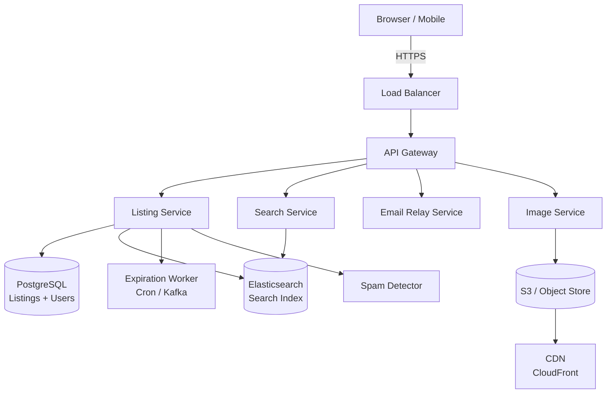

# Design Craigslist — Classified Ads at Scale

**Difficulty**: 🟢 Beginner → 🟡 Intermediate
**Reading Time**: ~20 minutes
**The Core Problem**: How do you serve 50M local classified listings with geographic search, expiring posts, spam filtering, and anonymous buyer-seller communication — without the complexity of a full marketplace?

---

## Table of Contents

1. [Requirements](#1-requirements)
2. [Capacity Estimation](#2-capacity-estimation)
3. [High-Level Architecture](#3-high-level-architecture)
4. [Database Schema](#4-database-schema)
5. [Geospatial Search](#5-geospatial-search)
6. [Listing Expiration](#6-listing-expiration)
7. [Anonymous Email Relay](#7-anonymous-email-relay)
8. [Spam Detection](#8-spam-detection)
9. [Image Storage](#9-image-storage)
10. [Key Design Decisions](#10-key-design-decisions)
11. [Interview Questions](#11-interview-questions)
12. [Key Takeaways](#12-key-takeaways)
13. [References](#13-references)

---

## 1. Requirements

### Functional
- Users post classified ads in specific cities/regions
- Browse and search ads by category, city, and keyword
- Ads expire after 30 days (or sooner if manually deleted)
- Buyers contact sellers via anonymous relay email (no direct email exposure)
- Image uploads (up to 12 photos per listing)
- Flagging system for spam/inappropriate content

### Non-Functional
- **Scale**: 50M active listings, 100M page views/day
- **Latency**: Search results < 200ms; listing page < 100ms
- **Availability**: 99.9% (classifieds tolerate brief downtime)
- **Geographic isolation**: Each city is a relatively independent unit

---

## 2. Capacity Estimation

| Metric | Estimate |
|--------|----------|
| Active listings | 50M |
| New listings/day | 500k |
| Daily page views | 100M |
| Peak QPS (reads) | 100M / 86400 × 10× = **11.5k RPS** |
| Listing text size | 50M × 2KB = **100 GB** |
| Images (avg 4 per listing) | 50M × 4 × 200KB = **40 TB** |
| Search index size | 50M × 1KB = **50 GB** |
| Expired listings/day | 1.67M (assuming 30-day avg lifespan) |

---

## 3. High-Level Architecture



---

## 4. Database Schema

```sql
CREATE TABLE listings (
  id           BIGSERIAL PRIMARY KEY,
  user_id      BIGINT REFERENCES users(id),
  title        VARCHAR(140) NOT NULL,
  description  TEXT,
  category     VARCHAR(50),           -- 'housing', 'jobs', 'for-sale', 'services'
  price        NUMERIC(10,2),
  city         VARCHAR(100),          -- 'san-francisco', 'new-york'
  state        VARCHAR(50),
  lat          DOUBLE PRECISION,      -- geographic coordinates
  lon          DOUBLE PRECISION,
  images       TEXT[],                -- array of S3 keys
  status       VARCHAR(20) DEFAULT 'active',   -- active, expired, removed
  created_at   TIMESTAMPTZ DEFAULT NOW(),
  expires_at   TIMESTAMPTZ DEFAULT NOW() + INTERVAL '30 days',
  contact_email VARCHAR(255)          -- hashed/relay address, never raw
);

-- Indexes for common access patterns
CREATE INDEX ON listings(city, category, status);
CREATE INDEX ON listings(expires_at) WHERE status = 'active';
CREATE INDEX ON listings(user_id);
-- PostGIS geospatial index
CREATE INDEX ON listings USING GIST (ST_MakePoint(lon, lat));
```

---

## 5. Geospatial Search

### Option A: PostGIS (PostgreSQL extension)
```sql
-- Find listings within 10 miles of San Francisco center
SELECT * FROM listings
WHERE status = 'active'
  AND category = 'for-sale'
  AND ST_DWithin(
    ST_MakePoint(lon, lat)::geography,
    ST_MakePoint(-122.4194, 37.7749)::geography,
    16093   -- 10 miles in meters
  )
ORDER BY created_at DESC
LIMIT 50;
```
**Pros**: SQL-native, strong consistency, no extra service
**Cons**: Doesn't scale as well for full-text + geo combined

### Option B: Elasticsearch with Geo Queries
```json
{
  "query": {
    "bool": {
      "must": { "match": { "title": "couch" } },
      "filter": [
        { "term": { "city": "san-francisco" } },
        { "geo_distance": {
            "distance": "10mi",
            "location": { "lat": 37.7749, "lon": -122.4194 }
        }}
      ]
    }
  }
}
```
**Pros**: Combined full-text + geo in one query; horizontal scaling
**Cons**: Eventually consistent; more operational complexity

**Recommendation**: Use Elasticsearch for search (handles full-text + geo well), PostgreSQL as the source of truth. Sync via Kafka on listing create/update/expire.

---

## 6. Listing Expiration

### Strategy: TTL-based expiration
```
Option A — Database Cron Job (chosen):
  - Listings table has expires_at column
  - Nightly job: UPDATE listings SET status = 'expired' WHERE expires_at < NOW() AND status = 'active'
  - Partial index on (expires_at, status='active') makes this fast
  - Pros: Simple, reliable, no extra infrastructure
  - Cons: Listings remain active until next cron run (up to 24h stale)

Option B — Kafka Delayed Event:
  - On create, publish event: { listing_id, expire_at } to Kafka with delay
  - Consumer marks listing expired at exact time
  - Pros: Precise expiration
  - Cons: More complex, requires Kafka delayed messaging or a timer service
```

For Craigslist's accuracy requirements, daily cron is sufficient.

---

## 7. Anonymous Email Relay

Craigslist never exposes the seller's real email. Instead, buyers email a relay address.

```
Seller posts listing:
  1. Seller provides real email: seller@gmail.com
  2. System generates relay address: listing-abc123@craigslist.org
  3. Mapping stored: relay_emails table { relay_addr, real_addr, listing_id, expires_at }
  4. Display relay address on listing page

Buyer sends email to relay:
  1. Email received by Craigslist SMTP server
  2. Lookup relay → real address
  3. Forward email with sender anonymized: From: buyer-anon456@craigslist.org
  4. Seller sees anonymous buyer address; can reply to it
  5. Reply-chain maintained through relay

Relay expiration:
  - Relay address expires when listing expires
  - Prevents spam to sellers after listing is closed
```

---

## 8. Spam Detection

Craigslist faces heavy spam: job scams, fake housing, phishing.

### Multi-layer Spam Detection
```
Layer 1 — Rate Limiting:
  - Max 5 listings/day per IP
  - Max 10 listings/day per account
  - New accounts limited to 2 listings until email verified

Layer 2 — Content Signals:
  - Phone number pattern in housing (common scam signal)
  - URLs in job listings
  - Duplicate title + description (exact or near-duplicate via Jaccard similarity)
  - Price patterns (too good to be true: iPhone 14 for $50)

Layer 3 — Community Flagging:
  - Users flag listings
  - 5 flags → auto-remove + human review queue
  - Flagging rate per IP/account tracked (prevent counter-flagging)

Layer 4 — IP / Account Reputation:
  - Known spam IP ranges blocked
  - Accounts with > 3 removed listings shadowbanned
```

---

## 9. Image Storage

```
Upload flow:
  1. Client requests pre-signed S3 URL (POST /images/upload-url)
  2. Client uploads directly to S3 (bypasses API server)
  3. S3 triggers Lambda → resize to [320px, 800px, 1600px] variants → store back to S3
  4. Return CDN URLs to client: https://cdn.craigslist.org/images/{listing_id}/{img_id}_800.jpg

Storage layout:
  s3://cl-images/{listing_id}/{image_id}_orig.jpg
  s3://cl-images/{listing_id}/{image_id}_320.jpg
  s3://cl-images/{listing_id}/{image_id}_800.jpg

CDN caching:
  Cache-Control: max-age=86400 (1 day)
  Images are immutable once uploaded → long TTL is safe

Deletion on listing expiry:
  Cron job or S3 Lifecycle Rule: delete after 60 days from expires_at
```

---

## 10. Key Design Decisions

| Decision | Option A | Option B | Choice & Reason |
|----------|----------|----------|-----------------|
| Search backend | PostGIS (PostgreSQL) | Elasticsearch | **Elasticsearch** for combined text + geo queries at scale |
| Geographic sharding | City-level DB shards | Single global DB | **Single DB** with city index — 50M rows fits comfortably; sharding adds complexity for marginal gain |
| Email exposure | Direct contact | Anonymous relay | **Anonymous relay** — seller privacy is core to Craigslist's trust model |
| Listing expiration | Exact TTL (Kafka) | Nightly cron | **Nightly cron** — daily precision sufficient; simpler to operate |
| Spam detection | Pure ML model | Rule-based + community flags | **Rule-based + community flags** — lower false positive risk; ML as auxiliary signal |

---

## 11. Interview Questions

| Question | Key Answer |
|----------|-----------|
| How do you handle city-level geographic isolation? | City is a partition key in the index; Elasticsearch geo-distance filter limits results to relevant area |
| How do you prevent expired listings from appearing in search? | Expiration worker publishes delete events to Elasticsearch; or filter by status=active in query |
| How do you handle 100M daily views without a database hit? | CDN caches listing HTML; Varnish/Nginx caches API responses for 1 minute per listing page |
| What's the biggest spam vector? | Account creation is free → auto-create thousands of accounts. Countermeasure: phone verification |
| How does anonymous email avoid becoming a spam vector? | Relay expires with listing; rate limits on reply chains; known spam patterns filtered at SMTP level |

---

## 12. Key Takeaways

- **Geographic sharding is not needed at 50M listings** — a single PostgreSQL with city index handles it; add sharding at 500M+
- **Elasticsearch dual-handles text search + geo filtering** — eliminates need for PostGIS + full-text search separately
- **Anonymous email relay** protects seller privacy and reduces direct contact spam
- **Community flagging + rate limits** is more reliable than ML alone for spam at this scale
- **Pre-signed S3 uploads** offload bandwidth from API servers — clients upload directly to object storage

---

## 📚 Resources & References

| Resource | Type | What You'll Learn |
|----------|------|------------------|
| [Elasticsearch Geo Distance Queries](https://www.elastic.co/guide/en/elasticsearch/reference/current/query-dsl-geo-distance-query.html) | 📚 Book | Geospatial filtering in Elasticsearch |
| [ByteByteGo — Proximity Service](https://www.youtube.com/@ByteByteGo) | 📺 YouTube | Geo search and local discovery system design |
| [PostGIS Spatial Reference](https://postgis.net/documentation/) | 📚 Book | PostgreSQL geospatial indexing |
| [High Scalability — Classifieds](https://highscalability.com) | 📖 Blog | Real-world classifieds platform patterns |
