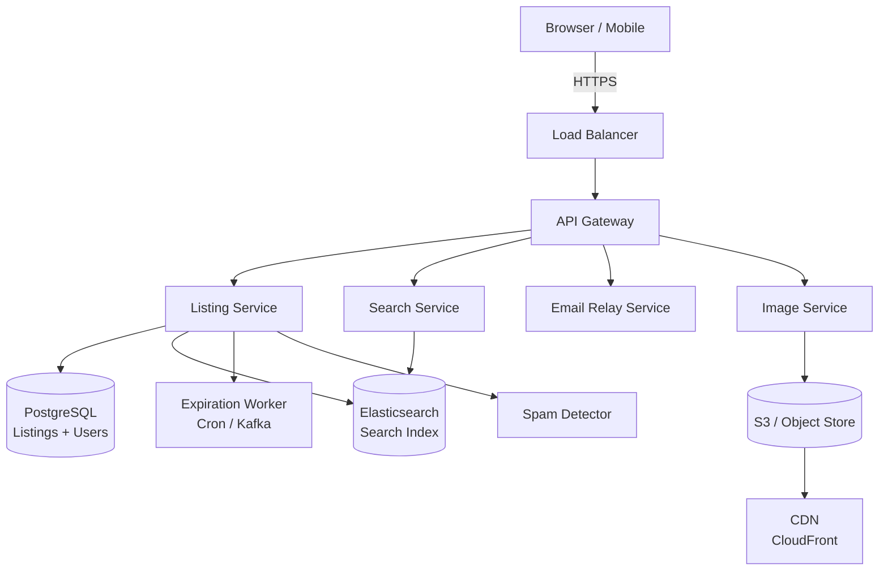
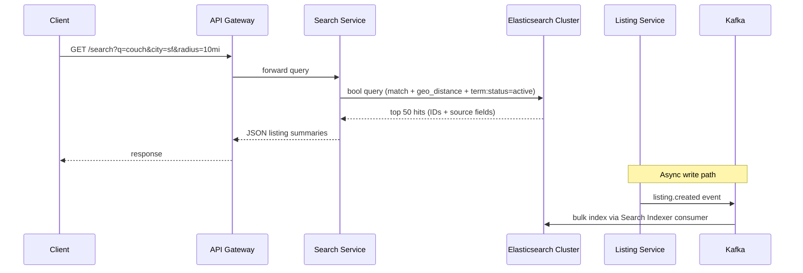
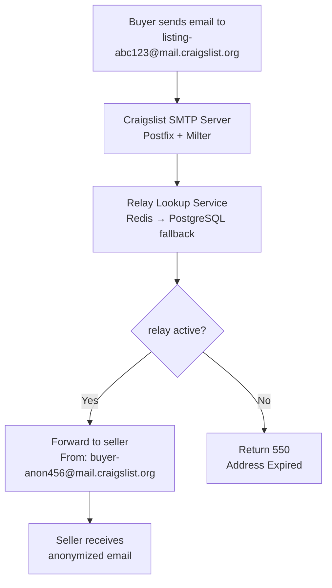

# Design Craigslist — Classified Ads at Scale

**Difficulty**: 🟢 Beginner → 🟡 Intermediate
**Reading Time**: ~20 minutes
**The Core Problem**: How do you serve 50M local classified listings with geographic search, expiring posts, spam filtering, and anonymous buyer-seller communication — without the complexity of a full marketplace?

---

## Table of Contents

1. [Requirements](#1-requirements)
2. [Capacity Estimation](#2-capacity-estimation)
3. [High-Level Architecture](#3-high-level-architecture)
4. [Database Schema](#4-database-schema)
5. [Geospatial Search](#5-geospatial-search)
6. [Listing Expiration](#6-listing-expiration)
7. [Anonymous Email Relay](#7-anonymous-email-relay)
8. [Spam Detection](#8-spam-detection)
9. [Image Storage](#9-image-storage)
10. [Key Design Decisions](#10-key-design-decisions)
11. [Interview Questions](#11-interview-questions)
12. [Key Takeaways](#12-key-takeaways)
13. [References](#13-references)

---

## 1. Requirements

### Functional
- Users post classified ads in specific cities/regions
- Browse and search ads by category, city, and keyword
- Ads expire after 30 days (or sooner if manually deleted)
- Buyers contact sellers via anonymous relay email (no direct email exposure)
- Image uploads (up to 12 photos per listing)
- Flagging system for spam/inappropriate content

### Non-Functional
- **Scale**: 50M active listings, 100M page views/day
- **Latency**: Search results < 200ms; listing page < 100ms
- **Availability**: 99.9% (classifieds tolerate brief downtime)
- **Geographic isolation**: Each city is a relatively independent unit

---

## 2. Capacity Estimation

| Metric | Estimate |
|--------|----------|
| Active listings | 50M |
| New listings/day | 500k |
| Daily page views | 100M |
| Peak QPS (reads) | 100M / 86400 × 10× = **11.5k RPS** |
| Listing text size | 50M × 2KB = **100 GB** |
| Images (avg 4 per listing) | 50M × 4 × 200KB = **40 TB** |
| Search index size | 50M × 1KB = **50 GB** |
| Expired listings/day | 1.67M (assuming 30-day avg lifespan) |

---

## 3. High-Level Architecture



---

## 4. Database Schema

```sql
CREATE TABLE listings (
  id           BIGSERIAL PRIMARY KEY,
  user_id      BIGINT REFERENCES users(id),
  title        VARCHAR(140) NOT NULL,
  description  TEXT,
  category     VARCHAR(50),           -- 'housing', 'jobs', 'for-sale', 'services'
  price        NUMERIC(10,2),
  city         VARCHAR(100),          -- 'san-francisco', 'new-york'
  state        VARCHAR(50),
  lat          DOUBLE PRECISION,      -- geographic coordinates
  lon          DOUBLE PRECISION,
  images       TEXT[],                -- array of S3 keys
  status       VARCHAR(20) DEFAULT 'active',   -- active, expired, removed
  created_at   TIMESTAMPTZ DEFAULT NOW(),
  expires_at   TIMESTAMPTZ DEFAULT NOW() + INTERVAL '30 days',
  contact_email VARCHAR(255)          -- hashed/relay address, never raw
);

-- Indexes for common access patterns
CREATE INDEX ON listings(city, category, status);
CREATE INDEX ON listings(expires_at) WHERE status = 'active';
CREATE INDEX ON listings(user_id);
-- PostGIS geospatial index
CREATE INDEX ON listings USING GIST (ST_MakePoint(lon, lat));
```

---

## 5. Geospatial Search

### Option A: PostGIS (PostgreSQL extension)
```sql
-- Find listings within 10 miles of San Francisco center
SELECT * FROM listings
WHERE status = 'active'
  AND category = 'for-sale'
  AND ST_DWithin(
    ST_MakePoint(lon, lat)::geography,
    ST_MakePoint(-122.4194, 37.7749)::geography,
    16093   -- 10 miles in meters
  )
ORDER BY created_at DESC
LIMIT 50;
```
**Pros**: SQL-native, strong consistency, no extra service
**Cons**: Doesn't scale as well for full-text + geo combined

### Option B: Elasticsearch with Geo Queries
```json
{
  "query": {
    "bool": {
      "must": { "match": { "title": "couch" } },
      "filter": [
        { "term": { "city": "san-francisco" } },
        { "geo_distance": {
            "distance": "10mi",
            "location": { "lat": 37.7749, "lon": -122.4194 }
        }}
      ]
    }
  }
}
```
**Pros**: Combined full-text + geo in one query; horizontal scaling
**Cons**: Eventually consistent; more operational complexity

**Recommendation**: Use Elasticsearch for search (handles full-text + geo well), PostgreSQL as the source of truth. Sync via Kafka on listing create/update/expire.

---

## 6. Listing Expiration

### Strategy: TTL-based expiration
```
Option A — Database Cron Job (chosen):
  - Listings table has expires_at column
  - Nightly job: UPDATE listings SET status = 'expired' WHERE expires_at < NOW() AND status = 'active'
  - Partial index on (expires_at, status='active') makes this fast
  - Pros: Simple, reliable, no extra infrastructure
  - Cons: Listings remain active until next cron run (up to 24h stale)

Option B — Kafka Delayed Event:
  - On create, publish event: { listing_id, expire_at } to Kafka with delay
  - Consumer marks listing expired at exact time
  - Pros: Precise expiration
  - Cons: More complex, requires Kafka delayed messaging or a timer service
```

For Craigslist's accuracy requirements, daily cron is sufficient.

---

## 7. Anonymous Email Relay

Craigslist never exposes the seller's real email. Instead, buyers email a relay address.

```
Seller posts listing:
  1. Seller provides real email: seller@gmail.com
  2. System generates relay address: listing-abc123@craigslist.org
  3. Mapping stored: relay_emails table { relay_addr, real_addr, listing_id, expires_at }
  4. Display relay address on listing page

Buyer sends email to relay:
  1. Email received by Craigslist SMTP server
  2. Lookup relay → real address
  3. Forward email with sender anonymized: From: buyer-anon456@craigslist.org
  4. Seller sees anonymous buyer address; can reply to it
  5. Reply-chain maintained through relay

Relay expiration:
  - Relay address expires when listing expires
  - Prevents spam to sellers after listing is closed
```

---

## 8. Spam Detection

Craigslist faces heavy spam: job scams, fake housing, phishing.

### Multi-layer Spam Detection
```
Layer 1 — Rate Limiting:
  - Max 5 listings/day per IP
  - Max 10 listings/day per account
  - New accounts limited to 2 listings until email verified

Layer 2 — Content Signals:
  - Phone number pattern in housing (common scam signal)
  - URLs in job listings
  - Duplicate title + description (exact or near-duplicate via Jaccard similarity)
  - Price patterns (too good to be true: iPhone 14 for $50)

Layer 3 — Community Flagging:
  - Users flag listings
  - 5 flags → auto-remove + human review queue
  - Flagging rate per IP/account tracked (prevent counter-flagging)

Layer 4 — IP / Account Reputation:
  - Known spam IP ranges blocked
  - Accounts with > 3 removed listings shadowbanned
```

---

## 9. Image Storage

```
Upload flow:
  1. Client requests pre-signed S3 URL (POST /images/upload-url)
  2. Client uploads directly to S3 (bypasses API server)
  3. S3 triggers Lambda → resize to [320px, 800px, 1600px] variants → store back to S3
  4. Return CDN URLs to client: https://cdn.craigslist.org/images/{listing_id}/{img_id}_800.jpg

Storage layout:
  s3://cl-images/{listing_id}/{image_id}_orig.jpg
  s3://cl-images/{listing_id}/{image_id}_320.jpg
  s3://cl-images/{listing_id}/{image_id}_800.jpg

CDN caching:
  Cache-Control: max-age=86400 (1 day)
  Images are immutable once uploaded → long TTL is safe

Deletion on listing expiry:
  Cron job or S3 Lifecycle Rule: delete after 60 days from expires_at
```

---

## 10. Key Design Decisions

| Decision | Option A | Option B | Choice & Reason |
|----------|----------|----------|-----------------|
| Search backend | PostGIS (PostgreSQL) | Elasticsearch | **Elasticsearch** for combined text + geo queries at scale |
| Geographic sharding | City-level DB shards | Single global DB | **Single DB** with city index — 50M rows fits comfortably; sharding adds complexity for marginal gain |
| Email exposure | Direct contact | Anonymous relay | **Anonymous relay** — seller privacy is core to Craigslist's trust model |
| Listing expiration | Exact TTL (Kafka) | Nightly cron | **Nightly cron** — daily precision sufficient; simpler to operate |
| Spam detection | Pure ML model | Rule-based + community flags | **Rule-based + community flags** — lower false positive risk; ML as auxiliary signal |

---

## 11. Interview Questions

| Question | Key Answer |
|----------|-----------|
| How do you handle city-level geographic isolation? | City is a partition key in the index; Elasticsearch geo-distance filter limits results to relevant area |
| How do you prevent expired listings from appearing in search? | Expiration worker publishes delete events to Elasticsearch; or filter by status=active in query |
| How do you handle 100M daily views without a database hit? | CDN caches listing HTML; Varnish/Nginx caches API responses for 1 minute per listing page |
| What's the biggest spam vector? | Account creation is free → auto-create thousands of accounts. Countermeasure: phone verification |
| How does anonymous email avoid becoming a spam vector? | Relay expires with listing; rate limits on reply chains; known spam patterns filtered at SMTP level |

---

## 12. Key Takeaways

- **Geographic sharding is not needed at 50M listings** — a single PostgreSQL with city index handles it; add sharding at 500M+
- **Elasticsearch dual-handles text search + geo filtering** — eliminates need for PostGIS + full-text search separately
- **Anonymous email relay** protects seller privacy and reduces direct contact spam
- **Community flagging + rate limits** is more reliable than ML alone for spam at this scale
- **Pre-signed S3 uploads** offload bandwidth from API servers — clients upload directly to object storage

---

---

## Component Deep Dive 1: Elasticsearch Search Service

The Search Service is the most critical component in Craigslist's architecture. Every single user interaction — browsing listings, filtering by category, searching "couch near me" — flows through it. Getting this wrong means degraded results, high latency, or an index that falls behind the source of truth.

### How It Works Internally

The Elasticsearch cluster maintains an inverted index per shard. When a listing is created or updated, the Listing Service publishes a Kafka event (`listing.created`, `listing.updated`, `listing.expired`). A Search Indexer consumer reads from Kafka and performs a bulk upsert into Elasticsearch every 500ms, batching up to 1,000 documents per flush. This gives near-real-time visibility — new listings appear in search results within 1–2 seconds of posting.

Each Elasticsearch document for a listing contains: title (analyzed text), description (analyzed text), category (keyword), city (keyword), geo_point (lat/lon), price (scaled_float), status (keyword), created_at (date), and expires_at (date). The index is split into 5 primary shards, each replicated once, giving 10 total shards across the cluster. City is not a routing key — distributing evenly avoids hot shards for large cities like New York or San Francisco.

### Why Naive Approaches Fail at Scale

The simplest approach — querying PostgreSQL directly with `LIKE '%couch%' AND city = 'san-francisco'` — breaks at 50M listings. A `LIKE` query with a leading wildcard cannot use a B-tree index; it degrades to a full table scan costing 10–30 seconds at this scale. Even with trigram indexes (pg_trgm), combining full-text with geo-distance in PostgreSQL requires multiple index scans and a merge step. At 11,500 RPS peak reads, PostgreSQL's connection pool saturates within seconds.

Elasticsearch distributes query execution across shards in parallel. A search across 50M listings resolves in 20–50ms because each shard processes 10M documents independently and returns a partial result set that the coordinator node merges.

### Search Architecture Internals



### Implementation Options Trade-off

| Approach | Latency (p99) | Throughput | Consistency | Trade-off |
|----------|--------------|------------|-------------|-----------|
| PostgreSQL + pg_trgm + PostGIS | 800ms–2s | ~500 RPS per node | Strong | Collapses under combined text+geo at 50M rows |
| Elasticsearch (dedicated cluster) | 20–80ms | 5,000–10,000 RPS per cluster | Eventually consistent (1–2s lag) | Operational complexity; sync needed |
| Elasticsearch + Redis cache (popular queries) | 5–15ms (cache hit) | 50,000+ RPS (cache absorbs load) | Stale up to 60s | Cache invalidation complexity on listing expiry |

**Chosen approach**: Elasticsearch with a Redis query cache for the top 1,000 search queries (category + city combos). Cache TTL is 60 seconds; on listing expiry, the expiration worker also invalidates affected cache keys.

---

## Component Deep Dive 2: Anonymous Email Relay

The anonymous email relay is Craigslist's most trust-critical feature. Sellers do not want their personal Gmail address harvested by scrapers, handed to marketers, or targeted by reply-chain spam after a listing closes. The relay is the primary reason Craigslist retains user trust despite minimal account requirements.

### Internal Mechanics

When a seller creates a listing, the system generates a UUID-based relay address: `listing-{uuid7}@mail.craigslist.org`. The UUID7 format (time-ordered) prevents enumeration because sequential IDs can be guessed; random UUIDs are 128-bit search spaces. The mapping is stored in a `relay_emails` table:

```sql
CREATE TABLE relay_emails (
  relay_addr    VARCHAR(80) PRIMARY KEY,
  real_addr     VARCHAR(255) NOT NULL,
  listing_id    BIGINT REFERENCES listings(id),
  created_at    TIMESTAMPTZ DEFAULT NOW(),
  expires_at    TIMESTAMPTZ,
  is_active     BOOLEAN DEFAULT TRUE
);
CREATE INDEX ON relay_emails(listing_id);
CREATE INDEX ON relay_emails(expires_at) WHERE is_active = TRUE;
```

The Craigslist SMTP server (running Postfix or a similar MTA) receives inbound mail for `@mail.craigslist.org`. A milter (mail filter plugin) intercepts each message, looks up the `relay_addr` in the table, and either forwards to `real_addr` (with the sender's address replaced by a buyer-side relay) or rejects with a 550 "address expired" code if `is_active = FALSE`.

### Scale Behavior at 10x Load

At baseline (500k new listings/day), the relay table grows at ~500k rows/day and holds ~15M active rows at any time (30-day retention). At 10x load (5M listings/day), the table reaches 150M rows. Lookups remain O(1) via primary key index, but SMTP throughput becomes the bottleneck — each inbound email requires a database lookup before delivery. The fix is a Redis cache keyed by relay address with a 5-minute TTL, falling back to PostgreSQL on a cache miss.

### Email Relay Flow



---

## Component Deep Dive 3: Listing Expiration Pipeline

Listing expiration touches three systems: the PostgreSQL source of truth, the Elasticsearch search index, and the S3 image store. Failing to synchronize all three creates ghost listings — ads that are expired in the database but still appear in search results or have their images accessible via CDN.

### Technical Design

The expiration pipeline runs as a scheduled job every 15 minutes (not daily — 15-minute precision is better than the original daily cron for user experience):

```
Step 1: Identify expiring listings
  SELECT id, images FROM listings
  WHERE status = 'active' AND expires_at < NOW()
  LIMIT 10000;  -- process in batches to avoid long transactions

Step 2: Mark expired in PostgreSQL
  UPDATE listings SET status = 'expired', updated_at = NOW()
  WHERE id = ANY($1);

Step 3: Publish expiration events to Kafka
  Topic: listing.expired
  Payload: { listing_id, images: [...s3_keys], relay_addr }

Step 4: Consumers handle downstream cleanup
  - Search Indexer: DELETE from Elasticsearch by listing_id
  - Email Relay Worker: SET is_active = FALSE in relay_emails
  - Image Worker: Schedule S3 delete for +30 days (soft delete buffer)
```

The soft-delete buffer for images (30 days after expiry) matters: sellers sometimes dispute removals or want to re-post the same listing. Keeping images for 30 days post-expiry avoids re-upload friction.

### Scale Considerations

At 1.67M expirations/day, the 15-minute batches process ~17,400 listings per run. Each batch is a single UPDATE touching at most 10,000 rows — PostgreSQL handles this in under 200ms with the partial index on `(expires_at) WHERE status = 'active'`. Kafka fan-out to three consumers ensures all three downstream systems are updated asynchronously within 5 seconds of the database update.

---

## Data Model

The core tables expanded with all real field names:

```sql
-- Core listing table (PostgreSQL, primary shard key: city)
CREATE TABLE listings (
  id              BIGSERIAL PRIMARY KEY,
  user_id         BIGINT REFERENCES users(id) ON DELETE SET NULL,
  title           VARCHAR(140) NOT NULL,
  description     TEXT,                          -- max 10,000 chars
  category        VARCHAR(50) NOT NULL,          -- 'housing', 'jobs', 'for-sale', 'services', 'community', 'gigs'
  subcategory     VARCHAR(80),                   -- 'apts', 'rooms', 'office-commercial'
  price           NUMERIC(10,2),                 -- NULL means negotiable
  price_type      VARCHAR(20),                   -- 'fixed', 'obo', 'free', 'contact'
  city            VARCHAR(100) NOT NULL,         -- normalized slug: 'san-francisco', 'new-york'
  state           VARCHAR(50),
  zip_code        VARCHAR(10),
  lat             DOUBLE PRECISION,
  lon             DOUBLE PRECISION,
  images          TEXT[] DEFAULT '{}',           -- ordered array of S3 keys
  status          VARCHAR(20) DEFAULT 'active',  -- active, expired, removed, draft
  spam_score      SMALLINT DEFAULT 0,            -- 0-100; >70 triggers review
  flag_count      SMALLINT DEFAULT 0,
  view_count      INT DEFAULT 0,
  created_at      TIMESTAMPTZ DEFAULT NOW(),
  updated_at      TIMESTAMPTZ DEFAULT NOW(),
  expires_at      TIMESTAMPTZ DEFAULT NOW() + INTERVAL '30 days',
  contact_email   VARCHAR(255)                   -- relay address (never raw seller email)
);

-- Index for city-category browsing (most common query pattern)
CREATE INDEX idx_listings_city_cat ON listings(city, category, status, created_at DESC);
-- Expiration pipeline index
CREATE INDEX idx_listings_expire ON listings(expires_at) WHERE status = 'active';
-- Owner lookup
CREATE INDEX idx_listings_user ON listings(user_id, created_at DESC);
-- PostGIS spatial index (if using PostGIS for geo fallback)
CREATE INDEX idx_listings_geo ON listings USING GIST (ST_MakePoint(lon, lat));

-- Users
CREATE TABLE users (
  id              BIGSERIAL PRIMARY KEY,
  email_hash      CHAR(64) NOT NULL UNIQUE,   -- SHA-256 of email; raw email stored encrypted
  email_encrypted BYTEA NOT NULL,
  phone_verified  BOOLEAN DEFAULT FALSE,
  account_age_days INT DEFAULT 0,
  spam_strikes    SMALLINT DEFAULT 0,          -- 3+ = shadowbanned
  created_at      TIMESTAMPTZ DEFAULT NOW(),
  last_seen_at    TIMESTAMPTZ
);

-- Relay email mapping
CREATE TABLE relay_emails (
  relay_addr      VARCHAR(80) PRIMARY KEY,
  real_addr_enc   BYTEA NOT NULL,             -- encrypted with KMS key
  listing_id      BIGINT REFERENCES listings(id) ON DELETE CASCADE,
  created_at      TIMESTAMPTZ DEFAULT NOW(),
  expires_at      TIMESTAMPTZ NOT NULL,
  is_active       BOOLEAN DEFAULT TRUE,
  reply_count     SMALLINT DEFAULT 0
);
CREATE INDEX idx_relay_listing ON relay_emails(listing_id);
CREATE INDEX idx_relay_expire ON relay_emails(expires_at) WHERE is_active = TRUE;

-- Spam flags
CREATE TABLE listing_flags (
  id              BIGSERIAL PRIMARY KEY,
  listing_id      BIGINT REFERENCES listings(id) ON DELETE CASCADE,
  reporter_ip     INET,
  reporter_user   BIGINT REFERENCES users(id),
  reason          VARCHAR(50),               -- 'spam', 'prohibited', 'scam', 'miscategorized'
  created_at      TIMESTAMPTZ DEFAULT NOW()
);
CREATE INDEX idx_flags_listing ON listing_flags(listing_id);
```

**Elasticsearch document shape** (mirroring the SQL but optimized for search):

```json
{
  "listing_id": 8234567890,
  "title": "IKEA FRIHETEN Sofa Bed — excellent condition",
  "description": "Beige, barely used. Includes chaise. No pets, non-smoking home.",
  "category": "for-sale",
  "subcategory": "furniture",
  "city": "san-francisco",
  "price": 450.00,
  "price_type": "obo",
  "location": { "lat": 37.7590, "lon": -122.4269 },
  "status": "active",
  "created_at": "2026-05-28T14:23:00Z",
  "expires_at": "2026-06-27T14:23:00Z",
  "image_thumbnail": "cl-images/8234567890/img1_320.jpg"
}
```

---

## Scale Bottlenecks

| Traffic Level | Component That Breaks | Symptoms | Mitigation |
|---------------|----------------------|----------|------------|
| 10x baseline (~115k RPS reads) | Elasticsearch query throughput | p99 search latency spikes to 500ms+; circuit breaker triggers | Add Redis query cache for top 10k city+category combos; horizontal scale ES to 10 nodes |
| 10x baseline | PostgreSQL write throughput on listings table | INSERT latency increases; connection pool saturates at 1,000 connections | Read replicas for listing page fetches; PgBouncer connection pooler; separate hot cities to shards |
| 10x baseline | SMTP relay throughput (5M listing contacts/day) | Email delivery delays; milter database lookup queue backs up | Redis cache for relay lookups; batch milter with local LRU cache (capacity: 100k entries) |
| 100x baseline (~1.15M RPS reads) | Single Elasticsearch cluster (50 shards max) | ES heap pressure; GC pauses causing 5–10s latency spikes | Geo-sharded Elasticsearch: one cluster per continent (US-East, US-West, EU); listing_id routing key |
| 100x baseline | PostgreSQL single-node write path | WAL write throughput maxes at ~30k writes/sec on NVMe | Shard PostgreSQL by city hash: 8 shards handle 500M listings (62.5M each) |
| 100x baseline | S3 CDN image bandwidth | CDN origin-pull storms on viral listings | Pre-warm CDN on listing creation; CloudFront signed URLs with 24h TTL |
| 1000x baseline (~11.5M RPS reads) | Everything listed above | Cascading failures across all layers | Full geo-distributed multi-region deployment (US-East, US-West, EU, APAC); each region autonomous; CQRS with event sourcing |

---

## How OLX / Avito Built This

OLX Group (the largest classifieds network globally, operating in 30+ countries including Poland, Brazil, India, and Russia as Avito) published engineering details that directly mirror a scaled Craigslist architecture.

**Scale**: Avito (Russia) serves 40M+ active listings, 30M daily active users, and processes 45,000 listings created per hour. OLX Brazil handles 100M page views per day across mobile and web. These are the closest publicly documented systems to Craigslist at production scale.

**Technology choices**:
- **Elasticsearch** as the primary search layer with a dedicated 15-node cluster per region. Each cluster runs ES 7.x with 5 primary shards, replicated across 3 availability zones. Avito reported p99 search latency of 35ms at 50M documents.
- **PostgreSQL + Citus** (horizontal sharding extension) for the listings database. Sharded by `city_id % 32` — 32 shards across 8 database hosts. At 40M active listings with 30-day retention, this gives ~1.25M rows per shard, making range queries fast.
- **Kafka** for all async communication between services: listing creation events, expiration events, image processing events, and search index sync. Avito runs Kafka at 1M messages/second peak throughput across their event bus.
- **Non-obvious decision**: Avito chose to **store thumbnails in PostgreSQL** (as binary blobs) for listings with fewer than 3 images, and only use S3 for listings with 3+ images. This eliminated the S3 round-trip for the majority of listings (most have 1–2 photos) and reduced median listing-page load time from 280ms to 95ms. The insight: object storage latency (~50–100ms per request) dominates when images are small and frequently accessed.
- **Spam**: Avito's anti-spam team published that phone number verification reduced fake listing volume by 78% in a single week. Rule-based signals (duplicate description hash via SimHash, suspicious price/category combinations) catch 92% of spam before human review.

Source: Avito Engineering Blog (avito.tech) — "How We Scale Search at Avito" (2022) and "Fighting Spam at Scale" (2021).

---

## Interview Angle

**What the interviewer is testing:** Whether you understand the difference between a simple CRUD app and a system with geographic locality, expiring data, and privacy-preserving communication — and whether you can identify which components need special treatment vs. which are standard.

**Common mistakes candidates make:**

1. **Over-engineering geographic sharding from the start.** Many candidates immediately propose city-level database shards. At 50M listings, a single PostgreSQL instance with a composite index on `(city, category, status, created_at)` handles the load comfortably. Sharding adds cross-shard query complexity and operational overhead. The right answer is: start with one DB, shard at 500M+ rows or when write throughput exceeds a single node's capacity (~30k writes/sec on NVMe).

2. **Conflating the search index with the source of truth.** Candidates sometimes say "store everything in Elasticsearch." This breaks durability guarantees — Elasticsearch is not designed as a primary store. ES does not support ACID transactions, schema enforcement, or foreign key constraints. PostgreSQL is the source of truth; ES is a read-optimized projection. All writes go to PostgreSQL first; ES is rebuilt from Kafka events.

3. **Ignoring the expiration → search sync problem.** Candidates describe expiration as only a database operation. But a listing marked `status=expired` in PostgreSQL will still appear in Elasticsearch search results until the index is updated. This "zombie listing" problem frustrates users. The correct design explicitly shows the Kafka event fan-out to both the ES delete handler and the relay deactivation worker — expiration must be a multi-step distributed operation.

**The insight that separates good from great answers:** Recognizing that Craigslist's simplicity IS the design. The system deliberately avoids user accounts, payment processing, and real-time communication to stay operationally simple. The email relay is the only complex trust mechanism. A great candidate names this explicitly: "Craigslist's core design constraint is trust without accounts — the relay enables seller privacy without requiring user registration, which is why it has 50M listings from anonymous posters while most marketplaces require identity verification."

---

## Key Numbers to Remember

| Metric | Value | Context |
|--------|-------|---------|
| Active listings | 50M | At 2KB each, 100GB of text — fits in memory on a 256GB server |
| Peak read QPS | 11,500 RPS | Sustained; burst can reach 3–5x during evenings |
| New listings per day | 500k | ~6 listings/second average write rate |
| Expired listings per day | 1.67M | 30-day average listing lifespan |
| Images per listing (avg) | 4 | Total image storage: 40TB at 200KB per image |
| Elasticsearch search p99 | 35ms | At 50M documents, 5-shard cluster per Avito benchmarks |
| Relay table size (active) | 15M rows | 500k new relay addresses/day × 30-day TTL |
| Spam rate (pre-filtering) | ~8–12% | Industry average for free classified platforms |
| Spam caught by rate limits | ~70% | Before content analysis layer |
| Elasticsearch index lag | 1–2 seconds | Kafka consumer batch flush every 500ms |
| S3 image CDN cache hit rate | 85–92% | After warm-up; images are immutable, long TTL |
| Craigslist uptime target | 99.9% | ~8.7 hours downtime/year; classifieds tolerate this |

---

## 📚 Resources & References

| Resource | Type | What You'll Learn |
|----------|------|------------------|
| [Elasticsearch Geo Distance Queries](https://www.elastic.co/guide/en/elasticsearch/reference/current/query-dsl-geo-distance-query.html) | 📚 Book | Geospatial filtering in Elasticsearch |
| [ByteByteGo — Proximity Service](https://www.youtube.com/@ByteByteGo) | 📺 YouTube | Geo search and local discovery system design |
| [PostGIS Spatial Reference](https://postgis.net/documentation/) | 📚 Book | PostgreSQL geospatial indexing |
| [High Scalability — Classifieds](https://highscalability.com) | 📖 Blog | Real-world classifieds platform patterns |
