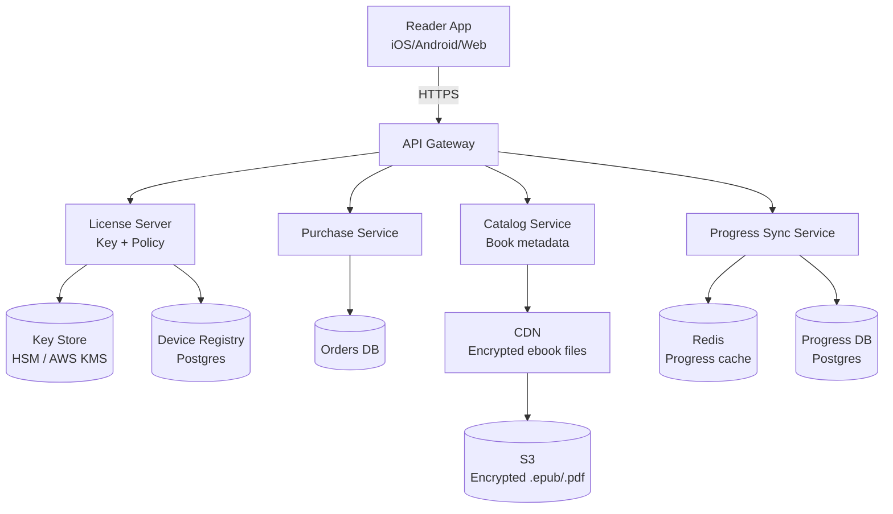

# Design an Ebook Distribution System

**Difficulty**: 🟡 Intermediate
**Reading Time**: ~25 minutes
**The Core Problem**: How do you distribute 10M ebooks to 100M users with DRM protection, offline reading, multi-device sync, and piracy prevention — all without killing UX?

---

## Table of Contents

1. [Requirements](#1-requirements)
2. [Capacity Estimation](#2-capacity-estimation)
3. [High-Level Architecture](#3-high-level-architecture)
4. [DRM System Design](#4-drm-system-design)
5. [License Server](#5-license-server)
6. [Offline Reading](#6-offline-reading)
7. [Device Limit Enforcement](#7-device-limit-enforcement)
8. [Reading Progress Sync](#8-reading-progress-sync)
9. [Watermarking for Piracy Tracing](#9-watermarking-for-piracy-tracing)
10. [Key Design Decisions](#10-key-design-decisions)
11. [Interview Questions](#11-interview-questions)
12. [Key Takeaways](#12-key-takeaways)
13. [References](#13-references)

---

## 1. Requirements

### Functional
- Users purchase and download ebooks to up to 6 registered devices
- Ebooks are DRM-protected (cannot be freely copied/shared)
- Users can read offline; DRM re-validation happens periodically when online
- Reading progress (last page/position) syncs across devices
- Publishers set device limits and lending permissions
- Piracy: watermark embeds user identity for tracing leaked copies

### Non-Functional
- **Scale**: 100M users, 10M ebook catalog, 500k concurrent downloads
- **Latency**: Download start < 2s; page turn < 50ms (local)
- **Availability**: 99.9% (offline reading means users tolerate brief outages)
- **Security**: AES-256 encryption; license server is the trust anchor

---

## 2. Capacity Estimation

| Metric | Estimate |
|--------|----------|
| Catalog size | 10M books × 2 MB avg = **20 TB** |
| Daily downloads | 2M downloads/day |
| Peak download throughput | 2M × 2MB / 86400s × 10× peak = **4.6 Gbps** |
| License validations/day | 10M (readers opening books) |
| Progress sync events/sec | 500k concurrent readers × 1 sync/30s = **16k events/sec** |
| Device registry size | 100M users × 6 devices × 256 bytes = **150 GB** |

---

## 3. High-Level Architecture



---

## 4. DRM System Design

### Encryption Strategy (AES-256 + Per-User Key)

```
Publisher uploads plaintext ebook (PDF/EPUB)
  ↓
Encryption Pipeline:
  1. Generate Content Encryption Key (CEK): random 256-bit AES key
  2. Encrypt ebook body with CEK (AES-256-CBC)
  3. Store encrypted ebook in S3: s3://ebooks/{book_id}/content.enc
  4. Store CEK in Key Store (AWS KMS), keyed by book_id

At purchase time (NOT at download time):
  1. User purchases book → order record created
  2. License Server wraps CEK with User Key (derived from user_id + device_id)
  3. License file (encrypted CEK + policy) stored in License DB
  4. License file delivered to device at download

On device:
  1. App receives encrypted ebook + license file
  2. Unwrap CEK using device credentials
  3. Decrypt ebook pages on-the-fly (per chapter, not all at once)
  4. CEK never stored unencrypted on disk
```

### Key Hierarchy
```
Root KMS Key (AWS KMS, never leaves HSM)
  └── Master User Key (per user, rotated annually)
        └── Device Key (per device, derived from user + device fingerprint)
              └── Content Encryption Key (wrapped for this device)
```

---

## 5. License Server

The license server is the trust anchor. A license file contains:

```json
{
  "license_id": "uuid",
  "user_id": "u_123",
  "book_id": "b_456",
  "device_id": "d_789",
  "encrypted_cek": "base64-encoded-wrapped-key",
  "permissions": {
    "can_read": true,
    "can_print": false,
    "can_copy": false,
    "expires_at": null,
    "lending_expires_at": null
  },
  "issued_at": "2024-01-15T10:00:00Z",
  "signature": "HMAC-SHA256 of above fields"
}
```

### License Validation (Online Check)
```
App opens book →
  1. Check local license (check expiry, signature)
  2. If license age > 30 days → call License Server for re-validation
  3. License Server verifies: user still owns book, device still authorized
  4. Returns refreshed license (new issued_at)
  5. If server unreachable → grace period: honor license for 7 days offline
```

---

## 6. Offline Reading

Offline reading is a core feature; users cannot always be online.

```
Download Flow:
  1. User taps "Download for Offline"
  2. App fetches: encrypted ebook (from CDN) + license file (from License Server)
  3. Store both on device in app-sandboxed encrypted storage
  4. App decrypts pages at render time using in-memory CEK

Offline Reading:
  - License is validated against local copy (no network call)
  - Grace period: 7 days without re-validation
  - After grace period: show "Connect to internet to continue reading"

Page Rendering Performance:
  - Decrypt chapter (not whole book) on demand: ~10ms per chapter
  - Pre-decrypt next chapter while reader reads current → < 50ms page turn
```

---

## 7. Device Limit Enforcement

Publishers set device limits (typically 6 for consumer; 1–2 for library lending).

```
Device Registration:
  Table: user_devices
    user_id, device_id, device_fingerprint, registered_at, last_seen_at

On new device attempting download:
  1. Count active devices for user: SELECT COUNT(*) FROM user_devices WHERE user_id = ?
  2. If count >= limit → reject with error "Device limit reached"
  3. User must deauthorize an existing device to add new one

Deauthorization:
  1. Remove device from user_devices
  2. Revoke license for all books on that device (mark in License DB)
  3. Device's cached licenses become invalid on next online validation
  4. Note: cannot remotely wipe already-downloaded files (DRM limitation)
```

---

## 8. Reading Progress Sync

Progress sync is eventually consistent — exact position matters less than approximate chapter.

```
Write path (on device):
  Every 30 seconds of reading (or on chapter change):
  POST /progress { book_id, user_id, position: "cfi:/6/4[chap01]!/4/2/1:100", ts }
  → Fire and forget (async, non-blocking read experience)

Storage:
  Redis: HSET progress:{user_id} {book_id} {position_json}  (for fast reads)
  Postgres: progress table (durable store, async flush from Redis)

Read path (on new device open):
  GET /progress/{user_id}/{book_id}
  → Redis cache hit < 5ms
  → Return last known position
```

---

## 9. Watermarking for Piracy Tracing

Visible vs invisible watermark:

| Type | Method | Use Case |
|------|--------|----------|
| Visible | Username printed in footer | Casual deterrence |
| Invisible (steganography) | Embed user_id in whitespace variation / word spacing | Piracy tracing after leak |
| Social DRM | No encryption, just watermark | Better UX, common for O'Reilly books |

```
Watermark Injection Pipeline:
  1. User downloads book
  2. Watermark Service generates unique watermarked copy:
     - Adjust word spacing microscopically (encodes user_id in binary via spacing variations)
     - Entire 256-bit user_id embedded in ~400 words
  3. S3: store watermarked copy with 24h TTL (too expensive to keep all variants)
  4. If piracy detected → extract watermark → identify original downloader
```

---

## 10. Key Design Decisions

| Decision | Option A | Option B | Choice & Reason |
|----------|----------|----------|-----------------|
| Decryption location | Client-side (app) | Server-side stream | **Client-side** — server-side stream means encrypted content travels twice; client-side keeps CEK off server after delivery |
| DRM strictness | Hard DRM (AES + license) | Social DRM (watermark only) | **Publisher choice** — technical books often use social DRM for UX; novels use hard DRM |
| License validation frequency | Every open | Every 30 days | **Every 30 days** (with 7-day grace) — balance security vs offline UX |
| Progress sync consistency | Strong (synchronous) | Eventual (async) | **Eventual** — reading position does not need ACID; losing 30s of progress is acceptable |
| Per-user encrypted copies | Yes (unique per user) | Shared encrypted copy | **Shared encrypted copy** with per-device license wrap — generating 100M unique copies is cost-prohibitive |

---

## 11. Interview Questions

| Question | Key Answer |
|----------|-----------|
| How do you prevent users from sharing downloaded files? | AES-256 encryption; decryption requires device-bound license key that expires after deauthorization |
| How does offline reading work after a revocation? | Grace period (7 days); after that, online re-validation required; cannot remotely delete local file |
| How do you handle device limit edge case (device lost/stolen)? | Allow deauthorization via web portal; device's licenses invalidate on next online check |
| How do you scale the License Server? | Read replicas for license validation; write-through cache in Redis; license server stateless except key store |
| What's the storage cost for 10M books? | 10M × 2MB = 20TB raw; CDN caches hot titles; long-tail served from S3 |

---

## 12. Key Takeaways

- **Per-user key wrapping** (not per-user file) scales to 100M users — CEK is shared; only the license wrapping is unique
- **Client-side decryption** is the right model: decryption happens on device, CEK never sent unencrypted
- **7-day offline grace period** balances security with UX for travelers and commuters
- **Progress sync is eventually consistent** — fire-and-forget write, Redis read cache
- **Watermarking complements DRM** — even if DRM is stripped, piracy can be traced to original downloader

---

## 📚 Resources & References

| Resource | Type | What You'll Learn |
|----------|------|------------------|
| [AWS KMS Developer Guide](https://docs.aws.amazon.com/kms/latest/developerguide/) | 📚 Book | Key hierarchy and envelope encryption patterns |
| [Adobe ADEPT DRM System](https://highscalability.com) | 📖 Blog | Industry-standard ebook DRM architecture |
| [ByteByteGo — Content Delivery at Scale](https://www.youtube.com/@ByteByteGo) | 📺 YouTube | CDN and distribution system design |
| [Kindle Unlimited Architecture](https://aws.amazon.com/blogs/architecture/) | 📖 Blog | Real-world ebook platform at Amazon scale |
