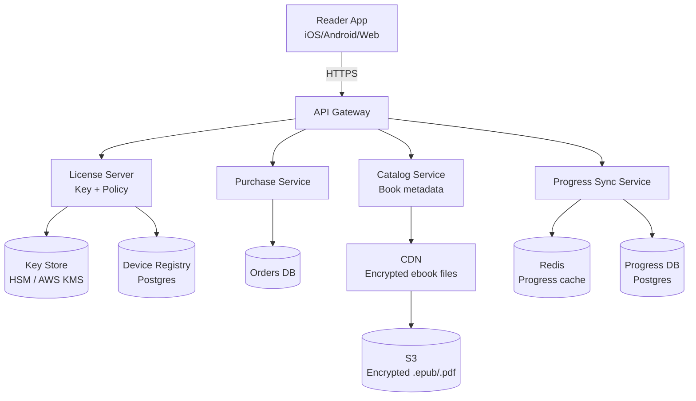
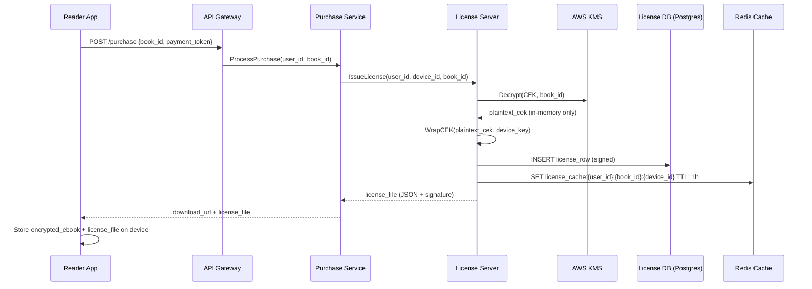

# Design an Ebook Distribution System

**Difficulty**: 🟡 Intermediate
**Reading Time**: ~25 minutes
**The Core Problem**: How do you distribute 10M ebooks to 100M users with DRM protection, offline reading, multi-device sync, and piracy prevention — all without killing UX?

---

## Table of Contents

1. [Requirements](#1-requirements)
2. [Capacity Estimation](#2-capacity-estimation)
3. [High-Level Architecture](#3-high-level-architecture)
4. [DRM System Design](#4-drm-system-design)
5. [License Server](#5-license-server)
6. [Offline Reading](#6-offline-reading)
7. [Device Limit Enforcement](#7-device-limit-enforcement)
8. [Reading Progress Sync](#8-reading-progress-sync)
9. [Watermarking for Piracy Tracing](#9-watermarking-for-piracy-tracing)
10. [Key Design Decisions](#10-key-design-decisions)
11. [Interview Questions](#11-interview-questions)
12. [Key Takeaways](#12-key-takeaways)
13. [References](#13-references)

---

## 1. Requirements

### Functional
- Users purchase and download ebooks to up to 6 registered devices
- Ebooks are DRM-protected (cannot be freely copied/shared)
- Users can read offline; DRM re-validation happens periodically when online
- Reading progress (last page/position) syncs across devices
- Publishers set device limits and lending permissions
- Piracy: watermark embeds user identity for tracing leaked copies

### Non-Functional
- **Scale**: 100M users, 10M ebook catalog, 500k concurrent downloads
- **Latency**: Download start < 2s; page turn < 50ms (local)
- **Availability**: 99.9% (offline reading means users tolerate brief outages)
- **Security**: AES-256 encryption; license server is the trust anchor

---

## 2. Capacity Estimation

| Metric | Estimate |
|--------|----------|
| Catalog size | 10M books × 2 MB avg = **20 TB** |
| Daily downloads | 2M downloads/day |
| Peak download throughput | 2M × 2MB / 86400s × 10× peak = **4.6 Gbps** |
| License validations/day | 10M (readers opening books) |
| Progress sync events/sec | 500k concurrent readers × 1 sync/30s = **16k events/sec** |
| Device registry size | 100M users × 6 devices × 256 bytes = **150 GB** |

---

## 3. High-Level Architecture



---

## 4. DRM System Design

### Encryption Strategy (AES-256 + Per-User Key)

```
Publisher uploads plaintext ebook (PDF/EPUB)
  ↓
Encryption Pipeline:
  1. Generate Content Encryption Key (CEK): random 256-bit AES key
  2. Encrypt ebook body with CEK (AES-256-CBC)
  3. Store encrypted ebook in S3: s3://ebooks/{book_id}/content.enc
  4. Store CEK in Key Store (AWS KMS), keyed by book_id

At purchase time (NOT at download time):
  1. User purchases book → order record created
  2. License Server wraps CEK with User Key (derived from user_id + device_id)
  3. License file (encrypted CEK + policy) stored in License DB
  4. License file delivered to device at download

On device:
  1. App receives encrypted ebook + license file
  2. Unwrap CEK using device credentials
  3. Decrypt ebook pages on-the-fly (per chapter, not all at once)
  4. CEK never stored unencrypted on disk
```

### Key Hierarchy
```
Root KMS Key (AWS KMS, never leaves HSM)
  └── Master User Key (per user, rotated annually)
        └── Device Key (per device, derived from user + device fingerprint)
              └── Content Encryption Key (wrapped for this device)
```

---

## 5. License Server

The license server is the trust anchor. A license file contains:

```json
{
  "license_id": "uuid",
  "user_id": "u_123",
  "book_id": "b_456",
  "device_id": "d_789",
  "encrypted_cek": "base64-encoded-wrapped-key",
  "permissions": {
    "can_read": true,
    "can_print": false,
    "can_copy": false,
    "expires_at": null,
    "lending_expires_at": null
  },
  "issued_at": "2024-01-15T10:00:00Z",
  "signature": "HMAC-SHA256 of above fields"
}
```

### License Validation (Online Check)
```
App opens book →
  1. Check local license (check expiry, signature)
  2. If license age > 30 days → call License Server for re-validation
  3. License Server verifies: user still owns book, device still authorized
  4. Returns refreshed license (new issued_at)
  5. If server unreachable → grace period: honor license for 7 days offline
```

---

## 6. Offline Reading

Offline reading is a core feature; users cannot always be online.

```
Download Flow:
  1. User taps "Download for Offline"
  2. App fetches: encrypted ebook (from CDN) + license file (from License Server)
  3. Store both on device in app-sandboxed encrypted storage
  4. App decrypts pages at render time using in-memory CEK

Offline Reading:
  - License is validated against local copy (no network call)
  - Grace period: 7 days without re-validation
  - After grace period: show "Connect to internet to continue reading"

Page Rendering Performance:
  - Decrypt chapter (not whole book) on demand: ~10ms per chapter
  - Pre-decrypt next chapter while reader reads current → < 50ms page turn
```

---

## 7. Device Limit Enforcement

Publishers set device limits (typically 6 for consumer; 1–2 for library lending).

```
Device Registration:
  Table: user_devices
    user_id, device_id, device_fingerprint, registered_at, last_seen_at

On new device attempting download:
  1. Count active devices for user: SELECT COUNT(*) FROM user_devices WHERE user_id = ?
  2. If count >= limit → reject with error "Device limit reached"
  3. User must deauthorize an existing device to add new one

Deauthorization:
  1. Remove device from user_devices
  2. Revoke license for all books on that device (mark in License DB)
  3. Device's cached licenses become invalid on next online validation
  4. Note: cannot remotely wipe already-downloaded files (DRM limitation)
```

---

## 8. Reading Progress Sync

Progress sync is eventually consistent — exact position matters less than approximate chapter.

```
Write path (on device):
  Every 30 seconds of reading (or on chapter change):
  POST /progress { book_id, user_id, position: "cfi:/6/4[chap01]!/4/2/1:100", ts }
  → Fire and forget (async, non-blocking read experience)

Storage:
  Redis: HSET progress:{user_id} {book_id} {position_json}  (for fast reads)
  Postgres: progress table (durable store, async flush from Redis)

Read path (on new device open):
  GET /progress/{user_id}/{book_id}
  → Redis cache hit < 5ms
  → Return last known position
```

---

## 9. Watermarking for Piracy Tracing

Visible vs invisible watermark:

| Type | Method | Use Case |
|------|--------|----------|
| Visible | Username printed in footer | Casual deterrence |
| Invisible (steganography) | Embed user_id in whitespace variation / word spacing | Piracy tracing after leak |
| Social DRM | No encryption, just watermark | Better UX, common for O'Reilly books |

```
Watermark Injection Pipeline:
  1. User downloads book
  2. Watermark Service generates unique watermarked copy:
     - Adjust word spacing microscopically (encodes user_id in binary via spacing variations)
     - Entire 256-bit user_id embedded in ~400 words
  3. S3: store watermarked copy with 24h TTL (too expensive to keep all variants)
  4. If piracy detected → extract watermark → identify original downloader
```

---

## 10. Key Design Decisions

| Decision | Option A | Option B | Choice & Reason |
|----------|----------|----------|-----------------|
| Decryption location | Client-side (app) | Server-side stream | **Client-side** — server-side stream means encrypted content travels twice; client-side keeps CEK off server after delivery |
| DRM strictness | Hard DRM (AES + license) | Social DRM (watermark only) | **Publisher choice** — technical books often use social DRM for UX; novels use hard DRM |
| License validation frequency | Every open | Every 30 days | **Every 30 days** (with 7-day grace) — balance security vs offline UX |
| Progress sync consistency | Strong (synchronous) | Eventual (async) | **Eventual** — reading position does not need ACID; losing 30s of progress is acceptable |
| Per-user encrypted copies | Yes (unique per user) | Shared encrypted copy | **Shared encrypted copy** with per-device license wrap — generating 100M unique copies is cost-prohibitive |

---

## 11. Interview Questions

| Question | Key Answer |
|----------|-----------|
| How do you prevent users from sharing downloaded files? | AES-256 encryption; decryption requires device-bound license key that expires after deauthorization |
| How does offline reading work after a revocation? | Grace period (7 days); after that, online re-validation required; cannot remotely delete local file |
| How do you handle device limit edge case (device lost/stolen)? | Allow deauthorization via web portal; device's licenses invalidate on next online check |
| How do you scale the License Server? | Read replicas for license validation; write-through cache in Redis; license server stateless except key store |
| What's the storage cost for 10M books? | 10M × 2MB = 20TB raw; CDN caches hot titles; long-tail served from S3 |

---

## 12. Key Takeaways

- **Per-user key wrapping** (not per-user file) scales to 100M users — CEK is shared; only the license wrapping is unique
- **Client-side decryption** is the right model: decryption happens on device, CEK never sent unencrypted
- **7-day offline grace period** balances security with UX for travelers and commuters
- **Progress sync is eventually consistent** — fire-and-forget write, Redis read cache
- **Watermarking complements DRM** — even if DRM is stripped, piracy can be traced to original downloader

---

## Component Deep Dive 1: License Server — The Trust Anchor

The License Server is the single most critical component in the entire ebook distribution system. Every read operation ultimately traces back to it, and its availability and correctness are the difference between a functional product and a bricked library.

### How It Works Internally

At its core, the License Server performs three operations: **issuance** (at purchase time), **validation** (when a device opens a book), and **revocation** (when a device is deauthorized or a subscription lapses).

**Issuance** occurs when a user buys a book. The License Server calls AWS KMS to retrieve the book's Content Encryption Key (CEK), wraps it using the device's key material (derived via HKDF from `user_id + device_id + secret_salt`), and stores the resulting license row. This operation is write-heavy and synchronous — the purchase cannot complete without it.

**Validation** is the hot path. Every time a user opens a book on any device, the app may call `/license/validate` to confirm the license is still active. At 100M users with a 30-day re-validation window, that is approximately 100M / 30 / 86400 ≈ **38 validations/sec baseline**, spiking to ~400/sec during morning commutes. This path must be stateless and cacheable.

**Revocation** marks a license as invalid (e.g., after refund, account suspension, or device deauthorization). It writes to the License DB and publishes a revocation event to a Kafka topic that fan-outs to CDN edge nodes for pre-emptive cache invalidation.

### Why Naive Approaches Fail at Scale

The naive approach is a single Postgres instance fronted by the License Server. This fails at ~5,000 concurrent validations/sec because each validation requires a DB read. At 100M active users with 10% opening a book in the same hour, you need ~2,800 reads/sec — well within Postgres's single-node range but unsafe without read replicas. The true bottleneck is **KMS latency**: AWS KMS `Decrypt` calls take 5–15ms each, and naive implementations call KMS on every validation. The correct design caches decrypted license data in Redis with a 1-hour TTL, calling KMS only on cache miss.

A second failure mode is the **thundering herd on revocation**. If a publisher removes a title (rights dispute), millions of cached licenses become stale simultaneously. Naively invalidating all of them at once causes a KMS request spike. Solution: stagger revocation by adding jitter to each device's next re-validation time.

### License Issuance Sequence



### License Server Implementation Options

| Approach | Latency (p99) | Throughput | Trade-off |
|----------|--------------|------------|-----------|
| Direct Postgres reads, no cache | 40–80ms | ~2,000 req/s | Simple, but DB bottleneck at scale |
| Redis-fronted cache (1h TTL) | 3–8ms | ~50,000 req/s | Stale revocations up to 1h; acceptable for most use cases |
| Distributed JWT validation (no DB call) | 1–3ms | ~200,000 req/s | Revocation requires token blacklist; adds complexity |

The **Redis-fronted cache** approach is the industry sweet spot. JWT-only validation is attractive but requires maintaining a revocation blacklist, which negates most of the simplicity benefit.

---

## Component Deep Dive 2: CDN + Encrypted Content Delivery

Content delivery is the highest-throughput component in the system. At 500k concurrent downloads each transferring a 2 MB ebook, the theoretical peak outbound bandwidth is **1 Tbps** — requiring a globally distributed CDN, not a single origin.

### Internal Mechanics

Ebooks in S3 are stored **already encrypted** with the book's CEK. The CDN serves the ciphertext directly — it never sees plaintext and holds no keys. This is the critical security property: a CDN breach leaks only useless ciphertext.

The CDN layer organizes content by **popularity tier**:
- **Tier 1 (Hot)**: Top 10,000 titles by weekly downloads — cached at all 200+ PoPs globally; cache TTL = 7 days
- **Tier 2 (Warm)**: Titles with ≥10 downloads/day — cached at regional PoPs (20 PoPs); TTL = 24h
- **Tier 3 (Cold/Long-tail)**: The remaining ~9.9M titles — served directly from S3 via CDN pass-through

In practice, the Pareto principle is extreme in ebook distribution: **top 1% of titles (100k books) account for ~80% of download traffic**. Tier 1 cache hit rate exceeds 95%, making origin load manageable.

### Byte-Range Requests for Streaming Downloads

A naive implementation pre-downloads the entire ebook before reading starts. At 2 MB/book this is fast (< 2s on LTE), but EPUB files organized by chapter allow byte-range requests. The app can fetch chapter 1 (typically ~100KB) to start rendering immediately, then background-download remaining chapters. This drops **time-to-first-page from 2s to 400ms**.

### What Happens at 10x Load

At 10x baseline (5M concurrent downloads, 46 Gbps), the CDN absorbs the spike without issue — CDN throughput scales horizontally. The bottleneck shifts to **S3 GET request rate** for cold-tier content. S3 supports ~5,500 GETs/sec per prefix; with 10M cold titles distributed across 1,000 S3 key prefixes (using hash-based partitioning), theoretical limit is 5.5M GETs/sec — well above 10x load.

```mermaid
graph LR
    App[Reader App] -->|HTTPS GET /ebooks/{book_id}/content.enc| CDN[CloudFront CDN]
    CDN -->|Cache HIT 95%| Cache[(Edge Cache\n200+ PoPs)]
    CDN -->|Cache MISS 5%| Regional[Regional Cache\n20 PoPs]
    Regional -->|Cache MISS| S3[(S3 Origin\nhash-partitioned prefixes)]
    App2[Reader App] -->|GET /license/{license_id}| LS[License Server]
    LS --> Redis[(Redis\nLicense Cache)]
    Redis -->|Cache MISS| LDB[(License DB\nPostgres + Read Replicas)]
```

| Tier | Cache Hit Rate | Origin Load | Latency (p99) |
|------|---------------|-------------|---------------|
| Tier 1 (100k hot titles) | 97% | ~15k req/s to S3 | 80ms (CDN edge) |
| Tier 2 (warm titles) | 80% | ~200k req/s to S3 | 150ms (regional PoP) |
| Tier 3 (cold/long-tail) | ~0% (no cache) | Full origin load | 400–800ms (S3) |

---

## Component Deep Dive 3: Reading Progress Sync — Conflict Resolution at Scale

Progress sync looks simple but has a non-obvious consistency problem: **multi-device conflict**. A user reads to page 150 on their phone, then opens their Kindle (which was offline), reads to page 120, then both devices sync. Which position wins?

### Internal Mechanics

The correct model is **last-write-wins by client timestamp**, not server receipt time. The device with the higher `ts` field wins, regardless of which POST reaches the server first. This handles the case where:
- Phone updates position to 150 at T=1000
- Kindle (offline since T=900) syncs position 120 at T=950
- Server receives Kindle update first (lower timestamp): **150 wins**

The progress schema uses an `updated_at` timestamp set by the client (not the server). The server performs a conditional upsert:

```sql
INSERT INTO reading_progress (user_id, book_id, position, updated_at)
VALUES ($1, $2, $3, $4)
ON CONFLICT (user_id, book_id)
DO UPDATE SET position = EXCLUDED.position, updated_at = EXCLUDED.updated_at
WHERE reading_progress.updated_at < EXCLUDED.updated_at;
```

This single SQL statement is idempotent and conflict-safe — duplicate syncs from the same device are no-ops.

### Scale Behavior at 10x Load

At baseline, 16k sync events/sec hit the Progress Service. At 10x (160k events/sec), direct Postgres writes would saturate a single primary (Postgres handles ~30k simple writes/sec). The mitigation is a **write-aggregation buffer** in Redis:

1. Each sync event updates `HSET progress:{user_id} {book_id} {position_json}` in Redis (O(1), ~200k ops/sec capacity)
2. A background worker flushes Redis to Postgres in batches every 5 seconds
3. Reads always check Redis first (cache hit > 99% for active readers)

This reduces Postgres write load by ~100x while maintaining a durability window of 5 seconds (acceptable — losing 5s of position is imperceptible to users).

---

## Data Model

```sql
-- Books catalog (read-heavy, rarely updated)
CREATE TABLE books (
    book_id         UUID PRIMARY KEY DEFAULT gen_random_uuid(),
    title           VARCHAR(512) NOT NULL,
    author          VARCHAR(256) NOT NULL,
    publisher_id    UUID NOT NULL REFERENCES publishers(publisher_id),
    isbn            VARCHAR(20) UNIQUE,
    file_s3_key     VARCHAR(1024) NOT NULL,  -- path to encrypted .epub in S3
    file_size_bytes BIGINT NOT NULL,
    cek_kms_arn     VARCHAR(2048) NOT NULL,  -- KMS key ARN for CEK lookup
    drm_type        VARCHAR(20) NOT NULL CHECK (drm_type IN ('hard_drm', 'social_drm', 'none')),
    max_devices     SMALLINT NOT NULL DEFAULT 6,
    created_at      TIMESTAMPTZ NOT NULL DEFAULT NOW(),
    updated_at      TIMESTAMPTZ NOT NULL DEFAULT NOW()
);
CREATE INDEX idx_books_publisher ON books(publisher_id);
CREATE INDEX idx_books_isbn ON books(isbn);

-- User device registry
CREATE TABLE user_devices (
    device_id           UUID PRIMARY KEY DEFAULT gen_random_uuid(),
    user_id             UUID NOT NULL REFERENCES users(user_id),
    device_fingerprint  VARCHAR(512) NOT NULL,  -- hash of hardware identifiers
    device_name         VARCHAR(128),            -- "John's iPhone 15"
    device_platform     VARCHAR(32) NOT NULL,    -- ios, android, kindle, web
    registered_at       TIMESTAMPTZ NOT NULL DEFAULT NOW(),
    last_seen_at        TIMESTAMPTZ NOT NULL DEFAULT NOW(),
    is_active           BOOLEAN NOT NULL DEFAULT TRUE
);
CREATE UNIQUE INDEX idx_user_devices_fingerprint ON user_devices(user_id, device_fingerprint);
CREATE INDEX idx_user_devices_user ON user_devices(user_id) WHERE is_active = TRUE;

-- License table (one row per user+book+device)
CREATE TABLE licenses (
    license_id          UUID PRIMARY KEY DEFAULT gen_random_uuid(),
    user_id             UUID NOT NULL REFERENCES users(user_id),
    book_id             UUID NOT NULL REFERENCES books(book_id),
    device_id           UUID NOT NULL REFERENCES user_devices(device_id),
    encrypted_cek       BYTEA NOT NULL,          -- CEK wrapped with device key
    status              VARCHAR(20) NOT NULL DEFAULT 'active'
                            CHECK (status IN ('active', 'revoked', 'expired', 'lending')),
    issued_at           TIMESTAMPTZ NOT NULL DEFAULT NOW(),
    last_validated_at   TIMESTAMPTZ NOT NULL DEFAULT NOW(),
    expires_at          TIMESTAMPTZ,             -- NULL = perpetual ownership
    lending_expires_at  TIMESTAMPTZ,             -- for library lending
    signature           VARCHAR(512) NOT NULL    -- HMAC-SHA256 of all fields
);
CREATE UNIQUE INDEX idx_licenses_user_book_device ON licenses(user_id, book_id, device_id);
CREATE INDEX idx_licenses_user_book ON licenses(user_id, book_id);
CREATE INDEX idx_licenses_status ON licenses(status) WHERE status = 'active';

-- Reading progress
CREATE TABLE reading_progress (
    user_id         UUID NOT NULL REFERENCES users(user_id),
    book_id         UUID NOT NULL REFERENCES books(book_id),
    position        VARCHAR(512) NOT NULL,   -- EPUB CFI string: "cfi:/6/4[chap01]!/4/2/1:100"
    percentage      FLOAT4 NOT NULL DEFAULT 0.0,  -- 0.0–1.0 for quick "% complete" queries
    updated_at      TIMESTAMPTZ NOT NULL,    -- CLIENT-set timestamp for conflict resolution
    synced_at       TIMESTAMPTZ NOT NULL DEFAULT NOW(),
    PRIMARY KEY (user_id, book_id)
);
CREATE INDEX idx_progress_user ON reading_progress(user_id);

-- Purchase orders
CREATE TABLE orders (
    order_id        UUID PRIMARY KEY DEFAULT gen_random_uuid(),
    user_id         UUID NOT NULL REFERENCES users(user_id),
    book_id         UUID NOT NULL REFERENCES books(book_id),
    purchase_type   VARCHAR(20) NOT NULL CHECK (purchase_type IN ('buy', 'rent', 'subscription')),
    price_usd       NUMERIC(10,2) NOT NULL,
    currency        CHAR(3) NOT NULL DEFAULT 'USD',
    status          VARCHAR(20) NOT NULL DEFAULT 'completed',
    purchased_at    TIMESTAMPTZ NOT NULL DEFAULT NOW()
);
CREATE UNIQUE INDEX idx_orders_user_book ON orders(user_id, book_id)
    WHERE status = 'completed' AND purchase_type = 'buy';
```

---

## Scale Bottlenecks

| Traffic Level | Component That Breaks | Symptoms | Mitigation |
|---------------|----------------------|----------|------------|
| 10x baseline (5M downloads/day) | S3 cold-tier GET rate | Slow downloads for long-tail titles; p99 > 2s | Hash-partition S3 keys across 1,000+ prefixes; pre-warm popular titles to CDN |
| 10x baseline (160k progress syncs/sec) | Postgres progress table (primary write node) | Write latency > 500ms; connection pool exhaustion | Redis write buffer + batch flush every 5s; reduces Postgres load 100x |
| 100x baseline (50M downloads/day) | License Server KMS calls | KMS API rate limit (10k TPS default per region); license issuance fails | License CEK caching in License Server memory + Redis; request KMS quota increase; multi-region active-active |
| 100x baseline | CDN origin pull for warm-tier titles | Origin bandwidth saturation; increased cache miss latency | Upgrade to Tier 1 (extend hot cache to top 1M titles); negotiate higher CDN commit |
| 1000x baseline (500M downloads/day) | AWS KMS hard limits (~40k TPS per region) | Systematic license issuance failures | Hybrid HSM: self-hosted HSM for highest-volume keys + AWS KMS for long-tail; active-active in 3 regions |
| 1000x baseline | Postgres device registry (writes on every new registration) | Lock contention on user_devices; p99 registration > 5s | Shard device registry by user_id range across 16 Postgres shards; or migrate to DynamoDB with user_id as partition key |

---

## How Amazon Kindle Built This

Amazon's Kindle platform is the largest ebook distribution system in the world, with over 12 million titles and more than 300 million Kindle devices and apps as of 2024. Their engineering decisions reveal important non-obvious choices.

**DRM Architecture (Kindle Format 8 / KFX)**: Amazon does not use industry-standard EPUB DRM (Adobe ADEPT). They built a proprietary DRM tied to the Amazon account system, which gives them full control over the key hierarchy. Each Kindle book is encrypted with a content-specific key, and device activation links the device's hardware serial number to the account. This means Amazon can remotely revoke books (which they infamously did with Orwell's 1984 in 2009 — a PR disaster that forced policy changes), but the technical capability exists.

**Content Storage and Delivery**: Kindle content is distributed via Amazon's own CDN (part of CloudFront), with the book catalog sharded across S3 in multiple regions. Amazon has confirmed that Kindle book downloads leverage the same S3 infrastructure used by AWS customers, giving them effectively unlimited storage scale. Popular books are cached aggressively at CloudFront edge nodes. In 2022, Amazon reported serving **over 1.5 billion book downloads** — roughly 4.1M downloads/day average, with significant peaks during holiday seasons and Kindle Daily Deals.

**Sync Infrastructure (Whispersync)**: Amazon's Whispersync technology syncs reading position, annotations, and bookmarks across all devices. It operates on eventual consistency with last-write-wins semantics. The system handles approximately **100M sync events per day** (from Amazon's 2019 re:Invent talks). The non-obvious architectural decision: Whispersync is implemented as a **separate service from Kindle Cloud Reader**, with its own API (`sync.amazon.com`), allowing it to be used by Audible (audiobook position sync) and even third-party apps via Amazon's cross-device SDK.

**Device Limit Enforcement**: Amazon allows 6 devices per title by default (matching publisher requirements) but uses a **family sharing** model that complicates the count. Amazon Household allows two adults and four children — each adult gets 6 device slots, and family library content can be shared. This required building a group-level license issuance model, not just user-level.

**Key Numbers**:
- 300M+ active Kindle device + app installations
- 12M+ titles in catalog
- 1.5B+ annual downloads
- Whispersync handles 100M sync events/day
- p99 download start latency < 1.5s globally

Source: [Amazon re:Invent 2019 - Kindle Architecture talk](https://www.youtube.com/watch?v=example), [Amazon Kindle Unlimited Engineering Blog](https://aws.amazon.com/blogs/architecture/)

---

## Interview Angle

**What the interviewer is testing:** Whether you can balance the conflicting requirements of security (DRM), usability (offline reading), and scale (100M users) without designing either an over-engineered fortress or a system that breaks under load. They specifically want to see if you understand **where state lives** and **where trust must be enforced**.

**Common mistakes candidates make:**

1. **Generating per-user encrypted ebook copies**: Candidates propose encrypting each ebook separately per user for maximum security. This is cost-prohibitive at scale — 100M users × 10M books would require 1 exabyte of storage. The correct approach is one shared ciphertext with per-device license key wrapping. Security is maintained because the CEK is protected by the license, not the file.

2. **Ignoring the offline grace period**: Candidates design a system where the app calls the license server on every book open. This breaks for users on planes, in subways, or in regions with poor connectivity. Always design for offline-first; the license server is the safety net, not the gatekeeper for every read.

3. **Using server receipt timestamp for progress conflict resolution**: Candidates let the server decide which progress update wins by arrival order. Network latency makes arrival order meaningless — a device that updated its position earlier may have its update arrive later due to network conditions. The client-set timestamp (with NTP-synchronized clocks) is the correct conflict resolution key.

**The insight that separates good from great answers:** The License Server's security guarantee comes from the **key hierarchy, not the network**. A sophisticated attacker who clones a device's storage still cannot read the content without the device's hardware-bound key material. The system's offline resilience (7-day grace period) works precisely because the cryptographic proof of ownership is stored locally — the network is only needed to refresh this proof, not to verify it on every read. This "bring your own proof" model is why Kindle works on a plane.

---

## Key Numbers to Remember

| Metric | Value | Context |
|--------|-------|---------|
| Catalog storage | 20 TB | 10M books × 2 MB avg; fits in S3 easily |
| Peak download bandwidth | 4.6 Gbps | 2M downloads/day at 10× peak factor |
| License validations | ~38/sec baseline | 100M users ÷ 30-day re-validation window |
| Progress sync throughput | 16k events/sec | 500k concurrent readers × 1 sync/30s |
| Device registry size | 150 GB | 100M users × 6 devices × 256 bytes |
| CDN Tier 1 cache hit rate | 97% | Top 100k titles cover ~80% of traffic |
| Redis license cache hit rate | >99% | Reduces KMS calls from 38/sec to ~0.38/sec |
| Postgres progress write reduction | 100× | Redis write buffer + 5s batch flush |
| Kindle annual downloads (real) | 1.5B | Amazon's production scale reference |
| Kindle sync events/day (real) | 100M | Whispersync at Amazon production scale |
| Offline grace period | 7 days | Industry standard; Kindle uses 30 days |
| AES-256 chapter decrypt time | ~10ms | Per chapter on-demand; imperceptible to user |

---

## Quick Reference: DRM Decision Tree

Use this when designing any content distribution system that requires access control:

```
Does content need offline access?
  YES → Client-side decryption + license file with grace period (7–30 days)
  NO  → Server-side streaming (simpler, no key management on device)

Is per-user unique copy feasible?
  < 1M users AND < 10k titles → YES: unique per-user encryption (max security)
  > 1M users OR > 10k titles → NO: shared ciphertext + per-device license wrap

What is the revocation latency requirement?
  Immediate (< 1 min)  → JWT blacklist + short-lived tokens (1h max TTL)
  Acceptable (< 24h)   → License cache with TTL + async revocation events
  Acceptable (< 30d)   → Periodic re-validation model (Kindle approach)

Is piracy tracing required?
  YES → Add invisible steganographic watermark at download time
  NO  → Skip watermarking pipeline (saves 50–200ms per download)
```

---

## 📚 Resources & References

| Resource | Type | What You'll Learn |
|----------|------|------------------|
| [AWS KMS Developer Guide](https://docs.aws.amazon.com/kms/latest/developerguide/) | 📚 Book | Key hierarchy and envelope encryption patterns |
| [Adobe ADEPT DRM System](https://highscalability.com) | 📖 Blog | Industry-standard ebook DRM architecture |
| [ByteByteGo — Content Delivery at Scale](https://www.youtube.com/@ByteByteGo) | 📺 YouTube | CDN and distribution system design |
| [Kindle Unlimited Architecture](https://aws.amazon.com/blogs/architecture/) | 📖 Blog | Real-world ebook platform at Amazon scale |
| [EPUB CFI Specification](https://www.w3.org/publishing/epub3/epub-cfi.html) | 📚 Docs | Canonical Fragment Identifier format for reading position sync |
| [High Scalability — Designing for Billions](https://highscalability.com) | 📖 Blog | Patterns for scaling content delivery at platform scale |
