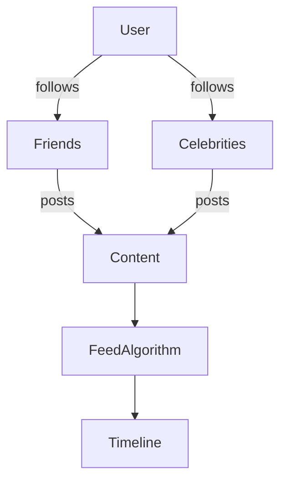

# 📱 Social Platforms

Social platforms share one defining challenge: **connecting millions of users and their content with sub-200ms latency**.

## The Social Graph Problem

| Problem | Key Challenge | Difficulty |
|---------|---------------|-----------|
| [Twitter](./twitter) | Fan-out to 100M followers | 🟡 Medium |
| [Instagram](./instagram) | Photo storage, CDN, explore page | 🟡 Medium |
| [Reddit](./reddit) | Voting system, hot ranking, communities | 🟡 Medium |
| [Spotify](./spotify) | Music streaming, recommendations, playlists | 🟡 Medium |
| [Pastebin](./pastebin) | Text storage, expiry, search | 🟢 Easy |

## Recurring Patterns

1. **Fan-out problem**: Celebrities with 100M followers create write amplification
2. **Timeline generation**: Pull vs push vs hybrid — the fundamental trade-off
3. **Social graph storage**: SQL fails at 10B+ relationships — use adjacency lists
4. **Content ranking**: Sorting by recency is easy; ranking by engagement requires ML
