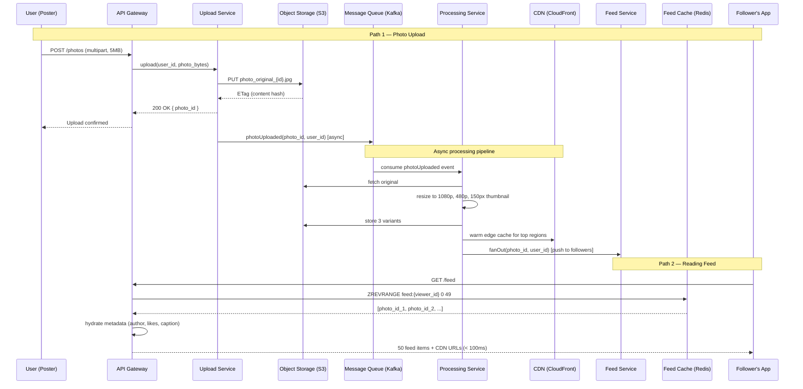
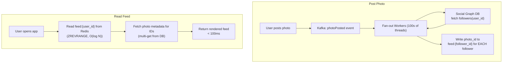
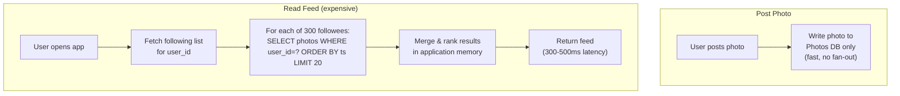
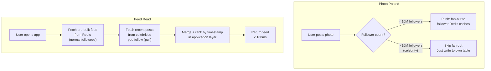
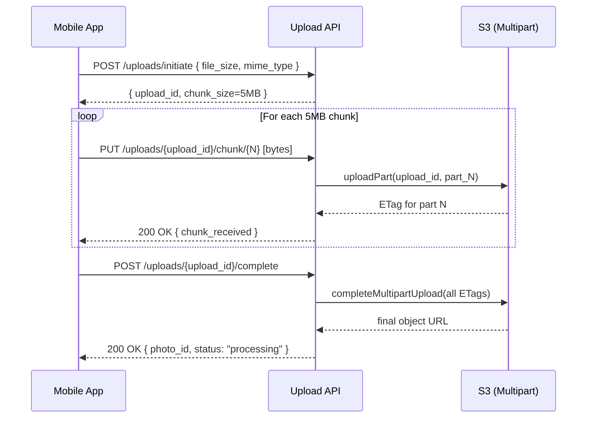
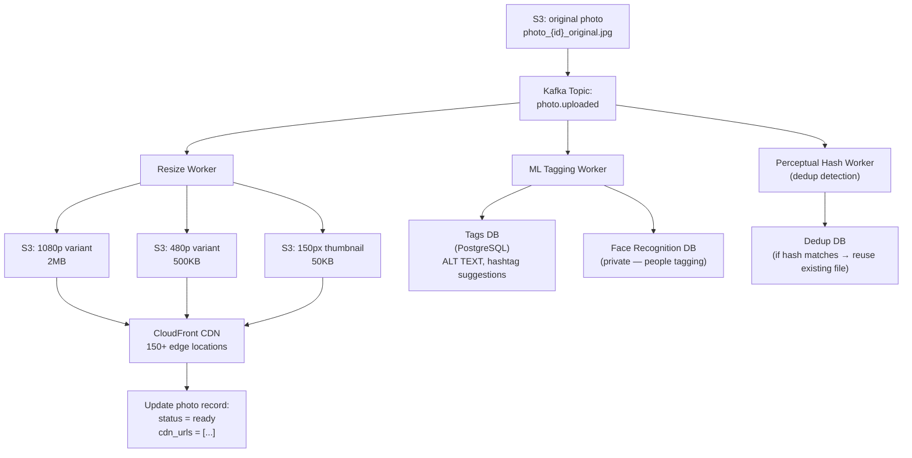
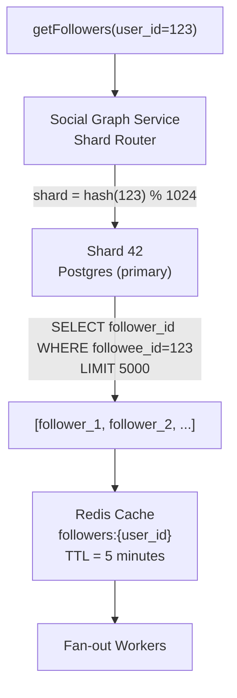
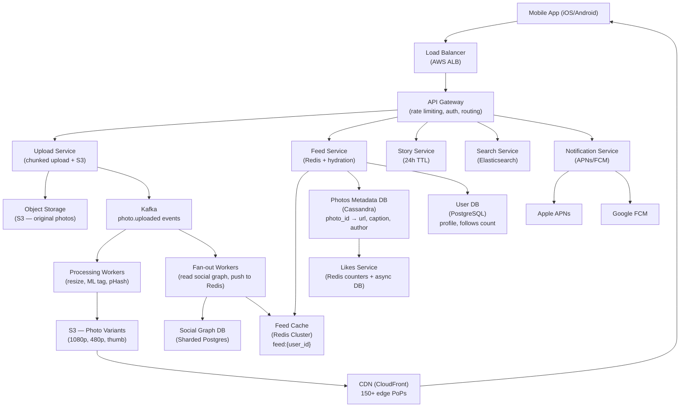
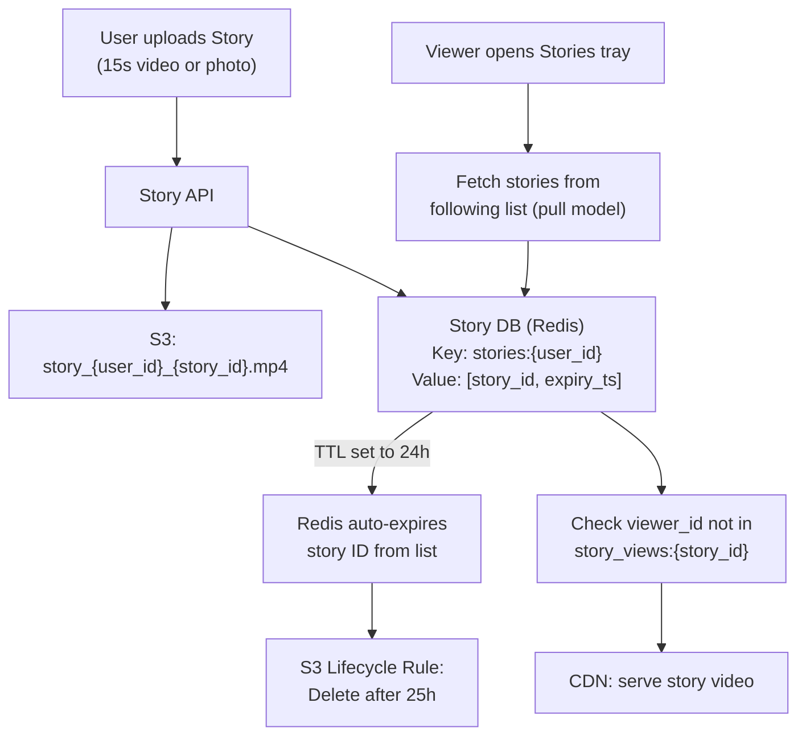

# Design Instagram — Photo Feed at 1 Billion Users

**Difficulty**: 🟡 Intermediate → 🔴 Advanced
**Reading Time**: ~40 minutes
**Interview Frequency**: Very High — top 5 system design questions at Meta, Google, and Amazon
**The Core Problem**: 500M daily active users each want their personalized photo feed in under 100ms — while 100M new photos are uploaded every single day. How do you serve reads at 10x the write volume without melting your infrastructure?

---

## Table of Contents

1. [The Mental Model — Two Flows](#1-the-mental-model)
2. [Requirements with Numbers](#2-requirements-with-numbers)
3. [Capacity Estimation](#3-capacity-estimation)
4. [Deep Dive 1 — Feed Architecture: Push vs Pull vs Hybrid](#4-deep-dive-1--feed-architecture)
5. [Deep Dive 2 — Photo Upload & Processing Pipeline](#5-deep-dive-2--photo-upload--processing-pipeline)
6. [Deep Dive 3 — The Follow Graph at Scale](#6-deep-dive-3--the-follow-graph-at-scale)
7. [Full System Architecture](#7-full-system-architecture)
8. [Stories Architecture](#8-stories-architecture)
9. [Explore & Discovery — ML Ranking](#9-explore--discovery)
10. [Photo Storage — Content-Addressed + CDN](#10-photo-storage)
11. [Problems at Scale](#11-problems-at-scale)
12. [Interview Questions Mapped](#12-interview-questions-mapped)
13. [Key Takeaways](#13-key-takeaways)
14. [Related Concepts](#14-related-concepts)

---

## 1. The Mental Model

Instagram has two fundamentally different flows that must be designed independently. Every architectural decision flows from which flow you're optimizing.



**The key insight**: photo upload and feed delivery are completely decoupled. You get a `200 OK` in ~500ms for the upload. The fan-out to followers' feeds happens asynchronously over the next 2-5 seconds via Kafka workers. Feed reads hit Redis first — the database is rarely touched for hot content.

---

## 2. Requirements with Numbers

### Functional Requirements

| Feature | Description |
|---------|-------------|
| Photo Upload | Upload photos up to 15MB; videos up to 60 seconds (650MB) |
| Feed | Personalized reverse-chronological feed from followed accounts |
| Follow / Unfollow | Directed relationships (A follows B, B may not follow A) |
| Like / Comment | Engagement on photos; like counts visible; top comments shown |
| Stories | 15-second photo/video clips that expire after 24 hours |
| Explore | ML-ranked discovery feed of content from non-followed accounts |
| Search | User search by handle; hashtag search; location search |
| Notifications | Likes, comments, follows, mentions |
| Direct Messages | Private photo/video messages between users |

### Non-Functional Requirements

| Metric | Target | Rationale |
|--------|--------|-----------|
| Daily Active Users | 500M DAU | Instagram Q4 2023 public figure |
| Monthly Active Users | 1B MAU | Meta investor report |
| Photo uploads | 100M photos/day | Public estimate from Instagram |
| Feed reads | 5B reads/day = **58,000 reads/sec** | 10 feed loads/day × 500M DAU |
| Upload throughput | 100M/day = **1,160 uploads/sec** | Avg; peak ~5x |
| Feed latency | **< 100ms** p99 | Mobile UX threshold |
| Upload latency | **< 2s** for confirmation | UX research: >3s = 40% abandonment |
| Availability | **99.99%** = 52 min downtime/year | Social media SLA |
| Storage (new) | **500TB/day** | 100M photos × 5MB avg |
| Consistency | Eventual — < 5 seconds lag acceptable | Users tolerate minor staleness |

---

## 3. Capacity Estimation

### Upload Volume

```
Photos:           100M uploads/day ÷ 86,400 sec = 1,160 uploads/sec
Peak (5x):        ~5,800 uploads/sec (dinner time, events, NYE)
Avg photo size:   5MB (JPEG, compressed from ~10MB raw)
```

### Storage Requirements

```
Per photo (3 variants stored):
  Original:        5MB
  1080p (display): 2MB
  480p (thumb):    500KB
  150px preview:   50KB
  Total per upload: ~7.5MB

Daily raw storage:
  100M × 7.5MB = 750TB/day

With replication (3x across 3 AZs):
  750TB × 3 = 2.25PB/day new storage

5-year cumulative:
  2.25PB × 365 × 5 = ~4.1EB total
```

### Feed Read Volume

```
Feed reads: 500M DAU × 10 sessions/day × 1 feed load = 5B reads/day
Per second: 5B ÷ 86,400 = 58,000 reads/sec
Peak:       58,000 × 3 = 174,000 reads/sec
```

### Cache Memory Estimate

```
Per user, cache the last 800 photo IDs in feed:
  800 IDs × 8 bytes = 6.4KB per user
  500M active users (but only ~50M concurrently active):
  50M × 6.4KB = 320GB Redis cache
  (4 Redis nodes × 128GB = enough)
```

### Bandwidth

```
CDN egress per photo view:
  480p thumb served on scroll = 500KB
  Full 1080p on tap = 2MB

Feed page load (50 thumbs):
  50 × 500KB = 25MB per session
  58,000 sessions/sec × 25MB = 1.45TB/sec egress
  (CDN absorbs ~95% → origin sees ~72GB/sec)
```

---

## 4. Deep Dive 1 — Feed Architecture

The feed generation problem is the central design challenge of Instagram. Three approaches exist — and Instagram uses a hybrid of the first two.

### Approach A: Fan-out on Write (Push Model)

When a user posts, immediately write the photo ID to the feed cache of every follower.



**Pseudocode**:
```
function fanOut(photo_id, poster_id):
    followers = socialGraphDB.getFollowers(poster_id)  // may be millions
    for each follower_id in followers:
        redis.zadd(
            key = "feed:" + follower_id,
            score = timestamp_ms,
            member = photo_id
        )
        redis.zremrangebyrank("feed:" + follower_id, 0, -801)  // keep last 800
```

**Trade-offs**:

| Dimension | Fan-out on Write |
|-----------|-----------------|
| Read latency | ✅ < 10ms (Redis only) |
| Write latency | ❌ Slow for celebrities: 400M followers × Redis write = hours |
| Storage | ❌ High: 400M × 8 bytes = 3.2GB per celebrity post |
| Freshness | ✅ Immediate after fan-out completes |
| Works for? | Users with < 1M followers |

### Approach B: Fan-out on Read (Pull Model)

When a user opens the feed, query who they follow and fetch their recent posts at read time.



**Trade-offs**:

| Dimension | Fan-out on Read |
|-----------|----------------|
| Read latency | ❌ 300-500ms — 300 DB queries per feed load |
| Write latency | ✅ Instant — just write to own table |
| Storage | ✅ Minimal — no denormalization |
| Works for? | Low-traffic systems, celebrity accounts (< 10K sessions/sec) |

### Approach C: Hybrid (Instagram's Actual Approach)

Use push for normal users (< 10M followers). Use pull for celebrities (> 10M followers). Merge at read time.



**Pseudocode**:
```
function readFeed(user_id, limit=50):
    // Step 1: pre-built feed (normal users)
    pre_built = redis.zrevrange("feed:" + user_id, 0, 199)

    // Step 2: pull from celebrities you follow
    celebrities = getCelebrityFollowing(user_id)  // cached, small list
    celeb_posts = []
    for celeb_id in celebrities:
        posts = photosDB.getRecentPosts(celeb_id, limit=20)
        celeb_posts.extend(posts)

    // Step 3: merge and return top 50
    all_posts = merge(pre_built, celeb_posts)
    return sortByTimestamp(all_posts)[:limit]
```

**Comparison Table**:

| Approach | Read Latency | Write Cost | Celebrity Safe | Storage Cost |
|----------|-------------|------------|----------------|--------------|
| Push only | < 10ms | O(followers) | ❌ No | High |
| Pull only | 300-500ms | O(1) | ✅ Yes | Low |
| **Hybrid** | **< 100ms** | **O(normal followers)** | **✅ Yes** | **Medium** |

**Instagram uses the hybrid approach**. The threshold for "celebrity" treatment is approximately 10M followers (not public, estimated from engineering talks).

---

## 5. Deep Dive 2 — Photo Upload & Processing Pipeline

A photo upload is not a single operation. It's a multi-stage pipeline that must be resilient to partial failures at each stage.

### Stage 1: Chunked Upload

Large files (15MB photos, 650MB videos) are uploaded in chunks to handle network interruptions.



**Why chunked?**
- A 15MB upload on 4G (10 Mbps) takes ~12 seconds. Mid-transfer disconnects are common.
- S3 Multipart Upload allows resuming from the last completed chunk.
- Each chunk is independently checksummed (ETag = MD5) for integrity.

### Stage 2: Async Processing Pipeline

After the original file lands in S3, a Kafka event triggers the processing pipeline.



**Pseudocode for resize worker**:
```
function processPhoto(photo_id):
    original = s3.get("photo_{photo_id}_original.jpg")

    variants = [
        { suffix: "1080p", width: 1080, quality: 85 },
        { suffix: "480p",  width: 480,  quality: 80 },
        { suffix: "thumb", width: 150,  quality: 75 },
    ]

    for variant in variants:
        resized = imageLib.resize(original, width=variant.width)
        compressed = imageLib.compress(resized, quality=variant.quality)
        key = f"photo_{photo_id}_{variant.suffix}.jpg"
        s3.put(key, compressed)
        cdn.invalidate(key)  // warm edge cache proactively

    photosDB.update(photo_id, status="ready", cdn_urls=buildUrls(photo_id))
    kafka.emit("photo.ready", { photo_id })  // triggers feed fan-out
```

### Content-Addressed Storage & Deduplication

```
Perceptual hash (pHash): converts image to 64-bit fingerprint based on visual content
Two photos with pHash distance < 10 → considered duplicates

Algorithm:
  1. Resize to 32×32 grayscale
  2. Apply DCT (discrete cosine transform)
  3. Take top-left 8×8 = 64 values
  4. Compare each to median → 64-bit hash

Storage savings at Instagram scale:
  ~5% of uploads are re-uploads of existing content
  100M/day × 5% = 5M dedup events/day × 7.5MB = 37.5TB saved/day
```

### Trade-off: Sync vs Async Processing

| Approach | Latency to User | Complexity | Failure Handling |
|----------|----------------|------------|-----------------|
| Synchronous (resize before 200 OK) | 3-8 seconds | Low | Simple — user sees error |
| **Async (Kafka + workers)** | **< 500ms for 200 OK** | **Medium** | **Retry queue, DLQ** |
| Hybrid (thumb sync, variants async) | ~1s for preview | Medium | Mixed |

Instagram uses **fully async**: you see a placeholder/blur immediately, full resolution loads within 5 seconds.

---

## 6. Deep Dive 3 — The Follow Graph at Scale

The social graph (who follows whom) is queried on every feed load, every notification, every fan-out. It must handle 1B users × avg 300 follows each = 300B edges.

### Data Model Options

**Option A: Adjacency List in Relational DB**

```sql
-- Follows table
CREATE TABLE follows (
    follower_id  BIGINT NOT NULL,
    followee_id  BIGINT NOT NULL,
    created_at   TIMESTAMP NOT NULL,
    PRIMARY KEY (follower_id, followee_id)
);

-- Index for "get all followers of user X"
CREATE INDEX idx_followee ON follows(followee_id, follower_id);
```

Query: `SELECT follower_id FROM follows WHERE followee_id = ?`
- At 300B rows, a single PostgreSQL table scan is infeasible.
- Sharding required.

**Option B: Graph Database (Neo4j)**

Native graph traversal. `MATCH (a:User)-[:FOLLOWS]->(b:User {id: X}) RETURN a.id`
- Excellent for multi-hop queries (friends of friends, suggestions)
- Does not scale to 300B edges without significant infrastructure
- Instagram does **not** use Neo4j for the core follow graph

**Option C: Sharded Adjacency List (Instagram's approach)**



**Sharding key**: shard by `followee_id` (not `follower_id`). This ensures "who follows me" queries land on one shard.

**Pseudocode**:
```
function getFollowers(user_id, limit=10000):
    cache_key = "followers:" + user_id
    cached = redis.get(cache_key)
    if cached: return cached

    shard_id = hash(user_id) % NUM_SHARDS
    conn = socialGraphDB.shard(shard_id)
    followers = conn.query(
        "SELECT follower_id FROM follows WHERE followee_id = ? LIMIT ?",
        [user_id, limit]
    )

    redis.setex(cache_key, ttl=300, value=followers)  // 5-min TTL
    return followers
```

**Denormalization for fast fan-out**:
Instagram pre-computes and caches:
- `following_count:{user_id}` — how many people does this user follow
- `follower_count:{user_id}` — how many followers (for celebrity detection)
- `is_celebrity:{user_id}` — boolean, cached, updated when follower_count crosses threshold

**Comparison Table**:

| Approach | Query Speed | Sharding | Multi-hop | Best For |
|----------|------------|----------|-----------|----------|
| Relational single table | Slow at 300B rows | Manual | Poor | < 100M users |
| Graph DB (Neo4j) | Fast for hops | Complex | Excellent | Recommendation engine |
| **Sharded adjacency list** | **Fast (indexed)** | **Hash-based** | **Poor** | **Core follow graph** |
| Redis sorted sets | Fastest | Native cluster | None | Small follow lists |

---

## 7. Full System Architecture



**Key technology choices**:

| Component | Technology | Reason |
|-----------|-----------|--------|
| Photo storage | S3 | Durable, cheap ($0.023/GB/month), geo-replication built-in |
| Feed cache | Redis Cluster | O(log N) sorted set ops; horizontal sharding |
| Photo metadata | Cassandra | Wide-column; high write throughput; time-series friendly |
| Social graph | Sharded Postgres | Strong consistency for follow/unfollow; shardable |
| Search index | Elasticsearch | Full-text search, faceting for hashtag/location |
| Message bus | Kafka | Durable, replayable, fan-out to multiple consumers |
| CDN | CloudFront | 150+ PoPs; S3 origin integration; signed URLs for private content |

---

## 8. Stories Architecture

Stories are architecturally different from the main feed in three important ways:
1. Hard TTL of 24 hours (content must be deleted after expiry)
2. Served in order of recency, not ranked by ML
3. Much higher upload volume per user (multiple stories/day vs 1-2 posts/week)



**Why pull model for Stories (vs hybrid for feed)?**
- Stories expire in 24h → fan-out cost is wasted if user never opens app
- Stories tray is a separate UI element — users explicitly navigate to it
- The following list is typically < 1000 accounts → pull is cheap (< 1000 Redis gets)

**TTL implementation**:
```
On story upload:
  redis.zadd("stories:{user_id}", score=expiry_ts, member=story_id)

On story read:
  now = current_timestamp()
  redis.zremrangebyscore("stories:{user_id}", 0, now)  // remove expired
  stories = redis.zrange("stories:{user_id}", 0, -1)

S3 lifecycle rule:
  DELETE objects with prefix "story_" older than 25h
```

---

## 9. Explore & Discovery

The Explore tab is Instagram's ML-powered discovery feed. It shows content from accounts you don't follow, ranked by predicted engagement.

### Data Flow

```mermaid
graph LR
    UserActions["User actions:\nlikes, saves, time-on-photo,\ncomments, shares"] --> EventStream["Kafka: user.event"]

    EventStream --> FeaturePipeline["Feature Pipeline\n(Spark Streaming)"]
    FeaturePipeline --> FeatureStore["Feature Store\n(Redis + S3)"]

    FeatureStore --> RankModel["Ranking Model\n(Instagram uses two-tower neural net)"]
    RankModel --> Candidates["Candidate Pool:\n~1M photos for your interest profile"]

    Candidates --> Ranker["Real-time Ranker\n(score each candidate)"]
    Ranker --> Top50["Top 50 photos\nfor Explore grid"]
    Top50 --> ExploreCache["Explore Cache\n(Redis, TTL=10min)"]
    ExploreCache --> MobileApp["Mobile App\nExplore Grid"]
```



**Two-stage ranking** (used by Instagram, documented in public ML papers):
1. **Retrieval** (stage 1): Approximate Nearest Neighbor search over embeddings to get ~1M candidates in < 10ms
2. **Ranking** (stage 2): Full neural network scores ~1M candidates in < 100ms using interest graph, engagement signals

---

## 10. Photo Storage

### Content-Addressed Storage

Photos are stored with content-derived keys (not sequential IDs):

```
key = "photos/" + sha256(photo_bytes) + ".jpg"

Benefits:
  1. Deduplication: identical photos map to same key → stored once
  2. Cache-friendly: same hash = same content = safe to cache forever (no versioning)
  3. Integrity: key IS the checksum — corruption detectable at any time
```

### CDN Edge Strategy

```
Cache-Control: public, max-age=31536000, immutable

Rationale:
  - Photos never change (only new uploads; no in-place edits)
  - max-age=1 year means CDN serves directly without origin check
  - "immutable" tells browser not to revalidate even on hard refresh
  - User privacy: photo access via signed URL expires in 1 hour
    (prevents sharing CDN URLs to access private photos)
```

**CDN geographic distribution**:
- CloudFront has 450+ PoPs globally
- Top 5% most-viewed photos are proactively pushed to all PoPs
- Long-tail photos served on cache-miss from S3 origin (~40ms p99)

---

## 11. Problems at Scale

### Problem 1: Celebrity Post Causing 400M Cache Writes

**Scenario**: Selena Gomez (400M followers) posts a photo. The fan-out service tries to write to 400M Redis keys simultaneously.

**What happens**:
```
400M writes × 1ms Redis op = 400,000 seconds = 4.6 days of single-thread work
Even with 1,000 fan-out workers: 400,000 / 1,000 = 400 seconds = 6.7 minutes lag
```

**Root cause**: Push fan-out does not scale to celebrity follower counts. Cache write storm saturates Redis cluster.

**Fix (Instagram's hybrid model)**:
```
if follower_count(user_id) > CELEBRITY_THRESHOLD:  // ~10M
    skip_fanout()
    // Store just the post ID in a "celebrity_posts:{user_id}" key
    // At read time, merge celebrity posts from DB with pre-built Redis feed
else:
    fanout_to_followers()
```

Celeb posts are fetched fresh at read time from a fast celebrities-only table (small, well-cached). Cost: one extra Redis ZRANGE per celebrity you follow at feed-load time.

---

### Problem 2: Photo Upload Losing Data Mid-Transfer

**Scenario**: User uploads a 15MB photo on a subway with intermittent connectivity. Connection drops at 11MB (73% complete). The partial upload is lost.

**Root cause**: Single-request HTTP upload has no resumability. Any network blip starts the upload from scratch.

**Fix (Resumable Chunked Upload)**:
```
Upload flow:
  1. Client: POST /uploads/initiate → gets upload_id
  2. Client: uploads 5MB chunks (5MB × 3 = 15MB)
  3. Server: stores each chunk to S3 Multipart Upload
  4. On disconnect: client queries GET /uploads/{upload_id}/status
     → server responds: { chunks_received: [0, 1], missing: [2] }
  5. Client: re-uploads only chunk 2
  6. Client: POST /uploads/{upload_id}/complete

Recovery: Client stores upload_id in local SQLite. On app restart, checks for incomplete uploads.
```

Result: A 15MB upload on unstable 4G requires at most one 5MB chunk retransmission instead of full 15MB restart.

---

### Problem 3: Feed Serving Stale Data After Unfollow

**Scenario**: User unfollows an account. But the pre-built Redis feed still contains photo IDs from that user. User sees posts from someone they unfollowed for up to 5 minutes.

**Root cause**: The push feed cache is not invalidated on unfollow. Feed reads serve the cached (now stale) data.

**Fix (Lazy Invalidation + Filter)**:
```
Option A (simple): On unfollow, add unfollow_event to Redis
  "unfollowed:{user_id}" = set of recently unfollowed user_ids

  At read time:
    feed = redis.zrevrange("feed:" + user_id, 0, 199)
    unfollowed = redis.smembers("unfollowed:" + user_id)
    filtered = [p for p in feed if author(p) not in unfollowed]
    return filtered[:50]

  Expire the unfollowed set after 24h (cache TTL window)

Option B (expensive but clean): Delete photo IDs from feed cache on unfollow
  Scan feed:{user_id}, remove any photo_id where author = unfollowed_user
  Cost: O(feed_size) Redis scan per unfollow — acceptable for infrequent operation
```

Instagram uses **option A** (filter at read time) for its simplicity and O(1) write cost.

---

## 12. Interview Questions Mapped

| Question | What It Tests | Level |
|----------|---------------|-------|
| "How would you design the Instagram feed?" | Fan-out architecture, push vs pull tradeoffs | Mid (L5) |
| "What happens when a celebrity with 400M followers posts?" | Celebrity problem, hybrid model | Senior (L6) |
| "How do you handle photo uploads on slow mobile networks?" | Chunked upload, resumability, idempotency | Mid (L5) |
| "How do you shard the social graph?" | Sharding strategies, shard key selection | Senior (L6) |
| "How does Instagram Explore work?" | ML pipeline, two-stage ranking, feature store | Staff (L7) |
| "How do Stories differ architecturally from the main feed?" | TTL, pull vs push, separate data stores | Mid (L5) |
| "How do you handle photo deduplication at 100M uploads/day?" | Content-addressed storage, perceptual hashing | Senior (L6) |
| "How do you ensure a photo upload is not lost?" | Chunked upload, idempotency, resumability | Mid (L5) |
| "How would you design Instagram's CDN strategy?" | CDN architecture, cache headers, signed URLs | Senior (L6) |

---

## 13. Key Takeaways

- **Hybrid fan-out (push < 10M followers, pull for celebrities) is the core architectural insight** — push gives < 10ms feed reads for 99% of users, pull handles the 1% celebrity edge case. Instagram's actual threshold is estimated ~10M followers.
- **Photo storage at 100M uploads/day = 750TB/day raw; 2.25PB/day with 3x replication** — content-addressed storage (SHA-256 keying) enables deduplication (~5% reduction) and makes CDN cache headers trivially correct (immutable).
- **Feed cache requires only 320GB Redis for 50M concurrent users** (800 photo IDs × 8 bytes × 50M = 320GB) — the feed is IDs only; hydration (metadata, CDN URLs) happens in a separate DB multi-get.
- **Chunked upload in 5MB segments enables resumability** — on a 15MB photo, a disconnect at 11MB means re-uploading only the last 5MB chunk, not starting over; this reduces retransmission by up to 66%.
- **Stories use a pull model (not push)** — because 24h TTL means fan-out write cost is wasted if the follower never opens the app; the following list is small enough (< 1000 accounts) that pull reads are fast.

---

## 14. Related Concepts

- [Design Twitter](./twitter) — Similar fan-out problem with text content; Instagram's hybrid model is directly analogous to Twitter's
- [Notification System](../03-communication/notification-system) — Instagram notifications (likes, comments, follows) share the multi-channel delivery architecture
- [Rate Limiter](../05-infrastructure/rate-limiter) — Instagram's upload API uses token bucket rate limiting per user (60 uploads/hour)
- [Design WhatsApp](../03-communication/whatsapp-messenger) — Direct messaging architecture overlaps with Instagram DMs

## 📚 Resources & References

| Resource | Type | What You'll Learn |
|----------|------|------------------|
| [System Design Interview — Alex Xu](https://www.amazon.com/System-Design-Interview-insiders-Second/dp/B08CMF2CQF) | 📚 Book | Chapter on designing Instagram — photo storage, news feed, search |
| [ByteByteGo — Design Instagram](https://www.youtube.com/@ByteByteGo) | 📺 YouTube | Search "Instagram system design" — feed, storage, and CDN architecture |
| [Instagram Engineering: What Powered Instagram](https://instagram-engineering.com/what-powers-instagram-hundreds-of-millions-of-users-1cdbe8a58e7b) | 📖 Blog | Original architecture post — PostgreSQL, Redis, and early scaling decisions |
| [Instagram Engineering: Sharding at Scale](https://instagram-engineering.com/sharding-ids-at-instagram-1cf5a71e5a5c) | 📖 Blog | How Instagram generates unique IDs and shards data across thousands of servers |
| [High Scalability: Instagram Architecture](http://highscalability.com/instagram-architecture-14-million-users-terabytes-photos-hundreds-of-instances-dozens-of-technologies) | 📖 Blog | Detailed Instagram architecture breakdown from early scaling phase |
