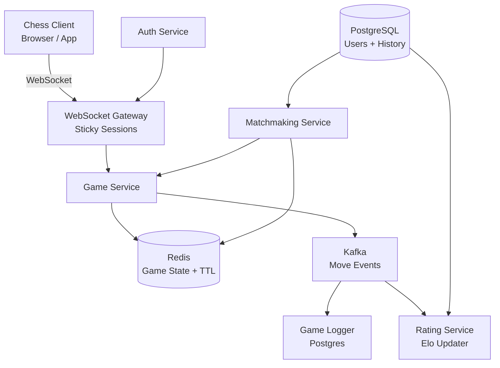
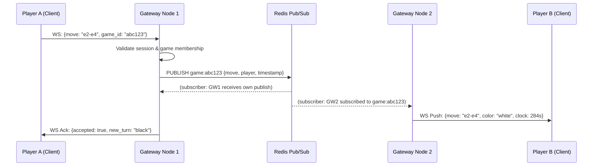
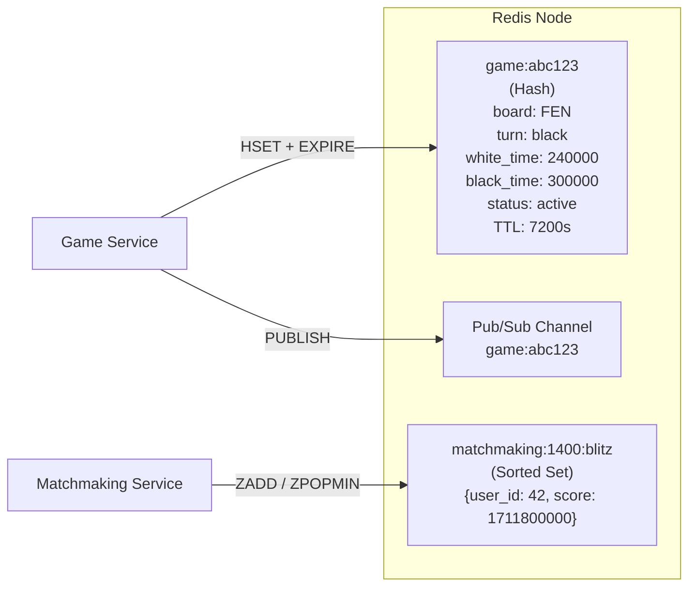

# Design an Online Chess Platform

**Difficulty**: 🟡 Intermediate
**Reading Time**: ~25 minutes
**The Core Problem**: How do you synchronize real-time chess moves between two players across the globe with < 100ms latency while handling 1M concurrent games?

---

## Table of Contents

1. [Requirements](#1-requirements)
2. [Capacity Estimation](#2-capacity-estimation)
3. [High-Level Architecture](#3-high-level-architecture)
4. [Core Components](#4-core-components)
5. [Matchmaking System](#5-matchmaking-system)
6. [Move Validation & Game State](#6-move-validation--game-state)
7. [Elo Rating System](#7-elo-rating-system)
8. [Game History Storage](#8-game-history-storage)
9. [Key Design Decisions](#9-key-design-decisions)
10. [Interview Questions](#10-interview-questions)
11. [Key Takeaways](#11-key-takeaways)
12. [References](#12-references)

---

## 1. Requirements

### Functional
- Players can register, log in, and maintain an Elo rating
- Matchmaking pairs two players of similar skill (±100 Elo)
- Real-time move synchronization between players (< 100ms)
- Server-side move validation (illegal moves rejected)
- Game clock enforcement (bullet 1min, blitz 5min, rapid 15min)
- Game history persisted for replay and analysis
- Spectator mode for watching ongoing games

### Non-Functional
- **Scale**: 1M concurrent games, 10M daily active players
- **Latency**: Move propagation < 100ms end-to-end
- **Availability**: 99.99% uptime (chess games cannot be interrupted)
- **Durability**: Every move persisted; game state recoverable after crash

---

## 2. Capacity Estimation

| Metric | Estimate |
|--------|----------|
| Daily active players | 10M |
| Concurrent games | 1M |
| Average game duration | 10 minutes |
| Moves per game | ~60 |
| Move events per second | 1M games × 60 moves / 600s = **100k moves/sec** |
| WebSocket connections | 2M (2 players per game) + spectators ≈ **3M connections** |
| Game state size (Redis) | 1 game ≈ 512 bytes → 1M × 512B = **512 MB** |
| Move storage/day | 100k × 86400 × ~50 bytes = **430 GB/day** |

---

## 3. High-Level Architecture



---

## 4. Core Components

### WebSocket Gateway
- Each gateway node handles ~10k persistent WebSocket connections
- Sticky sessions via load balancer (consistent hashing on game_id)
- Heartbeat ping every 30s to detect stale connections
- Fallback: Server-Sent Events for read-only spectators

### Game Service
- Stateless service; game state lives entirely in Redis
- Receives move from Player A → validates → publishes to Player B → persists event
- Enforces clock: decrement active player's remaining time on each move

### Redis Game State Schema
```
key: game:{game_id}
value (Hash):
  board: "rnbqkbnr/pppppppp/..."  # FEN notation
  turn: "white" | "black"
  white_player: user_id
  black_player: user_id
  white_time_ms: 300000
  black_time_ms: 300000
  status: "active" | "completed" | "abandoned"
  last_move_ts: 1711800000000

TTL: 2 hours (auto-cleanup for abandoned games)
```

---

## 5. Matchmaking System

### Elo Bucket Strategy
```
Player requests match →
  1. Determine Elo band: floor(elo / 100) * 100  → e.g., Elo 1423 → bucket 1400
  2. Check Redis queue for bucket [1300, 1400, 1500]  (±100 Elo)
  3. If found → pair immediately, create game
  4. If not found → add to queue with timestamp
  5. Every 10s → expand search to ±200 Elo if waiting > 30s
  6. Every 30s → expand to any Elo if waiting > 2 minutes
```

### Matchmaking Queue (Redis)
```
key: matchmaking:{elo_bucket}:{time_control}
type: Sorted Set
score: timestamp (FIFO within bucket)
member: user_id
```

### Game Creation Flow
```
1. Pop 2 players from queue
2. Generate game_id (UUID)
3. Initialize game state in Redis (SET game:{game_id} ...)
4. Notify both players via WebSocket: { game_id, color_assignment }
5. Redirect clients to game room
```

---

## 6. Move Validation & Game State

**Critical decision**: All validation is server-side. Never trust the client.

### Move Validation Steps
```
Client sends: { game_id, from: "e2", to: "e4", promotion: null }

Server validates:
  1. Is it the player's turn? (check Redis game:{id}.turn)
  2. Is the move legal? (run chess engine validation)
  3. Does the move leave the king in check? (illegal)
  4. Special moves: en passant, castling, promotion
  5. If valid → update board FEN in Redis
  6. Push move to Kafka topic: chess-moves
  7. Send updated state to both players via WebSocket
  8. If invalid → return error to sender only
```

### Clock Management
```
On each valid move:
  elapsed = now_ms - last_move_ts
  current_player.time_ms -= elapsed
  if current_player.time_ms <= 0:
    end_game(winner = opponent, reason = "timeout")
  last_move_ts = now_ms
  switch turn
```

---

## 7. Elo Rating System

Elo is updated **after** game completion, not during.

### Elo Formula
```
Expected score:  Ea = 1 / (1 + 10^((Rb - Ra) / 400))
New rating:      Ra' = Ra + K * (Sa - Ea)

K-factor:
  - Provisional (< 30 games): K = 40
  - Standard: K = 20
  - Top players (Elo > 2400): K = 10

Sa = 1 (win), 0.5 (draw), 0 (loss)
```

### Rating Update Flow
```
Game ends → Kafka event: { game_id, winner, loser, result }
Rating Service consumes event:
  1. Fetch current ratings from PostgreSQL
  2. Compute new ratings
  3. UPDATE users SET elo = new_elo WHERE id = ?
  4. INSERT INTO rating_history (user_id, game_id, old_elo, new_elo, delta, ts)
```

---

## 8. Game History Storage

### PostgreSQL Schema
```sql
CREATE TABLE games (
  game_id     UUID PRIMARY KEY,
  white_id    BIGINT REFERENCES users(id),
  black_id    BIGINT REFERENCES users(id),
  result      VARCHAR(10),    -- 'white', 'black', 'draw', 'abandoned'
  time_control VARCHAR(20),   -- 'bullet', 'blitz', 'rapid'
  pgn         TEXT,           -- Standard PGN notation of all moves
  started_at  TIMESTAMPTZ,
  ended_at    TIMESTAMPTZ,
  white_elo   INT,
  black_elo   INT
);

CREATE INDEX ON games(white_id);
CREATE INDEX ON games(black_id);
CREATE INDEX ON games(started_at);
```

PGN (Portable Game Notation) stores the complete game in standard format, enabling replay and engine analysis.

---

## 9. Key Design Decisions

| Decision | Option A | Option B | Choice & Reason |
|----------|----------|----------|-----------------|
| Real-time transport | WebSocket | Long Polling | **WebSocket** — persistent connection, < 100ms latency vs 1–2s for long poll |
| Game state storage | Redis (in-memory) | PostgreSQL | **Redis** — sub-ms read/write; PostgreSQL too slow for 100k moves/sec |
| Move validation | Server-side | Client-side | **Server-side** — clients can be compromised; never trust input |
| Rating update timing | After game | After each move | **After game** — Elo is a game-level metric, not move-level |
| Abandoned game cleanup | TTL (Redis) | Cron job | **TTL** — automatic, no extra job; set 2-hour TTL on game state |

---

## 10. Interview Questions

| Question | Key Answer |
|----------|-----------|
| Why WebSockets over HTTP? | Bidirectional, persistent — server can push moves without polling |
| How do you handle a disconnected player? | Grace period (60s): opponent's clock continues; player can reconnect and resume |
| How do you prevent cheating (engine use)? | Move time analysis, third-party anti-cheat (like Chess.com's Fair Play), behavioral fingerprinting |
| How does matchmaking scale? | Redis sorted sets per Elo bucket; horizontally scale Matchmaking Service |
| What happens if Game Service crashes mid-game? | Redis persisted game state; client reconnects, reloads state from Redis |
| How do you handle 3M WebSocket connections? | Horizontal scaling of gateway nodes; each handles ~10k connections |

---

## 11. Key Takeaways

- **WebSocket is mandatory** for sub-100ms bidirectional move sync — long polling adds 1–2s latency
- **Redis game state with TTL** handles 1M concurrent games in ~512MB — auto-cleans abandoned games
- **Server-side move validation** is non-negotiable — client-side is trivially bypassed
- **Elo buckets in Redis sorted sets** enable O(log N) matchmaking with ±100 Elo precision
- **Kafka decouples** the hot move path from slow operations (rating updates, game logging)

---

---

## Component Deep Dive 1: WebSocket Gateway — Real-Time Move Transport

The WebSocket Gateway is the most critical architectural component in an online chess platform. Every move, clock update, and game-state change flows through it. Getting this wrong means lost moves, dropped connections, and corrupted game state — all catastrophic for user trust.

### How It Works Internally

Each WebSocket Gateway node maintains a long-lived TCP connection per client. Unlike HTTP, where each request creates a new connection, WebSocket performs a single HTTP Upgrade handshake and then holds the socket open indefinitely. This is essential for chess: a 10-minute blitz game exchanges ~60 moves, each requiring < 100ms round-trip. With HTTP polling, you'd incur at minimum a 200ms RTT per poll cycle — simply too slow.

The Gateway is stateful at the connection level but stateless at the application level. It knows "connection C belongs to game G and player P" but it delegates all game logic to the Game Service. This separation allows Game Service to scale horizontally while Gateways stay focused on connection management.

**Sticky sessions via consistent hashing** on `game_id` ensure both players in the same game always land on the same Gateway node. This matters because the Gateway must fan-out a move from Player A to Player B without a cross-node network hop. Without stickiness, Player B's move would arrive at Gateway-1, need to be forwarded to Gateway-2 where Player A is connected, adding ~5ms latency and introducing a single point of failure.

### Why Naive Approaches Fail at Scale

A naive approach uses a single-server architecture where one process holds all WebSocket connections. At 3M connections, a single Node.js process running out of file descriptors (default Linux limit: 65,535) crashes the entire platform. Raising `ulimit -n` to 1M helps but doesn't solve the fundamental problem: 3M connections at 100k events/sec means 100k context switches per second on a single CPU.

Horizontal scaling introduces the **cross-node fan-out problem**: when Player A on Gateway-1 makes a move, how does the Gateway know Player B is on Gateway-2? Solving this requires a pub/sub broker (Redis or Kafka) as a shared message bus between gateway nodes.



| Approach | Latency | Throughput | Trade-off |
|----------|---------|------------|-----------|
| Single node, all connections | < 1ms fan-out | ~50k conn/node ceiling | No horizontal scale; SPOF at ~65k connections |
| Multi-node + Redis Pub/Sub | 1–3ms fan-out | 500k+ conn total | Redis becomes bottleneck at 1M+ games; needs Redis Cluster |
| Multi-node + Kafka | 5–15ms fan-out | Millions of conn | Higher latency from Kafka batch flushing; better for async paths |

For chess, Redis Pub/Sub wins at the move-delivery layer. Its fire-and-forget model adds only 1–3ms. Kafka is reserved for durable move logging and downstream consumers (rating updates, analysis engines) that can tolerate 5–15ms.

### Connection Lifecycle and Heartbeats

Each connection registers on the Gateway with a mapping `{connection_id → {game_id, player_id, role}}`. A heartbeat PING frame is sent every 30 seconds. If no PONG is received within 10 seconds, the connection is marked stale and closed. The Game Service is notified, starting a 60-second grace period during which the opponent's clock continues running and the player may reconnect.

---

## Component Deep Dive 2: Redis Game State — In-Memory Consistency at 100k Writes/Sec

Redis is the system's hot path. Every move — 100,000 per second at peak — triggers at least one Redis HSET and one Redis PUBLISH. Understanding how Redis handles this load, and where it breaks, is critical for passing a senior system design interview.

### Internal Mechanics

Each game is stored as a Redis Hash (not a JSON string). Hashes allow partial field updates: updating `turn` and `white_time_ms` without rewriting the entire board FEN. At 512 bytes per game and 1M concurrent games, the working set is ~512MB — well within a single Redis node's memory (typically 32–128GB). This means no sharding is needed until you exceed ~200M concurrent games.

The **TTL auto-cleanup** mechanism deserves attention. Setting a 2-hour TTL on game keys means abandoned games (player disconnects and never reconnects) clean themselves up without a cron job. However, a naive TTL approach has a pitfall: every valid move should reset the TTL to prevent an active game from expiring. This requires calling `EXPIRE game:{id} 7200` on each successful move write — a two-command sequence that should be wrapped in a Lua script for atomicity.



### Scale Behavior at 10x Load

At 10x baseline (1M → 10M concurrent games), the working set grows to 5GB — still fits in one node. But the write rate becomes 1M writes/sec, approaching Redis's single-threaded command throughput ceiling of ~1–2M ops/sec. At this point, two mitigations apply:

1. **Redis Pipeline**: Batch HSET + EXPIRE into a single pipeline call, halving round-trips from 2 ops to 1 network round-trip.
2. **Redis Cluster with slot-based sharding**: Shard game keys across 16,384 slots. With 6 nodes (3 primary + 3 replica), each node handles ~167k writes/sec — well within limits.

The Pub/Sub channel for cross-gateway fan-out is the harder scaling problem. Redis Pub/Sub is single-threaded per channel; at 1M messages/sec across all game channels, you need to shard channels across Redis Cluster nodes. This is automatic when using Redis Cluster because `PUBLISH game:{game_id}` routes to the node owning that slot.

---

## Component Deep Dive 3: Matchmaking Service — O(log N) Pairing

Matchmaking seems simple but has subtle failure modes at scale that trip up candidates in interviews.

### Technical Design

The matchmaking queue uses Redis Sorted Sets, keyed by `matchmaking:{elo_bucket}:{time_control}`. The score is the Unix timestamp (milliseconds), giving FIFO ordering within each Elo band. To find a match, the service calls `ZPOPMIN matchmaking:1400:blitz 1` — an atomic pop that removes the highest-priority (longest-waiting) player.

The **Elo band expansion** algorithm uses a background worker that scans players waiting > 30 seconds and migrates them to a broader bucket. This is implemented as a Redis sorted set of "aging players": `matchmaking:aging` with score = enqueue_timestamp. A cron-like worker running every 10 seconds uses `ZRANGEBYSCORE` to find players waiting too long and re-queues them in expanded bands.

**Race condition protection**: Two matchmaking pods must not both pop the same player and form different games. Redis sorted set operations are atomic at the command level, so `ZPOPMIN` is inherently safe. The risk is in the multi-step "pop two players → create game" sequence. If the service crashes between step 1 (pop player A) and step 2 (pop player B), player A is lost from the queue. This is mitigated by a Lua script that atomically pops two players from potentially different buckets in a single round-trip:

```lua
-- Atomic: pop one player from each of two adjacent buckets
local p1 = redis.call('ZPOPMIN', KEYS[1], 1)
local p2 = redis.call('ZPOPMIN', KEYS[2], 1)
if #p1 == 0 or #p2 == 0 then
  -- Re-push whichever was popped; return nil
  if #p1 > 0 then redis.call('ZADD', KEYS[1], p1[2], p1[1]) end
  if #p2 > 0 then redis.call('ZADD', KEYS[2], p2[2], p2[1]) end
  return nil
end
return {p1[1], p2[1]}
```

At 10M DAU with peak 2M matchmaking requests per hour (~556/sec), the matchmaking service handles the load trivially. Redis sorted set operations are O(log N) where N is the number of players in a bucket — with ~100 Elo buckets and ~20,000 waiting players per bucket at peak, this is O(log 20,000) ≈ 15 operations, negligible.

---

## Data Model

### Full PostgreSQL Schema

```sql
-- Users table with Elo rating
CREATE TABLE users (
    user_id       BIGSERIAL PRIMARY KEY,
    username      VARCHAR(32) UNIQUE NOT NULL,
    email         VARCHAR(255) UNIQUE NOT NULL,
    password_hash VARCHAR(128) NOT NULL,
    elo_bullet    SMALLINT DEFAULT 1200,
    elo_blitz     SMALLINT DEFAULT 1200,
    elo_rapid     SMALLINT DEFAULT 1200,
    games_played  INT DEFAULT 0,
    created_at    TIMESTAMPTZ DEFAULT now(),
    last_seen_at  TIMESTAMPTZ
);

CREATE INDEX idx_users_elo_blitz ON users(elo_blitz);
CREATE INDEX idx_users_last_seen ON users(last_seen_at);

-- Game records (written once at game end)
CREATE TABLE games (
    game_id       UUID PRIMARY KEY DEFAULT gen_random_uuid(),
    white_id      BIGINT NOT NULL REFERENCES users(user_id),
    black_id      BIGINT NOT NULL REFERENCES users(user_id),
    result        VARCHAR(10) NOT NULL CHECK (result IN ('white', 'black', 'draw', 'abandoned')),
    termination   VARCHAR(20) NOT NULL,  -- 'checkmate', 'timeout', 'resignation', 'stalemate'
    time_control  VARCHAR(10) NOT NULL CHECK (time_control IN ('bullet', 'blitz', 'rapid', 'classical')),
    time_secs     SMALLINT NOT NULL,     -- base time in seconds (60, 300, 900, etc.)
    increment_secs SMALLINT DEFAULT 0,  -- increment per move in seconds
    pgn           TEXT NOT NULL,        -- Full PGN with headers and move list
    fen_final     VARCHAR(100),         -- FEN of final position (for analysis)
    total_moves   SMALLINT,
    white_elo_before SMALLINT NOT NULL,
    black_elo_before SMALLINT NOT NULL,
    white_elo_after  SMALLINT NOT NULL,
    black_elo_after  SMALLINT NOT NULL,
    started_at    TIMESTAMPTZ NOT NULL,
    ended_at      TIMESTAMPTZ NOT NULL
);

CREATE INDEX idx_games_white ON games(white_id, started_at DESC);
CREATE INDEX idx_games_black ON games(black_id, started_at DESC);
CREATE INDEX idx_games_started ON games(started_at DESC);
CREATE INDEX idx_games_time_control ON games(time_control, started_at DESC);

-- Individual moves for analysis and replay (optional; PGN covers replay)
CREATE TABLE moves (
    move_id       BIGSERIAL PRIMARY KEY,
    game_id       UUID NOT NULL REFERENCES games(game_id),
    move_number   SMALLINT NOT NULL,       -- 1-based half-move (ply) count
    player_id     BIGINT NOT NULL REFERENCES users(user_id),
    uci_notation  VARCHAR(5) NOT NULL,     -- e.g. 'e2e4', 'e7e8q' (promotion)
    san_notation  VARCHAR(8),             -- e.g. 'e4', 'Nf3', 'O-O'
    fen_after     VARCHAR(100),           -- Position after move (for analysis)
    clock_ms      INT NOT NULL,           -- Player's remaining clock after move
    move_time_ms  INT NOT NULL,           -- Time taken for this move
    is_capture    BOOLEAN DEFAULT FALSE,
    is_check      BOOLEAN DEFAULT FALSE,
    played_at     TIMESTAMPTZ NOT NULL
);

CREATE INDEX idx_moves_game ON moves(game_id, move_number);

-- Rating history for sparkline charts
CREATE TABLE rating_history (
    history_id    BIGSERIAL PRIMARY KEY,
    user_id       BIGINT NOT NULL REFERENCES users(user_id),
    game_id       UUID NOT NULL REFERENCES games(game_id),
    time_control  VARCHAR(10) NOT NULL,
    elo_before    SMALLINT NOT NULL,
    elo_after     SMALLINT NOT NULL,
    delta         SMALLINT NOT NULL,
    recorded_at   TIMESTAMPTZ NOT NULL
);

CREATE INDEX idx_rating_history_user ON rating_history(user_id, recorded_at DESC);
```

### Redis Key Schema

```
# Active game state
game:{game_id}                    → Hash (board FEN, clocks, turn, status)
game:{game_id}:moves              → List (ordered move history for reconnect replay)

# Matchmaking queues
matchmaking:{elo_bucket}:{time_control}   → Sorted Set (score=enqueue_ts, member=user_id)
matchmaking:waiting:{user_id}             → String (game preferences JSON, TTL=5min)
matchmaking:aging                         → Sorted Set (score=enqueue_ts, for expansion worker)

# Pub/Sub channels (ephemeral, no persistence needed)
game:{game_id}                    → Pub/Sub channel for real-time move fan-out
```

---

## Scale Bottlenecks

| Traffic Level | Component That Breaks | Symptoms | Mitigation |
|---|---|---|---|
| **10x baseline** (1M → 10M concurrent games) | Redis single-node write throughput | Move ACKs slow from < 1ms to 5–10ms; Redis CPU > 90% | Redis Cluster (6 nodes); pipeline HSET+EXPIRE; read from replicas |
| **10x baseline** | WebSocket Gateway (connection count) | Gateway OOM; connections dropped; clients see disconnects | Scale gateway pods from 300 to 3,000; each handles 10k connections |
| **100x baseline** (100M concurrent games) | Redis memory (100M × 512B = 50GB) | Redis evicts active games; game state lost mid-game | Redis Cluster with 20+ nodes; hot-standby Redis for durability |
| **100x baseline** | Kafka consumer lag (Rating Service) | Elo updates delayed hours; leaderboards stale | Scale Rating Service consumer group; partition chess-moves topic by user_id shard |
| **100x baseline** | PostgreSQL game writes | Write throughput > 50k games/min at game-end bursts; replication lag > 1s | Partition `games` table by `started_at` month; use Citus for sharding; async write via Kafka |
| **1000x baseline** (1B concurrent games — theoretical) | Network bandwidth on Gateway nodes | Each gateway pushes 10k events/sec; 1Gbps NIC saturates at ~12k events/sec | 10GbE NICs; connection multiplexing; compress move payloads (< 50 bytes vs 200 bytes JSON) |
| **1000x baseline** | Matchmaking Redis sorted sets | Single bucket has millions of entries; ZPOPMIN degrades | Hierarchical buckets (coarse + fine); distribute matchmaking across regional clusters |

---

## How Chess.com Built This

Chess.com is the world's largest chess platform, serving over 150 million registered users and 10 million daily active players as of 2024. Their engineering team has published specifics through conference talks and the High Scalability blog.

**Technology stack**: Chess.com runs on PHP (Laravel) for their web application layer — a choice that surprises many engineers who expect Go or Node.js for a real-time platform. The real-time layer uses WebSockets over their own C-based server infrastructure, not a standard framework. This custom C WebSocket server handles 1–2 million concurrent WebSocket connections on a cluster of about 50 physical machines.

**Game state in Redis**: Chess.com uses Redis heavily for live game state, with their Redis cluster holding the in-memory state of every active game. At 10M games per day, with average 10-minute duration, they have roughly 70,000 concurrent games at any off-peak moment and up to 1M+ during peak tournament events like the Titled Tuesday series (which regularly sees 50,000–100,000 simultaneous players).

**The non-obvious architectural decision**: Chess.com performs server-side move validation using Stockfish — not just a lightweight legal-move checker. Every move submitted by a client is validated against the full Stockfish engine to ensure legal board state. This adds ~2ms per move on server hardware but makes it impossible to submit invalid positions through API manipulation. For anti-cheat, they separately run a statistical analysis pipeline on completed games, comparing move sequences against Stockfish's top engine choices. A human scoring > 95% correlation with Stockfish top-1 moves across 50+ moves triggers a fair-play review.

**Scale numbers**: 10M games per day at ~60 moves per game = 600M move events per day, or ~7,000 moves/sec average with peaks of ~100,000 moves/sec during major tournament events. Their Kafka cluster handles this move event stream for downstream consumers including the game archive database, the analysis engine queue, and the anti-cheat pipeline.

**Source**: [How Chess.com Scaled to Millions of Concurrent Users — High Scalability](https://highscalability.com/how-chess-com-scaled-to-millions-of-concurrent-users/)

---

## Interview Angle

**What the interviewer is testing:** Whether you understand bidirectional real-time communication at scale, specifically how to route messages between two specific clients without broadcasting to all connections — and whether you can identify where state must live to survive process failures.

**Common mistakes candidates make:**

1. **Using HTTP polling or long polling for moves.** Some candidates propose polling at 100ms intervals, which introduces 100–200ms latency in the best case, doubled round-trips, and server-side overhead of 3M requests/sec instead of 100k events/sec. The interviewer will ask "what's the move latency?" and a polling answer reveals the misunderstanding.

2. **Storing game state only in the application server's memory.** If the Game Service crashes mid-game, in-memory state is lost. Candidates who say "I'll store it in the server" miss that stateless services scale; stateful services are a liability. The correct answer is Redis — sub-millisecond, shared across pods, and auto-recoverable on reconnect.

3. **Validating moves on the client side.** This is the most dangerous mistake to propose. Client-side validation is trivially bypassed with browser devtools. Any client can send `{from: "e1", to: "e8", piece: "queen"}` and claim it's legal. Server-side validation with a proper chess engine is non-negotiable.

**The insight that separates good from great answers:** Recognizing that the WebSocket Gateway must use a shared pub/sub channel (Redis Pub/Sub or Kafka) between gateway nodes — not just route Player A's move to the Game Service and back. The naive design assumes Player A and Player B always connect to the same gateway node, which is impossible to guarantee at scale with load balancers. The sophisticated design acknowledges cross-node fan-out is unavoidable and designs the Gateway as a thin pub/sub proxy with the Game Service owning all business logic.

---

## Key Numbers to Remember

| Metric | Value | Context |
|--------|-------|---------|
| Move events/sec at 1M concurrent games | 100,000 moves/sec | 1M games × 60 moves ÷ 600s average game |
| WebSocket connections | 3M+ | 2M players + ~1M spectators at peak |
| Redis game state size | 512 bytes/game | FEN board (~90B) + clocks + metadata |
| Redis working set at 1M games | 512 MB | Fits on a single node; no sharding needed under 200M games |
| Redis write throughput ceiling | ~1–2M ops/sec | Single-threaded; need cluster beyond 1M concurrent games |
| Chess.com peak moves/sec | ~100,000 moves/sec | During major tournament events (Titled Tuesday) |
| Chess.com daily games | 10M games/day | ~600M move events/day |
| Elo K-factor (new players) | K=40 | First 30 games; converges to K=20 standard |
| Grace period on disconnect | 60 seconds | Opponent's clock runs; player can reconnect and resume |
| Matchmaking expansion threshold | 30 seconds wait → ±200 Elo | Beyond 30s, search band widens to avoid indefinite wait |

---

## 📚 Resources & References

| Resource | Type | What You'll Learn |
|----------|------|------------------|
| [How Chess.com Scales to Millions](https://highscalability.com/how-chess-com-scaled-to-millions-of-concurrent-users/) | 📖 Blog | Production chess scaling patterns |
| [ByteByteGo — Real-Time Gaming Systems](https://www.youtube.com/@ByteByteGo) | 📺 YouTube | WebSocket and game state architecture |
| [WebSockets vs SSE on AWS](https://aws.amazon.com/blogs/architecture/what-to-use-when-websockets-vs-server-sent-events/) | 📖 Blog | Transport protocol tradeoffs |
| [Elo Rating System Explained](https://en.wikipedia.org/wiki/Elo_rating_system) | 📚 Book | Mathematical foundation of Elo |
