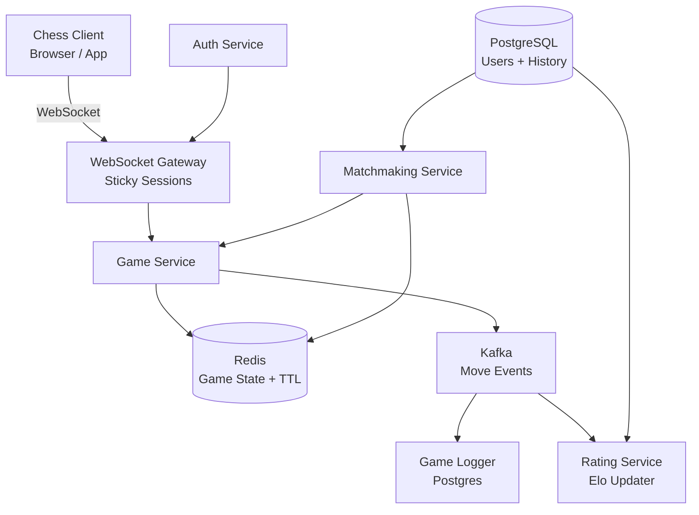

# Design an Online Chess Platform

**Difficulty**: 🟡 Intermediate
**Reading Time**: ~25 minutes
**The Core Problem**: How do you synchronize real-time chess moves between two players across the globe with < 100ms latency while handling 1M concurrent games?

---

## Table of Contents

1. [Requirements](#1-requirements)
2. [Capacity Estimation](#2-capacity-estimation)
3. [High-Level Architecture](#3-high-level-architecture)
4. [Core Components](#4-core-components)
5. [Matchmaking System](#5-matchmaking-system)
6. [Move Validation & Game State](#6-move-validation--game-state)
7. [Elo Rating System](#7-elo-rating-system)
8. [Game History Storage](#8-game-history-storage)
9. [Key Design Decisions](#9-key-design-decisions)
10. [Interview Questions](#10-interview-questions)
11. [Key Takeaways](#11-key-takeaways)
12. [References](#12-references)

---

## 1. Requirements

### Functional
- Players can register, log in, and maintain an Elo rating
- Matchmaking pairs two players of similar skill (±100 Elo)
- Real-time move synchronization between players (< 100ms)
- Server-side move validation (illegal moves rejected)
- Game clock enforcement (bullet 1min, blitz 5min, rapid 15min)
- Game history persisted for replay and analysis
- Spectator mode for watching ongoing games

### Non-Functional
- **Scale**: 1M concurrent games, 10M daily active players
- **Latency**: Move propagation < 100ms end-to-end
- **Availability**: 99.99% uptime (chess games cannot be interrupted)
- **Durability**: Every move persisted; game state recoverable after crash

---

## 2. Capacity Estimation

| Metric | Estimate |
|--------|----------|
| Daily active players | 10M |
| Concurrent games | 1M |
| Average game duration | 10 minutes |
| Moves per game | ~60 |
| Move events per second | 1M games × 60 moves / 600s = **100k moves/sec** |
| WebSocket connections | 2M (2 players per game) + spectators ≈ **3M connections** |
| Game state size (Redis) | 1 game ≈ 512 bytes → 1M × 512B = **512 MB** |
| Move storage/day | 100k × 86400 × ~50 bytes = **430 GB/day** |

---

## 3. High-Level Architecture



---

## 4. Core Components

### WebSocket Gateway
- Each gateway node handles ~10k persistent WebSocket connections
- Sticky sessions via load balancer (consistent hashing on game_id)
- Heartbeat ping every 30s to detect stale connections
- Fallback: Server-Sent Events for read-only spectators

### Game Service
- Stateless service; game state lives entirely in Redis
- Receives move from Player A → validates → publishes to Player B → persists event
- Enforces clock: decrement active player's remaining time on each move

### Redis Game State Schema
```
key: game:{game_id}
value (Hash):
  board: "rnbqkbnr/pppppppp/..."  # FEN notation
  turn: "white" | "black"
  white_player: user_id
  black_player: user_id
  white_time_ms: 300000
  black_time_ms: 300000
  status: "active" | "completed" | "abandoned"
  last_move_ts: 1711800000000

TTL: 2 hours (auto-cleanup for abandoned games)
```

---

## 5. Matchmaking System

### Elo Bucket Strategy
```
Player requests match →
  1. Determine Elo band: floor(elo / 100) * 100  → e.g., Elo 1423 → bucket 1400
  2. Check Redis queue for bucket [1300, 1400, 1500]  (±100 Elo)
  3. If found → pair immediately, create game
  4. If not found → add to queue with timestamp
  5. Every 10s → expand search to ±200 Elo if waiting > 30s
  6. Every 30s → expand to any Elo if waiting > 2 minutes
```

### Matchmaking Queue (Redis)
```
key: matchmaking:{elo_bucket}:{time_control}
type: Sorted Set
score: timestamp (FIFO within bucket)
member: user_id
```

### Game Creation Flow
```
1. Pop 2 players from queue
2. Generate game_id (UUID)
3. Initialize game state in Redis (SET game:{game_id} ...)
4. Notify both players via WebSocket: { game_id, color_assignment }
5. Redirect clients to game room
```

---

## 6. Move Validation & Game State

**Critical decision**: All validation is server-side. Never trust the client.

### Move Validation Steps
```
Client sends: { game_id, from: "e2", to: "e4", promotion: null }

Server validates:
  1. Is it the player's turn? (check Redis game:{id}.turn)
  2. Is the move legal? (run chess engine validation)
  3. Does the move leave the king in check? (illegal)
  4. Special moves: en passant, castling, promotion
  5. If valid → update board FEN in Redis
  6. Push move to Kafka topic: chess-moves
  7. Send updated state to both players via WebSocket
  8. If invalid → return error to sender only
```

### Clock Management
```
On each valid move:
  elapsed = now_ms - last_move_ts
  current_player.time_ms -= elapsed
  if current_player.time_ms <= 0:
    end_game(winner = opponent, reason = "timeout")
  last_move_ts = now_ms
  switch turn
```

---

## 7. Elo Rating System

Elo is updated **after** game completion, not during.

### Elo Formula
```
Expected score:  Ea = 1 / (1 + 10^((Rb - Ra) / 400))
New rating:      Ra' = Ra + K * (Sa - Ea)

K-factor:
  - Provisional (< 30 games): K = 40
  - Standard: K = 20
  - Top players (Elo > 2400): K = 10

Sa = 1 (win), 0.5 (draw), 0 (loss)
```

### Rating Update Flow
```
Game ends → Kafka event: { game_id, winner, loser, result }
Rating Service consumes event:
  1. Fetch current ratings from PostgreSQL
  2. Compute new ratings
  3. UPDATE users SET elo = new_elo WHERE id = ?
  4. INSERT INTO rating_history (user_id, game_id, old_elo, new_elo, delta, ts)
```

---

## 8. Game History Storage

### PostgreSQL Schema
```sql
CREATE TABLE games (
  game_id     UUID PRIMARY KEY,
  white_id    BIGINT REFERENCES users(id),
  black_id    BIGINT REFERENCES users(id),
  result      VARCHAR(10),    -- 'white', 'black', 'draw', 'abandoned'
  time_control VARCHAR(20),   -- 'bullet', 'blitz', 'rapid'
  pgn         TEXT,           -- Standard PGN notation of all moves
  started_at  TIMESTAMPTZ,
  ended_at    TIMESTAMPTZ,
  white_elo   INT,
  black_elo   INT
);

CREATE INDEX ON games(white_id);
CREATE INDEX ON games(black_id);
CREATE INDEX ON games(started_at);
```

PGN (Portable Game Notation) stores the complete game in standard format, enabling replay and engine analysis.

---

## 9. Key Design Decisions

| Decision | Option A | Option B | Choice & Reason |
|----------|----------|----------|-----------------|
| Real-time transport | WebSocket | Long Polling | **WebSocket** — persistent connection, < 100ms latency vs 1–2s for long poll |
| Game state storage | Redis (in-memory) | PostgreSQL | **Redis** — sub-ms read/write; PostgreSQL too slow for 100k moves/sec |
| Move validation | Server-side | Client-side | **Server-side** — clients can be compromised; never trust input |
| Rating update timing | After game | After each move | **After game** — Elo is a game-level metric, not move-level |
| Abandoned game cleanup | TTL (Redis) | Cron job | **TTL** — automatic, no extra job; set 2-hour TTL on game state |

---

## 10. Interview Questions

| Question | Key Answer |
|----------|-----------|
| Why WebSockets over HTTP? | Bidirectional, persistent — server can push moves without polling |
| How do you handle a disconnected player? | Grace period (60s): opponent's clock continues; player can reconnect and resume |
| How do you prevent cheating (engine use)? | Move time analysis, third-party anti-cheat (like Chess.com's Fair Play), behavioral fingerprinting |
| How does matchmaking scale? | Redis sorted sets per Elo bucket; horizontally scale Matchmaking Service |
| What happens if Game Service crashes mid-game? | Redis persisted game state; client reconnects, reloads state from Redis |
| How do you handle 3M WebSocket connections? | Horizontal scaling of gateway nodes; each handles ~10k connections |

---

## 11. Key Takeaways

- **WebSocket is mandatory** for sub-100ms bidirectional move sync — long polling adds 1–2s latency
- **Redis game state with TTL** handles 1M concurrent games in ~512MB — auto-cleans abandoned games
- **Server-side move validation** is non-negotiable — client-side is trivially bypassed
- **Elo buckets in Redis sorted sets** enable O(log N) matchmaking with ±100 Elo precision
- **Kafka decouples** the hot move path from slow operations (rating updates, game logging)

---

## 📚 Resources & References

| Resource | Type | What You'll Learn |
|----------|------|------------------|
| [How Chess.com Scales to Millions](https://highscalability.com/how-chess-com-scaled-to-millions-of-concurrent-users/) | 📖 Blog | Production chess scaling patterns |
| [ByteByteGo — Real-Time Gaming Systems](https://www.youtube.com/@ByteByteGo) | 📺 YouTube | WebSocket and game state architecture |
| [WebSockets vs SSE on AWS](https://aws.amazon.com/blogs/architecture/what-to-use-when-websockets-vs-server-sent-events/) | 📖 Blog | Transport protocol tradeoffs |
| [Elo Rating System Explained](https://en.wikipedia.org/wiki/Elo_rating_system) | 📚 Book | Mathematical foundation of Elo |
