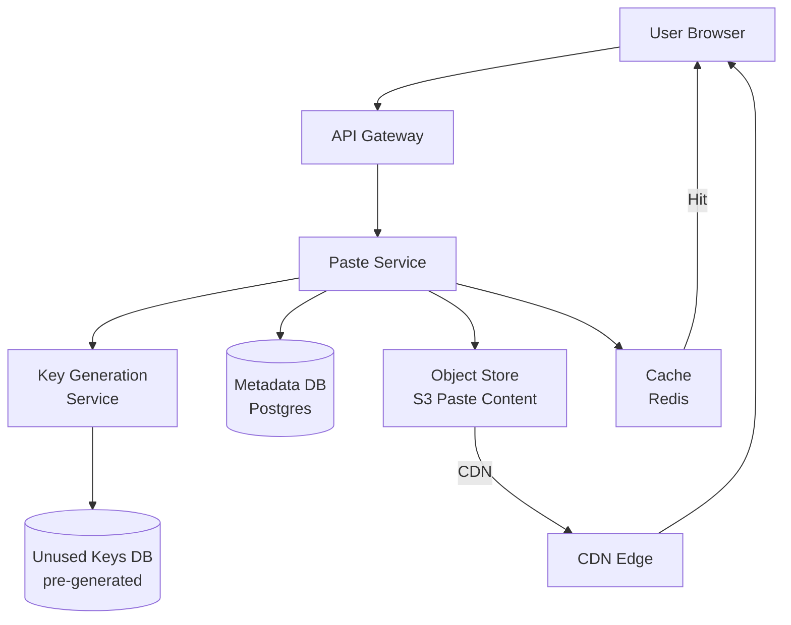
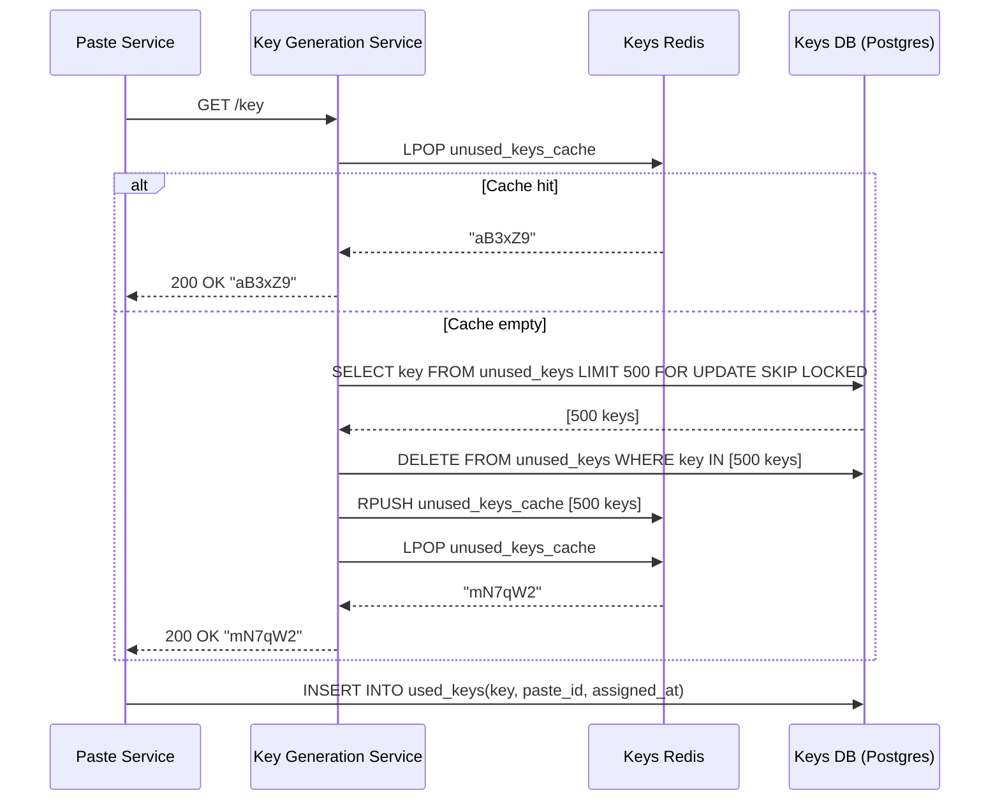
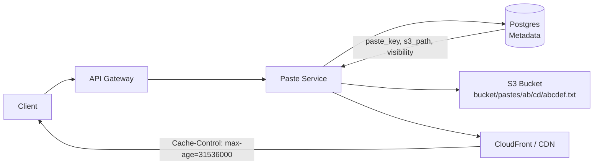
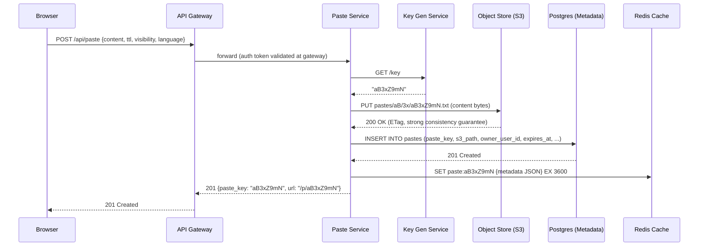

# Design Pastebin — Text Storage with Short URLs

**Difficulty**: 🟢 Beginner
**Reading Time**: Coming Soon
**Interview Frequency**: Medium

---

> 🚧 **Full article coming soon.** This stub gives you the essentials to start thinking about this problem.

---

## The Core Problem

Storing text pastes (code snippets, logs, notes) with unique short keys and supporting 100:1 read-to-write ratios seems simple until you hit key collision at scale: with 1M pastes/day, random 6-char base62 keys have a 0.1% collision chance after 100M pastes. Key generation strategy is the central design question.

## Functional Requirements

- Users can create text pastes and receive a unique short URL
- Pastes can optionally expire (1 hour, 1 day, 1 week, never)
- Pastes can be public (anyone can read) or private (only creator)
- Support syntax highlighting for code pastes

## Non-Functional Requirements

| Requirement | Target |
|-------------|--------|
| Availability | 99.9% (8.7 hrs downtime/year) |
| Read latency | p99 < 100ms |
| Write latency | p99 < 500ms |
| Scale | 1M new pastes/day, 100M reads/day |

## Back-of-Envelope Estimates

- **Storage**: 1M pastes/day × 10KB avg paste = 10GB/day → ~3.6TB/year
- **Read throughput**: 100M reads/day ÷ 86,400 = ~1,160 reads/sec (easily cached)
- **Key space**: 6 chars base62 = 62^6 = 56B unique keys — enough for decades

## Key Design Decisions

1. **Key Generation: Pre-generated vs Hash** — hashing paste content gives deterministic dedup but collision detection requires DB lookup; pre-generating a pool of unused keys from a Key Generation Service (KGS) eliminates race conditions and is faster at write time.
2. **S3 for Paste Content** — metadata (key, owner, expiry, visibility) in a relational DB; actual paste content in S3/object storage; keeps DB small (metadata only) and content cheap to store and CDN-cached.
3. **TTL via Scheduled Cleanup** — don't delete on expiry timestamp; use a background worker that scans for expired pastes nightly; mark as deleted in DB first, then asynchronously delete from S3 to avoid partial failures.

## High-Level Architecture



## Top Interview Questions for This Problem

| Question | Tests |
|----------|-------|
| How do you prevent two users from getting the same paste key? | Key collision, atomic reservation |
| How would you implement paste expiration without scanning the whole table? | TTL, background workers, lazy deletion |
| How do you handle a popular paste getting 1M views in an hour? | CDN caching, read scaling |

## Related Concepts

- [URL Shortener system design](../../../16-system-design-problems/01-data-processing/url-shortener)
- [Object storage vs database for blob content](../06-storage-files/file-sharing)

---

*📚 Full deep-dive with multiple approaches, trade-off tables, and pseudocode continues below.*

---

## Component Deep Dive 1: Key Generation Service (KGS)

The Key Generation Service is the most critical — and most commonly misunderstood — component in a Pastebin-style system. It is the single mechanism that guarantees every paste gets a globally unique short identifier without race conditions, retry storms, or hot-spot contention.

### Why Naive Approaches Fail

The most intuitive approach is to generate a random 6-character base62 key at write time and then do a database lookup to confirm uniqueness. This works fine at low scale but breaks down for three reasons:

1. **Read-before-write creates a race condition**: two concurrent requests can both read "key X is free" and both attempt to insert, causing a duplicate-key violation on one of them. Retrying on conflict adds variable latency and, at 100 writes/sec, retries happen several times per minute.
2. **Key exhaustion is invisible**: you only discover collision rates are rising when errors start spiking. There is no headroom signal.
3. **Hash-based deduplication adds false coupling**: hashing paste content to derive the key means two identical pastes get the same key, conflating deduplication with key generation. This makes expiration logic ambiguous — if two users share a key, whose expiry wins?

### The KGS Pattern

The Key Generation Service pre-generates a large pool of random base62 keys (typically 10–50 million) and stores them in two tables: `unused_keys` and `used_keys`. When the Paste Service needs a key, it calls KGS which atomically moves one key from unused to used and returns it. Atomicity is achieved with a `SELECT FOR UPDATE` or Redis `LPOP` (atomic list pop), not application-level locking.

KGS instances can also cache a small batch of keys in memory (e.g., 1,000 keys per instance) on startup. Keys in memory are "claimed" — if the instance crashes before assigning them, those keys are abandoned (wasted but not reused). With 56 billion possible 6-char base62 keys, wasting a few thousand on crashes is operationally fine.

### KGS Internal Flow



### Trade-off Comparison

| Approach | Write Latency | Collision Risk | Complexity | Notes |
|----------|--------------|----------------|------------|-------|
| Random key + DB uniqueness check | 5–20ms extra per retry | ~0.1% at 100M pastes | Low | Gets worse as key space fills |
| Hash of paste content | 2–5ms (hash compute) | Zero (deterministic) | Low | Breaks expiry, conflates dedup with identity |
| KGS pre-generated pool | < 1ms overhead | Zero | Medium | Best for production; needs KGS HA setup |
| UUID (128-bit) | 0ms | Negligible | Minimal | Keys are long (22+ chars); defeats "short URL" goal |

---

## Component Deep Dive 2: Content Storage Split (Metadata DB + Object Store)

One of the most important architectural decisions in a Pastebin is separating metadata from content. Storing the full paste text in Postgres alongside metadata columns is a common mistake — it works at 100k pastes but degrades sharply beyond that.

### Why Storing Content in the Database Fails at Scale

A Postgres row with a 50KB TEXT column puts pressure on several subsystems simultaneously:

- **WAL bloat**: every write is fully logged in the Write-Ahead Log, including the large text payload. At 1M pastes/day with 10KB average size, WAL generation hits ~115MB/sec — 4x the typical threshold before replication lag grows.
- **Buffer pool eviction**: large rows crowd out index pages and metadata rows from the shared buffer pool, causing cache hit rate to drop from 99% toward 80% as paste count grows.
- **Vacuum pressure**: updates (e.g., incrementing a view counter) create dead tuples even if only a tiny metadata column changed. With 50KB rows, VACUUM must read and rewrite large blocks.

### Object Storage Architecture

The correct split is: all metadata lives in Postgres (< 500 bytes per row, easily cached, indexed), and all paste content lives in S3-compatible object storage (cheap at scale, served via CDN, no DB pressure).

The key insight is that paste content is **immutable after creation**. This makes object storage ideal — there are no updates, only creates and deletes. S3's strong read-after-write consistency (added in December 2020) means a paste is immediately readable after upload without any eventual-consistency delay.

At 10x load (10M pastes/day), the metadata DB grows by ~5GB/year (500 bytes × 10M × 365 = ~1.8TB/year — plan for sharding at 50M+ pastes). Object storage scales linearly with no operational overhead.

### Object Storage Request Flow



For public pastes, the CDN serves content directly from edge nodes — the Paste Service is never in the read path after the first fetch. For private pastes, the service generates a signed S3 URL with a 15-minute expiry and returns it directly to the authenticated user; the CDN is bypassed.

---

## Component Deep Dive 3: Expiration and Cleanup Strategy

Paste expiration is deceptively complex. The wrong implementation causes either missed deletes (expired content stays live), thundering herd (a batch job hits the DB at midnight), or partial failures (metadata deleted but S3 object persists).

### Soft Delete + Async Object Deletion Pattern

The correct strategy is a two-phase deletion:

1. **Soft delete in metadata DB**: a background worker runs every 5 minutes, querying `WHERE expires_at < NOW() AND deleted_at IS NULL LIMIT 5000`. It sets `deleted_at = NOW()` in a bulk UPDATE. This is fast because `expires_at` is indexed, and the LIMIT prevents lock escalation.
2. **Async S3 deletion**: a second worker reads soft-deleted rows and issues S3 `DeleteObject` calls. If S3 deletion fails, it retries with exponential backoff. The metadata row stays with `deleted_at` set until S3 confirms deletion, then the metadata row is hard-deleted.

This decoupling means a transient S3 API outage does not block metadata cleanup. Users attempting to read soft-deleted pastes get a 404 immediately (the metadata layer rejects them) even before S3 cleanup completes.

For high-volume expiration (e.g., a viral paste with 10,000 copies created in a flash), the batch size of 5,000 rows per run prevents a single query from holding row locks for too long. Running every 5 minutes with a 5,000-row cap means the system can clean up 1.44M pastes per day — well above the 1M creation rate.

### Index Strategy for Expiration

```sql
-- Partial index: only rows that have an expiry and haven't been deleted
-- Dramatically reduces index size vs full-table index
CREATE INDEX idx_pastes_expiry_cleanup
  ON pastes (expires_at)
  WHERE expires_at IS NOT NULL AND deleted_at IS NULL;
```

This partial index is 10–20x smaller than a full index on `expires_at`, and because it excludes already-deleted rows, it stays lean as the table grows.

---

## Data Model

```sql
-- Metadata table (stored in Postgres)
CREATE TABLE pastes (
    paste_key        CHAR(8)          PRIMARY KEY,        -- base62 key, e.g. "aB3xZ9mN"
    owner_user_id    BIGINT           REFERENCES users(id) ON DELETE SET NULL,
    title            VARCHAR(255)     DEFAULT NULL,
    syntax_language  VARCHAR(64)      DEFAULT 'plain',    -- "python", "sql", "json", etc.
    visibility       SMALLINT         NOT NULL DEFAULT 1, -- 1=public, 2=private, 3=unlisted
    byte_size        INT              NOT NULL,           -- byte length of paste content
    s3_path          VARCHAR(512)     NOT NULL,           -- e.g. "pastes/ab/cd/abcdef8.txt"
    view_count       BIGINT           NOT NULL DEFAULT 0,
    expires_at       TIMESTAMPTZ      DEFAULT NULL,       -- NULL = never expires
    created_at       TIMESTAMPTZ      NOT NULL DEFAULT NOW(),
    deleted_at       TIMESTAMPTZ      DEFAULT NULL        -- soft-delete timestamp
);

-- Index for expiration background worker (partial index — only active expiring rows)
CREATE INDEX idx_pastes_expiry_cleanup
    ON pastes (expires_at)
    WHERE expires_at IS NOT NULL AND deleted_at IS NULL;

-- Index for user's paste list page
CREATE INDEX idx_pastes_owner_created
    ON pastes (owner_user_id, created_at DESC)
    WHERE deleted_at IS NULL;

-- Key Generation Service — unused keys pool
CREATE TABLE kgs_unused_keys (
    key              CHAR(8)          PRIMARY KEY,
    generated_at     TIMESTAMPTZ      NOT NULL DEFAULT NOW()
);

-- Key Generation Service — used keys (audit trail + collision guard)
CREATE TABLE kgs_used_keys (
    key              CHAR(8)          PRIMARY KEY,
    assigned_at      TIMESTAMPTZ      NOT NULL DEFAULT NOW(),
    paste_id         CHAR(8)          REFERENCES pastes(paste_key)
);

-- Users table (minimal — Pastebin supports anonymous pastes)
CREATE TABLE users (
    id               BIGSERIAL        PRIMARY KEY,
    username         VARCHAR(64)      UNIQUE NOT NULL,
    email            VARCHAR(255)     UNIQUE NOT NULL,
    password_hash    VARCHAR(255)     NOT NULL,
    created_at       TIMESTAMPTZ      NOT NULL DEFAULT NOW(),
    is_active        BOOLEAN          NOT NULL DEFAULT TRUE
);
```

**Cache layer (Redis)** — key-value pairs for hot pastes:

```
KEY:   paste:{paste_key}          e.g. "paste:aB3xZ9mN"
VALUE: JSON {
  "paste_key": "aB3xZ9mN",
  "s3_path": "pastes/aB/3x/aB3xZ9mN.txt",
  "visibility": 1,
  "syntax_language": "python",
  "expires_at": "2026-06-10T00:00:00Z",
  "byte_size": 4096
}
TTL:   3600 seconds (1 hour) for mutable metadata
       No TTL for CDN-cached content (immutable, handled at CDN layer)
```

---

## End-to-End Request Flows

### Write Path: Creating a Paste

Understanding the exact sequence of operations on a write helps identify failure points and where latency is introduced.



**Failure handling at each step:**

- KGS unavailable: return 503; do NOT fall back to random key generation (race conditions). KGS should be deployed with 2+ replicas and a health-checked load balancer.
- S3 PUT fails: return 503 without inserting metadata. The key returned by KGS is abandoned — this is acceptable since the key pool has billions of entries.
- DB INSERT fails after S3 PUT: the S3 object is an orphan. A background reconciliation job runs hourly comparing `used_keys` table against `pastes` table and deletes orphaned S3 objects older than 1 hour.
- Cache SET fails: non-fatal. The paste is readable; the next read will populate the cache (read-through pattern).

Total write latency budget: KGS (~1ms) + S3 PUT (~30–80ms for 10KB over US-EAST-1) + DB INSERT (~5ms) + Cache SET (~1ms) = **~40–90ms p50**, well within the 500ms p99 SLA.

### Read Path: Fetching a Paste

The read path has three tiers, each faster than the last:

**Tier 1 — CDN Edge (fastest, ~5ms)**

For public pastes that have been accessed before, CloudFront or Fastly serves the content directly from the nearest edge node. The origin is never contacted. Cache-Control header is `max-age=86400` (24 hours) for pastes older than 1 hour, `max-age=300` (5 minutes) for newly created pastes to allow the CDN to warm up without stale-while-creating issues.

**Tier 2 — Redis Cache (~1–5ms)**

For metadata lookups (visibility check, expiry check, syntax language for highlighting), the Paste Service checks Redis first. Cache TTL is 1 hour. A cache hit means zero DB queries on the read path.

**Tier 3 — Postgres + S3 (slowest, ~40–100ms)**

Cache miss causes a DB read for metadata, then a redirect to a signed S3 URL (for private pastes) or a direct CDN URL (for public pastes). The result is cached in Redis before returning to the client.

```
Read flow decision tree:

GET /p/aB3xZ9mN
  → CDN hit?           → serve content from edge   (5ms)
  → Redis hit?         → serve metadata + CDN URL  (5ms)
  → DB lookup:
      deleted_at set?  → 404 Not Found
      expires_at past? → 410 Gone
      visibility=2?    → auth check → signed S3 URL (100ms)
      visibility=1?    → redirect to CDN URL        (50ms)
      → cache result in Redis
```

---

## Scale Bottlenecks

| Traffic Level | Component That Breaks | Symptoms | Mitigation |
|---------------|----------------------|----------|------------|
| 10x baseline (10M pastes/day, 1B reads/day) | Postgres metadata DB (single write leader) | Write latency climbs above 200ms p99; IOPS saturation on leader | Read replicas for all reads; connection pooling via PgBouncer; consider partitioning pastes table by created_at month |
| 10x baseline (read path) | CDN miss ratio rises | Origin servers receive 10x traffic for newly created pastes | Warm CDN by pre-fetching popular pastes; increase CDN TTL to 24h for old public pastes |
| 100x baseline (100M pastes/day) | KGS key pool | Pool depletes faster than background refill job runs | Pre-generate 1B keys offline; KGS switches to streaming generation rather than batch; or switch to Snowflake-style ID (timestamp + machine ID + sequence) |
| 100x baseline | S3 request rate limits | S3 prefix hot-spotting if all keys share the same first 2 chars | Distribute objects across 16+ prefix shards by randomizing first 2 chars of S3 key; AWS supports 3,500 PUT/sec and 5,500 GET/sec per prefix |
| 1000x baseline (1B pastes/day) | Metadata DB storage | Single Postgres instance at 500GB+, query planner degrades | Horizontal sharding by paste_key hash (consistent hashing across 16 shards); each shard handles ~62.5M pastes/day |
| 1000x baseline | Cleanup worker lag | Expired pastes remain visible for hours | Partition cleanup workers by expiry date range; run 16 parallel workers each owning a date shard; use SQS queue of expiry events rather than polling DB |

---

## API Design

A well-defined API surface clarifies system boundaries and exposes implicit assumptions. Pastebin's API is simple — 5 endpoints cover all functional requirements.

### Core Endpoints

```
POST   /api/v1/pastes
  Body:    { content: string, title?: string, language?: string,
             visibility: "public"|"private"|"unlisted",
             expires_in?: "1h"|"1d"|"1w"|"never" }
  Auth:    Optional (anonymous pastes allowed)
  Returns: { paste_key: string, url: string, expires_at: string|null }
  Errors:  413 (content > 10MB), 429 (rate limit: 10 pastes/min per IP)

GET    /api/v1/pastes/{paste_key}
  Auth:    Required for private pastes (Bearer token)
  Returns: { paste_key, title, language, visibility, content_url,
             byte_size, created_at, expires_at, view_count }
  Content: Redirect to CDN URL (public) or signed S3 URL (private, 15-min TTL)
  Errors:  404 (not found), 410 (expired), 403 (private, not authorized)

DELETE /api/v1/pastes/{paste_key}
  Auth:    Required (must be owner or admin)
  Returns: 204 No Content
  Action:  Sets deleted_at immediately; S3 deletion is async

GET    /api/v1/users/{user_id}/pastes
  Auth:    Required (own pastes only unless public)
  Params:  ?page=1&limit=20&visibility=public
  Returns: { pastes: [...], total: int, next_cursor: string }

GET    /api/v1/pastes/{paste_key}/raw
  Auth:    Required for private
  Returns: Raw text content with Content-Type: text/plain
  Note:    Bypasses CDN redirect — used by CLI tools and API consumers
```

### Rate Limiting Strategy

Rate limits are enforced at the API Gateway, not inside the Paste Service. This prevents rate-limit logic from adding latency to the hot read path.

| Endpoint | Anonymous | Authenticated | Paid Tier |
|----------|-----------|---------------|-----------|
| POST /pastes | 5/min per IP | 30/min per user | 300/min per user |
| GET /pastes/{key} | 1,000/min per IP | 5,000/min per user | Unlimited |
| DELETE /pastes | 10/min per IP | 60/min per user | Unlimited |

Rate limit counters are stored in Redis with a sliding window algorithm. Key format: `ratelimit:{endpoint_hash}:{user_id_or_ip}:{minute_bucket}`. TTL is set to 2 minutes (current + 1 previous bucket).

Anonymous rate limiting by IP is imperfect — NAT gateways mean one IP can represent thousands of users. For high-abuse scenarios, add CAPTCHA challenges at 80% of the anonymous limit before hard-blocking at 100%.

---

## Caching Strategy

Pastebin's 100:1 read-to-write ratio makes caching the primary scaling lever. Getting cache strategy wrong is the most common reason systems that "work in testing" collapse at 10x production load.

### Three-Layer Cache Architecture

**Layer 1 — Client-Side / Browser Cache**

Public pastes with `Cache-Control: public, max-age=3600` are cached by the user's browser. A user refreshing a popular paste multiple times never hits the network again after the first load. This is the cheapest cache: zero infrastructure cost.

For pastes that are updated (Pastebin doesn't support updates, but syntax-highlighted rendered HTML might be regenerated), use an ETag or content hash in the URL path (`/p/aB3xZ9mN?v=sha256:abc123`) to bust the browser cache precisely.

**Layer 2 — CDN Cache (CloudFront / Fastly)**

All public paste content is cached at CDN edge nodes globally. With 200+ edge locations in CloudFront, a paste accessed from Tokyo is cached locally within the first request — subsequent Tokyo users get sub-10ms responses regardless of origin server load.

Cache-Control tuning:
- Newly created paste (< 1 hour old): `max-age=300, stale-while-revalidate=60` — short TTL so CDN doesn't serve stale content if the paste is quickly deleted.
- Established paste (> 1 hour old, never expires): `max-age=86400, immutable` — 24-hour CDN cache; content is truly immutable so `immutable` directive tells browsers never to revalidate.
- Expiring paste (expires_at set): `max-age=min(3600, seconds_until_expiry)` — CDN TTL caps at expiry time so CDN never serves an expired paste.

**Layer 3 — Application Cache (Redis)**

Redis caches metadata JSON, not content. This serves two purposes:

1. **Metadata lookup without DB**: The first thing every read request does is check visibility, expiry, and s3_path. With Redis, this check is ~0.5ms. Without Redis, it's a Postgres query (~5–15ms) — that 10–30x difference compounds at 1,160 reads/sec baseline.
2. **Negative caching**: For non-existent keys (404 responses), cache `paste:{key} = "NOT_FOUND"` with a 60-second TTL. Without this, a cache miss storm (someone linking to a deleted paste) causes a DB read for every request.

Cache invalidation is simple because paste metadata rarely changes (only `view_count`, `deleted_at`). Rather than invalidating on every view count increment, use an approximate counter: increment Redis counter `views:{paste_key}` in real-time, flush to DB asynchronously every 60 seconds via a background job.

### Cache Hit Rate Projection

| Traffic Mix | Expected CDN Hit Rate | Redis Hit Rate | DB QPS |
|-------------|----------------------|----------------|--------|
| Baseline (1,160 reads/sec) | 85% (after warm-up) | 90% of CDN misses | ~17 QPS |
| 10x (11,600 reads/sec) | 92% (more popular pastes) | 90% | ~93 QPS |
| Viral event (100k reads/sec for 1 paste) | 99.9% | N/A (CDN absorbs) | ~100 QPS |

The viral event case is the most instructive: a single paste receiving 100k reads/sec would overwhelm any origin server if served directly — but because content is on CDN and immutable, the CDN absorbs 99.9% of traffic. The origin sees at most 100 req/sec (one per CDN edge PoP re-validating).

---

## How GitHub Gist Built This

GitHub Gist is the closest production equivalent of Pastebin at massive scale — as of 2023, Gist serves over 100 million gists created since 2010, handling millions of daily reads and supporting full Git semantics (fork, version history) on top of text storage.

**Technology choices:**

- **Git as the storage backend**: Unlike a naive Pastebin, each Gist is a full Git repository stored on GitHub's internal Git infrastructure (Gitaly/Praefect). This means every edit is a commit, every gist supports fork and version history, and the entire blob storage layer is Git's content-addressable object store — not S3 with a custom metadata DB. Git's SHA-1 content addressing provides automatic deduplication: if two gists contain the same file content, the blob is stored once.
- **MySQL for metadata**: GitHub uses MySQL (with Vitess for sharding) to store gist metadata — owner, description, visibility, fork relationships, star counts. This is the same metadata/content split described in this article, with MySQL instead of Postgres.
- **Elasticsearch for search**: Gist search (searching across 100M+ gists by content) is powered by Elasticsearch. The metadata DB is never queried for search. Content is indexed asynchronously via a job queue after creation.
- **Specific numbers**: GitHub reported in their 2013 blog that Gist was processing over 1 million API requests per hour even then. By 2022, GitHub's overall API was handling over 2 billion requests per day across all services. Gist specifically sees approximately 500k unique gists created per week based on public GitHub statistics.
- **Non-obvious decision — Git semantics for revisions**: Rather than implementing their own versioning (store v1, v2, v3 as separate S3 objects), GitHub stored the diff chain as Git commits. This made the storage engine dramatically simpler while getting version history, diffing, and fork tracking for free. The trade-off is that Git repositories have higher per-object overhead than raw object storage — a 1KB text file in a Git repo uses ~400 bytes of Git metadata overhead. For large pastes, this is negligible; for millions of 1-line pastes, it adds up.

**Source**: GitHub Engineering Blog — "Gist: The GitHub way to share code" (2013); GitHub State of the Octoverse reports 2020–2022.

---

## Interview Angle

**What the interviewer is testing:** Whether you can identify the unique constraints of a read-heavy, content-immutable, key-value-at-scale system and propose a storage architecture that separates hot metadata from cold content — and whether you recognize that key uniqueness is a distributed coordination problem, not just a randomness problem.

**Common mistakes candidates make:**

1. **Storing paste content in the relational DB.** Candidates propose a `pastes` table with a `TEXT` column and never mention object storage. This is wrong because TEXT columns in Postgres bloat WAL, evict useful data from the buffer pool, and make the DB the bottleneck for a problem that should have the DB completely out of the read path. The correct answer: metadata in Postgres, content in S3 + CDN.

2. **Using random key generation without KGS.** Candidates say "generate a random 6-char key and check if it exists." This is correct in concept but wrong in implementation — the check-then-insert is not atomic, creates a TOCTOU race condition under concurrent writes, and adds an extra DB round-trip to the critical path. The correct answer is atomic reservation via KGS + pre-generated pool, or a conflict-safe INSERT with a retry loop that is bounded and observable.

3. **Implementing expiration with a cron job that does `DELETE WHERE expires_at < NOW()`.** This blocks on a large delete, holds locks, creates replication lag spikes, and if S3 is unavailable, leaves orphaned objects. The correct pattern is soft-delete first (fast, low-lock UPDATE), async S3 cleanup second, hard-delete last once S3 confirms.

**The insight that separates good from great answers:** Recognizing that paste content is **append-only and immutable** unlocks the entire CDN caching strategy. Because content never changes after creation, you can set `Cache-Control: max-age=31536000, immutable` on S3 objects and CDN responses. This means a popular paste that goes viral gets served entirely from CDN edge nodes with zero origin hits after the first request per edge PoP — the Paste Service scales to unlimited read traffic without adding a single server, as long as the CDN has capacity (CloudFront handles 100+ Tbps globally).

A strong follow-up that demonstrates even deeper thinking: point out that the CDN immutability guarantee only holds if paste keys are never reused after deletion. If a deleted paste's key is returned to the KGS unused pool and reassigned to a new paste, CDN edge nodes will serve stale content for the old paste until their TTL expires (up to 24 hours). The correct policy is: used keys are never recycled — they stay in `kgs_used_keys` permanently. With 56 billion available 6-char base62 keys, the system runs for 153,000 years at 1M pastes/day before exhaustion, making key recycling unnecessary in practice.

---

## Operational Runbook Highlights

These are the three most common production incidents in Pastebin-class systems and the correct first response for each:

**Incident: Paste creation 500s spiking**
- First check: KGS health. `GET /health` on each KGS instance. If key pool is empty (< 1,000 keys in `kgs_unused_keys`), the background key generator has fallen behind. Trigger manual key generation job: `python generate_keys.py --batch 10000000`.
- If KGS is healthy: check S3 put error rate in CloudWatch. S3 regional outages are rare but happen — activate the fallback region (us-west-2) via Route 53 weighted routing policy.
- If S3 is healthy: check Postgres `INSERT` latency. Connection pool exhaustion (PgBouncer queue depth > 100) means the DB is the bottleneck. Scale up Paste Service replicas — more app servers means more PgBouncer connections.

**Incident: Expired pastes still accessible**
- Symptom: Users reporting they can still read pastes past their stated expiry time.
- Cause: Cleanup worker has fallen behind or crashed. Check worker process health and `deleted_at IS NULL AND expires_at < NOW()` row count — if > 50,000, worker is lagging.
- Fix: Restart worker; if lag is severe, temporarily increase batch size from 5,000 to 50,000 and run 4 parallel workers. Monitor DB CPU to avoid overloading the primary.

**Incident: CDN serving stale 404 for a paste that exists**
- Cause: A previous `DELETE` request propagated a 404 response to the CDN cache, but the paste was restored (e.g., admin un-deleted it).
- Fix: Issue a CloudFront cache invalidation for `/p/{paste_key}` and `/api/v1/pastes/{paste_key}`. Invalidations propagate within 60 seconds globally. Cost: $0.005 per path, negligible for individual incidents.

---

## Key Numbers to Remember

| Metric | Value | Context |
|--------|-------|---------|
| Key space exhaustion (6-char base62) | 153,000 years | At 1M pastes/day — keys should never be recycled |
| Base62 key space (6 chars) | 56.8 billion | 62^6 — enough for 155 years at 1M pastes/day |
| Average paste size | 10 KB | Mix of code snippets, logs, notes |
| Storage growth rate | ~3.6 TB/year | 1M pastes/day × 10KB × 365 |
| Read:write ratio | 100:1 | Typical for Pastebin-class services |
| Baseline read throughput | ~1,160 reads/sec | 100M reads/day ÷ 86,400 |
| CDN cache hit ratio (public pastes) | > 95% | After warm-up; origin sees < 60 reads/sec |
| S3 prefix throughput limit | 5,500 GET/sec per prefix | AWS hard limit — requires prefix sharding at scale |
| KGS in-memory key batch | 1,000 keys/instance | Crashed keys wasted but negligible vs 56B key space |
| Soft-delete batch size | 5,000 rows / 5 min | Handles 1.44M expirations/day; above 1M creation rate |
| Postgres metadata row size | ~500 bytes | paste_key + s3_path + indexes — far below content-in-DB antipattern |
| WAL generation (content in DB) | ~115 MB/sec | At 1M pastes/day × 10KB — why content must NOT be in Postgres |
| WAL generation (metadata only) | ~0.5 MB/sec | At 1M pastes/day × 500B — 230x reduction from metadata/content split |
| S3 storage cost | ~$0.023/GB/month | US-EAST-1 standard tier; 3.6TB/year = ~$83/month at steady state |
| CloudFront CDN cost | ~$0.0085/GB | US data transfer; 100M reads × 10KB avg = 1TB/day = ~$260/month |
| Redis memory per cached paste | ~1–2 KB | Metadata JSON + Redis overhead; 1M cached pastes = ~2GB RAM |
| KGS key refill batch | 500 keys | Fetched from DB into Redis cache per KGS refill cycle |
| Partial index size (expiry) | 10–20x smaller | vs full index on expires_at — critical for large paste tables |
| Signed S3 URL TTL | 15 minutes | Private paste access windows; non-renewable without re-auth |

---

## Security Considerations

Pastebin is a frequent target for abuse: spam, phishing links embedded in pastes, malware distribution, and credential leaks. Security must be designed in from the start.

### Abuse Prevention

**Content scanning**: Run paste content through a malware/phishing URL scanner (e.g., Google Safe Browsing API, VirusTotal) asynchronously after creation. If a paste is flagged, set `visibility = "flagged"` in metadata — the paste returns a 451 (Unavailable for Legal Reasons) response. This is async so it does not add latency to the write path. SLA: 95% of pastes scanned within 60 seconds of creation.

**Rate limiting by content hash**: If the same content hash is pasted 10+ times within 1 hour by different IPs, auto-flag for review. This catches credential dump campaigns where attackers create thousands of pastes of the same stolen dataset.

**File size limits**: Hard cap at 10MB per paste enforced at the API Gateway before content reaches the Paste Service. This prevents object storage cost abuse and protects CDN bandwidth.

**Anonymous paste limits**: Anonymous pastes are restricted to 7-day max expiry. "Never expire" requires a registered account. This reduces storage abuse from throwaway accounts.

### Private Paste Security

Private pastes use signed S3 URLs with 15-minute expiry. The URL is not guessable — it includes an HMAC signature over the S3 path, expiry timestamp, and a server-side secret. Even if a user shares the signed URL, it stops working after 15 minutes.

For extra-sensitive use cases, add an application-layer encryption option: content is encrypted with the user's password-derived key (PBKDF2 with 100k iterations) before upload to S3. The server never holds the decryption key. The trade-off: no server-side search, no syntax highlighting server-side, and the paste is permanently inaccessible if the user loses their password.

### OWASP Top 10 Mitigations Relevant to Pastebin

| Risk | Mitigation |
|------|------------|
| Injection (stored XSS via paste content) | Content served as `text/plain` from S3; HTML rendering happens client-side with sanitization (DOMPurify) |
| Broken Access Control (reading private pastes) | Every metadata lookup checks `visibility` + `owner_user_id` before returning `s3_path` |
| Security Misconfiguration (S3 bucket public by default) | S3 bucket policy: `deny s3:GetObject` unless request comes from CloudFront OAI or signed URL |
| Insecure Direct Object Reference | Paste keys are opaque base62 — no sequential IDs that can be enumerated |

---

## 📚 Resources & References

| Resource | Type | What You'll Learn |
|----------|------|------------------|
| [System Design Interview — Alex Xu](https://www.amazon.com/System-Design-Interview-insiders-Second/dp/B08CMF2CQF) | 📚 Book | Chapter on designing Pastebin — URL shortener variant with text storage |
| [ByteByteGo — Design a URL Shortener](https://www.youtube.com/@ByteByteGo) | 📺 YouTube | Search "URL shortener design" — relevant for the short URL generation in Pastebin |
| [Consistent Hashing for Key Generation](https://www.toptal.com/big-data/consistent-hashing) | 📖 Blog | How to generate unique keys for paste IDs without collision |
| [S3 for Object Storage at Scale](https://aws.amazon.com/blogs/storage/amazon-s3-performance-tips-and-tricks-seattle-aws-summit/) | 📚 Docs | Using S3 as the backing store for large text/binary paste content |
| [High Scalability: Key-Value Service Design](http://highscalability.com) | 📖 Blog | Architecture patterns for simple read-heavy key-value services |
| [GitHub Engineering Blog — Gist Architecture](https://github.blog) | 📖 Blog | How GitHub built Git-backed text storage at 100M+ gist scale |
| [AWS S3 Request Rate Performance](https://docs.aws.amazon.com/AmazonS3/latest/userguide/optimizing-performance.html) | 📚 Docs | S3 prefix partitioning strategy for high-throughput object storage |
| [Google Safe Browsing API](https://developers.google.com/safe-browsing/v4) | 📚 Docs | Content scanning for malware and phishing URLs in paste content |
| [Redis LPOP / RPUSH Commands](https://redis.io/commands/lpop/) | 📚 Docs | Atomic list operations used in the KGS in-memory key cache |
| [Postgres Partial Indexes](https://www.postgresql.org/docs/current/indexes-partial.html) | 📚 Docs | Reducing index size for expiry cleanup — only index rows that need cleanup |
| [DOMPurify — XSS Sanitization](https://github.com/cure53/DOMPurify) | 📖 Blog | Client-side HTML sanitization when rendering paste content |
| [AWS CloudFront Cache Invalidation](https://docs.aws.amazon.com/AmazonCloudFront/latest/DeveloperGuide/Invalidation.html) | 📚 Docs | How to purge stale CDN responses for deleted or restored pastes |
| [PgBouncer Connection Pooling](https://www.pgbouncer.org/) | 📖 Blog | Connection pool management between Paste Service replicas and Postgres |
| [Vitess — MySQL Sharding at GitHub Scale](https://vitess.io/) | 📚 Docs | Horizontal sharding layer used by GitHub for metadata storage across services |
