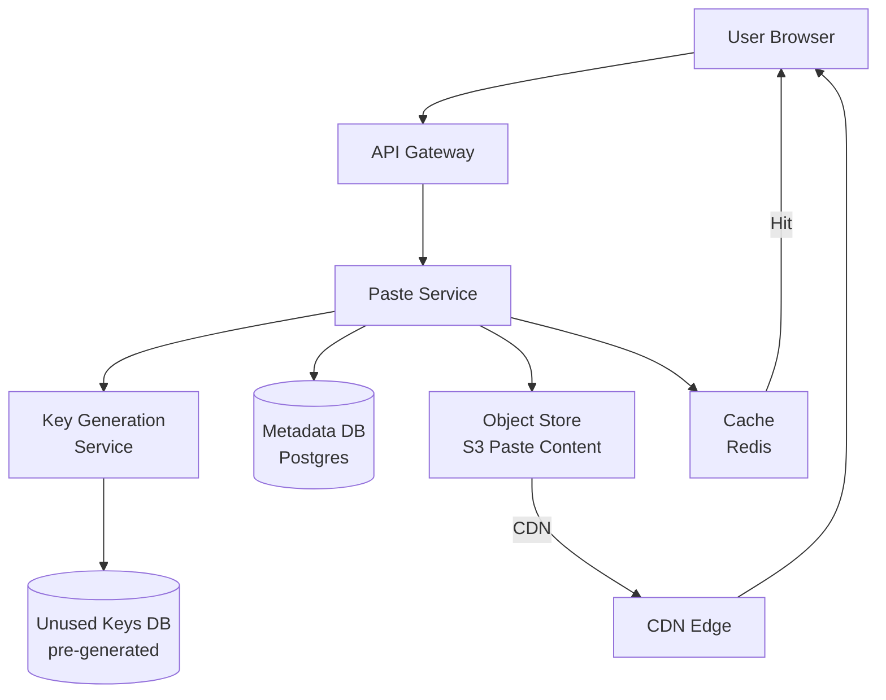

# Design Pastebin — Text Storage with Short URLs

**Difficulty**: 🟢 Beginner
**Reading Time**: Coming Soon
**Interview Frequency**: Medium

---

> 🚧 **Full article coming soon.** This stub gives you the essentials to start thinking about this problem.

---

## The Core Problem

Storing text pastes (code snippets, logs, notes) with unique short keys and supporting 100:1 read-to-write ratios seems simple until you hit key collision at scale: with 1M pastes/day, random 6-char base62 keys have a 0.1% collision chance after 100M pastes. Key generation strategy is the central design question.

## Functional Requirements

- Users can create text pastes and receive a unique short URL
- Pastes can optionally expire (1 hour, 1 day, 1 week, never)
- Pastes can be public (anyone can read) or private (only creator)
- Support syntax highlighting for code pastes

## Non-Functional Requirements

| Requirement | Target |
|-------------|--------|
| Availability | 99.9% (8.7 hrs downtime/year) |
| Read latency | p99 < 100ms |
| Write latency | p99 < 500ms |
| Scale | 1M new pastes/day, 100M reads/day |

## Back-of-Envelope Estimates

- **Storage**: 1M pastes/day × 10KB avg paste = 10GB/day → ~3.6TB/year
- **Read throughput**: 100M reads/day ÷ 86,400 = ~1,160 reads/sec (easily cached)
- **Key space**: 6 chars base62 = 62^6 = 56B unique keys — enough for decades

## Key Design Decisions

1. **Key Generation: Pre-generated vs Hash** — hashing paste content gives deterministic dedup but collision detection requires DB lookup; pre-generating a pool of unused keys from a Key Generation Service (KGS) eliminates race conditions and is faster at write time.
2. **S3 for Paste Content** — metadata (key, owner, expiry, visibility) in a relational DB; actual paste content in S3/object storage; keeps DB small (metadata only) and content cheap to store and CDN-cached.
3. **TTL via Scheduled Cleanup** — don't delete on expiry timestamp; use a background worker that scans for expired pastes nightly; mark as deleted in DB first, then asynchronously delete from S3 to avoid partial failures.

## High-Level Architecture

## Top Interview Questions for This Problem

| Question | Tests |
|----------|-------|
| How do you prevent two users from getting the same paste key? | Key collision, atomic reservation |
| How would you implement paste expiration without scanning the whole table? | TTL, background workers, lazy deletion |
| How do you handle a popular paste getting 1M views in an hour? | CDN caching, read scaling |

## Related Concepts

- [URL Shortener system design](../../../16-system-design-problems/01-data-processing/url-shortener)
- [Object storage vs database for blob content](../06-storage-files/file-sharing)

---

*📚 Full deep-dive with multiple approaches, trade-off tables, and pseudocode coming soon.*

## 📚 Resources & References

| Resource | Type | What You'll Learn |
|----------|------|------------------|
| [System Design Interview — Alex Xu](https://www.amazon.com/System-Design-Interview-insiders-Second/dp/B08CMF2CQF) | 📚 Book | Chapter on designing Pastebin — URL shortener variant with text storage |
| [ByteByteGo — Design a URL Shortener](https://www.youtube.com/@ByteByteGo) | 📺 YouTube | Search "URL shortener design" — relevant for the short URL generation in Pastebin |
| [Consistent Hashing for Key Generation](https://www.toptal.com/big-data/consistent-hashing) | 📖 Blog | How to generate unique keys for paste IDs without collision |
| [S3 for Object Storage at Scale](https://aws.amazon.com/blogs/storage/amazon-s3-performance-tips-and-tricks-seattle-aws-summit/) | 📚 Docs | Using S3 as the backing store for large text/binary paste content |
| [High Scalability: Key-Value Service Design](http://highscalability.com) | 📖 Blog | Architecture patterns for simple read-heavy key-value services |
