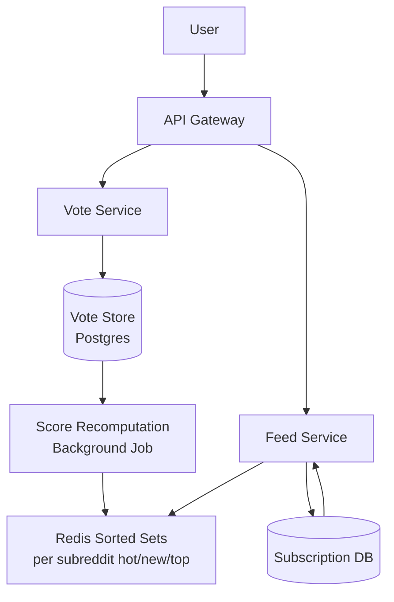
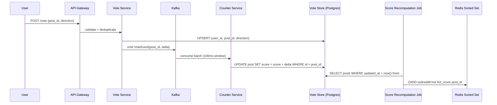
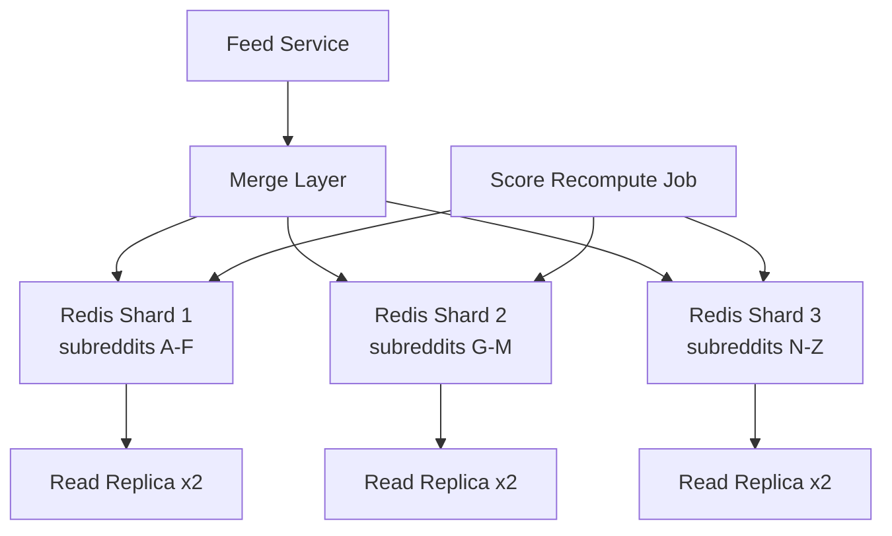

# Design Reddit — Voting & Feed Ranking

**Difficulty**: 🟡 Intermediate
**Reading Time**: Coming Soon
**Interview Frequency**: Medium

---

> 🚧 **Full article coming soon.** This stub gives you the essentials to start thinking about this problem.

---

## The Core Problem

Computing hot/best/new scores for 100 million posts while handling vote aggregation correctly — a post with 100% upvotes from 10 people is less reliable than one with 90% upvotes from 10,000 people. Naive upvote/downvote counts are gameable; proper statistical confidence intervals require more computation but prevent brigading.

## Functional Requirements

- Users can submit posts (links, text, images) to subreddits
- Upvote/downvote posts and comments
- View feeds sorted by Hot, New, Top, Rising, Controversial
- Subscribed subreddit posts aggregate into home feed

## Non-Functional Requirements

| Requirement | Target |
|-------------|--------|
| Availability | 99.9% (8.7 hrs downtime/year) |
| Vote latency | p99 < 200ms |
| Feed load time | p99 < 500ms |
| Scale | 1.7B posts total, 52M DAU |

## Back-of-Envelope Estimates

- **Votes per second**: 52M DAU × 20 votes/day ÷ 86,400 = ~12,000 votes/sec
- **Hot score recomputation**: Top 1M posts recomputed every 5 min = 200,000 score updates/sec
- **Feed cache**: 52M users × 200 posts per cached feed × 8 bytes = ~83GB of cached feed data

## Key Design Decisions

1. **Wilson Score Confidence Interval** — instead of raw upvote ratio, use lower bound of Wilson confidence interval; a post with 1 upvote and 0 downvotes scores 0.21, while 100 upvotes and 0 downvotes scores 0.97 — prevents vote manipulation.
2. **Read-Heavy Caching** — Reddit is 98% reads; cache computed hot-score lists per subreddit in Redis sorted sets; recompute scores every 5 minutes in background, not on every vote.
3. **Subreddit Fan-out** — home feed = union of subscribed subreddit feeds; don't recompute per-user; serve from pre-computed per-subreddit sorted sets and merge client-side or in a thin aggregation layer.

## High-Level Architecture



## Top Interview Questions for This Problem

| Question | Tests |
|----------|-------|
| How do you prevent vote manipulation / brigading from coordinated groups? | Wilson score, fraud detection |
| How would you scale voting for a post going viral (1M votes in 1 hour)? | Write amplification, counter sharding |
| How do you compute the "Rising" feed that shows momentum, not total votes? | Velocity, time-windowed scoring |

## Related Concepts

- [Facebook Newsfeed fan-out patterns](../01-data-processing/facebook-newsfeed)
- [Distributed counters for vote aggregation](../05-infrastructure/distributed-counter)

---

## Component Deep Dive 1: Vote Aggregation and Score Computation

The vote service is the most critical component in Reddit's architecture — every vote must be counted exactly once (idempotent), aggregated at high throughput (~12,000 writes/sec), and converted into a score that correctly ranks posts across timescales.

### How It Works Internally

Reddit uses the **Wilson Score Confidence Interval** for comment ranking and the **Hot Score algorithm** (Randall Munroe's formula) for post ranking. The hot score formula is:

```
hot_score = log10(score) + epoch_seconds / 45000
```

Where `score = max(upvotes - downvotes, 1)`. The division by 45,000 means a post gains/loses 1 logarithmic unit every 12.5 hours, causing all posts to decay without requiring re-votes.

For comments, the Wilson lower-bound formula is:
```
z = 1.281551565545  # 80% confidence
n = upvotes + downvotes
p_hat = upvotes / n
wilson_lower = (p_hat + z²/2n - z*sqrt(p_hat*(1-p_hat)/n + z²/4n²)) / (1 + z²/n)
```

### Why Naive Approaches Fail at Scale

A naive approach would recompute scores on every vote write. With 12,000 votes/sec and 1.7B posts, this is unsustainable — it creates a write amplification storm where every vote triggers a cache invalidation and score rewrite for potentially millions of subscribers.

A second naive approach is a single counter row per post with an increment operation. Under viral traffic (1M votes/hour = 278 votes/sec on one row), this creates a write hot spot on a single DB row — Postgres row-level locking degrades throughput to ~500 writes/sec per row under contention.

### Vote Ingestion Architecture (Sequence Diagram)



### Vote Store Implementation Options

| Approach | Latency | Throughput | Trade-off |
|----------|---------|------------|-----------|
| Postgres single-row counter | 2–5ms write | ~500 writes/sec per hot post | Simple; fails under viral load due to row lock contention |
| Sharded counters (N counter rows, sum on read) | 1–3ms write | 500 × N writes/sec | Scales writes; read requires SUM across N shards |
| Redis INCR + async DB sync | <1ms write | 100k+/sec | Fastest; risk of losing counts on Redis failure without persistence |
| Kafka batched aggregation | 50–200ms end-to-end | 500k+ events/sec | Best at scale; adds latency; eventual consistency for vote counts |

Reddit's actual production choice: **Kafka + Postgres with batched aggregation**. Votes are emitted as events, consumed in 100ms windows, and aggregated before the DB write — reducing per-post write pressure by 100x.

---

## Component Deep Dive 2: Feed Ranking with Redis Sorted Sets

The Feed Service is Reddit's read-critical path. With 52M DAU each loading a home feed of 25–50 posts, feed reads dominate at roughly 600 feed requests/sec (peak ~3x that = 1,800/sec). Feeds must be sorted by multiple algorithms (Hot, New, Top, Rising, Controversial) per subreddit.

### Internal Mechanics

Reddit uses Redis Sorted Sets as the primary feed store:

```
Key:  subreddit:{subreddit_id}:hot
Type: Sorted Set
Score: hot_score (float)
Member: post_id
```

Each subreddit maintains 5 sorted sets (one per sort order). Score recomputation runs as a background job every 5 minutes for the top 100k posts per subreddit. Redis `ZREVRANGE` retrieves the top N posts by score in O(log N + M) time.

### Home Feed Aggregation

A user subscribing to 50 subreddits cannot be served from a single sorted set. Reddit uses two approaches:

1. **Merge at read time** (for most users): fetch top 50 posts from each of 50 subscribed subreddit sorted sets → merge sort in the Feed Service → return top 25. This is O(50 × log 50) = fast.
2. **Pre-computed user feeds** (for high-activity users): fan-out writes each new post to a per-user Redis list. Used only for users with fewer than 1,000 subscriptions — above that, merge-at-read is cheaper.

### Scale Behavior at 10x Load

At 10x load (520M DAU), the merge-at-read approach hits a bottleneck: each feed request touches 50 Redis keys. With 18,000 req/sec × 50 keys = 900,000 Redis operations/sec — exceeding a single Redis node's ~500k ops/sec capacity. The mitigation is Redis Cluster sharding by subreddit_id across 16+ nodes, plus read replicas per shard.



---

## Component Deep Dive 3: Deduplication and Idempotent Votes

Vote deduplication is a storage consistency problem: a user should only be able to cast one vote per post (or change their vote), not accumulate multiple upvotes by replaying requests.

### Technical Implementation

Reddit stores votes in a **Postgres `user_votes` table** with a composite unique constraint on `(user_id, post_id)`. An UPSERT operation handles both new votes and vote changes atomically:

```sql
INSERT INTO user_votes (user_id, post_id, direction, created_at)
VALUES ($1, $2, $3, now())
ON CONFLICT (user_id, post_id)
DO UPDATE SET direction = EXCLUDED.direction, updated_at = now()
RETURNING old_direction, direction;
```

The returned `(old_direction, direction)` tuple lets the Vote Service compute the correct delta:
- `(null, +1)` → delta = +1 (new upvote)
- `(+1, -1)` → delta = -2 (upvote to downvote)
- `(+1, null)` → delta = -1 (removed upvote)

This prevents double-counting on network retries without requiring a distributed lock. The unique index makes the UPSERT O(log N) and safe under concurrent requests from the same user.

Historical note: Reddit migrated vote storage from Postgres to **Cassandra** in 2010 when vote table size hit 100M+ rows. Cassandra's wide-row model (`partition_key = post_id`, `clustering_key = user_id`) enables O(1) per-post vote reads while maintaining write scalability across nodes.

---

## Data Model

```sql
-- Posts table
CREATE TABLE posts (
    id            BIGINT PRIMARY KEY,             -- snowflake ID
    subreddit_id  BIGINT NOT NULL,
    author_id     BIGINT NOT NULL,
    title         VARCHAR(300) NOT NULL,
    body          TEXT,
    url           VARCHAR(2000),
    post_type     ENUM('link','text','image','video'),
    upvotes       INT NOT NULL DEFAULT 0,
    downvotes     INT NOT NULL DEFAULT 0,
    hot_score     DOUBLE PRECISION NOT NULL DEFAULT 0,
    wilson_score  DOUBLE PRECISION,               -- for controversial sorting
    created_at    TIMESTAMPTZ NOT NULL DEFAULT now(),
    updated_at    TIMESTAMPTZ NOT NULL DEFAULT now(),
    is_deleted    BOOLEAN NOT NULL DEFAULT false,
    flair_id      BIGINT
);

CREATE INDEX idx_posts_subreddit_hot    ON posts (subreddit_id, hot_score DESC);
CREATE INDEX idx_posts_subreddit_new    ON posts (subreddit_id, created_at DESC);
CREATE INDEX idx_posts_updated          ON posts (updated_at DESC);   -- for score recompute

-- Subreddits table
CREATE TABLE subreddits (
    id            BIGINT PRIMARY KEY,
    name          VARCHAR(50) UNIQUE NOT NULL,    -- e.g. "programming"
    display_name  VARCHAR(100),
    description   TEXT,
    subscriber_count INT NOT NULL DEFAULT 0,
    nsfw          BOOLEAN NOT NULL DEFAULT false,
    created_at    TIMESTAMPTZ NOT NULL DEFAULT now()
);

-- User votes (deduplication)
CREATE TABLE user_votes (
    user_id       BIGINT NOT NULL,
    post_id       BIGINT NOT NULL,
    direction     SMALLINT NOT NULL CHECK (direction IN (-1, 0, 1)),
    created_at    TIMESTAMPTZ NOT NULL DEFAULT now(),
    updated_at    TIMESTAMPTZ NOT NULL DEFAULT now(),
    PRIMARY KEY (user_id, post_id)
);

-- Subscriptions
CREATE TABLE subscriptions (
    user_id       BIGINT NOT NULL,
    subreddit_id  BIGINT NOT NULL,
    subscribed_at TIMESTAMPTZ NOT NULL DEFAULT now(),
    PRIMARY KEY (user_id, subreddit_id)
);
CREATE INDEX idx_subscriptions_user ON subscriptions (user_id);

-- Comments
CREATE TABLE comments (
    id            BIGINT PRIMARY KEY,
    post_id       BIGINT NOT NULL,
    parent_id     BIGINT REFERENCES comments(id),  -- null = top-level
    author_id     BIGINT NOT NULL,
    body          TEXT NOT NULL,
    upvotes       INT NOT NULL DEFAULT 0,
    downvotes     INT NOT NULL DEFAULT 0,
    wilson_score  DOUBLE PRECISION NOT NULL DEFAULT 0,
    created_at    TIMESTAMPTZ NOT NULL DEFAULT now(),
    is_deleted    BOOLEAN NOT NULL DEFAULT false
);
CREATE INDEX idx_comments_post_wilson ON comments (post_id, wilson_score DESC);
```

Redis keys:
```
subreddit:{id}:hot        ZSET  (score=hot_score, member=post_id)
subreddit:{id}:new        ZSET  (score=unix_timestamp, member=post_id)
subreddit:{id}:top:day    ZSET  (score=upvotes-downvotes, member=post_id)
subreddit:{id}:rising     ZSET  (score=velocity_score, member=post_id)
post:{id}:vote_count      STRING  (integer, volatile cache)
user:{id}:feed_cache      LIST  (post_ids, TTL 5 min)
```

---

## Scale Bottlenecks

| Traffic Level | Component That Breaks | Symptoms | Mitigation |
|---------------|----------------------|----------|------------|
| 10x baseline (120k votes/sec) | Postgres `user_votes` write throughput | Lock timeouts, 5xx on vote API | Shard `user_votes` by `user_id % 64`; add Kafka vote queue buffer |
| 10x baseline | Redis hot sorted-set ZADD contention | ZADD latency spikes for viral posts | Partition per-post update queue; batch ZADD every 100ms |
| 100x baseline (1.2M votes/sec) | Kafka consumer lag | Vote counts delayed by minutes | Scale Kafka partitions to 1 per hot subreddit; add consumer groups |
| 100x baseline | Score recomputation job falls behind | Hot scores stale by >30 min | Shard score-recompute job by subreddit_id range; scale to 50 workers |
| 100x baseline | Feed merge at 18k req/sec hits Redis cluster ops limit | Feed p99 > 2s | Enable Redis read replicas; add local in-process L1 cache (30s TTL) |
| 1000x baseline (120M DAU) | Postgres subscription table JOIN latency | Home feed load > 5s | Migrate subscriptions to Cassandra or Redis Set; precompute at write time |
| 1000x baseline | Per-subreddit Redis sorted set exceeds 1GB | Memory OOM, evictions | Cap sorted sets to top 500k posts; archive older posts to cold storage |

---

## How Reddit Built This

Reddit's actual engineering story is one of the most publicly documented in the industry, shared through their engineering blog and conference talks (Reddit at QCon 2017, SREcon 2018).

**Timeline and technology choices:**

In 2005–2008, Reddit ran on a single Postgres instance for everything — posts, votes, comments, and user data. By 2008 at 270M page views/month, the database was the bottleneck. Reddit's response was to move vote storage to Cassandra.

**Why Cassandra for votes:** A single `user_votes` row in Postgres grew to 800M+ rows by 2010. Cassandra's wide-row model meant they could model `(post_id → [user_id: direction])` as a native column family, enabling O(1) writes without B-tree index pressure. Reddit's Cassandra cluster in 2010 held 4 nodes with 40M vote columns per node at 99th-percentile write latency of 4ms.

**Score Recomputation Design:** Reddit runs score recomputation as a batch job (not stream) — specifically because hot scores decay on a time curve, every post's score changes every second even without new votes. Their insight: it is cheaper to recompute the top 1M active posts every 5 minutes than to maintain a real-time trigger per-vote. This is the **"lazy decay"** pattern — accept up to 5-minute scoring staleness in exchange for 100x reduction in computation.

**Thundering Herd on Viral Posts:** When a post goes viral (e.g., a major world event), Reddit observed vote storms of 50,000 votes/min on a single post. Their fix was **counter sharding**: each post has N=16 counter shards in Cassandra; a vote randomly increments one shard. The displayed count is the SUM of all 16 shards, computed at read time and cached in Memcached. This reduced max write throughput per post from 500/sec to 8,000/sec (16x).

**Numbers from Reddit's 2017 SREcon talk:**
- 52M DAU, 1.7B posts, 14B comments
- 1.2TB data written per day
- Peak read QPS: 250,000 req/sec (reads dominate by 100:1 over writes)
- Memcached fleet: 200+ nodes holding 95% of read traffic

Source: [High Scalability — 7 Lessons Learned While Building Reddit to 270M Page Views](http://highscalability.com/blog/2010/5/17/7-lessons-learned-while-building-reddit-to-270-million-page.html) and Reddit's own engineering blog posts from 2009–2018.

---

## Interview Angle

**What the interviewer is testing:** Your ability to handle write amplification on a read-heavy system — specifically, how you serve millions of aggregated reads cheaply without making write paths synchronously expensive. The secondary test is your understanding of ranking algorithms that resist manipulation.

**Common mistakes candidates make:**

1. **Recomputing hot scores on every vote**: Candidates say "on every upvote, recompute the post's hot score and update the feed." This creates O(subscribers) write fan-out per vote. For a subreddit with 10M subscribers, one viral vote triggers 10M cache invalidations. The correct answer: background batch recomputation every 1–5 minutes, accepting bounded staleness.

2. **Using raw vote ratios (upvotes / total)**: A post with 1 upvote and 0 downvotes has a 100% upvote ratio. A post with 1,000 upvotes and 100 downvotes has only 91%. Sorting by ratio alone ranks the single-upvote post higher. Candidates who don't know the Wilson Score interval get this wrong — the correct formula penalizes low-sample posts.

3. **Building per-user feeds with fan-out-on-write**: Candidates copy the Twitter model and say "when a post is created, push it to each subscriber's feed." For a subreddit with 30M subscribers (r/funny), one post submission would trigger 30M Redis writes. Reddit doesn't use per-user feed fan-out — it uses per-subreddit sorted sets with merge-at-read time.

**The insight that separates good from great answers:** Hot scores decay passively over time (the formula includes epoch_seconds), which means a post's score decreases every second even with zero new votes. This means the "score recompute" job must run continuously, not just when votes arrive. A great candidate recognizes this and designs a time-based recomputation scheduler (not a vote-triggered one) for the top N active posts, accepting eventual consistency on scores.

---

## Key Numbers to Remember

| Metric | Value | Context |
|--------|-------|---------|
| Daily votes | ~1 billion | 52M DAU × 20 votes/day |
| Peak vote rate | 12,000 votes/sec | Baseline; 50k+ on viral posts |
| Hot score recompute interval | Every 5 minutes | For top 1M active posts |
| Read-to-write ratio | 100:1 | Reddit is overwhelmingly read-heavy |
| Peak read QPS | 250,000 req/sec | From 2017 SREcon data |
| Cassandra vote shards per post | 16 shards | Handles 8,000 votes/sec per post |
| Feed cache size | ~83GB | 52M users × 200 posts × 8 bytes per post_id |
| Wilson score for 1 upvote / 0 downvote | ~0.21 | vs 0.97 for 100 upvotes / 0 downvotes |
| Score recomputation throughput needed | 200,000 updates/sec | 1M posts recomputed every 5 min |
| Reddit Cassandra cluster launch size | 4 nodes | 2010, holding 40M vote columns per node |
| Memcached fleet size | 200+ nodes | Serving 95% of Reddit's read traffic |
| Total posts in system | 1.7 billion | As of 2021; growing ~100M/month |
| Total comments in system | 14 billion | From 2017 SREcon talk |

---

## Feed Ranking Algorithm Deep Dive

Reddit supports 5 sort modes. Each has a different scoring function and update frequency:

### Hot (Default)

The hot algorithm was written by Steve Huffman (spez) and uses a logarithmic decay curve. Key properties:
- A post that received 1,000 upvotes yesterday ranks the same as a post with 100 upvotes today (time decay dominates)
- The log scale means the 11th vote has less impact than the 1st — prevents gaming by coordinated upvoting
- Score = `log10(score) + (epoch_time_of_submission - 1134028003) / 45000`
- The constant 1134028003 is Reddit's epoch (January 2006 launch date) — ensuring positive scores

### New

Trivially sorted by `created_at DESC`. No computation needed. Updated in real time via the posts sorted set in Redis: `ZADD subreddit:{id}:new {unix_timestamp} {post_id}`.

### Top

Sorted by `(upvotes - downvotes)` with time ranges (Today, This Week, This Month, This Year, All Time). Requires time-range queries:
- Use a secondary `created_at` index filter then sort by net score
- Redis sorted set stores net_score; filtered by time window using a Lua script or application-level filter

### Rising

Velocity-based: posts gaining votes faster than average for their age. Computed as:
```
velocity = vote_count_last_hour / expected_votes_at_this_age
rising_score = velocity * freshness_multiplier
```
Posts appearing on Rising are candidates for front page visibility. Updated every 10 minutes for posts < 24 hours old.

### Controversial

Sorts by posts where upvotes and downvotes are both high and roughly equal. Formula:
```
magnitude = upvotes + downvotes
balance = min(upvotes, downvotes) / max(upvotes, downvotes)
controversial_score = magnitude ^ balance
```
A post with 5,000 upvotes and 4,900 downvotes scores higher than one with 500 upvotes and 100 downvotes.

### Algorithm Comparison

| Algorithm | Update Frequency | Redis Key | Sorted By | Good For |
|-----------|-----------------|-----------|-----------|----------|
| Hot | Every 5 min (batch) | `subreddit:{id}:hot` | Decay-weighted net score | Default view; balances freshness + popularity |
| New | Real-time on insert | `subreddit:{id}:new` | Created_at timestamp | Following breaking news |
| Top | Every 15 min per time range | `subreddit:{id}:top:{range}` | Net score (upvotes - downvotes) | Finding best content ever |
| Rising | Every 10 min (posts < 24h) | `subreddit:{id}:rising` | Vote velocity | Discovering content before it goes viral |
| Controversial | Every 30 min | `subreddit:{id}:controversial` | Balanced high-magnitude votes | Finding debate-worthy content |

---

## Anti-Gaming and Fraud Prevention

Reddit's most underappreciated engineering challenge is preventing vote manipulation. Coordinated upvote brigades and bot networks can distort rankings. Reddit's multi-layer approach:

### Layer 1: Vote Fuzzing

Reddit intentionally displays vote counts with slight random noise (±10–20%). This prevents bots from knowing exactly how many votes a post received and adjusting their attack strategy. The actual count is stored accurately; only the displayed value is fuzzed.

### Layer 2: Vote Withholding

Suspicious votes are marked as "withheld" — they appear to the voter as having been cast (preventing retry loops) but are not counted in the score. This is similar to the "shadow ban" concept. Votes from accounts with:
- Account age < 7 days
- No comment or post history
- IP address associated with known proxy networks
- Device fingerprint matching other vote-ring accounts

...are withheld pending manual review or automatic classifier decision.

### Layer 3: Wilson Score's Natural Resistance

The Wilson Score lower confidence bound naturally resists brigading. For an attacker to move a post with 1,000 organic upvotes from score 0.95 to score 0.90 using fake downvotes, they would need to cast approximately 11,000 downvotes — an expensive attack that is also easily detected by rate anomalies.

### Layer 4: Velocity Anomaly Detection

A real-time streaming pipeline (Apache Flink at Reddit's scale) monitors vote velocity per post. Baseline velocity for a post with age t hours is modeled from historical data. Posts receiving votes at 10x+ expected velocity trigger automated review and potential temporary freezing of vote display.

---

## Operational Considerations

### Cache Warming on Startup

When a Redis node restarts, its sorted sets must be repopulated. Reddit's approach:
1. Score recomputation job runs on a 5-minute cron — a node restart means at most 5 minutes of stale data
2. On cache miss in feed service, fall back to Postgres query with `ORDER BY hot_score DESC LIMIT 100`
3. Postgres is the source of truth; Redis is a read-through cache for sorted queries

### Cold Subreddits vs Hot Subreddits

Subreddits range from 1 subscriber to 40M+ (r/AskReddit). Treatment differs:
- **Cold subreddits** (< 1,000 subscribers): No Redis sorted set. All feed queries go directly to Postgres. Low traffic makes this acceptable.
- **Warm subreddits** (1k–100k subscribers): Redis sorted set, recomputed hourly.
- **Hot subreddits** (100k+ subscribers): Redis sorted set, recomputed every 5 minutes; read replicas.
- **Mega subreddits** (10M+ subscribers): Dedicated Redis cluster partition; dedicated Kafka topic for vote events; rate-limited writes to prevent single-partition overload.

### Comment Thread Rendering

Reddit comment trees are loaded lazily. The top-level API call returns the post + top 20 comments by Wilson score. "Load more comments" triggers a separate API call. This means:
- Comment tree traversal is bounded at render time
- Deep comment chains don't block page load
- The Wilson score for a comment is computed by the same background job that handles post scores

Comment threads are stored in a **closure table** (each ancestor-descendant relationship is a row) to enable efficient subtree queries without recursive CTEs:

```sql
CREATE TABLE comment_closure (
    ancestor_id   BIGINT NOT NULL,
    descendant_id BIGINT NOT NULL,
    depth         INT NOT NULL,
    PRIMARY KEY (ancestor_id, descendant_id)
);
CREATE INDEX idx_cc_descendant ON comment_closure (descendant_id);
```

This allows "fetch all descendants of comment X" in O(1) with a single SELECT, rather than N recursive queries.

---

*📚 Full deep-dive with multiple approaches, trade-off tables, and pseudocode coming soon.*

## 📚 Resources & References

| Resource | Type | What You'll Learn |
|----------|------|------------------|
| [ByteByteGo — Design Reddit](https://www.youtube.com/@ByteByteGo) | 📺 YouTube | Search "Reddit system design" — voting, feed ranking, and real-time comments |
| [Reddit Engineering: Lessons Learned from 5 Billion Pageviews](https://redditblog.com/2017/12/06/how-we-built-rplace/) | 📖 Blog | Reddit's approach to scaling real-time collaborative features |
| [Reddit on Cassandra for Vote Storage](https://redditblog.com/2010/05/11/and-we-are-live/) | 📖 Blog | How Reddit migrated vote counts to Cassandra for write scalability |
| [HN: Reddit Architecture Discussion](https://news.ycombinator.com/item?id=9498805) | 📖 Blog | Reddit engineers discuss their architecture evolution |
| [High Scalability: Reddit Architecture](http://highscalability.com/blog/2010/5/17/7-lessons-learned-while-building-reddit-to-270-million-page.html) | 📖 Blog | Scaling lessons from Reddit's growth from 0 to 270M page views |
