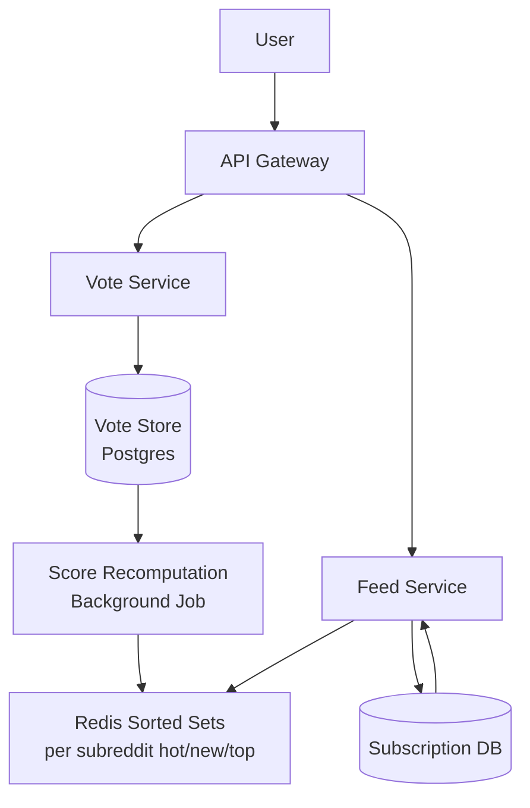

# Design Reddit — Voting & Feed Ranking

**Difficulty**: 🟡 Intermediate
**Reading Time**: Coming Soon
**Interview Frequency**: Medium

---

> 🚧 **Full article coming soon.** This stub gives you the essentials to start thinking about this problem.

---

## The Core Problem

Computing hot/best/new scores for 100 million posts while handling vote aggregation correctly — a post with 100% upvotes from 10 people is less reliable than one with 90% upvotes from 10,000 people. Naive upvote/downvote counts are gameable; proper statistical confidence intervals require more computation but prevent brigading.

## Functional Requirements

- Users can submit posts (links, text, images) to subreddits
- Upvote/downvote posts and comments
- View feeds sorted by Hot, New, Top, Rising, Controversial
- Subscribed subreddit posts aggregate into home feed

## Non-Functional Requirements

| Requirement | Target |
|-------------|--------|
| Availability | 99.9% (8.7 hrs downtime/year) |
| Vote latency | p99 < 200ms |
| Feed load time | p99 < 500ms |
| Scale | 1.7B posts total, 52M DAU |

## Back-of-Envelope Estimates

- **Votes per second**: 52M DAU × 20 votes/day ÷ 86,400 = ~12,000 votes/sec
- **Hot score recomputation**: Top 1M posts recomputed every 5 min = 200,000 score updates/sec
- **Feed cache**: 52M users × 200 posts per cached feed × 8 bytes = ~83GB of cached feed data

## Key Design Decisions

1. **Wilson Score Confidence Interval** — instead of raw upvote ratio, use lower bound of Wilson confidence interval; a post with 1 upvote and 0 downvotes scores 0.21, while 100 upvotes and 0 downvotes scores 0.97 — prevents vote manipulation.
2. **Read-Heavy Caching** — Reddit is 98% reads; cache computed hot-score lists per subreddit in Redis sorted sets; recompute scores every 5 minutes in background, not on every vote.
3. **Subreddit Fan-out** — home feed = union of subscribed subreddit feeds; don't recompute per-user; serve from pre-computed per-subreddit sorted sets and merge client-side or in a thin aggregation layer.

## High-Level Architecture

## Top Interview Questions for This Problem

| Question | Tests |
|----------|-------|
| How do you prevent vote manipulation / brigading from coordinated groups? | Wilson score, fraud detection |
| How would you scale voting for a post going viral (1M votes in 1 hour)? | Write amplification, counter sharding |
| How do you compute the "Rising" feed that shows momentum, not total votes? | Velocity, time-windowed scoring |

## Related Concepts

- [Facebook Newsfeed fan-out patterns](../01-data-processing/facebook-newsfeed)
- [Distributed counters for vote aggregation](../05-infrastructure/distributed-counter)

---

*📚 Full deep-dive with multiple approaches, trade-off tables, and pseudocode coming soon.*
