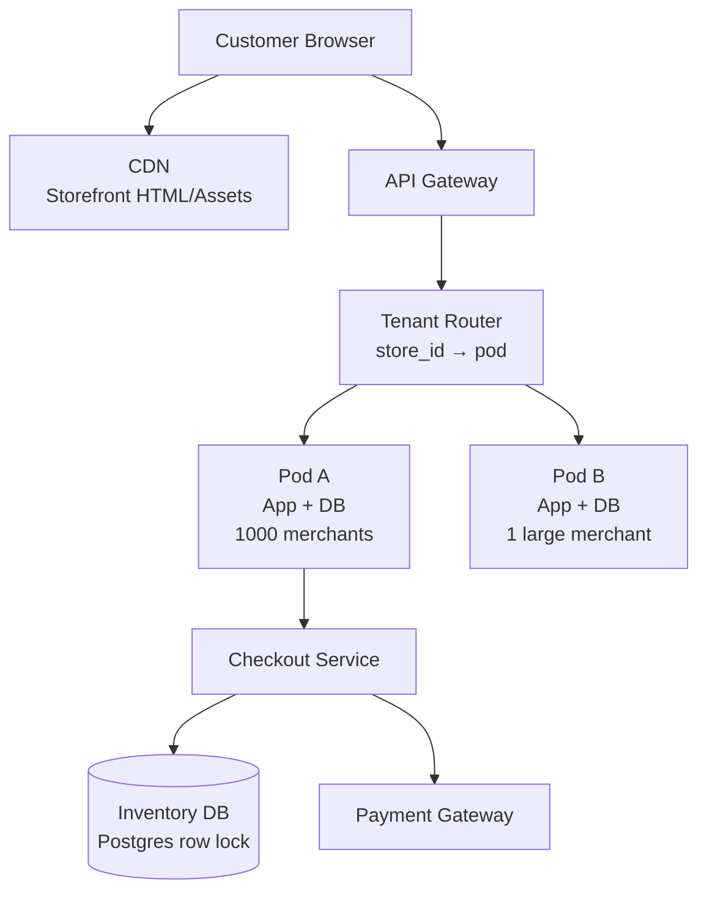
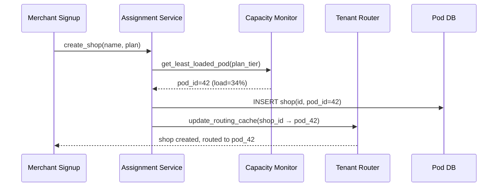
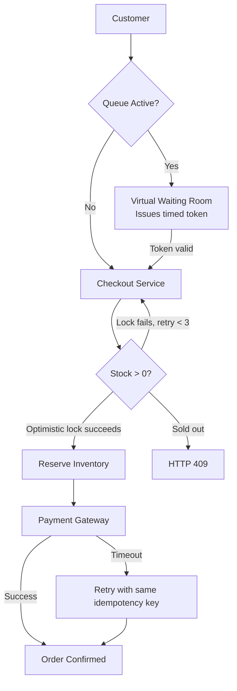
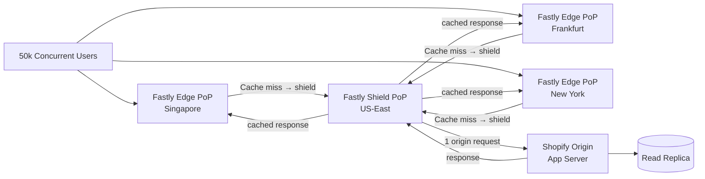

# Design Shopify — Multi-Tenant E-Commerce Platform

**Difficulty**: 🔴 Advanced
**Reading Time**: Coming Soon
**Interview Frequency**: Medium

---

> 🚧 **Full article coming soon.** This stub gives you the essentials to start thinking about this problem.

---

## The Core Problem

Hosting 2 million independent stores on shared infrastructure with data isolation guarantees, while surviving Black Friday flash sales that spike a single store's traffic 100x in seconds — from 100 orders/min to 10,000 orders/min — requires dynamic capacity and careful multi-tenancy design to prevent noisy neighbor effects.

## Functional Requirements

- Merchants can create online stores with products, inventory, and checkout
- Customers can browse, add to cart, and complete purchases
- Each store's data is isolated from other stores
- Platform survives massive traffic spikes (Black Friday, product launches)

## Non-Functional Requirements

| Requirement | Target |
|-------------|--------|
| Availability | 99.99% (52 min/year) |
| Checkout latency | p99 < 2 seconds |
| Inventory accuracy | No overselling (strong consistency) |
| Scale | 2M stores, 100x traffic spikes |

## Back-of-Envelope Estimates

- **Normal traffic**: 2M stores × 100 orders/day avg = 200M orders/day = ~2,300 orders/sec
- **Flash sale spike**: Single viral store: 10,000 orders/min = 167 orders/sec on one DB shard
- **Inventory writes**: 1M concurrent buyers trying to buy last item → need serializable isolation or optimistic lock with retry

## Key Design Decisions

1. **Tenant Isolation: Pod Architecture** — group 1,000-10,000 small merchants per "pod" (DB + app cluster); large/high-traffic merchants get dedicated pods; pods share nothing, preventing noisy neighbor from degrading all stores.
2. **Inventory Locking for Flash Sales** — use database row-level locks with timeout for checkout; implement a queue-based checkout (virtual waiting room) for extremely high-traffic launches to serialize demand without overwhelming DB.
3. **Checkout Idempotency** — generate idempotency key (order_id) before payment; if payment gateway times out, retry with same key; payment provider deduplicates and returns original result rather than double-charging.

## High-Level Architecture



## Top Interview Questions for This Problem

| Question | Tests |
|----------|-------|
| How do you prevent two customers from buying the last item in stock? | Inventory locking, serialization |
| How do you handle a store going from 100 to 100,000 visitors in 30 seconds? | Auto-scaling, virtual waiting room |
| How do you ensure tenant A can never read tenant B's order data? | Row-level security, pod isolation |

## Related Concepts

- [Hotel booking double-booking prevention](../04-reservation-scheduling/hotel-booking)
- [Distributed locking for inventory](../05-infrastructure/distributed-locking)

---

## Component Deep Dive 1: Pod Architecture and Tenant Routing

The Pod Architecture is the single most critical design decision in Shopify's infrastructure. It directly determines how tenant isolation, blast radius containment, and traffic spike handling work in practice.

### How Pods Work Internally

A "pod" is a self-contained unit of infrastructure: one application cluster, one database primary with read replicas, one Redis cache, and one Elasticsearch index. Shopify assigns merchants to pods at signup. Small merchants share a pod with 1,000–10,000 others. Enterprise merchants (e.g., Kylie Cosmetics, Red Bull) get a dedicated pod or a pod shared with a handful of comparably sized stores.

Every inbound request carries a `shop_id` (or a subdomain like `storename.myshopify.com`). The Tenant Router maintains a lookup table — `shop_id → pod_id` — cached in a distributed in-memory store (Redis Cluster). Lookup takes under 1 ms. If the cache misses, the router falls back to a central mapping database, then back-fills the cache with a TTL of 60 seconds.

### Why Naive Approaches Fail

**Single shared database**: At 2 million stores sharing one Postgres instance, any viral store's write burst (10,000 orders/min) consumes all IOPS and starves every other store. Row-level security can enforce data isolation, but it cannot prevent resource contention.

**One app server pool**: Without pod isolation, a store running a slow query monopolizes thread pool workers, cascading latency across unrelated stores. This is the classic "noisy neighbor" problem.

**Static sharding by `shop_id % N`**: Simple modulo sharding doesn't account for traffic variance. Shard 7 could hold five viral stores simultaneously while shard 12 idles.

### Pod Assignment Flow



### Pod Isolation Trade-offs

| Approach | Isolation | Resource Efficiency | Operational Complexity | Best For |
|----------|-----------|--------------------|-----------------------|----------|
| Shared pod (1k–10k merchants) | Logical (row-level security) | High (dense packing) | Medium | Small/medium merchants |
| Semi-dedicated pod (10–100 merchants) | Strong (separate DB schema) | Medium | Medium | Growing merchants |
| Dedicated pod (1 merchant) | Complete (own infra) | Low (underutilized off-peak) | High | Enterprise/flash-sale merchants |

Pod rebalancing happens when a merchant's traffic grows beyond a threshold. The Assignment Service detects this via a rolling 7-day P95 order rate. Migration is a background copy of data to the new pod, followed by a brief (~100ms) DNS-level cutover with zero downtime for the merchant.

---

## Component Deep Dive 2: Inventory Locking and Oversell Prevention

Preventing oversell is a hard consistency problem. Two customers simultaneously purchasing the last unit of a product must produce exactly one successful order and one "out of stock" response — not two successful orders.

### Internal Mechanics

Shopify's inventory system uses **optimistic locking with version counters** for the common case, and falls back to **SELECT FOR UPDATE** (pessimistic row locking) for high-contention items like flash sales.

**Optimistic path (99% of traffic):**
```sql
-- Thread A and Thread B both read version=5
SELECT quantity, version FROM inventory WHERE product_variant_id = 123;

-- Thread A writes first
UPDATE inventory
SET quantity = quantity - 1, version = version + 1
WHERE product_variant_id = 123 AND version = 5;
-- Rows affected: 1 → success

-- Thread B arrives, version now 6
UPDATE inventory
SET quantity = quantity - 1, version = version + 1
WHERE product_variant_id = 123 AND version = 5;
-- Rows affected: 0 → retry or fail
```

Thread B retries up to 3 times. If quantity reaches 0 during retry, it returns HTTP 409 "sold out."

**Pessimistic path (flash sales, limited drops):**
When a product is flagged as "high-demand" (set by merchant or auto-detected when >500 concurrent checkout attempts), the checkout service switches to `SELECT FOR UPDATE`. This serializes inventory decrements at the database level. The trade-off is higher lock contention — throughput drops to ~5,000 orders/min per shard — so Shopify pairs this with a **virtual waiting room** (Shopify Queue) that meters customers into the checkout funnel at a controlled rate.

### Scale Behavior at 10x Load

At 10x normal load (167 → 1,670 orders/sec for a single store):
- Optimistic lock retry rate spikes from ~2% to ~40%
- Database CPU on the pod's primary hits ~80%
- P99 checkout latency climbs from 800ms to 3.5s

Mitigations that activate automatically:
1. **Read replica offload**: Product/catalog reads shift to replicas (already default)
2. **Queue activation**: Checkout service detects >1,000 concurrent sessions and enables virtual waiting room
3. **Pod scaling**: Kubernetes HPA adds app server replicas in ~45 seconds



---

## Component Deep Dive 3: Checkout Idempotency and Payment Safety

Payment processing is the highest-stakes operation in any e-commerce system. A double charge destroys customer trust; a missed charge loses revenue. Shopify solves this with end-to-end idempotency keys.

### Technical Decisions

Before the checkout service calls the payment gateway, it generates a UUID `order_token` and writes it to the orders table with status `PENDING`. This record is the idempotency anchor.

```
order_token = UUID (generated client-side, passed in checkout form)
payment_intent_id = payment_gateway.charge(
    amount=99.99,
    card_token=...,
    idempotency_key=order_token
)
```

If the payment gateway call times out (network partition), the checkout service retries with the **same `order_token`**. Payment providers like Stripe deduplicate on idempotency key and return the original `payment_intent_id` rather than creating a second charge. The order status transitions: `PENDING → PAID` atomically after confirmation.

**What if the server crashes between payment success and order confirmation?** A background reconciliation job runs every 60 seconds, querying the payment gateway for all `PENDING` orders older than 2 minutes. If the gateway shows `PAID`, the job marks the order confirmed and triggers fulfillment. This ensures no paid order stays stuck in limbo longer than 3 minutes.

Idempotency keys expire after 24 hours. A customer who abandons a checkout and returns 25 hours later gets a fresh `order_token`, preventing stale keys from colliding with new attempts.

---

## Data Model

```sql
-- Core multi-tenant tables (all queries must include shop_id for shard routing)

CREATE TABLE shops (
    id            BIGINT PRIMARY KEY,
    pod_id        INT NOT NULL,
    subdomain     VARCHAR(64) UNIQUE NOT NULL,       -- storename.myshopify.com
    plan_tier     ENUM('basic','shopify','plus','enterprise'),
    created_at    TIMESTAMP DEFAULT NOW()
);

CREATE TABLE products (
    id            BIGINT PRIMARY KEY,
    shop_id       BIGINT NOT NULL REFERENCES shops(id),
    title         VARCHAR(255) NOT NULL,
    handle        VARCHAR(255) NOT NULL,              -- URL slug
    status        ENUM('active','draft','archived'),
    created_at    TIMESTAMP DEFAULT NOW(),
    INDEX idx_shop_status (shop_id, status)
);

CREATE TABLE product_variants (
    id            BIGINT PRIMARY KEY,
    product_id    BIGINT NOT NULL REFERENCES products(id),
    shop_id       BIGINT NOT NULL,
    sku           VARCHAR(100),
    price         DECIMAL(12, 2) NOT NULL,
    compare_price DECIMAL(12, 2),                    -- crossed-out price
    weight_grams  INT,
    INDEX idx_product (product_id)
);

CREATE TABLE inventory (
    variant_id    BIGINT PRIMARY KEY REFERENCES product_variants(id),
    shop_id       BIGINT NOT NULL,
    quantity      INT NOT NULL DEFAULT 0,
    version       BIGINT NOT NULL DEFAULT 0,          -- optimistic lock counter
    reserved      INT NOT NULL DEFAULT 0,             -- held by pending checkouts
    updated_at    TIMESTAMP DEFAULT NOW(),
    CHECK (quantity >= 0),
    CHECK (reserved >= 0),
    INDEX idx_shop (shop_id)
);

CREATE TABLE orders (
    id               BIGINT PRIMARY KEY,
    order_token      UUID UNIQUE NOT NULL,            -- idempotency key
    shop_id          BIGINT NOT NULL,
    customer_email   VARCHAR(254) NOT NULL,
    status           ENUM('pending','paid','fulfilled','refunded','cancelled'),
    total_price      DECIMAL(12, 2) NOT NULL,
    currency         CHAR(3) NOT NULL,               -- ISO 4217: USD, EUR
    payment_intent   VARCHAR(128),                   -- Stripe payment_intent_id
    created_at       TIMESTAMP DEFAULT NOW(),
    paid_at          TIMESTAMP,
    INDEX idx_shop_status (shop_id, status),
    INDEX idx_token (order_token)
);

CREATE TABLE order_line_items (
    id            BIGINT PRIMARY KEY,
    order_id      BIGINT NOT NULL REFERENCES orders(id),
    variant_id    BIGINT NOT NULL,
    shop_id       BIGINT NOT NULL,
    quantity      INT NOT NULL,
    unit_price    DECIMAL(12, 2) NOT NULL,           -- snapshot at time of purchase
    title         VARCHAR(255) NOT NULL              -- snapshot in case product changes
);

-- Session/cart: stored in Redis (TTL 2 hours)
-- Key: cart:{session_id}
-- Value: JSON { shop_id, items: [{variant_id, qty, price_snapshot}], expires_at }
```

---

## Scale Bottlenecks

| Traffic Level | Component That Breaks | Symptoms | Mitigation |
|---------------|----------------------|----------|------------|
| 10x baseline (23k orders/sec) | Pod DB primary (write IOPS) | P99 checkout latency >3s, lock wait timeouts | Add read replicas for catalog reads; activate virtual waiting room per store |
| 50x baseline (115k orders/sec) | Tenant Router Redis Cluster | Cache miss rate spikes, latency +20ms per request | Horizontal scale Redis Cluster; promote read replicas to handle routing lookups |
| 100x baseline (230k orders/sec) | Payment Gateway rate limits | HTTP 429 from Stripe/Braintree, orders stuck PENDING | Distribute load across multiple payment processor accounts; circuit breaker with exponential backoff |
| 200x baseline (460k orders/sec) | CDN origin pull | Storefront HTML cache miss storm, origin overload | Pre-warm CDN caches before known flash sale; increase TTL to 300s during surge |
| 1000x baseline (2.3M orders/sec) | Network bandwidth on shared pods | Packet loss, TCP retransmits, cascading timeouts | Migrate viral stores to dedicated pods (automated threshold-based migration) |

---

## How Shopify Built This

Shopify's engineering team has written extensively about their Black Friday architecture, and the numbers are concrete. During Black Friday 2023, Shopify processed **$9.3 billion in sales** across the weekend, peaking at **4.2 million checkouts per minute** — roughly **70,000 checkouts per second** globally.

**Technology choices:**
- **MySQL + Vitess**: Shopify's entire merchant data layer runs on MySQL. Rather than migrating to a distributed database, they adopted Vitess (the same sharding layer YouTube built) to horizontally scale MySQL across thousands of pods. Vitess handles query routing, connection pooling, and resharding — transparent to the Rails application. Each Vitess shard holds one pod's data; resharding a growing merchant is a Vitess online schema migration, not an application change.
- **Ruby on Rails monolith → modular monolith**: Counter to industry trends, Shopify deliberately kept a large Rails monolith rather than microservices. They evolved it into a "modular monolith" — strict boundaries between domains (checkout, inventory, billing) enforced by linting rules, but deployed as a single process per pod. This eliminated inter-service network latency inside a pod.
- **HHVM → Ruby 3 + Ractors**: Performance engineering moved from HHVM (Facebook's PHP JIT) to native Ruby 3 with Ractor-based concurrency, gaining ~40% throughput improvement per app server.
- **Kafka for async events**: Order placement publishes an event to Kafka. Fulfillment, email notifications, analytics, and fraud detection all consume from Kafka asynchronously — decoupling the synchronous checkout path from downstream side effects.
- **Non-obvious decision**: Shopify does NOT use eventual consistency for inventory. Despite the performance cost, they use synchronous, strongly-consistent inventory decrements. The engineering team wrote explicitly that they accept the throughput ceiling because overselling is a "worse problem than a slower checkout." The virtual waiting room is their mechanism for keeping throughput acceptable within that constraint.

Sources: [Shopify Engineering Blog — Black Friday Tech](https://shopify.engineering/how-shopify-scaled-for-black-friday-2023), [Vitess at Shopify](https://shopify.engineering/horizontally-scaling-the-rails-backend-of-shop-app-with-vitess)

---

## Interview Angle

**What the interviewer is testing:** Whether you understand multi-tenancy isolation trade-offs (shared vs. dedicated infra) and can reason about inventory consistency under contention — the two hardest operational problems in e-commerce platforms.

**Common mistakes candidates make:**

1. **Proposing eventual consistency for inventory**: Candidates familiar with distributed systems often default to "use a message queue and process asynchronously." This causes overselling. Inventory decrements must be synchronous and strongly consistent. Mention this explicitly and justify why you're accepting the throughput trade-off.

2. **Ignoring the noisy neighbor problem**: Designing a shared database with row-level security handles data isolation but not resource isolation. A candidate who doesn't mention pod architecture or some equivalent tenant isolation mechanism at the infrastructure level is missing the core challenge of multi-tenant SaaS.

3. **Not handling payment timeout/retry**: Many candidates design the happy path checkout without addressing what happens when the payment gateway call takes 30 seconds and the server restarts. The idempotency key + background reconciliation pattern is the canonical answer. Omitting it signals limited production experience.

**The insight that separates good from great answers:** Great candidates recognize that pod sizing is a continuous optimization problem, not a one-time decision. The Assignment Service must monitor per-pod load in real time and trigger merchant migrations before a pod saturates — reactive scaling at the infrastructure level, not just the application level. Knowing that Shopify uses traffic-pattern analysis to proactively migrate merchants before flash sales (merchants can flag upcoming launches) signals genuine depth.

---

## Component Deep Dive 4: Storefront Caching and CDN Strategy

The storefront (product pages, collection pages, homepage) accounts for 95%+ of all HTTP requests on Shopify. A customer browsing products never hits the origin database — every storefront response is served from cache. This is what allows a store with 10 visitors/day to survive going viral with 500,000 visitors/hour without any merchant action.

### Cache Hierarchy

Shopify operates a three-tier caching strategy:

**Tier 1 — CDN Edge (Fastly)**: Full HTML pages are cached at ~75 PoPs globally. Cache key is `(shop_id, path, ?query_string)`. TTL is 10 minutes for product pages, 5 minutes for collection pages (more likely to change with new arrivals). Cache-HIT rate target: >90%.

**Tier 2 — Application-level fragment cache (Redis)**: When a CDN miss reaches the origin app server, the Rails app assembles the page from cached fragments: product JSON (TTL 60s), navigation (TTL 5min), theme templates (TTL 1hr). A full cache miss on all fragments takes ~200ms. A partial fragment hit takes ~40ms.

**Tier 3 — Database read replicas**: Catalog reads (product titles, prices, descriptions, images) that miss the fragment cache hit a MySQL read replica, never the primary. The primary handles writes only.

### Cache Invalidation — The Hard Part

When a merchant updates a product price at 11:58 PM (two minutes before a flash sale), that change must propagate to CDN within seconds, not 10 minutes. Shopify solves this with **event-driven invalidation**:

1. Merchant saves product via admin → writes to DB primary
2. DB change triggers a Kafka event: `product_updated(shop_id, product_id, changed_fields)`
3. Invalidation service consumes the event and calls Fastly's instant purge API: `PURGE /shops/123/products/456`
4. Fastly purges that URL from all 75 edge nodes in ~150ms globally
5. Next request fetches fresh HTML from origin; CDN re-caches it

This gives merchants near-instant price/inventory updates even though the CDN normally caches aggressively. The invalidation path adds ~200ms end-to-end — imperceptible to the shopper.

### Flash Sale Cache Stampede Prevention

When a cache entry expires and 50,000 concurrent users all get a CDN miss simultaneously, 50,000 requests hit the origin in one second — a "cache stampede." Shopify prevents this with two mechanisms:

**Probabilistic early expiration (PER)**: For high-traffic stores, the CDN begins probabilistically refreshing cache entries when they reach 80% of their TTL, rather than waiting for full expiry. This staggers refreshes over time and keeps cache hit rate near 100%.

**Request coalescing**: Fastly's "request shielding" feature designates one PoP as the "shield" origin-puller. All 75 edge nodes that simultaneously miss the same URL send a single collapsed request to the shield PoP, which fetches from origin once and distributes the response to all waiting nodes. This caps origin fan-in at 1 request per cache miss regardless of concurrent edge traffic.



### Personalized Content Separation

Cart count, customer name, and "you have X items" overlays cannot be cached at the CDN level — they differ per customer. Shopify separates these into **edge-side includes (ESI)** or client-side JavaScript fetches. The main page HTML is fully cacheable; a small JS snippet fetches `/cart.js?session=...` after page load. This endpoint hits the app directly (bypassing CDN) but is cheap — it's a Redis lookup on the session, not a DB query.

---

## Failure Modes and Recovery Playbook

### Pod Database Primary Failure

**Scenario**: MySQL primary on pod-42 crashes during Black Friday peak. 5,000 merchants lose write access.

**Detection**: Health check fails within 10 seconds (Orchestrator monitors replication lag and primary heartbeat).

**Recovery**:
1. Orchestrator automatically promotes the closest read replica to primary (30–60 seconds)
2. Application connection pool detects the old primary is gone and reconnects to new primary within 5 seconds (using connection retry with backoff)
3. In-flight checkout transactions that were mid-write receive a database error and return HTTP 503 to the customer
4. Checkout service has a retry budget: customer sees "checkout failed, please try again" — not a data loss event
5. Merchants on pod-42 experience ~90 seconds of read-only mode (catalog browsable, checkout disabled)

**SLA impact**: 90 seconds of checkout downtime for 5,000 merchants. Annualized, if this happens twice/year: 180 seconds / 525,600 minutes = 99.9997% availability per merchant per year.

### Payment Gateway Outage

**Scenario**: Stripe experiences a 5-minute partial outage. Payment API returns HTTP 500 for 30% of requests.

**Response**:
1. Circuit breaker opens after 10 consecutive failures per gateway connection
2. Checkout service routes to secondary payment processor (Braintree/Adyen) for new attempts
3. PENDING orders from the outage window are reconciled by the background job within 3 minutes of Stripe recovery
4. Merchants see a real-time status banner in the admin dashboard: "Payment processing experiencing delays"

### Tenant Router Cache Failure

**Scenario**: Redis Cluster hosting the `shop_id → pod_id` mapping becomes unavailable.

**Impact**: Every request must fall back to the central mapping database (Postgres). Latency increases by ~5ms per request — from 1ms cache hit to 6ms DB lookup.

**Why this is acceptable**: The mapping database is read-heavy, append-rarely. It can serve 100,000 reads/sec from a single Postgres instance with connection pooling (PgBouncer). The Redis cache is an optimization, not a critical path dependency. The mapping DB is replicated across 3 availability zones with automatic failover.

---

## Capacity Planning

### Storage Growth

| Data Type | Size per Record | Annual Growth |
|-----------|----------------|---------------|
| Orders | ~2 KB (with line items) | 200M orders/day × 365 × 2KB = ~146 TB/year |
| Product catalog | ~5 KB per variant | 2M stores × 200 products avg × 5KB = ~2 TB total |
| Customer records | ~1 KB | ~500M customers × 1KB = ~500 GB |
| Images/media | ~500 KB avg | Stored in object storage (S3), not DB |
| Audit/event logs | ~0.5 KB | Retained 90 days, ~10 TB rolling |

Historical orders beyond 2 years are moved to cold storage (S3 + Athena for merchant reporting queries).

### Compute Scaling Model

Shopify pre-provisions 3x normal capacity in the two weeks before Black Friday. Pod assignment freezes (no new merchant migrations) 48 hours before the expected peak. This ensures no pod is mid-migration when traffic ramps. Kubernetes HPA handles burst within the provisioned headroom; AWS Auto Scaling Groups handle provisioning new EC2 nodes for sustained load with a 5-minute spin-up latency.

---

## Key Numbers to Remember

| Metric | Value | Context |
|--------|-------|---------|
| Peak checkout rate | 70,000 checkouts/sec | Shopify platform-wide, Black Friday 2023 |
| Normal order rate | ~2,300 orders/sec | 2M stores × 100 orders/day average |
| Inventory lock timeout | 5 seconds | After which checkout returns "sold out" |
| Flash sale spike | 100x in <30 seconds | Single store: 100 → 10,000 orders/min |
| Pod size (small merchants) | 1,000–10,000 merchants | Sharing one DB primary + 2 replicas |
| Tenant router cache TTL | 60 seconds | shop_id → pod_id mapping in Redis |
| Payment reconciliation window | 3 minutes max | PENDING orders resolved within this window |
| Checkout P99 target | <2 seconds | Including payment gateway round-trip |
| Vitess shard count | Thousands of shards | One shard per pod, horizontally scalable |
| Black Friday GMV 2023 | $9.3 billion | Over the full Black Friday–Cyber Monday weekend |
| MTTA for P1 incidents | <2 minutes | On-call paged via PagerDuty with pre-loaded runbooks |
| MTTR for known failures | <15 minutes | Runbook-driven; novel failures target 60 minutes |
| CDN cache hit rate | >90% | Storefront HTML at edge; origin sees <10% of requests |
| Fragment cache TTL | 60 seconds | Product JSON in Redis; invalidated on product update |
| Cache stampede protection | Request coalescing | Fastly shield PoP collapses N edge misses → 1 origin pull |
| Pod failover time | ~90 seconds | MySQL primary promotion via Orchestrator |
| Pre-Black-Friday headroom | 3x normal capacity | Pre-provisioned 2 weeks in advance |
| Migration freeze window | 48 hours pre-peak | No pod migrations during high-risk periods |

---

## Alternative Design Approaches

### Alternative 1: Schema-per-Tenant (instead of Pod Architecture)

Give each merchant their own MySQL schema (database namespace) within a shared MySQL instance. Row-level security is replaced by schema-level isolation — a query issued with merchant A's credentials cannot reach merchant B's schema even with a SQL injection bug.

**Pros**: Stronger data isolation than row-level security; easier per-merchant backup and restore; no accidental cross-tenant data leakage in ORM queries.

**Cons**: MySQL has a practical limit of ~1,000 schemas per instance before `information_schema` queries slow dramatically. At 2 million stores, you'd need ~2,000 MySQL instances just for schema separation — enormous operational overhead. Schema migration (ALTER TABLE) across 2M schemas takes days even with online schema change tools.

**Verdict**: Works for small SaaS (<10k tenants). Does not scale to millions. Shopify's pod architecture is the right call at 2M+ merchants.

### Alternative 2: NewSQL (CockroachDB / Spanner) instead of MySQL + Vitess

Replace the sharded MySQL layer with a globally distributed SQL database that handles sharding natively.

**Pros**: No custom shard routing logic; global ACID transactions across shards; automatic rebalancing; geo-distributed reads.

**Cons**: Write latency for strongly-consistent cross-region transactions is 80–200ms (speed of light across continents). For a checkout that must be fast, this is unacceptable unless the merchant's customers are all in one region. CockroachDB's serializable isolation uses a "timestamp oracle" that adds ~5ms per transaction even in single-region mode. Vendor lock-in vs. commodity MySQL operations knowledge.

**When to choose it**: Multi-region financial systems where correctness > latency, or greenfield platforms with <100k tenants. Not the right fit for Shopify's scale and latency requirements.

### Alternative 3: Event Sourcing for Inventory (instead of row locking)

Instead of a mutable `inventory.quantity` row, store every inventory change as an immutable event: `{variant_id, delta, reason, timestamp}`. Current quantity is computed as `SUM(delta)` over all events.

**Pros**: Complete audit trail of every inventory change; easy to replay history; supports complex inventory patterns (reservations, holds, backorders).

**Cons**: `SUM(delta)` query gets slower as event count grows (millions of events per high-volume variant). Requires a materialized view or snapshot to keep reads fast. Adds architectural complexity. For Shopify's core use case (simple decrement on purchase), this is over-engineering.

**Hybrid approach Shopify actually uses**: Mutable quantity row (fast reads/writes) + Kafka event log for audit trail. The event log is append-only and used for analytics, not for serving the inventory quantity on the checkout hot path.

---

## Concurrency Deep Dive: The Last-Item Race

The hardest scenario: 10,000 concurrent buyers hit "Buy Now" at exactly the same millisecond for a product with quantity=1 (a limited sneaker drop). What happens in each approach?

**Approach A — Optimistic locking (Shopify default)**:
- All 10,000 requests read `quantity=1, version=0`
- All 10,000 attempt `UPDATE ... WHERE version=0`
- Exactly 1 succeeds (the first to reach the DB write path)
- 9,999 get `rows_affected=0`, retry up to 3 times
- On retry, all 9,999 read `quantity=0` and return "sold out"
- Total DB writes: 1 success + up to 29,997 failed attempts = high write amplification

**Approach B — Pessimistic locking (`SELECT FOR UPDATE`)**:
- DB serializes all 10,000 requests into a queue at the lock level
- First request acquires lock, decrements to 0, commits, releases lock
- Remaining 9,999 each acquire lock, read `quantity=0`, return "sold out"
- Total DB reads: 10,000 (each waits for lock in sequence)
- Lock wait timeout (5s) can cause 9,999 customers to wait up to 5 seconds in DB lock queue

**Approach C — Virtual waiting room + rate limiting**:
- Queue accepts all 10,000 buyers, issues a numbered token to each
- Releases tokens to checkout at 500/sec (configurable rate)
- Only 500 buyers enter checkout at a time; 9,500 see a "you're in line" screen
- Token #1 arrives at inventory, decrements to 0
- Tokens #2–500 in this batch see "sold out" immediately (no lock contention)
- Tokens #501–10,000 are notified "item sold out" before even entering checkout
- **Best UX and lowest DB load at extreme concurrency**

| Approach | DB Load at 10k concurrent | Customer Wait UX | Correctness | Use Case |
|----------|--------------------------|-----------------|-------------|----------|
| Optimistic lock | High (write amplification) | Instant response (fail fast) | Correct | Normal traffic |
| Pessimistic lock | Medium (serialized) | Up to 5s wait for lock | Correct | Moderate spikes |
| Virtual waiting room | Low (metered load) | Queue position visible | Correct | Flash sales / drops |

---

*📚 Full deep-dive with multiple approaches, trade-off tables, and pseudocode coming soon.*

## Observability and SLO Tracking

Shopify tracks four golden signals per pod: latency, traffic, errors, and saturation. Each pod emits StatsD metrics to a central Prometheus cluster. Grafana dashboards show per-pod P50/P99/P99.9 checkout latency in real time.

**Key SLO definitions:**

| SLO | Target | Measurement Window | Alert Threshold |
|-----|--------|-------------------|-----------------|
| Checkout success rate | 99.9% | 5-minute rolling | <99.5% pages on-call |
| Storefront availability | 99.99% | 30-day rolling | Any pod outage >2 min |
| Inventory write latency P99 | <500ms | 1-minute rolling | >800ms triggers pod alert |
| Payment gateway error rate | <0.1% | 5-minute rolling | >1% opens circuit breaker |

During Black Friday, Shopify runs a dedicated war room with engineers monitoring a real-time "health globe" — a world map showing per-region checkout success rates color-coded green/yellow/red. Any region dropping below 99% triggers immediate escalation. Runbooks for all known failure modes are pre-loaded and practiced in game-day drills 2–4 weeks before the event.

Distributed tracing (using OpenTelemetry + Jaeger internally) allows the on-call engineer to trace a single failing checkout end-to-end: CDN hit/miss → tenant router → pod app server → inventory DB query → payment gateway call → order confirm write. A typical trace for a successful checkout spans 8–12 spans with total wall time of 600–900ms.

**Synthetic monitoring**: Shopify runs headless browser bots every 60 seconds against ~500 real merchant stores, performing a full checkout flow with a test credit card. If synthetic checkout success rate drops below 100% across three consecutive runs, an alert fires before any real customer is affected. This catches regressions introduced by deployments before they surface in production error rates.

**Deployment safety**: Shopify deploys to production dozens of times per day using a gradual rollout — 0.1% → 1% → 10% → 50% → 100% of pods over ~30 minutes. Each step is gated on error rate remaining below 0.05%. A pod receiving a bad deploy automatically rolls back within 2 minutes if the health check fails, limiting blast radius to ~0.1% of merchants per bad deploy.

**Log aggregation**: All pod application logs ship to Elasticsearch via Filebeat. Merchants can query their own order/webhook delivery logs via the admin; Shopify engineers query platform-wide logs for incident investigation. Log retention is 30 days hot (Elasticsearch), 1 year cold (S3 + Athena). At Shopify's scale, log ingestion runs at ~2 TB/day during peak periods, requiring dedicated Elasticsearch clusters per region with index lifecycle management to control storage costs.

**Error budget tracking**: Each team owns an error budget — if the service consumes more than 0.01% of requests as errors in a rolling 30-day window, new feature deployments are frozen until the budget recovers. This creates a direct incentive for teams to fix reliability issues before shipping new functionality, embedding SRE culture at the engineering-team level.

**Alerting stack**: PagerDuty receives alerts from Prometheus Alertmanager. Severity levels: P1 (checkout down, page immediately), P2 (elevated error rate, page in 5 min), P3 (degraded performance, ticket next business day). During Black Friday, P1 threshold tightens from "checkout success <99%" to "checkout success <99.9%" — a 10x stricter bar because even 0.1% failure rate on 70,000 checkouts/sec means 70 customers/sec losing their purchase.

On-call rotation covers 24/7 with follow-the-sun handoffs across North America, Europe, and Asia-Pacific. Each on-call engineer has a pre-loaded runbook for every P1 scenario, reducing mean time to acknowledge (MTTA) to under 2 minutes and mean time to resolve (MTTR) to under 15 minutes for known failure modes. Novel failures have a 60-minute MTTR target. Post-incident reviews (blameless post-mortems) are mandatory for all P1s within 48 hours, with action items tracked to completion — the primary mechanism by which Shopify's reliability improves year over year.


---

## 📚 Resources & References

| Resource | Type | What You'll Learn |
|----------|------|------------------|
| [Shopify Engineering: Scaling for Flash Sales](https://shopify.engineering/e-commerce-at-scale-inside-shopifys-tech-stack) | 📖 Blog | How Shopify handles Black Friday traffic spikes — 75k req/sec |
| [ByteByteGo — Design an E-Commerce System](https://www.youtube.com/@ByteByteGo) | 📺 YouTube | Search "e-commerce system design" — product catalog, cart, checkout |
| [Shopify Engineering: Database Architecture](https://shopify.engineering/horizontally-scaling-the-rails-backend-of-shop-app-with-vitess) | 📖 Blog | How Shopify uses Vitess to horizontally scale MySQL for millions of stores |
| [Shopify Engineering: Caching at Scale](https://shopify.engineering/building-stateful-rails-applications-at-scale) | 📖 Blog | Multi-tier caching strategy for high-read e-commerce workloads |
| [High Scalability: E-Commerce Architecture](http://highscalability.com) | 📖 Blog | Search "e-commerce" — case studies on product search and checkout scaling |
