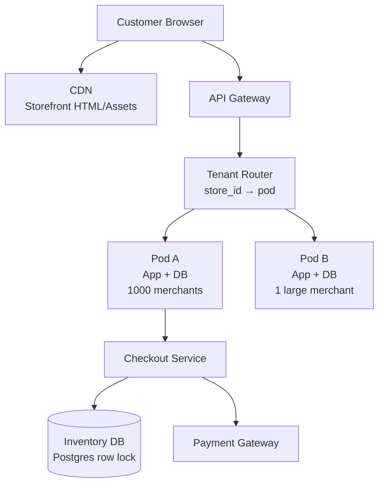

# Design Shopify — Multi-Tenant E-Commerce Platform

**Difficulty**: 🔴 Advanced
**Reading Time**: Coming Soon
**Interview Frequency**: Medium

---

> 🚧 **Full article coming soon.** This stub gives you the essentials to start thinking about this problem.

---

## The Core Problem

Hosting 2 million independent stores on shared infrastructure with data isolation guarantees, while surviving Black Friday flash sales that spike a single store's traffic 100x in seconds — from 100 orders/min to 10,000 orders/min — requires dynamic capacity and careful multi-tenancy design to prevent noisy neighbor effects.

## Functional Requirements

- Merchants can create online stores with products, inventory, and checkout
- Customers can browse, add to cart, and complete purchases
- Each store's data is isolated from other stores
- Platform survives massive traffic spikes (Black Friday, product launches)

## Non-Functional Requirements

| Requirement | Target |
|-------------|--------|
| Availability | 99.99% (52 min/year) |
| Checkout latency | p99 < 2 seconds |
| Inventory accuracy | No overselling (strong consistency) |
| Scale | 2M stores, 100x traffic spikes |

## Back-of-Envelope Estimates

- **Normal traffic**: 2M stores × 100 orders/day avg = 200M orders/day = ~2,300 orders/sec
- **Flash sale spike**: Single viral store: 10,000 orders/min = 167 orders/sec on one DB shard
- **Inventory writes**: 1M concurrent buyers trying to buy last item → need serializable isolation or optimistic lock with retry

## Key Design Decisions

1. **Tenant Isolation: Pod Architecture** — group 1,000-10,000 small merchants per "pod" (DB + app cluster); large/high-traffic merchants get dedicated pods; pods share nothing, preventing noisy neighbor from degrading all stores.
2. **Inventory Locking for Flash Sales** — use database row-level locks with timeout for checkout; implement a queue-based checkout (virtual waiting room) for extremely high-traffic launches to serialize demand without overwhelming DB.
3. **Checkout Idempotency** — generate idempotency key (order_id) before payment; if payment gateway times out, retry with same key; payment provider deduplicates and returns original result rather than double-charging.

## High-Level Architecture

## Top Interview Questions for This Problem

| Question | Tests |
|----------|-------|
| How do you prevent two customers from buying the last item in stock? | Inventory locking, serialization |
| How do you handle a store going from 100 to 100,000 visitors in 30 seconds? | Auto-scaling, virtual waiting room |
| How do you ensure tenant A can never read tenant B's order data? | Row-level security, pod isolation |

## Related Concepts

- [Hotel booking double-booking prevention](../04-reservation-scheduling/hotel-booking)
- [Distributed locking for inventory](../05-infrastructure/distributed-locking)

---

*📚 Full deep-dive with multiple approaches, trade-off tables, and pseudocode coming soon.*

## 📚 Resources & References

| Resource | Type | What You'll Learn |
|----------|------|------------------|
| [Shopify Engineering: Scaling for Flash Sales](https://shopify.engineering/e-commerce-at-scale-inside-shopifys-tech-stack) | 📖 Blog | How Shopify handles Black Friday traffic spikes — 75k req/sec |
| [ByteByteGo — Design an E-Commerce System](https://www.youtube.com/@ByteByteGo) | 📺 YouTube | Search "e-commerce system design" — product catalog, cart, checkout |
| [Shopify Engineering: Database Architecture](https://shopify.engineering/horizontally-scaling-the-rails-backend-of-shop-app-with-vitess) | 📖 Blog | How Shopify uses Vitess to horizontally scale MySQL for millions of stores |
| [Shopify Engineering: Caching at Scale](https://shopify.engineering/building-stateful-rails-applications-at-scale) | 📖 Blog | Multi-tier caching strategy for high-read e-commerce workloads |
| [High Scalability: E-Commerce Architecture](http://highscalability.com) | 📖 Blog | Search "e-commerce" — case studies on product search and checkout scaling |
