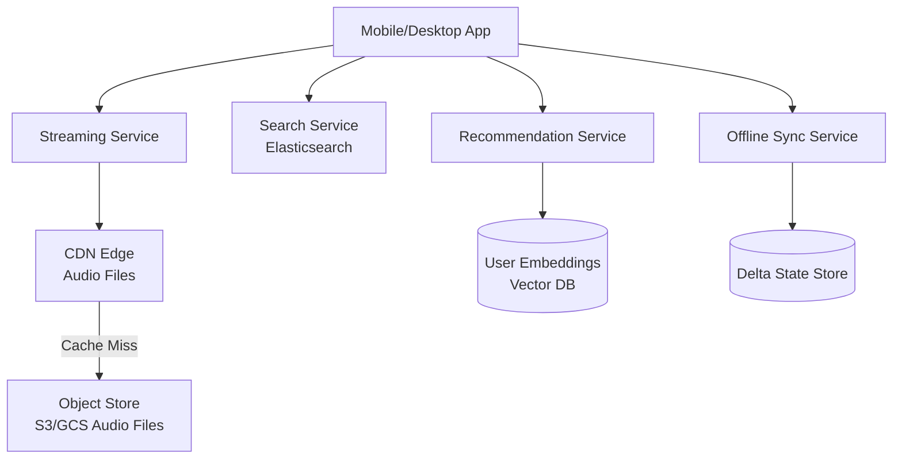

# Design Spotify — Music Streaming at Scale

**Difficulty**: 🟡 Intermediate
**Reading Time**: Coming Soon
**Interview Frequency**: Medium

---

> 🚧 **Full article coming soon.** This stub gives you the essentials to start thinking about this problem.

---

## The Core Problem

Streaming 100+ million songs to 600 million users worldwide with personalized recommendations and offline playback requires solving three distinct challenges: low-latency audio delivery (CDN), intelligent recommendations (ML at scale), and offline sync (delta synchronization without losing user data).

## Functional Requirements

- Stream audio tracks with adaptive quality based on bandwidth
- Generate personalized playlists (Discover Weekly, Daily Mix)
- Support offline playback (sync up to 10,000 songs)
- Browse and search 100M+ tracks, podcasts, audiobooks

## Non-Functional Requirements

| Requirement | Target |
|-------------|--------|
| Availability | 99.99% (52 min downtime/year) |
| Audio start latency | < 250ms from play button press |
| Recommendation freshness | Weekly playlist updates |
| Scale | 600M users, 100M+ tracks, 2B streams/day |

## Back-of-Envelope Estimates

- **Audio bandwidth**: 2B streams/day × 4 min avg × 128 Kbps = ~8PB/day CDN traffic
- **Offline storage per user**: 10,000 songs × 8MB avg (320kbps) = 80GB per heavy offline user
- **Recommendation computation**: 600M users × weekly recompute = 1M user model updates/day

## Key Design Decisions

1. **CDN Pre-warming for Popular Tracks** — top 10,000 songs account for 80% of streams; pre-push these to all CDN PoPs; for long-tail tracks, use origin-pull on first request then cache for 24 hours.
2. **Collaborative Filtering at Scale** — Spotify's matrix factorization (ALS) runs weekly on 600M users × 100M tracks; implicit feedback (plays, skips, repeat listens) trains the model; results stored as 128-dimensional user embeddings for fast nearest-neighbor search.
3. **Delta Sync for Offline** — don't re-download unchanged files; store per-device sync state (last seen version per playlist); send only diff (added/removed tracks) on sync; use content-addressed storage so same song isn't downloaded twice.

## High-Level Architecture

## Top Interview Questions for This Problem

| Question | Tests |
|----------|-------|
| How do you implement gapless playback (no silence between tracks)? | Prefetching, buffer management |
| How would you handle a popular new album release causing CDN cache miss storms? | Cache warming, request coalescing |
| How do you sync offline playlists across multiple devices? | Delta sync, conflict resolution |

## Related Concepts

- [CDN architecture for media delivery](../05-infrastructure/cdn)
- [YouTube/Netflix video streaming comparison](../01-data-processing/youtube-netflix)

---

*📚 Full deep-dive with multiple approaches, trade-off tables, and pseudocode coming soon.*
