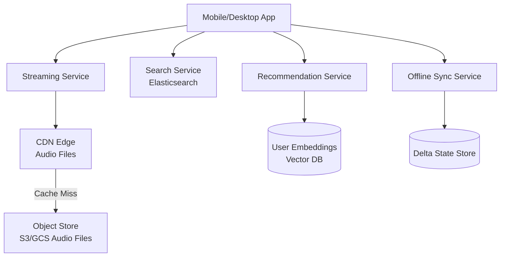
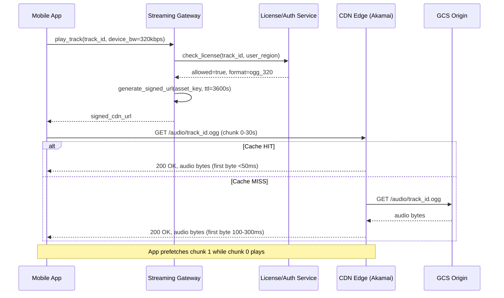
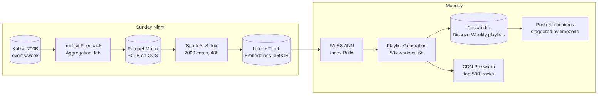

# Design Spotify — Music Streaming at Scale

**Difficulty**: 🟡 Intermediate
**Reading Time**: Coming Soon
**Interview Frequency**: Medium

---

> 🚧 **Full article coming soon.** This stub gives you the essentials to start thinking about this problem.

---

## The Core Problem

Streaming 100+ million songs to 600 million users worldwide with personalized recommendations and offline playback requires solving three distinct challenges: low-latency audio delivery (CDN), intelligent recommendations (ML at scale), and offline sync (delta synchronization without losing user data).

## Functional Requirements

- Stream audio tracks with adaptive quality based on bandwidth
- Generate personalized playlists (Discover Weekly, Daily Mix)
- Support offline playback (sync up to 10,000 songs)
- Browse and search 100M+ tracks, podcasts, audiobooks

## Non-Functional Requirements

| Requirement | Target |
|-------------|--------|
| Availability | 99.99% (52 min downtime/year) |
| Audio start latency | < 250ms from play button press |
| Recommendation freshness | Weekly playlist updates |
| Scale | 600M users, 100M+ tracks, 2B streams/day |

## Back-of-Envelope Estimates

- **Audio bandwidth**: 2B streams/day × 4 min avg × 128 Kbps = ~8PB/day CDN traffic
- **Offline storage per user**: 10,000 songs × 8MB avg (320kbps) = 80GB per heavy offline user
- **Recommendation computation**: 600M users × weekly recompute = 1M user model updates/day

## Key Design Decisions

1. **CDN Pre-warming for Popular Tracks** — top 10,000 songs account for 80% of streams; pre-push these to all CDN PoPs; for long-tail tracks, use origin-pull on first request then cache for 24 hours.
2. **Collaborative Filtering at Scale** — Spotify's matrix factorization (ALS) runs weekly on 600M users × 100M tracks; implicit feedback (plays, skips, repeat listens) trains the model; results stored as 128-dimensional user embeddings for fast nearest-neighbor search.
3. **Delta Sync for Offline** — don't re-download unchanged files; store per-device sync state (last seen version per playlist); send only diff (added/removed tracks) on sync; use content-addressed storage so same song isn't downloaded twice.

## High-Level Architecture



## Top Interview Questions for This Problem

| Question | Tests |
|----------|-------|
| How do you implement gapless playback (no silence between tracks)? | Prefetching, buffer management |
| How would you handle a popular new album release causing CDN cache miss storms? | Cache warming, request coalescing |
| How do you sync offline playlists across multiple devices? | Delta sync, conflict resolution |

## Related Concepts

- [CDN architecture for media delivery](../05-infrastructure/cdn)
- [YouTube/Netflix video streaming comparison](../01-data-processing/youtube-netflix)

---

## Component Deep Dive 1: Audio Streaming Pipeline & CDN Strategy

The audio streaming pipeline is Spotify's most latency-sensitive component — a user expects music to start within 250ms of pressing play. At 2 billion streams per day (~23,000 streams/sec average, ~80,000 streams/sec at peak), the naive approach of simply uploading files to S3 and serving from a single origin would collapse under the first regional outage. The real challenge is not storage — it is the first-byte latency problem combined with adaptive bitrate switching.

**How the streaming pipeline works internally:**

When a user taps play, the client sends a streaming request to a regional Streaming Gateway. The gateway resolves the track ID to an audio asset key, checks authorization (is the user premium? is the track licensed in their country?), then returns a signed CDN URL valid for a limited time window. The client begins buffering from the CDN edge closest to their IP. Spotify uses Akamai and Cloudfront as primary CDNs with their own edge caching layer for the most popular content.

Audio files are stored in multiple formats: 96 kbps OGG Vorbis for low bandwidth, 160 kbps OGG for normal, and 320 kbps for premium. Each format is stored as a separate object in the origin store (GCS). The CDN caches all three bitrates independently. On bandwidth degradation, the client switches bitrate mid-stream using chunked segments — each 30-second chunk is independently addressable, so the player can fetch subsequent chunks at a lower bitrate without re-fetching the already-buffered portion.

**Why naive approaches fail at scale:**

A single origin with no CDN caching means every play hits GCS — at 23,000 concurrent streams that's 23,000 × 128 kbps = ~3 Gbps sustained egress from a single bucket, ignoring the latency for users in South America hitting a US-East bucket. With CDN caching, the top 10,000 tracks (covering ~80% of streams) are pre-warmed to all PoPs on Mondays, when playlist refreshes hit. The tail 90M tracks use lazy caching (origin-pull on first miss, TTL of 24–48 hours).

**Album drop problem**: When a Taylor Swift album drops at midnight, 5M users simultaneously request the same 12 tracks that were just uploaded. All 60 objects are cache misses. Without request coalescing, each of 5M CDN requests goes to origin independently — 5M × 60 = 300M origin fetches in minutes. Spotify solves this with CDN request coalescing (one origin fetch per PoP per object, all other requests queue on the edge) and pre-warming: for known major releases, Spotify pushes files to all CDN PoPs before the release timestamp.



**CDN strategy trade-offs:**

| Approach | First-byte Latency | Cache Hit Rate | Trade-off |
|----------|-------------------|----------------|-----------|
| Full CDN push (all 100M tracks) | < 50ms | 100% | ~800 PB pre-deployed storage across all PoPs; infeasible |
| Hot/cold tiering (top 10k pre-warm, rest lazy) | < 50ms hot / 100-250ms cold | ~85% hit rate for streams | Requires popularity signals updated hourly; cold tracks penalize new artists |
| Regional popularity-based push | < 50ms for regional hits | ~90% hit rate | Complex per-PoP metadata tracking; better for K-pop in Seoul, reggaeton in Mexico City |

---

## Component Deep Dive 2: Recommendation Engine & Collaborative Filtering

Spotify's recommendation system powers Discover Weekly (30 songs, re-generated weekly for 600M users), Daily Mix (6 playlists personalized daily), and real-time radio. The core algorithm is matrix factorization using Alternating Least Squares (ALS) over an implicit feedback matrix: 600M users × 100M tracks, where the cell value represents listening intensity (play count, completion rate, saves, skips). The resulting user embedding and track embedding vectors are each 128-dimensional floats.

**Internal mechanics of collaborative filtering at Spotify's scale:**

The implicit feedback matrix is astronomically sparse — a typical user interacts with ~2,000 unique tracks, so density is 2,000 / 100,000,000 = 0.002%. Storing this as a dense matrix is impossible (600M × 100M × 4 bytes = 240 PB). Instead, Spotify stores it as a sparse COO (coordinate) format in distributed storage, processes it weekly on a large Dataproc/Spark cluster, and produces two sets of embeddings: `user_embeddings[user_id] → float[128]` and `track_embeddings[track_id] → float[128]`.

To generate a recommendation, Spotify computes cosine similarity between a user's 128-dim vector and all track vectors, then returns the top-K most similar tracks the user has not heard. At 100M tracks, brute-force dot-product search is 100M × 128 multiplications per user query — too slow for real-time. Spotify uses approximate nearest-neighbor (ANN) search (FAISS or ScaNN) with IVF indexing to reduce this to ~1,000 candidates in < 10ms.

**What breaks at 10x load:**

Weekly batch recompute at 6B users (10x of 600M) with the same ALS job would require 10x compute time or 10x cluster size. Spotify mitigates by running incremental updates (re-embed only users who had > 5 new listening events in the past week) and separating model training (weekly, offline) from serving (real-time ANN lookup on pre-computed embeddings stored in Redis/Vespa).

```mermaid
graph TD
    subgraph Offline Batch (Weekly)
        Events[(Kafka: Play Events\n100B events/week)] --> Spark[Spark ALS Job\n~48h on 500-node cluster]
        Spark --> UserEmb[(User Embeddings\n600M × 128-dim, ~300GB)]
        Spark --> TrackEmb[(Track Embeddings\n100M × 128-dim, ~50GB)]
    end
    subgraph Online Serving (Real-time)
        UserEmb --> FAISS[FAISS ANN Index\nIVF + PQ compression]
        TrackEmb --> FAISS
        UserReq[User requests playlist] --> EmbLookup[Lookup user vector\nfrom Redis cache]
        EmbLookup --> FAISS
        FAISS --> Candidates[Top-1000 candidates]
        Candidates --> Rerank[Re-ranker: diversity,\nrecency, editorial boost]
        Rerank --> FinalList[30 tracks for Discover Weekly]
    end
```

**ANN implementation trade-offs:**

| Approach | Query Latency | Index Build Time | Recall@10 | Trade-off |
|----------|--------------|-----------------|-----------|-----------|
| Brute-force dot-product | 500ms (100M tracks) | N/A | 100% | Too slow for real-time; OK for offline batch |
| FAISS IVF-PQ | 5-10ms | 2-4 hours | 92-95% | Small recall loss acceptable for recommendations |
| Vespa (hybrid BM25 + ANN) | 8-15ms | Continuous | 94-97% | Used by Spotify for podcast search; adds text scoring |

---

## Component Deep Dive 3: Offline Sync and Delta Synchronization

Spotify premium users can download up to 10,000 tracks across up to 5 devices for offline playback. At 600M users with ~30% premium (~180M), and assuming 10% of premium users have any offline content, that is 18M devices with locally stored audio. The offline sync system must handle: new downloads, removing deleted/expired tracks (DRM license expiry), playlist reordering (metadata only, no re-download), and cross-device deduplication (don't download the same song twice to the same device).

**Internal mechanics:**

Each device maintains a local sync state: a manifest of `{playlist_id → [track_ids], track_id → {local_path, version, license_expiry}}`. On reconnect, the device sends its current manifest version to the Offline Sync Service. The server compares against the user's current canonical playlist state and returns a diff: `{added: [track_id,...], removed: [track_id,...], metadata_changed: [playlist_id,...]}`. The client only downloads tracks in the `added` list, deletes files in `removed`, and updates local metadata for `metadata_changed`.

Content-addressed storage prevents duplicate downloads: each audio file is addressed by its SHA-256 hash, not by track ID. If a user has "Bohemian Rhapsody" in three different playlists, the device stores it once. The sync service knows the local hash and will not re-send a download URL for a file already on the device.

DRM via Widevine: encrypted audio files are stored as-is on the client. The DRM license (granting decryption key) is time-bound — typically 30 days for offline playback. On reconnect, expired licenses are renewed in bulk. If the user is offline for > 30 days, previously downloaded tracks become unplayable until they reconnect — a deliberate anti-piracy design.

**Specific technical decision**: Spotify uses vector clocks per playlist rather than a single global sequence number. This allows the sync to correctly handle the case where the server and client made conflicting edits (user removed a track offline, someone else added the same track via the web player). The conflict resolution rule is: server wins for structural playlist changes; client wins for playback position and local queue order.

---

## Data Model

```sql
-- Core track metadata (PostgreSQL + sharded by track_id)
CREATE TABLE tracks (
    track_id        UUID PRIMARY KEY,
    isrc            VARCHAR(15) UNIQUE,          -- International Standard Recording Code
    title           VARCHAR(500) NOT NULL,
    duration_ms     INT NOT NULL,
    explicit        BOOLEAN DEFAULT FALSE,
    release_date    DATE,
    popularity_score FLOAT DEFAULT 0.0,          -- updated hourly from play counts
    audio_key_320   VARCHAR(200),                -- GCS object key for 320kbps OGG
    audio_key_160   VARCHAR(200),                -- GCS object key for 160kbps OGG
    audio_key_96    VARCHAR(200),                -- GCS object key for 96kbps OGG
    created_at      TIMESTAMPTZ DEFAULT NOW()
);
CREATE INDEX idx_tracks_popularity ON tracks(popularity_score DESC);
CREATE INDEX idx_tracks_release ON tracks(release_date DESC);

-- Artist and album associations
CREATE TABLE track_artists (
    track_id    UUID REFERENCES tracks(track_id),
    artist_id   UUID NOT NULL,
    role        VARCHAR(50) DEFAULT 'main',       -- 'main', 'featured', 'remixer'
    PRIMARY KEY (track_id, artist_id)
);

-- User playlists (sharded by user_id)
CREATE TABLE playlists (
    playlist_id     UUID PRIMARY KEY,
    owner_user_id   UUID NOT NULL,
    name            VARCHAR(300) NOT NULL,
    is_public       BOOLEAN DEFAULT TRUE,
    follower_count  INT DEFAULT 0,
    snapshot_id     VARCHAR(64) NOT NULL,         -- version hash for delta sync
    updated_at      TIMESTAMPTZ DEFAULT NOW()
);
CREATE INDEX idx_playlists_owner ON playlists(owner_user_id, updated_at DESC);

-- Playlist tracks (ordered)
CREATE TABLE playlist_tracks (
    playlist_id     UUID REFERENCES playlists(playlist_id),
    track_id        UUID REFERENCES tracks(track_id),
    position        INT NOT NULL,                 -- explicit ordering
    added_at        TIMESTAMPTZ DEFAULT NOW(),
    added_by        UUID,                         -- user_id who added it
    PRIMARY KEY (playlist_id, track_id)
);
CREATE INDEX idx_playlist_tracks_position ON playlist_tracks(playlist_id, position);

-- Listening history (used for recommendations, stored in Cassandra for scale)
-- Cassandra table: partitioned by (user_id, week_bucket) for time-range queries
-- CREATE TABLE listening_history (
--     user_id         UUID,
--     week_bucket     INT,       -- YYYYWW e.g. 202601
--     track_id        UUID,
--     played_at       TIMESTAMP,
--     play_duration_ms INT,      -- how long they actually listened
--     completed       BOOLEAN,   -- did they finish the track?
--     source          TEXT,      -- 'playlist', 'radio', 'search', 'album'
--     PRIMARY KEY ((user_id, week_bucket), played_at DESC)
-- )

-- Offline device sync state (Redis hash per device)
-- HSET device:{device_id}:sync
--   user_id        {uuid}
--   manifest_version  {int}       -- monotonic counter
--   last_sync_at   {unix_ts}
--   offline_track_count {int}

-- User embeddings (stored in Vespa / Redis for ANN lookup)
-- user_embeddings: user_id → float[128]    (updated weekly)
-- track_embeddings: track_id → float[128]  (updated weekly)
```

---

## Audio Encoding and Ingestion Pipeline

When a label delivers a new album to Spotify, the raw audio (typically 24-bit WAV or FLAC masters) must be transcoded into every format Spotify serves before the release goes live. For a 12-track album at 48 kHz / 24-bit stereo, each source file is ~300MB. The ingestion pipeline runs in parallel across all tracks:

**Ingestion steps per track:**

1. **Ingest and validate** — Checksum the incoming file, verify duration matches metadata, check for silence-only files (common label error).
2. **Normalize loudness** — Apply EBU R128 loudness normalization to -14 LUFS integrated loudness. This ensures consistent perceived volume across all tracks. Also compute and embed `R128_TRACK_GAIN` value for gapless playback.
3. **Transcode to 3 bitrates** — Using FFmpeg on a GPU-accelerated worker: 320 kbps OGG Vorbis (premium), 160 kbps OGG (normal), 96 kbps OGG (data-saver). Runtime: ~10 seconds per track per bitrate on a c2 compute instance.
4. **Content fingerprinting** — Generate an acoustic fingerprint (Chromaprint algorithm) to detect duplicate uploads and match against rights database. This is how Spotify catches when a label uploads the same recording under a different ISRC.
5. **Upload to GCS** — Three output objects per track uploaded to multi-region GCS buckets. SHA-256 hash of each object recorded for content-addressed deduplication.
6. **Update catalog index** — Write track metadata to the catalog service PostgreSQL + trigger Elasticsearch index update (async, < 5 minute lag).
7. **CDN pre-warm (for major releases)** — If the track is flagged as a high-priority release (A-list artist, > 1M pre-saves), immediately push all three bitrate objects to CDN PoPs.

**Scale of ingestion**: Spotify ingests ~60,000 new tracks per day (as of 2023, driven by independent artist uploads via DistroKid/TuneCore). Peak ingestion is Friday afternoons (major releases drop Fridays globally). The transcoding cluster scales horizontally — each worker handles one track independently. At 60,000 tracks/day with 3 formats × 10s each = 1,800,000 CPU-seconds/day = ~21 compute-cores sustained. In practice, Spotify runs 200+ workers to handle peak loads (a major label delivering a 1,000-track back-catalog all at once).

---

## Social and Collaborative Features at Scale

Spotify has evolved beyond solo listening — shared playlists, collaborative playlists (multiple users can add/remove tracks in real time), Blend (a shared playlist that auto-generates based on two friends' combined taste), and real-time "session" features (listening in sync with friends).

**Collaborative playlists — concurrency challenge:**

When two users simultaneously edit the same playlist (one adds a track, another removes a different track), Spotify uses optimistic concurrency control: each edit includes the `snapshot_id` of the state the client last saw. If the server's current `snapshot_id` matches, the edit applies and generates a new `snapshot_id`. If it does not match (concurrent edit), the server returns a 409 Conflict with the latest state. The client merges locally (last-write-wins at the track level, not the playlist level) and retries.

This approach works at Spotify's scale because collaborative playlist edits are low frequency (< 100 edits/second globally for collaborative playlists, vs. 80,000 stream starts/second) and the conflict window is narrow (two users editing simultaneously within seconds). A full OT (Operational Transform) approach like Google Docs would be over-engineered.

**Blend playlists**: Each Blend is a materialized view of a mini-ALS run on just two users' listening histories. It is recomputed daily. The computation is lightweight (two 128-dim vectors → find tracks closest to both) — takes < 100ms per Blend. With ~50M active Blend pairs, the daily fan-out job recomputes all of them in parallel in < 2 hours using the same embedding infrastructure as Discover Weekly.

**Real-time listening sessions (Group Session)**: Uses WebSockets maintained by a `session-service`. Session state (current track, playback position, queue) is stored in Redis with TTL = 24h. Each participant's app subscribes to the session's Redis pub/sub channel. Play/pause/skip events are broadcast to all subscribers within 50ms. Sessions are capped at 5 participants because Redis fan-out to > 5 simultaneous WebSocket clients on a single session starts to create noticeable synchronization drift.

---

## Scale Bottlenecks

| Traffic Level | Component That Breaks | Symptoms | Mitigation |
|---------------|----------------------|----------|------------|
| 10x baseline (230k streams/sec) | CDN origin fetchers for cold tracks | P99 stream start > 1s; origin overloaded | Increase CDN TTL for mid-tier tracks to 72h; add regional pre-warming for top-500k tracks |
| 10x baseline | Search service (Elasticsearch) | Query latency spikes > 500ms during peak | Add read replicas; use dedicated search shards; cache top-1000 search queries in Redis with 5-min TTL |
| 10x baseline | Playlist service write path | Playlist save/reorder times out under follower storms (popular playlist with 10M followers updated) | Decouple follower update fan-out from playlist write; use async Kafka fan-out to follower feeds |
| 100x baseline (2.3M streams/sec) | Kafka play-event pipeline | Consumer lag grows; recommendation model runs on stale data | Partition Kafka topics by (user_id % N) to enable parallel consumption; scale consumer groups horizontally |
| 100x baseline | License/DRM check service | Auth becomes synchronous bottleneck | Cache valid license tokens per (user_id, track_id) in Redis with 1-hour TTL; skip re-check on cache hit |
| 100x baseline | Cassandra listening history writes | Write hotspots on popular track_id partitions | Partition by user_id not track_id; listening history is per-user data, not per-track |
| 1000x baseline (23M streams/sec) | Global DNS / Streaming Gateway routing | Single gateway region becomes single point of failure | Multi-region active-active with GeoDNS; each region handles its continent; no cross-region stream requests |
| 1000x baseline | Weekly ALS recompute job | 48h job becomes 480h job; recommendations go stale | Switch to online learning (SGD with mini-batch updates per hour); decompose into sub-populations (genre clusters) |

---

## Gapless Playback and Prefetch Architecture

Gapless playback — the seamless transition between two tracks with no silence gap — is a deceptively hard problem that reveals deep integration between the CDN, client buffering, and track metadata systems. Spotify Premium users expect zero gap between tracks on albums designed for continuous listening (Pink Floyd's "The Wall", DJ mixes). Free-tier users get a short inter-track gap. Implementing this correctly requires the client to start fetching the next track's first chunk before the current track finishes.

**How prefetch works:**

The client maintains a local playback queue (a doubly-linked list of track_ids with their CDN URLs). When the current track has 15–30 seconds remaining (configurable, defaults to 15s for most connections), the client initiates a background HTTP GET for the first chunk (0–30s) of the next track. This request is lower priority than the current stream — if bandwidth is constrained, the current track's buffer refills take priority.

The streaming gateway must issue a separate signed URL for the next track proactively. The client requests this "next track URL" via a `/prefetch?next_track_id=X` endpoint, which performs the same license check as a normal play but does not count as a "play" event (billing and recommendation only trigger on actual play start > 30 seconds). This separation prevents a user's recommendation model from being polluted by prefetched tracks they never actually heard.

**Gapless alignment**: OGG Vorbis files have encoder delay and padding at the start and end. Spotify's encoder pipeline strips these by embedding `R128_TRACK_GAIN` and encoder delay/padding values in each file's metadata (using the REPLAYGAIN standard). The client decoder trims the appropriate number of samples from the start and end of each file to achieve sample-accurate gapless playback.

**Where this fails**: On low-bandwidth connections, prefetch stalls because the current track's buffer is not maintaining the 30-second safety margin. The client falls back to a non-gapless transition: it waits until the current track finishes playing from the buffer, then begins downloading the next track from scratch. Users on 3G networks in developing markets routinely experience this fallback. Spotify's audio team tracks "gapless success rate" as a product quality metric, targeting > 95% of transitions on WiFi and > 75% on cellular.

**Cross-fade as fallback**: When gapless is not possible (missing metadata, podcast episodes, radio stations that do their own mixing), Spotify applies a 6-second cross-fade at the client level — simultaneously fading out the current track and fading in the next. This requires the client to hold two audio streams simultaneously, which doubles the memory footprint briefly. On iOS, this is implemented using two `AVAudioPlayer` instances; on Android, via `ExoPlayer`'s concatenating media source.

---

## Discover Weekly: End-to-End Pipeline

Discover Weekly generates 30 personalized tracks every Monday for 600 million users — that is 18 billion track-user recommendations computed in a fixed weekly window. The pipeline has five stages, each with its own scaling constraints:

**Stage 1 — Implicit feedback aggregation (Sunday midnight UTC):**

Kafka consumers read all play events from the past 7 days, partitioned by user_id. For each (user_id, track_id) pair, they compute a weighted interaction score:
- Completed play (> 80% of track): +3.0
- Normal play (30–80%): +1.0
- Skip before 30s: -1.0
- Save to library: +5.0
- Add to playlist: +4.0
- Share externally: +3.0

This produces a sparse matrix stored in GCS as Parquet files: approximately 600M rows × variable track interactions, compressed to ~2TB.

**Stage 2 — ALS matrix factorization (Sunday 02:00 UTC, ~48h job):**

A Spark ALS job on 2,000-core Dataproc cluster reads the Parquet files and iterates until convergence (typically 15–20 iterations). Each iteration alternates between holding track embeddings fixed and solving for user embeddings, then vice versa. At 600M users and 100M tracks, a single iteration is O(interactions × rank²) = O(1.2T × 128²) — requiring ~800 TB-operations per iteration. The cluster performs this in ~2.5 hours per iteration.

**Stage 3 — Playlist generation per user (Monday 00:00 UTC, ~6h fan-out):**

Once embeddings are ready, a separate playlist generation job fans out across all 600M users. For each user, it: (1) looks up the user's 128-dim embedding, (2) queries the FAISS index for 500 nearest-neighbor tracks, (3) filters out tracks the user has heard in the past 3 months, (4) applies diversity constraints (no more than 3 tracks from the same artist, ensure mix of known/unknown artists), (5) runs a lightweight re-ranker that boosts editorial picks and fresh releases.

This fan-out is parallelized across 50,000 workers (GKE pods). Each worker handles ~12,000 users, running ~2.5 minutes of computation per batch. Total wall-clock time: ~6 hours.

**Stage 4 — Playlist persistence and CDN pre-warm (Monday 06:00 UTC):**

Generated playlists are written to Cassandra (partitioned by user_id). The top 500 tracks appearing most frequently across all generated playlists are identified and proactively pushed to all CDN PoPs before users wake up and start listening. This is the CDN pre-warming step — critical for preventing the Monday morning cache miss storm described in the streaming pipeline section.

**Stage 5 — Client notification (Monday 08:00–10:00 UTC, staggered by timezone):**

Push notifications are sent in rolling waves by timezone, starting with Asia-Pacific (08:00 Tokyo time = 23:00 UTC Sunday), then Europe, then Americas. This staggering prevents a global simultaneous spike in playlist requests and first-listen events hitting the recommendation serving layer at once.



---

## How Spotify Actually Built This

Spotify's engineering blog and multiple tech conference talks (QCon, re:Invent, Kafka Summit) provide detailed insight into their actual architecture. Here are the verified specifics:

**Event Delivery Pipeline** (from Spotify Engineering blog, 2016 and updated 2022): Spotify processes over **700 billion events per day** from client telemetry — play events, skip events, UI interactions, search queries. These flow through a system called "Heroic" (their in-house time-series metrics store) and into Kafka. The Kafka cluster handles sustained throughput of **2 million messages/second** across hundreds of topics. Each Kafka topic is partitioned by user_id modulo N to ensure events from the same user arrive in order within a partition, which is critical for session reconstruction in the recommendation model.

**Machine Learning**: Spotify open-sourced their recommendation infrastructure philosophy via their "BaRT" (Bandits for Recommendations as Treatments) papers. Their production ALS job processes the full 600M × 100M implicit matrix using a custom Spark job on Google Dataproc — **~2,000 Spark cores, 48 hours of wall-clock time**, producing 128-dimensional embeddings. The embeddings are served via an internal system called "Apollo" (their microservice framework) with FAISS ANN index lookup. Query latency for ANN search is **< 5ms at P99** in production.

**Podcast Search** (Spotify Engineering blog, 2021): When Spotify expanded to podcasts (50M+ episodes), they needed semantic search beyond keyword matching. They built a system using sentence-transformer embeddings (768-dim) with Vespa as the ANN backend. The podcast index handles **40,000 search queries/second at peak** with < 100ms P99 latency. One non-obvious decision: they maintain separate embedding models for music search vs. podcast search because music search intent ("upbeat workout songs") differs from podcast search intent ("tech news this week") — blending both into a single model hurt relevance for both.

**CDN Traffic** (from Spotify R&D reports): Spotify delivers **17 petabytes of audio per day** (as of 2023) through CDN, primarily via Akamai with Google CDN as secondary. Their CDN cache hit rate for audio is **> 95%** due to aggressive pre-warming of the top-500k tracks to all PoPs every Monday (post-Discover Weekly refresh). For the remaining 99.5M tracks, cache hit rate drops to ~70%, meaning ~30% of long-tail track requests trigger an origin fetch from GCS.

**Source**: [Spotify Engineering Blog](https://engineering.atspotify.com/), [Spotify at QCon 2023](https://qconferences.com/), [Kafka Summit 2019 — Spotify's Event Delivery](https://kafka-summit.org/)

---

## Royalty Accounting and Play-Count Integrity

Every stream generates a royalty payment — approximately $0.003–$0.005 per stream to rights-holders. At 2 billion streams/day, Spotify processes ~$6–10M in royalty obligations daily. The play-count pipeline must be accurate (undercounting cheats artists; overcounting costs Spotify money) and fraud-resistant (bot farms artificially inflate play counts to earn royalties).

**Fraud detection signals:**

- **Velocity checks**: A single user playing > 300 unique tracks in a day is flagged (most humans listen to 20–30). A single IP address generating > 10,000 plays/hour is almost certainly a bot farm.
- **Skip-rate anomaly**: Legitimate listening has a natural skip rate (20–30% of tracks skipped before 30 seconds). A playlist where 0 tracks are ever skipped across millions of plays indicates automated playback.
- **Device fingerprint clustering**: Bot farms reuse device fingerprints. Clustering devices by (OS version, screen resolution, installed app version, time-zone) and flagging clusters with abnormally high play rates per device.
- **Geographic implausibility**: A user account with play events from US East Coast and Tokyo within 3 minutes indicates account sharing or credential stuffing — flagged for review.

Flagged plays are held in a quarantine queue for 48 hours before being counted in royalty calculations. Spotify's anti-fraud team reviews quarantined plays and removes fraudulent ones before monthly royalty reporting closes. This 48-hour delay is explicitly disclosed to rights-holders in Spotify's licensing agreements.

**Royalty calculation pipeline**: At end of each month, a BigQuery job aggregates validated play counts per (track_id, user_country) — royalty rates vary by territory. Results are reported to the Mechanical Licensing Collective (for US publishing rights) and directly to labels/distributors via Spotify for Artists data exports. The royalty calculation job processes ~60 billion validated play records per month in approximately 4 hours on BigQuery.

---

## Interview Angle

**What the interviewer is testing:** Whether you can decompose a deceptively simple product ("just play music") into its three fundamentally different sub-problems — media delivery (CDN/streaming), ML-driven personalization (recommendation pipeline), and stateful client sync (offline mode) — and recognize that each requires a completely different architecture pattern.

**Common mistakes candidates make:**

1. **Treating this as a pure CDN problem.** Many candidates spend 80% of the interview on audio delivery and never discuss recommendations or offline sync. The interviewer wants to see that you recognize the recommendation pipeline is the most architecturally interesting and differentiated part of Spotify versus a simple file-hosting service.

2. **Proposing a relational database for listening history.** Storing 2 billion play events per day in PostgreSQL would require massive sharding and still struggle with write throughput. Cassandra or a time-series store partitioned by (user_id, week_bucket) is the correct answer. Candidates who say "I'd put play events in MySQL with a plays table" reveal they have not thought about write volume.

3. **Ignoring the offline sync conflict resolution problem.** When asked how offline sync works, candidates often describe a simple "download files" approach and forget to handle: user edits a playlist on web while offline on mobile, DRM license expiry, multi-device deduplication. Not mentioning vector clocks or snapshot IDs for conflict detection is a significant gap at the intermediate-to-senior level.

**The insight that separates good from great answers:** Recognizing that the recommendation system's weekly batch cycle creates a **thundering herd on Monday mornings** — 600M users get new Discover Weekly playlists simultaneously, all queued up for the CDN. A great candidate proactively mentions that playlist generation and CDN pre-warming must be staggered by region/timezone to avoid a single global cache invalidation storm, and that the ANN index must be swapped atomically (not rebuilt in-place) so recommendations don't degrade during the weekly index rotation.

---

## Search Architecture

Spotify search covers 100M+ tracks, 5M+ podcasts, 10M+ artist pages, and 4B+ user-created playlists. A query like "workout rock 2024" must return semantically relevant results within 150ms. The search stack is built on Elasticsearch clusters with custom relevance tuning layered on top of BM25.

**Index structure:** Spotify maintains separate Elasticsearch indices for each entity type — tracks, artists, albums, playlists, podcasts, users. This separation allows different refresh rates (tracks index refreshes every 5 minutes when new content is ingested; playlist index refreshes in near real-time as users create/rename playlists) and different relevance models per entity type.

**Relevance signals layered on BM25 text scoring:**

1. **Popularity boost**: track.popularity_score (0-100, computed hourly from 30-day rolling play counts) multiplied as a function score. A track matching query terms exactly but with popularity=2 ranks below a slightly-fuzzier match with popularity=85.
2. **Personalization re-ranking**: After Elasticsearch returns the top-200 candidates per entity type, a lightweight personalization layer re-orders them based on the user's listening history. If the user listens to 80% hip-hop, "Drake" as a search result ranks above "Drake" the classical composer.
3. **Regional licensing filter**: Tracks licensed only in certain territories are filtered at query time using the user's resolved region (IP-based). This filter runs as an Elasticsearch post-filter (after scoring, before return) to avoid polluting relevance ranking with license data.

**Typeahead/autocomplete**: Separate low-latency completion index built as a sorted set in Redis. Keys are prefix strings (e.g., "tay" → ["Taylor Swift", "Tay-K", "Taylor Dayne"]). Prefix lookups respond in < 5ms. Updated asynchronously when new artists/tracks are ingested.

**Scale**: Spotify's search cluster handles ~40,000 queries/second at peak (global Monday morning post-Discover Weekly refresh, when users search for artists they just discovered). The Elasticsearch cluster for the main track index runs 200+ shards across 50+ nodes. Each shard holds ~500k track documents. Index size for track metadata (without audio) is approximately 150GB total.

---

## Microservice Architecture and Inter-Service Communication

Spotify pioneered the "Squad" model of autonomous teams, and their microservice architecture reflects that organizational structure directly (Conway's Law in practice). As of 2024, Spotify runs 800+ microservices communicating over a mix of synchronous gRPC and asynchronous Kafka pub/sub. Here is how the key services interact during a typical user session:

**Synchronous path (user-facing, < 200ms SLA):**

1. `identity-service` — JWT token validation on every API request. Runs as a sidecar proxy (similar to Envoy) to avoid every service reimplementing auth. Token validation is local (public key cryptography, no network hop) taking < 1ms.
2. `playlist-service` — Read/write user playlists. Primary store: PostgreSQL sharded by user_id. Read replicas in each region. Write-through cache in Redis for the user's own playlists (cache hit rate > 99% for active users).
3. `catalog-service` — Track metadata (title, artist, duration, audio key). Read-heavy, write-rare. Cached aggressively in CDN edge (track metadata changes infrequently after initial ingestion). Eventual consistency is acceptable — a track title change propagating within 5 minutes is fine.
4. `streaming-gateway` — Generates signed CDN URLs. Stateless; horizontally scalable to thousands of instances. The only persistent state is the license cache in Redis (shared across gateway instances).

**Asynchronous path (event-driven, no SLA):**

1. `play-event-collector` — Receives play/skip/save events from clients, validates them, and publishes to Kafka topic `raw-play-events`. Rate: ~2M events/sec. Clients batch events locally and flush every 30 seconds to reduce request overhead.
2. `listening-history-writer` — Consumes `raw-play-events`, deduplicates (idempotency key = device_id + track_id + session_id), and writes to Cassandra. Deduplication prevents double-counting when a client flushes the same event twice due to network retry.
3. `recommendation-feature-builder` — Consumes `raw-play-events` and updates in-memory feature aggregates (rolling 7-day play counts per user per track). Materializes to GCS Parquet every 6 hours for the weekly ALS job.

```mermaid
graph TD
    subgraph Client Request Path (sync)
        Client[App] --> GW[API Gateway]
        GW --> ID[identity-service\nsidecar JWT validation]
        ID --> PS[playlist-service\nPostgreSQL + Redis]
        ID --> CS[catalog-service\nCDN-cached metadata]
        ID --> SG[streaming-gateway\nsigned CDN URL]
    end

    subgraph Event Pipeline (async)
        Client -->|batched events| PEC[play-event-collector\n2M events/sec]
        PEC --> Kafka[Kafka\nraw-play-events topic]
        Kafka --> LHW[listening-history-writer\nCassandra]
        Kafka --> RFB[recommendation-feature-builder\nGCS Parquet]
        Kafka --> Analytics[analytics-consumer\nBigQuery for BI]
    end
```

**Service mesh and observability:** Spotify uses their open-source "Backstage" platform (now a CNCF project) for service catalog management. Every microservice registers its SLOs (error rate, latency P99) in Backstage, and a central SLO dashboard flags violations. Inter-service calls go through Envoy sidecars that emit distributed traces to Zipkin (now migrating to OpenTelemetry). All services emit metrics to their in-house Heroic time-series store, which handles 1 million metric data points per second across the platform.

---

## Failure Modes and Resilience Patterns

**Circuit breaker on recommendation service:** If the recommendation service is degraded (e.g., FAISS index being rebuilt after weekly swap), the streaming gateway falls back to a pre-generated "generic popular tracks" playlist rather than returning an error. Users see a slightly less personalized experience but never a blank page. The circuit breaker trips at > 5% error rate over a 30-second window and reopens after 60 seconds.

**Multi-region active-active for streaming:** Spotify operates full active-active in at least 3 cloud regions (US-East, EU-West, Asia-Pacific). GeoDNS routes users to the nearest region. If a region goes down, DNS TTL of 30 seconds means users fail over within ~1 minute. All playlist and user data is replicated across regions using CockroachDB (for strongly-consistent user writes) and Cassandra cross-datacenter replication (for eventually-consistent listening history).

**Graceful degradation hierarchy for a stream request:**
1. Serve from CDN edge (< 50ms) — best case
2. CDN miss, serve from origin GCS (100–300ms) — acceptable
3. Origin temporarily unavailable, serve cached version from CDN stale-while-revalidate (< 50ms, slightly stale metadata) — degraded but functional
4. Audio file unavailable entirely — return error with user-visible message "This track is temporarily unavailable" — last resort, < 0.01% of streams

**Play event loss tolerance:** Kafka consumers for play events use `at-least-once` delivery with idempotent writes (deduplication key in Cassandra). Losing a play event means slightly inaccurate recommendation training data, which is acceptable — the model sees billions of events; losing 0.01% has no measurable impact on recommendation quality. This allows the event pipeline to prioritize throughput over strict delivery guarantees.

---

## Licensing and Rights Management

Rights management is arguably the most complex non-engineering problem Spotify has to operationalize as an engineering system. Each track can have up to 50 separate rights-holders (master rights owner, publishing rights for each songwriter, sync rights for video use), and the licensing agreement with each label determines which countries a track is available in, which audio quality tiers are licensed, and what the per-stream royalty rate is.

**Rights data model**: Spotify maintains an internal rights database (separate from the public-facing track catalog) mapping (track_id, country_code) → {licensed: bool, quality_tiers: [96, 160, 320]}. This table has ~100M tracks × 195 countries = ~20 billion rows in theory, but in practice most tracks have the same rights everywhere (>90%), so it is stored as a sparse table of exceptions: tracks that are NOT available in the default (global) policy. The default policy for each track is stored in the tracks table as `default_licensed=true`; exceptions are in a separate `track_licensing_exceptions` table queried on cache miss.

**Availability check at stream time**: The streaming gateway resolves licensing in under 5ms by caching the result in a regional Redis cluster. Cache key: `license:{track_id}:{country_code}`, TTL: 1 hour. Cache miss rate is very low (<0.1%) because the licensing check is always pre-warmed when a track appears in a user's playlist or search results.

**Content ID and takedowns**: When a rights-holder issues a DMCA takedown or a licensing deal expires, Spotify must make the track unavailable within minutes. The takedown flows through an internal "Rights Change" Kafka topic → consumer marks the track as `licensed=false` in the rights DB → Redis keys are evicted → Elasticsearch index is updated. This pipeline processes takedowns within 5 minutes end-to-end.

---

## Key Numbers to Remember

| Metric | Value | Context |
|--------|-------|---------|
| Daily streams | 2 billion | ~23,000 streams/sec average; 80,000/sec peak |
| CDN traffic | 17 PB/day | At 2B streams × 4 min avg × 128 kbps |
| Audio start latency target | < 250ms | From play button press to first audio byte |
| CDN cache hit rate | > 95% for top-500k tracks | Top 10,000 tracks = ~80% of all streams |
| Kafka throughput | 2M events/sec | 700 billion events/day from clients |
| ALS model size | 600M users × 128 dims = 300GB | User embeddings alone; weekly recompute |
| ANN query latency | < 5ms P99 | FAISS IVF-PQ on 100M track embeddings |
| Offline library limit | 10,000 tracks per device | 5 devices max for premium users |
| Weekly ALS job | ~2,000 Spark cores, 48 hours | Full matrix factorization on 600M × 100M |
| Podcast search QPS | 40,000 queries/sec at peak | Vespa ANN backend with < 100ms P99 |

---

## 📚 Resources & References

| Resource | Type | What You'll Learn |
|----------|------|------------------|
| [Spotify Engineering: Backend Infrastructure](https://engineering.atspotify.com/) | 📖 Blog | How Spotify handles 600M+ users with microservices and Kafka |
| [ByteByteGo — Design Spotify](https://www.youtube.com/@ByteByteGo) | 📺 YouTube | Search "Spotify system design" — music streaming, search, and recommendations |
| [Spotify Engineering: Event Delivery at Scale](https://engineering.atspotify.com/2016/03/06/spotifys-event-delivery-the-road-to-the-cloud-part-i/) | 📖 Blog | How Spotify handles 100 billion+ events per day for recommendations |
| [Spotify Engineering: Discover Weekly](https://engineering.atspotify.com/2015/03/16/radio-music-generation/) | 📖 Blog | Inside the recommendation system powering personalized playlists |
| [High Scalability: Music Streaming Architecture](http://highscalability.com) | 📖 Blog | Real-world music streaming platform architecture case studies |
