# Design Twitter — The Fan-out Problem at Scale

**Difficulty**: 🟡 Intermediate → 🔴 Advanced
**Reading Time**: ~35 minutes
**The Core Problem**: When Katy Perry (100M followers) posts a tweet, how do you deliver it to 100M inboxes in under 5 seconds — without melting your infrastructure?

---

## Table of Contents

1. [The Mental Model — What Happens When You Tweet?](#1-the-mental-model)
2. [The Core Problem: The Fan-out Dilemma](#2-the-fan-out-dilemma)
3. [Requirements with Numbers](#3-requirements-with-numbers)
4. [Capacity Estimation](#4-capacity-estimation)
5. [The Fan-out Problem — 3 Approaches](#5-three-approaches-to-fan-out)
6. [Full System Architecture](#6-full-system-architecture)
7. [The Twitter Timeline — Deep Dive](#7-timeline-deep-dive)
8. [The Social Graph](#8-the-social-graph)
9. [Tweet Storage — Why NoSQL?](#9-tweet-storage)
10. [Likes & Retweets — The Counter Problem](#10-likes-and-retweets)
11. [Search — Full-Text Tweet Search](#11-search)
12. [Problems at Scale](#12-problems-at-scale)
13. [Notification System](#13-notification-system)
14. [Interview Questions Mapped](#14-interview-questions-mapped)
15. [Key Takeaways](#15-key-takeaways)
16. [Related Concepts](#16-related-concepts)

---

## 1. The Mental Model

Before we dive into architecture, understand the two core flows in Twitter. Every design decision flows from these two paths:

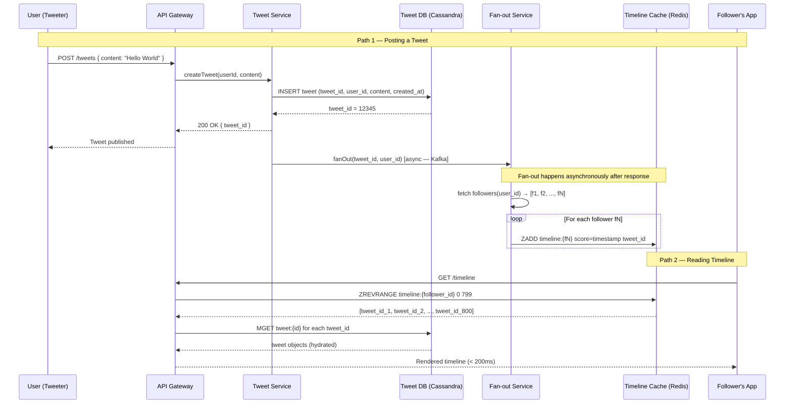

**The key insight**: the write path and the read path are decoupled. When you post a tweet, you get a `200 OK` immediately. The fan-out to followers' caches happens asynchronously via Kafka workers — that is why there is a < 5 second lag before followers see your tweet.

---

## 2. The Fan-out Dilemma

This is the central systems design challenge of Twitter. There are two naive extremes, both of which fail at scale.

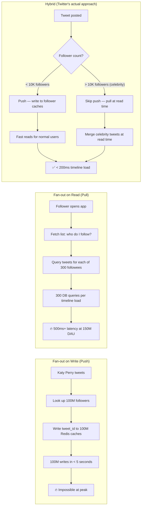

**The tradeoff in one sentence**: Push (fan-out on write) makes reads fast but writes expensive for celebrities. Pull (fan-out on read) makes writes cheap but reads expensive for users following many accounts. The hybrid model splits by follower count.

---

## 3. Requirements with Numbers

### Functional Requirements

| Feature | Description |
|---------|-------------|
| Tweet | Post up to 280 characters; include images, videos, polls, links |
| Follow / Unfollow | Directed relationship (A follows B doesn't mean B follows A) |
| Like | Increment a counter; show who liked (for smaller counts) |
| Retweet | Republish someone's tweet to your followers |
| Home Timeline | Ordered feed of tweets from accounts you follow |
| User Timeline | All tweets by a specific user, reverse-chronological |
| Search | Full-text search over tweets; hashtag search; user search |
| Notifications | Likes, mentions, retweets, new followers |
| Trending | Top hashtags/topics globally or by region |

### Non-Functional Requirements

| Metric | Target |
|--------|--------|
| Daily Active Users | 150M DAU |
| Monthly Active Users | 350M MAU |
| Tweet writes | 500M/day = **5,800 writes/sec** |
| Timeline reads | 50B/day = **578,000 reads/sec** |
| Read:Write ratio | ~100:1 (heavily read-dominant) |
| Timeline load latency | **< 200ms** (p99) |
| Availability | **99.99%** = 52 minutes downtime/year |
| Media storage | 100TB+/day (images, videos) |
| Consistency | **Eventual** for timelines (< 5s lag acceptable) |
| Geo-distribution | Multi-region active-active |

> **Interview note**: The 100:1 read-to-write ratio is why Twitter is architected around read optimization. Every caching decision, every data model choice, is driven by this ratio.

---

## 4. Capacity Estimation

### Write Load

```
Tweets:        500M tweets/day ÷ 86,400 sec/day = 5,800 writes/sec
Peak (3x):     ~17,400 writes/sec during major events (Super Bowl, elections)
```

### Read Load

```
Timeline reads: 50B reads/day ÷ 86,400 = 578,000 reads/sec
Peak (3x):      ~1.7M reads/sec
```

### Storage Estimates

**Text storage (Cassandra)**:
```
Per tweet:  user_id (8B) + tweet_id (8B) + content (280 bytes avg) + metadata (100B) = ~400 bytes
Daily:      500M tweets × 400 bytes = 200GB/day
Per year:   200GB × 365 = ~73TB/year (tweets only)
5-year:     ~365TB (with replication factor 3 = ~1PB)
```

**Media storage (S3/HDFS)**:
```
Assumption: 40% of tweets contain media
Media tweets:  500M × 40% = 200M media tweets/day
Avg image:     200KB compressed
Avg video:     5MB compressed (15-second clip)
Image-only:    200M × 70% × 200KB = 28TB/day
Video:         200M × 30% × 5MB   = 300TB/day
Total media:   ~330TB/day → CDN and object storage
```

**Timeline cache (Redis)**:
```
Assumption: cache last 800 tweets per active user
Active users: 150M DAU
Per timeline: 800 tweet_ids × 8 bytes each = 6.4KB
Total:        150M × 6.4KB = ~960GB → ~1TB in Redis sorted sets

With overhead (sorted set metadata, Redis pointers):
Realistic:    ~3-5TB of Redis cluster memory for timeline caches
```

**Social graph storage**:
```
Avg follows per user:   300
Total relationships:    150M users × 300 = 45B follow rows
Per row:                8B (follower_id) + 8B (followed_id) + 8B (timestamp) = 24 bytes
Raw storage:            45B × 24B = ~1.08TB (compressed, fits in Cassandra)
```

---

## 5. Three Approaches to Fan-out

### Approach A: Fan-out on Write (Push Model)

Every time a tweet is posted, a background worker immediately writes the tweet ID to each follower's timeline cache.

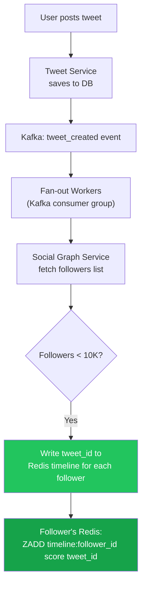

**Pseudo-code for fan-out worker**:

```
function processFanOutEvent(event):
    tweet_id    = event.tweet_id
    author_id   = event.author_id
    timestamp   = event.created_at

    # Fetch followers from social graph service
    followers = socialGraph.getFollowers(author_id, limit=10_000_000)

    # Batch write to Redis using pipeline
    pipeline = redis.pipeline()
    for follower_id in followers:
        key   = f"timeline:{follower_id}"
        score = timestamp  # Unix epoch ms for sorting
        pipeline.zadd(key, {tweet_id: score})
        pipeline.zremrangebyrank(key, 0, -801)  # Keep only last 800 tweets

    pipeline.execute()

    # Mark as done
    metrics.increment("fanout.completed", tags={"author": author_id})
```

**Trade-off table**:

| Dimension | Fan-out on Write |
|-----------|-----------------|
| Write cost | **High** — O(N) writes per tweet where N = follower count |
| Read latency | **Very fast** — O(1) Redis sorted set read |
| Celebrity problem | **Fatal** — 100M followers = 100M Redis writes per tweet |
| Storage | **High** — each tweet duplicated across N followers' caches |
| Consistency | **Near-real-time** — followers see tweet within 1-2 seconds |
| Best for | Users with < 10,000 followers |

---

### Approach B: Fan-out on Read (Pull Model)

When a user opens their timeline, the system queries who they follow, then fetches recent tweets from each followee.

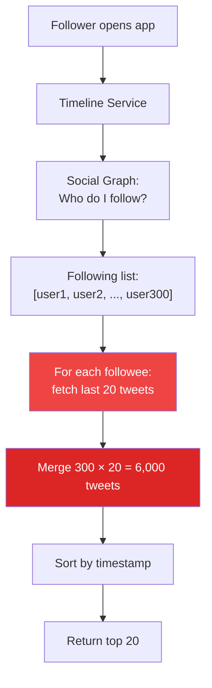

**Pseudo-code for timeline generation**:

```
function getHomeTimeline(user_id, limit=20):
    # Step 1: Get who this user follows
    following = socialGraph.getFollowing(user_id)  # returns [id1, id2, ..., idN]

    # Step 2: Fetch recent tweets from each followee
    all_tweets = []
    for followee_id in following:
        tweets = tweetDB.getRecentTweets(followee_id, limit=20)
        all_tweets.extend(tweets)

    # Step 3: Merge and sort
    all_tweets.sort(key=lambda t: t.created_at, reverse=True)

    # Step 4: Return top N
    return all_tweets[:limit]
```

**Trade-off table**:

| Dimension | Fan-out on Read |
|-----------|----------------|
| Write cost | **Zero** — tweet is written once to author's partition |
| Read latency | **Very slow** — O(N×M) queries where N=following, M=recent tweets |
| Celebrity problem | **None** — celebrity tweet stored once, read on demand |
| Storage | **Minimal** — no duplication |
| Consistency | **Immediate** — tweet appears the moment it is written |
| Best for | Celebrities (pulled, not pushed) |
| Breaks at | Users following 1,000+ accounts (1,000+ DB queries per load) |

---

### Approach C: Hybrid Model (Twitter's Actual Approach)

Route based on the tweet author's follower count. Normal users get push; celebrities get pull.

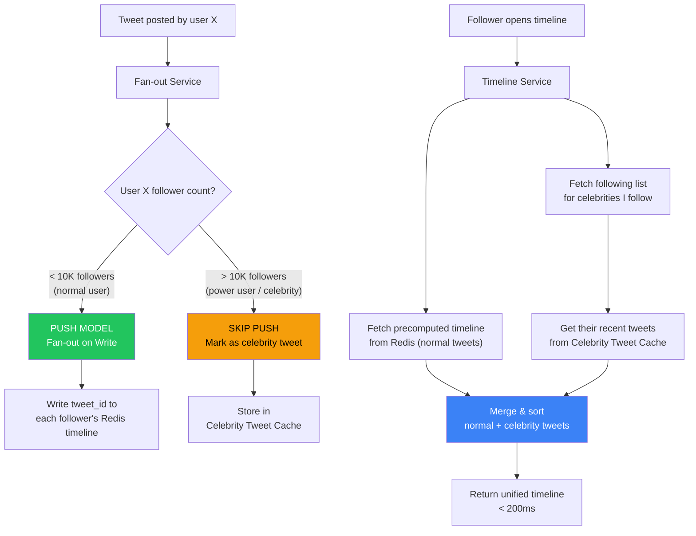

**Pseudo-code for hybrid routing**:

```
# On tweet creation
function onTweetCreated(tweet_id, author_id):
    author = userService.get(author_id)

    if author.follower_count < CELEBRITY_THRESHOLD:  # 10,000
        # Push model: fan out to followers immediately
        kafka.publish("fanout.push", {tweet_id, author_id})
    else:
        # Skip push: store in celebrity timeline index only
        # Followers will pull this at read time
        kafka.publish("fanout.celebrity", {tweet_id, author_id})
        # Still update author's own user timeline
        redis.zadd(f"user_timeline:{author_id}", {tweet_id: timestamp})

# On timeline read
function getHomeTimeline(user_id, limit=20):
    # Part 1: fetch precomputed timeline (normal users' tweets)
    precomputed = redis.zrevrange(
        f"timeline:{user_id}", 0, 799, withscores=True
    )

    # Part 2: fetch celebrities this user follows
    celebrities = socialGraph.getCelebrityFollowing(user_id)
    celebrity_tweets = []
    for celeb_id in celebrities:
        tweets = redis.zrevrange(
            f"user_timeline:{celeb_id}", 0, 19
        )
        celebrity_tweets.extend(tweets)

    # Part 3: hydrate tweet objects for all IDs
    all_tweet_ids = precomputed + celebrity_tweets
    tweets = tweetCache.mget(all_tweet_ids)  # Redis MGET for batch fetch

    # Part 4: merge, sort, paginate
    tweets.sort(key=lambda t: t.created_at, reverse=True)
    return tweets[:limit]
```

**Trade-off table**:

| Dimension | Hybrid Model |
|-----------|-------------|
| Write cost (normal) | Medium — O(N) where N < 10K |
| Write cost (celebrity) | Very low — O(1) single write |
| Read latency | **< 200ms** — small celebrity merge + Redis read |
| Complexity | **High** — two code paths, celebrity detection logic |
| Storage | Medium — duplicated for normal users |
| Consistency | Eventual (~1-5s for fan-out queue) |

---

### Comparison: All 3 Approaches

| | Push (Write) | Pull (Read) | Hybrid (Twitter) |
|--|-------------|-------------|-----------------|
| Write cost | O(followers) | O(1) | O(min(followers, 10K)) |
| Read cost | O(1) | O(following × tweets) | O(celebrities) |
| Celebrity problem | Fatal | Solved | Solved |
| Large follow graph | ✅ Fast reads | ❌ Slow reads | ✅ Fast reads |
| Staleness | ~1-2s | 0s | ~1-5s (async) |
| Storage overhead | 3-5x | 1x | 1.5-2x |
| Implementation | Simple | Simple | **Complex** |
| Twitter uses | Normal users | Celebrities | **Both** |

> **The winning insight**: there is no universal best. The system routes each tweet through the optimal path based on the author's follower count. This is why Twitter's fan-out service is one of the most studied pieces of infrastructure in the industry.

---

## 6. Full System Architecture

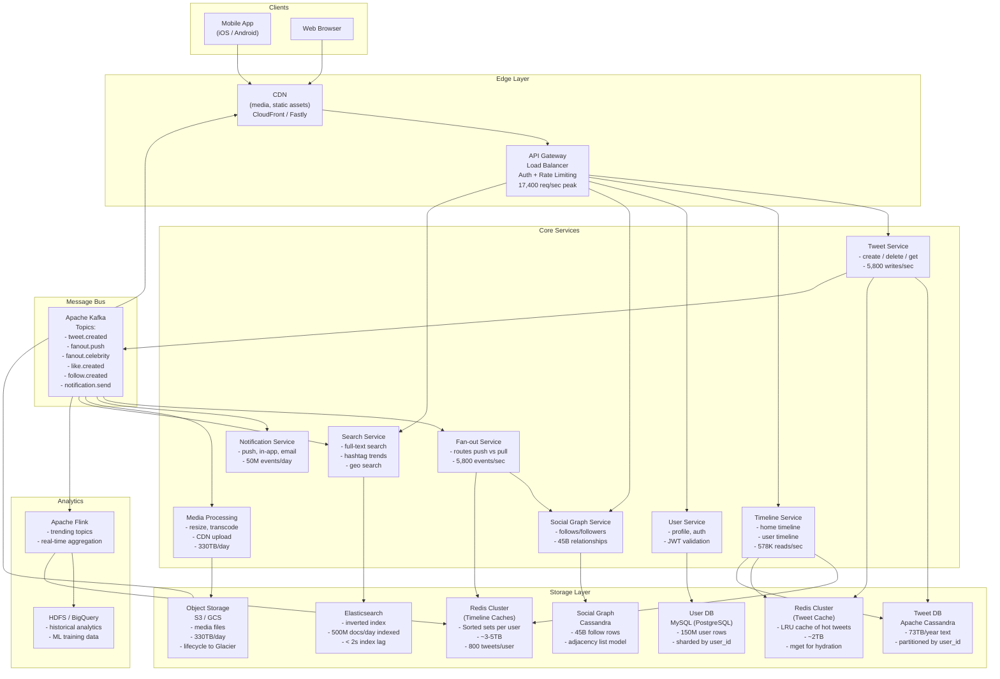

**Key architectural decisions**:

1. **Kafka as the backbone**: Every significant action (tweet, like, follow, notification) flows through Kafka. This decouples services and makes it trivial to add new consumers (analytics, ML pipelines, notifications) without touching existing code.

2. **Two separate Redis clusters**: Timeline cache (sorted sets of tweet IDs per user) and Tweet cache (tweet object data) are separated to allow independent scaling. Timeline cache grows with users; Tweet cache grows with read volume.

3. **Cassandra for tweets and graph**: Both require massive write throughput and horizontal partitioning. Cassandra's LSM-tree structure handles 5,800 tweet writes/sec without locking.

4. **CDN at the edge**: 40% of tweets have media. Serving 330TB/day of media from your origin would be catastrophic. CDN handles this entirely.

---

## 7. Timeline Deep Dive

### Home Timeline vs. User Timeline

| | Home Timeline | User Timeline |
|--|--------------|--------------|
| Definition | Tweets from accounts you follow | All tweets by a specific user |
| Data source | Redis precomputed cache (hybrid fan-out) | Cassandra user partition (direct query) |
| Complexity | **High** — aggregated, merged | **Low** — single partition scan |
| Latency | < 200ms (from Redis) | < 50ms (Cassandra range scan) |
| Cache strategy | Per-user sorted set (800 tweets) | Not typically cached (Cassandra fast enough) |

### Redis Data Structure for Home Timeline

```
Redis Sorted Set:
  Key:     timeline:{user_id}
  Member:  tweet_id (8-byte integer)
  Score:   Unix timestamp in milliseconds (for chronological ordering)
  Size:    capped at last 800 tweets per user

Example:
  ZADD timeline:7890123 1711900000000 "9876543210"
  ZADD timeline:7890123 1711900100000 "9876543211"
  ZREMRANGEBYRANK timeline:7890123 0 -801   # trim to 800

Read:
  ZREVRANGE timeline:7890123 0 19 WITHSCORES
  → returns 20 most recent tweet IDs in reverse order
```

**Why a sorted set?** O(log N) insert, O(log N + page_size) range read. At 800 members per set, this is effectively constant time. The score (timestamp) provides ordering without any in-memory sorting at read time.

### Timeline Read Path

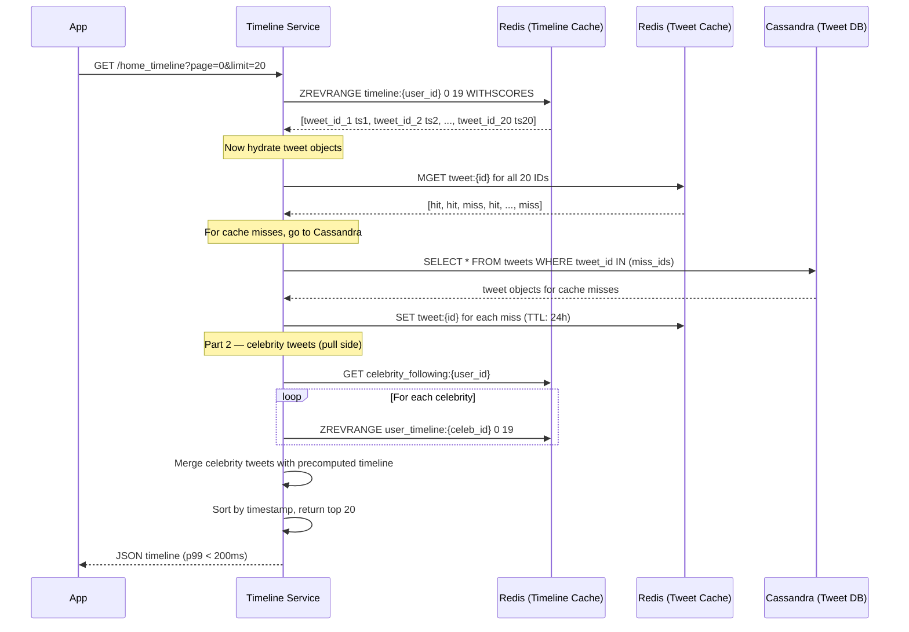

### Timeline Cache Invalidation

Timelines are **append-only** in the Redis sorted set — no invalidation needed. When you like or retweet a tweet, the tweet object cache (tweet:{id}) is updated, but the timeline sorted set does not change. This is a deliberate design: timeline ordering is immutable (you cannot "un-order" a tweet), and engagement counts are served from a separate counter cache.

**Edge case**: when a tweet is deleted, the timeline service checks tweet existence before returning it. Deleted tweets return empty and are filtered client-side. The sorted set is cleaned up lazily (background job removes deleted tweet IDs from all timelines — expensive, so deferred).

---

## 8. The Social Graph

### The Problem

150M users × 300 avg follows = **45 billion follow relationships**. You need to:
1. Quickly look up "who does user X follow?" (for timeline generation on the pull side)
2. Quickly look up "who follows user X?" (for fan-out on write)
3. Handle O(1) follow/unfollow mutations
4. Scale to users with 100M+ followers without a hot partition

### Storage Options

| Option | Pros | Cons |
|--------|------|------|
| **MySQL (follower table)** | Simple, easy to query | Joins at 45B rows are painful; single follow table = hot partitions |
| **Graph DB (Neo4j)** | Natural traversal queries | Hard to scale writes; replication lag issues |
| **Redis Hash** | Fast O(1) lookup | RAM-intensive at 45B relationships; ~1.8TB at 40B/pair |
| **Cassandra Adjacency List** | **Best for Twitter's scale** | Eventual consistency; no complex traversals |

### Cassandra Adjacency List (Twitter's choice)

**Following table** (who does user X follow?):

```sql
CREATE TABLE following (
    follower_id  BIGINT,   -- partition key: who is following
    followed_id  BIGINT,   -- clustering key: who they follow
    created_at   TIMESTAMP,
    PRIMARY KEY (follower_id, followed_id)
) WITH CLUSTERING ORDER BY (followed_id ASC);

-- Query: who does user 12345 follow?
SELECT followed_id FROM following WHERE follower_id = 12345;
-- Single partition scan: O(N) where N = number of follows — typically < 5K
```

**Followers table** (who follows user X?):

```sql
CREATE TABLE followers (
    followed_id  BIGINT,   -- partition key: the account being followed
    follower_id  BIGINT,   -- clustering key: who follows them
    created_at   TIMESTAMP,
    PRIMARY KEY (followed_id, follower_id)
) WITH CLUSTERING ORDER BY (follower_id ASC);

-- Query: who follows Katy Perry (id: 999)?
SELECT follower_id FROM followers WHERE followed_id = 999;
-- Returns 100M rows — need cursor-based pagination: LIMIT 10000 PER PARTITION
```

**Why two tables?** This is the classic "denormalize for reads" pattern. Follow is stored twice — once for "following" lookups and once for "follower" lookups. At 45B relationships × 2 = 90B rows × 24 bytes = ~2.16TB. Cheap at Cassandra scale.

**Fan-out optimization for celebrities**: The followers table for celebrity accounts (>1M followers) is paginated. Fan-out workers fetch followers in chunks of 10,000 using Cassandra's `PAGING STATE` mechanism and spawn parallel workers per chunk.

```
function fanoutCelebrity(tweet_id, author_id):
    page_state = None
    workers    = []

    loop:
        (followers, page_state) = followers_table.query(
            author_id, limit=10_000, page_state=page_state
        )
        worker = spawnFanoutWorker(tweet_id, followers)
        workers.append(worker)

        if page_state is None:
            break   # no more pages

    wait_all(workers)
```

For a 100M-follower celebrity: 100M ÷ 10,000 = 10,000 parallel workers. Each writes 10,000 Redis entries. Total: 100M Redis writes in ~15-30 seconds with enough workers. This is why Twitter uses the hybrid model for celebrities — 30 seconds is too slow.

---

## 9. Tweet Storage

### Why Not SQL?

A naive MySQL schema would look like:

```sql
CREATE TABLE tweets (
    id         BIGINT PRIMARY KEY,
    user_id    BIGINT NOT NULL,
    content    VARCHAR(280),
    created_at DATETIME,
    likes      INT DEFAULT 0,
    retweets   INT DEFAULT 0,
    INDEX (user_id, created_at)
);
```

Problems at scale:
- **Hot partitions**: viral tweets get millions of reads on a single row
- **Write amplification**: 5,800 inserts/sec + index updates saturate a single MySQL primary
- **Counter updates**: 1M concurrent LIKE operations on a single row = lock contention
- **Sharding pain**: adding a shard requires live data migration; MySQL doesn't do this gracefully

### Cassandra Schema

```sql
CREATE TABLE tweets (
    user_id     BIGINT,           -- partition key: all tweets by user on same node
    tweet_id    BIGINT,           -- clustering key: descending order (newest first)
    content     TEXT,
    media_urls  LIST<TEXT>,
    hashtags    SET<TEXT>,
    mentions    SET<BIGINT>,
    reply_to    BIGINT,           -- nullable: for thread support
    retweet_of  BIGINT,           -- nullable: retweet reference
    created_at  TIMESTAMP,
    PRIMARY KEY (user_id, tweet_id)
) WITH CLUSTERING ORDER BY (tweet_id DESC)
  AND compaction = { 'class': 'TimeWindowCompactionStrategy',
                     'compaction_window_unit': 'DAYS',
                     'compaction_window_size': 1 };
```

**Why this schema works**:

| Property | Benefit |
|----------|---------|
| `user_id` as partition key | All tweets by a user stored on same Cassandra node → fast user timeline range scans |
| `tweet_id` as clustering key (DESC) | Most recent tweets first within partition; no ORDER BY needed |
| Time Window Compaction | Groups SSTables by time window — efficient time-range queries, fast TTL expiry |
| Denormalized media_urls | No join needed to fetch media metadata |

**Read pattern for user timeline**:

```sql
-- Get last 20 tweets by user 12345 (single partition scan, O(20))
SELECT * FROM tweets
WHERE user_id = 12345
LIMIT 20;

-- Get tweets before a cursor (pagination)
SELECT * FROM tweets
WHERE user_id = 12345
  AND tweet_id < :cursor_tweet_id
LIMIT 20;
```

**Twitter Snowflake ID**: Tweet IDs are not random UUIDs — they are **Snowflake IDs**: 64-bit integers encoding timestamp + datacenter ID + machine ID + sequence number. This means tweet IDs are monotonically increasing by time, which makes the Cassandra clustering key naturally ordered chronologically. No separate `created_at` index needed for ordering.

```
Snowflake ID (64-bit):
  [41 bits: ms since epoch] [10 bits: machine/DC] [12 bits: sequence]
  → sortable, globally unique, no coordination required
  → 4,096 IDs/ms/machine × hundreds of machines = billions/sec capacity
```

---

## 10. Likes and Retweets

### The Counter Problem

Imagine a celebrity posts a tweet that goes viral. 1 million users click Like within 60 seconds. That is 16,667 INCR operations per second against a single counter for that tweet.

**Naive approach (fails)**:

```sql
UPDATE tweets SET likes = likes + 1 WHERE tweet_id = 99999;
-- At 16,667 concurrent updates, this creates a hot row with lock contention
-- MySQL: row-level lock → serialized updates → throughput collapses
-- Cassandra: LWT (lightweight transactions) needed → latency spikes to 50ms+
```

### Solution 1: Redis INCR with Periodic Flush

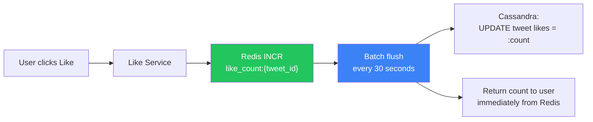

```
function likeTweet(user_id, tweet_id):
    # Step 1: record the like relationship (for "who liked this?")
    cassandra.execute("""
        INSERT INTO likes (tweet_id, user_id, created_at)
        VALUES (?, ?, ?)
    """, [tweet_id, user_id, now()])

    # Step 2: atomic increment in Redis
    new_count = redis.incr(f"like_count:{tweet_id}")

    # Redis key has TTL to bound memory usage for old tweets
    redis.expire(f"like_count:{tweet_id}", 86400 * 7)  # 7 days

    # Step 3: publish event for async processing
    kafka.publish("like.created", {user_id, tweet_id, new_count})

    return new_count

# Background job runs every 30 seconds
function flushLikeCounts():
    keys = redis.scan("like_count:*")
    for key in keys:
        tweet_id  = key.split(":")[1]
        count     = redis.get(key)
        cassandra.execute("""
            UPDATE tweets SET likes = ? WHERE tweet_id = ?
        """, [count, tweet_id])
```

**Result**: Redis handles 16,667 INCR/sec trivially (Redis is single-threaded at ~100K ops/sec). The count shown to users is always the Redis value (real-time). Cassandra gets eventual updates every 30 seconds (fine — the tweet doesn't need millisecond-accurate like counts in the DB).

### Solution 2: Sharded Counters (for extreme viral content)

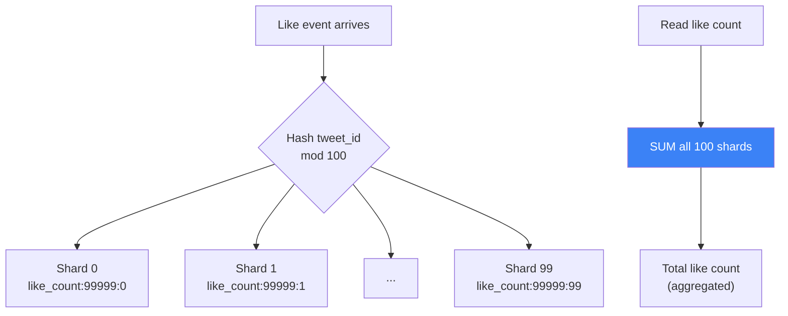

```
function likeSharded(user_id, tweet_id):
    shard_id = hash(user_id) % 100
    redis.incr(f"like_count:{tweet_id}:{shard_id}")

function getLikeCount(tweet_id):
    pipeline = redis.pipeline()
    for i in range(100):
        pipeline.get(f"like_count:{tweet_id}:{i}")
    counts = pipeline.execute()
    return sum(int(c or 0) for c in counts)
```

**When to use sharded counters**: for tweets expected to exceed 1M likes (world events, celebrity posts). For most tweets, the Redis INCR approach is sufficient.

### Solution 3: Approximate Counts with HyperLogLog

For "who liked this?" on tweets with billions of likes (rare but exists), exact counting is prohibitive. **HyperLogLog** provides a cardinality estimate with 0.81% standard error using only 12KB of memory regardless of cardinality.

```
redis.pfadd(f"tweet_likers:{tweet_id}", user_id)
count = redis.pfcount(f"tweet_likers:{tweet_id}")
# count is approximate (±0.81%) but uses only 12KB vs 8GB for 1B exact IDs
```

---

## 11. Search

### Why Elasticsearch?

| Requirement | Elasticsearch feature |
|-------------|----------------------|
| Full-text search over 280-char tweets | Inverted index — O(1) keyword lookup |
| Hashtag search (#WorldCup) | Term query on hashtags field |
| Near-real-time indexing (< 2s) | Near-real-time (NRT) segment flush |
| Geo-tagged tweet search | Geo-point field + geo_distance query |
| Trending topics | Aggregation on hashtags + time bucket |
| Typo tolerance | Fuzzy queries + phonetic analyzers |

### Indexing Pipeline

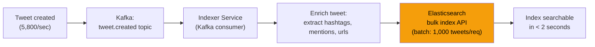

**Elasticsearch document structure**:

```json
{
  "tweet_id":   "9876543210",
  "user_id":    "12345678",
  "username":   "katy_perry",
  "content":    "Just finished recording new album! #KP6 #music",
  "hashtags":   ["KP6", "music"],
  "mentions":   [],
  "created_at": "2024-03-30T10:30:00Z",
  "geo":        { "lat": 34.052235, "lon": -118.243683 },
  "lang":       "en",
  "likes":      0,
  "retweets":   0
}
```

**Scaling Elasticsearch**:

```
500M tweets/day × 365 = 182B documents/year
Estimated index size: ~500 bytes/doc × 182B = ~91TB/year

Cluster sizing:
  Hot tier (last 7 days):   3 nodes × 8TB SSD = 24TB; handles search + indexing
  Warm tier (last 90 days): 5 nodes × 20TB HDD = 100TB; search only
  Cold tier (>90 days):     Snapshot to S3; restore on demand

Sharding:
  5 primary shards per index (daily indices: tweets-2024-03-30)
  1 replica per shard = 2x storage, 2x search throughput
```

### Trending Topics

Real-time trending is computed by Apache Flink, not Elasticsearch:

```
Flink job (5-minute sliding window):
  Input:   Kafka tweet.created events
  Extract: hashtags from each tweet
  Count:   count-min sketch per hashtag (approximate, memory-efficient)
  Rank:    top-50 hashtags by velocity (rate of increase, not absolute count)
  Output:  Redis: trending:global, trending:country:US, trending:city:NYC
  TTL:     5 minutes (refresh rate = trend freshness)
```

**Why count-min sketch instead of exact count?**: With 5,800 tweets/sec × avg 1.5 hashtags = ~8,700 hashtag events/sec, exact counting requires a HashMap of millions of entries per 5-minute window. Count-min sketch approximates with <1% error using a fixed-size 2D array of ~50KB. For trending, approximate is fine.

---

## 12. Problems at Scale

### Problem 1: The Celebrity Effect (Katy Perry Problem)

**Scenario**: Katy Perry (100M followers) posts a tweet. Your fan-out worker naively tries to write to 100M Redis timelines.

```
100M writes × 1μs/write = 100 seconds
Peak fan-out concurrency needed = 100M / 5s = 20M writes/sec
```

**What breaks**: Redis write throughput maxes at ~1M operations/sec per node. You would need 20+ Redis nodes just to absorb one celebrity tweet — and the social graph lookup of 100M followers alone takes 10+ seconds.

**Solution**: the hybrid model described in Section 5. Celebrities (>10K followers) are excluded from fan-out on write. Their tweets are indexed in `user_timeline:{celeb_id}` and pulled at read time by each follower's timeline merge step.

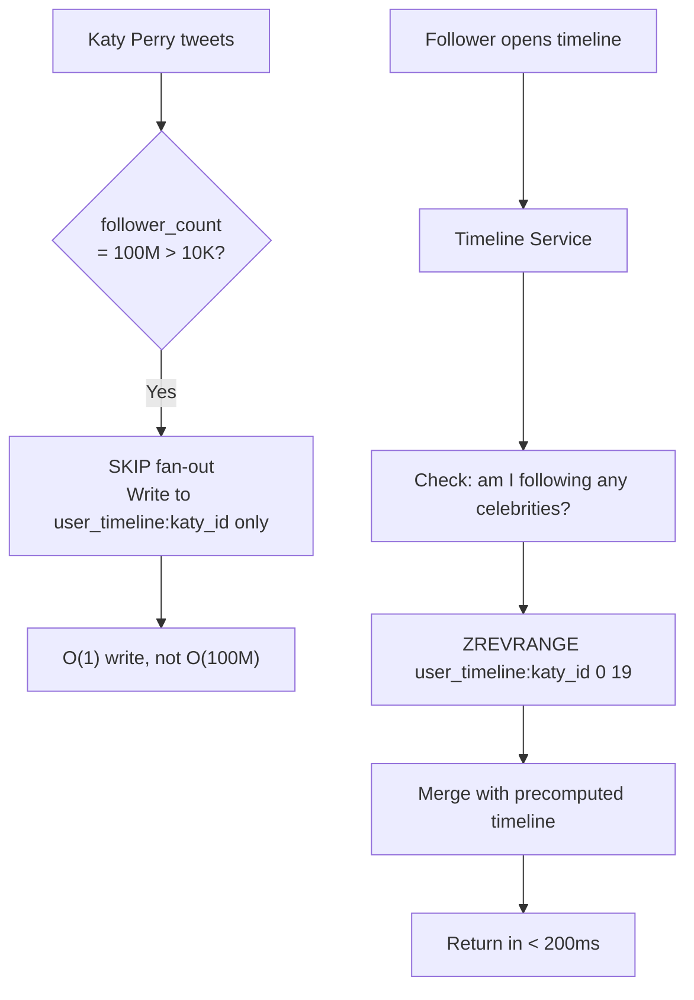

---

### Problem 2: Timeline Cache Miss Storm (Cold Start)

**Scenario**: A new pod comes online after a rolling deploy. Its local Redis connection has no warmed data. 50,000 users are routed to it simultaneously, all requesting timelines.

**What breaks**: 50,000 × 20 Cassandra reads = 1,000,000 DB requests in seconds. Cassandra's latency spikes, other pods slow down, cascading failure.

**Solution**: Cache warming before routing traffic.

```
Deployment procedure:
  1. New pod starts
  2. Pre-warm: fetch timeline for top-1,000 most active users in this shard
     (determined by activity bloom filter in Redis)
  3. Health check: only mark pod HEALTHY when cache hit rate > 80%
  4. Load balancer routes traffic

Lazy warming for non-top users:
  - First request: cache miss → Cassandra → store in Redis (TTL: 24h)
  - Second request: cache hit → serve from Redis
```

---

### Problem 3: Trending Topics Race Condition

**Scenario**: A major sporting event ends. 500,000 users tweet the same hashtag within 90 seconds. Your naive counter: `INCR hashtag_count:{tag}` gets 5,555 increments/second against a single Redis key.

**What breaks**: Not really a Redis problem (Redis INCR is atomic and fast), but building an accurate sorted leaderboard (ZADD on a trending sorted set) with 500,000 concurrent updates causes ordering consistency issues.

**Solution**: multi-tier approximate counting.

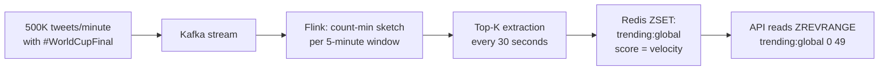

---

### Problem 4: Media Upload Bottleneck

**Scenario**: 2,300 media uploads/second. Routing all uploads through your API server means:
- Each 5MB video traverses: Mobile → API Server → S3
- API server becomes bandwidth bottleneck: 2,300 × 5MB = 11.5GB/sec through your app tier

**What breaks**: At $0.09/GB egress, 11.5GB/sec = ~$90,000/day in bandwidth. Worse, your API servers saturate their NIC.

**Solution**: Presigned S3 URLs — client uploads directly to S3.

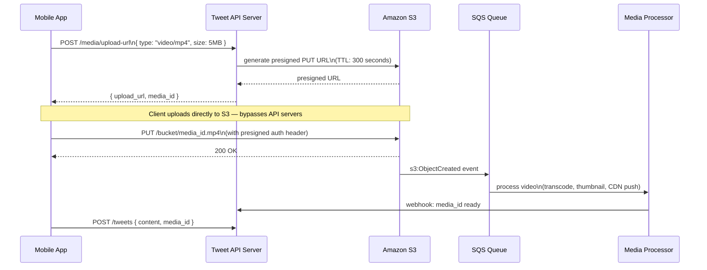

**Result**: API servers handle only metadata (< 1KB). S3 handles media bandwidth directly. Media processing happens asynchronously.

---

### Problem 5: Eventual Consistency for Timeline

**Scenario**: You tweet at 10:00:00.000. Your follower opens their app at 10:00:02.000. The fan-out worker hasn't finished yet. They don't see your tweet.

**Is this acceptable?** Yes. Twitter's SLA for timeline delivery is "a few seconds." Users see timestamps on tweets and understand that very recent content may not yet appear. The timeline is labeled "Top tweets" or "Latest" — not "Complete."

**What is NOT acceptable**: A user should always see their own tweet immediately after posting. This is handled separately:

```
After posting tweet:
  1. Author's own user timeline cache is updated synchronously (not via fan-out)
  2. Author's home timeline is updated synchronously
  3. All other followers' timelines updated asynchronously (fan-out queue)

Result:
  - Author: sees own tweet in < 100ms (synchronous)
  - Followers: see tweet in < 5 seconds (asynchronous)
  - This is the "read-your-own-writes" consistency guarantee
```

---

### Problem 6: Thundering Herd on Trending Content

**Scenario**: A tweet goes viral. 10 million users click on it from trending in 30 seconds. Your tweet object cache (tweet:{id}) expires at exactly that moment. All 10M requests hit Cassandra simultaneously.

**Solution**: Cache stampede prevention via mutex/probabilistic early expiration.

```
function getTweet(tweet_id):
    data = redis.get(f"tweet:{tweet_id}")
    if data:
        return data

    # Cache miss — use mutex to prevent stampede
    lock_key = f"lock:tweet:{tweet_id}"
    acquired  = redis.set(lock_key, "1", nx=True, ex=10)  # 10s TTL

    if acquired:
        # This thread fetches from DB and populates cache
        data = cassandra.getTweet(tweet_id)
        redis.set(f"tweet:{tweet_id}", data, ex=3600)
        redis.delete(lock_key)
        return data
    else:
        # Another thread is fetching — wait briefly and retry
        time.sleep(0.1)
        return getTweet(tweet_id)  # recursive retry
```

**Alternative**: probabilistic early expiration. Instead of expiring the cache at a fixed TTL, expire it slightly early with probability proportional to fetch time:

```
function shouldRefresh(ttl_remaining, fetch_time_ms, beta=1.0):
    # Beta controls eagerness: higher = more eager to refresh
    jitter = beta * fetch_time_ms * log(random())
    return ttl_remaining - jitter < 0

# If a tweet takes 50ms to fetch and has 30s TTL remaining,
# the system starts refreshing it probabilistically before it expires
# → smooth miss distribution, no thundering herd
```

---

## 13. Notification System

Notifications need to be fast, fan-out-resistant, and multi-channel (push, in-app, email, SMS).

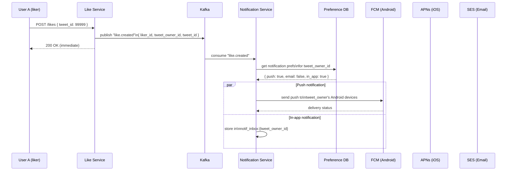

**Notification aggregation**: If 10,000 people like your tweet in 60 seconds, you don't get 10,000 push notifications. The notification service aggregates:

```
Rule: same {notification_type + object_id} within 10-minute window → coalesce
Result: "katy_perry and 9,999 others liked your tweet" (one push)

Implementation:
  - Redis key: notif:pending:{user_id}:{type}:{object_id}
  - TTL: 10 minutes
  - On first event: create key, schedule delivery (10-min delay)
  - On subsequent events: INCR counter, reset TTL
  - On delivery: flush with aggregated count
```

---

## 14. Interview Questions Mapped

| Question | Answer | Section |
|----------|--------|---------|
| "How do you handle 100M followers for a celebrity?" | Hybrid fan-out: skip push, write to celebrity's `user_timeline` only, followers pull at read time during timeline merge | Section 5C |
| "What's your data model for follow relationships?" | Two Cassandra tables: `following` (partitioned by follower_id) and `followers` (partitioned by followed_id) — denormalized adjacency list | Section 8 |
| "How do you generate a home timeline?" | Redis ZADD sorted set per user, capped at 800 tweet IDs. On read: ZREVRANGE → MGET tweet objects → merge celebrity tweets → return sorted top-20 | Section 7 |
| "How do you count likes at scale?" | Redis INCR for real-time counter (atomic, fast), periodic batch flush to Cassandra every 30s. Sharded counters for extreme viral content | Section 10 |
| "What consistency level does Twitter use?" | Eventual consistency for timelines (fan-out is async, < 5s lag). Read-your-own-writes guarantee for the tweet author. Strong consistency for tweet creation (synchronous write to Cassandra) | Section 12 |
| "How do you handle trending topics?" | Flink aggregation with count-min sketch over 5-minute sliding windows. Results written to Redis ZSET, refreshed every 30s | Section 11 |
| "Why Cassandra over MySQL for tweets?" | 5,800 writes/sec + horizontal partitioning by user_id + no complex joins needed + time-range queries on clustering key = Cassandra sweet spot. MySQL would require painful sharding | Section 9 |
| "How do you prevent timeline cache stampedes?" | Redis mutex on cache miss + probabilistic early expiration for trending content | Section 12 |
| "How do you handle direct media uploads?" | Presigned S3 URLs: server generates signed URL, client uploads directly to S3, async media processing via SQS + Lambda | Section 12 |
| "How is Twitter's timeline different from Instagram's feed?" | Twitter is reverse-chronological + hybrid fan-out; Instagram uses ML ranking + pure fan-out on write (Instagram has no extreme-celebrity-scale problem due to follow count caps) | — |

---

## 15. Key Takeaways

- **Twitter uses HYBRID fan-out**: push model for users with < 10K followers (precomputed Redis timelines), pull model for celebrities (tweets stored once, merged at read time). This hybrid eliminates both the celebrity write storm and the large-following read latency.

- **Timeline cache = Redis sorted set per user, capped at 800 tweets = ~3-5TB total cluster RAM**. The sorted set score is the tweet timestamp (Snowflake ID), giving O(log N) insert and O(log N + page_size) chronological range reads — effectively O(1) at 800 members.

- **At 5,800 tweets/sec, fan-out workers are async via Kafka** — timeline delivery has < 5 second lag. The tweet author sees their own tweet immediately (synchronous write to their own timelines), but followers receive it asynchronously. This is an explicit product tradeoff.

- **Sharded counters or Redis INCR are mandatory for likes on viral content**: a naive single-row counter cannot handle 16,667 concurrent increments per second for a celebrity tweet. Redis INCR handles this atomically at ~100K ops/sec per node; sharded counters across 100 shards scale to 10M+ ops/sec.

- **99.99% availability = 52 minutes downtime/year** — achieved via: multi-datacenter active-active replication (Cassandra RF=3 across 3 DCs), Redis Sentinel/Cluster for automatic failover (< 30s), Kafka replication factor 3, and no single points of failure in the request path. A single tweet write can tolerate the loss of 1 of 3 Cassandra nodes with zero data loss.

---

## 16. Related Concepts

- **Fan-out problem deep dive**: `problems-at-scale/scalability/hot-partition`
- **Cassandra data modeling**: `01-databases/concepts/cassandra-partitioning`
- **Redis sorted sets**: `03-redis/concepts/sorted-sets-use-cases`
- **Kafka for async fan-out**: `04-messaging/concepts/kafka-consumer-groups`
- **Snowflake ID generation**: `05-distributed-systems/concepts/distributed-id-generation`
- **Count-min sketch for trending**: `14-algorithms/concepts/probabilistic-data-structures`
- **Presigned URL pattern**: `07-api-design/concepts/presigned-urls`
- **Cache stampede prevention**: `02-caching/concepts/cache-stampede`
- **Instagram Design**: `16-system-design-problems/02-social-platforms/instagram`

---

## References

- 📖 [Twitter's Timeline Architecture – InfoQ](https://www.infoq.com/presentations/Twitter-Timeline-Scalability/) — Raffi Krikorian's seminal talk on how Twitter rebuilt its timeline system
- 📖 [The Infrastructure Behind Twitter at Scale](https://blog.twitter.com/engineering/en_us/topics/infrastructure/2017/the-infrastructure-behind-twitter-scale) — Twitter Engineering Blog, 2017
- 📖 [Scaling Twitter: Making Twitter 10,000% Faster](http://highscalability.com/scaling-twitter-making-twitter-10000-percent-faster) — High Scalability case study with specific architecture decisions
- 📺 [Designing Twitter – System Design Interview](https://www.youtube.com/watch?v=wYk0xPP_P_8) — System design walkthrough with focus on fan-out
- 📖 [Cassandra Data Modeling for Social Graphs](https://www.datastax.com/blog/cassandra-data-modeling-rules-of-thumb) — DataStax guide to adjacency list modeling
- 📖 [Redis Sorted Sets Documentation](https://redis.io/docs/data-types/sorted-sets/) — Official Redis docs for ZADD/ZREVRANGE operations used in timeline cache
- 📖 [Snowflake: Generating Unique IDs at Twitter](https://blog.twitter.com/engineering/en_us/a/2010/announcing-snowflake) — Twitter Engineering Blog on distributed ID generation
