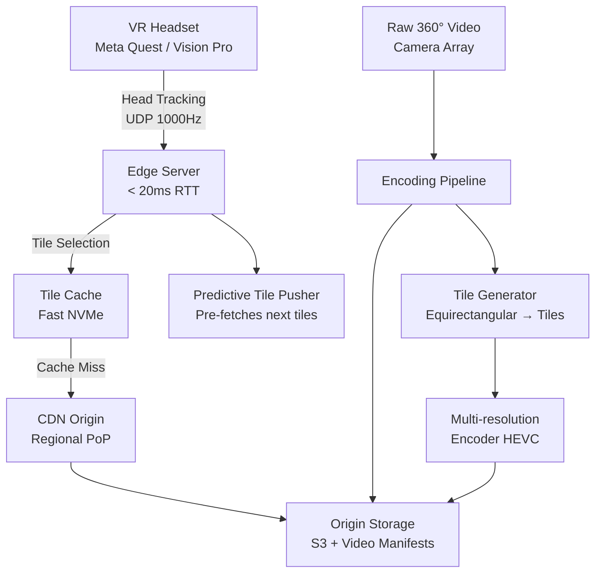

# Design a VR/360° Video Streaming System

**Difficulty**: 🔴 Advanced
**Reading Time**: ~30 minutes
**The Core Problem**: VR requires < 20ms motion-to-photon latency to avoid simulator sickness. Standard video streaming (2–5s buffer) causes nausea. How do you stream high-resolution 360° video to headsets at the quality and latency VR demands?

---

## Table of Contents

1. [Requirements](#1-requirements)
2. [Capacity Estimation](#2-capacity-estimation)
3. [High-Level Architecture](#3-high-level-architecture)
4. [Foveated Rendering](#4-foveated-rendering)
5. [Codec Selection](#5-codec-selection)
6. [Adaptive Bitrate for VR](#6-adaptive-bitrate-for-vr)
7. [Head Tracking & Prediction](#7-head-tracking--prediction)
8. [Edge Server Placement](#8-edge-server-placement)
9. [Key Design Decisions](#9-key-design-decisions)
10. [Interview Questions](#10-interview-questions)
11. [Key Takeaways](#11-key-takeaways)
12. [References](#12-references)

---

## 1. Requirements

### Functional
- Stream 360° video (equirectangular format) to VR headsets (Meta Quest, Apple Vision Pro)
- Support monoscopic (360°) and stereoscopic (3D 360°) video
- Adaptive quality based on available bandwidth
- Per-eye rendering for stereoscopic content
- Support 1M concurrent viewers

### Non-Functional
- **Motion-to-photon latency**: < 20ms (hard limit for comfort)
- **Resolution**: 8K total (4K per eye) at 90fps
- **Bandwidth per user**: 50–200 Mbps depending on quality tier
- **Availability**: 99.9%
- **Geographic distribution**: Edge servers within 20ms round-trip of viewers

---

## 2. Capacity Estimation

| Metric | Estimate |
|--------|----------|
| Concurrent viewers | 1M |
| Bandwidth per viewer (high quality) | 100 Mbps |
| Total egress bandwidth | 1M × 100 Mbps = **100 Tbps** |
| Storage per 1hr 8K 360° video | ~180 GB (HEVC encoded) |
| CDN edge nodes needed | 100 Tbps / 100 Gbps per node = **1000 edge nodes** |
| Frame rate | 90fps (11ms per frame budget) |
| Head tracking update rate | 1000Hz (1ms granularity) |

---

## 3. High-Level Architecture



---

## 4. Foveated Rendering

The key insight: the human eye has high resolution only in the center (fovea, ~5°). The periphery is low resolution. This allows massive bandwidth savings.

### Tile-Based Streaming
```
360° frame divided into a tile pyramid:

Equirectangular projection (360° × 180°):
  - Divide into 8×4 = 32 tiles (each tile = 45° × 45°)
  - Center tile (where user is looking): 4K quality, 50 Mbps
  - Adjacent tiles (30° from center): 2K quality, 10 Mbps
  - Peripheral tiles (>60° from center): 720p quality, 2 Mbps

Total bandwidth: 1×50 + 4×10 + 27×2 = 50+40+54 = 144 Mbps → vs 200 Mbps uniform
```

### Viewport Prediction
```
Client sends head orientation (quaternion) to edge server every 1ms via UDP.
Server predicts viewport in 20ms:
  predicted_orientation = current + velocity * 20ms + acceleration * (20ms)²/2

Pre-fetch tiles that will likely be needed in next 100ms frame buffer.
```

---

## 5. Codec Selection

| Codec | Compression | GPU Decode | Hardware Support | Latency |
|-------|-------------|------------|-----------------|---------|
| H.264/AVC | Baseline | Excellent | Universal | Low |
| H.265/HEVC | 50% better than H.264 | Good | Modern devices | Medium |
| AV1 | 30% better than HEVC | Limited (2023) | Growing | High |
| EAC (Equi-Angular Cubemap) | Facebook format | Specialized | Meta headsets | Low |

**Choice: HEVC (H.265)**
- 50% bandwidth savings vs H.264 at same quality
- Hardware decode on all modern VR headsets (12ms decode latency)
- Widely supported by CDN infrastructure
- AV1 considered for future (better compression, hardware decode catching up)

### Encoding Settings for VR
```
Profile: HEVC Main 10 (10-bit for smoother gradients in 360° content)
Resolution: 8192×4096 (equirectangular) → 4096×2048 per eye
Framerate: 90fps (headset native) + 72fps fallback
Bitrate ladder:
  Level 5 (8K):  180 Mbps
  Level 4 (6K):  80 Mbps
  Level 3 (4K):  40 Mbps
  Level 2 (2K):  15 Mbps
  Level 1 (1K):  5 Mbps  (emergency fallback)
```

---

## 6. Adaptive Bitrate for VR

Standard ABR (HLS/DASH) buffers 2–10 seconds ahead — too much for VR (head movement would reveal buffered low-quality tiles).

### VR-Specific ABR
```
Buffer strategy:
  - Keep 100ms tile buffer (not 5s!) — shorter = more responsive to head movement
  - Quality decision made per-tile, not per-segment
  - Bandwidth estimate: EWMA of last 10 tile download times

Quality switch rules:
  - If bandwidth > 120% of current level → upgrade center tile quality
  - If bandwidth < 80% of current level → downgrade peripheral tiles first
  - Never downgrade center tile in a single step (perceptible jump)
  - Emergency: if buffer drops below 50ms → drop to 720p (any motion sickness vs freeze?)
```

---

## 7. Head Tracking & Prediction

The 20ms motion-to-photon budget breakdown:
```
1ms   — Head movement detected (IMU sensor)
1ms   — Head tracking data sent to headset GPU
5ms   — GPU renders frame
10ms  — Frame sent to display
3ms   — Display draw time
─────────────────────────────
20ms  total
```

### Asynchronous Time Warp (ATW)
When the GPU misses its frame deadline, ATW fills the gap:
```
1. GPU renders frame at orientation: Θ_render (recorded at render start)
2. At display time (could be 2ms later), actual orientation: Θ_display
3. ATW applies warp: reprojected_frame = warp(rendered_frame, Θ_render → Θ_display)
4. Cost: 0.5ms GPU compute vs full re-render (10ms)
5. Limitation: Only corrects rotation, not translation (6DOF requires full re-render)
```

### Server-Side vs Client-Side Rendering
```
Client-side rendering (local VR, e.g., Meta Quest standalone):
  Render → Display: 20ms achievable, no network in loop
  Limitation: GPU power limited to headset hardware

Cloud rendering (game streaming to thin client headset):
  Render on server → Encode → Stream → Decode → Display
  Network adds 20–50ms → total latency 40–70ms → motion sickness risk
  Mitigation: ATW on client to smooth over network jitter
```

---

## 8. Edge Server Placement

< 20ms RTT requires edge servers within ~1500km of viewers (speed of light in fiber: ~200,000 km/s → 1500km = 7.5ms one-way).

### Edge Infrastructure
```
Tier 1 — Super PoP (10 worldwide): Full video processing, encoding
Tier 2 — Regional PoP (100 worldwide): Tile cache + prediction server
Tier 3 — Edge PoP (1000 worldwide): Tile serving only, 50ms NVMe cache

Tile caching:
  - Hot tiles (90% of views in 60° viewport) cached on NVMe
  - Cold tiles evicted using LRU, refetched from regional PoP
  - Pre-warm: at content ingestion, pre-cache the front-facing viewport tiles
```

---

## 9. Key Design Decisions

| Decision | Option A | Option B | Choice & Reason |
|----------|----------|----------|-----------------|
| Content type | 360° video (pre-recorded) | 6DOF volumetric (interactive) | **360° video** — volumetric requires 10–100× more bandwidth and compute; 360° is current feasible standard |
| Rendering | Client-side (on headset) | Server-side (cloud render) | **Client-side for standalone headsets** — cloud adds 20–50ms unacceptable network latency |
| Codec | H.264 | HEVC / H.265 | **HEVC** — 50% bandwidth savings critical at 100 Mbps per user × 1M users |
| Tile buffer | 5-second buffer | 100ms buffer | **100ms** — VR head movement requires near-instant tile swapping |
| Latency compensation | Drop frames | ATW (Asynchronous Time Warp) | **ATW** — maintains perceived smoothness without motion sickness during frame misses |

---

## 10. Interview Questions

| Question | Key Answer |
|----------|-----------|
| Why is < 20ms so critical for VR? | Vestibulo-ocular reflex expects visual update within 20ms of head movement; delay causes simulator sickness |
| How do you reduce bandwidth for 360° video? | Foveated streaming — full quality for 5° foveal region, progressively lower quality toward periphery |
| How does ATW prevent motion sickness? | Reprojects rendered frame to match updated head orientation at display time — 0.5ms cost vs 10ms full re-render |
| How do you handle poor network (mobile VR)? | Quality ladder drops to 1K/5 Mbps; ATW smooths over jitter; buffer slightly increased (200ms) |
| What's the hardest technical challenge? | Keeping motion-to-photon < 20ms while network round trip is already 10–15ms to edge server |

---

## 11. Key Takeaways

- **20ms motion-to-photon is a hard biological limit** — design every component around this budget
- **Foveated streaming saves 30–50% bandwidth** — high quality only for where the user is looking
- **HEVC is mandatory at VR resolutions** — H.264 would require 2× the bandwidth
- **100ms tile buffer (not 5s)** — VR cannot pre-buffer large windows; head movement invalidates buffered tiles instantly
- **Edge servers within 1500km** are required for < 20ms RTT — central server streaming is physically impossible for VR

---

## 📚 Resources & References

| Resource | Type | What You'll Learn |
|----------|------|------------------|
| [Facebook Manifold 360° Video Delivery](https://engineering.fb.com/2018/01/24/video-engineering/360-video-manifold-delivery/) | 📖 Blog | Production VR video streaming architecture at Meta |
| [ByteByteGo — Video Streaming Design](https://www.youtube.com/@ByteByteGo) | 📺 YouTube | Adaptive bitrate and streaming system overview |
| [HEVC/H.265 Standard Overview](https://www.itu.int/rec/T-REC-H.265) | 📚 Book | Codec internals and compression techniques |
| [Asynchronous Time Warp — Oculus Developer Blog](https://developer.oculus.com/blog/asynchronous-timewarp-examined/) | 📖 Blog | ATW technical deep-dive |
