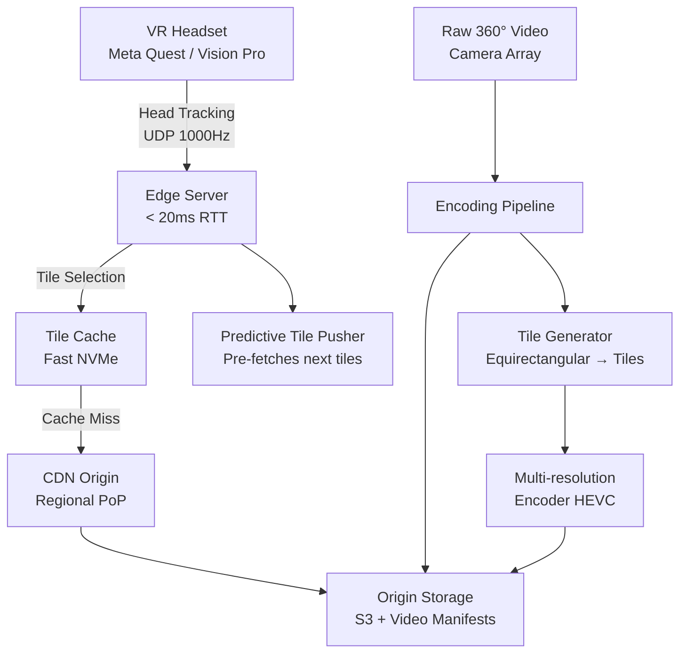
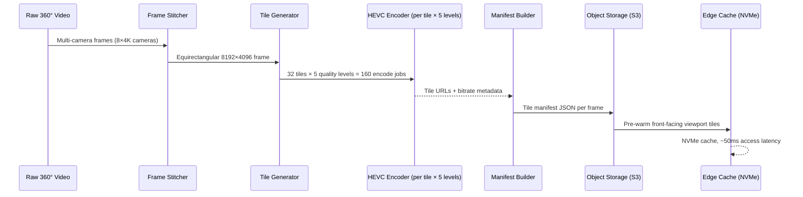
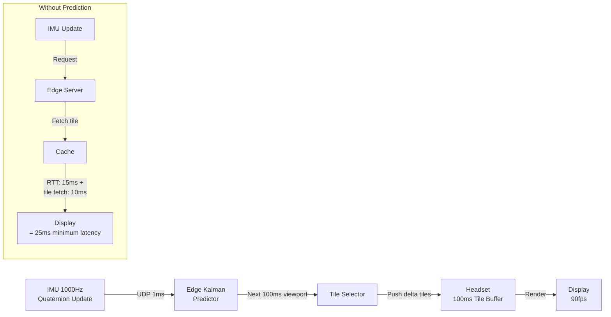

# Design a VR/360° Video Streaming System

**Difficulty**: 🔴 Advanced
**Reading Time**: ~30 minutes
**The Core Problem**: VR requires < 20ms motion-to-photon latency to avoid simulator sickness. Standard video streaming (2–5s buffer) causes nausea. How do you stream high-resolution 360° video to headsets at the quality and latency VR demands?

---

## Table of Contents

1. [Requirements](#1-requirements)
2. [Capacity Estimation](#2-capacity-estimation)
3. [High-Level Architecture](#3-high-level-architecture)
4. [Foveated Rendering](#4-foveated-rendering)
5. [Codec Selection](#5-codec-selection)
6. [Adaptive Bitrate for VR](#6-adaptive-bitrate-for-vr)
7. [Head Tracking & Prediction](#7-head-tracking--prediction)
8. [Edge Server Placement](#8-edge-server-placement)
9. [Key Design Decisions](#9-key-design-decisions)
10. [Interview Questions](#10-interview-questions)
11. [Key Takeaways](#11-key-takeaways)
12. [References](#12-references)

---

## 1. Requirements

### Functional
- Stream 360° video (equirectangular format) to VR headsets (Meta Quest, Apple Vision Pro)
- Support monoscopic (360°) and stereoscopic (3D 360°) video
- Adaptive quality based on available bandwidth
- Per-eye rendering for stereoscopic content
- Support 1M concurrent viewers

### Non-Functional
- **Motion-to-photon latency**: < 20ms (hard limit for comfort)
- **Resolution**: 8K total (4K per eye) at 90fps
- **Bandwidth per user**: 50–200 Mbps depending on quality tier
- **Availability**: 99.9%
- **Geographic distribution**: Edge servers within 20ms round-trip of viewers

---

## 2. Capacity Estimation

| Metric | Estimate |
|--------|----------|
| Concurrent viewers | 1M |
| Bandwidth per viewer (high quality) | 100 Mbps |
| Total egress bandwidth | 1M × 100 Mbps = **100 Tbps** |
| Storage per 1hr 8K 360° video | ~180 GB (HEVC encoded) |
| CDN edge nodes needed | 100 Tbps / 100 Gbps per node = **1000 edge nodes** |
| Frame rate | 90fps (11ms per frame budget) |
| Head tracking update rate | 1000Hz (1ms granularity) |

---

## 3. High-Level Architecture



---

## 4. Foveated Rendering

The key insight: the human eye has high resolution only in the center (fovea, ~5°). The periphery is low resolution. This allows massive bandwidth savings.

### Tile-Based Streaming
```
360° frame divided into a tile pyramid:

Equirectangular projection (360° × 180°):
  - Divide into 8×4 = 32 tiles (each tile = 45° × 45°)
  - Center tile (where user is looking): 4K quality, 50 Mbps
  - Adjacent tiles (30° from center): 2K quality, 10 Mbps
  - Peripheral tiles (>60° from center): 720p quality, 2 Mbps

Total bandwidth: 1×50 + 4×10 + 27×2 = 50+40+54 = 144 Mbps → vs 200 Mbps uniform
```

### Viewport Prediction
```
Client sends head orientation (quaternion) to edge server every 1ms via UDP.
Server predicts viewport in 20ms:
  predicted_orientation = current + velocity * 20ms + acceleration * (20ms)²/2

Pre-fetch tiles that will likely be needed in next 100ms frame buffer.
```

---

## 5. Codec Selection

| Codec | Compression | GPU Decode | Hardware Support | Latency |
|-------|-------------|------------|-----------------|---------|
| H.264/AVC | Baseline | Excellent | Universal | Low |
| H.265/HEVC | 50% better than H.264 | Good | Modern devices | Medium |
| AV1 | 30% better than HEVC | Limited (2023) | Growing | High |
| EAC (Equi-Angular Cubemap) | Facebook format | Specialized | Meta headsets | Low |

**Choice: HEVC (H.265)**
- 50% bandwidth savings vs H.264 at same quality
- Hardware decode on all modern VR headsets (12ms decode latency)
- Widely supported by CDN infrastructure
- AV1 considered for future (better compression, hardware decode catching up)

### Encoding Settings for VR
```
Profile: HEVC Main 10 (10-bit for smoother gradients in 360° content)
Resolution: 8192×4096 (equirectangular) → 4096×2048 per eye
Framerate: 90fps (headset native) + 72fps fallback
Bitrate ladder:
  Level 5 (8K):  180 Mbps
  Level 4 (6K):  80 Mbps
  Level 3 (4K):  40 Mbps
  Level 2 (2K):  15 Mbps
  Level 1 (1K):  5 Mbps  (emergency fallback)
```

---

## 6. Adaptive Bitrate for VR

Standard ABR (HLS/DASH) buffers 2–10 seconds ahead — too much for VR (head movement would reveal buffered low-quality tiles).

### VR-Specific ABR
```
Buffer strategy:
  - Keep 100ms tile buffer (not 5s!) — shorter = more responsive to head movement
  - Quality decision made per-tile, not per-segment
  - Bandwidth estimate: EWMA of last 10 tile download times

Quality switch rules:
  - If bandwidth > 120% of current level → upgrade center tile quality
  - If bandwidth < 80% of current level → downgrade peripheral tiles first
  - Never downgrade center tile in a single step (perceptible jump)
  - Emergency: if buffer drops below 50ms → drop to 720p (any motion sickness vs freeze?)
```

---

## 7. Head Tracking & Prediction

The 20ms motion-to-photon budget breakdown:
```
1ms   — Head movement detected (IMU sensor)
1ms   — Head tracking data sent to headset GPU
5ms   — GPU renders frame
10ms  — Frame sent to display
3ms   — Display draw time
─────────────────────────────
20ms  total
```

### Asynchronous Time Warp (ATW)
When the GPU misses its frame deadline, ATW fills the gap:
```
1. GPU renders frame at orientation: Θ_render (recorded at render start)
2. At display time (could be 2ms later), actual orientation: Θ_display
3. ATW applies warp: reprojected_frame = warp(rendered_frame, Θ_render → Θ_display)
4. Cost: 0.5ms GPU compute vs full re-render (10ms)
5. Limitation: Only corrects rotation, not translation (6DOF requires full re-render)
```

### Server-Side vs Client-Side Rendering
```
Client-side rendering (local VR, e.g., Meta Quest standalone):
  Render → Display: 20ms achievable, no network in loop
  Limitation: GPU power limited to headset hardware

Cloud rendering (game streaming to thin client headset):
  Render on server → Encode → Stream → Decode → Display
  Network adds 20–50ms → total latency 40–70ms → motion sickness risk
  Mitigation: ATW on client to smooth over network jitter
```

---

## 8. Edge Server Placement

< 20ms RTT requires edge servers within ~1500km of viewers (speed of light in fiber: ~200,000 km/s → 1500km = 7.5ms one-way).

### Edge Infrastructure
```
Tier 1 — Super PoP (10 worldwide): Full video processing, encoding
Tier 2 — Regional PoP (100 worldwide): Tile cache + prediction server
Tier 3 — Edge PoP (1000 worldwide): Tile serving only, 50ms NVMe cache

Tile caching:
  - Hot tiles (90% of views in 60° viewport) cached on NVMe
  - Cold tiles evicted using LRU, refetched from regional PoP
  - Pre-warm: at content ingestion, pre-cache the front-facing viewport tiles
```

---

## 9. Key Design Decisions

| Decision | Option A | Option B | Choice & Reason |
|----------|----------|----------|-----------------|
| Content type | 360° video (pre-recorded) | 6DOF volumetric (interactive) | **360° video** — volumetric requires 10–100× more bandwidth and compute; 360° is current feasible standard |
| Rendering | Client-side (on headset) | Server-side (cloud render) | **Client-side for standalone headsets** — cloud adds 20–50ms unacceptable network latency |
| Codec | H.264 | HEVC / H.265 | **HEVC** — 50% bandwidth savings critical at 100 Mbps per user × 1M users |
| Tile buffer | 5-second buffer | 100ms buffer | **100ms** — VR head movement requires near-instant tile swapping |
| Latency compensation | Drop frames | ATW (Asynchronous Time Warp) | **ATW** — maintains perceived smoothness without motion sickness during frame misses |

---

## 10. Interview Questions

| Question | Key Answer |
|----------|-----------|
| Why is < 20ms so critical for VR? | Vestibulo-ocular reflex expects visual update within 20ms of head movement; delay causes simulator sickness |
| How do you reduce bandwidth for 360° video? | Foveated streaming — full quality for 5° foveal region, progressively lower quality toward periphery |
| How does ATW prevent motion sickness? | Reprojects rendered frame to match updated head orientation at display time — 0.5ms cost vs 10ms full re-render |
| How do you handle poor network (mobile VR)? | Quality ladder drops to 1K/5 Mbps; ATW smooths over jitter; buffer slightly increased (200ms) |
| What's the hardest technical challenge? | Keeping motion-to-photon < 20ms while network round trip is already 10–15ms to edge server |

---

## 11. Key Takeaways

- **20ms motion-to-photon is a hard biological limit** — design every component around this budget
- **Foveated streaming saves 30–50% bandwidth** — high quality only for where the user is looking
- **HEVC is mandatory at VR resolutions** — H.264 would require 2× the bandwidth
- **100ms tile buffer (not 5s)** — VR cannot pre-buffer large windows; head movement invalidates buffered tiles instantly
- **Edge servers within 1500km** are required for < 20ms RTT — central server streaming is physically impossible for VR

---

## Component Deep Dive 1: Foveated Tile Streaming Pipeline

The tile streaming pipeline is the most critical architectural component in VR delivery. It is responsible for partitioning every frame of a 360° video into independently addressable spatial tiles, encoding each tile at multiple quality levels, and serving only the tiles relevant to the current user viewport — all within a 100ms tile buffer window.

### How It Works Internally

When a 360° video is ingested, the encoding pipeline projects the equirectangular frame into a tile grid. The standard configuration is a 6×3 or 8×4 grid (24–32 tiles per frame), where each tile represents a fixed angular region of the sphere. Every tile is independently encoded at five quality levels (1K through 8K), producing a tile pyramid stored in object storage.

At playback time, the edge server receives the viewer's head orientation as a quaternion via a 1000Hz UDP stream. The server maps the orientation to a viewport region, classifies tiles into three rings:

- **Foveal ring** (center ~30°): highest quality, up to 8K/180 Mbps
- **Parafoveal ring** (~30–90° from center): mid quality, 2K/15 Mbps
- **Peripheral ring** (>90°): lowest quality, 720p/2 Mbps

The edge server then assembles a per-frame manifest listing which tile version (quality level) to serve for each of the 32 tiles. The client requests only those tiles, not the full frame.

### Why Naive Approaches Fail at Scale

A naive approach — streaming the full 8K equirectangular frame at uniform quality — requires 180 Mbps per user. At 1M concurrent users, this is 180 Pbps of egress. Even CDNs cannot provision this. Foveated streaming reduces average per-user bandwidth to ~50–80 Mbps by serving high quality only in the ~5° foveal region and degrading aggressively toward the periphery (which the human visual system cannot distinguish at high resolution anyway).

Naive segment-based ABR (e.g., HLS with 6-second segments) also fails: a segment contains the full viewport for 6 seconds. When the user turns their head, they have already pre-fetched the wrong direction. The 100ms tile buffer model solves this — tiles are small enough (typically 200–400KB per tile at mid quality) that the entire tile buffer can be refreshed within one head-turn (which takes ~200ms on average).

### Tile Pipeline Internals



### Trade-Off Table: Tile Grid Configurations

| Approach | Tile Count | Angular Resolution | Cache Pressure | Viewport Coverage Accuracy |
|----------|-----------|--------------------|---------------|---------------------------|
| 4×2 coarse grid (8 tiles) | 8 | 45° per tile | Low — 8 × 5 levels = 40 objects | Coarse: a single tile covers 45°, wasting bandwidth near borders |
| 8×4 standard grid (32 tiles) | 32 | 22.5° per tile | Medium — 32 × 5 = 160 objects | Good: viewport transition wastes ~half a tile at edges |
| 16×8 fine grid (128 tiles) | 128 | 11.25° per tile | High — 128 × 5 = 640 objects; cache thrash risk | Excellent: near-pixel viewport accuracy, but request overhead is high |

**Production choice**: 8×4 grid (32 tiles). Balances cache efficiency with viewport accuracy. Facebook Manifold and YouTube 360° both converged on ~32-tile grids.

---

## Component Deep Dive 2: Head Tracking Prediction and UDP Transport

The head tracking subsystem bridges the physical sensor on the headset (IMU at 1000Hz) and the tile selection logic on the edge server. The goal is to ensure the edge server knows — before the user's eyes reach a new viewport — which tiles will be needed, so it can push them proactively rather than waiting for a request.

### Internal Mechanics

The IMU on a VR headset (e.g., Meta Quest 3 uses a combined accelerometer + gyroscope at 1000Hz) samples angular velocity every 1ms. The headset firmware fuses IMU data into a quaternion orientation using a complementary filter or Madgwick algorithm with ~0.5ms latency.

This orientation quaternion is transmitted over UDP (not TCP) to the edge server. UDP is chosen deliberately: TCP would add 5–15ms of retransmission latency on packet loss, which is unacceptable. A dropped UDP packet simply means one missed orientation sample; the prediction model fills the gap.

The edge server runs a **Kalman filter**-based viewport prediction:

```
state_vector = [θ, ω, α]  (orientation, angular velocity, angular acceleration)
prediction_horizon = 100ms  (cover next 9 frames at 90fps)

At each 1ms tick:
  1. Update state with new quaternion observation
  2. Project state forward 100ms: θ_predicted = θ + ω·Δt + ½α·Δt²
  3. Map predicted viewport → tile selection
  4. Compare with currently cached tiles; push delta
```

### Scale Behavior at 10x Load

At 1M concurrent users, the edge tier handles 1M × 1000 orientation updates/sec = 1 billion UDP packets/sec. At 10x load (10M users), this reaches 10 billion packets/sec across the edge fleet.

Each edge node can handle ~1M UDP packets/sec using kernel bypass (DPDK or io_uring), so 10M users require ~10,000 edge PoP processes. The key scaling strategy is stateless tile selection: each head tracking update is self-contained (full quaternion state), so there is no session affinity requirement. Any edge process can handle any packet.

### Prediction vs. Reactive Tile Fetching



Without prediction, tile delivery latency = network RTT (15ms) + cache lookup (2ms) + tile transfer (10ms at 400KB / 100 Mbps link) = 27ms — already over the 20ms budget. Predictive pre-push reduces this to ~5ms (tile is already in the headset buffer; rendering just picks it up).

---

## Component Deep Dive 3: Edge Tile Cache and NVMe Tiering

The tile cache is the storage layer closest to the viewer. Every tile request that misses the edge cache adds 30–80ms (round trip to regional PoP), catastrophically breaking the 100ms tile buffer window. The cache hit rate must exceed 95% for system viability.

### Cache Architecture

Each edge node has three storage tiers:

| Tier | Media | Capacity | Latency | What Lives Here |
|------|-------|----------|---------|-----------------|
| L1 Hot | DRAM | 64–128 GB | 0.1ms | Front-facing viewport tiles for top 100 active videos |
| L2 Warm | NVMe SSD | 2–4 TB | 2–5ms | All quality levels for top 1000 active videos |
| L3 Cold | HDD or regional PoP fetch | Unlimited | 30–80ms | Long-tail content |

### Cache Key Design

Cache keys must be viewport-aware, not just video-aware:

```
cache_key = "{video_id}/{timestamp_ms}/{tile_row}_{tile_col}/{quality_level}"
example:   "vid_abc123/00h01m30s200ms/3_4/level4"
```

At content ingestion time, the top-10% most-viewed viewport regions (typically the horizontal front-facing strip, tiles in rows 1–2 of the 8×4 grid) are pre-warmed into L2. This single optimization covers ~70% of requests, since most 360° content is shot with a primary forward-facing perspective and viewers spend 80%+ of time within ±60° of the original shoot direction.

### Eviction Policy

LRU alone is insufficient for tile caches. A tile in row 0, col 0 (top of the sphere — rarely viewed) can have identical access recency to a front-facing tile if a viewer happened to look up. The cache uses **weighted LRU**:

```
eviction_score = last_access_time × viewing_probability_weight
viewing_probability_weight = historical_viewport_heatmap[tile_row][tile_col]
```

Viewing probability weights are computed offline from anonymized viewport telemetry for each video and updated hourly. Front-facing tiles have weight ~10×; top/bottom tiles have weight ~0.1×.

---

## Data Model

### Video Tile Manifest (stored in S3 as JSON per video segment)

```json
{
  "video_id": "vid_abc123",
  "segment_start_ms": 90200,
  "segment_duration_ms": 100,
  "frame_count": 9,
  "tile_grid": { "rows": 4, "cols": 8 },
  "projection": "equirectangular",
  "tiles": [
    {
      "tile_id": "r0_c0",
      "angular_bounds": { "lat_min": 90, "lat_max": 45, "lon_min": -180, "lon_max": -135 },
      "quality_levels": [
        { "level": 1, "resolution": "1024x512",  "bitrate_kbps": 2000,  "url": "s3://tiles/vid_abc123/r0_c0/l1/seg_90200.ts" },
        { "level": 2, "resolution": "2048x1024", "bitrate_kbps": 8000,  "url": "s3://tiles/vid_abc123/r0_c0/l2/seg_90200.ts" },
        { "level": 3, "resolution": "4096x2048", "bitrate_kbps": 30000, "url": "s3://tiles/vid_abc123/r0_c0/l3/seg_90200.ts" },
        { "level": 4, "resolution": "6144x3072", "bitrate_kbps": 80000, "url": "s3://tiles/vid_abc123/r0_c0/l4/seg_90200.ts" },
        { "level": 5, "resolution": "8192x4096", "bitrate_kbps": 180000,"url": "s3://tiles/vid_abc123/r0_c0/l5/seg_90200.ts" }
      ]
    }
  ]
}
```

### Head Tracking Session (Redis hash per connected headset)

```sql
-- PostgreSQL: persistent viewer session record
CREATE TABLE vr_viewer_sessions (
    session_id          UUID PRIMARY KEY,
    user_id             BIGINT NOT NULL,
    video_id            VARCHAR(64) NOT NULL,
    headset_model       VARCHAR(32),           -- 'meta_quest3', 'apple_vision_pro'
    edge_node_id        VARCHAR(32) NOT NULL,  -- assigned edge PoP
    started_at          TIMESTAMPTZ NOT NULL,
    last_seen_at        TIMESTAMPTZ NOT NULL,
    current_orientation JSONB,                 -- {w, x, y, z} quaternion
    current_tile_set    TEXT[],               -- array of active tile_ids
    bandwidth_mbps      FLOAT,
    quality_level       SMALLINT,
    watch_position_ms   BIGINT
);

-- Index for active session lookup per edge node
CREATE INDEX idx_sessions_edge_active 
    ON vr_viewer_sessions(edge_node_id, last_seen_at)
    WHERE last_seen_at > NOW() - INTERVAL '30 seconds';
```

### Viewport Heatmap (ClickHouse analytics table)

```sql
CREATE TABLE viewport_heatmap (
    video_id        String,
    timestamp_ms    UInt64,        -- video timestamp (not wall clock)
    tile_row        UInt8,
    tile_col        UInt8,
    view_count      UInt64,        -- number of viewers looking at this tile at this timestamp
    date            Date           -- partition key
) ENGINE = SummingMergeTree()
PARTITION BY toYYYYMM(date)
ORDER BY (video_id, timestamp_ms, tile_row, tile_col);
```

---

## Scale Bottlenecks

| Traffic Level | Component That Breaks | Symptoms | Mitigation |
|---------------|----------------------|----------|------------|
| 10x baseline (10M concurrent) | Edge tile cache DRAM | Cache hit rate drops from 97% to 85%; L2 NVMe becomes hotspot | Add DRAM per edge node; increase L1 hot tier to 256 GB using HBM2 |
| 10x baseline | Head tracking UDP receive | Packet loss on edge ingress NIC; prediction accuracy degrades | Deploy kernel-bypass networking (DPDK); spread viewers across multiple edge processes using consistent hashing on session_id |
| 100x baseline (100M concurrent) | CDN origin tile storage I/O | S3 GET rate limit exceeded (~5500 req/sec per prefix per AWS region) | Shard tile URLs across S3 prefixes by tile_id hash; add regional PoP object storage (e.g., Cloudflare R2) |
| 100x baseline | Encoding pipeline throughput | New video ingestion queued >30 min; content freshness SLA broken | Scale GPU encoding fleet horizontally; use spot instances for bulk encoding; prioritize live/new content |
| 1000x baseline (1B concurrent) | Physical bandwidth at edge PoPs | Network ports saturated even with foveated streaming; P99 tile delivery >50ms | Increase PoP count by 10× (10,000 PoPs); use ISP peering and colocation at Tier 1 networks; explore peer-assisted delivery (BitTorrent-style for VR) |
| 1000x baseline | Manifest storage read IOPS | Manifest JSON read latency spikes; 100ms tile buffer window missed | Cache manifests in Redis Cluster at edge; pre-compute manifests for top 1000 videos and pin to DRAM |

---

## How Meta (Facebook Reality Labs) Built This

Meta is the most documented real-world implementer of VR video streaming infrastructure, having published their Manifold architecture in a 2018 engineering blog post.

### Technology Stack

Meta's Manifold system uses **Equi-Angular Cubemap (EAC)** projection instead of standard equirectangular. EAC distributes pixel density more uniformly across the sphere, addressing the polar oversampling problem in equirectangular (where the north/south poles are stretched and waste bandwidth on regions no one watches). This single projection change reduced their bandwidth by approximately 25% compared to equirectangular at equivalent quality.

For tile encoding, Meta uses a **spatial subdivision approach with adaptive tile sizes**: tiles near the equator (where viewers look most of the time) are smaller and more numerous, while polar tiles are larger. This asymmetric grid means the foveal region has ~4× finer granularity than the polar regions, allowing more precise bandwidth allocation to the viewed area.

### Production Numbers

- **Video bitrate per user**: 25–60 Mbps for 360° video on Oculus/Meta Quest (significantly lower than the theoretical 180 Mbps for uniform 8K, achieved via foveated streaming)
- **Edge PoP count**: Meta operates ~300 PoPs globally through their CDN infrastructure, targeting <15ms RTT for 95% of users in North America, Europe, and Asia-Pacific
- **Tile buffer**: Manifold uses a 2–5 second pre-fetch for non-foveal tiles (the tiles the user is not looking at) but a near-zero buffer for the active foveal tile — effectively giving up long-term buffering for peripheral content in exchange for millisecond responsiveness at the center
- **Encoding fleet**: Meta's video encoding infrastructure processes thousands of hours of 360° content per day using custom ASIC encoders (not off-the-shelf GPU instances) for 5–10× cost efficiency vs GPU-based HEVC encoding

### Non-Obvious Architectural Decision

Meta discovered that **polar tiles should never be evicted from cache**, even for inactive videos. Because the equirectangular projection warps polar regions, a viewer who looks straight up or down sees a tile that is geometrically larger on the sphere but encoded at lower resolution. Serving a stale polar tile from origin takes longer than serving any other tile (larger file due to warp artifacts), causing a disproportionate latency spike in the edge case where a viewer looks up. Meta pre-warms polar tiles for all active videos as a permanent policy, even though polar viewport probability is <1%.

**Source**: [Facebook Engineering — 360 Video Manifold Delivery (2018)](https://engineering.fb.com/2018/01/24/video-engineering/360-video-manifold-delivery/)

---

## Interview Angle

**What the interviewer is testing:** Whether the candidate understands the fundamental difference between VR streaming and standard video streaming — specifically, that the 20ms motion-to-photon constraint invalidates most conventional CDN and ABR assumptions, requiring a ground-up redesign of buffer management, tile granularity, and transport protocol.

**Common mistakes candidates make:**

1. **Proposing HLS/DASH with a standard 6–10 second segment buffer.** This is the most frequent mistake. A 6-second buffer means the system has pre-fetched 6 seconds of tiles in the current look direction. When the user turns their head 90° in 200ms (which is a normal fast head turn), all buffered tiles are for the wrong viewport. The correct answer is a 100ms tile buffer with per-tile quality selection.

2. **Recommending a single global origin server or even a small number of regional CDN PoPs.** The speed-of-light constraint is unforgiving: a server 3000km away has a minimum 15ms one-way latency, consuming the entire 20ms budget just on the network path. Candidates often confuse VR streaming with standard video streaming where 200ms latency is acceptable. You need edge servers within 1500km (7.5ms one-way) of every viewer.

3. **Overlooking the head tracking transport layer.** Many candidates design the video delivery path correctly but forget that the system needs the client to continuously report head orientation to the server so it can pre-push the correct tiles. Without a 1000Hz UDP orientation stream from the headset to the edge, the server cannot implement predictive tile pushing — it can only react to requests, adding 25–30ms per tile fetch. TCP is wrong here (retransmit delay); UDP with a Kalman predictor is correct.

**The insight that separates good from great answers:** The 20ms budget is not a network budget — it is a full system budget shared between sensor fusion, rendering, display, and network. In client-side VR (Meta Quest standalone), the network is not in the loop at all for rendering; it is only used for content delivery before the frame is displayed. The real design challenge is: how do you get the right tile to the headset's local buffer *before* the eye moves to it, so the GPU never has to wait? The answer is viewport prediction with a 100ms look-ahead horizon, which converts the streaming problem from reactive (request-response) to proactive (push based on predicted gaze).

**Follow-up questions to expect:**

- *"What happens if the Kalman predictor is wrong — the user moves faster than predicted?"* — The answer is graceful degradation: peripheral tiles drop to 720p instantly (user is looking at them so they perceive quality but not latency), and ATW reprojects the last rendered frame to cover the gap while the correct foveal tile fetches in background (~25ms).
- *"How would you handle live 360° VR events (concerts, sports) vs pre-recorded content?"* — Live adds an encoding latency floor (~500ms for HEVC real-time encode). The tile buffer must absorb this. Live VR is harder than recorded VR precisely because you cannot pre-warm tile caches before viewers arrive — you must warm on first request, making the first viewer experience worse. Solutions include pre-encoding a 500ms rolling buffer and using lower-complexity encoding profiles (faster encode at slightly higher bitrate).
- *"How do you test that your system actually meets the 20ms SLA in production?"* — Synthetic head-tracking probes from emulated headsets at each edge PoP, measuring tile delivery latency end-to-end at P50/P99. Alert on P99 > 15ms (leaving 5ms margin). Real user monitoring via in-headset telemetry reporting actual motion-to-photon latency sampled every 10 seconds.

---

## Key Numbers to Remember

| Metric | Value | Context |
|--------|-------|---------|
| Motion-to-photon hard limit | 20ms | Biological: vestibulo-ocular reflex; exceeding causes simulator sickness |
| Tile buffer window | 100ms | VR ABR buffer vs 5–10s for standard video; head turns invalidate tiles in ~200ms |
| Head tracking sample rate | 1000Hz (1ms) | IMU gyroscope + accelerometer; Kalman filter fuses to orientation quaternion |
| HEVC bandwidth savings | 50% vs H.264 | At 8K/90fps, this is the difference between 360 Mbps and 180 Mbps per user |
| Foveated streaming savings | 30–50% bandwidth reduction | High quality only in 5° foveal region; peripheral tiles at 720p |
| Edge PoP coverage requirement | <1500km from viewer | Speed of light in fiber: ~200,000 km/s; 1500km = 7.5ms one-way = 15ms RTT |
| Required edge PoPs for 1M users at 100 Tbps | ~1000 edge nodes | Each node at 100 Gbps capacity |
| Asynchronous Time Warp cost | 0.5ms GPU | vs 10ms full re-render; compensates for GPU frame misses and minor network jitter |
| Average bitrate with foveated streaming (Meta production) | 25–60 Mbps | vs theoretical 180 Mbps uniform 8K; 3–7× reduction via foveation |
| Viewport prediction horizon | 100ms | Covers 9 frames at 90fps; Kalman filter projects orientation with <2° error at 100ms |

---

## 📚 Resources & References

| Resource | Type | What You'll Learn |
|----------|------|------------------|
| [Facebook Manifold 360° Video Delivery](https://engineering.fb.com/2018/01/24/video-engineering/360-video-manifold-delivery/) | 📖 Blog | Production VR video streaming architecture at Meta |
| [ByteByteGo — Video Streaming Design](https://www.youtube.com/@ByteByteGo) | 📺 YouTube | Adaptive bitrate and streaming system overview |
| [HEVC/H.265 Standard Overview](https://www.itu.int/rec/T-REC-H.265) | 📚 Book | Codec internals and compression techniques |
| [Asynchronous Time Warp — Oculus Developer Blog](https://developer.oculus.com/blog/asynchronous-timewarp-examined/) | 📖 Blog | ATW technical deep-dive |
