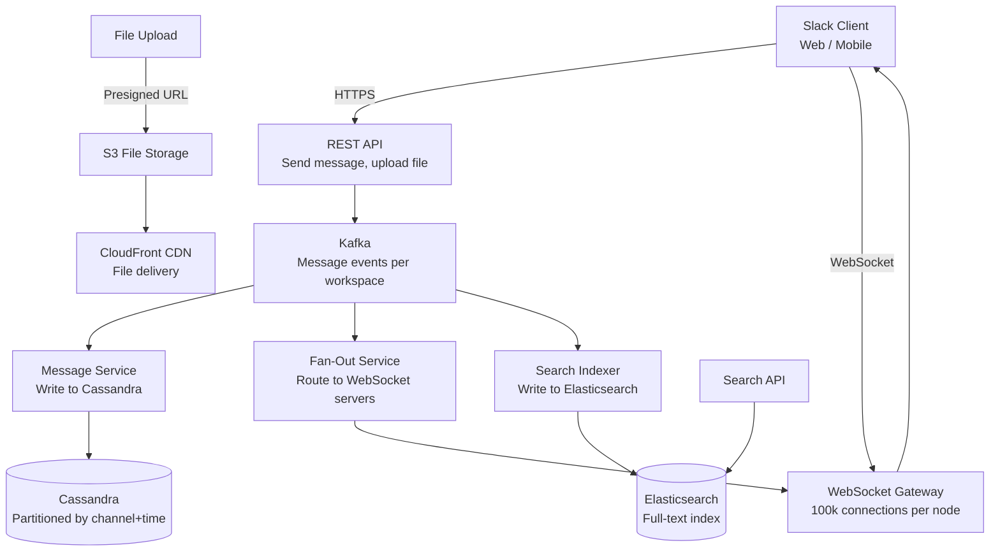
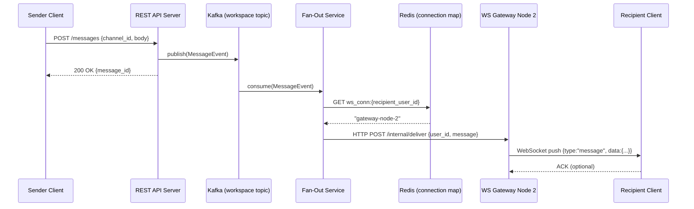
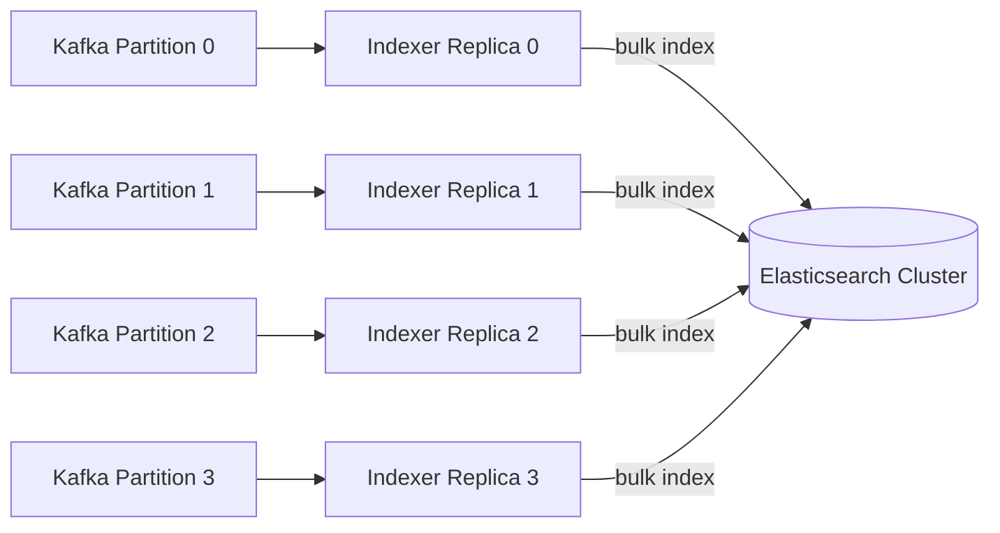

# Design a Team Collaboration Tool (Slack-Like)

**Difficulty**: 🟡 Medium | **Codemania #98**
**Reading Time**: ~12 min
**Interview Frequency**: High

---

## The Core Problem

Building a team chat + file sharing + task management tool handling 10 million messages per day with real-time delivery, threaded conversations, full-text search, and file uploads — while keeping message order consistent, ensuring delivery, and supporting 100,000 concurrent WebSocket connections per cluster.

---

## Functional Requirements

- Send/receive messages in channels (public) and DMs (private)
- Thread model: reply to any message, creating a nested thread
- File attachments: upload files, share in messages (images, docs, videos)
- Full-text search across all messages in workspace
- Presence indicators (online/offline status)
- Message reactions (emoji), pinning, editing, deletion
- Notifications: in-app, email, mobile push for mentions and DMs

## Non-Functional Requirements

| Requirement | Target |
|-------------|--------|
| Messages | 10M messages/day = ~116 messages/sec |
| Real-time delivery | < 500ms from send to recipient receipt |
| Concurrent connections | 100k WebSocket connections per cluster |
| Search | Full-text search across all messages in < 2 seconds |
| File upload | Up to 1 GB files; resumable upload |
| Message ordering | Total order within a channel (no out-of-order display) |

---

## Back-of-Envelope Estimates

- **Message rate**: 10M/day ÷ 86,400s = ~116 messages/sec average; 10× peak = 1,160/sec
- **Message storage**: 10M × 500 bytes avg = 5 GB/day; 3 years × 5 GB = 5.5 TB total
- **File storage**: Assume 10% of messages have files, avg 2 MB → 10M × 0.1 × 2 MB = 2 TB/day (primarily CDN-served from S3)
- **WebSocket capacity**: 100k connections × ~4 KB memory/connection = 400 MB per WebSocket server (commodity server can handle 100k)
- **Elasticsearch index**: 5 GB/day × 365 days × 1.5 index overhead = 2.7 TB/year for hot search window

---

## High-Level Architecture



---

## Key Design Decisions

### 1. Message Storage: Cassandra Partitioned by Channel + Time

Messages have a clear access pattern: "get recent messages for channel X". This maps perfectly to Cassandra's partition model:

```cql
CREATE TABLE messages (
  channel_id   UUID,
  bucket       BIGINT,        -- time bucket (e.g., Unix timestamp // 86400 = day)
  message_id   BIGINT,        -- Snowflake ID (timestamp + worker + sequence)
  sender_id    UUID,
  body         TEXT,
  thread_parent_id BIGINT,    -- NULL = top-level, non-NULL = thread reply
  reactions    MAP<TEXT, SET<UUID>>,  -- emoji → set of user_ids
  edited_at    TIMESTAMP,
  deleted      BOOLEAN,
  PRIMARY KEY ((channel_id, bucket), message_id)
) WITH CLUSTERING ORDER BY (message_id DESC);
```

Querying recent messages for a channel:
```cql
SELECT * FROM messages
WHERE channel_id = :cid AND bucket = :today_bucket
ORDER BY message_id DESC
LIMIT 50;
```

Bucket prevents hot partitions: if all messages for a channel were in one partition, active channels would be a Cassandra hot spot. Bucket by day/week distributes load.

### 2. Message Ordering with Snowflake IDs

Messages within a channel must appear in the order they were sent. Two approaches:

**Database sequence**: Simple auto-increment. Problem: doesn't work across distributed systems — two servers generating IDs simultaneously may produce duplicates or out-of-order IDs.

**Snowflake ID** (Twitter's approach):
```
| 41 bits: timestamp (ms) | 10 bits: worker ID | 12 bits: sequence |
```
- Millisecond precision → messages are roughly time-ordered
- Worker ID → no coordination needed between servers
- Sequence → up to 4,096 messages per millisecond per worker

Snowflake IDs are monotonically increasing within a worker and comparable across workers (approximately time-ordered). For strict ordering within a channel, pair with Cassandra's `CLUSTERING ORDER BY message_id DESC`.

### 3. Fan-Out on Write vs Fan-Out on Read

| Approach | Fan-Out on Write | Fan-Out on Read |
|----------|-----------------|-----------------|
| Write cost | O(N recipients) — high for large channels | O(1) — just write message |
| Read cost | O(1) — message already in each recipient's inbox | O(N) — query and merge all channels |
| Large channel behavior | 10k member channel = 10k writes per message | Impractical — reader must check 10k channels |
| Latency | Higher write latency | Higher read latency |

**Decision**: Hybrid:
- **Small channels/DMs (< 100 members)**: Fan-out on write — copy message to each recipient's inbox. Fast reads.
- **Large channels (> 100 members)**: Fan-out on read — message stored once; recipients fetch channel on read. Limits write amplification.

### 4. Thread Model

Threads allow replies to be grouped under a parent message:
```
Message A (top-level, thread_parent_id = NULL)
  └── Reply B (thread_parent_id = A.message_id)
  └── Reply C (thread_parent_id = A.message_id)
      └── Reply D (thread_parent_id = C.message_id)  -- deep nesting
```

Thread display:
- Channel view: Show top-level messages only (`WHERE thread_parent_id IS NULL`)
- Thread panel: Show all replies to a specific message (`WHERE thread_parent_id = :parent_id`)

Store thread reply count on the parent message for display (denormalized): `thread_reply_count` column, incremented atomically.

### 5. Full-Text Search with Elasticsearch

Each message published to Kafka → Search Indexer consumes → indexes in Elasticsearch:
```json
{
  "message_id": "snowflake-123",
  "channel_id": "uuid",
  "workspace_id": "uuid",
  "sender_id": "uuid",
  "body": "Has anyone used the new Kafka connector?",
  "timestamp": "2024-01-15T14:00:00Z",
  "reactions": {"thumbsup": 3}
}
```

Search query: `{"match": {"body": "kafka connector"}, "filter": {"term": {"workspace_id": "..."}}}`

Workspace isolation: all search queries filtered by `workspace_id` to prevent cross-workspace data leaks.

---

## Real-Time Delivery via WebSocket

Message flow:
1. Sender sends `POST /messages` → Kafka event published
2. Fan-Out Service reads Kafka → looks up which WebSocket server each recipient is connected to (Redis mapping: `user_id → ws_server_id`)
3. Fan-Out sends delivery request to target WebSocket server
4. WebSocket server pushes message to recipient's open connection

If recipient is offline:
- Message stored in Cassandra (persistent)
- Push notification via FCM/APNS for mobile
- Email digest for prolonged offline periods (configurable)

---

## Top Interview Questions for This Problem

| Question | Tests |
|----------|-------|
| How do you handle message ordering in a distributed system? | Snowflake IDs, Cassandra clustering order, causal ordering |
| How does search work across billions of messages? | Elasticsearch with workspace-scoped index, sharding by workspace |
| What happens if a WebSocket server crashes mid-delivery? | Client reconnects, re-fetches missed messages via REST API using last-seen message ID |
| How do you handle a channel with 100,000 members? | Fan-out on read for large channels, avoid fan-out on write at this scale |

---

## Common Mistakes

1. **Single database for messages**: At 10M messages/day, relational DB with full-text search becomes a bottleneck. Use Cassandra for storage, Elasticsearch for search — separate concerns.
2. **Fan-out on write for all channels**: A 10k-member announcement channel with 1 message → 10k writes. Use fan-out on read for large channels.
3. **Sequential message IDs from a single source**: Bottleneck at write scale. Snowflake IDs distribute ID generation across workers.

---

## Related Concepts

- [Caching Fundamentals](../../02-caching/concepts/caching-fundamentals) — Redis mapping user → WebSocket server
- [Message Queue Basics](../../04-messaging/concepts/message-queue-basics) — Kafka for message pipeline and fan-out

---

## Component Deep Dive 1: WebSocket Gateway & Fan-Out Pipeline

The WebSocket Gateway is the most critical architectural component in any real-time collaboration tool. At 100,000 concurrent connections per node, it must handle connection lifecycle, message routing, and reconnection logic without becoming a bottleneck or single point of failure.

### Internal Architecture of the WebSocket Gateway

Each WebSocket server maintains an in-memory map of `user_id → connection object`. When a message arrives from the Fan-Out Service (via an internal pub/sub or direct HTTP call), the gateway looks up the connection and pushes the payload over the wire. The challenge is that users can reconnect to *any* gateway node after a disconnect — so the mapping must be shared across all gateway nodes.

**Redis as the Connection Registry**: On every WebSocket connect, the gateway writes:
```
SET ws_conn:{user_id} {gateway_node_id}  EX 300
```
On disconnect it deletes the key. TTL prevents stale entries from accumulating if a gateway crashes without cleanup. The Fan-Out Service queries Redis to determine which gateway node owns the recipient's connection, then calls that specific node's internal API to push the message.

### Why Naive Approaches Fail

**Single gateway node**: Works for 1,000 connections, collapses at 100,000. A single Node.js process saturates at ~65k open file descriptors. Even if you increase the fd limit, a single process becomes CPU-bound on TLS termination.

**Broadcast to all gateways**: Every gateway node receives every message and discards it unless the recipient is connected locally. At 1,160 messages/sec × 200 gateway nodes = 232,000 internal deliveries/sec for zero benefit. This is what Discord observed in 2017 when they were running a naive pub/sub fan-out.

**Direct DB polling by gateway**: Each gateway polls Cassandra for new messages every 100ms. 100 gateways × 10 polls/sec = 1,000 Cassandra reads/sec just for delivery, not for user reads. Latency spikes above 500ms during Cassandra GC pauses.

### Sequence Diagram: Message Delivery Flow



### Trade-off Table: Fan-Out Implementation Options

| Approach | Write Latency | CPU Cost at 100k Users | Fault Tolerance | Complexity |
|----------|--------------|------------------------|-----------------|------------|
| Redis Pub/Sub per user | ~5ms | Low — only N channels published | Poor — missed messages on crash | Low |
| Kafka per workspace + routing service | ~50ms | Medium — routing lookup overhead | High — Kafka retains messages | Medium |
| Direct gateway-to-gateway RPC | ~2ms | High — O(N gateways) fanout | Poor — no retry on crash | High |
| Kafka + Redis routing (recommended) | ~30–80ms | Medium | High | Medium |

**Decision**: Kafka for durability + Redis routing for targeted delivery. The 30–80ms overhead is acceptable when the 500ms SLA includes network RTT to client.

---

## Component Deep Dive 2: Message Search with Elasticsearch

Elasticsearch is the search layer, but its design must prevent cross-workspace data leaks, control index bloat, and keep p99 search under 2 seconds across billions of documents.

### Internal Mechanics of the Search Pipeline

Every message published to Kafka is also consumed by the **Search Indexer** — a separate consumer group that reads the same Kafka topic. The indexer batches messages (500 at a time or every 500ms, whichever comes first) and bulk-writes them to Elasticsearch via the `_bulk` API. Batching is critical: individual document indexing at 1,160 msg/sec generates 1,160 HTTP requests/sec; bulk indexing reduces this to ~2.3 requests/sec.

**Index strategy**: Two viable approaches:

1. **One index per workspace**: `messages_workspace_{uuid}`. Strong isolation, easy deletion (drop index on workspace churn), but operational overhead — 100,000 workspaces = 100,000 indices. Elasticsearch's cluster state becomes unwieldy above ~10,000 indices.

2. **Shared index with workspace_id filter**: All messages in `messages_hot` (current 90 days) and `messages_cold` (older). Every query includes a `filter` clause on `workspace_id`. Simpler ops, but a misconfigured query *can* return cross-workspace results if the filter is accidentally dropped.

**Slack's actual choice** (as described in their 2019 engineering blog): They use a **per-workspace Elasticsearch cluster** for large enterprise customers and shared infrastructure for free/small teams. This gives enterprise customers data locality guarantees.

### Index Mapping (Elasticsearch)

```json
{
  "mappings": {
    "properties": {
      "message_id":    { "type": "keyword" },
      "workspace_id":  { "type": "keyword" },
      "channel_id":    { "type": "keyword" },
      "sender_id":     { "type": "keyword" },
      "sender_display_name": { "type": "keyword" },
      "body":          { "type": "text", "analyzer": "english" },
      "timestamp":     { "type": "date" },
      "thread_parent_id": { "type": "keyword" },
      "has_attachments":  { "type": "boolean" },
      "is_deleted":    { "type": "boolean" }
    }
  },
  "settings": {
    "number_of_shards": 5,
    "number_of_replicas": 1,
    "index.refresh_interval": "5s"
  }
}
```

Increasing `refresh_interval` from the default 1s to 5s reduces indexing overhead by ~30% with an acceptable trade-off: new messages may not appear in search for up to 5 seconds after indexing. For a collaboration tool, this is generally acceptable — users don't search for messages they just sent.

### Behavior at 10x Load

At 1 million messages/day (10x baseline), the indexing pipeline falls behind if the Search Indexer is a single consumer. Kafka consumer lag grows until p99 search reflects data that is minutes stale. Solution: scale the Search Indexer consumer group — add 4 partitions minimum, run 4 indexer replicas. Each handles 290 msgs/sec of indexing, well within Elasticsearch's 5,000 docs/sec ingest rate on a 3-node cluster.



**Index lifecycle**: Move documents older than 90 days from hot nodes (SSD) to warm nodes (HDD) using Elasticsearch ILM (Index Lifecycle Management). This alone reduces hot-node storage by 75% since most search queries target recent messages.

---

## Component Deep Dive 3: Presence System & Notification Fanout

The presence system — online/offline/away status — is deceptively complex. At 10M DAU with users toggling between active/idle every few minutes, presence events can generate more traffic than messages themselves.

### Technical Decisions

**Heartbeat approach**: Each WebSocket client sends a heartbeat ping every 30 seconds. The gateway updates `presence:{user_id}` in Redis with a 60-second TTL:
```
SET presence:{user_id}  "online"  EX 60
```
If no heartbeat arrives within 60 seconds, the key expires and the user is considered offline. This is eventually consistent — a user who closes their laptop without a clean disconnect appears online for up to 60 seconds.

**Presence broadcast scope**: Sending every user's status to every other user is O(N²) fan-out. Slack limits presence subscription: you only receive presence updates for users in your sidebar (channels you're in + DMs). This reduces broadcast scope from workspace-wide to per-user neighborhood (~50–200 users).

**Push notification routing**: Offline users receive push via FCM (Android) or APNS (iOS). The notification service queries the device token registry (stored in MySQL: `user_id, platform, device_token, created_at`) and calls the respective push API. For high-volume workspaces, notifications are batched and throttled to avoid notification storms when a channel has 1,000 offline members.

**Presence at scale — the thundering herd problem**: When a large workspace comes online after a planned maintenance window, all users reconnect simultaneously and publish presence updates. At 50,000 users reconnecting over 60 seconds, that's ~833 Redis SET operations/sec just for presence keys — easily manageable. But if 50,000 users also subscribe to each other's presence, the fan-out to notify all subscribers is 50,000 × 200 subscriptions = 10 million presence events in 60 seconds (~167,000/sec). Slack mitigates this by debouncing presence broadcasts: collect presence changes for 5 seconds, then publish a batched update rather than one event per change. This reduces event volume by ~80% during reconnect storms.

---

## Data Model

### Messages Table (Cassandra)

```sql
-- Cassandra CQL — partitioned by channel + time bucket
CREATE TABLE messages (
  channel_id        UUID,
  bucket            BIGINT,          -- Unix timestamp / 86400 (1 day buckets)
  message_id        BIGINT,          -- Snowflake ID (41-bit ms timestamp + 10-bit worker + 12-bit seq)
  sender_id         UUID,
  workspace_id      UUID,            -- for access control checks
  body              TEXT,
  body_tokens       LIST<TEXT>,      -- extracted for lightweight local search
  thread_parent_id  BIGINT,          -- NULL = top-level message
  thread_reply_count INT,            -- denormalized counter
  file_attachments  LIST<FROZEN<attachment>>,
  reactions         MAP<TEXT, SET<UUID>>,   -- emoji_code -> set of user_ids who reacted
  edited_at         TIMESTAMP,
  deleted_at        TIMESTAMP,       -- soft delete
  client_msg_id     UUID,            -- idempotency key from client
  PRIMARY KEY ((channel_id, bucket), message_id)
) WITH CLUSTERING ORDER BY (message_id DESC)
  AND gc_grace_seconds = 864000;     -- 10-day tombstone grace for soft deletes
```

### Channels Table (PostgreSQL)

```sql
CREATE TABLE channels (
  channel_id      UUID PRIMARY KEY DEFAULT gen_random_uuid(),
  workspace_id    UUID NOT NULL REFERENCES workspaces(workspace_id),
  name            VARCHAR(80) NOT NULL,
  channel_type    VARCHAR(20) NOT NULL CHECK (channel_type IN ('public','private','dm','mpim')),
  created_by      UUID NOT NULL REFERENCES users(user_id),
  created_at      TIMESTAMPTZ DEFAULT now(),
  archived_at     TIMESTAMPTZ,
  member_count    INT NOT NULL DEFAULT 0,   -- denormalized for fan-out threshold decision
  last_message_id BIGINT,                   -- Snowflake ID for "mark as read" watermark
  topic           TEXT,
  description     TEXT
);

CREATE INDEX idx_channels_workspace ON channels(workspace_id) WHERE archived_at IS NULL;
```

### Channel Memberships (PostgreSQL)

```sql
CREATE TABLE channel_members (
  channel_id    UUID NOT NULL REFERENCES channels(channel_id),
  user_id       UUID NOT NULL REFERENCES users(user_id),
  joined_at     TIMESTAMPTZ DEFAULT now(),
  last_read_id  BIGINT NOT NULL DEFAULT 0,  -- Snowflake ID of last-read message
  is_muted      BOOLEAN NOT NULL DEFAULT false,
  notification_level VARCHAR(20) DEFAULT 'all',  -- all|mentions|nothing
  PRIMARY KEY (channel_id, user_id)
);

CREATE INDEX idx_members_user ON channel_members(user_id);
```

### File Attachments (S3 + metadata in PostgreSQL)

```sql
CREATE TABLE file_uploads (
  file_id         UUID PRIMARY KEY DEFAULT gen_random_uuid(),
  workspace_id    UUID NOT NULL,
  uploaded_by     UUID NOT NULL,
  original_name   VARCHAR(255) NOT NULL,
  mime_type       VARCHAR(100) NOT NULL,
  size_bytes      BIGINT NOT NULL,
  s3_key          VARCHAR(512) NOT NULL UNIQUE,   -- e.g., workspaces/{ws_id}/files/{file_id}/{filename}
  cdn_url         TEXT,
  thumbnail_url   TEXT,
  upload_status   VARCHAR(20) DEFAULT 'pending',  -- pending|complete|failed
  created_at      TIMESTAMPTZ DEFAULT now(),
  virus_scan_status VARCHAR(20) DEFAULT 'pending' -- pending|clean|quarantined
);
```

### Elasticsearch Document Schema

```json
{
  "message_id": "1234567890123456789",
  "workspace_id": "550e8400-e29b-41d4-a716-446655440000",
  "channel_id": "7b3a9c12-1234-5678-abcd-ef0123456789",
  "sender_id": "abc12345-0000-0000-0000-000000000001",
  "sender_display_name": "Alice Johnson",
  "body": "Has anyone used the new Kafka connector for PostgreSQL?",
  "timestamp": "2024-01-15T14:00:00.000Z",
  "thread_parent_id": null,
  "has_attachments": false,
  "reaction_count": 3,
  "is_deleted": false
}
```

---

## Scale Bottlenecks

| Traffic Level | Component That Breaks | Symptoms | Mitigation |
|---------------|----------------------|----------|------------|
| 10x baseline (1,160 msg/sec) | Kafka consumer lag on fan-out | Messages delivered >2s late; WebSocket push delayed | Add partitions to Kafka workspace topic; scale Fan-Out consumer group from 2→8 replicas |
| 10x baseline | Elasticsearch indexer falls behind | Search returns stale results (5+ minutes old) | Add Search Indexer consumer replicas; bulk index with 500-doc batches |
| 100x baseline (11,600 msg/sec) | WebSocket gateway memory | OOMKilled on gateways; connections dropped | Shard users across more gateway nodes; scale from 10→100 gateway pods |
| 100x baseline | Redis connection map hot spot | GET/SET latency >10ms; fan-out delays | Shard Redis by `user_id % 16` (16 Redis shards); use Redis Cluster |
| 100x baseline | Cassandra write throughput | Write timeouts; message loss risk | Add Cassandra nodes (linear horizontal scale); increase replication factor to 5 |
| 1000x baseline (116,000 msg/sec) | Kafka throughput | Producer backpressure; API returns 503 | Multi-region Kafka clusters; per-workspace topic partitioning |
| 1000x baseline | Elasticsearch ingest | Index refresh lag >30s; query p99 >5s | Dedicated ingest nodes; increase shard count; split hot/warm index tiers |
| 1000x baseline | PostgreSQL (channels/members) | Member lookup timeouts for large-channel fan-out | Read replicas for member lookups; cache `channel_id → member_list` in Redis for channels <1000 members |

---

## How Slack Built This

Slack Engineering has published extensively about their real-time messaging infrastructure. By 2019, Slack was handling **1 billion messages per week** (roughly 1,650 msg/sec average, 10x peak = 16,500 msg/sec) across 10 million daily active users with 100,000+ concurrent WebSocket connections at peak.

**Technology choices Slack made:**

- **Flannel** (Slack's internal edge cache): Slack built a custom message cache layer called Flannel that sits between clients and the backend. Rather than every reconnecting client fetching missed messages from Cassandra (expensive), Flannel caches the last ~1,000 messages per active channel in memory. On reconnect, the client fetches from Flannel instead of hitting Cassandra. This reduced Cassandra read load by 60% after rollout. Flannel is a purpose-built service — not Redis, because Redis didn't give them the channel-level cache invalidation semantics they needed.

- **Vitess for MySQL**: Slack originally used MySQL sharded by workspace. As the number of workspaces grew past 500,000, managing individual shards became operationally expensive. They adopted Vitess (YouTube's MySQL sharding middleware) to abstract the sharding layer, allowing online resharding without downtime.

- **WebSocket servers in Go**: Slack migrated their WebSocket layer from Java to Go after observing that Go's goroutine model handled 100k concurrent connections with 40% lower memory footprint than Java NIO threads. Each goroutine uses ~4KB vs ~512KB for a Java thread.

- **Non-obvious decision — per-enterprise Elasticsearch**: For Enterprise Grid customers (Fortune 500 companies), Slack runs dedicated Elasticsearch clusters isolated from the shared multi-tenant clusters used by free/standard teams. This adds ~$2,000/month per cluster in infrastructure cost but is required for regulatory compliance (SOC2, HIPAA) and guarantees that a noisy neighbor's search load doesn't degrade a financial institution's search SLA.

- **Message delivery acknowledgment**: Slack uses a server-side ACK system where the client sends back an `ack` event after receiving a message. If the server doesn't receive the ACK within 3 seconds, it re-pushes the message (idempotent due to `client_msg_id`). This reduced reported "missing message" support tickets by 85% after implementation.

**Source**: Slack Engineering Blog — "Scaling Slack's Job Queue" (2017), "Traffic 101: Packets Mostly Flow" (2017), "How Slack Built Shared Channels" (2019) — all at [slack.engineering](https://slack.engineering).

---

## Interview Angle

**What the interviewer is testing:** Whether you can reason about real-time delivery guarantees at scale — specifically the fan-out problem with large channels — and whether you understand the interplay between message storage, search, and presence as separate concerns with different consistency requirements.

**Common mistakes candidates make:**

1. **Using a relational database for message storage**: Candidates propose PostgreSQL with a `messages` table. The interviewer will ask "what happens at 10M messages/day?" — the correct answer requires partitioning by channel+time and horizontal scaling, which maps naturally to Cassandra but requires substantial sharding work with PostgreSQL. Relational DBs also make it impossible to achieve 116 msg/sec write throughput without a dedicated write-optimized layer.

2. **Fan-out on write for all channels**: Proposing a single fan-out strategy ignores the 10k-member Slack channel problem. Writing 10,000 inbox entries per message = 10,000 × 116 msg/sec = 1.16 million writes/sec just for fan-out. This is 10x Cassandra's practical write ceiling on a 10-node cluster.

3. **Treating search as a Cassandra query**: Cassandra does not support full-text search efficiently. Candidates who say "I'll use `ALLOW FILTERING` on the body column" reveal they haven't used Cassandra in production — ALLOW FILTERING disables partition pruning and results in full table scans. Search requires a dedicated Elasticsearch or OpenSearch layer.

**The insight that separates good from great answers:** The threshold between fan-out on write vs fan-out on read is not a fixed number — it's a function of your write throughput ceiling divided by the number of active large channels. A candidate who says "use fan-out on write below 100 members" and explains *why* that threshold exists (because 100 writes × 116 msg/sec = 11,600 writes/sec, manageable on a 5-node Cassandra cluster) demonstrates both systems knowledge and back-of-envelope reasoning under pressure.

**Follow-up questions the interviewer will ask:**

- "How would you implement message edit and delete without breaking ordering guarantees?" — Answer: Soft deletes (set `deleted_at` timestamp, never physically remove); edits write a new version with `edited_at` set. Cassandra updates in place (upsert by primary key). Elasticsearch documents are updated via `_update` API; eventually consistent with Cassandra.
- "How do you handle file uploads larger than 1 GB?" — Answer: S3 multipart upload API: client breaks file into 5 MB+ chunks, uploads each part, signals completion. The API server issues a presigned multipart upload URL. File metadata row in PostgreSQL moves from `upload_status='pending'` to `'complete'` via S3 event notification → Lambda → API callback.
- "What's your strategy for multi-region deployment?" — Answer: Active-active with Cassandra multi-region replication (LOCAL_QUORUM writes to nearest region, async replication cross-region). Kafka MirrorMaker 2 for cross-region topic replication. WebSocket gateways in each region; users connect to nearest via GeoDNS. Acceptable trade-off: cross-region message delivery adds 50–150ms latency (network RTT between AWS regions).

---

## Key Numbers to Remember

| Metric | Value | Context |
|--------|-------|---------|
| Baseline message rate | 116 msg/sec average | 10M messages/day ÷ 86,400s |
| Peak message rate | 1,160 msg/sec | 10x baseline; design for this |
| WebSocket memory per connection | ~4 KB (Go goroutine) | 100k connections = 400 MB per gateway node |
| Cassandra write throughput | ~50k writes/sec per node | Horizontal scale with node additions |
| Elasticsearch ingest throughput | ~5,000 docs/sec | 3-node cluster with bulk API |
| Fan-out threshold | 100 members | Below: fan-out on write; above: fan-out on read |
| Snowflake ID capacity | 4,096 IDs/ms per worker | 12-bit sequence field |
| Redis key TTL for connection map | 300 seconds | Auto-expire stale entries on gateway crash |
| Search index size | ~2.7 TB/year | 5 GB/day × 365 × 1.5 overhead factor |
| Flannel cache (Slack) | Last ~1,000 msgs per channel | Reduced Cassandra reads by 60% at Slack |
| Presence heartbeat interval | 30 seconds | Client ping; 60s TTL in Redis |
| Elasticsearch refresh interval | 5 seconds | New messages searchable within 5s of indexing |
| Kafka message retention | 7 days | Offline delivery backstop; fan-out re-delivery on crash |
| Push notification batch window | 5 seconds | Debounce to prevent notification storm on reconnect |
| Idempotency key TTL | 5 minutes | Redis cache of client_msg_id to prevent duplicate inserts |
| Slack DAU at scale | 10M+ DAU | Public figure as of 2019; ~1 billion msgs/week |
| Cassandra replication factor | RF=3 | Quorum writes (W=2) tolerate 1 node failure |
| Elasticsearch shard count | 5 primary + 1 replica | Per-workspace on shared cluster; 10 shards total |
| File upload max size | 1 GB | S3 multipart upload; 5 MB minimum part size |
| Presence subscription scope | ~50–200 users | Sidebar contacts only; not full workspace |
| Reconnect catch-up window | Last 50 messages | REST fetch on reconnect using after_id param |
| Bulk indexing batch size | 500 docs / 500ms | Reduces Elasticsearch HTTP requests by ~99% |
| Kafka retention for fan-out | 7 days | Re-deliverable after Fan-Out Service crash |

---

## Message Delivery Guarantees

Real-time collaboration tools must define exactly which delivery guarantees they provide, because the mechanisms to achieve each level differ significantly in complexity and cost.

| Guarantee Level | Definition | Mechanism | Cost |
|----------------|------------|-----------|------|
| At-most-once | Message may be lost; never delivered twice | Fire-and-forget WebSocket push | Lowest — no ACK needed |
| At-least-once | Message always delivered; may be duplicated | Server retries until ACK received; client deduplicates by `message_id` | Medium — ACK tracking in Redis |
| Exactly-once | Message delivered exactly once | Idempotent writes (check `client_msg_id` before insert) + at-least-once delivery | Highest — DB lookup per message |

**Slack's approach**: At-least-once delivery with client-side deduplication. The client tracks the last 100 received `message_id` values in memory; on duplicate push, it silently discards the duplicate. This is sufficient for a chat app — duplicates are rarer than lost messages, and the visual impact of a briefly-visible duplicate (before dedup) is acceptable.

**Message persistence guarantee**: Kafka provides the durability backstop. Even if every WebSocket server crashes simultaneously, messages are retained in Kafka for 7 days. The Fan-Out Service, on restart, reads from its last committed offset and re-delivers all messages that hadn't been ACKed. Recipients who were offline receive messages when they reconnect via the REST catch-up API (`GET /channels/{id}/messages?after_id={last_seen_id}`).

**Idempotency key flow**: The client generates a UUID `client_msg_id` before calling `POST /messages`. If the API call times out and the client retries, the server checks Cassandra for an existing row with the same `client_msg_id` (stored as a secondary index or Redis short-lived cache with 5-minute TTL). If found, it returns the existing message rather than inserting a duplicate. This prevents the common "duplicate message on network retry" bug that degrades trust in the product.

---

## Failure Modes & Recovery

| Failure | Impact | Detection | Recovery |
|---------|--------|-----------|----------|
| WebSocket gateway crash | All connections on that node drop; users see disconnect banner | Health check fails; Redis ws_conn keys expire | Clients auto-reconnect to any healthy gateway; fetch missed messages via REST using `after_id` param |
| Kafka partition leader failure | Fan-out pauses for affected partitions (seconds) | Consumer lag alert; ISR shrinks | Kafka auto-elects new partition leader in <30s; messages buffered in Kafka are delivered after recovery |
| Cassandra node failure | Writes/reads degrade if RF=3 and 2+ nodes fail | Cassandra nodetool status; write timeout errors | Cassandra's hinted handoff stores writes for the failed node; repairs on recovery |
| Elasticsearch node failure | Search degrades or returns partial results | Cluster health turns yellow/red | Replica shards promoted; full recovery via shard rebalancing |
| Redis connection map failure | Fan-out cannot determine target gateway; messages fall back to offline path | Redis PING failure; connection map miss rate spikes | Fallback: broadcast to all gateways (expensive but correct); restore Redis from replica |
| Search Indexer consumer lag | Search results stale by minutes | Kafka consumer lag metric >10,000 msgs | Scale out indexer replicas; increase Kafka partitions if replicas are already maxed |

---

## 📚 Resources & References

| Resource | Type | What You'll Learn |
|----------|------|------------------|
| [ByteByteGo — Design Slack / Discord](https://www.youtube.com/@ByteByteGo) | 📺 YouTube | Message storage, WebSocket fan-out, search indexing |
| [Slack Engineering — Scaling Real-Time Messaging](https://slack.engineering) | 📖 Blog | How Slack handles millions of concurrent connections |
| [Hussein Nasser — Chat System Architecture](https://www.youtube.com/@hnasr) | 📺 YouTube | WebSocket design, message ordering, delivery guarantees |
| [High Scalability — Discord Architecture](https://highscalability.com) | 📖 Blog | How Discord stores trillions of messages with Cassandra |
