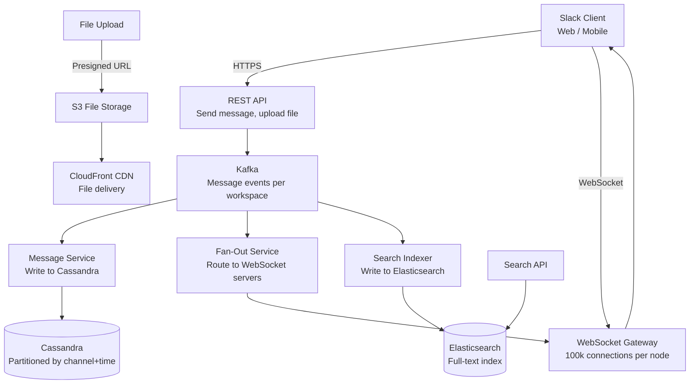

# Design a Team Collaboration Tool (Slack-Like)

**Difficulty**: 🟡 Medium | **Codemania #98**
**Reading Time**: ~12 min
**Interview Frequency**: High

---

## The Core Problem

Building a team chat + file sharing + task management tool handling 10 million messages per day with real-time delivery, threaded conversations, full-text search, and file uploads — while keeping message order consistent, ensuring delivery, and supporting 100,000 concurrent WebSocket connections per cluster.

---

## Functional Requirements

- Send/receive messages in channels (public) and DMs (private)
- Thread model: reply to any message, creating a nested thread
- File attachments: upload files, share in messages (images, docs, videos)
- Full-text search across all messages in workspace
- Presence indicators (online/offline status)
- Message reactions (emoji), pinning, editing, deletion
- Notifications: in-app, email, mobile push for mentions and DMs

## Non-Functional Requirements

| Requirement | Target |
|-------------|--------|
| Messages | 10M messages/day = ~116 messages/sec |
| Real-time delivery | < 500ms from send to recipient receipt |
| Concurrent connections | 100k WebSocket connections per cluster |
| Search | Full-text search across all messages in < 2 seconds |
| File upload | Up to 1 GB files; resumable upload |
| Message ordering | Total order within a channel (no out-of-order display) |

---

## Back-of-Envelope Estimates

- **Message rate**: 10M/day ÷ 86,400s = ~116 messages/sec average; 10× peak = 1,160/sec
- **Message storage**: 10M × 500 bytes avg = 5 GB/day; 3 years × 5 GB = 5.5 TB total
- **File storage**: Assume 10% of messages have files, avg 2 MB → 10M × 0.1 × 2 MB = 2 TB/day (primarily CDN-served from S3)
- **WebSocket capacity**: 100k connections × ~4 KB memory/connection = 400 MB per WebSocket server (commodity server can handle 100k)
- **Elasticsearch index**: 5 GB/day × 365 days × 1.5 index overhead = 2.7 TB/year for hot search window

---

## High-Level Architecture



---

## Key Design Decisions

### 1. Message Storage: Cassandra Partitioned by Channel + Time

Messages have a clear access pattern: "get recent messages for channel X". This maps perfectly to Cassandra's partition model:

```cql
CREATE TABLE messages (
  channel_id   UUID,
  bucket       BIGINT,        -- time bucket (e.g., Unix timestamp // 86400 = day)
  message_id   BIGINT,        -- Snowflake ID (timestamp + worker + sequence)
  sender_id    UUID,
  body         TEXT,
  thread_parent_id BIGINT,    -- NULL = top-level, non-NULL = thread reply
  reactions    MAP<TEXT, SET<UUID>>,  -- emoji → set of user_ids
  edited_at    TIMESTAMP,
  deleted      BOOLEAN,
  PRIMARY KEY ((channel_id, bucket), message_id)
) WITH CLUSTERING ORDER BY (message_id DESC);
```

Querying recent messages for a channel:
```cql
SELECT * FROM messages
WHERE channel_id = :cid AND bucket = :today_bucket
ORDER BY message_id DESC
LIMIT 50;
```

Bucket prevents hot partitions: if all messages for a channel were in one partition, active channels would be a Cassandra hot spot. Bucket by day/week distributes load.

### 2. Message Ordering with Snowflake IDs

Messages within a channel must appear in the order they were sent. Two approaches:

**Database sequence**: Simple auto-increment. Problem: doesn't work across distributed systems — two servers generating IDs simultaneously may produce duplicates or out-of-order IDs.

**Snowflake ID** (Twitter's approach):
```
| 41 bits: timestamp (ms) | 10 bits: worker ID | 12 bits: sequence |
```
- Millisecond precision → messages are roughly time-ordered
- Worker ID → no coordination needed between servers
- Sequence → up to 4,096 messages per millisecond per worker

Snowflake IDs are monotonically increasing within a worker and comparable across workers (approximately time-ordered). For strict ordering within a channel, pair with Cassandra's `CLUSTERING ORDER BY message_id DESC`.

### 3. Fan-Out on Write vs Fan-Out on Read

| Approach | Fan-Out on Write | Fan-Out on Read |
|----------|-----------------|-----------------|
| Write cost | O(N recipients) — high for large channels | O(1) — just write message |
| Read cost | O(1) — message already in each recipient's inbox | O(N) — query and merge all channels |
| Large channel behavior | 10k member channel = 10k writes per message | Impractical — reader must check 10k channels |
| Latency | Higher write latency | Higher read latency |

**Decision**: Hybrid:
- **Small channels/DMs (< 100 members)**: Fan-out on write — copy message to each recipient's inbox. Fast reads.
- **Large channels (> 100 members)**: Fan-out on read — message stored once; recipients fetch channel on read. Limits write amplification.

### 4. Thread Model

Threads allow replies to be grouped under a parent message:
```
Message A (top-level, thread_parent_id = NULL)
  └── Reply B (thread_parent_id = A.message_id)
  └── Reply C (thread_parent_id = A.message_id)
      └── Reply D (thread_parent_id = C.message_id)  -- deep nesting
```

Thread display:
- Channel view: Show top-level messages only (`WHERE thread_parent_id IS NULL`)
- Thread panel: Show all replies to a specific message (`WHERE thread_parent_id = :parent_id`)

Store thread reply count on the parent message for display (denormalized): `thread_reply_count` column, incremented atomically.

### 5. Full-Text Search with Elasticsearch

Each message published to Kafka → Search Indexer consumes → indexes in Elasticsearch:
```json
{
  "message_id": "snowflake-123",
  "channel_id": "uuid",
  "workspace_id": "uuid",
  "sender_id": "uuid",
  "body": "Has anyone used the new Kafka connector?",
  "timestamp": "2024-01-15T14:00:00Z",
  "reactions": {"thumbsup": 3}
}
```

Search query: `{"match": {"body": "kafka connector"}, "filter": {"term": {"workspace_id": "..."}}}`

Workspace isolation: all search queries filtered by `workspace_id` to prevent cross-workspace data leaks.

---

## Real-Time Delivery via WebSocket

Message flow:
1. Sender sends `POST /messages` → Kafka event published
2. Fan-Out Service reads Kafka → looks up which WebSocket server each recipient is connected to (Redis mapping: `user_id → ws_server_id`)
3. Fan-Out sends delivery request to target WebSocket server
4. WebSocket server pushes message to recipient's open connection

If recipient is offline:
- Message stored in Cassandra (persistent)
- Push notification via FCM/APNS for mobile
- Email digest for prolonged offline periods (configurable)

---

## Top Interview Questions for This Problem

| Question | Tests |
|----------|-------|
| How do you handle message ordering in a distributed system? | Snowflake IDs, Cassandra clustering order, causal ordering |
| How does search work across billions of messages? | Elasticsearch with workspace-scoped index, sharding by workspace |
| What happens if a WebSocket server crashes mid-delivery? | Client reconnects, re-fetches missed messages via REST API using last-seen message ID |
| How do you handle a channel with 100,000 members? | Fan-out on read for large channels, avoid fan-out on write at this scale |

---

## Common Mistakes

1. **Single database for messages**: At 10M messages/day, relational DB with full-text search becomes a bottleneck. Use Cassandra for storage, Elasticsearch for search — separate concerns.
2. **Fan-out on write for all channels**: A 10k-member announcement channel with 1 message → 10k writes. Use fan-out on read for large channels.
3. **Sequential message IDs from a single source**: Bottleneck at write scale. Snowflake IDs distribute ID generation across workers.

---

## Related Concepts

- [Caching Fundamentals](../../02-caching/concepts/caching-fundamentals) — Redis mapping user → WebSocket server
- [Message Queue Basics](../../04-messaging/concepts/message-queue-basics) — Kafka for message pipeline and fan-out

---

## 📚 Resources & References

| Resource | Type | What You'll Learn |
|----------|------|------------------|
| [ByteByteGo — Design Slack / Discord](https://www.youtube.com/@ByteByteGo) | 📺 YouTube | Message storage, WebSocket fan-out, search indexing |
| [Slack Engineering — Scaling Real-Time Messaging](https://slack.engineering) | 📖 Blog | How Slack handles millions of concurrent connections |
| [Hussein Nasser — Chat System Architecture](https://www.youtube.com/@hnasr) | 📺 YouTube | WebSocket design, message ordering, delivery guarantees |
| [High Scalability — Discord Architecture](https://highscalability.com) | 📖 Blog | How Discord stores trillions of messages with Cassandra |
