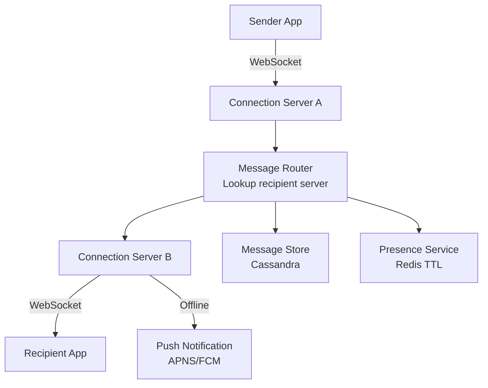
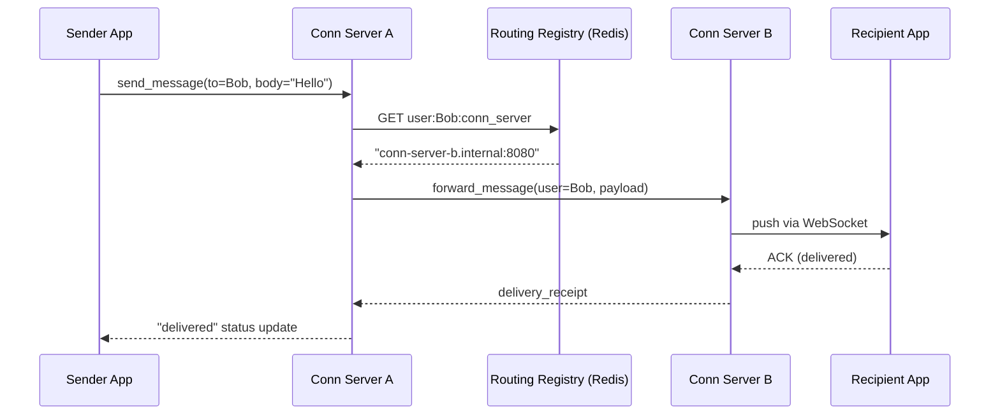
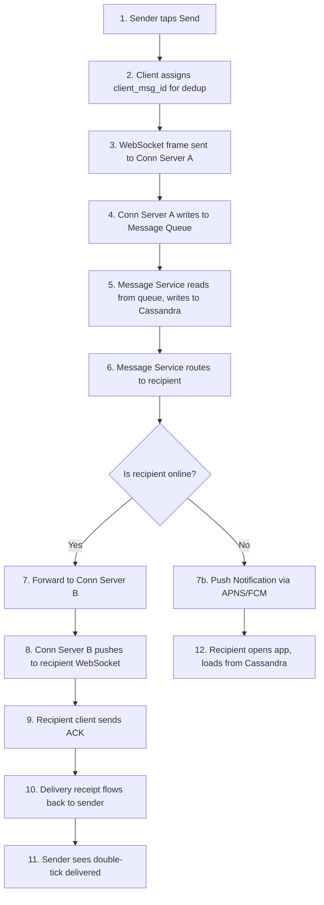
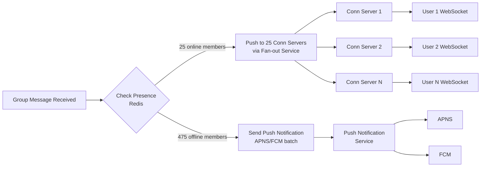

# Design Facebook Messenger — Real-Time Chat at Scale

**Difficulty**: 🔴 Advanced
**Reading Time**: Coming Soon
**Interview Frequency**: Very High

---

> 🚧 **Full article coming soon.** This stub gives you the essentials to start thinking about this problem.

---

## The Core Problem

Delivering messages between 2 billion users with delivery guarantees (sent → delivered → read receipts) and real-time presence (online/offline/typing indicators) requires maintaining persistent connections at massive scale. A single connection server can handle 100,000 WebSocket connections — serving 2B users requires 20,000 such servers.

## Functional Requirements

- 1-on-1 and group messaging (up to 500 members)
- Delivery receipts: sent, delivered, read
- Online presence and typing indicators
- Message history accessible on new devices (multi-device sync)
- Support for media (images, videos, files)

## Non-Functional Requirements

| Requirement | Target |
|-------------|--------|
| Availability | 99.99% (52 min/year) |
| Message delivery latency | p99 < 500ms |
| Message ordering | Consistent within conversation |
| Scale | 2B users, 100B messages/day |

## Back-of-Envelope Estimates

- **Messages per second**: 100B messages/day ÷ 86,400 = ~1.16M messages/sec
- **Connection servers**: 1B active users × 1 WebSocket = 1B connections ÷ 100K per server = 10,000 servers
- **Message storage**: 1.16M msg/sec × 200 bytes = 232MB/sec → ~20TB/day (Cassandra can handle this)

## Key Design Decisions

1. **Connection Layer Separation** — decouple connection management (stateful, WebSocket) from message processing (stateless); connection servers only route messages; message servers handle business logic; enables independent scaling.
2. **Message Storage in Cassandra** — use conversation_id as partition key, message_id (time-based UUID) as clustering key; gives efficient range scans for "last 100 messages in conversation"; Cassandra handles ~1M writes/sec per cluster.
3. **Delivery Receipts via Ack Pipeline** — message flows: sender → server (sent ✓) → recipient connection (delivered ✓✓) → recipient opens app (read ✓✓✓); each state change is a mini-event pushed back to sender.

## High-Level Architecture



## Top Interview Questions for This Problem

| Question | Tests |
|----------|-------|
| How do you route a message to the recipient's specific connection server? | Service discovery, consistent hashing |
| What happens when the recipient is offline when the message arrives? | Offline storage, push notifications |
| How do you maintain message ordering in group chats with concurrent senders? | Vector clocks, server-assigned sequence IDs |

## Level 1 — Surface Summary (2-Minute Read)

**What it is:** A real-time messaging system that maintains persistent connections (WebSocket/MQTT) between billions of users and routes messages with sub-500ms delivery latency.

**When you need this architecture:**
- More than ~10,000 concurrent users sending messages (HTTP polling breaks at this scale)
- Delivery receipts (sent/delivered/read) are a product requirement
- Presence indicators (online/offline/typing) are needed
- Messages must be durable (recoverable on new device login)

**Core concepts (5 bullets):**
- **Connection layer is stateful** — one WebSocket per user per device, held by a connection server; must scale horizontally with a routing registry
- **Message storage is write-heavy** — 1M+ writes/sec needs Cassandra, not MySQL; partition by `conversation_id`, cluster by `message_id`
- **Delivery receipt is an ack pipeline** — not a flag on the message row; flows: sender→server (sent) → recipient WebSocket (delivered) → recipient read event (read)
- **Group chat fan-out is the hidden cost** — 500-member group × 1M groups active = enormous write amplification; mitigate by fan-out only to online members
- **Offline path is different** — offline recipients get a push notification (APNS/FCM) with no message body; they pull from Cassandra on app open

**Use this when:** Building any real-time 1-on-1 or group chat at > 100K DAU.

**Don't use this when:** You only need async notifications (use simple push + polling); synchronous collaboration (use OT/CRDT instead of message ordering).

---

## Related Concepts

- [WhatsApp Messenger architecture comparison](./whatsapp-messenger)
- [Live comment system for similar fan-out patterns](../01-data-processing/live-comment-system)

---

## Component Deep Dive 1: Connection Management Layer

The Connection Management Layer is the most critical architectural component in Facebook Messenger. Every active user maintains a persistent WebSocket (or MQTT over TCP) connection to a connection server. This is fundamentally different from stateless HTTP services — connection servers are inherently stateful because they hold open TCP sockets.

**How it works internally:**

Each connection server maintains an in-memory map of `user_id → socket_fd` (socket file descriptor). When a message arrives for user Alice, the system must first determine which connection server currently holds Alice's WebSocket, then forward the message payload over that socket. This requires a two-step lookup: a routing registry (usually Redis or ZooKeeper) maps `user_id → connection_server_ip`, and the connection server maps `user_id → socket_fd` internally.

**Why naive approaches fail at scale:**

A single-machine approach breaks immediately — one server handling 100K connections at 1MB RAM per connection = 100GB RAM just for connection state. Horizontal scaling introduces the routing problem: sender's connection server must know which of the 10,000 connection servers holds the recipient's socket. Polling all 10,000 servers is O(N) and adds hundreds of milliseconds of latency. A centralized routing registry solves this but becomes a single point of failure and a hotspot at 1M+ lookups/sec.

**Facebook's approach** uses a distributed routing registry backed by Redis clusters sharded by `user_id`. Each connection server writes a heartbeat every 30 seconds: `SET user:{id}:conn_server {server_ip} EX 60`. Message delivery is then a single Redis GET before forwarding.



| Approach | Latency | Throughput | Trade-off |
|----------|---------|------------|-----------|
| Redis routing registry | ~1ms lookup | 500K lookups/sec per shard | Extra network hop; Redis must be HA |
| Consistent hash ring (no registry) | 0ms lookup | Unlimited (local computation) | Rehashing on server add/remove drops connections |
| ZooKeeper watches | 5–50ms (watch notification) | ~100K watchers | Good for low-churn but slow for per-message routing |

---

## Component Deep Dive 2: Message Storage and Ordering

Reliable message storage must handle 1.16M writes/sec while supporting efficient reads for "load last 100 messages in conversation X." Two hard constraints conflict: write throughput demands a write-optimized store, and ordered reads demand a clustering key that preserves conversation-local sequence.

**Internal mechanics:**

Facebook Messenger (and Discord) both settled on Apache Cassandra for message storage. The partition key is `conversation_id`, which collocates all messages for a given chat on the same Cassandra nodes. The clustering key is a time-based UUID (`message_id`) generated with a Snowflake-style ID generator — 41 bits timestamp + 10 bits server ID + 12 bits sequence. This guarantees monotonically increasing IDs within a server and near-monotonic globally.

```mermaid
graph LR
    subgraph Cassandra Partition
        direction TB
        P[Partition Key: conversation_id=abc123]
        R1[msg_id=1735000001_001 | sender=Alice | body=Hello]
        R2[msg_id=1735000002_003 | sender=Bob | body=Hi there]
        R3[msg_id=1735000003_007 | sender=Alice | body=How are you?]
        P --> R1 --> R2 --> R3
    end
```

**Scale behavior at 10x load:**

At baseline (1.16M writes/sec), a 6-node Cassandra cluster handles writes comfortably. At 10x (11.6M writes/sec), the bottleneck shifts to Cassandra compaction — SSTable merges consume disk I/O and compete with writes. Mitigation: use TWCS (TimeWindowCompactionStrategy) which groups SSTables by time window and compacts only within a window, dramatically reducing compaction amplification for append-only time-series data. At 100x load, partition hotspots emerge for viral group chats — a single conversation receiving 100K messages/minute saturates one Cassandra partition. Fix: bucket large group conversations with a composite key `(conversation_id, bucket_id)` where `bucket_id = message_timestamp / 3600`.

| Approach | Write Throughput | Read Pattern | Trade-off |
|----------|-----------------|--------------|-----------|
| Cassandra (TWCS) | 1M+ writes/sec | Efficient range scans by time | Eventual consistency; tunable with QUORUM |
| MySQL (sharded) | ~100K writes/sec per shard | Strong consistency, complex joins | Hard to scale writes; good for small deployments |
| HBase | 500K+ writes/sec | Row key scans | Operationally complex; strong consistency with HDFS |

---

## Component Deep Dive 3: Presence Service

The Presence Service answers "Is Alice online right now?" and "Is Bob typing?" for up to 1B active users. Naive solutions — a single Redis key per user — collapse under fan-out: when Alice changes status from Online to Away, every one of her 500 friends must be notified. At 1B users with average 150 friends each, a single status change triggers 150 pub/sub events.

**Technical decisions:**

Facebook uses a tiered presence architecture. Each connection server maintains an in-memory presence state for its connected users. A user is considered "online" if their connection server has an active socket. The connection server publishes presence changes to a Presence Fanout Service only when the state actually changes (debounced to avoid flapping). The Presence Fanout Service holds a `friend_list` cache (refreshed every 5 minutes from the social graph) and pushes presence updates only to friends who are themselves online — dramatically reducing fan-out from 150 to the subset of online friends.

For typing indicators, a different approach is used: the sender's connection server directly forwards the `typing` event to each active recipient in the conversation without persisting it to the message store. Typing events are ephemeral — if delivery fails, no retry is attempted. This trades reliability for low latency (sub-100ms typing indicator delivery).

**Heartbeat TTL pattern:** Each connection server writes `SET presence:user:{id} online EX 35` every 30 seconds. If the server crashes, TTL expires in 35 seconds and the user is automatically marked offline — no explicit disconnect handling needed.

---

## Data Model

```sql
-- Messages table (Cassandra CQL)
CREATE TABLE messages (
    conversation_id  UUID,
    message_id       TIMEUUID,       -- Cassandra native time-UUID; sortable by time
    sender_id        BIGINT,
    message_type     TINYINT,        -- 0=text, 1=image, 2=video, 3=file, 4=reaction
    body             TEXT,           -- null for media messages
    media_url        TEXT,           -- CDN URL for images/videos
    media_mime_type  VARCHAR(64),
    reply_to_msg_id  TIMEUUID,       -- for threaded replies; nullable
    client_msg_id    UUID,           -- dedup key set by sender client
    is_deleted       BOOLEAN,
    deleted_at       TIMESTAMP,
    PRIMARY KEY (conversation_id, message_id)
) WITH CLUSTERING ORDER BY (message_id DESC)
  AND COMPACTION = {'class': 'TimeWindowCompactionStrategy',
                    'compaction_window_unit': 'HOURS',
                    'compaction_window_size': 1};

-- Delivery receipts table (Cassandra)
CREATE TABLE delivery_receipts (
    conversation_id  UUID,
    message_id       TIMEUUID,
    recipient_id     BIGINT,
    status           TINYINT,        -- 1=sent, 2=delivered, 3=read
    status_updated_at TIMESTAMP,
    PRIMARY KEY ((conversation_id, message_id), recipient_id)
);

-- Conversations table (Cassandra)
CREATE TABLE conversations (
    conversation_id  UUID,
    conversation_type TINYINT,       -- 0=direct, 1=group
    created_at       TIMESTAMP,
    last_message_id  TIMEUUID,       -- updated on each new message
    last_message_preview TEXT,       -- truncated for inbox display
    PRIMARY KEY (conversation_id)
);

-- Conversation membership (Cassandra — user inbox lookup)
CREATE TABLE user_conversations (
    user_id          BIGINT,
    last_activity_at TIMESTAMP,      -- for sorting inbox by recency
    conversation_id  UUID,
    is_muted         BOOLEAN,
    unread_count     INT,
    PRIMARY KEY (user_id, last_activity_at, conversation_id)
) WITH CLUSTERING ORDER BY (last_activity_at DESC);

-- Routing registry (Redis — not a table, shown as key patterns)
-- user:{user_id}:conn_server  → "conn-server-042.internal:8080"  EX 60
-- presence:{user_id}          → "online" | "away"                EX 35
-- typing:{conversation_id}:{user_id} → "1"                       EX 5
```

---

## Scale Bottlenecks

| Traffic Level | Component That Breaks | Symptoms | Mitigation |
|---------------|----------------------|----------|------------|
| 10x baseline (11.6M msg/sec) | Cassandra compaction I/O | Write latency spikes to p99 > 2s; disk I/O at 100% | Switch to TWCS; add nodes to reduce per-node write load |
| 10x baseline | Redis routing registry | GET latency increases to 10–50ms; connection timeouts | Shard Redis by `user_id % N`; use Redis Cluster with 16 shards |
| 100x baseline (116M msg/sec) | Message Router (fanout for group chats) | CPU saturation on router processes; message queue depth grows | Introduce per-conversation message queue (Kafka partitioned by `conversation_id`) |
| 100x baseline | Presence fanout service | Online friend notification storms; pub/sub backlog | Batch presence updates (100ms window); limit fan-out to friends who are themselves online |
| 1000x baseline (1.16B msg/sec) | Everything — network bandwidth | Cross-datacenter replication lag > 1s | Geographic sharding: route users to nearest datacenter; replicate asynchronously |
| 1000x baseline | CDN for media delivery | Cache miss rate spikes for viral videos | Pre-warm CDN for viral media; use perceptual hashing to deduplicate identical media at upload |

---

## How Discord Built This

Discord faced a nearly identical problem to Facebook Messenger at a smaller scale (500M registered users, 19M active daily servers). Their engineering blog post "How Discord Stores Billions of Messages" (2017, updated 2023) is one of the most detailed public post-mortems on messaging at scale.

**Technology choices:** Discord started with MongoDB but migrated to Cassandra in 2017 when their single MongoDB instance hit 100 million messages and query latency became unpredictable. They landed on the same `(channel_id, message_id)` partition design described above. In 2023 they migrated again — from Cassandra to ScyllaDB (a C++ re-implementation of Cassandra) to reduce p99 latency from ~40ms to ~5ms while cutting hardware costs by 2x.

**Specific numbers:** At migration time, Discord stored 4 billion messages across Cassandra. They were handling ~26,000 messages per second across all channels during peak. ScyllaDB runs 177 ScyllaDB nodes replacing a larger Cassandra cluster.

**Non-obvious architectural decision:** Discord enforces a hard limit of 5,000 members per server for real-time message delivery. Above 5,000, the server is classified as "large" and recipient fan-out switches from push (server pushes to all members' WebSocket connections) to pull (clients poll on reconnect or activity). This simple threshold eliminates the thundering herd problem where a popular server's single message triggers 500,000 simultaneous WebSocket writes.

**Source:** [Discord Engineering Blog — How Discord Stores Billions of Messages](https://discord.com/blog/how-discord-stores-billions-of-messages) and [ScyllaDB migration post (2023)](https://discord.com/blog/how-discord-stores-trillions-of-messages).

---

## Interview Angle

**What the interviewer is testing:** Whether you understand that real-time messaging requires solving three distinct hard problems simultaneously — stateful connection management, ordered durable storage, and sub-second fan-out — and that the solutions for each conflict with each other in non-obvious ways.

**Common mistakes candidates make:**

1. **Proposing HTTP long-polling instead of WebSockets** — Long-polling works for low-frequency updates but collapses at 1M+ concurrent users because each poll reconnect consumes a new TCP handshake (1.5 RTTs) and server thread. WebSockets maintain a persistent connection with ~1KB overhead per socket.

2. **Using a single database for all message storage** — Candidates often pick PostgreSQL or MySQL without acknowledging that relational databases hit a write ceiling around 10K–50K writes/sec per instance. At 1.16M writes/sec you need a write-optimized distributed store like Cassandra or at minimum aggressive sharding + async replication.

3. **Ignoring the message ordering problem in group chats** — In a group chat with concurrent senders, two messages sent "at the same time" from different connection servers can arrive at Cassandra in either order. Without server-assigned monotonically increasing sequence IDs, clients on different devices will show different orderings. The fix — server-side sequence IDs per conversation — must be explicitly designed into the write path, not assumed.

**The insight that separates good from great answers:** Great candidates recognize that delivery receipts (sent/delivered/read) are not just UX polish — they drive the entire reliability architecture. To guarantee "delivered" receipt, you need an ack from the recipient's connection server back to the sender's connection server. This ack pipeline doubles the number of messages flowing through the system and requires the message router to be stateful enough to correlate outbound messages with their acks. Designing this ack pipeline explicitly (with retry logic, ack timeout of ~5s before marking as "failed delivery") demonstrates understanding of the full lifecycle, not just the happy path.

---

## Key Numbers to Remember

| Metric | Value | Context |
|--------|-------|---------|
| WebSocket connections per server | 100,000 | Practical limit with ~1MB RAM per connection |
| Connection servers needed at 1B active users | 10,000 | 1B ÷ 100K per server |
| Message write throughput | 1.16M msg/sec | 100B messages/day ÷ 86,400 sec |
| Cassandra write throughput (6-node cluster) | ~1M writes/sec | With replication factor 3, QUORUM writes |
| Storage growth rate | ~20 TB/day | 1.16M msg/sec × 200 bytes average |
| Presence TTL heartbeat interval | 30 sec write, 60 sec TTL | Standard for detecting dropped connections |
| Typing indicator TTL | 5 seconds | Ephemeral; no retry on failure |
| Discord's ScyllaDB p99 write latency | ~5ms | Down from ~40ms on Cassandra |
| Discord hard fan-out limit | 5,000 members | Above this, switches from push to pull delivery |
| Redis routing lookup latency | ~1ms | Single GET from connection server to routing registry |

---

## Message Delivery Flow — End to End

The full lifecycle of a single message from tap-to-send to read receipt involves 12 distinct steps across 6 system components. Understanding each step is what separates surface-level answers from production-grade designs.



**Step 4 — the message queue is not optional at scale.** Without it, a spike in send volume (e.g., New Year's countdown: 100M messages in 60 seconds = 1.67M/sec) would directly saturate the Message Service. The queue (Kafka partitioned by `conversation_id`) absorbs the burst and lets the Message Service process at its sustainable rate. Kafka retention of 24 hours also acts as a replay buffer for Message Service deploys.

**Step 6 — routing to offline recipients** is the #2 source of candidate mistakes in interviews. When the Redis routing registry returns a miss (no `conn_server` key for the recipient), the message must still be durably stored in Cassandra and a push notification sent via APNS (Apple) or FCM (Google). The push notification body is intentionally minimal (just a notification count, not the message body) for privacy — the recipient's app fetches the actual message from Cassandra on open.

**Deduplication via `client_msg_id`:** If the sender's WebSocket drops immediately after sending, the client doesn't know if the server received the message. On reconnect, the client retransmits with the same `client_msg_id`. The Message Service checks Cassandra for an existing row with that `client_msg_id` (secondary index on `conversation_id`) before inserting, preventing duplicate messages.

---

## Multi-Device Sync

Facebook Messenger supports up to 5 simultaneous devices per user (phone, tablet, web, desktop, Portal). Each device must see the same message history and the same read state. This creates a fan-out problem on the write path and a cursor synchronization problem on the read path.

**Write fan-out:** When Alice sends a message from her phone, all 4 of Alice's other devices must also receive it. The connection server for Alice's phone must look up all active connection servers for Alice's other device sessions, not just the recipient Bob's. Facebook maintains a `user_sessions` table in Redis: `SMEMBERS sessions:user:{id}` returns all active `(device_id, conn_server)` tuples for a user. On message send, the system fans out to all sessions.

**Read cursor synchronization:** "Read receipts" must sync across devices. If Alice reads a conversation on her phone, her tablet should not show an unread badge. Facebook uses a `last_read_message_id` cursor stored per `(user_id, conversation_id)` in Cassandra. On read, the client updates this cursor. All other devices subscribe to a presence channel for this user and receive the cursor update, allowing them to dismiss unread badges without refetching message history.

**Message history on new device login:** When Alice logs in on a new browser, the app fetches the last 50 conversations and last 30 messages per conversation from Cassandra. This is a paginated read: `SELECT * FROM messages WHERE conversation_id=? ORDER BY message_id DESC LIMIT 30`. Pagination token is the last `message_id` seen — the next page query adds `AND message_id < :last_seen_id`.

---

## Reliability Patterns

**At-least-once delivery with idempotent processing:** The Kafka-based message pipeline guarantees at-least-once delivery, meaning a message may be processed twice during consumer restarts. The Message Service uses `client_msg_id` as an idempotency key when writing to Cassandra — Cassandra's upsert semantics (INSERT with IF NOT EXISTS or LWT) ensure duplicate inserts are no-ops.

**Circuit breaker on push notifications:** APNS and FCM are external dependencies. If APNS is slow (>2s response), the push notification service must not block message storage — push is best-effort. A circuit breaker (half-open after 30s) detects APNS degradation and drops push attempts while still completing Cassandra writes. Users who open the app after the outage will pull missed messages normally.

**Cassandra quorum consistency:** For message writes, Facebook uses `CONSISTENCY QUORUM` (2 of 3 replicas must acknowledge). For message reads, `CONSISTENCY LOCAL_QUORUM` within a datacenter (2 of 3 local replicas). This gives strong consistency within a region while keeping read latency under 10ms p99. Cross-region consistency is eventual — users in different regions may see a 100–500ms lag on new messages, which is acceptable for chat.

**Retry budget:** The message client retries failed sends with exponential backoff: 1s, 2s, 4s, max 3 retries. After 3 failures, the message is marked "failed to send" with a manual retry option. This prevents retry storms during server-side incidents while giving the system time to recover.

---

## Group Chat Fan-Out Architecture

Group chats are fundamentally harder than 1-on-1 chats because a single inbound message must be delivered to N recipients, each of whom may be on a different connection server. At 500 members per group and 1M group messages per day, the fan-out load is 500M delivery operations per day — roughly 43% of total message volume from just group chats.

**Naive fan-out (write fan-out at send time):** The sender's message server immediately looks up all 500 group members, finds each member's connection server, and fires 500 parallel forwarding requests. This has O(N) latency where N is group size, and creates a thundering herd when large groups receive messages during peak hours. At 10,000 groups simultaneously active, this generates 5M concurrent fan-out operations — the connection server lookup layer becomes the bottleneck.

**Pull fan-out (read at open):** Instead of pushing to all members, store the message once and let clients pull on app-open. This reduces write amplification to 1 but breaks real-time delivery — members don't see messages until they open the app. Unacceptable for a chat product.

**Hybrid fan-out (Facebook's approach):** Facebook segments group members into two tiers:

- **Online members** (have an active WebSocket): receive the message via push fan-out immediately. The message server reads the group's online member list from Presence Redis and fans out only to online members — typically 5–15% of group members at any given time.
- **Offline members**: receive a push notification (APNS/FCM) triggering them to open the app, at which point they pull from Cassandra.

This reduces the fan-out multiplier from 500 to an average of 25–75 online members, cutting fan-out volume by 85–95%.

**Group membership cache:** To avoid querying the social graph on every group message, connection servers cache group membership lists locally with a 60-second TTL. A membership change (add/remove member) invalidates the cache via a pub/sub event. This means group membership changes propagate within 60 seconds, which is acceptable for UX.



**Message ordering in group chats:** With concurrent senders in a group chat, two messages may arrive at the Message Service milliseconds apart. Cassandra uses the `message_id` TIMEUUID for ordering, but two servers generating UUIDs simultaneously may produce equal-timestamp IDs with different random components — clients would show different orderings. Fix: the Message Service assigns a server-side `sequence_number` per conversation using an atomic Redis `INCR seq:{conversation_id}`. This sequence number is stored alongside `message_id` and clients sort by `sequence_number` for display. Sequence number generation adds ~0.5ms but guarantees total order within a conversation.

---

## Security and Privacy Architecture

**End-to-end encryption (E2EE):** Facebook Messenger offers optional E2EE via "Secret Conversations" (Signal Protocol). When E2EE is enabled, the server stores only ciphertext — it cannot read message content. Key exchange uses the Double Ratchet algorithm (X3DH for initial key agreement, symmetric ratchet for forward secrecy). E2EE messages are tied to a single device pair — multi-device support requires separate key exchanges per device pair, which is why secret conversations don't sync across devices.

**At-rest encryption:** All Cassandra data is encrypted at rest using AES-256. Media files on blob storage (Everstore/Haystack at Facebook) are encrypted with per-file keys. The key management service (KMS) stores master keys in HSMs.

**Content moderation at scale:** Non-E2EE messages pass through PhotoDNA hashing (for CSAM detection) and text classifiers (for spam/abuse) before being committed to Cassandra. This adds ~10ms to the write path. The classifier runs as a sidecar on Message Service instances — a synchronous call with a 50ms timeout, after which the message is committed anyway (async review queued). E2EE messages bypass server-side scanning by design.

**Rate limiting:** The connection server enforces per-user send rate limits: 1,000 messages/minute for personal accounts, 10,000/minute for business accounts. Rate limits are tracked in Redis with sliding window counters: `ZADD rate:{user_id} {timestamp} {msg_id}` + `ZCOUNT` to check the last 60 seconds. Exceeding the limit returns an error to the client without disconnecting the WebSocket.

---

## Failure Modes and Recovery

**Connection server failure:** When a connection server crashes, all 100K WebSocket connections on that server are immediately dropped. Clients detect the disconnect within 5–30 seconds (depending on TCP keepalive settings) and reconnect to any available connection server (via DNS round-robin or load balancer). On reconnect, the client sends its last known `message_id` and the server pushes all messages since that ID from Cassandra. This gap-fill mechanism ensures no messages are lost during server failure. Recovery time: 5–30 seconds of missed push delivery, then automatic catch-up.

**Cassandra node failure:** With replication factor 3 and `QUORUM` reads/writes, Cassandra tolerates 1 node failure per 3-node group with no degradation. If 2 of 3 nodes in a replica group fail, writes fail with a `WriteFailure` exception — the Message Service catches this and retries via Kafka (the message was already durably queued). Full data recovery via Cassandra's repair process takes 2–4 hours for a replaced node.

**Redis routing registry failure:** If a Redis shard goes down, routing registry lookups fail for the affected `user_id` range. The fallback: the Message Service broadcasts the message to all connection servers in that availability zone (O(N) fan-out). This is expensive (100ms vs 1ms) but ensures delivery. Redis Sentinel detects the failure and promotes a replica within 30 seconds, at which point normal routing resumes.

**Split-brain during datacenter partition:** If two datacenters lose connectivity, users in each datacenter can still send messages within their region, but cross-region messages queue in Kafka. When connectivity restores, Kafka replays the queued messages. Because Cassandra sequence numbers are assigned per-region during the partition, conflict resolution uses last-write-wins on `message_id` — messages from both regions interleave by timestamp when the partition heals. Users may see a brief reordering of messages, which is accepted behavior.

---

## Media Upload and Delivery

Sending images and videos is a distinct sub-system from text message delivery. A 5MB photo cannot flow through the same WebSocket pipeline as a 200-byte text message — it would block the connection and saturate the message queue.

**Upload flow:** The client first requests a pre-signed upload URL from a Media Service (REST, not WebSocket). The client uploads directly to blob storage (Facebook uses Everstore, their distributed blob store) using the pre-signed URL — the upload bypasses the message pipeline entirely. Once the upload completes, blob storage triggers a callback to the Media Service, which transcodes the image (resize to multiple resolutions: 160px thumbnail, 800px preview, original) and returns a set of CDN URLs. The client then sends a normal text message with `message_type=image` and `media_url=<cdn_url>` through the WebSocket pipeline.

**Why direct-to-blob upload:** Routing media through the connection server would require buffering multi-MB payloads in-memory per connection — with 100K connections per server and occasional 10MB videos, a single server could need 1TB of memory just for in-flight uploads. Direct upload to blob storage decouples media bandwidth from the message routing layer completely.

**CDN cache strategy:** Images are immutable once uploaded (content-addressed by SHA256 hash). CDN TTL is set to 1 year. The same image sent to multiple recipients is stored once — the CDN URL is identical for all recipients, so CDN cache hit rate for popular images (viral memes sent to 10,000 people) approaches 100%. This means the 10,000th recipient's download costs the origin zero bandwidth.

**Video transcoding:** Videos are transcoded to H.264 at multiple bitrates (360p, 720p, 1080p) asynchronously after upload. The message is delivered immediately with a `status=transcoding` flag; once transcoding completes (typically 10–60 seconds), a follow-up event updates the message's media URLs and quality options. The client shows a spinner during transcoding and auto-updates when ready.

---

## WebSocket vs MQTT vs Long-Polling

Facebook Messenger has used different transport protocols at different stages of its evolution. Understanding the trade-offs explains why the current architecture converged on WebSocket for web/desktop and MQTT for mobile.

| Protocol | Connection overhead | Battery impact | Server memory | Use case |
|----------|-------------------|---------------|---------------|----------|
| HTTP long-polling | High (new TCP+TLS per poll) | High (frequent wake-ups) | Low (stateless) | Legacy browsers, firewalls that block WebSocket |
| WebSocket | Low (one TCP handshake, persistent) | Medium (persistent TCP keepalive) | ~1KB per connection | Web, desktop clients with stable connections |
| MQTT over TCP | Very low (minimal framing overhead) | Low (designed for IoT/mobile, optimized keepalive) | ~0.5KB per connection | Mobile clients, high-latency or lossy networks |
| MQTT over WebSocket | Low | Low-medium | ~1KB per connection | Mobile through corporate firewalls that block raw TCP |

**Why MQTT for mobile:** MQTT was designed for machine-to-machine communication over unreliable networks (IoT sensors on cellular). Its binary framing is 2-byte header overhead vs WebSocket's 6-byte header. More importantly, MQTT's `PINGREQ`/`PINGRESP` keepalive is configurable down to 60 seconds, while TCP keepalive defaults to 2 hours — on mobile, a 60-second keepalive allows the server to detect a dropped cellular connection 60 seconds vs 2 hours after it happens. WhatsApp uses MQTT exclusively; Facebook Messenger uses MQTT for mobile apps and WebSocket for web/desktop.

**Connection resumption:** Both WebSocket and MQTT support session resumption. When a mobile client reconnects after a brief network interruption (elevator, subway), it sends its `last_message_id` in the CONNECT packet. The server responds with all missed messages since that ID — the gap-fill is handled at the protocol level without application-layer polling.

---

## Observability and SLOs

A production messaging system needs instrumentation at every step to meet SLOs.

**Key SLOs:**
- Message delivery p99 latency < 500ms (sender tap to recipient screen display)
- Presence update propagation p99 < 2 seconds
- Message storage write p99 < 20ms (Cassandra quorum write)
- Connection server reconnect time p99 < 5 seconds after server failure

**Critical metrics per component:**

| Component | Metric | Alert threshold |
|-----------|--------|----------------|
| Connection servers | Active WebSocket connections per server | > 95K (near 100K limit) |
| Connection servers | Message forwarding latency p99 | > 100ms |
| Kafka | Consumer lag (Message Service) | > 10,000 messages |
| Cassandra | Write latency p99 | > 50ms |
| Cassandra | Read latency p99 | > 30ms |
| Redis routing | GET latency p99 | > 5ms |
| Presence service | Fan-out queue depth | > 50,000 pending events |
| Push notification | APNS/FCM delivery failure rate | > 2% |

**Distributed tracing:** Each message carries a `trace_id` (128-bit UUID generated by the client) from the moment the user taps Send. This trace ID propagates through every service hop — connection server, Kafka, message service, Cassandra write, recipient connection server — allowing engineers to reconstruct the full delivery timeline for any message in Jaeger/Zipkin. For a message that took 800ms (over p99 SLO), the trace immediately shows whether the delay was in Kafka consumer lag (400ms), Cassandra write (50ms), or recipient connection server lookup (350ms).

**Synthetic monitoring:** Facebook runs "canary users" — automated bots that send messages to each other every 30 seconds across all regions. The end-to-end delivery time for these synthetic messages is tracked as a real-time SLO dashboard. If the canary latency exceeds 500ms for 3 consecutive checks (90 seconds), PagerDuty fires and on-call is paged. This catches regional degradations before real users file bug reports.

---

## Capacity Planning Reference

| Component | Units | Per-Unit Capacity | Total at 1B DAU |
|-----------|-------|------------------|-----------------|
| Connection servers | 10,000 | 100K WebSockets each | 1B concurrent sockets |
| Kafka brokers | 30 | ~40K msg/sec each | 1.2M msg/sec capacity |
| Message Service instances | 200 | ~6K writes/sec each | 1.2M writes/sec |
| Cassandra nodes | 72 | ~16K writes/sec each | 1.15M writes/sec |
| Redis routing (shards) | 32 | ~500K GET/sec each | 16M lookups/sec |
| Presence Redis (shards) | 16 | ~300K ops/sec each | 4.8M ops/sec |
| CDN edge nodes (media) | 1000s | ~10Gbps bandwidth each | Petabits aggregate |

---

## Interview Walkthrough: 45-Minute Structure

A strong Messenger design answer follows this pacing:

**Minutes 0–5 — Clarify scope.** Ask: 1-on-1 only or group? Max group size? Delivery receipts required? Media support? Multi-device? Presence/typing? Pin down the non-negotiables before drawing anything.

**Minutes 5–10 — Estimates.** Derive: 1.16M msg/sec writes, 1B concurrent WebSockets → 10,000 connection servers, 20TB/day storage → Cassandra. State these numbers confidently — they anchor every subsequent decision.

**Minutes 10–20 — High-level diagram.** Draw the five components: client → connection server → message router → message store, plus presence service and push notification path. Explain the separation of connection layer (stateful) from message processing (stateless).

**Minutes 20–30 — Deep dive on the hardest part.** Pick ONE: routing (how does message get from CS-A to CS-B?), ordering (how do group messages stay ordered?), or delivery receipts (ack pipeline). Go deep on mechanics, failure modes, and trade-offs.

**Minutes 30–40 — Storage schema.** Sketch the Cassandra schema: partition key = `conversation_id`, clustering key = `message_id` (TIMEUUID), explain TWCS compaction. Mention separate delivery_receipts table.

**Minutes 40–45 — Trade-offs and what you'd change.** Discuss: E2EE impact on server-side moderation, eventual consistency trade-offs with QUORUM, fan-out cost for large groups. Show you understand the system holistically.

**What to skip if time is short:** media upload details, exact Redis key patterns, multi-device sync cursors. These are tier-2 details — mention them if asked, but don't volunteer them at the expense of covering the core routing and storage design.

---

## Evolution of Facebook Messenger's Architecture

Understanding how Messenger evolved reveals why the current architecture is shaped the way it is — each major change was driven by a specific failure mode at scale.

**2011 — Iris (MQTT-based):** The original Messenger backend used MQTT for mobile and a custom long-polling protocol for web. A service called Iris handled message storage in a MySQL cluster sharded by `thread_id`. At this scale (tens of millions of users), MySQL worked fine. The key innovation was separating the connection layer (MQTT broker servers) from the storage layer (MySQL), a pattern that persists today.

**2014 — Mobile-First Infrastructure:** Facebook published a detailed post ("Building Mobile-First Infrastructure for Messenger") describing their shift to a system optimized for unreliable mobile networks. Key changes: MQTT keepalive tuned to 60 seconds (from 10 minutes) to detect cellular drops faster, and a "message sync" protocol so clients could resume from any missed `message_id` after a network gap — eliminating the need to display "message failed" errors for brief interruptions.

**2016 — Cassandra migration:** As message volume exceeded what sharded MySQL could handle with acceptable write latency, Facebook migrated message storage to Apache Cassandra. The `(conversation_id, message_id)` partition scheme was adopted at this point. The migration ran both systems in parallel for 6 months, writing to both and reading from MySQL, before cutting over reads to Cassandra.

**2019 — Project LightSpeed:** Facebook rewrote the iOS and Android Messenger clients from scratch, reducing the iOS binary size from 127MB to 30MB and startup time from 1.3 seconds to 0.5 seconds. On the server side, this coincided with simplifying the protocol — fewer round trips per message by batching delivery receipts and coalescing small events.

**2023 — End-to-End Encryption by default:** Facebook announced E2EE as the default for all 1-on-1 Messenger chats. This required significant server-side changes: the server can no longer run content classifiers synchronously on message content. Spam and abuse detection shifted to client-side ML models and metadata analysis (who is messaging whom, frequency patterns) rather than content inspection.

**Lesson for interviews:** The architecture described in this article is the result of 12+ years of incremental evolution, each step solving a specific pain point. When designing from scratch in an interview, you're compressing that 12-year journey into 45 minutes — focus on the choices that matter most at each scale threshold, not on getting everything right simultaneously from day one.

---

## Common Pitfalls in Production

**Pitfall 1 — Synchronous presence fan-out on every send:**
If presence updates (online/offline/typing) are broadcast to all friends synchronously on the write path, a single user with 5,000 friends going online triggers 5,000 Redis pub/sub writes before the connection is acknowledged. At 1M users connecting per minute (morning peak), this creates 5B pub/sub writes per minute — 83M/sec — from presence alone. Fix: debounce presence changes (batch events over 200ms window before fanning out) and fan-out asynchronously via a dedicated Presence Fanout Service, not inline with the connection handshake.

**Pitfall 2 — Storing read receipts in the messages table:**
Appending receipt updates (`delivered`, `read`) to the same Cassandra row as the message triggers tombstone accumulation — Cassandra marks the old cell as deleted and writes a new one, generating garbage that slows compaction. At 1.16M messages/sec with 3 receipt state transitions each, this is 3.48M updates/sec on existing rows. Fix: separate `delivery_receipts` table keyed by `(conversation_id, message_id, recipient_id)` — all writes are pure inserts, no updates.

**Pitfall 3 — Global sequence numbers across conversations:**
Some candidates propose a single Redis counter for all messages: `INCR global_seq`. At 1.16M msg/sec this Redis key becomes the single hottest key in the system — a single-threaded Redis instance handles ~100K INCR/sec, so this would be the immediate bottleneck. Fix: sequence counters must be per-conversation (`INCR seq:{conversation_id}`), sharded across Redis instances. Most conversations are low-volume (< 1 message/sec), so per-conversation counters distribute the load naturally.

**Pitfall 4 — Forgetting message expiry for ephemeral features:**
Snapchat-style disappearing messages require a TTL on Cassandra rows. Cassandra supports row-level TTL natively (`INSERT ... USING TTL 86400`). However, delivery receipts must also be cleaned up — a `delivered` receipt for a deleted message should not be retrievable. This requires coordinated TTL across the `messages` table and `delivery_receipts` table, or a separate background job that deletes expired receipts.

---

## Quick Reference: Decision Tree

Use this to answer "which approach should I use?" questions during an interview:

```
Is the recipient online right now?
├─ YES → Look up their conn_server in Redis → forward directly via WebSocket
└─ NO  → Store in Cassandra + send push notification (APNS/FCM)
         └─ Recipient opens app → client pulls from Cassandra by conversation_id

Is this a group chat (>2 members)?
├─ ≤500 members (normal group) → fan-out to online members only via Presence Redis
└─ >5000 members (large server/channel) → switch to pull model (Discord's approach)

Is message ordering critical?
├─ 1-on-1 chat → TIMEUUID clustering key is sufficient (single writer per side)
└─ Group chat with concurrent senders → need server-assigned sequence_number per conversation

Is the payload >1KB?
├─ NO  (text message) → send inline through WebSocket pipeline
└─ YES (image/video/file) → pre-signed URL → direct upload to blob storage → send CDN URL as message

Does the user have multiple devices?
├─ Same message → fan-out to all active sessions for that user_id
└─ Read state → sync last_read_message_id cursor via Redis pub/sub
```

---

## 📚 Resources & References

| Resource | Type | What You'll Learn |
|----------|------|------------------|
| [System Design Interview — Alex Xu](https://www.amazon.com/System-Design-Interview-insiders-Second/dp/B08CMF2CQF) | 📚 Book | Chapter on designing a chat system — message storage, delivery, and presence |
| [ByteByteGo — Design a Chat System](https://www.youtube.com/@ByteByteGo) | 📺 YouTube | Search "chat system design" — WebSocket, message queues, read receipts |
| [Facebook Engineering: Building Real-Time Messaging](https://engineering.fb.com/2011/08/12/ios/building-facebook-messenger/) | 📖 Blog | Original Messenger architecture — MQTT, online presence, push delivery |
| [Erlang in Messaging at WhatsApp](https://www.erlang-factory.com/upload/presentations/558/efsf2012-whatsapp-scaling.pdf) | 📖 Blog | How WhatsApp handles 2 billion users with Erlang actors |
| [Discord Engineering: How Discord Stores Billions of Messages](https://discord.com/blog/how-discord-stores-billions-of-messages) | 📖 Blog | Cassandra for message storage — write-heavy, time-series access patterns |
