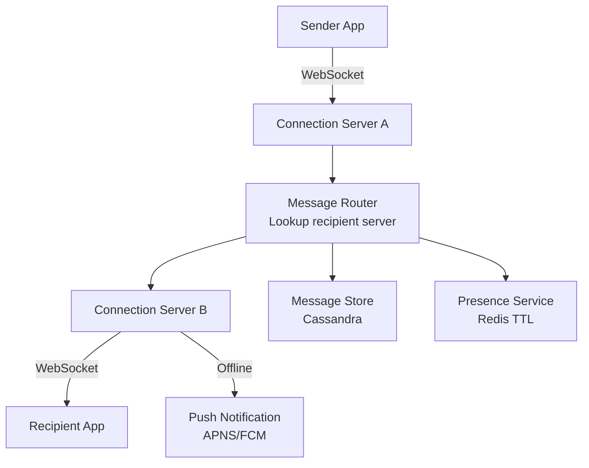

# Design Facebook Messenger — Real-Time Chat at Scale

**Difficulty**: 🔴 Advanced
**Reading Time**: Coming Soon
**Interview Frequency**: Very High

---

> 🚧 **Full article coming soon.** This stub gives you the essentials to start thinking about this problem.

---

## The Core Problem

Delivering messages between 2 billion users with delivery guarantees (sent → delivered → read receipts) and real-time presence (online/offline/typing indicators) requires maintaining persistent connections at massive scale. A single connection server can handle 100,000 WebSocket connections — serving 2B users requires 20,000 such servers.

## Functional Requirements

- 1-on-1 and group messaging (up to 500 members)
- Delivery receipts: sent, delivered, read
- Online presence and typing indicators
- Message history accessible on new devices (multi-device sync)
- Support for media (images, videos, files)

## Non-Functional Requirements

| Requirement | Target |
|-------------|--------|
| Availability | 99.99% (52 min/year) |
| Message delivery latency | p99 < 500ms |
| Message ordering | Consistent within conversation |
| Scale | 2B users, 100B messages/day |

## Back-of-Envelope Estimates

- **Messages per second**: 100B messages/day ÷ 86,400 = ~1.16M messages/sec
- **Connection servers**: 1B active users × 1 WebSocket = 1B connections ÷ 100K per server = 10,000 servers
- **Message storage**: 1.16M msg/sec × 200 bytes = 232MB/sec → ~20TB/day (Cassandra can handle this)

## Key Design Decisions

1. **Connection Layer Separation** — decouple connection management (stateful, WebSocket) from message processing (stateless); connection servers only route messages; message servers handle business logic; enables independent scaling.
2. **Message Storage in Cassandra** — use conversation_id as partition key, message_id (time-based UUID) as clustering key; gives efficient range scans for "last 100 messages in conversation"; Cassandra handles ~1M writes/sec per cluster.
3. **Delivery Receipts via Ack Pipeline** — message flows: sender → server (sent ✓) → recipient connection (delivered ✓✓) → recipient opens app (read ✓✓✓); each state change is a mini-event pushed back to sender.

## High-Level Architecture

## Top Interview Questions for This Problem

| Question | Tests |
|----------|-------|
| How do you route a message to the recipient's specific connection server? | Service discovery, consistent hashing |
| What happens when the recipient is offline when the message arrives? | Offline storage, push notifications |
| How do you maintain message ordering in group chats with concurrent senders? | Vector clocks, server-assigned sequence IDs |

## Related Concepts

- [WhatsApp Messenger architecture comparison](./whatsapp-messenger)
- [Live comment system for similar fan-out patterns](../01-data-processing/live-comment-system)

---

*📚 Full deep-dive with multiple approaches, trade-off tables, and pseudocode coming soon.*
