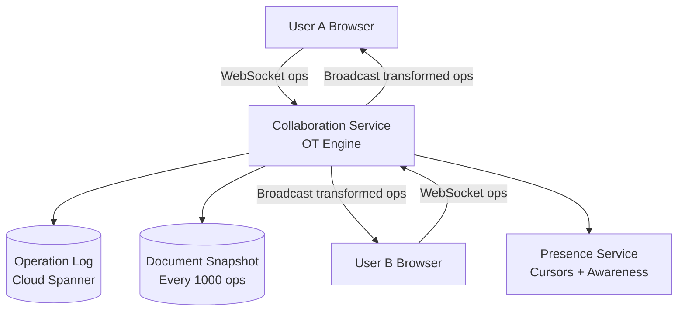

# Design Google Docs — Real-Time Collaborative Editing

**Difficulty**: 🔴 Advanced
**Reading Time**: Coming Soon
**Interview Frequency**: High

---

> 🚧 **Full article coming soon.** This stub gives you the essentials to start thinking about this problem.

---

## The Core Problem

When two users simultaneously edit the same document — User A deletes character at position 5 while User B inserts text at position 4 — naive application of both operations on both clients produces divergent documents. Convergence algorithms (OT or CRDT) must transform operations so all clients reach identical state regardless of network ordering.

## Functional Requirements

- Multiple users can edit the same document simultaneously
- Changes propagate to all viewers in under 100ms
- Full revision history with per-character attribution
- Support 100 simultaneous editors per document
- Offline editing syncs when reconnected

## Non-Functional Requirements

| Requirement | Target |
|-------------|--------|
| Collaboration latency | p99 < 100ms between users on same continent |
| Convergence | All clients reach identical state within 2 seconds |
| Availability | 99.99% (documents accessible even during edit conflicts) |
| Scale | 1B documents, 100M active users |

## Back-of-Envelope Estimates

- **Operations per second**: 1M active editors × 5 keystrokes/sec = 5M ops/sec
- **Operation size**: Each keystroke = ~50 bytes (type, position, char, user_id, doc_version) → 250MB/sec
- **Revision storage**: 100 edits/day/doc × 1B docs × 50 bytes = 5TB/day of operation log

## Key Design Decisions

1. **Operational Transformation (OT)** — Google Docs uses OT: when two concurrent operations O1 and O2 arrive, transform O2' = transform(O2, O1) so applying O1 then O2' produces same result as O2 then O1'; requires central server to serialize operations and distribute transformed versions.
2. **Server as Authoritative Sequencer** — OT requires a central server to assign sequence numbers and perform transformations; this is acceptable because collaborative editing is inherently real-time and offline-first CRDTs trade simplicity for larger state size.
3. **Cursor Tracking via Presence** — broadcast cursor positions as ephemeral state via separate presence channel (not persisted in doc history); use WebSocket with 50ms debounce to avoid flooding with cursor move events.

## High-Level Architecture

## Top Interview Questions for This Problem

| Question | Tests |
|----------|-------|
| What's the difference between Operational Transformation and CRDT? | Algorithm understanding, trade-offs |
| How do you handle a user who edits offline for 2 hours then reconnects? | Operation rebasing, conflict resolution |
| How do you implement undo/redo in a collaborative document? | Operation inversion, per-user undo stacks |

## Related Concepts

- [Collaborative spreadsheet (similar challenges)](../06-storage-files/collaborative-spreadsheet)
- [WebSocket connection management at scale](../03-communication/facebook-messenger)

---

*📚 Full deep-dive with multiple approaches, trade-off tables, and pseudocode coming soon.*

## 📚 Resources & References

| Resource | Type | What You'll Learn |
|----------|------|------------------|
| [ByteByteGo — Design Google Docs](https://www.youtube.com/@ByteByteGo) | 📺 YouTube | Search "Google Docs design" — OT, CRDT, and real-time collaboration |
| [Google Engineering: Operational Transformation](https://drive.googleblog.com/2010/09/whats-different-about-new-google-docs.html) | 📖 Blog | How Google Docs implemented Operational Transformation for concurrent editing |
| [CRDT: Conflict-Free Replicated Data Types](https://crdt.tech/) | 📚 Docs | The data structure powering offline-first collaborative editing (Figma, Notion) |
| [Figma Engineering: CRDTs for Collaborative Design](https://www.figma.com/blog/how-figmas-multiplayer-technology-works/) | 📖 Blog | How Figma implements real-time collaboration using CRDTs |
| [High Scalability: Collaborative Editing Design](http://highscalability.com) | 📖 Blog | Search "collaborative editing" — OT vs CRDT trade-offs at scale |
