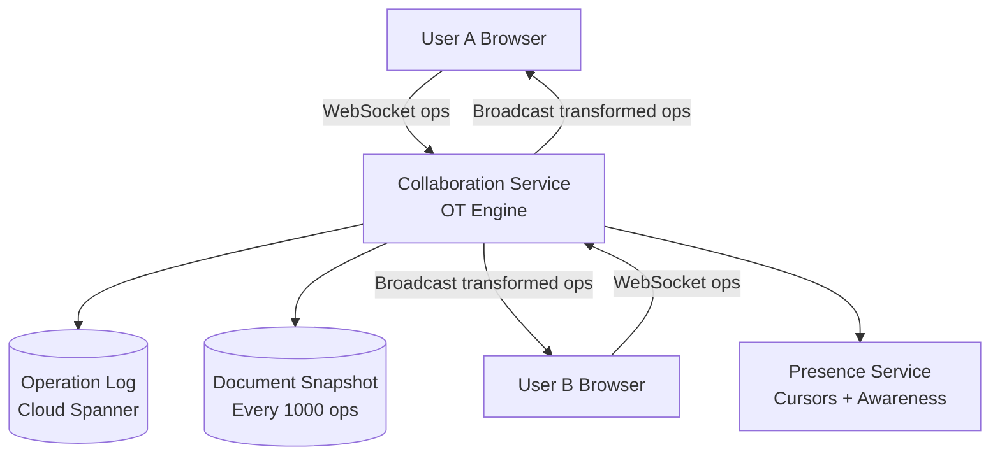
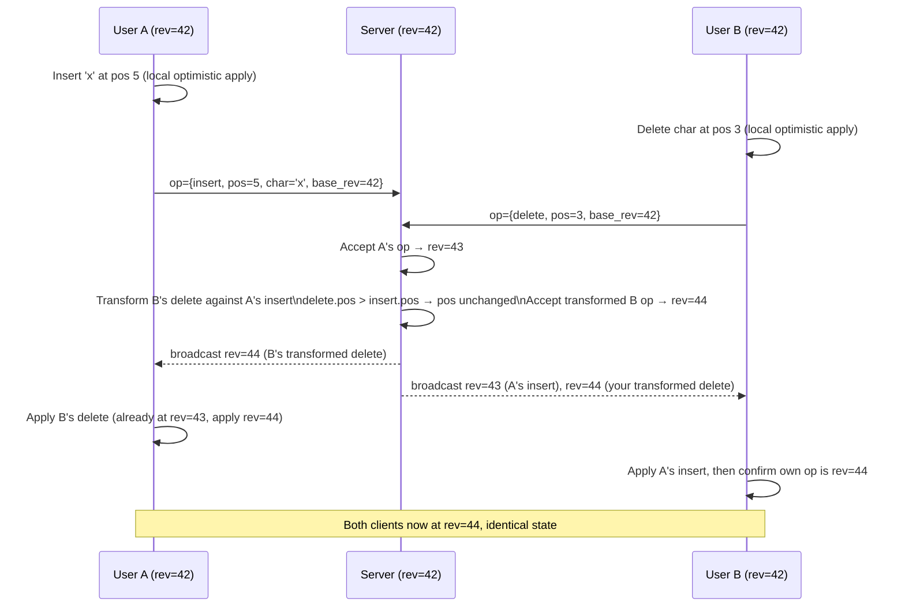
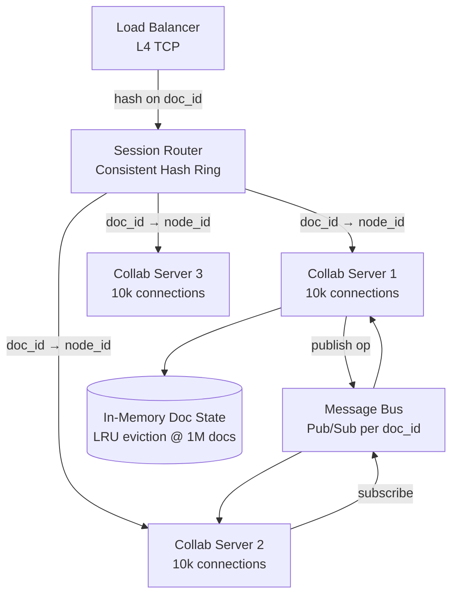

# Design Google Docs — Real-Time Collaborative Editing

**Difficulty**: 🔴 Advanced
**Reading Time**: Coming Soon
**Interview Frequency**: High

---

## The Core Problem

When two users simultaneously edit the same document — User A deletes character at position 5 while User B inserts text at position 4 — naive application of both operations on both clients produces divergent documents. Convergence algorithms (OT or CRDT) must transform operations so all clients reach identical state regardless of network ordering.

## Functional Requirements

- Multiple users can edit the same document simultaneously
- Changes propagate to all viewers in under 100ms
- Full revision history with per-character attribution
- Support 100 simultaneous editors per document
- Offline editing syncs when reconnected

## Non-Functional Requirements

| Requirement | Target |
|-------------|--------|
| Collaboration latency | p99 < 100ms between users on same continent |
| Convergence | All clients reach identical state within 2 seconds |
| Availability | 99.99% (documents accessible even during edit conflicts) |
| Scale | 1B documents, 100M active users |

## Back-of-Envelope Estimates

- **Operations per second**: 1M active editors × 5 keystrokes/sec = 5M ops/sec
- **Operation size**: Each keystroke = ~50 bytes (type, position, char, user_id, doc_version) → 250MB/sec
- **Revision storage**: 100 edits/day/doc × 1B docs × 50 bytes = 5TB/day of operation log

## Key Design Decisions

1. **Operational Transformation (OT)** — Google Docs uses OT: when two concurrent operations O1 and O2 arrive, transform O2' = transform(O2, O1) so applying O1 then O2' produces same result as O2 then O1'; requires central server to serialize operations and distribute transformed versions.
2. **Server as Authoritative Sequencer** — OT requires a central server to assign sequence numbers and perform transformations; this is acceptable because collaborative editing is inherently real-time and offline-first CRDTs trade simplicity for larger state size.
3. **Cursor Tracking via Presence** — broadcast cursor positions as ephemeral state via separate presence channel (not persisted in doc history); use WebSocket with 50ms debounce to avoid flooding with cursor move events.

## High-Level Architecture



## Top Interview Questions for This Problem

| Question | Tests |
|----------|-------|
| What's the difference between Operational Transformation and CRDT? | Algorithm understanding, trade-offs |
| How do you handle a user who edits offline for 2 hours then reconnects? | Operation rebasing, conflict resolution |
| How do you implement undo/redo in a collaborative document? | Operation inversion, per-user undo stacks |

## Related Concepts

- [Collaborative spreadsheet (similar challenges)](../06-storage-files/collaborative-spreadsheet)
- [WebSocket connection management at scale](../03-communication/facebook-messenger)

---

## Component Deep Dive 1: Operational Transformation Engine

The OT engine is the most critical component in Google Docs. It is responsible for taking concurrent operations from different clients and transforming them so every client converges to the same document state — regardless of operation ordering across the network.

### How OT Works Internally

The fundamental problem OT solves: if User A and User B both have a document in state S, and User A sends operation O_A while User B sends operation O_B, then after both operations are applied, every client must be in the same state S'.

The OT approach achieves this by defining a `transform(O_A, O_B)` function that returns O_A' such that `apply(apply(S, O_B), O_A') == apply(apply(S, O_A), O_B)`. This is called the **diamond property** or the **convergence condition**.

Google Docs uses a **server-centric OT** model:

1. Every client maintains a local revision number `rev`.
2. When a user types a character at position P, the client immediately applies the operation locally (optimistic update) and sends `{type: insert, pos: P, char: 'x', base_rev: 42}` to the server.
3. The **server serializes all operations** into a total order using a monotonically increasing global revision counter. This is the critical difference from peer-to-peer OT — the server is the single source of truth for ordering.
4. The server transforms the incoming operation against all server-accepted operations since `base_rev`. If the server is at revision 45 and the client submitted at base revision 42, the server transforms the incoming op against revisions 43, 44, and 45 before accepting it.
5. The transformed operation is appended to the log as revision 46 and broadcast to all connected clients.
6. Clients that are behind replay server revisions and transform their pending local operations against received server ops.

### Why Naive Approaches Fail at Scale

A naive approach — "last write wins" — produces data loss: if A and B both insert at position 5, one insertion is dropped. Simple locking (pessimistic concurrency) serializes all edits through a single lock, producing 2-5 second latency when 10+ users edit concurrently. Even basic "merge on save" (like Google Drive conflict copies) breaks the core collaboration use case because users see divergent state for the duration of the session.

The OT transform function itself has subtle correctness requirements. For text editing, you only need to handle three primitive operations: `insert(pos, char)`, `delete(pos)`, and `retain(pos)`. But for rich text (bold, italic, tables), you need to transform attribute operations, which requires handling 9+ interaction pairs, each with its own transform rule.

### Sequence Diagram: OT Transform Flow



### OT Implementation Approaches

| Approach | Latency | Consistency Guarantee | Trade-off |
|----------|---------|----------------------|-----------|
| Server-centric OT (Google Docs) | p50=20ms, p99=80ms | Strong convergence via total order | Requires persistent WebSocket; server is SPOF for a document |
| Multi-master OT (Jupiter/Wave) | p50=30ms, p99=120ms | Convergence guaranteed only with correct transform function | Complex transform matrix; historically bug-prone |
| CRDT (Logoot/LSEQ) | p50=15ms, p99=50ms | Eventual consistency without central server | 3-10x larger state; tombstones accumulate; GC required |

---

## Component Deep Dive 2: WebSocket Connection Management at Scale

Google Docs uses persistent WebSocket connections to deliver sub-100ms collaboration latency. At 100M DAU with an average session of 30 minutes, the peak concurrent connection count is approximately 10–15M simultaneous WebSockets. Managing this pool of connections is a major operational challenge.

### Internal Mechanics

Each document has a **session router** that maps `doc_id` to a specific collaboration server instance. This sticky routing ensures all editors of a document connect to the same server, which holds the in-memory OT state for that document (pending operations buffer, current revision, connected client list).

The connection lifecycle:

1. **Connect**: Client opens WebSocket, sends `{doc_id, auth_token, last_known_rev}`.
2. **Catch-up**: Server streams all operations since `last_known_rev` (up to 1000 ops). If the client is more than 1000 ops behind, the server sends a full document snapshot instead.
3. **Live collaboration**: Client sends local ops; server broadcasts transformed ops.
4. **Heartbeat**: Every 30 seconds, client sends a ping. If the server doesn't receive a ping for 45 seconds, it removes the client from the presence list and marks the connection stale.
5. **Reconnect**: Client uses exponential backoff (1s, 2s, 4s, max 30s) with jitter. On reconnect, it re-sends any unacknowledged operations from its local pending queue.

### Scale Behavior at 10x Load

At 10x baseline (100M concurrent WebSocket connections), the primary bottleneck shifts from CPU (OT transforms are cheap: ~1µs per operation) to **memory per connection**. Each WebSocket connection holds:
- Send buffer: 64KB
- Pending ack queue: up to 100 buffered ops × 50 bytes = 5KB
- Document session reference: pointer to shared in-memory document state

At 10M connections per server cluster (10,000 connections per node × 1,000 nodes), memory pressure on individual nodes exceeds 80% at peak, triggering OOM kills and cascading failures.

The mitigation is **document-aware load shedding**: when a collaboration server reaches 80% memory, it stops accepting new connections for any new documents (while continuing to serve existing documents). The session router detects this and assigns new document sessions to less-loaded nodes.

### Connection Routing Architecture



---

## Component Deep Dive 3: Operation Log and Snapshot Storage

The operation log is the authoritative, append-only record of every edit ever made to every document. It powers revision history, undo/redo, offline resync, and audit logging.

### Storage Design Decisions

Google uses **Cloud Spanner** for the operation log because it provides:
- External consistency (linearizable transactions across regions)
- Automatic horizontal sharding
- SQL interface for revision range queries (`SELECT * FROM ops WHERE doc_id = X AND rev BETWEEN 1200 AND 1500`)

The operation log grows unboundedly. At 5TB/day of new operations, raw log storage would exceed 1.8PB/year per year of history. Two mitigations:

**Snapshots**: Every 1,000 operations, the collaboration server computes a full document snapshot (current character array + formatting state) and writes it alongside the op log. To reconstruct a document at any revision, the system finds the latest snapshot at or before the target revision, then replays operations from there. This bounds replay time to at most 1,000 op applications.

**Log compaction**: Operations older than 90 days are compacted into a tombstone-compressed binary format. Character-level attribution is preserved but individual keystroke ops are merged into word-level or line-level ops. This reduces storage by 80% while preserving full semantic history.

---

## Data Model

```sql
-- Core document table (sharded by doc_id)
CREATE TABLE documents (
  doc_id        BYTES(16)     NOT NULL,   -- UUIDv4
  owner_user_id BYTES(16)     NOT NULL,
  title         STRING(1024),
  created_at    TIMESTAMP     NOT NULL,
  deleted_at    TIMESTAMP,
  content_type  STRING(32)    DEFAULT 'text/plain',  -- 'text/plain' | 'text/rich'
  PRIMARY KEY (doc_id)
) INTERLEAVE IN PARENT users ON DELETE NO ACTION;

-- Operation log (append-only, sharded by doc_id)
CREATE TABLE document_operations (
  doc_id        BYTES(16)     NOT NULL,
  revision      INT64         NOT NULL,   -- monotonically increasing per doc
  user_id       BYTES(16)     NOT NULL,
  client_id     STRING(64)    NOT NULL,   -- tab-level ID for multi-tab support
  op_type       STRING(16)    NOT NULL,   -- 'insert' | 'delete' | 'format' | 'retain'
  position      INT64         NOT NULL,   -- character offset in doc
  length        INT64,                    -- for delete: # chars deleted; for retain: # chars skipped
  character     STRING(4),               -- for insert: UTF-8 encoded char (up to 4 bytes)
  attributes    JSON,                     -- for format ops: {bold:true, color:'#FF0000'}
  server_ts     TIMESTAMP     NOT NULL,
  client_ts     TIMESTAMP     NOT NULL,   -- client-side timestamp for lag monitoring
  PRIMARY KEY (doc_id, revision)
);

-- Snapshots (checkpoint every 1000 ops)
CREATE TABLE document_snapshots (
  doc_id        BYTES(16)     NOT NULL,
  at_revision   INT64         NOT NULL,
  content       BYTES(MAX)    NOT NULL,   -- serialized document state (proto binary)
  char_count    INT64         NOT NULL,
  snapshot_ts   TIMESTAMP     NOT NULL,
  PRIMARY KEY (doc_id, at_revision DESC)
);

-- Document ACLs
CREATE TABLE document_permissions (
  doc_id        BYTES(16)     NOT NULL,
  user_id       BYTES(16)     NOT NULL,
  permission    STRING(16)    NOT NULL,   -- 'owner' | 'editor' | 'commenter' | 'viewer'
  granted_by    BYTES(16),
  granted_at    TIMESTAMP     NOT NULL,
  PRIMARY KEY (doc_id, user_id)
);

-- Presence (ephemeral, in Redis — not Spanner)
-- HSET presence:{doc_id} {client_id} "{user_id}:{cursor_pos}:{selection_start}:{selection_end}:{color}:{ts}"
-- TTL: 60 seconds, refreshed on each cursor move or heartbeat

-- Indexes
CREATE INDEX ops_by_user ON document_operations (user_id, server_ts DESC);
CREATE INDEX snapshots_lookup ON document_snapshots (doc_id, at_revision);
```

---

## Scale Bottlenecks

| Traffic Level | Component That Breaks | Symptoms | Mitigation |
|---------------|----------------------|----------|------------|
| 10x baseline (50M ops/sec) | Collaboration server CPU | OT transform backlog grows; client latency spikes to 500ms+ p99 | Shard documents across more server nodes; reduce transform fanout |
| 100x baseline (500M ops/sec) | Spanner write throughput | Op log writes queue up; revision assignment delays; convergence SLA breached | Pre-split Spanner tablets; batch micro-operations into macro-ops before commit |
| 1000x baseline (5B ops/sec) | Session Router (consistent hash ring) | Hash ring lookups become a hot path; routing adds 5ms+ to every connection setup | Switch to decentralized document discovery via a distributed hash table (e.g., Chord); cache route assignments in client |
| Any level (hot doc) | Single collab server for viral doc | One doc with 10,000 simultaneous editors saturates one server | Read-only viewer path uses CDN + SSE (no WebSocket); only active editors connect to collab server |

---

## How Figma Built This

Figma chose **CRDTs over OT** for their real-time multiplayer design tool, publishing their architecture in a 2019 engineering blog post. Their key insight: design tools have a fundamentally different access pattern from text editors — objects are moved, resized, and recolored far more often than created or deleted, so the position-based conflicts that plague OT are rare in practice.

**Technology choices:**
- **CRDT flavor**: Fractional indexing (similar to LSEQ) for maintaining z-order of design objects without conflicts. Each object gets a globally unique fractional position in the layer order.
- **Backend**: Node.js server handling ~500,000 simultaneous WebSocket connections at peak in 2019 (pre-acquisition by Adobe).
- **State sync**: Full document state sent on connect (documents are typically 500KB–5MB as JSON), then delta ops streamed via WebSocket.
- **Operation types**: Only ~12 operation types needed vs. 50+ for rich text OT (because Figma objects are discrete, not characters in a stream).

**Non-obvious decision**: Figma does NOT use a persistent operation log. Instead, the current document state is the source of truth, and operations are ephemeral. If a client disconnects and reconnects, it receives a full state snapshot, not a replay of operations. This massively simplifies the storage layer at the cost of revision history — which Figma implements separately as explicit "version saves" rather than implicit operation replay.

**Numbers**: At the time of their blog post, Figma's multiplayer service handled 1.5M operations/minute with p99 latency of 65ms for collaborators in the same region. After the Node.js server was rewritten in C++ (2022), throughput improved 4x while cutting memory usage by 60%.

Source: [Figma Engineering Blog — How Figma's multiplayer technology works](https://www.figma.com/blog/how-figmas-multiplayer-technology-works/)

---

## Interview Angle

**What the interviewer is testing:** Whether you understand the fundamental divergence problem in distributed collaborative systems and can articulate a concrete algorithm (OT or CRDT) that guarantees convergence — not just "we sync changes somehow."

**Common mistakes candidates make:**

1. **Proposing "last write wins" or locks**: This either loses data or serializes all edits to a single bottleneck. Most candidates default to this before being asked to handle concurrent edits.
2. **Conflating OT and CRDT as interchangeable**: OT requires a central server for serialization; CRDTs can work peer-to-peer but accumulate tombstones and require garbage collection. Treating them as drop-in replacements shows you don't understand the operational constraints.
3. **Forgetting the offline sync problem**: The base case (two online users) is tractable. The hard case is a user who edits offline for 2 hours and reconnects with 400 local operations that must be rebased against 600 server-side operations. This requires the client to maintain a full pending operation queue, not just "last saved state."

**The insight that separates good from great answers:** The central observation is that OT requires a **total order** on operations — meaning a central server must assign sequence numbers before any client can apply a remote operation. This is why the collaboration latency SLA (p99 < 100ms) is achievable for same-region users but becomes p99 = 200–400ms for cross-region editing sessions. Great candidates identify that Google Docs' architecture is regionally partitioned — each document's collab server runs in the region closest to the document owner — and cross-region latency is a product constraint, not a design oversight.

---

## Key Numbers to Remember

| Metric | Value | Context |
|--------|-------|---------|
| Collaboration latency target | p99 < 100ms | Same-region users; cross-region is 200–400ms |
| Peak ops/sec at 100M DAU | 5M ops/sec | 1M active editors × 5 keystrokes/sec |
| Operation log write rate | 5TB/day | 100 edits/day/doc × 1B docs × 50 bytes/op |
| Snapshot interval | Every 1,000 ops | Bounds replay to ≤1,000 op applications on reconnect |
| WebSocket connections per node | 10,000 | Memory-bound: ~64KB send buffer + 5KB pending queue per connection |
| Convergence SLA | 2 seconds | All clients reach identical state after a conflict |
| Figma ops/minute (2019) | 1.5M | At 500k simultaneous WebSocket connections |
| Figma p99 collab latency | 65ms | Same-region; after C++ rewrite: ~15ms |
| Log compaction savings | ~80% | After 90-day compaction of keystroke ops into word-level ops |
| Offline resync limit | 1,000 ops before snapshot sent | Beyond this, server sends full doc snapshot instead of op replay |

---

*📚 Full deep-dive with multiple approaches, trade-off tables, and pseudocode coming soon.*

## 📚 Resources & References

| Resource | Type | What You'll Learn |
|----------|------|------------------|
| [ByteByteGo — Design Google Docs](https://www.youtube.com/@ByteByteGo) | 📺 YouTube | Search "Google Docs design" — OT, CRDT, and real-time collaboration |
| [Google Engineering: Operational Transformation](https://drive.googleblog.com/2010/09/whats-different-about-new-google-docs.html) | 📖 Blog | How Google Docs implemented Operational Transformation for concurrent editing |
| [CRDT: Conflict-Free Replicated Data Types](https://crdt.tech/) | 📚 Docs | The data structure powering offline-first collaborative editing (Figma, Notion) |
| [Figma Engineering: CRDTs for Collaborative Design](https://www.figma.com/blog/how-figmas-multiplayer-technology-works/) | 📖 Blog | How Figma implements real-time collaboration using CRDTs |
| [High Scalability: Collaborative Editing Design](http://highscalability.com) | 📖 Blog | Search "collaborative editing" — OT vs CRDT trade-offs at scale |
