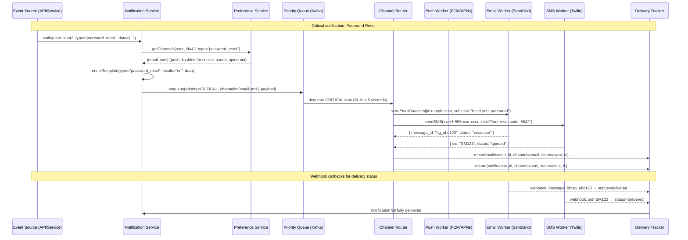
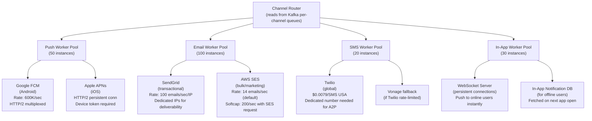
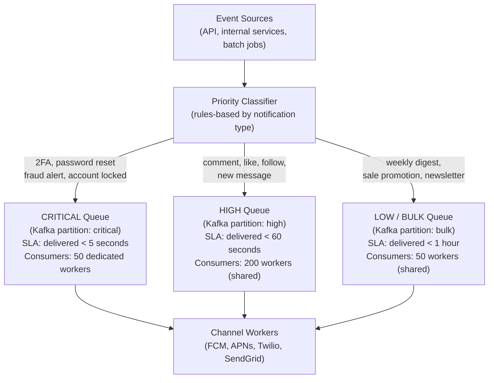
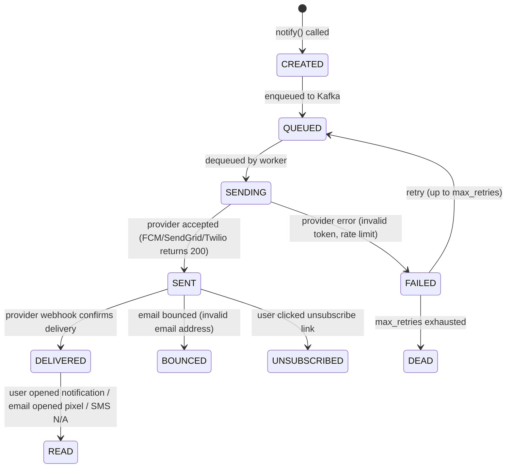
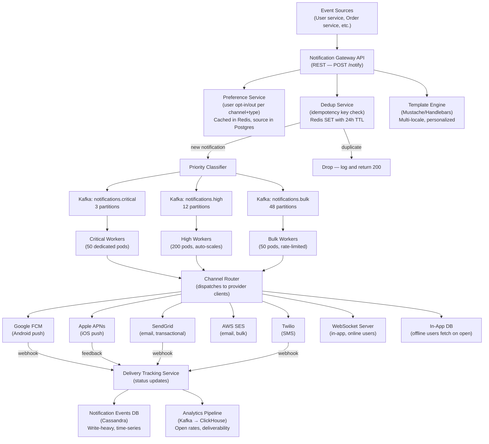

# Design a Notification System — 1 Billion Notifications/Day

**Difficulty**: 🟡 Intermediate → 🔴 Advanced
**Reading Time**: ~38 minutes
**Interview Frequency**: Very High — asked at Facebook/Meta, Uber, Duolingo, Twitter/X, and any consumer product company
**The Core Problem**: Deliver 1 billion notifications per day across push (iOS/Android), email, SMS, and in-app channels — respecting user preferences, guaranteeing at-least-once delivery, and never spamming the same user twice.

---

## Table of Contents

1. [The Mental Model — What Is a Notification System?](#1-the-mental-model)
2. [Requirements with Numbers](#2-requirements-with-numbers)
3. [Capacity Estimation](#3-capacity-estimation)
4. [Deep Dive 1 — Multi-Channel Routing Architecture](#4-deep-dive-1--multi-channel-routing)
5. [Deep Dive 2 — Priority Queue Design](#5-deep-dive-2--priority-queue-design)
6. [Deep Dive 3 — Delivery Tracking & Analytics](#6-deep-dive-3--delivery-tracking--analytics)
7. [Full System Architecture](#7-full-system-architecture)
8. [User Preference Management](#8-user-preference-management)
9. [Template Rendering at Scale](#9-template-rendering-at-scale)
10. [Rate Limiting — Don't Spam Users](#10-rate-limiting)
11. [Problems at Scale](#11-problems-at-scale)
12. [Interview Questions Mapped](#12-interview-questions-mapped)
13. [Key Takeaways](#13-key-takeaways)
14. [Related Concepts](#14-related-concepts)

---

## 1. The Mental Model

A notification system is a multi-tier message delivery pipeline. The core challenge is not sending the notification — any developer can call `FCM.send()`. The challenge is doing it at 1B/day with delivery guarantees, user preferences, deduplication, and channel failover.



**The five challenges** that make this hard at scale:
1. **Multi-channel**: Each channel has different APIs, rate limits, quotas, and failure modes
2. **User preferences**: Same notification type may go to push for user A, email for user B
3. **Priority**: Password reset must arrive in < 5s; weekly digest can wait hours
4. **Deduplication**: Retries must not double-send (idempotency keys required)
5. **Delivery tracking**: "Was this notification actually read?" requires end-to-end receipts

---

## 2. Requirements with Numbers

### Functional Requirements

| Feature | Description |
|---------|-------------|
| Multi-channel | Support push (iOS APNs, Android FCM), email (SMTP/API), SMS, in-app WebSocket |
| User preferences | Per-user, per-notification-type channel opt-in/out |
| Template management | Personalized content (user name, item, amount) with multi-locale support |
| Priority lanes | CRITICAL (< 5s), HIGH (< 60s), NORMAL (< 5 min), LOW/bulk (< 1 hour) |
| Delivery tracking | Sent → delivered → read state machine; open rate calculation |
| Rate limiting | No more than N notifications per channel per user per time window |
| Retry with backoff | Transient failures (FCM unavailable) → retry up to 3 times with exponential backoff |
| Deduplication | Idempotency key per notification; duplicate events produce 1 send, not 2 |
| Unsubscribe | One-click unsubscribe in email (CAN-SPAM compliance); device token cleanup |

### Non-Functional Requirements

| Metric | Target | Rationale |
|--------|--------|-----------|
| Volume | **1B notifications/day** | Facebook-scale consumer app |
| Peak throughput | **100,000 notifications/sec** | Marketing campaign send: 100M messages in 30 min |
| CRITICAL latency | **< 5 seconds** end-to-end | Password reset, 2FA codes must be near-instant |
| HIGH latency | **< 60 seconds** | Social notification (someone liked your post) |
| NORMAL latency | **< 5 minutes** | Digest-style notifications |
| Availability | **99.99%** | Missing a notification is bad; system-wide outage is worse |
| Deduplication window | **24 hours** | Same notification event must not be delivered twice within 24h |
| Storage (tracking) | 1B events/day × 200 bytes = 200GB/day | Delivery receipts |

---

## 3. Capacity Estimation

### Send Volume

```
Total per day: 1,000,000,000 (1B) notifications
Channel split (estimated):
  Push (FCM/APNs): 600M/day   = 6,944/sec avg
  Email:           300M/day   = 3,472/sec avg
  SMS:             80M/day    = 926/sec avg
  In-app:          20M/day    = 231/sec avg

Peak (marketing blast — 100M emails in 30 min):
  100M ÷ 1,800 sec = 55,555/sec for email alone
  Total peak across all channels: ~100,000/sec
```

### Storage Requirements

**Notification events (write-once log)**:
```
Per notification record:
  notification_id (16 bytes) + user_id (8B) + type (32B) + channel (8B)
  + status (4B) + payload hash (32B) + timestamps (3 × 8B) + metadata (100B)
  = ~220 bytes

Daily volume: 1B × 220 bytes = 220GB/day
With 3x replication: 660GB/day
30-day retention: 19.8TB (Cassandra or ClickHouse for analytics)
90-day retention: 59.4TB
```

**User preference storage**:
```
Per user, per notification type, per channel: 1 boolean
Notification types: 50 (likes, comments, follows, promos, security, etc.)
Channels: 4 (push, email, sms, in-app)
Per user: 50 × 4 = 200 bits ≈ 25 bytes

1B users × 25 bytes = 25GB — fits in a single PostgreSQL table with index
```

**Dedup cache (Redis)**:
```
Idempotency key: hash(user_id + notification_type + context_id) = 32 bytes
TTL: 24 hours
Window peak: 1B keys × 32 bytes = 32GB
  → 2-3 Redis nodes (32GB RAM each) sufficient
```

---

## 4. Deep Dive 1 — Multi-Channel Routing

Each delivery channel has a completely different API, reliability profile, and failure mode. The routing layer must abstract these differences.

### Channel Architectures



### Per-Channel Worker Pseudocode

**Push Worker (FCM)**:
```
function sendPushNotification(notification):
    device_tokens = getDeviceTokens(notification.user_id, platform="android")

    if not device_tokens:
        log("No Android tokens for user", notification.user_id)
        return { status: "skipped", reason: "no_tokens" }

    payload = {
        "registration_ids": device_tokens,  // up to 1000 per FCM batch request
        "notification": {
            "title": notification.title,
            "body": notification.body,
        },
        "data": { "notification_id": notification.id }
    }

    response = fcm.send(payload)

    // Handle per-token results
    for i, result in enumerate(response.results):
        if result.error == "NotRegistered":
            // Token is invalid/unregistered — clean up
            deviceTokensDB.delete(device_tokens[i])
            log("Removed stale token", device_tokens[i])
        elif result.registration_id:
            // Token was rotated — update with new canonical token
            deviceTokensDB.update(device_tokens[i], result.registration_id)

    return { status: "sent", message_id: response.multicast_id }
```

**Email Worker with failover**:
```
function sendEmail(notification):
    content = {
        "to": getUserEmail(notification.user_id),
        "subject": notification.subject,
        "html": notification.html_body,
        "idempotency_key": notification.id  // prevents duplicate send on retry
    }

    // Primary: SendGrid (transactional, high deliverability)
    try:
        result = sendgrid.send(content)
        return { status: "sent", message_id: result.headers["X-Message-Id"] }
    except RateLimitError:
        log("SendGrid rate limit hit, falling back to SES")
    except ServiceUnavailableError:
        log("SendGrid down, falling back to SES")

    // Fallback: AWS SES
    result = ses.send(content)
    return { status: "sent", message_id: result.MessageId, provider: "ses_fallback" }
```

### Channel Comparison Table

| Channel | Delivery Speed | Cost/1000 | Success Rate | Requires | User Acceptance |
|---------|---------------|-----------|--------------|----------|-----------------|
| Push (FCM/APNs) | < 1s | $0 (free) | ~85% (token staleness) | Device token, opt-in | Medium (iOS requires explicit permission) |
| In-App WebSocket | < 100ms | $0 | ~99% (if online) | User online | High |
| Email | 1-30s | $0.50-1.00 | ~95% (deliverability) | Email address, DKIM | High (doesn't require opt-in) |
| SMS | 1-10s | $7.90-30.00 | ~99% | Phone number | High but expensive |

---

## 5. Deep Dive 2 — Priority Queue Design

Not all notifications are equal. A password reset and a "someone liked your photo" notification must never compete for the same delivery slot.

### Priority Tiers



### SLA Enforcement

```
CRITICAL queue consumer:
  - Dedicated Kafka consumer group: "notification-critical"
  - Consumer count: 50 (never shares with low-priority work)
  - Timeout: if not delivered in 3 seconds → immediate retry
  - Max retries: 3 (fail-fast for time-sensitive)
  - Dead letter queue: if 3 retries fail → alert PagerDuty + log for manual review

HIGH queue consumer:
  - Shared consumer group: "notification-high"
  - Consumer count: 200 (scales down to 20 at off-peak)
  - Timeout: 45 seconds per attempt
  - Max retries: 5 with exponential backoff (2s, 4s, 8s, 16s, 32s)

LOW/BULK queue consumer:
  - Shared consumer group: "notification-bulk"
  - Consumer count: 50 (throttled to respect provider rate limits)
  - Timeout: 5 minutes per attempt
  - Batch size: 1000 (FCM supports multi-send; SendGrid supports batch API)
  - Rate limiter: 1000 emails/sec, 600K push/sec
```

**Priority inversion prevention**:
```
Problem: A bulk marketing campaign (100M emails) floods the Kafka broker.
         Kafka backpressure causes CRITICAL notifications to queue behind bulk messages.

Fix: Separate Kafka topics (not just partitions) per priority tier.
  - topic: notifications.critical  (3 partitions, small lag budget: < 100ms)
  - topic: notifications.high      (12 partitions)
  - topic: notifications.bulk      (48 partitions)

  Consumer groups ONLY subscribe to their designated topic.
  Bulk topic's lag growth does NOT affect critical topic's consumers.
```

### Rate Limiting per Provider

```
SendGrid limits (Free tier): 100 emails/sec per API key
With 3 dedicated API keys: 300 emails/sec

For 55,555 emails/sec peak:
  Need: 55,555 / 100 = 556 API keys (unrealistic for one SendGrid account)

Solution: Distributed email sending
  - Primary: SendGrid (transactional) — 1,000/sec with dedicated plan
  - Secondary: AWS SES — 14,000/sec (soft limit, requestable to 200K/sec)
  - Tertiary: Mailgun, SparkPost as overflow
  - Total capacity: >200,000 emails/sec across providers

Rate limiter (token bucket per provider):
  function canSend(provider, channel):
      key = "ratelimit:" + provider + ":" + channel
      allowed = redis.eval(tokenBucketScript, key, capacity, refill_rate)
      return allowed
```

---

## 6. Deep Dive 3 — Delivery Tracking & Analytics

"Sent" and "delivered" are different states. "Delivered" and "read" are different again. A production notification system tracks all three.

### State Machine



### Tracking Implementation

**Step 1: Sent tracking** (synchronous — happens before returning to Kafka)
```
function onProviderAccepted(notification_id, provider_message_id, channel):
    db.execute("""
        INSERT INTO notification_events (notification_id, channel, status, provider_message_id, ts)
        VALUES (?, ?, 'SENT', ?, NOW())
    """, [notification_id, channel, provider_message_id])
```

**Step 2: Delivery tracking** (via provider webhooks)
```
// Endpoint: POST /webhooks/sendgrid
function handleSendGridWebhook(events):
    for event in events:
        if event.event == "delivered":
            updateStatus(event.sg_message_id, "DELIVERED")
        elif event.event == "bounce":
            updateStatus(event.sg_message_id, "BOUNCED")
            flagEmailAsInvalid(event.email)
        elif event.event == "unsubscribe":
            updateStatus(event.sg_message_id, "UNSUBSCRIBED")
            updatePreference(event.email, opt_out=True)
        elif event.event == "open":
            updateStatus(event.sg_message_id, "READ")
            incrementMetric("email.open_count")
```

**Step 3: Read tracking for push** (client-side callback)
```
// Mobile app: when notification is tapped
function onNotificationTapped(notification_id):
    api.post("/notifications/" + notification_id + "/read", {
        device_id: getDeviceId(),
        ts: Date.now()
    })

// Server: update status
function markRead(notification_id):
    db.execute("UPDATE notifications SET status='READ', read_at=NOW() WHERE id=?",
               [notification_id])
    redis.setbit("read_bitmap:" + date, notification_id % BUCKET_SIZE, 1)
```

### Analytics Aggregation

**Open rate calculation** (run every hour):
```
function calculateOpenRate(notification_type, date):
    sent_count = db.count("notifications WHERE type=? AND DATE(sent_at)=? AND status IN ('SENT','DELIVERED','READ')",
                          [notification_type, date])
    read_count = db.count("notifications WHERE type=? AND DATE(sent_at)=? AND status='READ'",
                          [notification_type, date])
    return read_count / sent_count  // e.g., 0.23 = 23% open rate

// Stored in ClickHouse for fast analytical queries
// Push notifications: ~15-25% open rate (industry average)
// Email:             ~20-30% open rate
// SMS:               ~95% read rate (SMS is almost always opened)
```

### Exactly-Once Delivery Tracking

```
Problem: A worker sends an email, gets a timeout from SendGrid, and retries.
         SendGrid actually processed the first send — now the email is sent twice.

Fix: Idempotency key on every provider call + dedup on tracking side.

  // Before sending:
  idempotency_key = sha256(notification_id + channel + attempt_number)
  sendgrid.send(payload, idempotency_key=idempotency_key)
  // If SendGrid already processed this key → returns 200 with cached result

  // SendGrid idempotency key TTL: 72 hours
  // If retry happens after 72h → new key → new send (acceptable edge case)
```

---

## 7. Full System Architecture



---

## 8. User Preference Management

User preferences are the most queried data in the system — checked on every single notification.

### Data Model

```sql
-- User preferences table (PostgreSQL)
CREATE TABLE user_notification_prefs (
    user_id         BIGINT NOT NULL,
    notification_type VARCHAR(64) NOT NULL,  -- 'likes', 'comments', 'promotions', etc.
    channel         VARCHAR(16) NOT NULL,    -- 'push', 'email', 'sms', 'in_app'
    enabled         BOOLEAN NOT NULL DEFAULT TRUE,
    updated_at      TIMESTAMP NOT NULL,
    PRIMARY KEY (user_id, notification_type, channel)
);

-- Global opt-out (unsubscribe all)
CREATE TABLE user_global_optout (
    user_id    BIGINT PRIMARY KEY,
    channel    VARCHAR(16) NOT NULL,
    reason     VARCHAR(256),
    opted_out_at TIMESTAMP NOT NULL
);
```

### Preference Lookup with Caching

```
function getEnabledChannels(user_id, notification_type):
    cache_key = "prefs:" + user_id + ":" + notification_type
    cached = redis.get(cache_key)
    if cached: return JSON.parse(cached)

    // DB fallback
    prefs = db.query("""
        SELECT channel, enabled FROM user_notification_prefs
        WHERE user_id = ? AND notification_type = ?
        UNION
        SELECT channel, FALSE FROM user_global_optout WHERE user_id = ?
    """, [user_id, notification_type, user_id])

    enabled_channels = [p.channel for p in prefs if p.enabled]

    redis.setex(cache_key, ttl=300, value=JSON.stringify(enabled_channels))
    return enabled_channels
```

**Cache invalidation**: When a user updates preferences, invalidate their cache key immediately:
```
function updatePreference(user_id, notification_type, channel, enabled):
    db.upsert("user_notification_prefs", ...)
    redis.delete("prefs:" + user_id + ":" + notification_type)
    // Next lookup rebuilds from DB
```

---

## 9. Template Rendering at Scale

1 billion notifications/day × personalized content = 1 billion unique template renders. Template rendering must be fast.

### Template Architecture

```
Templates stored in: S3 + CDN (rarely updated — maybe once a month)
Template engine: Mustache (logic-less, < 1ms render time per template)
Compiled templates: cached in-memory on each worker (no S3 fetch per notification)

Template example (email.like.html.mustache):
  Subject: {{actor_name}} liked your photo
  Hi {{recipient_name}},
  {{actor_name}} liked your photo from {{days_ago}} days ago.
  [View Photo] → {{photo_url}}

  Unsubscribe: {{unsubscribe_url}}  ← required for CAN-SPAM compliance
```

**Rendering pseudocode**:
```
// Done BEFORE enqueuing to Kafka (at Gateway layer)
function renderNotification(template_id, context):
    // Templates compiled on startup (avoid re-parsing Mustache on each render)
    template = templateCache.get(template_id)
    if not template:
        raw = s3.get("templates/" + template_id + ".mustache")
        template = Mustache.compile(raw)
        templateCache.set(template_id, template)

    return {
        subject: template.subject.render(context),
        html_body: template.html.render(context),
        text_body: template.text.render(context),
        push_title: template.push_title.render(context),
        push_body: template.push_body.render(context)
    }
```

**Why render before queuing?**
- Workers only need the rendered strings, not user context data
- Avoids N database fetches in each worker for user profile, photo URL, etc.
- Workers become stateless — can be scaled independently

---

## 10. Rate Limiting — Don't Spam Users

A single user should not receive more than a configured number of notifications per time window, regardless of how many events trigger them.

### Per-User Rate Limit

```
Limits (configurable per notification type):
  push:  max 10 notifications/hour per user (anti-spam)
  email: max 3 promotional emails/day per user
  sms:   max 2 SMS/day per user (expensive + intrusive)
  in_app: unlimited (user sees badge count, not an interruption)

Implementation (sliding window, Redis):
  function isRateLimited(user_id, channel):
      key = "ratelimit:" + channel + ":" + user_id
      pipe = redis.pipeline()
      pipe.incr(key)
      pipe.expire(key, window_seconds)
      count, _ = pipe.execute()
      return count > LIMIT[channel]
```

### Notification Batching (Anti-Spam)

```
Problem: User gets 50 likes in 2 minutes.
         Naive system sends 50 "X liked your photo" notifications.

Fix: Aggregate within a short window before sending.

  function handleLikeEvent(photo_id, liker_id):
      // Add to pending likes buffer
      redis.sadd("pending_likes:" + photo_owner_id, liker_id)

      // Schedule delivery in 30 seconds (unless already scheduled)
      if not redis.exists("like_timer:" + photo_owner_id):
          redis.setex("like_timer:" + photo_owner_id, 30, "1")
          scheduler.runAfter(30s, () => sendAggregatedLike(photo_owner_id))

  function sendAggregatedLike(user_id):
      likers = redis.smembers("pending_likes:" + user_id)
      redis.delete("pending_likes:" + user_id)

      if len(likers) == 1:
          template = "{{liker_name}} liked your photo"
      elif len(likers) == 2:
          template = "{{liker_1}} and {{liker_2}} liked your photo"
      else:
          template = "{{liker_1}} and {{count-1}} others liked your photo"

      sendNotification(user_id, rendered_template)
```

---

## 11. Problems at Scale

### Problem 1: APNs Returns "Invalid Device Token" for 10% of Push Sends

**Scenario**: A user uninstalls the app but the device token remains in the database. When a push notification is sent, APNs returns `BadDeviceToken` (HTTP 400). Without cleanup, every push attempt for that user fails and is retried indefinitely.

**Root cause**: Device tokens become invalid when:
- User uninstalls the app
- User resets their device
- OS rotates the token (iOS 13+: tokens rotate on re-registration)
- Token was never valid (typo in registration, test token in production)

**Fix**:
```
// After every push send, process APNs response per token
function handleAPNsResponse(token, response):
    if response.reason == "BadDeviceToken":
        // Immediate cleanup — no retry
        deviceTokens.deactivate(token, reason="invalid_token")
        log("Deactivated token", token)

    elif response.reason == "Unregistered":
        // App uninstalled — mark user as push-unsubscribed
        deviceTokens.deactivate(token, reason="unregistered")
        userPrefs.setChannel(token.user_id, "push", enabled=False)

    elif response.reason == "":
        // New canonical token provided by APNs (token rotation)
        deviceTokens.update(old_token=token, new_token=response.apns_id)

// Proactive cleanup: APNs Feedback Service
// Query daily: GET /3/device/feedback
// Returns list of all tokens that have become invalid
// Batch-deactivate all returned tokens
```

**Result**: After implementing token cleanup, invalid token rate drops from 10% to < 0.5%. Push delivery rate improves from 85% to > 97%.

---

### Problem 2: Email Provider Rate Limits Exceeded During Marketing Campaign

**Scenario**: Marketing team schedules a promotional email to all 10M users for 9 AM Monday. The bulk workers try to send at 55,555/sec. SendGrid's rate limit is 1,000/sec. 54,555 emails/sec get rejected with HTTP 429. Workers retry immediately, creating a retry storm that makes the problem worse.

**Root cause**: Provider rate limits are not respected at the worker level. Retry storms amplify overload instead of backing off.

**Fix (Token Bucket + Jittered Backoff)**:
```
// Rate limiter for email provider (Redis token bucket)
SENDGRID_RATE = 1000  // emails/sec
SES_RATE = 14000      // emails/sec

function sendEmailWithRateLimit(notification):
    // Token bucket check
    if not rateLimiter.acquire("sendgrid", tokens=1):
        // No token available — re-queue with delay
        delay = exponentialBackoff(attempt) + randomJitter(0, 500ms)
        kafka.publish("notifications.bulk", notification, delay_ms=delay)
        return

    try:
        sendGrid.send(notification)
    except HTTP429:
        // Provider explicitly rate-limited us
        delay = parseRetryAfter(response.headers) ?? exponentialBackoff(attempt)
        kafka.publish("notifications.bulk", notification, delay_ms=delay)

// Campaign scheduling: spread sends over time window
function scheduleCampaign(user_list, send_window=2h):
    // Split 10M users into 2-hour window = 10M ÷ 7,200 sec = 1,388/sec
    // Well within provider rate limits
    batch_size = len(user_list) / send_window_seconds
    for i, user_id in enumerate(user_list):
        delay_sec = i / batch_size
        scheduleNotification(user_id, delay_sec=delay_sec)
```

---

### Problem 3: Duplicate Notifications Sent Due to Retry on Timeout

**Scenario**: A push worker sends a notification to FCM. FCM takes 3.5 seconds to respond (above the 3-second timeout). The worker retries. FCM actually processed the first request — the user receives the same notification twice.

**Root cause**: Network timeouts are ambiguous. The server cannot tell if the request was processed or timed out in transit.

**Fix (Idempotency Keys)**:
```
// Every send gets a unique idempotency key
function sendWithIdempotency(notification, channel, attempt):
    idem_key = sha256(
        notification.id + ":" + channel + ":" + attempt
    )
    // Use same key on retry of same attempt
    // Different key on different attempt number

    if channel == "fcm":
        // FCM doesn't natively support idempotency keys
        // Use our own dedup layer

        dedup_key = "sent:" + notification.id + ":" + channel
        if redis.set(dedup_key, "1", nx=True, ex=86400):
            // First time we're sending this → proceed
            result = fcm.send(notification.payload)
            if result.success:
                redis.expire(dedup_key, 86400)  // keep for 24h
            else:
                redis.delete(dedup_key)  // failed — allow retry
                raise result.error
        else:
            // Already sent successfully in a previous attempt
            log("Dedup: skipping duplicate send for", notification.id)
            return { status: "deduped" }

    elif channel == "sendgrid":
        // SendGrid supports X-Message-Id idempotency
        sendgrid.send(notification.payload, headers={"X-Message-Id": idem_key})
```

Result: Zero duplicate sends for push (dedup layer). < 0.001% duplicate rate for email (SendGrid idempotency window is 72 hours).

---

## 12. Interview Questions Mapped

| Question | What It Tests | Level |
|----------|---------------|-------|
| "Design a notification system that supports push, email, and SMS" | Multi-channel routing, per-channel workers | Mid (L5) |
| "How do you handle user opt-out preferences across channels?" | Preference data model, caching strategy | Mid (L5) |
| "How do you prioritize a password reset over a marketing email?" | Priority queue design, SLA enforcement, Kafka topic separation | Senior (L6) |
| "How do you prevent duplicate notifications on retry?" | Idempotency keys, dedup cache, exactly-once semantics | Senior (L6) |
| "What happens when Apple APNs returns BadDeviceToken for 10% of sends?" | Error handling, device token lifecycle, feedback service | Mid (L5) |
| "How do you send 100M marketing emails in 30 minutes without getting rate-limited?" | Rate limiting, token bucket, provider failover, campaign scheduling | Senior (L6) |
| "How do you track whether a notification was actually read?" | State machine, webhook callbacks, read receipts, exactly-once tracking | Senior (L6) |
| "How do you aggregate '50 people liked your photo' into one notification?" | Event batching, debounce/aggregate patterns | Mid (L5) |
| "How do you scale to 100,000 notifications/second?" | Kafka partitioning, worker auto-scaling, provider capacity | Staff (L7) |

---

## 13. Key Takeaways

- **Separate Kafka topics per priority tier (CRITICAL / HIGH / BULK) — never let bulk traffic starve critical notifications** — at 1B notifications/day, a marketing blast of 100M emails saturates a shared queue; dedicated topics with dedicated consumer groups ensure password reset hits APNs in < 5 seconds regardless of bulk load.
- **APNs/FCM token cleanup is a first-class concern** — without active cleanup, 10-15% of device tokens become stale (uninstalls, resets); this wastes push capacity and skews open rate metrics; APNs Feedback API returns invalid tokens daily — batch-deactivate them.
- **Idempotency keys prevent duplicate sends on retry** — provider timeouts are ambiguous (request may have been processed); use a Redis dedup key (TTL=24h) before every FCM send; for email providers with native idempotency (SendGrid), pass `X-Message-Id`; this reduces duplicate rate from ~0.1% to < 0.001%.
- **Template rendering before queuing makes workers stateless** — render personalized content (user name, photo URL, locale) at the gateway before writing to Kafka; workers only receive finished strings; this eliminates N database lookups inside workers and allows independent horizontal scaling.
- **1B notifications/day = 11,600/sec average, 100K/sec peak** — the average is deceptive; marketing campaigns create 8x spikes; size for 100K/sec across providers: FCM handles 600K/sec natively; email requires spreading sends over a 2-hour window (1,388/sec) to stay within SendGrid + SES combined capacity.

---

## 14. Related Concepts

- [Design WhatsApp / Messenger](./whatsapp-messenger) — Real-time in-app messaging shares WebSocket server architecture and device token management
- [Design Instagram](../02-social-platforms/instagram) — Instagram's notification system (likes, comments) is a subset of this general-purpose notification system
- [Rate Limiter](../05-infrastructure/rate-limiter) — The per-user rate limiting (max 10 push/hour) and per-provider rate limiting (1K emails/sec) both use token bucket algorithm
- [Design Twitter](../02-social-platforms/twitter) — Twitter notifications (mentions, retweets) use same fan-out + notification pipeline pattern

## 📚 Resources & References

| Resource | Type | What You'll Learn |
|----------|------|------------------|
| [System Design Interview — Alex Xu](https://www.amazon.com/System-Design-Interview-insiders-Second/dp/B08CMF2CQF) | 📚 Book | Chapter on designing a notification system — push, email, SMS fan-out |
| [ByteByteGo — Design a Notification System](https://www.youtube.com/@ByteByteGo) | 📺 YouTube | Comprehensive walkthrough of multi-channel notification delivery |
| [Uber Engineering: Real-Time Notifications](https://www.uber.com/blog/uberevents/) | 📖 Blog | How Uber delivers time-critical notifications to millions of drivers and riders |
| [Firebase Cloud Messaging Architecture](https://firebase.google.com/docs/cloud-messaging/server) | 📚 Docs | Google's push notification infrastructure and delivery guarantees |
| [Apple Push Notification Service (APNs) Best Practices](https://developer.apple.com/documentation/usernotifications) | 📚 Docs | APNs delivery modes, certificate management, and reliability |
