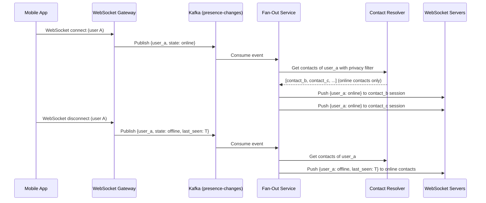
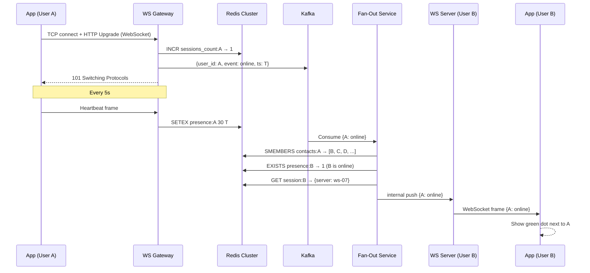

# Design an Online Presence Indicator System

**Difficulty**: 🟢 Easy | **Codemania #79**
**Reading Time**: ~8 min
**Interview Frequency**: High

---

## The Core Problem

Showing "online/offline/last seen at 3:42 PM" status for 1 billion users in a messaging app, with less than 10 seconds of staleness — all without the presence system becoming a bottleneck for messaging. The challenges: 1B heartbeats every 5 seconds = 200M events/sec, respecting privacy settings, and efficient fan-out to all of a user's contacts.

---

## Functional Requirements

- Show whether a contact is currently online (active in last 30 seconds)
- Show "last seen" timestamp when the user was last active
- Privacy settings: hide presence from specific users, or show to "nobody"
- Push presence updates to contacts within 10 seconds of status change
- Support for mobile apps (background → foreground state changes)

## Non-Functional Requirements

| Requirement | Target |
|-------------|--------|
| Users | 1B registered users; 200M daily active |
| Online users at peak | 100M concurrent online users |
| Heartbeat frequency | Every 5 seconds from active clients |
| Staleness | User shown as online until 30 seconds after last heartbeat |
| Update latency | Contacts notified within 10 seconds of status change |
| Privacy filtering | O(1) per-user privacy check before publishing |

---

## Back-of-Envelope Estimates

- **Heartbeat rate**: 100M online users × 1 heartbeat/5s = 20M heartbeats/sec
- **Redis writes**: 20M `SET key EX 30` operations/sec — Redis can handle ~1M writes/sec per instance; need ~20 Redis shards
- **Fan-out**: Each user has avg 200 contacts; 100M users × 200 contacts = 20B potential presence pushes/sec (too much — use pull-on-open instead)
- **Presence change events**: Online→Offline transitions = ~1M/hour (much fewer than heartbeats — only delta changes need to be broadcast)

---

## High-Level Architecture

```mermaid
graph TD
    Client[Mobile App\nActive in foreground] -->|Heartbeat every 5s| PresenceAPI[Presence API Gateway]
    PresenceAPI --> Redis[Redis Cluster\nuser:{uid}:presence → timestamp, TTL 30s]
    PresenceAPI --> Kafka[Kafka\nPresence change events]
    Kafka --> FanOut[Fan-Out Service\nBroadcast to contacts via WebSocket]
    FanOut --> ContactList[Contact Resolver\nGet friends list with privacy filter]
    ContactList --> WSServers[WebSocket Servers\nPush status to online contacts]
    WSServers --> ContactApp[Contact's App\nShow "Online" indicator]

    PresenceReader[Presence Query API] --> Redis
    PresenceReader --> PrivacyFilter[Privacy Filter\nHide presence per user settings]
```

---

## Key Design Decisions

### 1. Heartbeat Approach with Redis TTL

The simplest and most scalable approach:

```python
# Client sends heartbeat every 5 seconds
# Server:
def handle_heartbeat(user_id):
    redis.setex(
        key=f"presence:{user_id}",
        value=int(time.time()),  # last seen timestamp
        time=30  # TTL: 30 seconds
    )
```

- When key exists: user is **online** (active in last 30 seconds)
- When key expires (no heartbeat for 30s): user is **offline**
- Value = Unix timestamp of last heartbeat = "last seen" time

Redis TTL handles offline detection automatically — no background job needed.

### 2. Heartbeat Interval vs Staleness Trade-off

| Heartbeat Interval | Staleness | Server Load |
|--------------------|-----------|-------------|
| 1 second | 1 second | 100M requests/sec — too high |
| 5 seconds | 5 seconds | 20M requests/sec — manageable |
| 30 seconds | 30 seconds | 3.3M requests/sec — low |
| 60 seconds | 60 seconds | 1.7M requests/sec — very low |

WhatsApp uses ~30 seconds staleness tolerance; Signal uses ~10 seconds. Decision depends on UX requirements. **Decision**: 5-second heartbeat with 30-second TTL. Provides acceptable staleness for messaging apps while keeping load manageable with Redis sharding.

### 3. Push vs Pull for Presence Updates

**Pull (on contact list open)**:
- App opens chat → request presence for all 200 contacts → Redis multi-GET → display statuses
- Load spikes when users open chat (thundering herd)
- Contacts' statuses may become stale during extended chat session

**Push (server broadcasts changes)**:
- When user comes online/offline → send Kafka event → fan-out to all contacts via WebSocket
- Problem: 100M users × 200 contacts × online/offline transitions = massive fan-out
- But: online/offline transitions are rare (not every heartbeat creates a transition)

**Hybrid (Decision)**:
- **On open**: Pull presence for all contacts (fresh snapshot)
- **While open**: Subscribe to push updates for active contacts via WebSocket
- Only broadcast **transitions** (online → offline and vice versa), not every heartbeat

### 4. Detecting Online → Offline Transition

When heartbeats stop, the Redis TTL expires silently. How does the fan-out service know to broadcast "offline" to contacts?

**Option A: TTL expiry event** — Redis keyspace notifications (`notify-keyspace-events = Ex`). When key expires, Redis publishes an event to a channel. Fan-out service subscribes and broadcasts "offline" to contacts.

**Option B: WebSocket disconnect** — If user disconnects WebSocket, treat as offline immediately. Heartbeats maintain the "online" state while connected.

**Decision**: Option B (WebSocket disconnect) is faster and more reliable. WebSocket disconnect is deterministic; Redis TTL expiry notification may have a few seconds of delay.

### 5. Privacy Settings

```python
def get_presence(requester_id, target_user_id):
    # Check privacy settings
    privacy = get_privacy_setting(target_user_id)  # cached
    if privacy == "nobody":
        return {"status": "hidden"}
    if privacy == "contacts_only":
        if not are_contacts(requester_id, target_user_id):
            return {"status": "hidden"}
    if privacy == "blocked_users":
        if is_blocked(target_user_id, requester_id):  # target blocked requester
            return {"status": "hidden"}

    # Return actual presence
    ts = redis.get(f"presence:{target_user_id}")
    if ts:
        return {"status": "online"}
    return {"status": "offline", "last_seen": get_last_seen(target_user_id)}
```

Privacy filtering happens at query time, not fan-out time. This avoids complex fan-out filtering logic.

---

## Handling Mobile Background State

Mobile apps can't send heartbeats when in the background. Options:
1. **Silent push notifications**: Server sends silent push every 5 minutes; app wakes to send heartbeat. Battery-draining.
2. **Background fetch**: OS periodically wakes app (iOS Background Fetch, Android WorkManager). Less reliable.
3. **Accept offline status**: Show as "offline" while in background. Most messaging apps do this (WhatsApp goes offline when app is backgrounded on iOS).

**Decision**: Accept offline when backgrounded. Show "last seen" instead. This is the correct UX for messaging apps.

---

## Top Interview Questions for This Problem

| Question | Tests |
|----------|-------|
| How do you handle 100M heartbeats/sec to Redis without it becoming a bottleneck? | Redis sharding by user_id, pipeline heartbeats, cluster mode |
| How do you detect offline when the user just closes their app? | WebSocket close event, TCP FIN, heartbeat timeout |
| Why not use a database for presence? | Too slow for 20M writes/sec; Redis TTL is the right tool |
| How do you respect privacy — show online to some contacts but not others? | Privacy filter at query time (not fan-out), O(1) check per request |

---

## Common Mistakes

1. **Broadcasting every heartbeat to all contacts**: 20M heartbeats/sec × 200 contacts = 4B events/sec. Only broadcast transitions (online/offline changes), not heartbeats.
2. **Using long-polling for presence updates**: Polling every 30s from 100M concurrent users = 3.3M requests/sec just for presence. WebSocket push is far more efficient.
3. **No TTL on presence keys**: Without TTL, offline users remain "online" forever if their app crashes without proper logout.

---

## Privacy Model Summary

Three settings cover the full space of user expectations:

| Setting | Who Sees Presence | Implementation |
|---------|-------------------|----------------|
| `everyone` | All users | No filter; return raw Redis value |
| `contacts_only` | Only mutual contacts | Check `contacts:{user_id}` set membership before returning |
| `nobody` | No one | Always return `{status: hidden}` regardless of Redis state |

A fourth implicit setting — **blocked users** — overrides `everyone` and `contacts_only`: if target has blocked requester, return `{status: hidden}`. Blocking is checked last (after mode check) to avoid leaking whether a block exists. All privacy lookups are read-through cached (`privacy:{user_id}` in Redis, TTL 600s) to keep O(1) per query without hitting PostgreSQL.

---

## Related Concepts

- [Caching Fundamentals](../../02-caching/concepts/caching-fundamentals) — Redis TTL pattern for ephemeral state
- [Message Queue Basics](../../04-messaging/concepts/message-queue-basics) — Kafka for presence change event fan-out

---

---

## Component Deep Dive 1: Redis Presence Store

The Redis presence store is the core of any heartbeat-based presence system. Every heartbeat from every active user writes a key with a TTL, and reads check for key existence. At 100M concurrent users sending a heartbeat every 5 seconds, this is 20M writes/sec sustained — a non-trivial Redis workload.

### How It Works Internally

Each user maps to one Redis key: `presence:{user_id}`. On heartbeat, the server calls `SETEX presence:{uid} 30 {unix_timestamp}`. The value is the last-seen Unix timestamp; the TTL is 30 seconds. If the key exists, the user is online; the value gives the "last seen" time. If the key is absent (expired or never set), the user is offline.

Redis TTL expiry is handled by a background thread inside Redis. The server does not need a separate "offline detector" job; the data expires on its own. This is the architectural elegance of this design — offline detection is implicit.

### Why Naive Approaches Fail at Scale

A single Redis instance handles ~1M writes/sec for simple SET operations. At 20M writes/sec you need 20+ shards. The naive mistake is treating Redis as a single node. Worse, some teams reach for a relational database (PostgreSQL, MySQL) which tops out at ~100k–200k writes/sec with indexed updates — that is 100x too slow.

Another failure: using `HSET presence user_id timestamp` on a single hash. This concentrates all writes on one key, creating a hot-key bottleneck — all 20M writes/sec hit the same Redis key, which is serialized.

### Redis Cluster Sharding Strategy

```mermaid
graph TD
    HB[Heartbeat Request\npresence:{user_id}] --> Hash[CRC16 hash\nof user_id]
    Hash --> Slot[Hash slot 0-16383]
    Slot --> S0[Shard 0\nslots 0-819\n~1M users]
    Slot --> S1[Shard 1\nslots 820-1638\n~1M users]
    Slot --> SN[Shard N\nslots ...-16383\n~1M users]

    S0 --> R0[Redis Primary]
    S0 --> RR0[Redis Replica\nread fallback]
    S1 --> R1[Redis Primary]
    S1 --> RR1[Redis Replica]

    PresenceRead[Presence Query\nread from replica OK] --> RR0
    PresenceRead --> RR1
```

Redis Cluster uses CRC16(key) mod 16384 to assign each key to one of 16,384 hash slots, distributed across shards. With 20 shards each shard holds ~820 slots and handles ~1M writes/sec — within the safe operating range.

### Implementation Options Comparison

| Approach | Writes/sec per node | Offline detection | Complexity | Trade-off |
|----------|--------------------|--------------------|------------|-----------|
| Redis Cluster (TTL per key) | 1M | Automatic via TTL expiry | Low | Hot-slot risk if poorly sharded |
| Redis Hash per shard bucket | 500k (hash field sets are slower) | Manual background scan | Medium | Bulk reads are faster; writes slower |
| Cassandra (time-series) | 200k | Background job every 30s | High | Persistent audit log; 10x cost |
| In-memory (single server) | 10M | Timer wheel | Very Low | No HA; not viable at scale |

**Decision**: Redis Cluster with one key per user and TTL. Simple, fast, self-managing offline detection, horizontally scalable.

---

## Component Deep Dive 2: Presence Change Fan-Out

Fan-out is the hardest sub-problem. When user A goes online, every one of A's contacts who is currently active needs to see the green dot update within 10 seconds. At 100M online users with avg 200 contacts, the theoretical fan-out ceiling is 100M × 200 = 20B push events/sec — clearly impossible. The solution is to narrow the fan-out dramatically.

### Narrowing the Fan-Out

Only two types of events need to be broadcast:
1. **Online transition** — user was offline, now sends a heartbeat
2. **Offline transition** — user's WebSocket disconnects or TTL expires

Neither of these is the heartbeat itself. The heartbeat is a write-only operation; it only becomes a fan-out event if it represents a state change. At steady state, the online/offline transition rate is much lower than the heartbeat rate — roughly 1M transitions/hour (users opening/closing the app), not 20M/sec.

Additionally, only contacts who are **currently online** need to receive the push. If contact B is offline, they will pull presence fresh when they next open the app. This reduces the effective fan-out target by the online ratio (~10% of registered users are online at peak), shrinking 200 contacts to ~20 relevant push targets per transition event.

### Fan-Out Sequence



### Scale Behavior at 10x Load

At 10x baseline (1B online users, 2B total), fan-out becomes the bottleneck if contact lists grow. The mitigation is contact list sharding: the Contact Resolver caches contacts in Redis with a `contacts:{user_id}` sorted set. At 10x load, the Fan-Out Service scales horizontally by partitioning Kafka topics by user_id — each fan-out worker handles one partition, and fan-out for a given user always goes to the same worker (avoiding duplicate pushes).

### Deduplication on Fan-Out

A subtle bug: if a user has two devices (phone + tablet), their user_id may be connected on two WebSocket servers simultaneously. When presence transitions fire, the fan-out service must deduplicate — emit one "online" event per user, not one per connection. The session registry stores a connection count: when `connection_count` goes from 0→1, publish "online"; when it drops from 1→0, publish "offline". Use Redis `INCR` / `DECR` with a per-user counter key (`sessions_count:{user_id}`) for atomic multi-device tracking.

---

## Component Deep Dive 3: WebSocket Gateway and Session Routing

The WebSocket layer holds persistent connections for all 100M online users. Each WebSocket server handles 50k–100k concurrent connections (limited by file descriptors and memory, not CPU). At 100M concurrent users, you need 1,000–2,000 WebSocket server instances.

### Session Registry

When a user connects, their session is registered in a Session Registry (Redis hash or a distributed session store):

```
sessions:{user_id} → {server_id: "ws-042", connection_id: "abc123", connected_at: T}
```

The Fan-Out Service looks up `sessions:{contact_id}` to find which WebSocket server holds that user's connection, then sends the push message to that specific server via an internal pub/sub channel (Redis pub/sub or internal gRPC call).

### Connection Lifecycle

- **Connect**: Client opens WebSocket, Gateway registers session, publishes "online" event to Kafka
- **Heartbeat**: Gateway receives heartbeat, writes `SETEX presence:{uid}` to Redis — no Kafka publish unless this is the first heartbeat after being offline
- **Disconnect (clean)**: TCP FIN received, Gateway publishes "offline" event immediately
- **Disconnect (dirty — app crash/network loss)**: TCP keepalive detects dead connection after 30–90 seconds; Gateway publishes "offline" with the TTL-expired last_seen timestamp

Dirty disconnects add up to 30 seconds of stale "online" status, which is why the heartbeat TTL (30s) and the keepalive timeout should be aligned.

### Technical Decisions

| Concern | Option A | Option B | Choice |
|---------|---------|---------|--------|
| Session registry | Redis hash | Consistent-hash ring on gateway servers | Redis hash — simpler failover |
| Fan-out channel | Redis pub/sub | gRPC to specific gateway | Redis pub/sub — less coupling |
| Load balancing | L4 (TCP) | L7 (HTTP upgrade) | L7 — sticky sessions for WebSocket |

---

## Data Model

### Redis Keys (Primary Store)

```
# Presence state (TTL auto-manages online/offline)
Key:   presence:{user_id}
Type:  String
Value: Unix timestamp (integer) — last heartbeat time
TTL:   30 seconds
Example: presence:1234567890 → "1748700000"  (TTL: 28s)

# Session routing (which WS server holds this user's connection)
Key:   session:{user_id}
Type:  Hash
Fields:
  server_id      VARCHAR(32)   — "ws-server-042"
  conn_id        VARCHAR(64)   — internal connection identifier
  connected_at   INTEGER       — Unix timestamp
TTL:   60 seconds (refreshed on heartbeat; expires if WS server crashes)

# Contact list cache (for fan-out)
Key:   contacts:{user_id}
Type:  Sorted Set
Members: contact_user_ids
Score:  0 (unordered; score unused — or use friendship_created_at for ordering)
TTL:   300 seconds (5 min cache; refreshed on demand)

# Privacy settings cache
Key:   privacy:{user_id}
Type:  Hash
Fields:
  mode           ENUM("everyone", "contacts_only", "nobody")
  blocked_list   JSON array of blocked user_ids  (compact list, <100 entries typical)
TTL:   600 seconds (10 min — privacy changes are infrequent)
```

### PostgreSQL (Source of Truth for Last Seen and Privacy)

```sql
-- Persistent last-seen record (updated on offline transition, not on every heartbeat)
CREATE TABLE user_last_seen (
    user_id         BIGINT PRIMARY KEY,
    last_seen_at    TIMESTAMP NOT NULL DEFAULT NOW(),
    updated_at      TIMESTAMP NOT NULL DEFAULT NOW()
);
CREATE INDEX idx_user_last_seen_at ON user_last_seen (last_seen_at);

-- Privacy settings (source of truth; Redis is read-through cache)
CREATE TABLE presence_privacy (
    user_id         BIGINT PRIMARY KEY,
    visibility_mode VARCHAR(20) NOT NULL DEFAULT 'everyone',  -- everyone | contacts_only | nobody
    created_at      TIMESTAMP NOT NULL DEFAULT NOW(),
    updated_at      TIMESTAMP NOT NULL DEFAULT NOW(),
    CONSTRAINT chk_mode CHECK (visibility_mode IN ('everyone', 'contacts_only', 'nobody'))
);

-- Blocked users (used for per-user presence hiding)
CREATE TABLE presence_blocked (
    owner_user_id   BIGINT NOT NULL,   -- user who set the block
    blocked_user_id BIGINT NOT NULL,   -- user who cannot see owner's presence
    created_at      TIMESTAMP NOT NULL DEFAULT NOW(),
    PRIMARY KEY (owner_user_id, blocked_user_id)
);
CREATE INDEX idx_blocked_owner ON presence_blocked (owner_user_id);
```

**Write pattern**: `user_last_seen` is written only on offline transition (not every heartbeat). At 1M transitions/hour, this is ~280 writes/sec to PostgreSQL — easily handled by a single primary with connection pooling.

---

## Scale Bottlenecks

| Traffic Level | Component That Breaks | Symptoms | Mitigation |
|---------------|----------------------|----------|------------|
| 10x baseline (200M online users, 2B heartbeats/min) | Redis Cluster — write throughput | P99 SETEX latency climbs above 5ms; heartbeat API timeouts | Add Redis shards (scale from 20 → 200 shards); enable pipelining to batch 50 SETEX per TCP round-trip |
| 10x baseline | WebSocket gateway — file descriptor limit | Connection refused on new connect; existing connections stable | Increase `ulimit -n` to 500k; add WS gateway instances; use L4 LB with consistent hashing |
| 100x baseline (1B online users) | Fan-out Contact Resolver — contact list cache misses | Fan-out latency >10s; Kafka consumer lag grows | Pre-warm contact cache on login; partition contacts across dedicated cache clusters; cap fan-out to top-N active contacts |
| 100x baseline | Kafka — topic partition throughput | Consumer lag on presence-changes topic; late delivery | Increase partition count (200 → 2000 partitions); add fan-out consumer group replicas |
| 1000x baseline (10B registered users) | Session Registry — single Redis cluster for sessions | Redis OOM; session lookup latency spikes | Shard session registry by user_id consistent hash; move to distributed KV (Apache Ignite, ScyllaDB) |
| 1000x baseline | PostgreSQL last_seen writes — transition rate | Write queue depth grows; replication lag | Batch last_seen updates via Kafka consumer (write every 60s per user, not per transition); use Cassandra for time-series writes |

---

## Failure Modes and Mitigations

| Failure | Symptom | Root Cause | Fix |
|---------|---------|------------|-----|
| Redis shard goes down | Users on that shard appear offline; heartbeats fail silently | Primary crash before replica promotion | Redis Sentinel or Cluster auto-failover; client retries with exponential backoff; replica promotion <30s |
| WebSocket gateway restart | All connections drop; mass "offline" events flood Kafka | Rolling deploy without connection draining | Drain connections before restart (send CLOSE frame, wait 10s); use rolling deploys with min 1 healthy instance |
| Kafka consumer lag grows | Presence updates delayed >10s; SLA breach | Fan-out consumer too slow; spike in transitions | Scale fan-out consumer group horizontally; add Kafka partitions; shed load by batching fan-out per consumer poll |
| Hot user (celebrity with 10M followers) goes online | Fan-out spike — 10M push events in seconds | Un-capped fan-out | Cap fan-out at 10k contacts per transition; use pull model for celebrity presence (contacts poll on open instead) |
| Privacy cache stale | User changes to "nobody" but contacts see "online" for up to 10 min | Cache TTL too long | On privacy change, proactively invalidate `privacy:{user_id}` in Redis; write-through cache invalidation |
| Clock skew between API servers | "Last seen" timestamp jumps backward | Servers have different system clocks | Use NTP + PTP; store timestamps server-assigned at heartbeat receipt, never trust client-supplied timestamps |

---

## How WhatsApp Built This

WhatsApp's presence system is one of the most well-documented at scale. At 2B+ registered users and ~500M daily active users, WhatsApp faces the exact problem described in this article.

**Technology stack**: WhatsApp runs on Erlang (BEAM VM) for their connection layer. The BEAM VM handles millions of lightweight processes (one per connection) with message-passing concurrency — ideal for WebSocket-like persistent connections. Their servers handle approximately 1M–2M concurrent connections per physical machine due to Erlang's low per-process memory overhead (~1KB per process vs ~2MB per thread in Java).

**Presence architecture specifics**: WhatsApp uses a "last seen" model rather than live "online" indicators in many markets. The "online" indicator (green dot) only appears when a chat is actively open. This is a deliberate product decision that dramatically reduces fan-out: instead of broadcasting online status to all 200 contacts, they only push status to users who have that contact's chat window open — reducing the fan-out multiplier from 200 to typically 1–3.

**Specific numbers**: At 500M DAU, WhatsApp processes ~10M presence transitions per hour during peak. Their Mnesia (Erlang's built-in distributed database) stores session data in-memory across the cluster. They shard by user_id, and each node handles ~50k–100k concurrent connections.

**Non-obvious architectural decision**: WhatsApp does NOT use a separate presence service. Presence state is managed inside the same BEAM process that handles the user's messaging connection. When that process dies (user disconnects), the presence state is garbage-collected automatically. This avoids the distributed session registry problem entirely — the presence is co-located with the connection, so no lookup is needed for fan-out (the message dispatcher already knows which BEAM node holds the target user's connection).

Source: [WhatsApp Engineering — The Architecture of WhatsApp](https://highscalability.com/the-whatsapp-architecture-facebook-uses-to-process-900-million-user-messages-a-day/), Rick Reed's Strange Loop 2014 talk "Scale at WhatsApp".

---

## Interview Angle

**What the interviewer is testing:** Can you identify that naive fan-out (broadcast every heartbeat to all contacts) is the core scalability trap, and design a system that achieves near-real-time updates without generating a combinatorial explosion of events?

**Common mistakes candidates make:**

1. **Pushing heartbeats instead of transitions**: Saying "on every heartbeat, notify all 200 contacts" generates 20M × 200 = 4B events/sec. Interviewers will push back immediately. The correct answer is to only fan out on state transitions (online/offline changes), which are orders of magnitude rarer.

2. **Using a SQL database for presence writes**: Proposing `UPDATE users SET last_seen = NOW() WHERE id = ?` for 20M writes/sec will get shot down. Redis with TTL is the canonical tool. Candidates who reach for a relational DB here reveal a gap in understanding of write-heavy ephemeral state.

3. **Ignoring privacy at fan-out time vs query time**: Some candidates propose filtering at fan-out time (only send presence update to contacts who are allowed to see it). This is complex and stateful. The correct approach is filtering at query time — simpler and less error-prone. Fan-out sends to all online contacts; each contact's presence query applies the privacy filter.

**The insight that separates good from great answers:** Recognizing that the "online" indicator in WhatsApp-style apps is actually only needed when a chat is open, not for the full contact list. This single product constraint reduces fan-out from O(contacts) to O(1) — you only push updates to the user who currently has the chat open. Great candidates propose this optimization and correctly identify it as a product/UX decision, not just a technical one.

**Follow-up questions interviewers ask:**

- *"How would you handle a user with 50 million followers?"* — Separate high-fanout tier; pull model for celebrity presence; cap fan-out at 10k and let remaining followers poll on chat open.
- *"What if Redis goes down for 30 seconds?"* — Heartbeat writes fail; all users on that shard appear offline after TTL expires. Mitigate with Redis Cluster auto-failover (<30s), client retry with exponential jitter, and graceful degradation (show "presence unavailable" rather than definitively "offline").
- *"How do you add a typing indicator on top of this?"* — Reuse WebSocket infrastructure. Typing events are ephemeral (TTL 5s, no persistence). Fan-out only to the one contact in the open chat window — the same O(1) optimization as presence.
- *"How do you ensure last_seen is accurate after a dirty disconnect?"* — The WebSocket gateway detects TCP keepalive timeout (~30–90s). Write `last_seen = now()` at that point. The Redis TTL will expire at the same time, so last_seen and offline status are consistent.

---

## Monitoring and Alerting

A production presence system needs these metrics tracked:

| Metric | Alert Threshold | What It Indicates |
|--------|----------------|-------------------|
| Redis `SETEX` P99 latency | >5ms | Shard overloaded or network issue |
| Heartbeat API error rate | >0.1% | Redis cluster unhealthy |
| Kafka `presence-changes` consumer lag | >10k messages | Fan-out service undersized; scale horizontally |
| WebSocket connection count per server | >80k | Approaching FD limit; add new WS instances |
| Online→Offline transition rate | Spike >10x baseline | Mass disconnect event (deploy, network outage) |
| `last_seen` write queue depth | >1k pending | PostgreSQL write bottleneck; switch to batch writes |

**Golden signal dashboards to build:**
1. Heartbeat success rate by region (catch regional Redis failures)
2. Fan-out latency p50/p99 (end-to-end: transition event → WebSocket push)
3. Presence query latency (Redis read P99; should be <1ms)
4. Active WebSocket connections (capacity planning; grows linearly with DAU)

---

## Key Numbers to Remember

| Metric | Value | Context |
|--------|-------|---------|
| Heartbeat rate at 100M online users | 20M writes/sec | At 1 heartbeat per 5 seconds |
| Redis shards needed | 20 shards | 1M writes/sec per Redis instance |
| Redis key TTL | 30 seconds | Acceptable staleness for messaging apps |
| Fan-out per transition (naive) | 200 events | 1 per contact; must reduce to ~20 (online contacts only) |
| State transition rate | ~1M events/hour | Online/offline transitions, not heartbeats |
| WebSocket connections per server | 50k–100k | File descriptor + memory limit |
| WS servers needed at 100M online users | 1,000–2,000 | At 100k connections each |
| last_seen PostgreSQL write rate | ~280 writes/sec | Only on offline transition, not heartbeat |
| Privacy cache TTL | 600 seconds | Privacy settings change rarely |
| WhatsApp: connections per BEAM node | 50k–100k | Erlang lightweight process model |

---

## End-to-End Request Flow Walkthrough

Walking through two concrete flows clarifies how all components interact.

### Flow 1: User A Opens the App (Goes Online)



### Flow 2: User A Closes the App (Goes Offline)

1. App closes → OS sends TCP FIN to WebSocket Gateway
2. Gateway receives `onClose` event for connection A
3. Gateway: `DECR sessions_count:A` → 0 (no more active connections)
4. Gateway: publishes `{user_id: A, event: offline, last_seen: T}` to Kafka
5. Gateway: `DEL session:A` (session registry cleanup)
6. Fan-Out Service consumes event, resolves online contacts, pushes `{A: offline, last_seen: T}`
7. Fan-Out Service triggers async write: `UPDATE user_last_seen SET last_seen_at = T WHERE user_id = A`
8. Contacts' apps replace green dot with "last seen at T"

**Key timing**: Steps 1–6 complete in under 2 seconds under normal conditions. The PostgreSQL write (step 7) is async and does not block the fan-out.

---

## Presence at Different Product Scales

Not every app needs the full architecture. Choosing the right level of complexity for your scale avoids over-engineering:

| Scale | Users Online | Recommended Stack | Notes |
|-------|-------------|-------------------|-------|
| Startup | <10k | Single Redis instance + polling every 30s | No WebSocket infra needed; poll is fine |
| Growth | 10k–1M | Redis + WebSocket (1–2 servers) + simple in-process fan-out | No Kafka needed; fan-out in the WS handler |
| Mid-scale | 1M–50M | Redis Cluster (5–10 shards) + WS servers + Kafka for fan-out | Decouple fan-out; add session registry |
| Large scale | 50M–500M | Redis Cluster (20+ shards) + 500–1000 WS servers + partitioned Kafka | Separate presence service; celebrity cap |
| Hyper-scale | 500M+ | Custom in-memory store (Erlang Mnesia, custom C++ daemon) + tiered fan-out | WhatsApp/Meta territory; co-locate presence with connection process |

The jump from "Growth" to "Mid-scale" is where most startups get burned — they build the full Kafka + session registry architecture from day one, paying 10x operational complexity for a user base that a single Redis instance would serve. Size the system to your actual traffic, not your aspirational traffic.

---

## 📚 Resources & References

| Resource | Type | What You'll Learn |
|----------|------|------------------|
| [ByteByteGo — Design WhatsApp](https://www.youtube.com/@ByteByteGo) | 📺 YouTube | Messaging architecture, presence, WebSocket at scale |
| [Hussein Nasser — WebSocket vs Polling](https://www.youtube.com/@hnasr) | 📺 YouTube | Long-polling, WebSocket, SSE — when to use each |
| [Signal Blog — Protocol Design](https://signal.org/blog/) | 📖 Blog | Privacy-preserving presence, minimal metadata collection |
| [High Scalability — WhatsApp Architecture](https://highscalability.com) | 📖 Blog | How WhatsApp handles 1B users efficiently |
