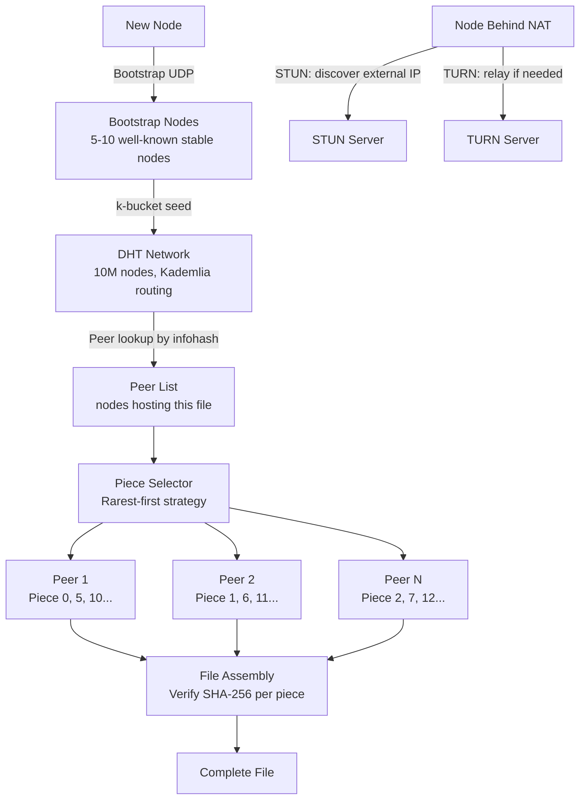

# Design a Peer-to-Peer File Sharing Network

**Difficulty**: 🔴 Advanced | **Codemania #36**
**Reading Time**: ~14 min
**Interview Frequency**: Medium

---

## The Core Problem

Building a P2P file sharing network where 10 million nodes can discover each other and transfer files without a central server. The hard problems: peer discovery without a central directory, transferring through NAT (most nodes are behind home routers that block incoming connections), and incentivizing nodes to contribute bandwidth rather than just download.

---

## Functional Requirements

- Nodes can share files without a central server
- A new node can join the network and discover existing peers
- Files are identified by a content hash (not filename)
- Parallel downloading: get different pieces of a file from multiple peers
- NAT traversal: nodes behind home routers can still participate
- Graceful handling of peers leaving mid-transfer

## Non-Functional Requirements

| Requirement | Target |
|-------------|--------|
| Network scale | 10M concurrent nodes |
| Peer discovery | Find peers hosting a file within 10 hops / < 1 second |
| Transfer speed | Limited by slowest path; multi-peer download improves throughput |
| No central server | DHT-only (trackerless) mode |
| NAT traversal | 80% of consumer nodes are behind NAT; must handle |

---

## Back-of-Envelope Estimates

- **DHT routing table**: Each node knows ~160 other nodes (Kademlia k-bucket structure); 10M nodes × 160 peers × 20 bytes = 32 GB across entire network
- **Lookup hops**: Kademlia DHT lookup = O(log N) = log₂(10M) = ~23 hops; each hop < 50ms = < 1.2s to find peer
- **File piece size**: 256 KB pieces standard; 1 GB file = 4,096 pieces; download from 10 parallel peers = 10× throughput
- **Tracker vs DHT**: Centralized tracker can serve 10M peers but is a SPOF; DHT distributes load across all 10M nodes

---

## High-Level Architecture



---

## Key Design Decisions

### 1. Centralized Tracker vs DHT

| Approach | Centralized Tracker | Kademlia DHT |
|----------|--------------------|--------------|
| SPOF | Yes — tracker down = no discovery | No — fully distributed |
| Speed | < 100ms (direct HTTP request) | ~1s (23 DHT hops) |
| Privacy | Tracker logs who downloads what | No central logging |
| Startup cost | None — tracker exists | Must know bootstrap nodes |
| Scale | Tracker is bottleneck at 10M peers | Load distributed across all nodes |

**Decision**: DHT (Kademlia) for a truly decentralized network. Centralized tracker acceptable as an optional performance optimization but should not be a hard dependency.

### 2. Kademlia DHT: How Peer Discovery Works

Kademlia assigns each node a 160-bit random ID. Files are also identified by a 160-bit hash (infohash). The node "responsible" for a file is the node whose ID is numerically closest to the infohash (XOR distance metric).

Lookup process:
1. Node A wants to find peers hosting file with infohash H
2. A queries its k-bucket for the 8 nodes closest to H
3. Those nodes respond with the 8 nodes they know closest to H
4. Iterative: A contacts those nodes, gets closer nodes
5. After ~23 hops: found the node(s) that store the peer list for H

Each node stores `(infohash → [peer_ip:port])` for files near its ID. When a node starts sharing a file, it does an `ANNOUNCE` to nodes near the file's infohash.

### 3. NAT Traversal

~80% of consumer internet users are behind NAT (router assigns private IP). Three techniques:

**STUN (Session Traversal Utilities for NAT)**:
- Node sends UDP packet to STUN server; STUN replies with node's external IP:port
- Node announces external IP:port to DHT — other nodes can connect
- Works for "full cone NAT" (most home routers)

**TURN (Traversal Using Relays around NAT)**:
- TURN server relays traffic between two NATted nodes
- Expensive (bandwidth cost); used as last resort when STUN fails
- Both nodes connect to TURN server; traffic relayed through it

**Hole Punching**:
- Both nodes behind NAT simultaneously send UDP packets to each other
- NAT table entries created on both sides → direct communication possible
- Success rate ~65% for symmetric NATs

### 4. File Piece Transfer: Rarest-First Strategy

Which pieces to download first?
- **Random**: Simple but doesn't ensure pieces spread across network
- **Rarest-first**: Download the piece that fewest other peers have first
  - Ensures rare pieces stay available in the swarm
  - Prevents "last piece" problem (final piece exists on only 1 peer)

```
For each peer, track their bitfield (which pieces they have)
Piece priority = 1 / (count of peers who have this piece)
Download highest-priority (rarest) pieces first
```

### 5. Seeder Incentive: Tit-for-Tat

Problem: "leechers" download but don't upload. Solution: BitTorrent's tit-for-tat:
- Each peer allocates upload bandwidth to the top-4 peers who upload fastest to them (reciprocal)
- One "optimistic unchoke" slot: randomly pick 1 peer to upload to, regardless of their upload rate
  - Allows new nodes to get initial bandwidth; discovers better peers
- Peers who don't upload get throttled (choked)

This creates reciprocal incentive: to download fast, you must also upload.

---

## Top Interview Questions for This Problem

| Question | Tests |
|----------|-------|
| How does a brand new node with no peers join a DHT network? | Bootstrap nodes (well-known stable nodes), initial k-bucket population |
| What happens if a peer crashes while you're downloading piece 50 from them? | Switch to another peer that has piece 50, rarest-first ensures piece availability |
| How does the DHT know which node is "responsible" for storing a file's peer list? | XOR distance metric — closest node ID to infohash |
| How would you add content moderation to a fully decentralized network? | You can't easily — design tension between decentralization and content control |

---

## Common Mistakes

1. **Assuming all nodes can receive incoming connections**: 80% are behind NAT. Design NAT traversal from the start (STUN/TURN/ICE).
2. **Not verifying piece integrity**: A malicious peer could send corrupt data for any piece. Always verify SHA-256 of each piece before saving.
3. **Downloading pieces sequentially**: Sequential download means early pieces only have a few sources (whoever is seeding). Rarest-first maximizes piece diversity in the swarm.

---

## Related Concepts

- [Consistent Hashing](/14-algorithms/concepts/consistent-hashing-deep-dive) — XOR-distance routing in Kademlia is conceptually similar
- [Message Queue Basics](../../04-messaging/concepts/message-queue-basics) — Message passing without central broker

---

## 📚 Resources & References

| Resource | Type | What You'll Learn |
|----------|------|------------------|
| [Kademlia Paper — Maymounkov & Mazières](https://pdos.csail.mit.edu/~petar/papers/maymounkov-kademlia-lncs.pdf) | 📖 Blog | DHT design, XOR metric, k-bucket routing |
| [BitTorrent Protocol Spec](https://www.bittorrent.org/beps/bep_0003.html) | 📚 Book | Piece selection, tracker protocol, metainfo format |
| [Hussein Nasser — P2P and WebRTC](https://www.youtube.com/@hnasr) | 📺 YouTube | NAT traversal, STUN/TURN, ICE framework |
| [High Scalability — P2P Networks](https://highscalability.com) | 📖 Blog | DHT architectures, BitTorrent internals |
