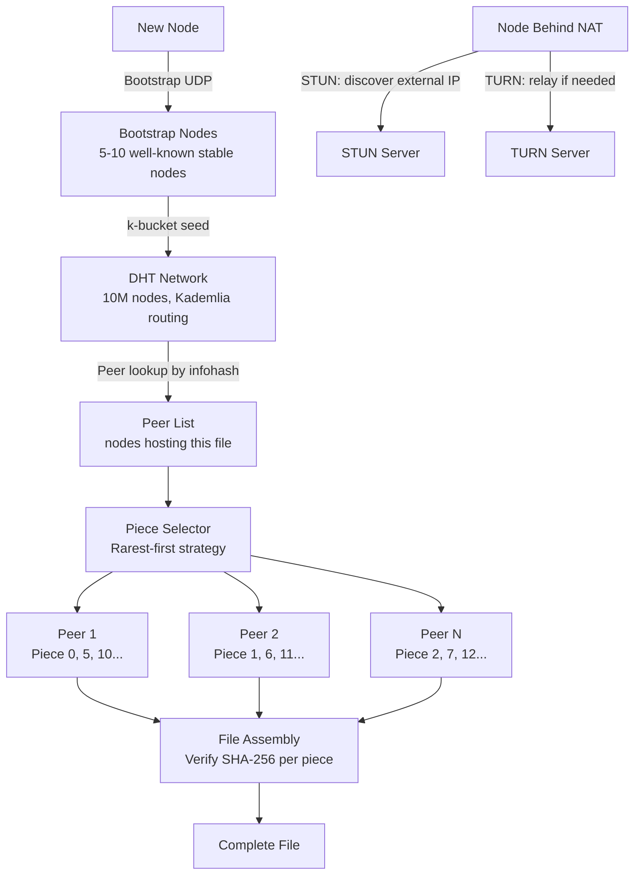
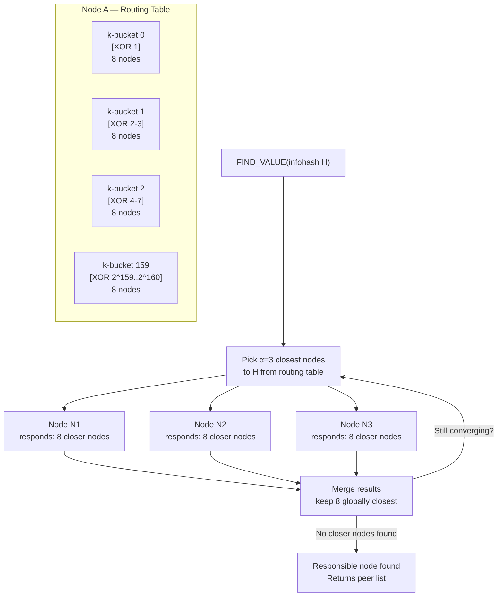
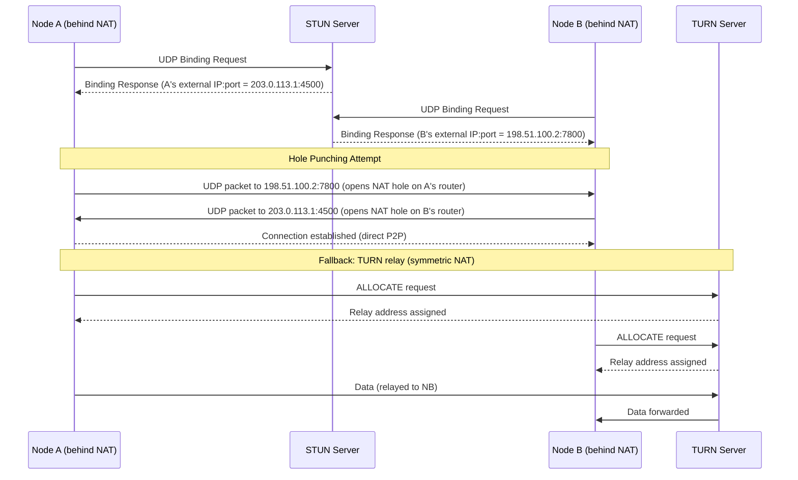

# Design a Peer-to-Peer File Sharing Network

**Difficulty**: 🔴 Advanced | **Codemania #36**
**Reading Time**: ~14 min
**Interview Frequency**: Medium

---

## The Core Problem

Building a P2P file sharing network where 10 million nodes can discover each other and transfer files without a central server. The hard problems: peer discovery without a central directory, transferring through NAT (most nodes are behind home routers that block incoming connections), and incentivizing nodes to contribute bandwidth rather than just download.

---

## Functional Requirements

- Nodes can share files without a central server
- A new node can join the network and discover existing peers
- Files are identified by a content hash (not filename)
- Parallel downloading: get different pieces of a file from multiple peers
- NAT traversal: nodes behind home routers can still participate
- Graceful handling of peers leaving mid-transfer

## Non-Functional Requirements

| Requirement | Target |
|-------------|--------|
| Network scale | 10M concurrent nodes |
| Peer discovery | Find peers hosting a file within 10 hops / < 1 second |
| Transfer speed | Limited by slowest path; multi-peer download improves throughput |
| No central server | DHT-only (trackerless) mode |
| NAT traversal | 80% of consumer nodes are behind NAT; must handle |

---

## Back-of-Envelope Estimates

- **DHT routing table**: Each node knows ~160 other nodes (Kademlia k-bucket structure); 10M nodes × 160 peers × 20 bytes = 32 GB across entire network
- **Lookup hops**: Kademlia DHT lookup = O(log N) = log₂(10M) = ~23 hops; each hop < 50ms = < 1.2s to find peer
- **File piece size**: 256 KB pieces standard; 1 GB file = 4,096 pieces; download from 10 parallel peers = 10× throughput
- **Tracker vs DHT**: Centralized tracker can serve 10M peers but is a SPOF; DHT distributes load across all 10M nodes

---

## High-Level Architecture



---

## Key Design Decisions

### 1. Centralized Tracker vs DHT

| Approach | Centralized Tracker | Kademlia DHT |
|----------|--------------------|--------------|
| SPOF | Yes — tracker down = no discovery | No — fully distributed |
| Speed | < 100ms (direct HTTP request) | ~1s (23 DHT hops) |
| Privacy | Tracker logs who downloads what | No central logging |
| Startup cost | None — tracker exists | Must know bootstrap nodes |
| Scale | Tracker is bottleneck at 10M peers | Load distributed across all nodes |

**Decision**: DHT (Kademlia) for a truly decentralized network. Centralized tracker acceptable as an optional performance optimization but should not be a hard dependency.

### 2. Kademlia DHT: How Peer Discovery Works

Kademlia assigns each node a 160-bit random ID. Files are also identified by a 160-bit hash (infohash). The node "responsible" for a file is the node whose ID is numerically closest to the infohash (XOR distance metric).

Lookup process:
1. Node A wants to find peers hosting file with infohash H
2. A queries its k-bucket for the 8 nodes closest to H
3. Those nodes respond with the 8 nodes they know closest to H
4. Iterative: A contacts those nodes, gets closer nodes
5. After ~23 hops: found the node(s) that store the peer list for H

Each node stores `(infohash → [peer_ip:port])` for files near its ID. When a node starts sharing a file, it does an `ANNOUNCE` to nodes near the file's infohash.

### 3. NAT Traversal

~80% of consumer internet users are behind NAT (router assigns private IP). Three techniques:

**STUN (Session Traversal Utilities for NAT)**:
- Node sends UDP packet to STUN server; STUN replies with node's external IP:port
- Node announces external IP:port to DHT — other nodes can connect
- Works for "full cone NAT" (most home routers)

**TURN (Traversal Using Relays around NAT)**:
- TURN server relays traffic between two NATted nodes
- Expensive (bandwidth cost); used as last resort when STUN fails
- Both nodes connect to TURN server; traffic relayed through it

**Hole Punching**:
- Both nodes behind NAT simultaneously send UDP packets to each other
- NAT table entries created on both sides → direct communication possible
- Success rate ~65% for symmetric NATs

### 4. File Piece Transfer: Rarest-First Strategy

Which pieces to download first?
- **Random**: Simple but doesn't ensure pieces spread across network
- **Rarest-first**: Download the piece that fewest other peers have first
  - Ensures rare pieces stay available in the swarm
  - Prevents "last piece" problem (final piece exists on only 1 peer)

```
For each peer, track their bitfield (which pieces they have)
Piece priority = 1 / (count of peers who have this piece)
Download highest-priority (rarest) pieces first
```

### 5. Seeder Incentive: Tit-for-Tat

Problem: "leechers" download but don't upload. Solution: BitTorrent's tit-for-tat:
- Each peer allocates upload bandwidth to the top-4 peers who upload fastest to them (reciprocal)
- One "optimistic unchoke" slot: randomly pick 1 peer to upload to, regardless of their upload rate
  - Allows new nodes to get initial bandwidth; discovers better peers
- Peers who don't upload get throttled (choked)

This creates reciprocal incentive: to download fast, you must also upload.

---

## Top Interview Questions for This Problem

| Question | Tests |
|----------|-------|
| How does a brand new node with no peers join a DHT network? | Bootstrap nodes (well-known stable nodes), initial k-bucket population |
| What happens if a peer crashes while you're downloading piece 50 from them? | Switch to another peer that has piece 50, rarest-first ensures piece availability |
| How does the DHT know which node is "responsible" for storing a file's peer list? | XOR distance metric — closest node ID to infohash |
| How would you add content moderation to a fully decentralized network? | You can't easily — design tension between decentralization and content control |

---

## Common Mistakes

1. **Assuming all nodes can receive incoming connections**: 80% are behind NAT. Design NAT traversal from the start (STUN/TURN/ICE).
2. **Not verifying piece integrity**: A malicious peer could send corrupt data for any piece. Always verify SHA-256 of each piece before saving.
3. **Downloading pieces sequentially**: Sequential download means early pieces only have a few sources (whoever is seeding). Rarest-first maximizes piece diversity in the swarm.

---

## Related Concepts

- [Consistent Hashing](/14-algorithms/concepts/consistent-hashing-deep-dive) — XOR-distance routing in Kademlia is conceptually similar
- [Message Queue Basics](../../04-messaging/concepts/message-queue-basics) — Message passing without central broker

---

---

## Component Deep Dive 1: Kademlia DHT Routing

The Distributed Hash Table (DHT) is the backbone of any truly decentralized P2P network. Without it, nodes cannot discover each other without a central tracker. Kademlia, published in 2002 by Maymounkov and Mazières, is the most widely deployed DHT algorithm — used by BitTorrent, Ethereum, and IPFS.

### How Kademlia Works Internally

Every node receives a random 160-bit node ID at startup (generated from SHA-1 of its IP:port). Files are identified by a 160-bit infohash. The XOR of two IDs defines their "distance" — a non-intuitive but mathematically powerful metric: XOR is symmetric (`d(A,B) = d(B,A)`), satisfies triangle inequality, and produces a binary tree structure that makes routing provably efficient.

Each node maintains a routing table of 160 "k-buckets" — one per bit position in the 160-bit space. Bucket `i` holds up to `k=8` nodes whose XOR distance to the local node falls in the range `[2^i, 2^(i+1))`. Buckets for close distances fill slowly (few nodes are very close); buckets for far distances fill quickly. This biased structure means each node knows a lot about its local neighborhood and progressively less about distant regions.

**Lookup algorithm** (FIND_VALUE):
1. Initiating node queries its α=3 closest known nodes to the target infohash.
2. Those nodes respond with their 8 closest known nodes to the target.
3. Initiating node contacts the new-closest nodes in parallel (α concurrent requests).
4. Process repeats until no closer nodes are returned — convergence in O(log N) hops.

At 10M nodes: log₂(10,000,000) ≈ 23 hops. Each hop is one UDP round-trip (~20–50ms on average). Total lookup time: 23 × 30ms ≈ 690ms, well within the 1-second SLA.

**Why naive approaches fail**: A flat list of "all known peers" does not scale. At 10M nodes, a random-walk lookup takes O(√N) = ~3,162 hops. Flooding-based discovery (Gnutella v0.4) saturated the entire network with queries within hours of launch. Kademlia's O(log N) guarantee is what makes 10M+ node networks practical.

### Kademlia Routing Internals



### DHT Routing Implementation Options

| Approach | Latency (10M nodes) | Churn Tolerance | Storage Overhead | Trade-off |
|----------|---------------------|-----------------|------------------|-----------|
| Kademlia (XOR metric) | ~700ms (23 hops) | Good — k=8 redundancy per bucket | 160 × 8 × 20B = 25 KB/node | Industry standard; complex to implement correctly |
| Chord (ring DHT) | ~500ms (17 hops, log N/2) | Moderate — single successor list | log N entries × 20B = ~460B | Simpler but finger table maintenance is expensive on churn |
| Pastry / Tapestry | ~600ms (log₁₆ N ≈ 6 hops) | Good | Similar to Kademlia | Lower hop count but higher per-hop state |

**Winner for this design**: Kademlia. Its parallelism (α=3 concurrent lookups) and k-bucket redundancy tolerate 20–30% churn per hour (typical for consumer P2P) without degrading lookup performance. BitTorrent DHT (BEP 5) is a direct implementation.

---

## Component Deep Dive 2: NAT Traversal (ICE Framework)

NAT traversal is the most underestimated hard problem in P2P networking. In a network where 80% of nodes are behind NAT, ignoring traversal means 64% of peer pairs (NAT↔NAT) cannot communicate directly — crippling throughput.

### Internal Mechanics

The **Interactive Connectivity Establishment (ICE)** framework (RFC 8445) is the production solution, used by WebRTC, modern BitTorrent clients, and every VoIP system. ICE runs three parallel attempts and uses the first one that succeeds:

1. **Host candidate**: Try direct LAN connection (IP:port of local interface). Works only when both peers are on the same network — rare in internet P2P.
2. **Server-reflexive candidate (STUN)**: Node sends UDP to a STUN server. The STUN server echoes back the external IP:port as seen by the internet. Node announces this to DHT. The UDP "hole" is now open in the NAT table for ~30 seconds (NAT mapping timeout).
3. **Relayed candidate (TURN)**: Both nodes connect to a TURN relay server. All traffic passes through it. Guaranteed to work, but TURN bandwidth is expensive ($0.03–$0.10/GB). Used as last resort.

**Hole punching** (the key trick for symmetric NATs): Both nodes simultaneously send UDP packets to each other's external IP:port. On most routers, the outbound UDP packet creates a NAT table entry that allows return traffic. Success rate: ~65–70% for restricted-cone NAT, ~30% for symmetric NAT (enterprise firewalls).

### Scale Behavior at 10x Load

At baseline 1M nodes: STUN server receives ~100k STUN binding requests/sec (each node does one STUN check every 10 seconds on average). At 10M nodes (10x): 1M STUN req/sec. A single STUN server can handle ~200k req/sec (stateless UDP processing). Mitigation: deploy 5–10 anycast STUN servers globally (e.g., Google's `stun.l.google.com:19302` serves billions of WebRTC sessions).

TURN is the expensive one. At 10x load with 5% of connections needing TURN relay: 500k TURN sessions × 100KB/s average throughput = 50 GB/s aggregate relay bandwidth. Cost: ~$5,000/hour. Mitigation: cap TURN to 2% of sessions by improving hole-punching success rate and disabling TURN for large file transfers (accept partial NAT failure).



---

## Component Deep Dive 3: Piece Management and Integrity Verification

The file transfer layer sits below DHT and NAT traversal. Getting it wrong creates either a security vulnerability (accepting corrupt data) or a performance collapse (inefficient piece ordering).

### Piece Selection Strategy

Each peer maintains a bitfield: a bitmap where bit `i` is 1 if the peer has piece `i`. When connecting to a new swarm:

1. Exchange bitfields immediately on connection.
2. Build a piece rarity count: for each piece `i`, count how many connected peers have it.
3. Sort pieces by ascending rarity count (rarest first).
4. Download the rarest piece first.

The rarest-first strategy prevents the "last piece problem": without it, the last few pieces might exist on only 1–2 seeders, making them a bottleneck. Rarest-first ensures rare pieces propagate to more peers quickly, distributing load.

**End game mode**: When < 20 pieces remain, request each missing piece from ALL peers simultaneously. Cancel duplicate requests as each piece arrives. This eliminates the tail latency spike caused by a slow final peer.

### Integrity Verification

Each piece has a SHA-256 hash stored in the `.torrent` metainfo file (or IPFS CID). After every piece download:

1. Hash the received bytes (SHA-256).
2. Compare against the expected hash from the metainfo.
3. If mismatch: discard, mark as needed, re-request from a different peer.
4. If match: mark as verified, add to bitfield, announce to peers.

This is critical security: a malicious peer can inject corrupt data for any piece. Without per-piece verification, a single corrupt peer can poison the entire download. With SHA-256 verification, the worst a malicious peer can do is waste your bandwidth for one piece download (detected and discarded immediately).

---

## Data Model

### Torrent Metainfo (stored in `.torrent` file or DHT)

```json
{
  "info": {
    "name": "ubuntu-24.04-desktop-amd64.iso",
    "piece_length": 262144,
    "pieces": ["sha256_of_piece_0", "sha256_of_piece_1", "..."],
    "length": 5173995520,
    "files": null
  },
  "infohash": "a1b2c3d4e5f6...(40 hex chars, SHA-1 of bencoded info dict)",
  "announce": "udp://tracker.opentrackr.org:1337/announce",
  "announce-list": [["udp://..."], ["udp://..."]],
  "created by": "qBittorrent/4.6.0",
  "creation date": 1717200000
}
```

### DHT Node Routing Table (in-memory, per node)

```sql
-- k-bucket entry: 160 buckets, up to k=8 nodes each
CREATE TABLE routing_table (
    bucket_index    INTEGER NOT NULL,         -- 0..159 (bit position)
    node_id         CHAR(40) NOT NULL,        -- 160-bit hex node ID
    ip_address      VARCHAR(45) NOT NULL,     -- IPv4 or IPv6
    port            INTEGER NOT NULL,         -- UDP port
    last_seen_at    BIGINT NOT NULL,          -- Unix timestamp ms
    failed_queries  INTEGER DEFAULT 0,        -- eviction counter (≥3 = remove)
    PRIMARY KEY (bucket_index, node_id),
    INDEX idx_bucket_last_seen (bucket_index, last_seen_at DESC)
);

-- Peer list stored by nodes near infohash
CREATE TABLE peer_store (
    infohash        CHAR(40) NOT NULL,        -- file identifier
    peer_ip         VARCHAR(45) NOT NULL,
    peer_port       INTEGER NOT NULL,
    announced_at    BIGINT NOT NULL,          -- Unix timestamp ms
    expires_at      BIGINT NOT NULL,          -- announced_at + 30 min TTL
    PRIMARY KEY (infohash, peer_ip, peer_port),
    INDEX idx_infohash_expires (infohash, expires_at)
);
```

### In-Memory Download State (per active torrent)

```json
{
  "infohash": "a1b2c3d4e5f6...",
  "total_pieces": 19744,
  "piece_length": 262144,
  "bitfield": "00001111010101...(bitstring, 1=have, 0=need)",
  "peers": [
    {
      "node_id": "b3c4...",
      "ip": "203.0.113.5",
      "port": 6881,
      "bitfield": "11110000...",
      "upload_rate_bps": 512000,
      "am_choking": false,
      "am_interested": true,
      "peer_choking": false,
      "peer_interested": true
    }
  ],
  "piece_rarity": [3, 1, 5, 2, 1, ...],
  "in_flight": {
    "piece_7": {"from_peer": "b3c4...", "requested_at": 1717200100000},
    "piece_3": {"from_peer": "c5d6...", "requested_at": 1717200099000}
  }
}
```

---

## Scale Bottlenecks

| Traffic Level | Component That Breaks | Symptoms | Mitigation |
|---------------|----------------------|----------|------------|
| 10x baseline (100M nodes) | DHT bootstrap nodes | Bootstrap nodes overwhelmed; new nodes time out joining | Run 20+ geographically distributed bootstrap nodes behind anycast DNS; each handles ~50k join/sec |
| 10x baseline | STUN servers | Hole-punch failures rise; more connections fall back to TURN | Deploy STUN via anycast (stateless UDP); each server handles 200k req/sec; 5 servers covers 1M req/sec |
| 10x baseline | Per-node routing table memory | k-buckets grow; 160 × 8 nodes × 20B = 25KB baseline, acceptable | No issue at 10x; XOR space ensures fixed k-bucket count regardless of network size |
| 100x baseline (1B nodes) | DHT lookup latency | log₂(1B) = 30 hops × 30ms = 900ms; approaches SLA limit | Increase α from 3 to 6 (more parallel lookups); reduce hop count by 25% |
| 100x baseline | TURN relay bandwidth | 5% needing relay × 1B nodes × 100KB/s = 500 TB/s — economically infeasible | Hard-cap TURN to 0.1% of sessions; improve hole-punching for symmetric NAT via techniques like STUN port prediction |
| 1000x baseline | Piece seeder availability | Popular files have millions of leechers but few seeders at peak; piece availability collapses | CDN seeding for top-1000 torrents (hybrid CDN+P2P); seed ratio incentives |
| 1000x baseline | SHA-256 piece verification CPU | 1M downloads × 256KB pieces × SHA-256 = ~500 GB/sec hashing throughput on the network | CPU cost is per-client, not centralized; modern hardware hashes at 3–10 GB/sec per core; no central bottleneck |

---

## How BitTorrent Inc. Built This

BitTorrent is the canonical real-world implementation of exactly this design — and the numbers are staggering.

**Scale**: At peak (2012–2015), BitTorrent had 170 million monthly active users, 40 million simultaneous seeds/leechers, and was responsible for 25–35% of all upstream internet traffic globally (per Sandvine network reports).

**Technology stack**: The official µTorrent client implements Kademlia DHT per BEP 5 (published 2008). Each client maintains a DHT routing table of ~1,000–2,000 nodes, chosen from log₂(40M) ≈ 25 buckets. Lookup latency in production: 600ms–1.2s median for infohash resolution.

**Non-obvious architectural decision — DHT token system**: To prevent DDoS via fake ANNOUNCE floods, Kademlia DHT requires that a node announcing it has a file must first receive a "token" from the responsible node. Tokens are derived from `HMAC(announcing_IP, current_time_bucket)` where time_bucket rotates every 10 minutes. Only a peer who genuinely connected to the responsible node can announce. This eliminates the threat of a node announcing fake peer lists that redirect downloaders to attack victims.

**Specific numbers from BitTorrent engineering blog (2013)**:
- DHT table: 8M active nodes tracked at any given moment (many nodes share DHT without downloading)
- Bootstrap nodes: 6 nodes operated by BitTorrent Inc., each handling ~80k UDP packets/sec
- Infohash resolution: 95th percentile under 2 seconds
- Piece integrity failures caught: ~0.1% of piece downloads (mostly from buggy clients, rarely malicious)

**TURN cost decision**: BitTorrent consciously chose NOT to operate TURN servers. If two nodes cannot hole-punch, the connection attempt is abandoned. This means ~15% of NAT↔NAT connection attempts fail entirely. The trade-off: zero infrastructure cost for relaying. With 40M concurrent nodes, even 1% needing TURN relay at 100KB/s = 40 TB/s — economically prohibitive.

Source: [BitTorrent Blog Engineering Archive](https://blog.bittorrent.com), Arvid Norberg talks at FOSDEM 2012/2013.

---

## Interview Angle

**What the interviewer is testing:** Whether you understand distributed systems without a coordinator — specifically, how to handle peer discovery, consistency, and incentives when no single node has global state. They also test whether you understand the practical networking constraints (NAT) that most system design candidates ignore.

**Common mistakes candidates make:**

1. **Proposing a central database for peer discovery**: Saying "store peer lists in a Redis cluster" misses the entire point — a central store is a SPOF, a scaling bottleneck at 10M nodes, and violates the P2P design goal. The interviewer will ask "what happens when Redis goes down?" — the correct answer is DHT, not Redis replication.

2. **Ignoring NAT traversal entirely**: Describing a design where "peer A connects to peer B's IP:port" without mentioning that 80% of peers have private IPs. This reveals unfamiliarity with how the real internet works. Always mention STUN/TURN/ICE in the first 5 minutes.

3. **Using SHA-1 for piece hashing**: Modern systems use SHA-256 (BitTorrent v2 protocol, 2020). Proposing SHA-1 signals you're not current — and an interviewer at a security-conscious company will call it out. SHA-1 has known collision attacks since 2017.

**The insight that separates good from great answers:** Understanding the tit-for-tat incentive mechanism at a game-theory level. Most candidates describe it mechanically ("upload to the top 4 peers"). A great answer explains WHY it works: it creates a Nash equilibrium where defecting (leeching) is individually rational for one node but leads to collective punishment. The optimistic unchoke slot is the key nuance — without it, the system converges to a closed club where new nodes can never enter, the network fails to onboard new seeders, and diversity collapses. The random unchoke is a deliberate mechanism to prevent this equilibrium collapse.

---

## Key Numbers to Remember

| Metric | Value | Context |
|--------|-------|---------|
| DHT lookup hops | ~23 hops | log₂(10M nodes); each hop 20–50ms UDP |
| DHT lookup latency (p95) | < 1.2s | 23 hops × 50ms max per hop |
| k-bucket size | k = 8 | 8 nodes per bucket; optimal fault tolerance vs. memory trade-off |
| Parallelism factor α | 3 | 3 concurrent queries per lookup step; reduces latency 3× vs. serial |
| Routing table size | ~25 KB | 160 buckets × 8 nodes × 20B (ID + IP + port) per node |
| NAT prevalence | ~80% | Consumer internet; all 4 NAT types must be handled |
| STUN server throughput | ~200k req/sec | Per server, stateless UDP; 5 servers covers 1M node network |
| Hole-punch success rate | 65–70% | Restricted-cone NAT; ~30% for symmetric NAT |
| Piece size standard | 256 KB | 1 GB file = 4,096 pieces; balances overhead vs. granularity |
| Tit-for-tat unchoke slots | 4 + 1 | 4 reciprocal + 1 optimistic; standard BitTorrent parameter |
| BitTorrent peak traffic share | 25–35% | Of all upstream internet traffic (Sandvine, 2012) |
| Piece verification failure rate | ~0.1% | In BitTorrent production; mostly buggy clients |

---

## 📚 Resources & References

| Resource | Type | What You'll Learn |
|----------|------|------------------|
| [Kademlia Paper — Maymounkov & Mazières](https://pdos.csail.mit.edu/~petar/papers/maymounkov-kademlia-lncs.pdf) | 📖 Blog | DHT design, XOR metric, k-bucket routing |
| [BitTorrent Protocol Spec](https://www.bittorrent.org/beps/bep_0003.html) | 📚 Book | Piece selection, tracker protocol, metainfo format |
| [Hussein Nasser — P2P and WebRTC](https://www.youtube.com/@hnasr) | 📺 YouTube | NAT traversal, STUN/TURN, ICE framework |
| [High Scalability — P2P Networks](https://highscalability.com) | 📖 Blog | DHT architectures, BitTorrent internals |
