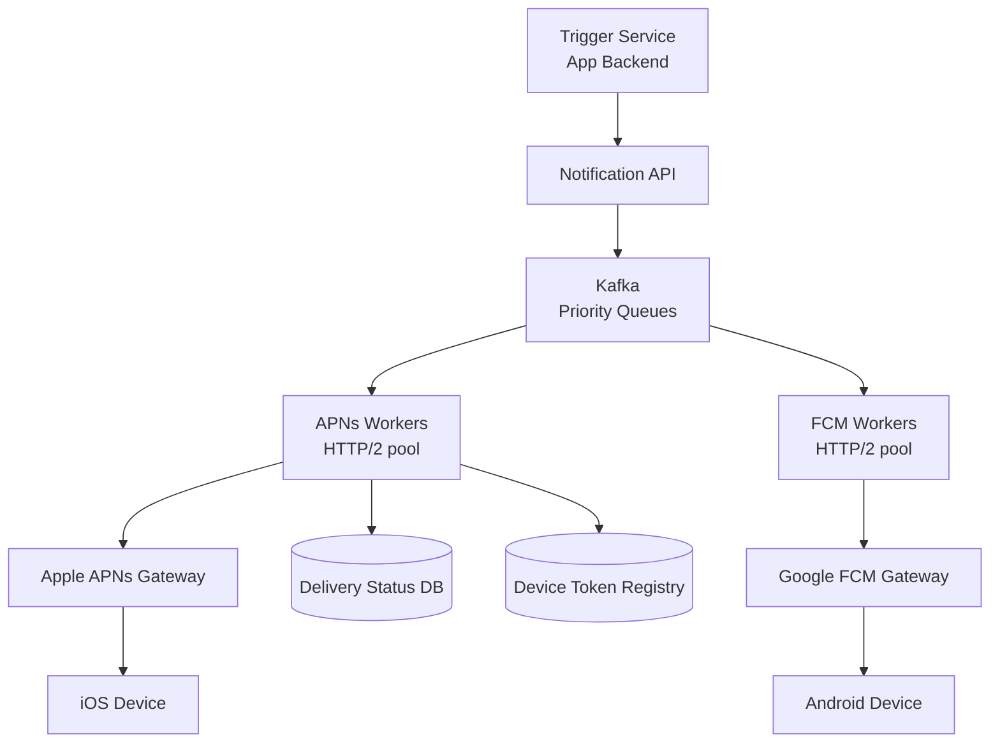
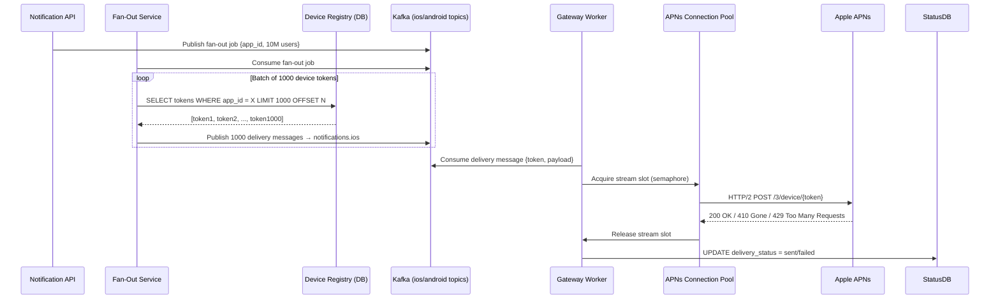
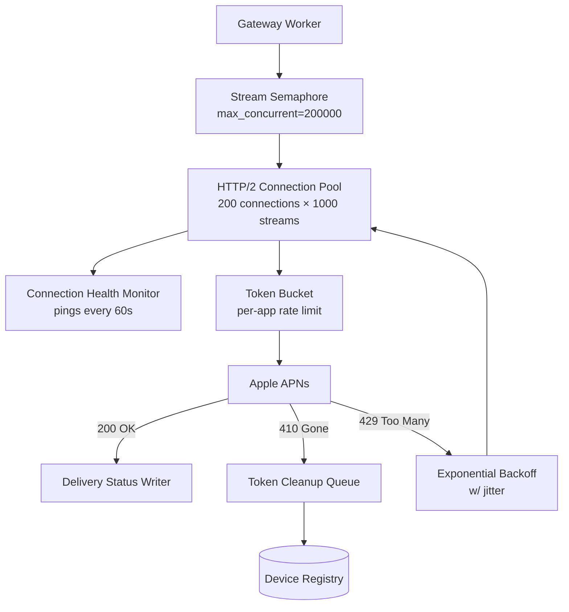
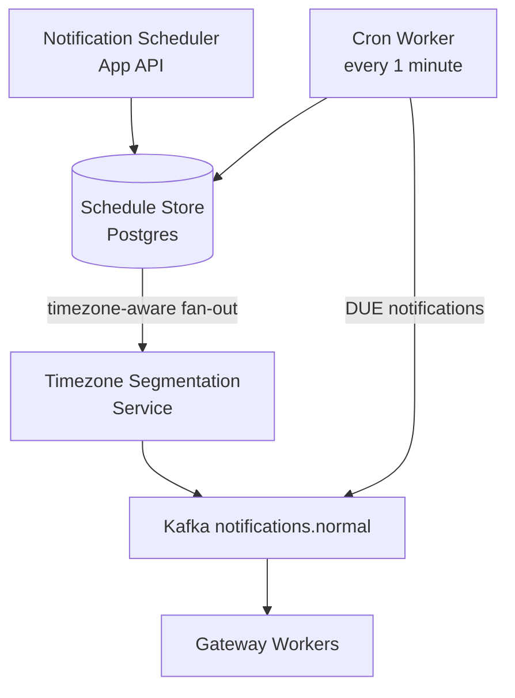

# Design a Push Notification Service

**Difficulty**: 🟡 Intermediate
**Reading Time**: Coming Soon
**Interview Frequency**: High

---

> 🚧 **Full article coming soon.** This stub gives you the essentials to start thinking about this problem.

---

## The Core Problem

Delivering 1 billion push notifications per day through Apple (APNs) and Google (FCM) gateways — which have their own rate limits, connection management requirements, and retry semantics — while tracking delivery status for each notification and handling invalid/expired device tokens at scale.

## Functional Requirements

- Send push notifications to iOS (APNs) and Android (FCM) devices
- Support real-time (< 5s) and scheduled/delayed notifications
- Track delivery status: queued, sent to gateway, delivered, failed
- Handle bulk sends (e.g., broadcast to all 10M users of an app)

## Non-Functional Requirements

| Requirement | Target |
|-------------|--------|
| Throughput | 1B notifications/day (~11,600/sec) |
| Delivery latency | p99 < 5 seconds for real-time |
| Reliability | 99.9% delivery for non-expired tokens |
| Scale | 10M apps, 10B registered devices |

## Back-of-Envelope Estimates

- **Peak throughput**: 1B/day with marketing blasts → peak 500K/sec during prime-time sends
- **Device token storage**: 10B devices × 100 bytes per token record = 1TB device registry
- **Retry volume**: 5% delivery failures × 1B/day = 50M retries/day (must not storm gateways)

## Key Design Decisions

1. **Queue-Based Architecture with Priority Lanes** — don't send directly to APNs/FCM; route through Kafka; use separate queues for critical (transactional alerts, 2FA) vs marketing notifications; critical gets dedicated workers with lower latency SLA.
2. **Connection Pool to APNs/FCM** — APNs requires persistent HTTP/2 connections (not per-request); maintain pool of 100 connections to APNs; each connection handles 1,000 concurrent streams; total: 100,000 in-flight notifications per connection pool.
3. **Token Cleanup on 410 Gone** — when APNs/FCM returns "device token invalid/expired" (HTTP 410), immediately delete from device registry; sending to dead tokens wastes quota and triggers APNs rate limiting.

## High-Level Architecture



## Top Interview Questions for This Problem

| Question | Tests |
|----------|-------|
| How do you send a push notification to 100M users in under 5 minutes? | Parallel workers, fan-out |
| How do you handle APNs rate limiting when sending marketing blasts? | Token bucket, backpressure |
| How do you ensure a 2FA code notification is delivered in under 3 seconds? | Priority queues, dedicated workers |

## Related Concepts

- [Webhook notification system for server-to-server delivery](./webhook-notification)
- [Scalable email service for comparable delivery challenges](./scalable-email-service)

---

## Level 2 — Deep Dive

---

## Component Deep Dive 1: Kafka Fan-Out Worker Architecture

The fan-out worker layer is the most critical architectural component in a push notification service. It is the engine that converts a single "send to 10M users" API call into 10 million individual gateway requests, while respecting per-gateway rate limits, managing HTTP/2 connection pools, and writing delivery status records — all under tight latency constraints.

### How It Works Internally

When a marketing team triggers a blast to 10M users, the API layer does NOT iterate over those users inline. Instead, it writes a single **fan-out job** record to a Kafka topic (e.g., `notifications.fanout`). A Fan-Out Service reads this record, queries the Device Token Registry in batches of 1,000, and emits one individual delivery message per device onto `notifications.ios` or `notifications.android` topics. Downstream **Gateway Workers** consume those topics and execute the actual HTTP/2 requests to APNs or FCM.

This two-stage approach is essential because writing 10M messages to Kafka in a single producer loop takes ~20 seconds at 500k writes/sec — which is acceptable. But if the API layer tried to query the device registry and call APNs directly, a single API server would exhaust its connection pool within milliseconds and create a thundering herd against the gateway.

### Why Naive Approaches Fail

A common naive approach is to use a thread-per-notification model: spawn a goroutine or thread for every notification and fire HTTP requests concurrently. At 500k/sec this means holding 500k+ in-flight connections simultaneously. APNs enforces a **concurrent stream limit of 1,000 per HTTP/2 connection** — so you need at least 500 persistent connections open just to keep up with peak throughput. Thread-per-request blows through file descriptor limits (default 65,535 on Linux) long before reaching 500k concurrent requests.

The correct approach uses an **async HTTP/2 multiplexed connection pool**: a fixed pool of 200–500 persistent connections to APNs, each carrying up to 1,000 concurrent streams. Workers pull messages from Kafka, acquire a slot from a semaphore, dispatch on an existing connection stream, then release the slot on response. This caps in-flight requests at `pool_size × streams_per_conn` (e.g., 200 × 1,000 = 200,000 concurrent) regardless of the number of worker threads.



### Worker Implementation Options

| Approach | Latency | Throughput | Trade-off |
|----------|---------|------------|-----------|
| Thread-per-request (blocking HTTP/1.1) | 50–200ms | ~5k req/sec per server | Simple code; blows up at scale; APNs doesn't support HTTP/1.1 anyway |
| Async HTTP/2 + connection pool (Go/Rust) | 5–30ms | 100k–500k req/sec per server | Higher complexity; requires semaphore management; correct choice at scale |
| Kafka Streams + batched gateway calls | 100–500ms | 50k–200k req/sec | Adds latency from micro-batching; better throughput per CPU core; not suitable for 2FA notifications |

---

## Component Deep Dive 2: APNs/FCM Connection Pool and Rate Limit Management

### Internal Mechanics

Apple APNs requires **persistent HTTP/2 connections authenticated with a provider certificate or JWT token**. Unlike FCM (which allows HTTP/1.1 and per-request tokens), APNs connections are expensive to establish: TLS handshake + certificate validation takes 100–300ms. Tearing down and rebuilding connections under load is catastrophic — you lose 300ms per reconnect while the notification queue is growing.

The connection pool must handle three scenarios:

1. **Steady-state delivery**: Keep N connections alive with keepalive pings every 60 seconds (APNs closes idle connections after 1 hour).
2. **Rate limit response (429 Too Many Requests)**: APNs does not publish exact rate limits publicly, but empirically they are ~10,000–100,000 notifications/sec per app depending on tier. On a 429, back off with exponential jitter, drain the in-flight requests, and reduce the active stream count.
3. **Token expiry (410 Gone)**: The APNs 410 response means the device token is permanently invalid. The worker must immediately write a `token_expired` event to the DeviceRegistry. Any further sends to this token waste quota and can trigger APNs to throttle the provider.

### Scale Behavior at 10x Load

At 10x normal load (e.g., a major product announcement blast hitting 100M devices in 10 minutes = ~167k/sec):

- **Connection pool saturation**: If the pool has 200 connections × 1,000 streams = 200k capacity, 167k/sec stays within bounds — but only if message sizes are small (<4KB, APNs limit).
- **FCM batch endpoint**: FCM supports a `sendEach` batch API (up to 500 messages per HTTP request). At 10x load, batching is critical: 500 messages × 1 HTTP request = 333 requests/sec instead of 167k/sec, reducing connection pressure by 99.8%.
- **JWT token rotation**: APNs JWT tokens expire after 1 hour. At 10x load, all connections sharing a token that expires simultaneously will fail together. Stagger token rotation across connections using a per-connection expiry offset.



---

## Component Deep Dive 3: Device Token Registry and Delivery Status Store

### Technical Decisions

The Device Token Registry stores the mapping `(app_id, user_id) → [device_token, platform, last_seen, is_active]`. At 10B registered devices × ~100 bytes per record = 1TB. This rules out an in-memory solution. The registry has two distinct access patterns:

1. **Fan-out reads**: Sequential scan of all tokens for a given `app_id` (for broadcasts). This requires efficient range scans — a B-tree index on `(app_id, user_id)` in PostgreSQL with table partitioning by `app_id`, or a Cassandra table with `app_id` as partition key and `user_id` as clustering column.

2. **Token invalidation writes**: Point writes when APNs/FCM returns a 410. These must be durable — losing an invalidation means wasting quota on the next send. Write directly to the primary with `UPDATE devices SET is_active = false WHERE token = ?`.

For **Delivery Status**, the write volume is enormous: 11,600/sec baseline × 3 state transitions (queued → sent → delivered/failed) = ~35,000 writes/sec. A relational database cannot absorb this without extreme partitioning. The correct choice is **Apache Cassandra** with a time-series schema, or Kafka+ClickHouse for analytics queries:

- Cassandra: partition key = `(app_id, date)`, clustering key = `notification_id`. High write throughput (50k–100k writes/sec per node), but queries limited to partition scans.
- ClickHouse: ingest via Kafka consumer, columnar storage for analytics (e.g., "delivery rate by country"). Adds 30–60 second ingestion lag but enables complex aggregations.

---

## Data Model

```sql
-- Device Token Registry (PostgreSQL, partitioned by app_id hash)
CREATE TABLE device_tokens (
    app_id          UUID        NOT NULL,
    user_id         BIGINT      NOT NULL,
    device_token    VARCHAR(512) NOT NULL,   -- APNs: 64-byte hex; FCM: 152-char string
    platform        SMALLINT    NOT NULL,    -- 0=iOS, 1=Android, 2=Web
    token_env       SMALLINT    NOT NULL,    -- 0=production, 1=sandbox (APNs only)
    app_version     VARCHAR(32),
    os_version      VARCHAR(32),
    created_at      TIMESTAMPTZ NOT NULL DEFAULT now(),
    last_active_at  TIMESTAMPTZ NOT NULL DEFAULT now(),
    is_active       BOOLEAN     NOT NULL DEFAULT true,
    invalidated_at  TIMESTAMPTZ,            -- set when 410 received from gateway
    PRIMARY KEY (app_id, device_token)
) PARTITION BY HASH (app_id);

-- Index for user-level fan-out (send to all devices of a user)
CREATE INDEX idx_device_tokens_user ON device_tokens (app_id, user_id) WHERE is_active = true;

-- Notification delivery log (Cassandra schema)
-- Partition by app_id + date keeps each partition manageable (~millions of rows/day)
CREATE TABLE notification_delivery_log (
    app_id           UUID,
    sent_date        DATE,
    notification_id  UUID,
    device_token     TEXT,
    platform         TINYINT,
    status           TINYINT,        -- 0=queued, 1=sent, 2=delivered, 3=failed, 4=expired
    priority         TINYINT,        -- 0=critical, 1=high, 2=normal, 3=low
    payload_size     SMALLINT,       -- bytes
    queued_at        TIMESTAMP,
    sent_at          TIMESTAMP,
    gateway_response TEXT,           -- raw APNs/FCM error code on failure
    retry_count      TINYINT,
    PRIMARY KEY ((app_id, sent_date), notification_id, device_token)
) WITH CLUSTERING ORDER BY (notification_id ASC)
  AND default_time_to_live = 2592000;  -- 30 days TTL

-- Fan-out jobs (PostgreSQL, for orchestration)
CREATE TABLE fanout_jobs (
    job_id          UUID        PRIMARY KEY,
    app_id          UUID        NOT NULL,
    template_id     UUID,
    segment_sql     TEXT,               -- parameterized query defining target audience
    total_devices   BIGINT,
    sent_count      BIGINT      DEFAULT 0,
    failed_count    BIGINT      DEFAULT 0,
    status          SMALLINT    NOT NULL DEFAULT 0,  -- 0=pending, 1=running, 2=complete, 3=failed
    scheduled_at    TIMESTAMPTZ,
    started_at      TIMESTAMPTZ,
    completed_at    TIMESTAMPTZ,
    created_at      TIMESTAMPTZ NOT NULL DEFAULT now()
);
```

---

## Scale Bottlenecks

| Traffic Level | Component That Breaks | Symptoms | Mitigation |
|---------------|----------------------|----------|------------|
| 10x baseline (~116k/sec) | APNs connection pool saturation | 429 responses spike; delivery latency climbs to 30–60s | Add 5x more Gateway Worker pods; increase pool to 1,000 connections; enable FCM batch API (500 msg/request) |
| 100x baseline (~1.16M/sec) | Kafka partition throughput | Consumer lag grows unbounded; fan-out latency becomes minutes | Increase Kafka partitions from 64 to 512; add partition-level consumer groups; pre-shard device token registry by `app_id` hash range |
| 100x baseline | Device Token Registry read bottleneck | Fan-out queries timeout; IOPS on read replicas saturate | Migrate to Cassandra with `app_id` as partition key; cache hot app token lists in Redis with 5-min TTL; paginate fan-out in 500-device batches instead of 1,000 |
| 1000x baseline (~11.6M/sec) | Gateway hard limits from Apple/Google | Hard throttle at APNs side; no bypass possible | Pre-negotiate enterprise APNs tier (Apple requires formal agreement); use FCM for Android exclusively to parallelize; spread blast over longer time window; implement notification coalescing (collapse 10 notifications into 1 summary) |
| 1000x baseline | Delivery status write volume (~35M writes/sec) | Cassandra write coordinator timeouts; status lag grows to hours | Shard Cassandra to 50+ nodes; drop per-device status for marketing blasts (only track aggregate delivery %) to reduce write volume by 10x |

---

## How Airship Built This

Airship (formerly Urban Airship) is the world's largest independent push notification platform, processing over **15 billion push notifications per day** across 1 billion+ devices for customers including NBCUniversal, Alaska Airlines, and The Washington Post.

**Scale numbers (from Airship engineering blog and Velocity conference talks):**
- 15 billion notifications/day = ~174,000/sec average, with peaks exceeding 1 million/sec during breaking news events
- 1 billion registered device tokens across iOS, Android, and Web Push
- Delivery latency: p50 < 1 second, p99 < 5 seconds for high-priority messages

**Technology stack:**
- **Erlang/OTP** for the APNs/FCM gateway workers — chosen because Erlang's lightweight processes (not OS threads) can hold millions of in-flight HTTP/2 requests with minimal memory overhead. A single Erlang node can manage 250,000 concurrent connections.
- **Riak** (later migrated to Cassandra) for device token registry — Riak's masterless architecture avoided single points of failure during their initial hypergrowth phase.
- **Apache Kafka** for fan-out queuing — each Kafka topic partition maps to a single dedicated Erlang worker process, ensuring ordered processing per partition without locks.

**Non-obvious architectural decision:** Airship builds **notification coalescing** into the fan-out layer. When a user has 5 unread notifications from the same app queued up due to a brief device outage, Airship collapses them into a single summary notification before sending to APNs. This reduces APNs traffic by 40% during re-connection storms (e.g., when millions of users unlock their phones after a flight lands) and prevents users from receiving a flood of notifications at once.

**Source:** Airship Engineering Blog — "Delivering 15 Billion Push Notifications a Day" (docs.airship.com); Brian Dainton, Velocity Conference 2015.

---

## Interview Angle

**What the interviewer is testing:** Whether you understand the distinction between fan-out-on-write vs fan-out-on-read at scale, and whether you know the specific technical constraints imposed by APNs (persistent HTTP/2 connections, 1,000 concurrent streams, 410 token invalidation) versus generic HTTP APIs.

**Common mistakes candidates make:**

1. **Designing synchronous gateway calls from the API layer.** Candidates draw a direct arrow from "Notification API → APNs." This fails because: (a) APNs connections are persistent and expensive to establish, (b) a 30-second API timeout doesn't match APNs delivery semantics, and (c) marketing blasts would block the API server for minutes. The correct answer is always queue-first: write to Kafka, return 202 Accepted, let dedicated workers handle delivery asynchronously.

2. **Ignoring token cleanup.** Most candidates describe delivery success paths but skip what happens on a 410 Gone response. At scale, 0.5–1% of tokens become invalid every day (users uninstall apps, reset devices). At 10B devices × 0.5% daily churn = 50M invalid tokens/day. Sending to these tokens wastes APNs quota and can trigger provider-level throttling. The correct answer is: on every 410, enqueue a `token_invalidation` event, process it within 5 minutes, and set `is_active = false` in the device registry.

3. **Using a single Kafka topic for all notification priorities.** A 2FA code that must arrive in 3 seconds should never be behind a 10M-device marketing blast in the same queue. The correct design uses at least 3 priority queues: `critical` (2FA, payment alerts), `high` (direct messages, alerts), and `normal` (marketing, newsletters). Critical and high queues have dedicated worker groups with isolated connection pools.

**The insight that separates good from great answers:** Understanding that **APNs and FCM have fundamentally different connection models**, and designing your worker pool accordingly. APNs requires long-lived HTTP/2 connections with stream multiplexing — you must maintain a connection pool and cannot use one-shot HTTP requests. FCM supports both per-request HTTP/1.1 (simple but inefficient) and the newer batch HTTP/2 endpoint (500 messages per request, which cuts connection overhead by 99.8%). A great candidate explains both models, quantifies the difference in connection overhead, and picks the right abstraction for each.

---

## Key Numbers to Remember

| Metric | Value | Context |
|--------|-------|---------|
| APNs max concurrent streams | 1,000 per HTTP/2 connection | Hard limit; requires connection pool to scale beyond |
| APNs connection establishment cost | 100–300ms | TLS + cert validation; justify persistent pool |
| APNs payload size limit | 4 KB | Exceeding this returns a 413; must truncate alert body |
| FCM batch size limit | 500 messages per HTTP request | Use batch API to reduce connection overhead 500x |
| Peak throughput target | 500k notifications/sec | During prime-time marketing blasts at 1B/day scale |
| Device token invalid rate | ~0.5–1% per day | At 10B devices = 50–100M invalidations/day to process |
| Airship daily volume | 15 billion notifications/day | Production benchmark; ~174k/sec average |
| Fan-out batch size | 1,000 tokens per DB query | Balance between query overhead and Kafka message count |
| Delivery status TTL | 30 days | After 30 days, status records can be archived or deleted |
| JWT token expiry (APNs) | 1 hour | Must rotate across connections with staggered offsets |

---

---

## Priority Queue Design: Critical vs Marketing Notifications

One of the most impactful and most overlooked design decisions in a push notification service is queue prioritization. A single Kafka topic shared between 2FA authentication codes and weekly newsletter blasts will cause critical notifications to wait behind marketing traffic during peak send times.

### Three-Tier Priority Model

```
notifications.critical  →  Dedicated workers (32 pods)    SLA: p99 < 2s
notifications.high      →  Dedicated workers (16 pods)    SLA: p99 < 5s
notifications.normal    →  Shared workers (variable)       SLA: p99 < 60s
```

**Critical tier** (`notifications.critical`): 2FA codes, payment alerts, security warnings, password reset. These notifications are typically 1:1 (one user, one message) with very low volume but zero tolerance for latency. Workers for this tier maintain dedicated, always-warm connections to APNs — no cold-start connection establishment latency.

**High tier** (`notifications.high`): Direct messages, breaking news alerts, ride share updates, delivery tracking. Volume is moderate (1–10M/hour). Workers can share a connection pool but have higher resource allocation than normal-tier workers.

**Normal tier** (`notifications.normal`): Marketing blasts, newsletters, re-engagement campaigns. Volume is highest (billions/day) but latency requirements are loose. These workers autoscale with Kubernetes HPA based on Kafka consumer lag. During a 100M-device blast, normal-tier workers scale from 20 pods to 200 pods automatically.

### Backpressure Propagation

When APNs returns a 429 (rate limit), the worker must not simply discard the message. The correct flow:

1. Worker detects 429 from APNs.
2. Worker stops consuming from Kafka (pauses poll loop) for a jittered backoff period: `base_delay * 2^retry_count + random(0, base_delay)`.
3. Message remains in Kafka partition (not acknowledged) — it will be redelivered on the next poll.
4. Worker emits a metric (`apns_rate_limit_total`) which triggers an alert to the on-call engineer.
5. If 429s persist for >30 seconds, the circuit breaker opens and all normal-tier traffic for that app is held for 60 seconds before retrying.

Critical-tier workers use a different backoff: they bypass the circuit breaker and retry with a maximum of 3 attempts at 1-second intervals before marking the notification as `failed_rate_limited` and alerting the app developer.

### Notification Payload Design

APNs and FCM have different payload structures that must be abstracted away from the calling application:

```json
{
  "notification_id": "uuid-v4",
  "app_id": "com.example.app",
  "user_id": 98765432,
  "priority": "critical",
  "platform_payload": {
    "ios": {
      "aps": {
        "alert": { "title": "Your verification code", "body": "Use code 481923" },
        "badge": 1,
        "sound": "default",
        "content-available": 0
      },
      "custom_data": { "code": "481923", "expires_in": 300 }
    },
    "android": {
      "notification": { "title": "Your verification code", "body": "Use code 481923" },
      "data": { "code": "481923", "expires_in": "300" },
      "android": { "priority": "HIGH", "ttl": "300s" }
    }
  },
  "ttl_seconds": 300,
  "deduplication_key": "2fa:user:98765432:1748736000"
}
```

The `deduplication_key` is critical: if the same 2FA code notification is published twice (e.g., due to at-least-once delivery semantics in Kafka), the second delivery is a no-op. Workers check a Redis set (`SETNX deduplication_key 1 EX 600`) before dispatching to APNs. This prevents duplicate notifications which erode user trust.

---

## Retry Strategy and Dead Letter Queue

### Retry Taxonomy

Not all failures are equal. The retry strategy must distinguish:

| Failure Type | APNs Response | Retry? | Action |
|---|---|---|---|
| Device token invalid | 410 Gone | No | Invalidate token immediately |
| Device offline | 200 OK (APNs accepts) | N/A | APNs stores and delivers when device reconnects |
| Payload too large | 413 Payload Too Large | No | Log error; alert developer |
| Rate limited | 429 Too Many Requests | Yes (backoff) | Exponential backoff with jitter |
| APNs server error | 500 Internal Server Error | Yes (3x) | Retry up to 3 times at 5s intervals |
| Network timeout | Connection timeout | Yes (2x) | Retry on a different connection |
| App not registered | BadDeviceToken (400) | No | Invalidate token |
| Notification expired | ExpiredProviderToken (403) | No | Rotate JWT token, then retry once |

### Dead Letter Queue Processing

Messages that exhaust all retries land in `notifications.dlq`. A separate DLQ processor runs every 5 minutes and:

1. Reads messages from `notifications.dlq`.
2. Groups by failure type to surface systematic issues (e.g., if 10,000 messages fail with `BadDeviceToken` for the same app_id, that app has a token generation bug).
3. Writes aggregate failure stats to the app developer's dashboard.
4. Stores the full notification payload for 7 days for developer debugging.
5. For critical-tier notifications, sends an email/webhook alert to the app developer within 60 seconds of the first DLQ entry.

At 1B notifications/day with a 5% failure rate, the DLQ receives ~50M messages/day. At 100 bytes per message, that is 5GB/day of DLQ storage — manageable with a 7-day TTL (35GB total DLQ storage).

---

## Scheduled and Delayed Notification Design

Many push notifications are not time-critical — they are scheduled for optimal delivery: "send this marketing notification at 9am local time for each user." At 100M users across 24 time zones, this means the system must dispatch ~4M notifications/hour throughout a 24-hour window, not all at once.

### Architecture for Scheduled Sends



The **Scheduler** accepts an API call: `POST /notifications/schedule` with `send_at_local_time: "09:00"` and `timezone_strategy: "user_local"`. The Timezone Segmentation Service pre-computes send timestamps for each user based on their registered timezone (stored in the device registry). This creates 24 schedule batches, each dispatched at the appropriate UTC hour.

A **Cron Worker** queries the Schedule Store every minute: `SELECT * FROM scheduled_notifications WHERE send_at <= NOW() AND status = 'pending'`. Each due notification is published to Kafka and the record is updated to `status = 'dispatched'`. The cron worker is a single-writer process (uses a Postgres advisory lock to prevent multi-pod races) and can dispatch 100k scheduled notifications per minute — sufficient for most workloads.

For apps that need sub-minute scheduling precision (e.g., "deliver exactly at 14:00:00 UTC"), the Cron Worker is replaced with a **Redis Sorted Set** scheduler: notifications are stored with their Unix timestamp as the score. A tight polling loop runs `ZRANGEBYSCORE notifications:scheduled 0 {now} LIMIT 0 1000` every 100ms, which can dispatch 10k notifications/sec with sub-second precision.

---

## End-to-End Latency Budget

For a critical 2FA notification sent to an iOS device, the system must deliver within 3 seconds. Here is how that budget is spent:

| Stage | Component | p50 | p99 | Notes |
|-------|-----------|-----|-----|-------|
| API validation & auth | Notification API | 2ms | 10ms | JWT verification, rate limit check |
| Write to Kafka | Kafka producer | 5ms | 20ms | Synchronous write with acks=all |
| Kafka consumer poll lag | Critical-tier worker | 1ms | 5ms | Pre-fetched; consumer always polling |
| APNs connection acquisition | Connection pool | 0ms | 5ms | Pool is warm; no cold start |
| APNs HTTP/2 request | APNs gateway | 50ms | 200ms | Apple's internal delivery time |
| APNs → device delivery | Apple infrastructure | 100ms | 1500ms | Depends on device wake-up |
| **Total (end-to-end)** | | **~160ms** | **~1740ms** | Well within 3s SLA |

The dominant variable is APNs → device delivery. When the device is actively connected (screen on, good network), APNs delivers in 50–200ms. When the device is in deep sleep or on a poor connection, delivery can take 1–3 seconds. The system has no control over this final leg.

**What can cause the p99 to breach 3 seconds:**
- APNs 429 rate limiting causing worker backoff (adds 1–5 seconds per retry)
- Cold connection establishment if pool was exhausted (adds 100–300ms)
- Kafka consumer group rebalance triggered by a pod restart (adds 5–30 seconds lag during rebalance)

To protect against the consumer group rebalance problem, critical-tier workers use `session.timeout.ms = 10000` and `max.poll.interval.ms = 15000`. If a worker pod dies, rebalance completes within 10 seconds. During those 10 seconds, critical notifications accumulate in Kafka — but since the critical topic has very low volume (< 1k/sec), the backlog is cleared within 2 seconds of rebalance completion.

---

## Observability and Alerting

A push notification service without robust observability is operationally blind. The following metrics are mandatory for a production deployment:

### Key Metrics (Prometheus)

```
# Per-app delivery rate (success, failure, invalid_token)
push_deliveries_total{app_id, platform, status, priority}

# Gateway latency histogram (APNs/FCM round-trip)
push_gateway_latency_seconds{gateway, priority}

# Kafka consumer lag per topic/partition
kafka_consumer_lag{topic, partition, consumer_group}

# Connection pool utilization
push_connection_pool_active{gateway}
push_connection_pool_capacity{gateway}

# Token invalidation rate (spike indicates mass uninstall or token rotation bug)
push_token_invalidations_total{app_id, platform, reason}

# DLQ size (should be near zero; spike indicates systematic failure)
push_dlq_depth{topic}
```

### Alert Rules

| Alert | Condition | Severity | Action |
|-------|-----------|----------|--------|
| High consumer lag | `kafka_consumer_lag > 100000` for 5min | Warning | Scale up workers |
| Critical lag spike | `kafka_consumer_lag{topic="critical"} > 1000` for 30s | Critical | Page on-call |
| APNs error rate | `rate(push_deliveries_total{status="gateway_error"}[5m]) / rate(push_deliveries_total[5m]) > 0.01` | Warning | Investigate APNs status |
| Token invalidation spike | `rate(push_token_invalidations_total[5m]) > 10x baseline` | Warning | Check for token rotation bug or mass uninstall event |
| DLQ depth growing | `push_dlq_depth > 10000` for 10min | Warning | Investigate systematic failure mode |
| Connection pool near capacity | `push_connection_pool_active / push_connection_pool_capacity > 0.9` | Warning | Pre-scale before saturation |

### Distributed Tracing

Every notification should carry a `trace_id` from API ingestion through Kafka delivery to APNs response. This trace enables debugging individual notification failures: "Why did notification X for user Y not arrive on device Z?" Without end-to-end trace correlation, debugging delivery failures requires log grepping across 5+ services.

The `trace_id` is embedded in the Kafka message header (not the payload, to avoid bloating APNs payloads). Workers propagate it to their status DB writes and DLQ entries.

---

## Common Production Failures and Post-Mortems

### Failure 1: JWT Token Mass Expiry (APNs)

**What happened:** A misconfigured JWT token rotation job failed silently. All 500 APNs worker connections were using a JWT token that expired simultaneously at midnight UTC. All notifications in-flight at midnight received 403 `ExpiredProviderToken` responses.

**Impact:** 200,000 notifications/minute dropped for 4 minutes (the time to detect, alert, and restart workers with fresh tokens). ~800,000 missed critical notifications including 2FA codes.

**Fix:** Stagger JWT token generation across connections using per-connection expiry offsets (`token_expiry = now + 3600 - connection_index * 10`). Monitor `ExpiredProviderToken` rate and alert at >0.1% of responses. Rotate tokens proactively at 55 minutes, not at 60 minutes.

### Failure 2: Fan-Out Offset Pagination Explosion

**What happened:** A fan-out job for an app with 50M devices used SQL `LIMIT 1000 OFFSET N` to paginate through device tokens. At OFFSET 40,000,000, Postgres had to scan 40M rows to return 1,000 — the query took 45 seconds, causing worker timeouts and duplicate fan-out jobs.

**Impact:** 10M devices received the same notification 2–3 times. User complaints spiked.

**Fix:** Replace `OFFSET N` with keyset pagination: `WHERE (app_id, user_id) > (:last_app_id, :last_user_id) ORDER BY app_id, user_id LIMIT 1000`. Keyset pagination is O(log N) regardless of how deep into the result set you are. Always use keyset pagination for fan-out over large device tables.

### Failure 3: Thundering Herd on App Relaunch

**What happened:** A popular app pushed an update at 10am. 20M users upgraded within 30 minutes. All 20M devices registered new push tokens simultaneously (app reinstall resets device token). The device registry received 11k writes/sec — 10x its normal rate — and the primary Postgres instance maxed out CPU at 100%.

**Impact:** Token registration latency spiked to 30s. New tokens not registered in time missed the next marketing blast (sent 15 minutes after the app update).

**Fix:** Buffer token registrations through a write-through Redis cache with async flush to Postgres. Accept token registrations into Redis immediately (microsecond latency), batch-flush to Postgres every 5 seconds. Use Postgres connection pooling (PgBouncer) to cap concurrent connections at 100 regardless of traffic spikes.

---

---

## Multi-Provider Abstraction Layer

A real push notification service cannot be hard-coded to APNs and FCM. Apps need:
- **Web Push** (VAPID protocol) for browser notifications
- **HMS** (Huawei Mobile Services) for Huawei devices, which do not have Google Play Services and therefore cannot use FCM — critical for Chinese market
- **Windows Push Notification Services (WNS)** for Windows desktop apps
- **Direct WebSocket delivery** for web apps where the user is currently active

The correct abstraction is a **Provider Registry** with a common interface:

```
interface NotificationProvider {
    send(token: DeviceToken, payload: PlatformPayload): DeliveryResult
    validateToken(token: DeviceToken): TokenStatus
    getConnectionPoolMetrics(): PoolMetrics
}

class APNSProvider implements NotificationProvider { ... }
class FCMProvider implements NotificationProvider { ... }
class HMSProvider implements NotificationProvider { ... }
class WebPushProvider implements NotificationProvider { ... }
```

The **Device Token Registry** stores a `platform` field (iOS=0, Android/FCM=1, Android/HMS=2, Web=3, Windows=4) which the Worker uses to route to the correct provider. Adding a new platform requires implementing the `NotificationProvider` interface and registering it in the provider registry — no changes to the Worker or Fan-Out Service.

### Huawei HMS: Why It Matters

Huawei shipped 73 million smartphones in 2023. Every Huawei device manufactured after 2019 lacks Google Play Services — FCM will not deliver to these devices. In China, Huawei holds 40%+ market share. An app that relies solely on FCM for Android will silently fail to deliver to 40% of Chinese users.

The HMS Push Kit API is semantically similar to FCM but uses different authentication (OAuth2 client credentials, not service account JSON), different endpoints, and different error codes. The Provider abstraction handles this transparently — the app developer calls the same API regardless of whether the user has a Pixel or a Huawei P60.

### Web Push (VAPID) Specifics

Web Push uses **VAPID** (Voluntary Application Server Identification) — the push service (e.g., Google's push service for Chrome, Mozilla's for Firefox) verifies the server's identity using an EC public key. There is no centralized "web push gateway" — each browser vendor operates their own push service. The notification server must:
1. Store the user's `PushSubscription` object (contains endpoint URL, p256dh key, auth key)
2. Encrypt the notification payload using the p256dh key (ECDH + AES-128-GCM)
3. POST the encrypted payload to the subscription's endpoint URL with a `VAPID` JWT authorization header

Web Push payloads are capped at **4KB** (same as APNs) and have a maximum TTL of **2419200 seconds** (28 days). Unlike APNs/FCM where the gateway stores the notification, each Web Push endpoint URL is unique per browser subscription — the push service URL may be a Google/Mozilla server, or a custom server for enterprise browsers.

---

## Capacity Planning Reference

Planning a push notification service from scratch for a new product:

| Scale (DAU) | Notifications/day | Peak req/sec | Gateway Workers | Kafka Partitions | Device Registry |
|-------------|------------------|--------------|-----------------|-----------------|-----------------|
| 100k | 500k | 200 | 2 pods | 8 | Single Postgres (t3.medium) |
| 1M | 5M | 2,000 | 4 pods | 16 | Postgres + 1 read replica |
| 10M | 50M | 20,000 | 16 pods | 64 | Postgres partitioned by app_id |
| 100M | 500M | 200,000 | 64 pods | 256 | Cassandra (10 nodes) |
| 1B | 5B | 2,000,000 | 512 pods | 1024 | Cassandra (100 nodes) |

Notes:
- "Peak req/sec" assumes 3x daily average (marketing blast at prime time)
- Each "Gateway Worker pod" handles ~5,000 concurrent APNs streams
- Kafka partition count should never exceed 4x the peak consumer count (over-partitioning wastes memory)
- At 100M+ DAU, the device registry read path for fan-out becomes the bottleneck — add Cassandra before adding more worker pods

---

*📚 Additional sections, pseudocode examples, and code walkthrough coming in future updates.*

## 📚 Resources & References

| Resource | Type | What You'll Learn |
|----------|------|------------------|
| [ByteByteGo — Push Notification Service Design](https://www.youtube.com/@ByteByteGo) | 📺 YouTube | Search "push notification design" — FCM/APNs integration and fan-out |
| [Airship Engineering: Push at 15 Billion Notifications/Day](https://docs.airship.com/platform/mobile/push-notifications/) | 📚 Docs | Production-scale push infrastructure from a leading push platform |
| [iOS Push Notification Best Practices](https://developer.apple.com/documentation/usernotifications/sending_notifications_to_apple_devices) | 📚 Docs | APNs connection, token management, and failure handling |
| [Google Firebase FCM Architecture](https://firebase.google.com/docs/cloud-messaging/concept-options) | 📚 Docs | FCM message delivery types, QoS, and TTL behavior |
| [High Scalability: Push Notification Architecture](http://highscalability.com) | 📖 Blog | Case studies on delivering billions of push notifications reliably |
