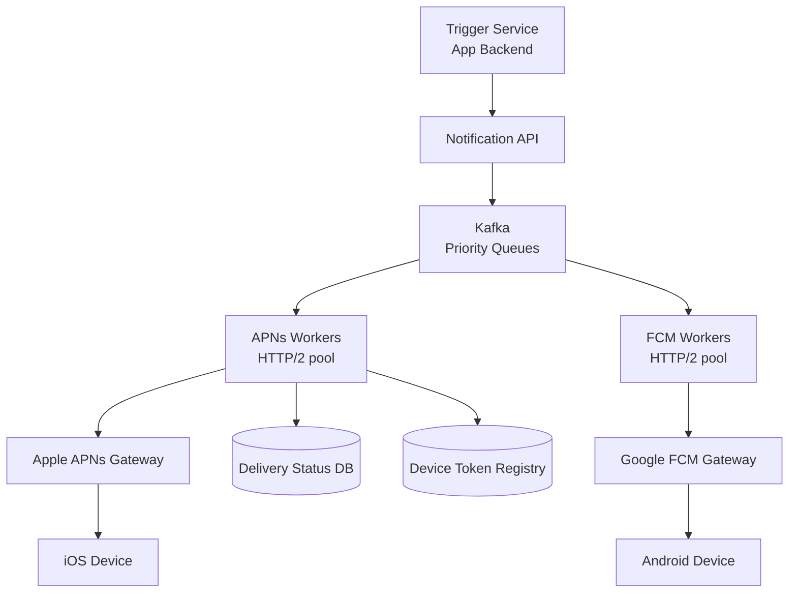

# Design a Push Notification Service

**Difficulty**: 🟡 Intermediate
**Reading Time**: Coming Soon
**Interview Frequency**: High

---

> 🚧 **Full article coming soon.** This stub gives you the essentials to start thinking about this problem.

---

## The Core Problem

Delivering 1 billion push notifications per day through Apple (APNs) and Google (FCM) gateways — which have their own rate limits, connection management requirements, and retry semantics — while tracking delivery status for each notification and handling invalid/expired device tokens at scale.

## Functional Requirements

- Send push notifications to iOS (APNs) and Android (FCM) devices
- Support real-time (< 5s) and scheduled/delayed notifications
- Track delivery status: queued, sent to gateway, delivered, failed
- Handle bulk sends (e.g., broadcast to all 10M users of an app)

## Non-Functional Requirements

| Requirement | Target |
|-------------|--------|
| Throughput | 1B notifications/day (~11,600/sec) |
| Delivery latency | p99 < 5 seconds for real-time |
| Reliability | 99.9% delivery for non-expired tokens |
| Scale | 10M apps, 10B registered devices |

## Back-of-Envelope Estimates

- **Peak throughput**: 1B/day with marketing blasts → peak 500K/sec during prime-time sends
- **Device token storage**: 10B devices × 100 bytes per token record = 1TB device registry
- **Retry volume**: 5% delivery failures × 1B/day = 50M retries/day (must not storm gateways)

## Key Design Decisions

1. **Queue-Based Architecture with Priority Lanes** — don't send directly to APNs/FCM; route through Kafka; use separate queues for critical (transactional alerts, 2FA) vs marketing notifications; critical gets dedicated workers with lower latency SLA.
2. **Connection Pool to APNs/FCM** — APNs requires persistent HTTP/2 connections (not per-request); maintain pool of 100 connections to APNs; each connection handles 1,000 concurrent streams; total: 100,000 in-flight notifications per connection pool.
3. **Token Cleanup on 410 Gone** — when APNs/FCM returns "device token invalid/expired" (HTTP 410), immediately delete from device registry; sending to dead tokens wastes quota and triggers APNs rate limiting.

## High-Level Architecture

## Top Interview Questions for This Problem

| Question | Tests |
|----------|-------|
| How do you send a push notification to 100M users in under 5 minutes? | Parallel workers, fan-out |
| How do you handle APNs rate limiting when sending marketing blasts? | Token bucket, backpressure |
| How do you ensure a 2FA code notification is delivered in under 3 seconds? | Priority queues, dedicated workers |

## Related Concepts

- [Webhook notification system for server-to-server delivery](./webhook-notification)
- [Scalable email service for comparable delivery challenges](./scalable-email-service)

---

*📚 Full deep-dive with multiple approaches, trade-off tables, and pseudocode coming soon.*

## 📚 Resources & References

| Resource | Type | What You'll Learn |
|----------|------|------------------|
| [ByteByteGo — Push Notification Service Design](https://www.youtube.com/@ByteByteGo) | 📺 YouTube | Search "push notification design" — FCM/APNs integration and fan-out |
| [Airship Engineering: Push at 15 Billion Notifications/Day](https://docs.airship.com/platform/mobile/push-notifications/) | 📚 Docs | Production-scale push infrastructure from a leading push platform |
| [iOS Push Notification Best Practices](https://developer.apple.com/documentation/usernotifications/sending_notifications_to_apple_devices) | 📚 Docs | APNs connection, token management, and failure handling |
| [Google Firebase FCM Architecture](https://firebase.google.com/docs/cloud-messaging/concept-options) | 📚 Docs | FCM message delivery types, QoS, and TTL behavior |
| [High Scalability: Push Notification Architecture](http://highscalability.com) | 📖 Blog | Case studies on delivering billions of push notifications reliably |
