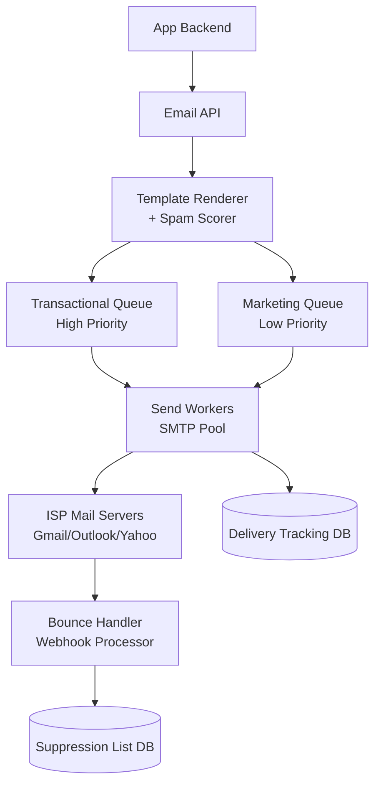
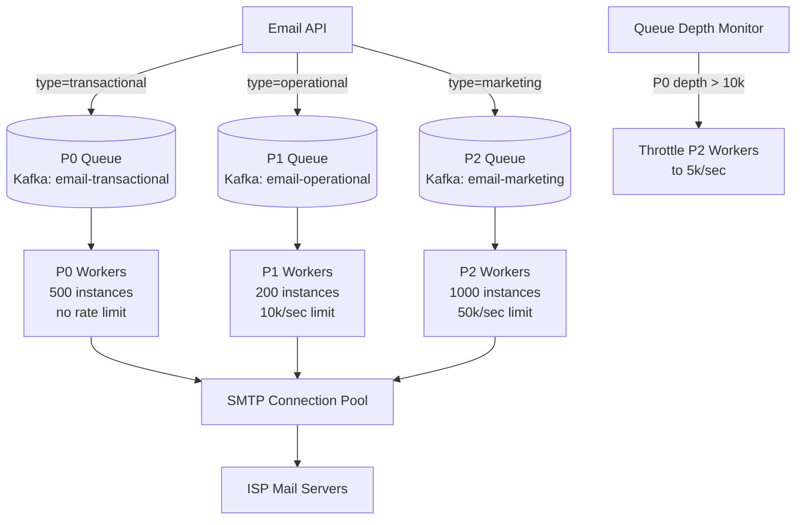
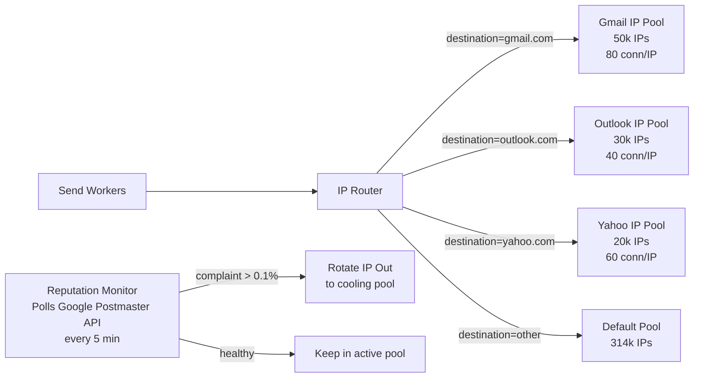
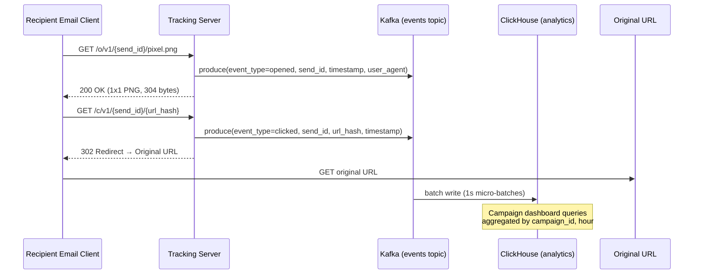

# Design a Scalable Email Service (SendGrid)

**Difficulty**: 🟡 Intermediate
**Reading Time**: Coming Soon
**Interview Frequency**: Medium

---

> 🚧 **Full article coming soon.** This stub gives you the essentials to start thinking about this problem.

---

## The Core Problem

Sending 10 billion emails per day with high deliverability requires more than just SMTP at scale. Gmail and Outlook block senders with >0.3% spam complaint rates, meaning a single marketing blast that triggers complaints can get an entire IP range blacklisted, blocking all transactional emails (password resets, receipts) from the same provider.

## Functional Requirements

- Send transactional emails (receipts, 2FA codes) within 5 seconds
- Send marketing campaigns to millions of recipients
- Track delivery status: queued, sent, delivered, opened, clicked, bounced
- Handle unsubscribes and bounce list management

## Non-Functional Requirements

| Requirement | Target |
|-------------|--------|
| Transactional latency | p99 < 5 seconds inbox delivery |
| Throughput | 10B emails/day (~115,000/sec) |
| Deliverability | > 99% inbox rate for transactional |
| Bounce handling | Process bounce notifications within 1 minute |

## Back-of-Envelope Estimates

- **Send rate**: 10B emails/day ÷ 86,400 = ~115,000 emails/sec
- **IP pool size**: Each IP sends max 1,000 emails/hour to major providers → 115,000/sec × 3600 = 414M/hour ÷ 1,000 = 414,000 IPs needed (use shared pools with reputation management)
- **Bounce storage**: 2% bounce rate × 10B/day × 100 bytes = 20GB/day bounce records

## Key Design Decisions

1. **IP Pool Segregation** — separate dedicated IP pools for transactional vs marketing; a marketing campaign that causes spam complaints won't taint transactional IPs; new customers start on shared pool during "IP warming" (gradually increasing send volume).
2. **Queue-Based Sending with Priority Lanes** — transactional (2FA, receipts) goes to high-priority queue with dedicated workers; marketing campaigns use low-priority queue that throttles during high transactional load; never let marketing delay password resets.
3. **Bounce Classification and Suppression** — hard bounces (invalid address) → immediately add to suppression list, never retry; soft bounces (mailbox full) → retry with exponential backoff up to 72 hours; process bounce webhooks from ISPs in real-time.

## High-Level Architecture



## API Contract

The inbound API is the contract between customers and the platform. Its design determines what the queue message looks like, what validation is synchronous vs. asynchronous, and what guarantees are made at accept time.

### Send Email Endpoint

```http
POST /v3/mail/send
Authorization: Bearer {api_key}
Content-Type: application/json

{
  "personalizations": [
    {
      "to": [{"email": "user@example.com", "name": "Alice"}],
      "dynamic_template_data": {
        "first_name": "Alice",
        "order_id": "ORD-98765",
        "amount": "$49.99"
      }
    }
  ],
  "from": {"email": "noreply@shop.example.com", "name": "ExampleShop"},
  "reply_to": {"email": "support@shop.example.com"},
  "template_id": "d-3f0a8b2c1e4d5f6a7b8c9d0e1f2a3b4c",
  "mail_settings": {
    "bypass_list_management": {"enable": false},
    "sandbox_mode": {"enable": false}
  },
  "tracking_settings": {
    "click_tracking": {"enable": true},
    "open_tracking": {"enable": true}
  },
  "categories": ["transactional", "order-confirmation"],
  "send_at": null
}
```

**Synchronous validations** (return 400 before accepting):
- API key valid and not revoked
- `from` domain is verified (SPF/DKIM configured)
- Recipient address passes syntax check (RFC 5321)
- Template ID exists and belongs to this account
- `to` address not in global suppression list

**Asynchronous processing** (after 202 Accepted):
- Template rendering with variable substitution
- Spam score check (SpamAssassin or equivalent)
- IP pool assignment
- SMTP delivery with retry

### Webhook Delivery Status Callback

```json
POST https://customer-webhook.example.com/email/events
Content-Type: application/json

[
  {
    "event": "delivered",
    "email": "user@example.com",
    "send_id": "3d4e5f6a-7b8c-9d0e-1f2a-3b4c5d6e7f8a",
    "timestamp": 1748764800,
    "smtp_id": "<20260601120000.12345.1@sendgrid.net>",
    "sg_message_id": "3d4e5f6a7b8c9d0e.filter0001p3mdw1-1.1"
  },
  {
    "event": "bounce",
    "email": "invalid@example.com",
    "send_id": "9a8b7c6d-5e4f-3a2b-1c0d-9e8f7a6b5c4d",
    "timestamp": 1748764805,
    "reason": "550 5.1.1 The email account does not exist",
    "status": "5.1.1",
    "type": "bounce"
  }
]
```

Webhooks are batched (up to 1,000 events per POST) and delivered with at-least-once semantics. Customers must respond with HTTP 200 within 5 seconds or the platform retries with exponential backoff for up to 24 hours.

---

## Top Interview Questions for This Problem

| Question | Tests |
|----------|-------|
| How do you prevent a marketing campaign from blocking transactional emails? | Queue priority, resource isolation |
| What happens when Gmail starts rejecting your emails due to spam complaints? | IP reputation, warming, feedback loops |
| How do you implement open and click tracking without compromising deliverability? | Tracking pixels, link wrapping trade-offs |
| How do you handle a customer trying to send to 100M recipients in a single API call? | Input validation, campaign chunking, backpressure |
| What happens when a customer's DKIM key expires mid-campaign? | Key rotation, in-flight email handling, alerting |
| How do you guarantee exactly-once delivery vs. at-least-once? | Idempotency keys, SMTP acknowledgment semantics |
| How would you design the unsubscribe flow to be GDPR-compliant? | List management, suppression propagation, audit log |

---

## Rate Limiting and Multi-Tenant Fairness

Without per-customer rate limiting, a single large customer can monopolize the sending pipeline and starve smaller customers of queue capacity or IP pool slots.

### Rate Limit Tiers

| Tier | Emails/Day | Burst (per minute) | Dedicated IPs? |
|------|-----------|-------------------|----------------|
| Free | 100 | 10 | No (shared pool) |
| Essentials | 50,000 | 1,000 | No |
| Pro | 1,500,000 | 50,000 | Optional add-on |
| Premier | Unlimited | Negotiated | Yes (min 3 IPs) |

Rate limiting is enforced at the API layer using a token bucket algorithm (Redis `INCRBY` + `EXPIRE`). Customers that hit the limit receive a `429 Too Many Requests` response with a `Retry-After` header. The API never silently drops emails — it rejects at the boundary and forces the caller to handle backpressure explicitly.

### Campaign Chunking for Large Sends

A single request to send to 10M recipients is rejected at the API layer. Customers must split campaigns into batches (max 1,000 recipients per API call). The platform provides a Campaign API that handles chunking internally:

```
POST /v3/campaigns/{campaign_id}/send
→ Platform splits recipient list into 1,000-recipient batches
→ Enqueues batches to marketing queue at controlled rate (50k/sec max)
→ Returns campaign_id for status polling
```

This prevents a single large campaign from instantaneously flooding the P2 queue with 10M messages, which would cause excessive memory pressure on Kafka brokers.

## Related Concepts

- [Push notification service for mobile delivery comparison](./push-notification-service)
- [Webhook notification system for delivery callbacks](./webhook-notification)

---

## Component Deep Dive 1: Queue Architecture and Priority Lanes

The delivery queue is the most critical architectural component in a scalable email service. At 115,000 emails/second the queue must absorb massive burst traffic (marketing blasts sending 50M emails in minutes), enforce strict priority so a marketing campaign never delays a 2FA code, and provide durable storage so no email is lost during worker crashes.

### Why a Single Queue Fails

A naive single-queue approach collapses under real-world conditions. When a customer fires a marketing campaign for 10M recipients, those 10M jobs flood the queue ahead of any transactional message submitted afterward. A user waiting for their password reset email sits behind 10M marketing jobs — deliverable in hours, not seconds. At 115k emails/sec, a single consumer pool is also a bottleneck: one slow ISP connection stalls the whole pipeline.

### Multi-Lane Queue Design

The architecture requires at minimum three separate queues with dedicated worker pools and independent rate limiters:

1. **Transactional (P0)**: 2FA codes, password resets, purchase receipts. SLA: p99 < 5 seconds. Workers: dedicated, never shared. Backpressure: none — this queue always drains.
2. **Operational (P1)**: Shipping notifications, account alerts. SLA: p99 < 30 seconds. Workers: shared with P0 overflow.
3. **Marketing (P2)**: Newsletters, promotions. SLA: best-effort, hours acceptable. Workers: throttled to preserve P0/P1 capacity. Paused when queue depth of P0 exceeds threshold.



### Queue Technology Trade-offs

| Approach | Latency | Throughput | Trade-off |
|----------|---------|------------|-----------|
| Kafka (partitioned topics per priority) | 5–15ms enqueue | 1M+ msg/sec per broker | No per-message TTL; must implement retry logic in consumers; excellent for replay on failure |
| RabbitMQ (priority queue plugin, levels 0–9) | 1–5ms enqueue | ~100k msg/sec per node | Native priority support; per-message TTL; more complex clustering; memory pressure at scale |
| Redis Streams (XADD + consumer groups) | <1ms enqueue | 500k msg/sec | Lowest latency; limited retention (memory-bound); best for transient P0 lane |

**Recommended**: Kafka for P1/P2 (durability, replay), Redis Streams for P0 (ultra-low latency), with a Kafka → Redis bridge for overflow.

---

## Component Deep Dive 2: IP Pool Management and Reputation Scoring

Sending reputation is the hidden scalability constraint of email. ISPs (Gmail, Outlook, Yahoo) maintain per-IP and per-domain reputation scores. A single IP sending 1M emails with a 1% spam complaint rate can land in Gmail's spam folder for every email sent from that IP — including password resets. At scale this means a single bad actor customer can blacklist thousands of IPs shared by other customers.

### Internal Mechanics

Each outbound SMTP connection is assigned an IP from a pool based on:
1. **Customer tier**: Dedicated IPs for enterprise customers; shared rotating pools for starter tier.
2. **Email type**: Transactional IPs are never used for marketing. Even a single marketing email from a transactional IP can contaminate its reputation.
3. **Sending domain**: DKIM signatures are per-domain. A customer's domain reputation travels with them across IP rotation.
4. **Real-time reputation score**: An IP scoring below threshold (e.g., Google Postmaster Tools complaint rate > 0.1%) is immediately rotated out of the active pool and enters a "cooling" state.

### IP Warming Protocol

New IPs start with zero reputation. ISPs rate-limit unknown IPs aggressively — Gmail allows roughly 200–500 emails/day from a fresh IP. IP warming is a structured ramp:

| Day | Max Emails/Day | Constraint |
|-----|---------------|------------|
| 1–3 | 500 | Only engaged users (opened in last 30 days) |
| 4–7 | 5,000 | Engaged + recent signups |
| 8–14 | 50,000 | Full list, exclude hard-bounce domains |
| 15–30 | 500,000 | Full volume |

At 10B emails/day across a 414k IP pool, ~5% of IPs are in warming state at any time (~20,000 IPs), handling ~0.1% of total volume.

### Scale Behavior at 10x Load

At 1.15M emails/sec (10x baseline), the reputation management system faces new pressure: a single viral marketing campaign can exhaust the entire warm IP pool for one ISP segment. Mitigation requires partitioned IP pools per ISP: `gmail-pool-01`, `outlook-pool-01`, `yahoo-pool-01` — each with independent reputation and throttle state. Rate-limiting per ISP is enforced at the SMTP connection pool layer: Gmail accepts ~80 concurrent SMTP connections per IP, Outlook ~40.



---

## Component Deep Dive 3: Bounce and Complaint Processing

Every hard bounce and spam complaint must be processed within 60 seconds and written to the suppression list before the next send attempt to that address. Missing a bounce and re-sending to a dead address wastes sending quota and damages reputation.

### Bounce Classification

ISPs send bounce notifications via two mechanisms:
1. **SMTP-time rejection**: The receiving server rejects the email during the SMTP transaction (5xx response). The send worker captures this immediately and writes it to the bounce queue.
2. **Asynchronous bounce messages (DSN)**: The receiving server accepts the email but sends a Delivery Status Notification back to the `Return-Path` address (typically `bounce+<recipient_hash>@bouncehandler.yourdomain.com`). A dedicated inbound SMTP server parses these messages.

Bounce codes and actions:
| Code | Type | Action | Retry? |
|------|------|--------|--------|
| 550 | Hard — invalid address | Suppress permanently | No |
| 421 | Soft — server busy | Retry after 15 min | Up to 72 hours |
| 452 | Soft — mailbox full | Retry after 1 hour | Up to 24 hours |
| 550 4.2.1 | Soft — account disabled | Retry after 6 hours | Up to 48 hours |
| 541 | Spam block | Suppress for 30 days | No |

### Suppression List Architecture

The suppression list is a globally consistent key-value store keyed on email address hash:

- **Writes**: Synchronous write path via the bounce processor; uses write-ahead log for durability.
- **Reads**: Every send worker checks the suppression list before enqueuing to SMTP. Read path uses a local Bloom filter (false positive rate 0.01%) to avoid network round-trips for clean addresses.
- **Scale**: At 10B emails/day with 2% hard bounce rate, ~200M addresses are suppressed. A 64-bit hash per address = 1.6GB RAM for a Bloom filter at 0.01% false positive rate. Backed by Cassandra for durable storage with TTL-based expiry.

---

## Data Model

### Email Send Request

```sql
-- Core email record
CREATE TABLE email_sends (
    send_id         UUID PRIMARY KEY,
    account_id      UUID NOT NULL,
    campaign_id     UUID,                          -- NULL for transactional
    email_type      ENUM('transactional','operational','marketing') NOT NULL,
    from_address    VARCHAR(254) NOT NULL,
    to_address      VARCHAR(254) NOT NULL,
    subject         VARCHAR(998) NOT NULL,
    body_html_s3    VARCHAR(512),                  -- S3 key for large HTML bodies
    body_text_s3    VARCHAR(512),
    template_id     UUID,
    substitutions   JSONB,                         -- Template variable substitutions
    send_at         TIMESTAMPTZ,                   -- NULL = immediate
    created_at      TIMESTAMPTZ NOT NULL DEFAULT NOW(),
    ip_assigned     INET,
    status          ENUM('queued','sending','sent','delivered','bounced','complained','unsubscribed') NOT NULL DEFAULT 'queued',
    sent_at         TIMESTAMPTZ,
    delivered_at    TIMESTAMPTZ,
    bounce_code     VARCHAR(20),
    bounce_reason   TEXT
);

CREATE INDEX idx_email_sends_account_created ON email_sends(account_id, created_at DESC);
CREATE INDEX idx_email_sends_campaign ON email_sends(campaign_id) WHERE campaign_id IS NOT NULL;
CREATE INDEX idx_email_sends_status ON email_sends(status, created_at) WHERE status IN ('queued','sending');

-- Suppression list
CREATE TABLE suppression_list (
    email_hash      BIGINT PRIMARY KEY,            -- xxHash64 of normalized email
    email_address   VARCHAR(254) NOT NULL,
    account_id      UUID,                          -- NULL = global suppression (spam complaint)
    suppression_type ENUM('hard_bounce','spam_complaint','unsubscribe','manual') NOT NULL,
    source_send_id  UUID,
    created_at      TIMESTAMPTZ NOT NULL DEFAULT NOW(),
    expires_at      TIMESTAMPTZ                    -- NULL = permanent
);

CREATE INDEX idx_suppression_email ON suppression_list(email_address);
CREATE INDEX idx_suppression_account ON suppression_list(account_id, email_address);

-- Delivery events for tracking
CREATE TABLE delivery_events (
    event_id        UUID PRIMARY KEY DEFAULT gen_random_uuid(),
    send_id         UUID NOT NULL REFERENCES email_sends(send_id),
    event_type      ENUM('queued','smtp_attempt','smtp_accepted','smtp_rejected',
                         'delivered','opened','clicked','unsubscribed','complained') NOT NULL,
    event_at        TIMESTAMPTZ NOT NULL DEFAULT NOW(),
    ip_address      INET,                          -- sending IP for this attempt
    smtp_response   VARCHAR(512),                  -- raw SMTP response line
    user_agent      TEXT,                          -- for open/click events
    click_url       TEXT                           -- for click events
);

CREATE INDEX idx_delivery_events_send ON delivery_events(send_id, event_at DESC);

-- IP pool management
CREATE TABLE ip_pool_members (
    ip_address      INET PRIMARY KEY,
    pool_name       VARCHAR(100) NOT NULL,          -- 'gmail-transactional', 'marketing-01', etc.
    status          ENUM('warming','active','cooling','retired') NOT NULL,
    reputation_score NUMERIC(5,2),                 -- 0.00-100.00 from ISP feedback
    daily_send_count BIGINT DEFAULT 0,
    warming_day     SMALLINT,                      -- NULL if fully warmed
    last_updated    TIMESTAMPTZ NOT NULL DEFAULT NOW()
);

CREATE INDEX idx_ip_pool_pool_status ON ip_pool_members(pool_name, status);
```

---

## Scale Bottlenecks

| Traffic Level | Component That Breaks | Symptoms | Mitigation |
|---------------|----------------------|----------|------------|
| 10x baseline (1.15M/sec) | SMTP connection pool exhaustion | Send worker timeout spikes; queue depth grows unbounded for P1/P2 | Pre-warm 10x IP pool capacity; shard SMTP workers by destination ISP; add backpressure signal to marketing queue |
| 100x baseline (11.5M/sec) | Suppression list read latency | Bloom filter RAM exceeds single node (16GB); Cassandra read p99 climbs above 50ms, blocking send workers | Shard Bloom filter across 16 nodes by email hash range; read-through cache with 1s TTL |
| 1000x baseline (115M/sec) | Kafka topic partition throughput ceiling | Consumer lag on email-transactional exceeds 1M messages; p0 SLA violated | Increase partitions from 100 to 10,000; separate Kafka clusters per ISP segment; route marketing to Pulsar which handles higher per-node throughput |
| 10x bounce volume | Bounce ingest SMTP server | DSN messages arrive faster than parser threads can handle; suppression writes lag by >60s; re-sends to bounced addresses occur | Dedicated bounce ingestion cluster with 10x over-provisioned threads; async write to suppression with optimistic locking; real-time bounce event stream via Kafka |
| Campaign of 100M recipients | Template renderer | Single renderer instance serializes substitution for each recipient; 100M × 5ms = 8 days | Horizontally scale renderers; pre-render static segments; use S3 for rendered HTML bodies, store only S3 key in the queue message |

---

## How Twilio SendGrid Built This

SendGrid processes over 100 billion emails per month (approximately 38,000 emails/second average, 200,000+ during peak campaigns) for 80,000+ customers including companies like Airbnb, Spotify, and Uber.

**Technology Stack**: SendGrid's sending infrastructure is built primarily on Go for the SMTP worker layer and Python for the API and analytics pipeline. Kafka is used for the inter-service message bus. The suppression list is backed by a custom sharded PostgreSQL cluster with a Redis read-through cache. They migrated from a custom MTA (Mail Transfer Agent) to a hybrid model where they manage the SMTP connection pooling layer but hand off actual SMTP delivery to a fleet of specialized "sending nodes."

**Non-Obvious Architecture Decision — Per-Customer IP Reputation Isolation**: SendGrid assigns customers to IP pools based on sending behavior. A customer who suddenly sends to a list with 10% hard bounces (a sign of a purchased list) is automatically moved to a "quarantine pool" of lower-reputation IPs. This protects other customers on shared pools. The detection uses a sliding window: if bounce rate for a customer exceeds 5% over any 1-hour window, they are moved immediately. This decision — auto-quarantine rather than alert and wait — was critical to maintaining a 99%+ inbox rate for transactional customers.

**Specific Numbers from Published Sources**:
- 100B+ emails/month across 80,000+ customers
- 40,000+ sending IPs managed
- 99.97% uptime SLA for transactional tier
- SPF/DKIM/DMARC authentication enforced on 100% of outbound mail since 2019

SendGrid also runs a feedback loop program (FBL) with all major ISPs. When Yahoo, Microsoft, or AOL report a spam complaint back to SendGrid via ARF (Abuse Reporting Format) messages, an automated pipeline processes these within 30 seconds and suppresses the complainant address globally across all senders.

Source: [SendGrid Engineering Blog](https://sendgrid.com/blog/building-sendgrid/) and Twilio investor relations disclosures (2021 acquisition).

---

## Interview Angle

**What the interviewer is testing:** The ability to reason about multi-tenant sending reputation and the insight that email deliverability is a social/adversarial problem — not just an infrastructure throughput problem. ISPs are active participants who change their filtering rules dynamically.

**Common mistakes candidates make:**

1. **Treating all emails as a single queue**: Designing a single queue of 10B emails/day without priority separation guarantees that marketing campaigns will delay time-sensitive transactional emails. The correct answer always separates queues by SLA class with dedicated worker pools.

2. **Ignoring IP warming**: Candidates often design "just add more IPs" as a scaling solution without understanding that new IPs have zero reputation and ISPs will rate-limit them to ~500 emails/day. A pool of 100k fresh IPs is actually less useful than 10k warm IPs for the first 30 days.

3. **Bounce handling as a background job**: Many candidates treat bounce processing as an async low-priority cleanup task. In reality, missing a hard bounce and sending a second email to the same dead address within minutes damages reputation scores immediately. Bounce suppression must be near-synchronous (< 60 seconds end-to-end) and must block the next send attempt to that address.

**The insight that separates good from great answers:** Multi-tenancy means a single customer's bad behavior (sending to a purchased list) can degrade the service for all other customers. The key architectural decision is per-customer reputation isolation: separate IP pools, per-customer bounce rate monitoring, and automated quarantine with zero human intervention. Great candidates proactively discuss how to protect the platform from abuse by its own users, not just from external factors.

---

## Key Numbers to Remember

| Metric | Value | Context |
|--------|-------|---------|
| Peak send rate | 115,000 emails/sec | 10B emails/day ÷ 86,400 sec |
| IP pool size | 40,000–400,000 IPs | Each ISP allows ~1,000 emails/hour/IP |
| IP warming ramp | Day 1: 500/day → Day 30: 500k/day | New IPs rate-limited by ISPs |
| Gmail spam complaint threshold | 0.1% | Exceeding this risks blacklisting |
| Hard bounce rate on clean lists | < 2% | Above 5% signals a purchased/old list |
| Bounce suppression SLA | < 60 seconds | Time from bounce to suppression list write |
| SMTP connections per IP | 40–80 concurrent | Varies by ISP; exceeding causes 421 throttles |
| Bloom filter RAM for 200M addresses | ~1.6 GB | 64-bit hash, 0.01% false positive rate |
| DSN (async bounce) processing lag | 30 sec p99 | Time from DSN receipt to suppression write |

---

## Open and Click Tracking Architecture

Tracking whether a recipient opened an email or clicked a link is a fundamental product requirement for any email service. However, the implementation has direct deliverability implications — spam filters penalize emails that look like tracking-heavy marketing, and privacy regulations (GDPR, CAN-SPAM, Apple MPP) complicate accuracy.

### Open Tracking: Tracking Pixel

A 1x1 transparent PNG is embedded in the HTML body at render time. The `src` URL is unique per recipient:

```
https://track.yourdomain.com/o/v1/{encoded_send_id}/{recipient_hash}.png
```

When the recipient's email client loads images, a GET request hits the tracking server. The server decodes the send_id, writes an `opened` event to the delivery_events table, and returns the 1x1 PNG (304 bytes). The tracking subdomain must use a dedicated domain separate from sending IPs — mixing tracking requests with SMTP can create DNS reputation issues.

**Apple Mail Privacy Protection (MPP)**: Since iOS 15 (2021), Apple pre-fetches all remote images in Mail, triggering open pixels before the user actually opens the email. This inflates open rates by 30–50% for Apple Mail users. Mitigation: tag Apple MPP opens separately using User-Agent detection (`AppleExchangeWebServices`), exclude them from engagement-based IP pool assignment decisions.

### Click Tracking: Link Wrapping

All URLs in the email body are replaced at render time with redirect URLs:

```
https://click.yourdomain.com/c/v1/{encoded_send_id}/{url_hash}
```

The redirect server logs the click event and issues a 302 redirect to the original URL. Latency budget: the redirect must complete in < 200ms p99 or users notice the delay.

**Deliverability risk**: Some spam filters penalize emails where all links point to a different domain than the sender. Mitigation: use a tracking domain that matches the sending domain (e.g., `click.customer.com` via CNAME), and sign the tracking domain with DKIM.

### Tracking Infrastructure Scale

At 115,000 emails/sec with a 20% click-through rate and average 2 links per email:
- Click tracking requests: 115,000 × 0.20 × 2 = 46,000 redirect requests/sec
- Open tracking requests: 115,000 × 0.40 (open rate) = 46,000 pixel requests/sec
- Total tracking HTTP requests: ~92,000/sec

This is a read-heavy stateless workload — horizontal scaling behind a load balancer with a CDN for the pixel PNG. The write path (event logging) uses Kafka as a buffer, with consumers writing to ClickHouse for analytics queries (campaign performance dashboards require sub-second aggregation over billions of rows).



---

## Authentication: SPF, DKIM, DMARC

Email authentication is not optional at scale — Gmail and Outlook require DMARC alignment for bulk senders (>5,000 emails/day) as of February 2024. Failing authentication causes emails to be rejected or junked silently, with no bounce notification to the sender.

### SPF (Sender Policy Framework)

SPF is a DNS TXT record that lists authorized sending IPs for a domain:

```
v=spf1 ip4:203.0.113.0/24 include:sendgrid.net ~all
```

At scale, a multi-tenant email platform must add all customer sending IPs to the platform's SPF record OR require customers to add an `include:` directive to their own domain's SPF. The platform approach hits SPF's 10 DNS lookup limit. The recommended approach: require customers to use a subdomain (`mail.customer.com`) where the platform controls DNS, enabling per-customer SPF records without lookup limit issues.

### DKIM (DomainKeys Identified Mail)

DKIM adds a cryptographic signature to every outbound email. The receiving server verifies the signature against the public key in DNS. At 115,000 emails/sec, DKIM signing adds ~0.2ms per email using 2048-bit RSA keys — negligible but must be implemented in the hot path (inline in the send worker, not a separate signing service).

Key rotation is a critical operational concern: rotating DKIM keys without a 48-hour overlap (old key still in DNS during TTL expiry) causes delivery failures for in-flight emails.

### DMARC (Domain-based Message Authentication, Reporting & Conformance)

DMARC ties SPF and DKIM together with a policy:

```
v=DMARC1; p=quarantine; rua=mailto:dmarc-reports@customer.com; pct=100
```

- `p=none` — monitor only, no action
- `p=quarantine` — failed emails go to spam folder
- `p=reject` — failed emails are dropped

Gmail's February 2024 mandate: bulk senders must have DMARC policy of at least `p=none`. Senders with `p=reject` see the highest deliverability rates but any misconfiguration (forward chains, mailing lists) drops legitimate mail.

---

## Retry and Exponential Backoff Strategy

Soft bounces require retries. The retry strategy directly affects both deliverability and resource utilization.

```
attempt 1: immediate
attempt 2: +5 minutes
attempt 3: +15 minutes
attempt 4: +1 hour
attempt 5: +4 hours
attempt 6: +12 hours
attempt 7: +24 hours
attempt 8: +48 hours → final attempt, mark as soft_bounce_expired
```

Total retry window: 72 hours for transactional, 24 hours for marketing. Retry jobs are stored as delayed Kafka messages using a separate `email-retry` topic with per-partition delay simulation (Kafka does not natively support per-message delay; use a time-indexed secondary store like Redis Sorted Set with score = scheduled_send_time, polled every 30 seconds by a scheduler process).

**Jitter**: At 115k emails/sec, a simultaneous retry wave (all emails retried at exactly +5min) can overwhelm the SMTP worker pool. Add jitter: `delay = base_delay × (0.9 + random(0, 0.2))`. This spreads the retry load over a ±10% window.

---

## Deliverability Monitoring Pipeline

Sending emails is only half the problem. Knowing whether they arrived requires active monitoring via ISP feedback loops and proactive inbox placement testing.

### Feedback Loop (FBL) Integration

Major ISPs operate abuse feedback programs:
- **Microsoft SNDS**: Reports IPs with high complaint or trap-hit rates; daily digest
- **Yahoo/AOL FBL**: ARF-format complaint emails sent to `abuse@yourdomain.com` within minutes of complaint
- **Gmail**: Uses Google Postmaster Tools API (poll every 5 minutes for domain and IP reputation scores)

FBL pipeline: Inbound ARF parser → Kafka topic `fbl-complaints` → consumer writes to suppression_list and delivery_events → aggregate complaint rate per customer per hour → trigger quarantine if rate > 0.5%.

### Inbox Placement Testing (Seed Lists)

Before sending a major campaign, the platform sends to a "seed list" — controlled mailboxes at Gmail, Outlook, Yahoo, and major providers. The result shows inbox vs. spam placement per ISP before the real campaign sends. Seed list testing catches deliverability issues for a customer's specific domain before they burn reputation on 10M real recipients.

Seed list check latency: 90 seconds from send to classification result. Automated: if seed list shows > 20% spam placement at any ISP, block campaign and alert customer.

---

*📚 Full deep-dive with multiple approaches, trade-off tables, and pseudocode coming soon.*

## 📚 Resources & References

| Resource | Type | What You'll Learn |
|----------|------|------------------|
| [ByteByteGo — Design an Email Service](https://www.youtube.com/@ByteByteGo) | 📺 YouTube | Search "email service design" — SMTP, storage, and deliverability at scale |
| [Mailchimp Engineering: Scaling Email Delivery](https://mailchimp.com/developer/transactional/docs/smtp-integration/) | 📚 Docs | Transactional email best practices and deliverability considerations |
| [SendGrid Architecture: Delivering 100B Emails/Month](https://sendgrid.com/blog/building-sendgrid/) | 📖 Blog | Infrastructure behind one of the world's largest email delivery platforms |
| [Gmail Architecture: IMAP at Scale](https://research.google/pubs/pub39977/) | 📖 Blog | Google's approach to scalable email storage and retrieval |
| [Email Deliverability: SPF, DKIM, DMARC](https://support.google.com/a/answer/81126) | 📚 Docs | DNS-based authentication requirements for high-deliverability email |
