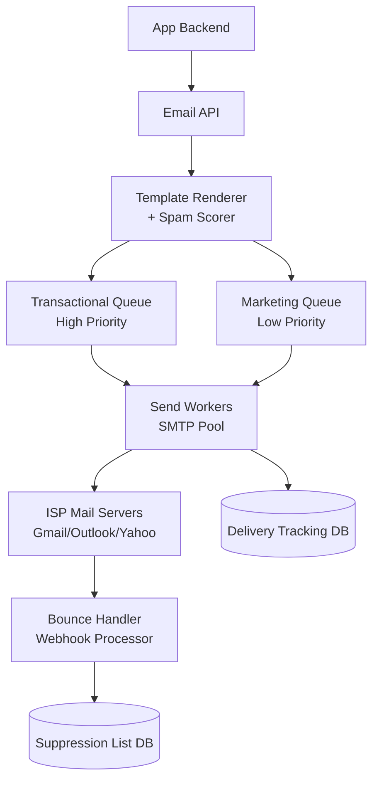

# Design a Scalable Email Service (SendGrid)

**Difficulty**: 🟡 Intermediate
**Reading Time**: Coming Soon
**Interview Frequency**: Medium

---

> 🚧 **Full article coming soon.** This stub gives you the essentials to start thinking about this problem.

---

## The Core Problem

Sending 10 billion emails per day with high deliverability requires more than just SMTP at scale. Gmail and Outlook block senders with >0.3% spam complaint rates, meaning a single marketing blast that triggers complaints can get an entire IP range blacklisted, blocking all transactional emails (password resets, receipts) from the same provider.

## Functional Requirements

- Send transactional emails (receipts, 2FA codes) within 5 seconds
- Send marketing campaigns to millions of recipients
- Track delivery status: queued, sent, delivered, opened, clicked, bounced
- Handle unsubscribes and bounce list management

## Non-Functional Requirements

| Requirement | Target |
|-------------|--------|
| Transactional latency | p99 < 5 seconds inbox delivery |
| Throughput | 10B emails/day (~115,000/sec) |
| Deliverability | > 99% inbox rate for transactional |
| Bounce handling | Process bounce notifications within 1 minute |

## Back-of-Envelope Estimates

- **Send rate**: 10B emails/day ÷ 86,400 = ~115,000 emails/sec
- **IP pool size**: Each IP sends max 1,000 emails/hour to major providers → 115,000/sec × 3600 = 414M/hour ÷ 1,000 = 414,000 IPs needed (use shared pools with reputation management)
- **Bounce storage**: 2% bounce rate × 10B/day × 100 bytes = 20GB/day bounce records

## Key Design Decisions

1. **IP Pool Segregation** — separate dedicated IP pools for transactional vs marketing; a marketing campaign that causes spam complaints won't taint transactional IPs; new customers start on shared pool during "IP warming" (gradually increasing send volume).
2. **Queue-Based Sending with Priority Lanes** — transactional (2FA, receipts) goes to high-priority queue with dedicated workers; marketing campaigns use low-priority queue that throttles during high transactional load; never let marketing delay password resets.
3. **Bounce Classification and Suppression** — hard bounces (invalid address) → immediately add to suppression list, never retry; soft bounces (mailbox full) → retry with exponential backoff up to 72 hours; process bounce webhooks from ISPs in real-time.

## High-Level Architecture

## Top Interview Questions for This Problem

| Question | Tests |
|----------|-------|
| How do you prevent a marketing campaign from blocking transactional emails? | Queue priority, resource isolation |
| What happens when Gmail starts rejecting your emails due to spam complaints? | IP reputation, warming, feedback loops |
| How do you implement open and click tracking without compromising deliverability? | Tracking pixels, link wrapping trade-offs |

## Related Concepts

- [Push notification service for mobile delivery comparison](./push-notification-service)
- [Webhook notification system for delivery callbacks](./webhook-notification)

---

*📚 Full deep-dive with multiple approaches, trade-off tables, and pseudocode coming soon.*
