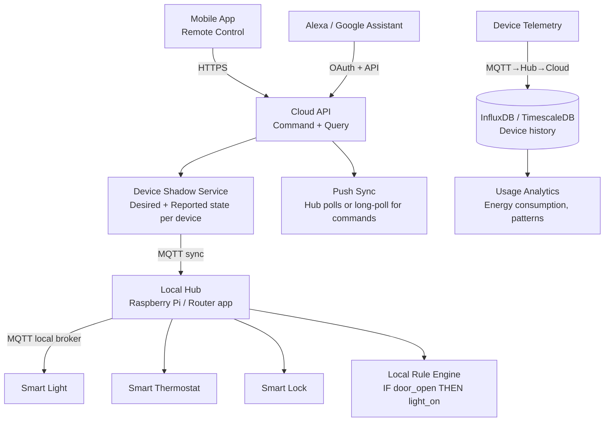
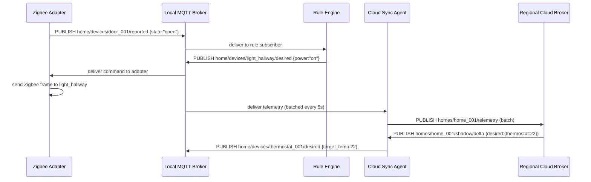
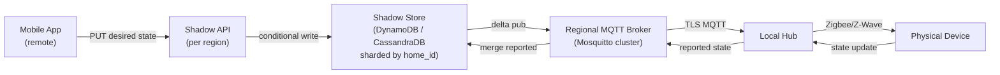
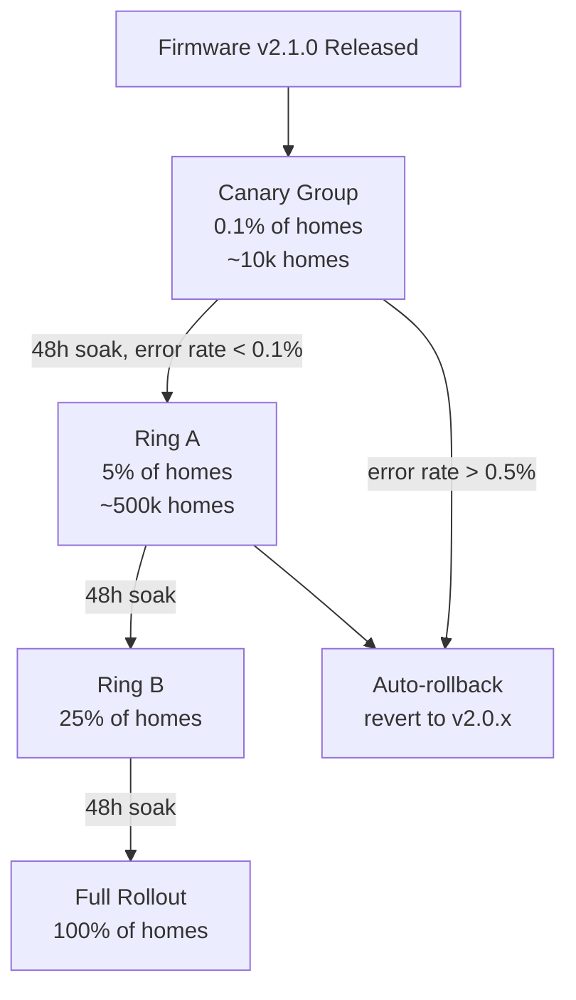
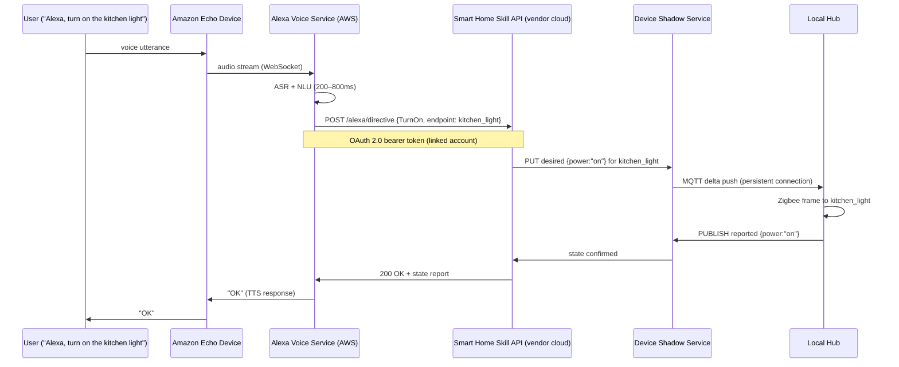

# Design a Smart Home IoT System

**Difficulty**: 🔴 Advanced | **Codemania #60**
**Reading Time**: ~14 min
**Interview Frequency**: Medium

---

## The Core Problem

Connecting 100 IoT devices per home (lights, thermostats, locks, cameras) with less than 100ms response latency for local commands, remote access from anywhere, voice control (Alexa/Google), and rule-based automation ("if front door opens → turn on hallway light"). The critical constraint: local control must work even when the internet is down.

---

## Functional Requirements

- Control smart devices (on/off, dim, lock, set temperature)
- Local control: < 100ms latency for commands within home network
- Remote control: < 1 second latency for commands from outside home
- Automation rules: "if door opens → turn on light", "if temp > 25°C → turn on AC"
- Voice control via Alexa/Google Assistant
- Device status: show current state of all devices
- Multi-user: family members with different permission levels

## Non-Functional Requirements

| Requirement | Target |
|-------------|--------|
| Devices per home | 100 devices |
| Local command latency | < 100ms (local network) |
| Remote command latency | < 1 second (via cloud) |
| Offline capability | Local control works without internet |
| Scale | 10M homes = 1B devices globally |
| Availability | 99.9% for local control (independent of cloud uptime) |

---

## Back-of-Envelope Estimates

- **Device telemetry**: 100 devices/home × 1 message/10s = 10 messages/sec/home
- **Global telemetry**: 10M homes × 10 messages/sec = 100M messages/sec globally (massive — needs regional processing)
- **Local hub load**: 10 messages/sec on a Raspberry Pi — trivial
- **Command latency budget (local)**: App → Hub (LAN) 5ms + Hub → Device (Zigbee/WiFi) 20ms = 25ms total (well under 100ms)
- **Command latency budget (remote)**: App → Cloud 50ms + Cloud → Hub 80ms + Hub → Device 20ms = 150ms (under 1s)

---

## High-Level Architecture



---

## Key Design Decisions

### 1. Local Hub vs Hub-Less Architecture

| Approach | Local Hub (Hub-based) | Hub-less (Cloud-only) |
|----------|----------------------|----------------------|
| Local latency | < 100ms (LAN communication) | 300–1000ms (via cloud) |
| Offline capability | Full functionality without internet | Nothing works offline |
| Privacy | Data stays in home network | All data goes to cloud |
| Cost | Hub hardware cost (~$50) | No hub needed |
| Protocol support | Hub bridges multiple protocols (Zigbee, Z-Wave, WiFi) | Only WiFi devices |

**Decision**: Hub-based architecture with local-first design. The hub runs an MQTT broker that coordinates all local devices. Cloud sync is secondary — used for remote access and backup. This ensures the home still works during internet outages.

### 2. MQTT vs WebSocket vs CoAP

| Protocol | MQTT | WebSocket | CoAP |
|----------|------|-----------|------|
| Transport | TCP | TCP | UDP |
| Overhead | 2-byte header | ~10-byte header | 4-byte header |
| QoS | Built-in (0/1/2) | No | Confirmable/Non-confirmable |
| Battery | Efficient (persistent connection) | Moderate | Very efficient (no persistent connection) |
| Best for | Connected devices (cameras, lights) | Web apps | Constrained battery devices (sensors) |

**Decision**: MQTT for device-to-hub communication (low overhead, QoS levels, pub/sub fits many devices). CoAP for ultra-low-power battery sensors (door sensors, motion detectors) where MQTT's persistent TCP connection drains batteries.

### 3. Device Shadow Pattern

The "device shadow" (AWS IoT concept) stores two states:
- **Desired state**: What the user/app wants ("light: ON, brightness: 80%")
- **Reported state**: What the device actually is ("light: ON, brightness: 75%")

This decouples command issuance from command execution:
```json
{
  "device_id": "light_001",
  "desired": {"power": "on", "brightness": 80},
  "reported": {"power": "on", "brightness": 75},
  "delta": {"brightness": 80}  // delta = desired - reported (pending)
}
```

When the device comes back online after being offline, it reads the `delta` and applies the pending changes. Commands don't get lost if the device is temporarily offline.

### 4. Local Rule Engine

Rules execute locally on the hub (no internet required):
```
RULE: "Arrival Mode"
  TRIGGER: device_event WHERE device_id = "front_door_sensor" AND event = "open"
  CONDITION: time > 18:00 AND user.home_status = "arriving"
  ACTIONS:
    - SET light_hallway power=on brightness=100
    - SET thermostat target_temp=22
    - NOTIFY user "Welcome home!"
```

Rule engine runs as a process on the hub. Rules stored locally as JSON/YAML. Cloud syncs rule updates to hub periodically.

For complex rules (ML-based: "unusual activity at 3 AM"), evaluate in the cloud where compute is available.

### 5. Multi-Protocol Bridge on Hub

Smart home devices use many different wireless protocols:
- **Zigbee**: Low-power mesh network (lights, outlets, sensors) — range 10–100m per hop
- **Z-Wave**: Sub-GHz frequency, better wall penetration (locks, thermostats)
- **WiFi**: High bandwidth (cameras, speakers) but power-hungry
- **Bluetooth LE**: Short range (wearables, proximity sensors)

The hub acts as a bridge: translate all protocols to MQTT internally. This abstracts protocol differences from the application layer.

---

## Remote Access Architecture

User away from home wants to control devices:
1. App sends command to Cloud API: `PUT /devices/light_001/state {desired: {power: "off"}}`
2. Cloud updates device shadow's desired state
3. Hub polls for shadow updates every 30 seconds (or via MQTT persistent connection to cloud)
4. Hub receives delta → sends MQTT command to device
5. Device executes and reports back → shadow updated → app shows confirmed state

For lower latency (< 200ms): Hub maintains persistent MQTT connection to cloud broker. No polling needed — cloud pushes updates immediately.

---

## Top Interview Questions for This Problem

| Question | Tests |
|----------|-------|
| What happens if the internet goes down — can users still control lights? | Local-first design, hub runs local MQTT broker, offline-capable |
| How does voice control work with Alexa? | OAuth 2.0 integration, Alexa Smart Home Skill, cloud API → hub → device |
| How do you handle firmware updates to 100 devices without bricking them? | Staged rollout, A/B update groups, rollback on boot failure |
| How would you scale to 1B devices globally? | Regional cloud infrastructure, per-region MQTT clusters, local hub handles home-level load |

---

## Common Mistakes

1. **Cloud-only architecture**: If cloud is down, users can't turn off their own lights. Local-first is essential for smart home reliability.
2. **Polling from devices to cloud**: 100 devices × 10M homes × 1 poll/sec = 1T requests/day. Always use event-driven (MQTT pub/sub) not polling.
3. **No device shadow / state reconciliation**: Commands sent while device offline are lost. Device shadow pattern ensures eventual consistency even with intermittent connectivity.

---

## Related Concepts

- [Message Queue Basics](../../04-messaging/concepts/message-queue-basics) — MQTT pub/sub pattern
- [Caching Fundamentals](../../02-caching/concepts/caching-fundamentals) — Device shadow state caching

---

---

## Component Deep Dive 1: Local Hub — The Home's Nervous System

The local hub is the most critical architectural component in a smart home system. It is the single point that bridges five or more incompatible wireless protocols into a unified MQTT message bus, executes automation rules without internet access, persists device state across hub reboots, and syncs that state bidirectionally with the cloud when connectivity is available.

### How the Hub Works Internally

At boot, the hub starts three long-lived services:

1. **Protocol adapters** — one per radio (Zigbee coordinator, Z-Wave controller, BLE scanner). Each adapter translates raw device frames into a normalized internal event format and publishes to the local MQTT broker topic `home/devices/<device_id>/reported`.
2. **Local MQTT broker** (Mosquitto or EMQX Embedded) — handles all pub/sub routing between adapters, the rule engine, the local REST API (for the mobile app on LAN), and the cloud sync agent.
3. **Cloud sync agent** — maintains a TLS-encrypted persistent MQTT connection to the regional cloud broker. It subscribes to `cloud/homes/<home_id>/shadow/delta` and forwards deltas down to devices, and publishes device telemetry upstream.

A naive "pass-through router" hub that simply forwards every message to the cloud fails immediately: a 100-device home at 1 message/10s is 10 messages/sec on a home network — fine — but cloud-forwarded polling by 10M hubs at even 1 poll/sec = 10B requests/sec globally, which no single cloud region can absorb. The hub-as-local-broker pattern offloads 99% of message volume to the LAN.



### Why Naive Approaches Fail at Scale

| Approach | Latency | Throughput | Trade-off |
|----------|---------|------------|-----------|
| Hub-less (cloud-only) | 300–1000ms | Scales cloud-side | No offline; every wall-switch flip costs a round-trip to AWS |
| Hub as dumb relay (forwards everything) | 30–80ms | 10B cloud req/sec at 10M homes — infeasible | Collapses cloud on mass firmware update or power outage recovery |
| Hub as local broker + cloud sync agent | 5–25ms local; 150–400ms remote | Cloud only sees deltas and telemetry batches (~5% of raw volume) | Hub is SPOF for home; mitigated by hub-to-hub mesh (Matter spec) |
| P2P mesh (no hub) | 20–60ms | Scales to device count | No central rule execution; automation logic scattered across devices; hard to debug |

**Decision**: Hub as local broker is the industry standard (SmartThings, Home Assistant, Apple Home Hub, Amazon Echo as hub). It gives offline capability, sub-100ms local control, and manageable cloud traffic.

---

## Component Deep Dive 2: Device Shadow Service — Bridging Offline Gaps

The device shadow is a cloud-side JSON document per device that stores two state trees: `desired` (what the user/automation system wants) and `reported` (the last known actual state the device sent). The `delta` field is the diff — commands that haven't been applied yet.

### Internal Mechanics

The shadow service is built on a key-value store with conflict-free merge semantics (last-writer-wins per field). When a user sends `PUT /devices/light_001 {desired: {brightness: 80}}`, the shadow service:
1. Merges the new desired value into the existing desired map (does not overwrite unrelated fields).
2. Recomputes the delta: `delta = desired - reported` (fields where desired ≠ reported).
3. Publishes the delta to the hub via MQTT `$aws/things/<device_id>/shadow/delta`.
4. Stores a version number and timestamp for optimistic concurrency control.

When the device comes back online after being offline for 2 hours, it publishes its current state to `$aws/things/<device_id>/shadow/reported`. The shadow service computes a fresh delta and pushes pending commands immediately.

### Scale Behavior at 10x Load

At 10M homes × 100 devices = 1B devices globally, shadow updates at 10x load (10B shadow documents, ~100M writes/sec during peak): a single relational database is eliminated. The shadow service shards by `home_id` across thousands of DynamoDB partitions (AWS's real implementation). Each partition handles ~50k writes/sec. Version conflicts are resolved by the shadow service — the device reports its current version number; if the cloud version is higher, the delta is the latest desired minus this reported.



---

## Component Deep Dive 3: Rule Engine — Local Automation Without the Cloud

The rule engine runs as a process on the hub and evaluates condition-action rules against incoming device events. It is the backbone of automation: "if motion detected AND time between 23:00 and 06:00, turn on bedroom light at 20% brightness."

### Technical Implementation

Rules are stored as a directed evaluation graph (not a linear list). Each rule has:
- **Trigger**: a device-id + event-type subscription on the local MQTT broker
- **Condition set**: evaluated in-memory against the current device state cache + time/user-context
- **Action list**: one or more MQTT publishes to `home/devices/<device_id>/desired`

The hub maintains an in-memory device state cache (a simple hash map of device_id → last reported state). This makes condition evaluation O(1) — no disk reads per rule evaluation. For 100 devices and 200 rules, this cache fits in under 1 MB.

The rule engine subscribes to `home/devices/+/reported` (wildcard) on the local broker. Each incoming message triggers O(rules_with_matching_trigger) evaluations, typically 1–5 rules per event at home scale.

For complex ML-based rules ("unusual activity: unlock at 3 AM"), evaluation is deferred to cloud where GPU/ML inference resources are available. The hub sends an anomaly event upstream; the cloud returns an action recommendation within 2–5 seconds (acceptable for non-time-critical alerts).

**Scaling consideration**: At 10x device count (1000 devices/home, future projection with Matter), the rule engine remains fast because all state is in-memory and rule evaluation is synchronous and single-threaded. The bottleneck shifts to MQTT message delivery — mitigated by upgrading from Mosquitto to EMQX which handles 1M connections and 500k msg/sec on a single node.

---

## Data Model

```sql
-- Cloud-side: Device Registry (PostgreSQL, sharded by home_id)
CREATE TABLE devices (
    device_id       VARCHAR(64) PRIMARY KEY,   -- e.g. "home_001_light_hallway"
    home_id         VARCHAR(64) NOT NULL,       -- FK to homes table
    device_type     VARCHAR(32) NOT NULL,       -- 'light', 'thermostat', 'lock', 'sensor'
    protocol        VARCHAR(16) NOT NULL,       -- 'zigbee', 'zwave', 'wifi', 'ble'
    firmware_version VARCHAR(16),
    created_at      TIMESTAMPTZ DEFAULT NOW(),
    last_seen_at    TIMESTAMPTZ,
    INDEX idx_home_id (home_id)
);

-- Cloud-side: Device Shadow (DynamoDB — one item per device)
-- PK: device_id, sort key: none (single shadow doc per device)
{
    "device_id":    "home_001_light_hallway",
    "home_id":      "home_001",
    "version":      142,                          -- increments on every desired update
    "desired": {
        "power":      "on",
        "brightness": 80,
        "color_temp": 3000
    },
    "reported": {
        "power":      "on",
        "brightness": 75,
        "color_temp": 3000,
        "updated_at": "2026-05-31T22:11:00Z"
    },
    "delta": {
        "brightness": 80                          -- pending: desired 80, reported 75
    },
    "metadata": {
        "desired_timestamp": "2026-05-31T22:10:55Z",
        "reported_timestamp": "2026-05-31T22:11:00Z"
    }
}

-- Cloud-side: Device Telemetry (TimescaleDB / InfluxDB — time-series)
CREATE TABLE device_telemetry (
    time            TIMESTAMPTZ NOT NULL,
    device_id       VARCHAR(64) NOT NULL,
    home_id         VARCHAR(64) NOT NULL,
    metric_name     VARCHAR(64) NOT NULL,        -- 'power_watts', 'temperature_c', 'motion_detected'
    metric_value    DOUBLE PRECISION,
    PRIMARY KEY (time, device_id, metric_name)
);
SELECT create_hypertable('device_telemetry', 'time');
CREATE INDEX idx_device_time ON device_telemetry (device_id, time DESC);

-- Hub-side: Automation Rules (SQLite on hub)
CREATE TABLE rules (
    rule_id         VARCHAR(36) PRIMARY KEY,     -- UUID
    home_id         VARCHAR(64) NOT NULL,
    name            VARCHAR(128) NOT NULL,
    enabled         BOOLEAN DEFAULT TRUE,
    trigger_device  VARCHAR(64),                 -- device_id that fires the rule
    trigger_event   VARCHAR(64),                 -- 'state_change', 'value_above', 'value_below'
    trigger_value   TEXT,                        -- JSON: {"state": "open"} or {"threshold": 25}
    conditions      TEXT,                        -- JSON array of condition objects
    actions         TEXT,                        -- JSON array of action objects
    version         INT DEFAULT 1,               -- incremented on every cloud sync
    updated_at      TIMESTAMPTZ DEFAULT NOW()
);

-- Hub-side: Device State Cache (in-memory, backed by SQLite for persistence)
CREATE TABLE device_state_cache (
    device_id       VARCHAR(64) PRIMARY KEY,
    last_reported   TEXT NOT NULL,               -- JSON blob of reported state
    last_desired    TEXT,                        -- JSON blob of desired state
    updated_at      TIMESTAMPTZ DEFAULT NOW()
);

-- Cloud-side: User Permissions (PostgreSQL)
CREATE TABLE user_home_permissions (
    user_id         VARCHAR(64) NOT NULL,
    home_id         VARCHAR(64) NOT NULL,
    role            VARCHAR(16) NOT NULL,        -- 'owner', 'admin', 'member', 'guest'
    device_access   TEXT,                        -- JSON: null=all, or array of device_ids
    time_restriction TEXT,                       -- JSON: null=always, or {"start":"08:00","end":"22:00"}
    PRIMARY KEY (user_id, home_id)
);
```

---

## Scale Bottlenecks

| Traffic Level | Component That Breaks | Symptoms | Mitigation |
|---------------|----------------------|----------|------------|
| 10x baseline (100M homes) | Cloud MQTT broker ingestion layer | Shadow update queue backlog; latency spikes from 400ms to 5s for remote commands | Shard MQTT broker cluster by home_id hash; use regional brokers (us-east, eu-west, ap-south) to limit cross-region traffic |
| 10x baseline | TimescaleDB telemetry ingest | Write throughput limit (~500k writes/sec per node) hit; time-series queries slow | Switch to Apache Kafka as ingest buffer (absorbs burst), flush to InfluxDB/ClickHouse asynchronously; drop telemetry retention from 2 years to 90 days for non-premium tier |
| 100x baseline (1B homes) | Shadow Service DynamoDB hot partitions | Certain home_ids hash to the same shard during large-scale events (firmware update release day: all hubs poll simultaneously) | Add jitter to hub poll intervals (uniform random 0–60s offset); implement adaptive backoff in hub cloud sync agent; pre-warm DynamoDB capacity 24h before scheduled firmware releases |
| 100x baseline | DNS + OAuth token issuance for Alexa/Google integrations | Token refresh storms after cloud outage recovery (thundering herd) | Exponential backoff with jitter in OAuth client; token TTL extended from 1h to 24h to reduce refresh frequency |
| 1000x baseline (10B devices — multi-hub per home + commercial buildings) | Hub local MQTT broker (Mosquitto single-threaded) | Broker CPU saturates at ~50k msg/sec; message delivery latency > 500ms | Migrate hub broker from Mosquitto to EMQX (Erlang-based, multi-core, 1M+ concurrent connections); shard home into sub-hubs by zone (kitchen hub, bedroom hub) communicating via hub-to-hub MQTT bridge |

---

## How Amazon Built This: AWS IoT for Amazon Echo / Alexa Smart Home

Amazon's Alexa smart home platform is the best-documented real-world implementation of this exact architecture. As of 2024, it manages over 500 million connected devices across tens of millions of homes.

**Technology choices**: Amazon built AWS IoT Core as the backbone — a managed MQTT broker service that handles 100M+ concurrent device connections globally. Each device connects to the nearest AWS IoT endpoint via TLS mutual authentication using X.509 certificates provisioned at factory time. The Device Shadow service is built on DynamoDB with automatic conflict resolution: last-write-wins per field with per-field version vectors to detect and reject stale updates.

**Specific numbers**: AWS IoT Core processes over 2 trillion device messages per month (approximately 770k messages/sec sustained). Device shadow update latency is under 100ms at p99 for same-region requests. The platform auto-scales by routing device connections to one of 300+ AWS IoT Core endpoint clusters distributed across 20+ AWS regions.

**Non-obvious architectural decision**: The Alexa Voice Service does NOT send commands directly to devices. Instead, it sends an intent to the Alexa Smart Home Skill API, which calls the device cloud (the hub vendor's cloud or AWS IoT), which uses Device Shadow to propagate the command. This three-tier indirection exists for a critical reason: voice intent processing (ASR + NLU) takes 200–800ms. If voice commands went directly to devices, any device offline during that window would fail silently. The shadow-based dispatch means the command is durable — even if the device is offline at voice intent time, it will execute when the device reconnects within the next 30 seconds.

**Local execution**: In 2019 Amazon introduced Alexa Local Routing — Echo devices now detect if the target hub is on the same LAN and route commands locally, bypassing the cloud entirely. This reduced Alexa-to-device latency from ~600ms (cloud round-trip) to under 100ms for local commands.

**Source**: AWS re:Invent 2022 talk "Building IoT Applications at Scale with AWS IoT Core" (session IOT305); AWS IoT Core product page at aws.amazon.com/iot-core/.

---

## Interview Angle

**What the interviewer is testing:** Your ability to reason about distributed systems constraints in a real-world embedded+cloud hybrid context — specifically how to handle intermittent connectivity, protocol heterogeneity, and the tension between local-first reliability and cloud-enabled features.

**Common mistakes candidates make:**

1. **Designing cloud-only control without a local hub**: Candidates who jump straight to "the app calls a REST API" without addressing what happens when the home router loses internet. Smart home systems have a strict reliability requirement — a homeowner should always be able to turn off their lights. Cloud-only fails this. The interviewer will probe: "what if the internet is down?" and a cloud-only design has no answer.

2. **Proposing HTTP polling from devices to cloud**: Candidates sometimes suggest devices poll a REST endpoint every few seconds to check for commands. At 1B devices × 1 poll/sec = 1B requests/sec — more than any cloud can serve. MQTT's persistent connection + server push eliminates this problem entirely, and candidates who propose it reveal unfamiliarity with IoT protocols.

3. **Ignoring the multi-protocol reality**: Candidates design a system that only works with WiFi devices. In practice, smart lights use Zigbee (10-year battery life), door locks use Z-Wave (better wall penetration), and cameras use WiFi (high bandwidth). A hub that bridges all protocols is architecturally necessary, not optional. Skipping this shows the candidate hasn't thought about device constraints.

**The insight that separates good from great answers:** The Device Shadow pattern is the key architectural concept that resolves the core tension of the system — how do you guarantee command delivery to a device that may be offline for seconds, minutes, or hours? A great candidate names this pattern explicitly, explains the desired/reported/delta model, and connects it to the specific failure mode it solves (device offline at command time). They also note that the shadow enables optimistic UI updates: the mobile app can show "light: ON" immediately when the user taps the switch, without waiting for the device to confirm — because the desired state is immediately durable in the cloud, even if the reported state lags by seconds.

---

## Key Numbers to Remember

| Metric | Value | Context |
|--------|-------|---------|
| Local command latency | < 25ms | App on LAN → hub → Zigbee device (well under 100ms SLA) |
| Remote command latency | 150–400ms | App → cloud → hub → device via persistent MQTT connection |
| Hub MQTT broker throughput | 10 msg/sec | 100 devices × 1 msg/10s; Mosquitto handles this trivially on RPi |
| Global telemetry rate | 100M msg/sec | 10M homes × 100 devices × 1 msg/10s |
| AWS IoT Core scale | 100M concurrent connections | Amazon's production scale as of 2024 |
| AWS IoT messages processed | 770k msg/sec | 2 trillion/month sustained average |
| Device shadow update latency | < 100ms p99 | Same-region DynamoDB-backed shadow service |
| Alexa cloud-to-device latency (pre-local routing) | ~600ms | Via full cloud round-trip |
| Alexa local routing latency | < 100ms | Echo device → hub on same LAN, bypasses cloud |
| Rule engine state cache size | < 1 MB | 100 devices × ~10KB state each |

---

## Firmware Update Strategy

Pushing firmware to 100 devices per home without bricking any of them is a real operational challenge — and a common follow-up question in interviews.

### Staged Rollout Pattern



**Key mechanics**:
- Hub downloads firmware bundle to local storage before applying (never update over-the-air in-place without a backup).
- Update is applied to one device at a time, not all 100 simultaneously. Parallel updates across all devices risks losing all lights during the flash window.
- Each device boots the new firmware and runs a 60-second self-test. If the device does not report `firmware_status: ok` within 90 seconds, the hub marks the update as failed and the device auto-reverts to the previous firmware partition (dual-partition flash layout, standard on ESP32 and similar IoT MCUs).
- Hub reports per-device update status to cloud: `{device_id, firmware_version, status: "ok"|"failed"|"pending"}`.

**Rollout velocity**: At 10M homes × 100 devices = 1B devices, even 1% rollout = 10M device updates. The cloud firmware distribution service must handle 10M simultaneous download requests. Solution: serve firmware binaries from S3/CDN with pre-signed URLs (no auth overhead per byte), and stagger hub download start times using the `home_id` hash modulo time-window.

---

## Security Architecture

Smart home systems are high-value attack targets: an attacker who can unlock front doors or disable motion sensors has physical access implications.

### Device Authentication

Each device gets a unique X.509 certificate provisioned at factory time (not shared across devices). The certificate is stored in a hardware security element (TPM or eSE chip) on higher-end devices, or in flash with factory-set read-only fuse protection on budget devices.

The hub verifies device certificates on first pairing using the manufacturer's CA certificate, pinned in the hub firmware. This prevents device spoofing (a rogue WiFi bulb pretending to be a trusted Zigbee lock).

### End-to-End Encryption Model

| Segment | Encryption | Key Management |
|---------|-----------|----------------|
| Device → Hub (Zigbee) | AES-128-CCM (Zigbee spec) | Network key rotated annually by hub |
| Device → Hub (WiFi/MQTT) | TLS 1.3 | Per-device certificate |
| Hub → Cloud (MQTT) | TLS 1.3 | Hub certificate, rotated every 90 days |
| Cloud API → App | TLS 1.3 + OAuth 2.0 JWT | Short-lived access tokens (1h), refresh tokens (30d) |
| Local App → Hub REST API | mTLS or local API key | Key generated at hub setup, shown once |

**Critical security decision**: commands that control physical access (locks, garage doors) require a secondary authorization step — the hub checks that the command came from an authenticated user with explicit lock-control permission, not just any MQTT message on the hub's local broker. Local network attackers who gain access to the home WiFi should not be able to issue lock commands by publishing to MQTT without a valid signed token.

---

## Voice Control Integration (Alexa / Google Assistant)

Voice control is a first-class requirement and involves a separate integration path from direct app control. Understanding the OAuth flow and the indirection layers is a common follow-up in interviews.

### Alexa Smart Home Skill Flow



**Key points**:
- The vendor must implement the [Alexa Smart Home Skill API](https://developer.amazon.com/en-US/docs/alexa/smarthome/understand-the-smart-home-skill-api.html) — a standardized REST interface that Alexa calls for device discovery, control, and state queries.
- Account linking uses OAuth 2.0 Authorization Code flow. The user links their smart home account to Alexa once; Amazon stores the refresh token and issues short-lived access tokens per call.
- Google Home uses an identical pattern via [Google Home Action](https://developers.home.google.com/cloud-to-cloud/guides) with OAuth 2.0 and a `EXECUTE` intent endpoint.
- Voice latency end-to-end (Echo → audible "OK" response): 1.5–3 seconds. The actual device control happens within the first 500ms of that; the remaining time is TTS rendering and audio playback.

### Device Discovery

Alexa periodically calls the vendor's Skill API `Discover` directive to get the list of devices. The vendor returns a device manifest (device_id, capabilities, display name, room). This is how "Alexa, turn on lights in the bedroom" maps to specific device IDs — the room assignment is stored in Alexa's graph, populated from the vendor's discovery response.

Discovery is triggered: on first account link, when the user says "Alexa, discover devices", and on a 24-hour scheduled refresh. The vendor must respond to discovery within 8 seconds or the call times out.

---

## Matter Protocol — The Future of Smart Home Interoperability

The Matter standard (formerly Project CHIP, ratified 2022 by the Connectivity Standards Alliance) is the industry's answer to the protocol fragmentation problem. It defines a single IP-based protocol over Thread (mesh) or WiFi, with end-to-end cryptographic identity, that works with Apple, Amazon, Google, and Samsung out of the box — no hub translation layer needed.

**Why it matters for this design**:
- A Matter-certified light bulb can be controlled by an Apple Home Hub, an Amazon Echo, and a Google Nest Hub simultaneously — all managing the same device via cryptographic multi-admin.
- The Thread radio (802.15.4 mesh) embedded in Matter devices lets devices form a self-healing mesh network. Thread border routers (built into recent Echo and HomePod devices) bridge Thread to IP.
- For the hub architecture described above: Matter-native devices reduce the hub's role from "protocol translator" to "Thread border router + rule engine". The hub's protocol adapter complexity drops from 5 different radio stacks to 2 (Thread + WiFi), which reduces hub cost and maintenance burden.

**Current limitation (2024)**: Matter v1.3 supports lights, switches, thermostats, locks, and sensors. Cameras and complex appliances are not yet in the spec. Hubs still need Zigbee/Z-Wave adapters for the existing installed base of pre-Matter devices.

---

## TL;DR — What to Say in the First 5 Minutes

A strong opening to this interview question covers four concepts in order:

1. **Local-first architecture**: The home hub runs a local MQTT broker. All device-to-device and rule-execution traffic stays on LAN. Cloud is for remote access and backup — not for basic operation. This is the single biggest design decision and everything else follows from it.

2. **Device Shadow for command durability**: Cloud stores `desired` and `reported` state per device. Commands are never lost — they persist in the shadow until the device executes and confirms. This handles the core reliability challenge: devices that go offline during a command.

3. **Multi-protocol hub**: Zigbee for low-power devices (lights, sensors), Z-Wave for locks and thermostats, WiFi for cameras. Hub translates all protocols into a unified internal MQTT event format. Without this, you can only support WiFi devices — which excludes 80% of the smart home device ecosystem.

4. **Rule engine runs locally**: Automation ("if door opens → turn on light") executes on the hub in under 25ms with no internet dependency. Only ML-inference rules defer to the cloud.

**The one number to anchor the design**: 100 devices × 1 msg/10s = 10 msg/sec per home. Trivial locally. But 10M homes × 10 msg/sec = 100M msg/sec globally — which is why you need per-home local processing, not cloud-forwarded polling.

**The scale jump that trips most candidates**: When the interviewer asks "now scale to 1B devices globally", the right answer is NOT to scale the hub — the hub stays the same (it only sees its own 100 devices). The thing that scales is the cloud layer: regional MQTT broker clusters, sharded DynamoDB for shadow storage, and Kafka-fronted time-series ingest for telemetry. Each layer scales independently. The hub is already at the right granularity — per home.

**The offline edge case to mention proactively**: What happens when the hub itself loses power (not just internet)? On hub restart, it reads its SQLite device state cache and rule database from disk and resumes operation within 10–30 seconds. MQTT persistent sessions (clean_session=false) mean devices that reconnected during the hub outage will deliver their queued messages when the hub broker comes back. No state is lost — this is exactly what MQTT QoS 1 and persistent sessions are designed for.

---

## 📚 Resources & References

| Resource | Type | What You'll Learn |
|----------|------|------------------|
| [AWS IoT Device Shadow](https://docs.aws.amazon.com/iot/latest/developerguide/iot-device-shadows.html) | 📚 Docs | Device shadow pattern, desired vs reported state, delta sync |
| [MQTT Essentials — HiveMQ](https://www.hivemq.com/mqtt-essentials/) | 📖 Blog | MQTT protocol deep-dive, QoS levels, pub/sub patterns |
| [ByteByteGo — IoT System Design](https://www.youtube.com/@ByteByteGo) | 📺 Video | IoT architecture, hub patterns, device management at scale |
| [Hussein Nasser — MQTT vs WebSocket](https://www.youtube.com/@hnasr) | 📺 Video | Protocol comparison, use cases, implementation patterns |
| [Google Home Local Fulfillment](https://developers.home.google.com/local-home/overview) | 📖 Blog | Local execution architecture for Google Home integration |
| [Matter (CSA) Smart Home Standard](https://csa-iot.org/all-solutions/matter/) | 📚 Docs | Cross-vendor interoperability, Thread networking, device commissioning |
| [Home Assistant Architecture](https://developers.home-assistant.io/docs/architecture_index/) | 📖 Blog | Open-source hub implementation: event bus, component model, local-first design |
| [AWS re:Invent 2022 — IoT at Scale (IOT305)](https://www.youtube.com/watch?v=_SNOY7iMb2k) | 📺 Video | Amazon's real-world numbers: 100M connections, 2T messages/month, DynamoDB shadow sharding |
| [Thread Group — Thread Networking Primer](https://www.threadgroup.org/technology/ourtechnology) | 📚 Docs | Low-power IPv6 mesh networking used by Matter devices; border router role |
| [Zigbee Specification — ZigBee Alliance](https://zigbeealliance.org/solution/zigbee/) | 📚 Docs | Zigbee mesh protocol details: addressing, AES-128 security, coordinator/router/end-device roles |
| [EMQX — MQTT Broker for IoT](https://www.emqx.io/docs/en/latest/) | 📖 Blog | High-performance MQTT broker (Erlang): benchmarks, clustering, rule engine, persistence |
| [CoAP RFC 7252](https://datatracker.ietf.org/doc/html/rfc7252) | 📚 Docs | Constrained Application Protocol spec: confirmable vs non-confirmable messages, UDP transport, observe extension |
| [Apple Home Architecture — HomeKit Accessory Protocol](https://developer.apple.com/documentation/homekit) | 📚 Docs | Apple's HAP specification: pairing, cryptography, accessory categories, controller permissions |
| [Google Home Local Fulfillment](https://developers.home.google.com/local-home/overview) | 📖 Blog | Local execution architecture for Google Home integration |
